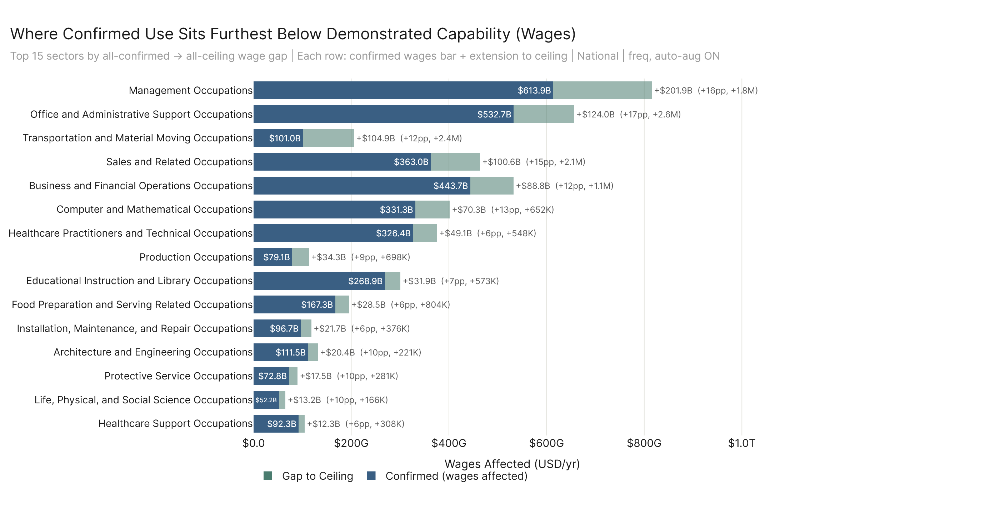
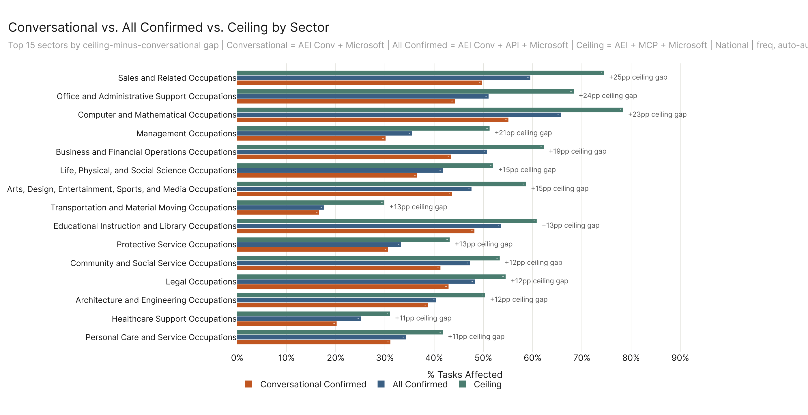

# Workforce Sig Meeting — Charts

---

## How Each Number Is Generated

**Example occupation — Chief Executives** (sample of 6 of 31 tasks shown; math at the bottom uses all 31)

| Occupation Tasks | AI Affected Task | Auto-Aug Score | Task Completions / Day |
|---|:---:|:---:|:---:|
| Administer programs for selection of sites, construction of buildings, or provision of equipment or supplies. | ✗ | — | 0.25 |
| Analyze operations to evaluate performance of a company or its staff in meeting objectives or to determine areas of potential cost reduction, program improvement, or policy change. | ✓ | 4.70 | 0.58 |
| Represent organizations or promote their objectives at official functions or delegate representatives to do so. | ✓ | 2.57 | 0.19 |
| Conduct or direct investigations or hearings to resolve complaints or violations of laws, or testify at such hearings. | ✓ | 2.47 | 0.26 |
| Deliver speeches, write articles, or present information at meetings or conventions to promote services, exchange ideas, or accomplish objectives. | ✓ | 3.56 | 0.36 |
| Interpret and explain policies, rules, regulations, or laws to organizations, government or corporate officials, or individuals. | ✓ | 5.00 | 0.74 |

**The math** (all 31 tasks, 16 AI-affected):

For each AI-affected task: AI weight = (task completions / day) × (auto-aug ÷ 5)

Σ AI-weighted across 16 AI tasks = **7.14**  |  Σ task completions across all 31 tasks = **14.10**

7.14 ÷ 14.10 = **50.7% task completions AI affected**

50.7% × 172,469 workers = **87,400 workers affected**

87,400 workers × $206,420 median wage = **$18.0B wages affected**

---

---

---

---

---

---

---

---

---

