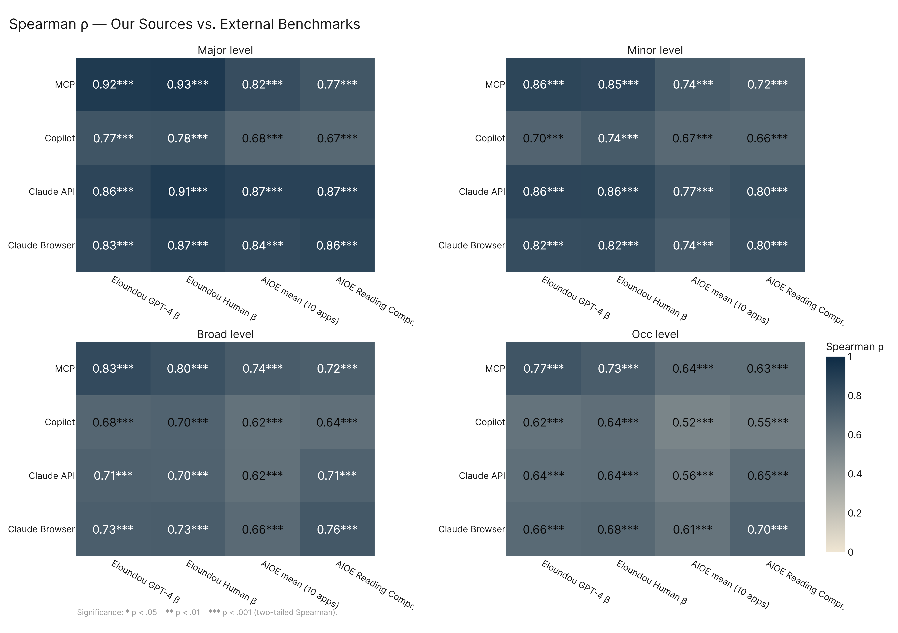
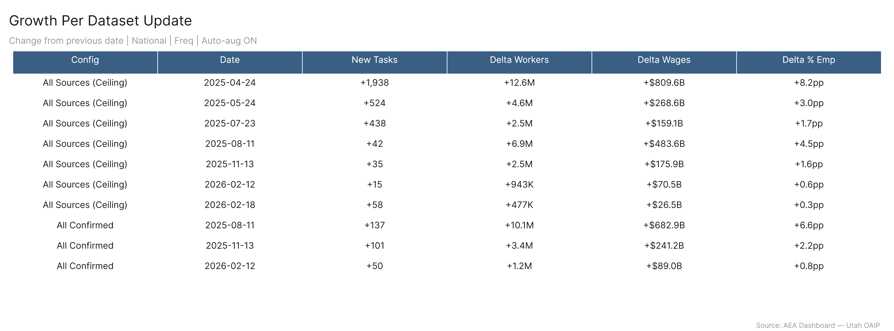
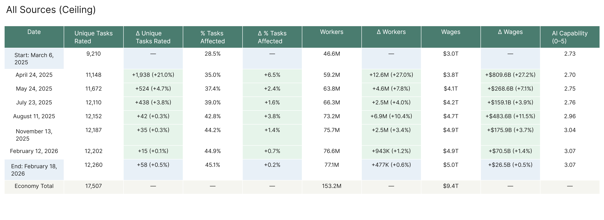
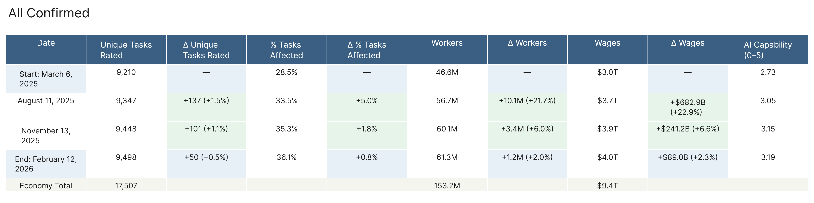
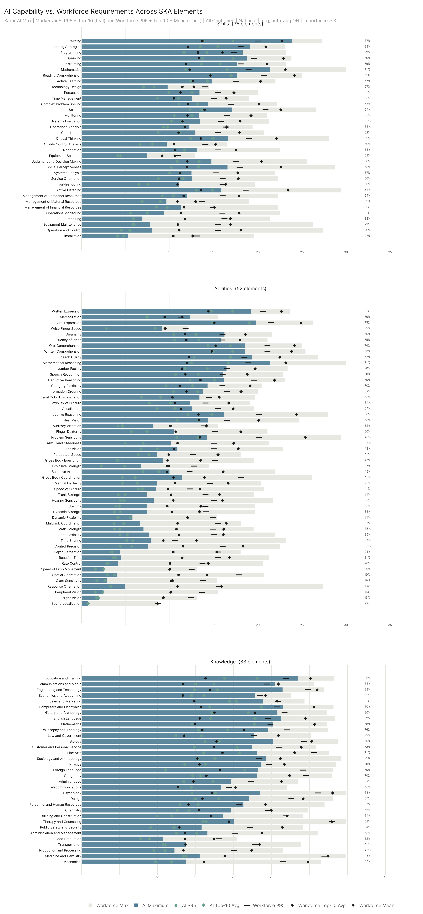

# All Paper Charts

Mirror of every figure currently in `analysis/paper/results/part_1/figures/`, `part_2/figures/`, and `part_3/figures/`. No prose — just charts. Regenerated by `run.py`.

---

## Part 1 — Scale, Convergence, Growth

### convergence.png

### convergence_external.png

### overview.png

### temporal_deltas.png

### temporal_table_all_ceiling.png

### temporal_table_all_confirmed.png

### temporal_trend.png

---

## Part 2 — Characterization

### gwa_exposure.png

### job_zone_violin.png

### major_categories.png

### phys_info_divide.png

### ska_levels.png

---

## Part 3 — Action

### conv_confirmed_ceiling_gap.png

### intensity_anchor_fulleco.png

### tech_commodities.png

