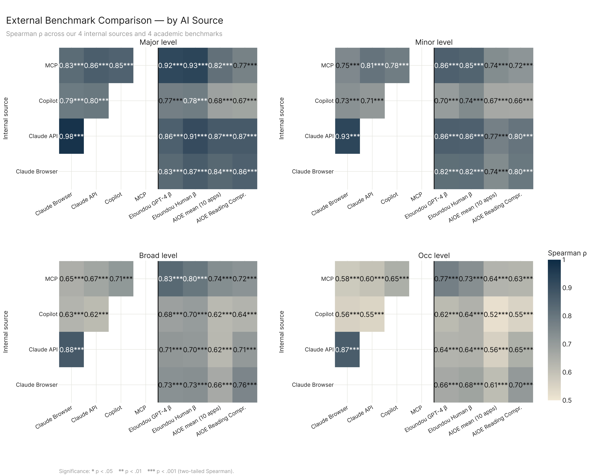
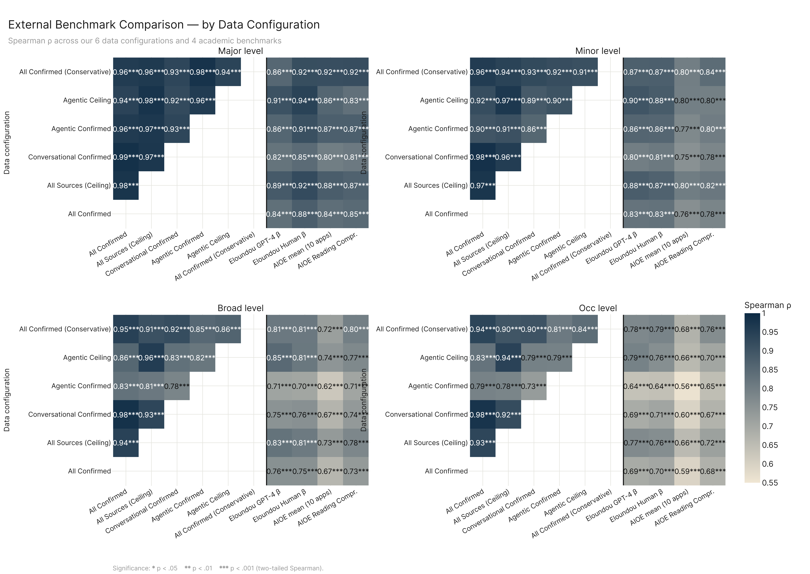
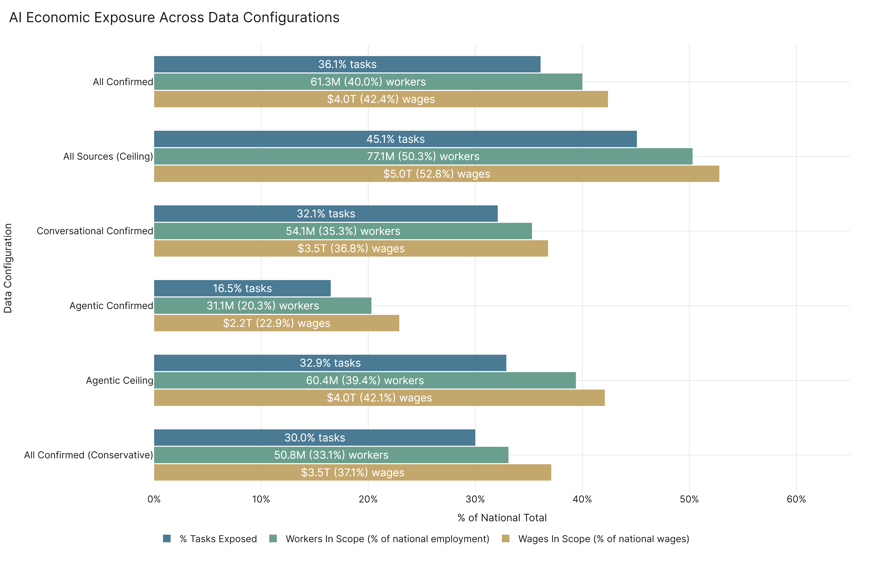
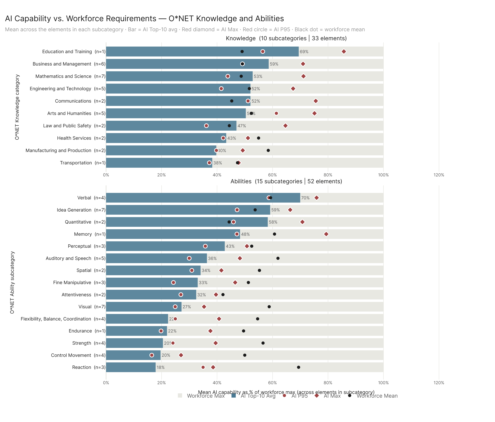
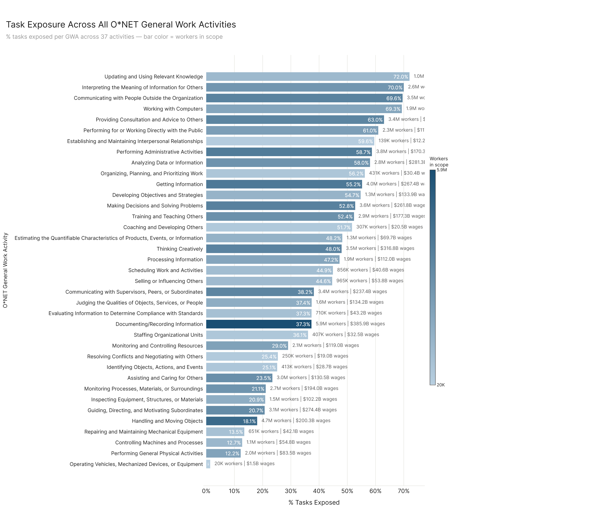
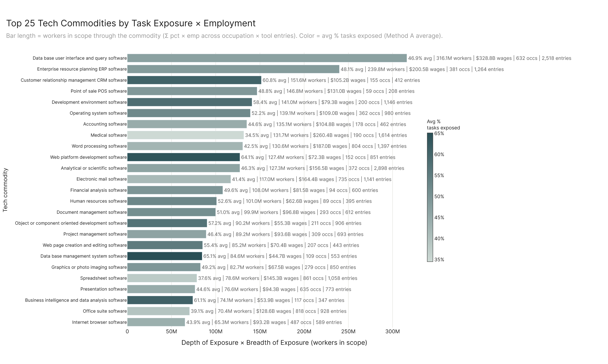
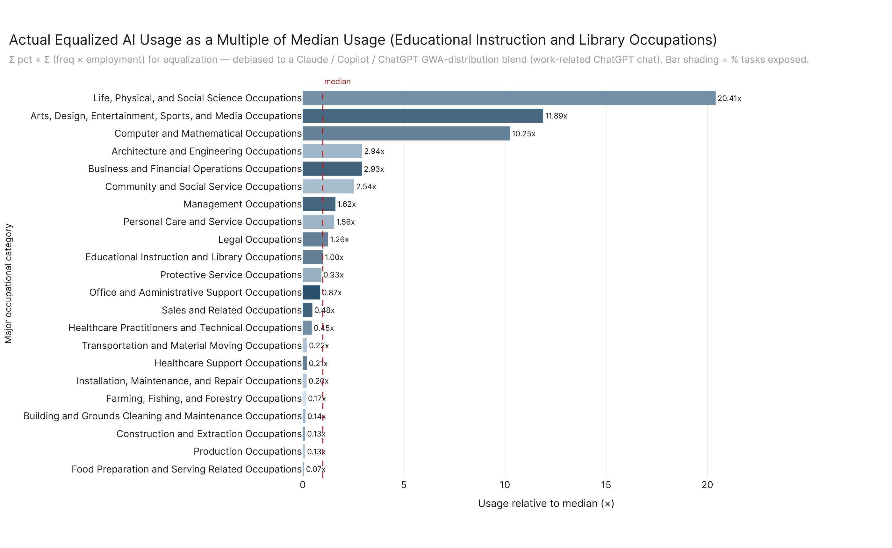

# All Paper Charts

Mirror of every figure currently in `analysis/paper/results/part_1/figures/`, `part_2/figures/`, and `part_3/figures/`. No prose — just charts. Order follows `paper/results/results.md`. Regenerated by `run.py`.

---

## Part 1 — Scale, Convergence, Growth

### convergence.png

### convergence_configs.png

### overview.png

### temporal_trend.png

### temporal_tables.png

---

## Part 2 — Characterization

### phys_info_divide.png

### job_zone_violin.png

### ska_skills.png

### ska_knowledge_abilities.png

### gwa_exposure.png

### major_categories.png

---

## Part 3 — Action

### conv_confirmed_ceiling_gap.png

### tech_commodities.png

### risk_score_5f.png

### intensity_anchor_fulleco.png

