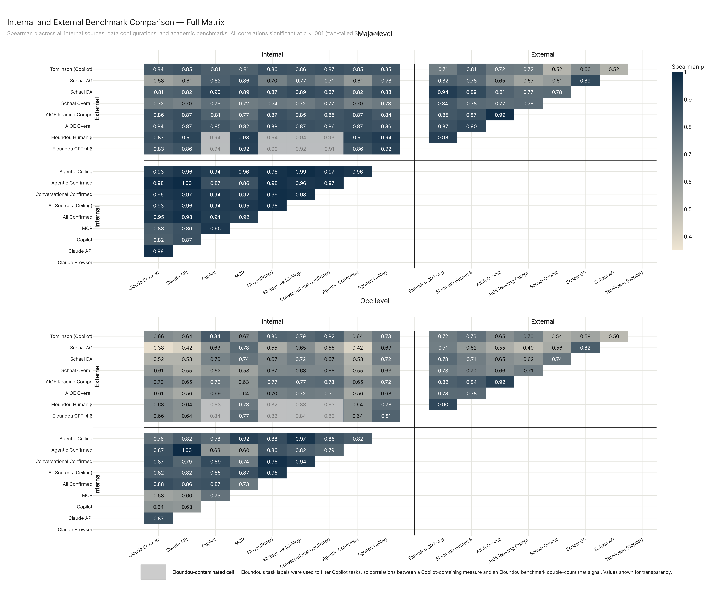
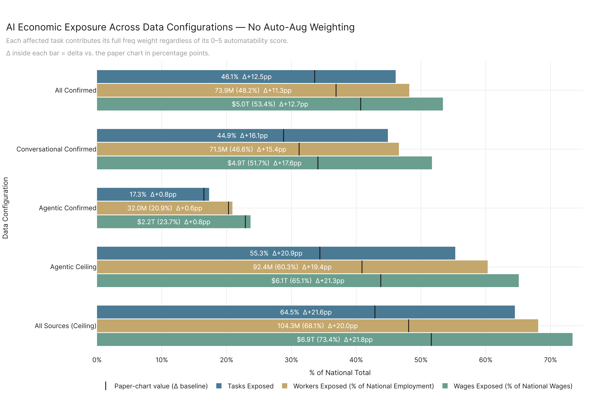

# Appendix figures

Auxiliary charts not in the main results. Generated by `run.py`.

---

## phys_zone_faceted

---

## ska_full

---

## nonphys_gwa_diff_phys_excluded

Within the 409 non-physical occupations, the General Work Activity composition that separates the high-exposure quartile from the low-exposure quartile, computed over only the non-physical tasks of each occupation. The chart functions as a robustness test on the raw composition diff: if the same GWAs appear here as in the raw chart, the structural signal is not a pct_physical residual proxy.

---

## major_de_nt_plane

Each of the 22 SOC major occupational categories plotted on the demand-elasticity × new-task-creation plane (LLM-rated task properties, 1–5 scale, averaged per major over unique tasks). Dot size scales with workers affected; color encodes the major's All-Confirmed % tasks affected. Dashed lines at the per-axis medians split the plane into four readable quadrants.

---

## convergence_full

Combined version of the two main convergence charts (Part 1 — `convergence` and `convergence_configs`): the four internal AI sources and five `ANALYSIS_CONFIGS` data configurations are stacked on a single y-axis (9 rows). The x-axis carries those same nine measures as a lower-triangular internal block, then the gap column, then the eight external academic benchmarks. Cell rendering, group headers, and the Eloundou-contamination gray-out match the main paper charts exactly.

---

## overview_no_autoaug

Paper part_1 `overview` recomputed with `use_auto_aug=False`. Each affected task contributes its full freq weight regardless of its 0–5 automatability score. Inside-bar text carries `Δ±X.Xpp` vs. the paper chart; black tick marks the paper-chart value's position on each bar.

---

## Within-non-phys discrimination — friction × weight

Cohen's d on the same top vs bottom exposure quartile of the 409 non-physical occupations (n=103 each), with each friction-property composite computed as a per-occ weighted mean across the occ's unique tasks. Negative d = top quartile lower on the property (predicted friction direction).

| composite | × 1 (raw) | × freq | × imp | × rel | × value (freq×imp×rel) |
| --- | --- | --- | --- | --- | --- |
| r — risk | -1.35 | -1.22 | -1.34 | -1.35 | -1.19 |
| tf — trust friction | -0.86 | -0.76 | -0.87 | -0.86 | -0.73 |
| df — deployment friction | -0.98 | -0.89 | -0.98 | -0.97 | -0.86 |
| sum (r+tf+df) | -1.51 | -1.35 | -1.51 | -1.52 | -1.31 |
| mean (r+tf+df)/3 | -1.51 | -1.35 | -1.51 | -1.52 | -1.31 |
| product r·tf·df | -1.50 | -1.37 | -1.49 | -1.52 | -1.34 |
| inverted-mult (6-r)·(6-tf)·(6-df) | +1.40 | +1.20 | +1.40 | +1.39 | +1.15 |

Reading: every three-property combination of r/tf/df hits |d| ≈ 1.5; single props top out at 1.35. Choice of weight barely matters (× freq drags d down ~0.15; × imp and × rel are within rounding error of raw; × value is consistently the weakest). The combination is what carries the signal, not the algebraic form, and not the per-task weight.

---

## Within-non-phys discrimination — capability × weight

Same shape as the friction table but on the three capability enablers (m / d / s). Predicted direction: top quartile HIGHER on capability (positive d). Composites include each prop alone, the sum / mean of all three, the slim two-prop products (d·s, d·m, m·s), and the audit_task_properties Composite B (d·m·s).

| composite | × 1 (raw) | × freq | × imp | × rel | × value (freq×imp×rel) |
| --- | --- | --- | --- | --- | --- |
| m — measurability | +0.07 | +0.15 | +0.10 | +0.09 | +0.19 |
| d — data abundance | +0.47 | +0.60 | +0.52 | +0.47 | +0.62 |
| s — algorithmic similarity | +0.66 | +0.72 | +0.71 | +0.66 | +0.76 |
| sum (m+d+s) | +0.38 | +0.47 | +0.43 | +0.39 | +0.51 |
| mean (m+d+s)/3 | +0.38 | +0.47 | +0.43 | +0.39 | +0.51 |
| product d·s | +0.61 | +0.70 | +0.66 | +0.61 | +0.73 |
| product d·m | +0.29 | +0.38 | +0.32 | +0.30 | +0.41 |
| product m·s | +0.35 | +0.43 | +0.39 | +0.37 | +0.47 |
| product d·m·s  (Composite B from audit_task_properties) | +0.44 | +0.53 | +0.47 | +0.45 | +0.56 |

Reading: `s` alone is the strongest single discriminator (|d| = 0.66 raw → 0.76 × value). `d` is second (0.48 → 0.62). `m` is essentially noise within non-phys (|d| < 0.20). Adding `m` to anything *hurts* (d·m < d alone; m·s < s alone). Composite B (d·m·s) is worse than `s` alone. The audit_task_properties result that `s` carries most of the capability signal holds inside non-phys too, and the lift from layering `d` on top of `s` is small. Notably, capability d-values top out at 0.76 — meaningfully smaller than the 1.51 the friction composites reach. **Inside non-phys, friction discriminates exposure better than capability does.**

---

## Property × pct_physical × pct_tasks_affected — Spearman ρ

How much each LLM-rated property tracks (a) pct_physical and (b) pct_tasks_affected, both economy-wide (n=923) and inside the non-physical cut (n=409). The economy-wide columns show capability and forward-looking props are heavily entangled with the phys/non-phys split; the within-non-phys columns show how much *direct* discriminative signal each prop carries after that cut.

| property | ρ vs phys (all eco, n=923) | ρ vs pct (all eco, n=923) | ρ vs phys (non-phys, n=409) | ρ vs pct (non-phys, n=409) |
| --- | --- | --- | --- | --- |
| m | +0.12 | +0.00 | +0.10 | +0.03 |
| d | -0.59 | +0.58 | -0.12 | +0.20 |
| s | -0.67 | +0.67 | -0.12 | +0.25 |
| h | -0.23 | +0.30 | -0.01 | +0.18 |
| e | -0.40 | +0.23 | -0.12 | -0.23 |
| r | -0.02 | -0.16 | +0.05 | -0.44 |
| tf | -0.41 | +0.21 | -0.05 | -0.27 |
| df | +0.03 | -0.15 | +0.02 | -0.34 |
| t | -0.56 | +0.42 | -0.22 | -0.09 |
| ac | -0.62 | +0.46 | -0.12 | -0.18 |
| de | -0.59 | +0.52 | -0.09 | +0.08 |
| nt | -0.62 | +0.43 | -0.18 | -0.23 |

Reading, in order:
1. **Economy-wide, capability props are strongly negative against pct_physical** (s = −0.67, d = −0.59, m = +0.12 is the outlier). Every forward-looking prop (de, nt, ac) sits at −0.59 to −0.62. These props are partially proxying the cognitive/physical cut.
2. **Economy-wide vs pct_tasks_affected mirrors that:** s = +0.67, d = +0.58, de = +0.52. The same props that anti-correlate with pct_physical positively correlate with exposure.
3. **Inside non-phys, capability ρ-vs-phys collapses to |ρ| ≤ 0.13.** There's not much pct_physical residual to leak through, which is consistent with the chart-0 diagnostic finding that pct_physical leaves ~89% of within-non-phys variance unexplained.
4. **Inside non-phys, friction wins for direct discrimination:** r = −0.44, df = −0.34, tf = −0.27 against pct. The strongest capability prop is s at +0.25. So once you cut to non-phys, the discriminative work shifts from capability to friction.
