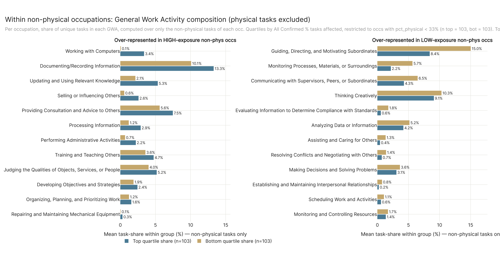
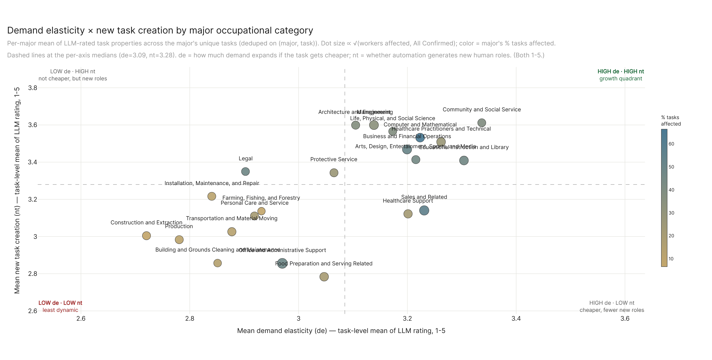

# Appendix figures

Auxiliary charts not in the main results. Generated by `run.py`.

---

## phys_zone_faceted

---

## ska_full

---

## nonphys_gwa_diff_phys_excluded

Within the 409 non-physical occupations, the General Work Activity composition that separates the high-exposure quartile from the low-exposure quartile, computed over only the non-physical tasks of each occupation. The chart functions as a robustness test on the raw composition diff: if the same GWAs appear here as in the raw chart, the structural signal is not a pct_physical residual proxy.

---

## major_de_nt_plane

Each of the 22 SOC major occupational categories plotted on the demand-elasticity × new-task-creation plane (LLM-rated task properties, 1–5 scale, averaged per major over unique tasks). Dot size scales with workers affected; color encodes the major's All-Confirmed % tasks affected. Dashed lines at the per-axis medians split the plane into four readable quadrants.

