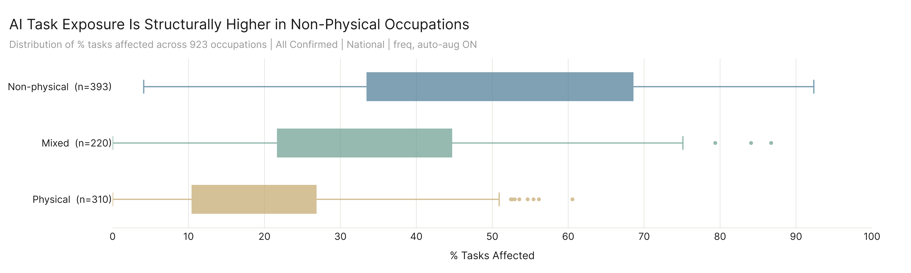
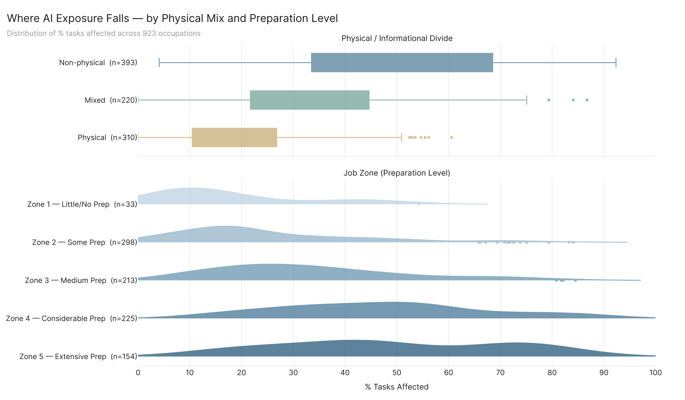
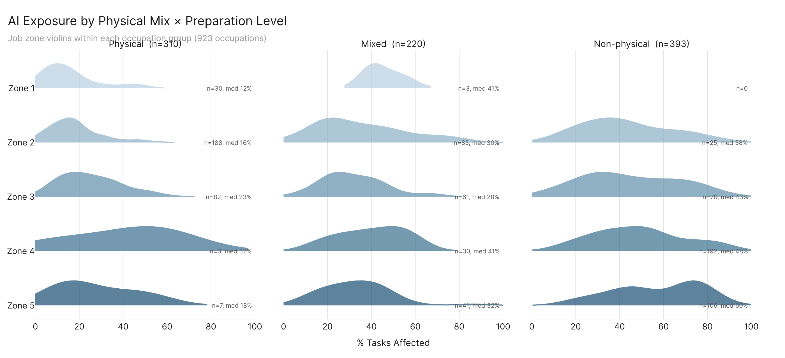

# Part 2 — Where AI Exposure Falls

---

## The Physical/Informational Divide

The most basic structural question about AI exposure is whether it respects the divide between physical and informational work. It does, and it's not subtle. Occupations where fewer than a third of tasks are physical (409 occupations, roughly 44% of the total) have a median AI task exposure of 47.1%. Occupations where more than two-thirds of tasks are physical (300 occupations) sit at 7.5% median. Mixed occupations (214, those in the 33-67% physical range) land at 24.2%. The interquartile ranges barely overlap: non-physical occupations' Q1 (31.5%) is above the physical group's Q3 (13.8%).

This isn't a finding about AI preferring white-collar work in some vague sense. It's a measurement of where current AI systems are actually being used. The data comes from confirmed conversation logs, API usage, and enterprise assessment, not from theoretical capability scoring. When real people and real systems interact with AI to accomplish work tasks, the tasks they're accomplishing are overwhelmingly informational. The physical occupations that do show up with moderate exposure (the outliers reaching 50-60% in the box plot) tend to be ones where the informational component of the job is substantial despite the physical classification (think supervisory roles in construction or equipment inspection).

---

## Job Zone and Preparation Level

Job zone is O*NET's classification of how much preparation an occupation requires: Zone 1 is little or no preparation, Zone 5 is extensive (think physicians, lawyers, senior engineers). The relationship between preparation level and AI exposure is not linear, and the shape matters.

Zone 1 (33 occupations) sits at a median of 13.3%. Zone 2 (298 occupations) at 20.0%. Zone 3 (213) at 30.4%. Then the curve flattens: Zone 4 (225 occupations, considerable preparation) hits 47.0% median, and Zone 5 (154, extensive preparation) also sits at 47.0%. The means tell a slightly different story (Zone 5 at 49.1% vs Zone 4 at 47.4%) because Zone 5 has a heavier right tail, with more occupations pushed above 60%.

The finding worth sitting with is that AI exposure peaks in the occupations that require the most education and training, not the least. This runs counter to the popular framing of AI as a threat primarily to low-skill work. The occupations most affected are the ones where workers have invested the most in specialized preparation. Whether that exposure represents augmentation or substitution risk depends on factors this data doesn't resolve, but the structural pattern is clear: current AI capability overlaps most heavily with the tasks performed by the most educated workers.

---

## SKA Levels: AI Capability vs. Workforce Requirements

The SKA (Skills, Knowledge, Abilities) chart asks a different question than the exposure metrics. Instead of "what percentage of tasks does AI touch," it asks "for each specific skill, knowledge domain, or ability that occupations require, how does AI's demonstrated capability compare to what the workforce actually needs?"

The answer depends heavily on which domain you're looking at. In knowledge (33 elements), AI's maximum demonstrated capability exceeds the economy-wide average requirement for 88% of elements. Education and Training leads at 86% of workforce max, followed by Computers and Electronics (80%) and Engineering and Technology (83%). The bottom of the knowledge chart is exclusively physical-world domains: Food Production, Production and Processing, Mechanical. AI knows a lot about a lot of things, but its knowledge advantage is concentrated in informational and analytical domains.

Skills (35 elements) show a more mixed picture: 71% of elements have AI max above economy mean. Writing leads (87% of workforce max), followed by Mathematics (71%) and Learning Strategies (83%). The bottom cluster is entirely hands-on: Installation (27%), Repairing (32%), Equipment Selection (58%). The physical/informational divide from the first chart shows up again here at the element level.

Abilities (52 elements) are where AI's reach is most limited. Only 44% of ability elements have AI max above the economy mean. Mathematical Reasoning leads (71% of workforce max), but most physical and perceptual abilities (Sound Localization at 9%, Night Vision at 15%, Peripheral Vision at 16%) are near zero. This makes sense: abilities represent the underlying capacities that make tasks possible, and many of those capacities are fundamentally embodied.

The workforce reference markers (P95 ticks, top-10 diamonds, economy mean circles) provide the context that makes these numbers interpretable. An AI capability at 70% of workforce max sounds high until you see that the P95 marker (what the top practitioners in the economy actually need) is at 85%. The gap between AI capability and what the most demanding occupations require remains substantial across most elements, even where AI clearly exceeds the typical requirement.

---

## Work Activity Exposure

The General Work Activity classification breaks down all occupational work into 41 categories (technically 37 with non-zero values in the data). This chart shows what kinds of work AI is touching, ranked by % tasks affected. The color gradient maps to workers affected, so darker bars represent activities where AI exposure is both deep (high percentage) and wide (many workers).

The top cluster is informational and communicative: Updating and Using Relevant Knowledge (72.0%), Interpreting the Meaning of Information for Others (70.0%), Communicating with People Outside the Organization (69.6%), Working with Computers (69.3%). These are activities where AI has found the deepest footholds. The bottom cluster is physical and mechanical: Operating Vehicles (1.4%), Performing General Physical Activities (12.2%), Controlling Machines and Processes (12.7%).

But exposure percentage is only half the story, which is why the worker and wage annotations matter. Performing Administrative Activities ranks 8th by % tasks affected (58.7%) but reaches 3.8 million workers and $170B in wages. Making Decisions and Solving Problems sits at 52.8% but touches 3.6 million workers and $262B. These are activities embedded across nearly every occupation, so even moderate percentage exposure translates to massive economic scale.

The darkest bars (most workers) aren't always at the top. Handling and Moving Objects is only at 18.1% but represents 4.7 million workers, because so many occupations involve at least some material handling. The chart's color gradient makes these pockets visible in a way that a pure percentage ranking would miss.

---

## Major Occupational Categories

The three-panel view of all 22 major occupational categories shows the three metrics side by side: percentage of tasks affected, total workers in scope, and total wages in scope. Each panel tells a different part of the story, and the categories that lead on one metric don't necessarily lead on the others.

Computer and Mathematical occupations lead on % tasks affected at 65.7%, but rank 8th in workers (3.3M) and 5th in wages ($331B) because the sector is relatively small. Sales occupations rank 2nd on % tasks affected (59.5%) and jump to 2nd in workers (7.6M) because the sector is large. Office and Administrative Support ranks 4th on % tasks (51.1%) but 1st in workers (11.2M) and 2nd in wages ($533B) because it's the largest major category in the economy.

Management Occupations present an interesting case. At 35.5% task exposure, they rank 12th on percentage, below the median. But because management positions carry high wages, they rank 1st in wages affected ($614B) and 5th in workers (4.8M). AI exposure in management roles represents a relatively small share of the work but an outsized share of the economic value.

The bottom of all three panels converges: Farming, Fishing, and Forestry (13.7%, 41K workers, $1.7B wages) and Construction and Extraction (13.9%, 1.3M workers, $85.6B) consistently rank at or near the bottom. These are sectors where the work is fundamentally physical, and current AI systems have minimal demonstrated overlap with their task profiles.

---

## Combined View Drafts — Phys/Info + Job Zone

### Option A — Stacked panels (shared x-axis)

### Option B — Faceted by physical mix

