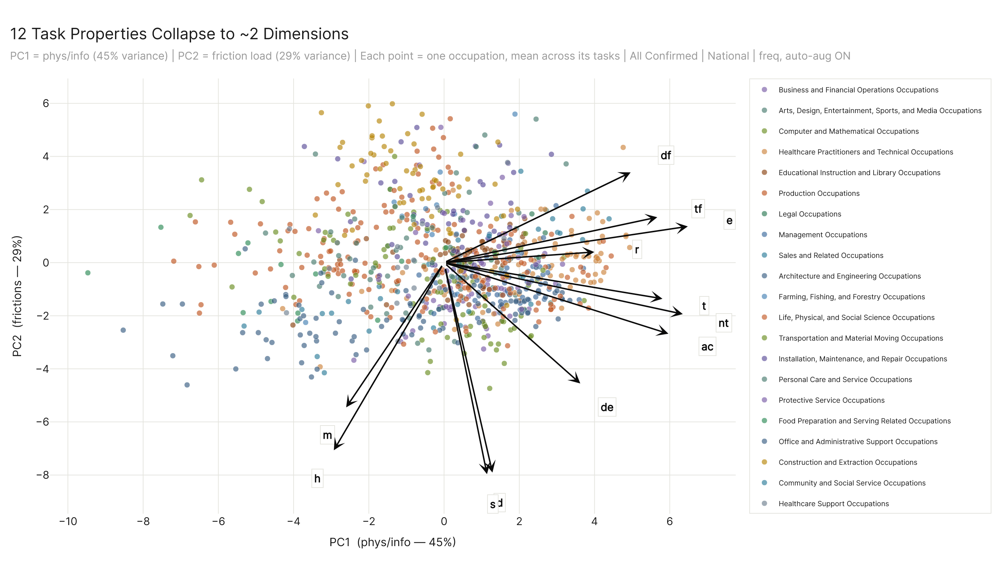
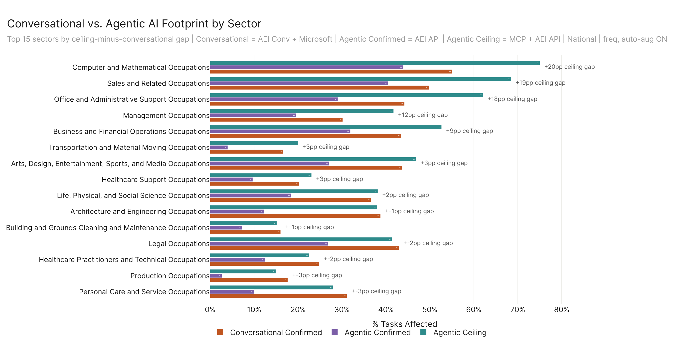
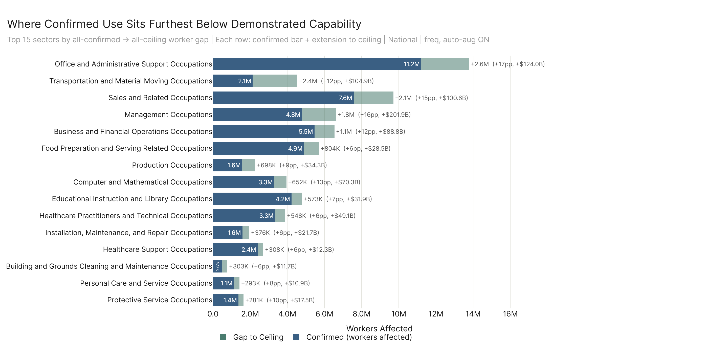
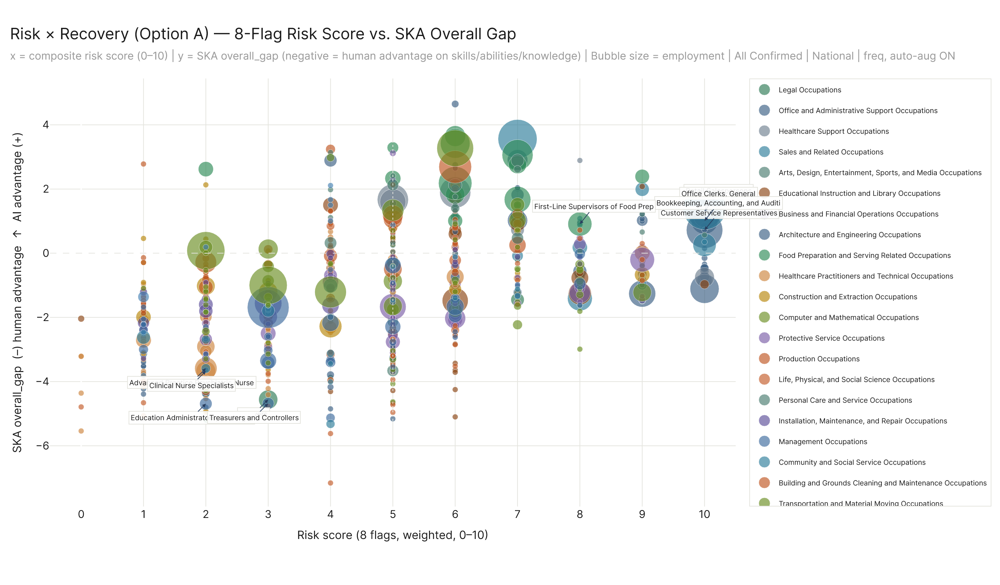
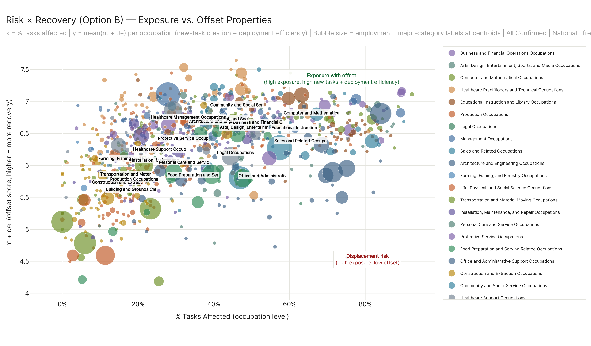
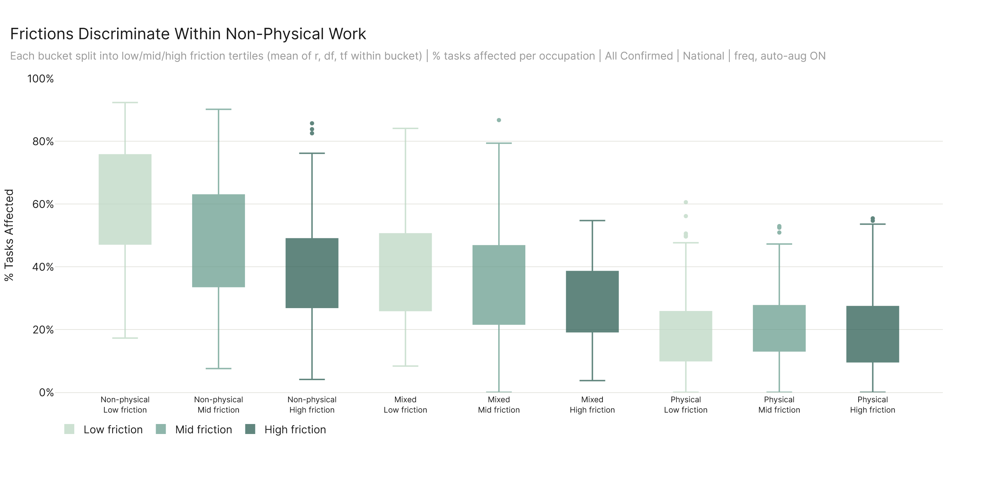
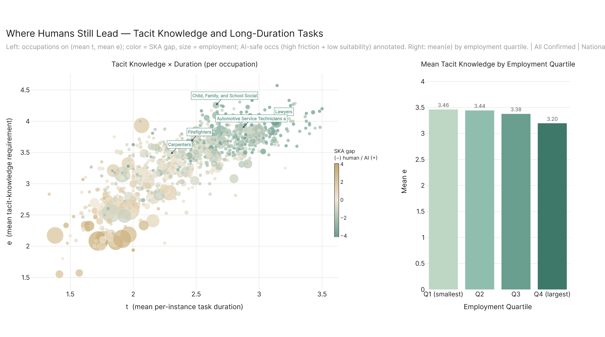

# Part 3 — Action: What To Do About It

---

## The 12 Properties Collapse to ~2 Dimensions

*Prose pending.*

---

## For Organizations

### Tech Commodities Where AI Has Reach

*Prose pending.*

### Conversational vs. Agentic Footprint

*Prose pending.*

### The Gap Between Confirmed Use and Demonstrated Capability

*Prose pending.*

---

## For Policy

### Risk × Recovery (Option A — 8-Flag Risk vs. SKA Gap)

*Prose pending.*

### Risk × Recovery (Option B — Exposure vs. Offset Properties)

*Prose pending.*

### Frictions Discriminate Within Non-Physical Work

*Prose pending.*

---

## For Individuals

### Where Humans Still Lead: Tacit Knowledge and Task Duration

*Prose pending.*

---

## The Augmentation-Regime Caveat

*Prose pending. Note: t and freq_mean are inversely related (Spearman ρ ≈ −0.32) — long-duration tasks happen less frequently. This affects how × t weighting compares to × freq weighting and is a methodological footnote on the charts above.*
