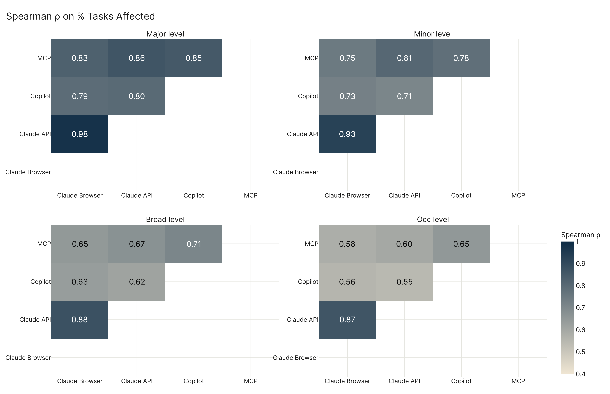
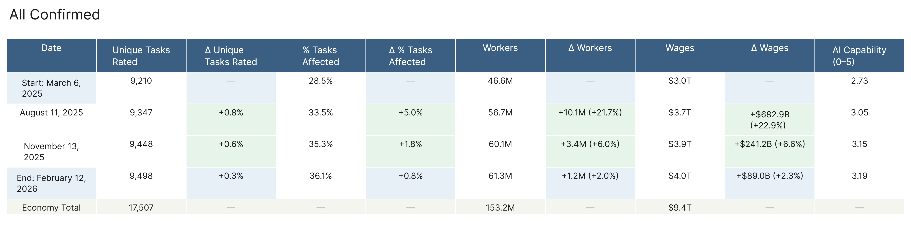
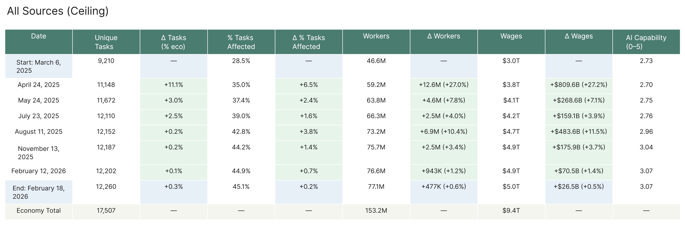

# Results

---

## Part 1 — Scale, Convergence, Growth

### The Overview

At the latest dataset version (February 2026), our primary configuration — confirmed AI usage across conversational, API, and Copilot activity — puts 61.3 million workers in scope, representing 40.0% of U.S. employment and $3.99 trillion in annual wages. The ceiling estimate, which extends that with MCP tool-use capability data, reaches 77.1 million workers, 50.3% of employment, and $4.97 trillion in wages. These are not projections of how much AI will eventually affect work — they are measurements of what we observe in AI system logs today, matched to standard occupational task records.

The five configurations show a deliberate spread across measurement approaches. The narrowest — agentic confirmed at 20.3% — captures only confirmed tool-use AI activity, the kind that requires workflow integration and API access rather than a simple chat session. Human conversational at 35.3% is Anthropic's conversational usage data only: the confirmed record of how workers use Claude in chat sessions for writing, research, and analysis. The combined confirmed view (40.0%) adds both API-based usage and Microsoft's Copilot task assessment to that conversational baseline, pulling three independent confirmed sources together. The agentic ceiling at 39.4% arrives at a similar number through a different path — capability mapping from AI tool specifications rather than usage logs. And the all-ceiling at 50.3% adds MCP on top of all of that, capturing the full frontier of what AI tools can demonstrably do.

The alignment at the top of that range with Seampoint's independent estimate — 51% of worker hours could be AI-augmented under governance-constrained deployment conditions — is not coincidental. Two frameworks built on entirely different data and methodology arrive at essentially the same number for how far AI's current reach extends. The agentic-confirmed figure (20.3%) similarly matches Seampoint's more conservative takeover rate (20%), which represents the fraction of tasks AI could handle entirely without human collaboration. Both alignments suggest the two frameworks are capturing the same underlying reality from different directions.

---

### The Convergence Argument

Scale numbers matter, but they're only compelling if they hold up across different ways of approaching the same underlying question. The convergence chart makes a different argument than the scale chart: not *how much*, but *how confident*.

Four data sources enter the correlation analysis — Claude browser usage (AEI conversational), Claude API usage (AEI agentic), Microsoft Copilot task assessment, and MCP tool-use capability mapping. These measure related but distinct things: observed behavior in chat sessions, developer-driven API workflows, enterprise productivity tool usage, and capability specifications for thousands of AI tool integrations. At the major occupational category level, Spearman rank correlations — which measure whether two sources agree on the ordering of occupations, where 1.0 is perfect agreement and 0 is no relationship — range from 0.79 to 0.98 across all six source pairs, with a mean of 0.85. That's strong agreement across sources measuring from fundamentally different angles.

The correlation structure is interpretable. The two Claude-based sources — browser and API — track each other most closely at 0.98, which isn't surprising: they share model architecture and partly overlap in user population even though one captures chat usage and the other tool-calling. The weakest major-level pair is Copilot vs. Claude browser at 0.79. That 0.79 is still a strong correlation — it means that when you rank the 22 major occupational categories by AI exposure in Microsoft's enterprise data versus Anthropic's conversational usage data, the rankings align closely despite entirely different platforms, methodologies, and user populations.

The agreement degrades predictably as you zoom in. At the occupation level (923 categories), the mean correlation falls to 0.64, and the weakest pairs sit around 0.55. Zero occupations appear in the top 30 of all four sources simultaneously. This isn't a data quality problem — it's structural. Each source measures a different dimension of AI exposure, and those dimensions don't map to the same occupations even when they map to the same sectors. Any occupation-level claim needs source attribution.

Six major occupational categories are placed in the high-exposure tier by all four sources: Computer and Mathematical, Office and Administrative Support, Sales, Business and Financial Operations, Arts and Design, and Life/Physical/Social Science. Ten major categories show consistently low exposure across every source: construction, farming, food prep, both healthcare groups, installation and maintenance, personal care, production, protective service, and transportation. The sources agree as strongly on what AI doesn't do as on what it does — and that double consensus is the clearest signal the measurement framework is tracking something real.

---

### The Temporal Argument

The March 2025 all-confirmed estimate put 46.6 million workers in scope — 30.4% of employment. By February 2026, it sits at 61.3 million workers and 40.0%. That's 14.7 million additional workers in eleven months. The jobs themselves haven't changed — AI has found more footholds in existing tasks.

The growth isn't smooth. In the confirmed series, the August 2025 dataset accounts for the biggest jump: +10.1 million workers, +6.6 percentage points in a single snapshot. November 2025 adds 3.4 million more. February 2026 adds 1.2 million. Each step is smaller than the last. Whether that reflects a genuine slowdown in AI adoption or simply that this window hasn't yet seen a new adoption wave, the data doesn't say — both are consistent with the pattern.

The ceiling series follows a different path. Its earliest jump — April 2025, +12.6 million workers, +8.2 percentage points — came from the first MCP dataset incorporation, not adoption growth. MCP added a large tranche of task coverage at once because it's a capability specification dataset, not a usage log. Subsequent ceiling increments have been smaller. The ceiling ends the window at 50.3%, while confirmed sits at 40.0% — a roughly 10-percentage-point gap of work AI can demonstrably do but that hasn't yet appeared in confirmed usage records.

The confirmed-to-ceiling ratio has been narrowing: 77% in August 2025, 80% by February 2026. Confirmed usage is growing slightly faster than the ceiling, meaning deployment is slowly catching up to demonstrated capability. Whether that gap closes — and how fast — depends on factors this data doesn't resolve: how much of the ceiling represents AI capability that organizations will eventually deploy versus capability that stays theoretical.

---

## Part 2 — [TBD: Characterization]

*Content pending.*

---

## Part 3 — [TBD: Action]

*Content pending.*
