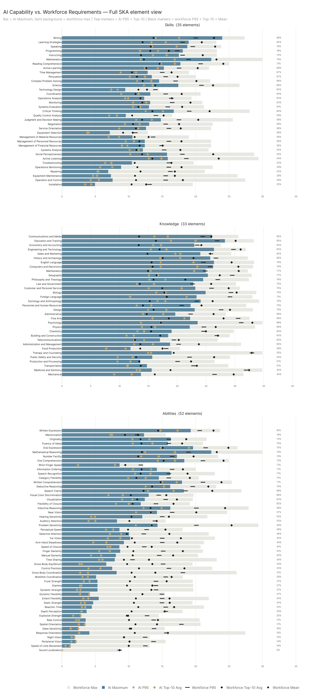
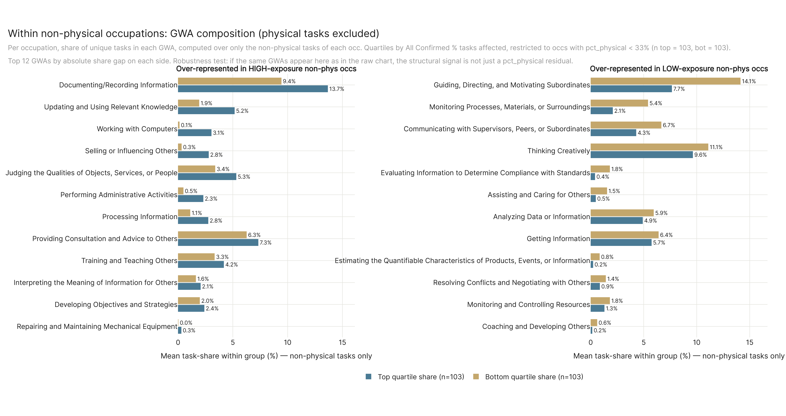

# Results

### External Benchmark Comparison — by AI Source

### External Benchmark Comparison — by Data Configuration

### AI Economic Exposure Across Data Configurations

### All Confirmed vs All Sources (Ceiling) Over Time

### Major Occupational Categories (with Physical / Non-Physical Structural Lens)

### Major Occupational Categories — 2-Year Trend Projection

### Job Zone and Preparation Level

### SKA Levels: AI Capability vs. Workforce Requirements

### Work Activity Exposure

### Conv → Confirmed → Ceiling Reach by Major Sector

### Tech Commodities Where AI Has Reach

### Occupations Most At Risk Of Displacement

### State Exposure vs. Most-At-Risk Concentration

### AI Usage Intensity by Sector

### Appendix — Full Convergence Matrix

### Appendix — Overview Without Auto-Aug

### Appendix — Temporal Trend (Non-Physical Only)

### Appendix — Full Element-Level SKA

### Appendix — Non-Physical GWA Composition Gap

