# Results — Dense Prose (Number-Only)

This file mirrors `results.md` but replaces every figure caption with a verbal transcription of the chart's contents. Each section enumerates every bar/segment/point shown, with the actual values. It exists so an LLM can "read" the charts via prose, without seeing the PNGs. Interpretation is held to a minimum; the numbers are the point.

All numbers are pulled directly from the CSVs in each part's `results/` directory, which is what the figure scripts use to draw the charts.

Conventions used below:
- pp = percentage points
- M = million, K = thousand, B = billion, T = trillion
- All Confirmed and All Sources (Ceiling) refer to the primary all_confirmed (AEI Conv + AEI API + Microsoft, no MCP) and all_ceiling (AEI + MCP + Microsoft) analysis configs unless noted otherwise.
- Snapshot baseline for headline values is 2026-02-12 (All Confirmed) and 2026-02-18 (All Ceiling).

---

## Part 1 — Scale, Convergence, Growth

### External Benchmark Comparison — by AI Source

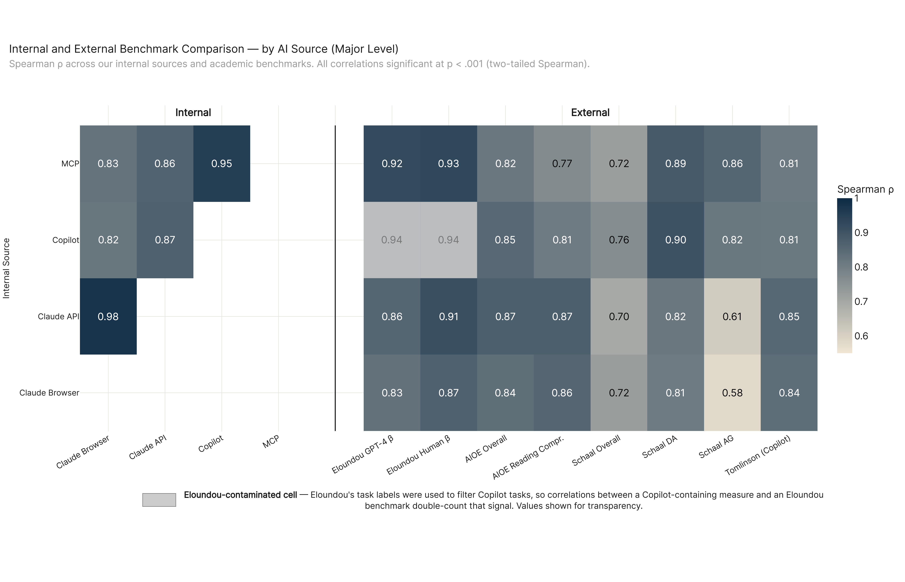

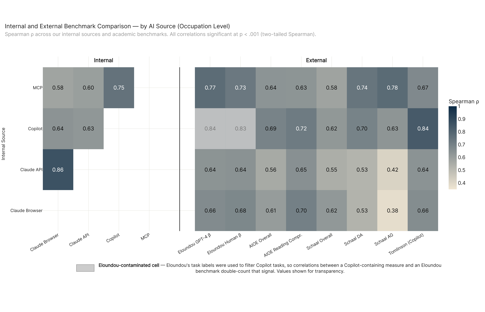

This figure is a 2×2 grid of four lower-triangle Spearman correlation heatmaps. Each panel is one aggregation level (top-left major, top-right minor, bottom-left broad, bottom-right occupation). Each panel shows pairwise rank correlations between four independent AI scoring sources: Claude Browser (AEI Conv 2026-02-12), Claude API (AEI API 2026-02-12), Copilot (Microsoft), and MCP (MCP Cumul. v4). All values significant at p<0.001.

**Major level (n=22 categories):**
- Claude API ↔ Claude Browser: ρ = 0.98
- Copilot ↔ Claude Browser: ρ = 0.79
- Copilot ↔ Claude API: ρ = 0.80
- MCP ↔ Claude Browser: ρ = 0.83
- MCP ↔ Claude API: ρ = 0.86
- MCP ↔ Copilot: ρ = 0.85

**Minor level (n=95):**
- API ↔ Browser: 0.93
- Copilot ↔ Browser: 0.73
- Copilot ↔ API: 0.71
- MCP ↔ Browser: 0.75
- MCP ↔ API: 0.81
- MCP ↔ Copilot: 0.78

**Broad level (n=439):**
- API ↔ Browser: 0.88
- Copilot ↔ Browser: 0.63
- Copilot ↔ API: 0.61
- MCP ↔ Browser: 0.65
- MCP ↔ API: 0.67
- MCP ↔ Copilot: 0.71

**Occupation level (n=923):**
- API ↔ Browser: 0.87
- Copilot ↔ Browser: 0.56
- Copilot ↔ API: 0.55
- MCP ↔ Browser: 0.58
- MCP ↔ API: 0.60
- MCP ↔ Copilot: 0.65

Range across all 24 cells: 0.55 to 0.98. Highest pair at every level: Claude API ↔ Claude Browser (drops from 0.98 at major to 0.87 at occupation). Lowest pair at the finest level: Copilot ↔ Claude API at 0.55 at occupation.

---

### External Benchmark Comparison — by Data Configuration

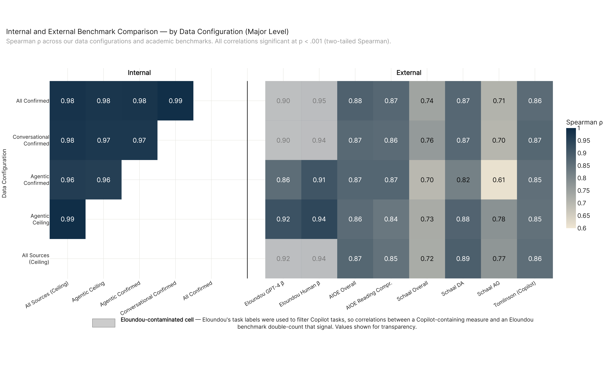

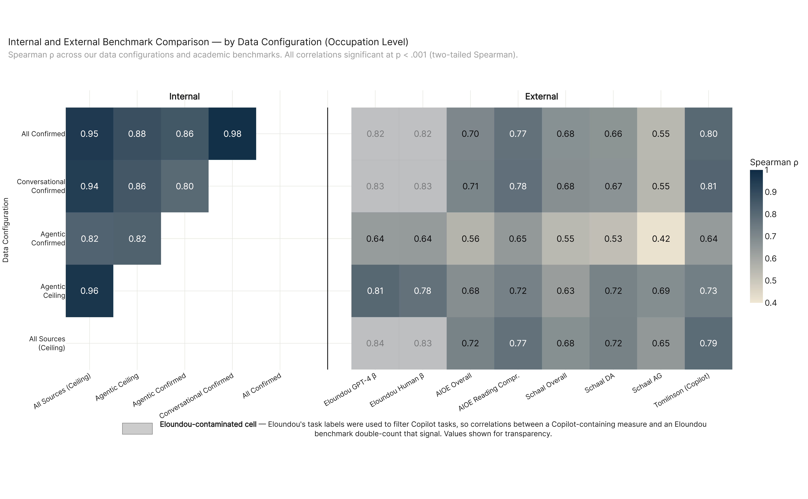

Same 2×2 grid structure, but the sources are the five canonical analysis configs (All Confirmed, All Sources (Ceiling), Conversational Confirmed, Agentic Confirmed, Agentic Ceiling). Lower-triangle 5×5 heatmaps. 10 unique pairwise correlations per panel.

**Major level (n=22):**
- All Sources (Ceiling) ↔ All Confirmed: 0.97
- Conversational Confirmed ↔ All Confirmed: 0.98
- Conversational Confirmed ↔ All Sources (Ceiling): 0.98
- Agentic Confirmed ↔ All Confirmed: 0.98
- Agentic Confirmed ↔ All Sources (Ceiling): 0.96
- Agentic Confirmed ↔ Conversational Confirmed: 0.95
- Agentic Ceiling ↔ All Confirmed: 0.96
- Agentic Ceiling ↔ All Sources (Ceiling): 0.99
- Agentic Ceiling ↔ Conversational Confirmed: 0.96
- Agentic Ceiling ↔ Agentic Confirmed: 0.96

**Minor level (n=95):**
- Ceiling ↔ Confirmed: 0.97
- Conv. Conf ↔ Confirmed: 0.99
- Conv. Conf ↔ Ceiling: 0.97
- Agentic Conf ↔ Confirmed: 0.91
- Agentic Conf ↔ Ceiling: 0.91
- Agentic Conf ↔ Conv. Conf: 0.90
- Agentic Ceil ↔ Confirmed: 0.94
- Agentic Ceil ↔ Ceiling: 0.98
- Agentic Ceil ↔ Conv. Conf: 0.93
- Agentic Ceil ↔ Agentic Conf: 0.91

**Broad level (n=439):**
- Ceiling ↔ Confirmed: 0.95
- Conv. Conf ↔ Confirmed: 0.99
- Conv. Conf ↔ Ceiling: 0.94
- Agentic Conf ↔ Confirmed: 0.85
- Agentic Conf ↔ Ceiling: 0.82
- Agentic Conf ↔ Conv. Conf: 0.81
- Agentic Ceil ↔ Confirmed: 0.89
- Agentic Ceil ↔ Ceiling: 0.97
- Agentic Ceil ↔ Conv. Conf: 0.88
- Agentic Ceil ↔ Agentic Conf: 0.82

**Occupation level (n=923):**
- Ceiling ↔ Confirmed: 0.94
- Conv. Conf ↔ Confirmed: 0.98
- Conv. Conf ↔ Ceiling: 0.94
- Agentic Conf ↔ Confirmed: 0.81
- Agentic Conf ↔ Ceiling: 0.79
- Agentic Conf ↔ Conv. Conf: 0.76
- Agentic Ceil ↔ Confirmed: 0.87
- Agentic Ceil ↔ Ceiling: 0.96
- Agentic Ceil ↔ Conv. Conf: 0.85
- Agentic Ceil ↔ Agentic Conf: 0.79

Range across all 40 pair-cells: 0.76 to 0.99. Lowest pair at every level involves Agentic Confirmed against Conversational Confirmed (the two narrowest configs, capturing different interaction modes). The Agentic Ceiling ↔ All Sources (Ceiling) pair is the strongest at every level (0.96–0.99) because Agentic Ceiling is a subset of All Ceiling.

---

### AI Economic Exposure Across Data Configurations

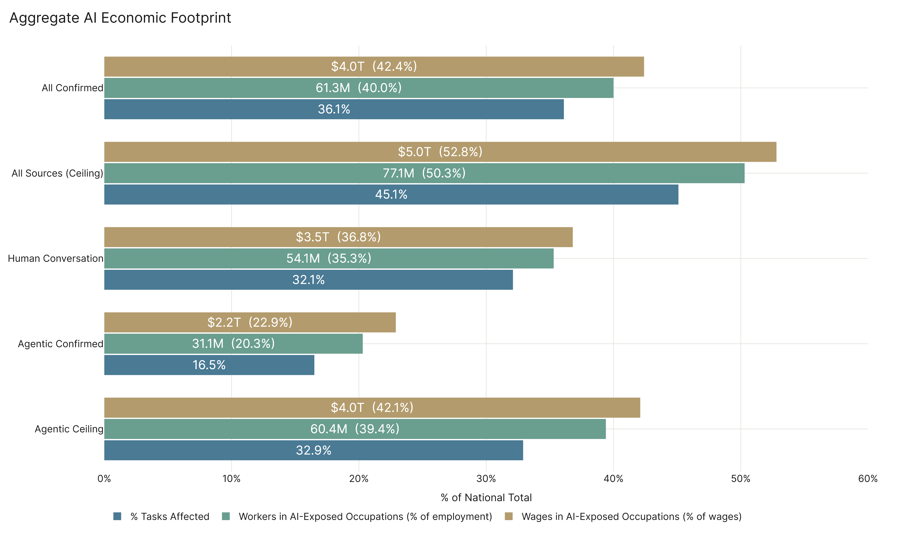

Five configs, each shown as three bars (% tasks affected / % workers affected / % wages affected), with the raw worker count and wage dollar count annotated.

**All Confirmed:** 31.0% tasks · 34.1% workers · 37.9% wages. Raw: 52.29 million workers, $3.57 trillion in wages.

**All Sources (Ceiling):** 41.1% tasks · 46.3% workers · 49.8% wages. Raw: 70.98M workers, $4.69T.

**Conversational Confirmed:** 27.0% tasks · 29.4% workers · 32.3% wages. Raw: 45.03M, $3.04T.

**Agentic Confirmed:** 16.5% tasks · 20.3% workers · 22.9% wages. Raw: 31.10M, $2.16T.

**Agentic Ceiling:** 32.9% tasks · 39.4% workers · 42.1% wages. Raw: 60.36M, $3.97T.

Spread on each metric, lowest to highest config: % tasks 16.5 → 41.1 (24.6pp spread); % workers 20.3 → 46.3 (26.0pp); % wages 22.9 → 49.8 (26.9pp). Raw workers spread: 31.1M → 71.0M (a 2.28× ratio). Raw wages: $2.16T → $4.69T (2.17×).

---

### All Confirmed vs All Sources (Ceiling) Over Time

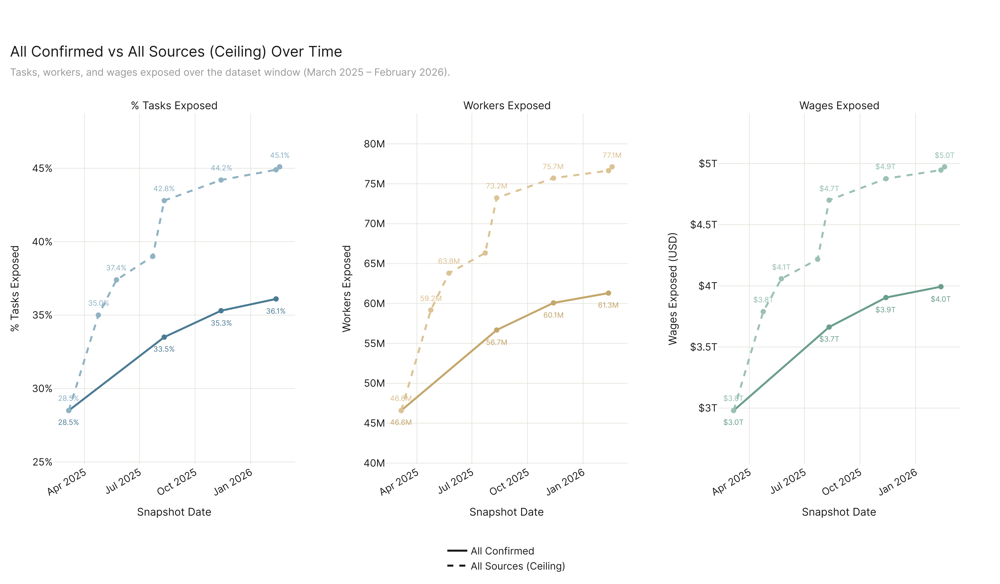

Three side-by-side panels: % Tasks Affected, Workers Affected, Wages Affected. Each panel has two lines — All Confirmed (solid, 4 snapshots) and All Sources (Ceiling) (dashed, 8 snapshots). Each line is extended past its last observation with a dotted linear-OLS projection that marks 6mo / 1yr / 2yr horizons.

**All Confirmed line (4 dates):**
- 2025-03-06: 23.3% tasks · 37.24M workers · $2.55T wages · 24.3% emp
- 2025-08-11: 28.2% · 47.47M · $3.23T · 31.0%
- 2025-11-13: 30.2% · 50.97M · $3.48T · 33.3%
- 2026-02-12: 31.0% · 52.29M · $3.57T · 34.1%

Observed change first→final: +7.7pp tasks, +15.05M workers, +$1.02T wages.

**All Sources (Ceiling) line (8 dates):**
- 2025-03-06: 23.3% tasks · 37.24M workers · $2.55T wages
- 2025-04-24: 30.4% · 51.90M · $3.46T
- 2025-05-24: 33.0% · 56.75M · $3.74T
- 2025-07-23: 34.9% · 59.77M · $3.92T
- 2025-08-11: 38.8% · 66.82M · $4.40T
- 2025-11-13: 40.2% · 69.41M · $4.59T
- 2026-02-12: 40.9% · 70.41M · $4.66T
- 2026-02-18: 41.1% · 70.98M · $4.69T

Observed change first→final: +17.8pp tasks, +33.74M workers, +$2.14T wages.

Final-snapshot gap between the two lines (the ceiling premium over confirmed usage): 10.1pp tasks, ~18.7M workers, ~$1.12T wages.

---

### Tasks Rated and AI Capability Over Time

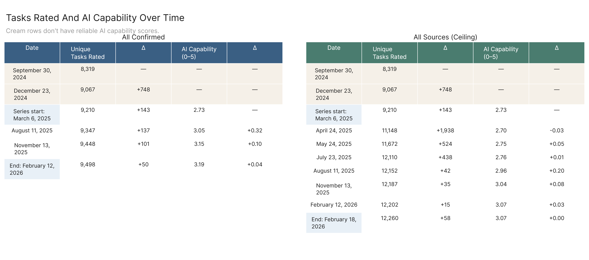

Two stacked tables. Each row is one snapshot date showing the per-period delta (change vs prior snapshot of the same config) in: new tasks rated, workers added, wages added, percentage-point change in employment coverage.

**All Confirmed deltas:**
- 2025-08-11: +137 new tasks · +10.1M workers · +$682.9B wages · +6.6pp employment coverage
- 2025-11-13: +101 · +3.4M · +$241.2B · +2.2pp
- 2026-02-12: +50 · +1.2M · +$89.0B · +0.8pp

Cumulative since 2025-03-06: +288 net new tasks rated, +14.7M workers swept in, +$1.01T wages swept in, +9.6pp emp coverage.

**All Sources (Ceiling) deltas:**
- 2025-04-24: +1,938 new tasks · +12.6M workers · +$809.6B wages · +8.2pp emp
- 2025-05-24: +524 · +4.6M · +$268.6B · +3.0pp
- 2025-07-23: +438 · +2.5M · +$159.1B · +1.7pp
- 2025-08-11: +42 · +6.9M · +$483.6B · +4.5pp
- 2025-11-13: +35 · +2.5M · +$175.9B · +1.6pp
- 2026-02-12: +15 · +943K · +$70.5B · +0.6pp
- 2026-02-18: +58 · +477K · +$26.5B · +0.3pp

Cumulative since 2025-03-06: +3,050 new tasks, +30.5M workers, +$1.99T wages, +19.9pp emp.

Largest single-period jump for All Sources (Ceiling): 2025-04-24 at +1,938 tasks (the MCP integration milestone). Largest single-period jump for All Confirmed: 2025-08-11 at +137 tasks / +10.1M workers.

---

## Part 2 — Where AI Exposure Falls

### Major Occupational Categories — Six-Panel Chart

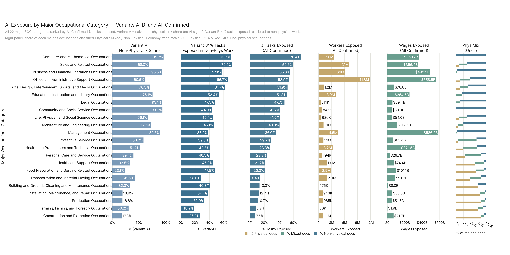

All 22 SOC majors shown as a six-panel chart on a shared y-axis sorted by All Confirmed % tasks affected (descending). Panels left to right: **Variant A** (naive non-physical task share, no AI signal), **Variant B** (% tasks exposed restricted to non-physical work on both sides), **All Confirmed % tasks**, **Workers affected**, **Wages affected**, **Phys Mix** (3-segment stacked bar for the major's occupations by phys tier).

Per-major numbers (Variant A · Variant B · AC % · Workers · Wages, plus rank within the 22 majors for workers / wages / % tasks):

1. **Computer and Mathematical** — A=95.73%, B=66.71%, AC%=66.43%, 3.32M workers, $333.21B; rank wk #6 / wg #5 / pct #1.
2. **Sales and Related** — A=67.95%, B=65.87%, AC%=55.30%, 6.89M, $340.32B; #2 / #4 / #2.
3. **Business and Financial Operations** — A=93.48%, B=51.90%, AC%=50.53%, 5.42M, $439.15B; #3 / #3 / #3.
4. **Office and Administrative Support** — A=60.55%, B=58.88%, AC%=48.25%, 10.85M, $514.96B; #1 / #2 / #4.
5. **Legal** — A=93.11%, B=47.53%, AC%=47.69%, 510.9K, $59.38B; #20 / #14 / #5.
6. **Educational Instruction and Library** — A=75.11%, B=48.72%, AC%=45.97%, 3.50M, $232.63B; #5 / #7 / #6.
7. **Arts, Design, Entertainment, Sports, and Media** — A=70.33%, B=53.26%, AC%=44.85%, 1.12M, $73.80B; #11 / #12 / #7.
8. **Community and Social Service** — A=93.71%, B=41.43%, AC%=39.18%, 746.9K, $43.64B; #17 / #19 / #8.
9. **Life, Physical, and Social Science** — A=66.11%, B=41.62%, AC%=38.47%, 581.3K, $49.69B; #19 / #18 / #9.
10. **Architecture and Engineering** — A=72.57%, B=43.41%, AC%=37.37%, 1.08M, $108.20B; #12 / #8 / #10.
11. **Management** — A=89.50%, B=34.77%, AC%=32.92%, 4.35M, $570.36B; #4 / #1 / #11. (Highest wage volume of any major.)
12. **Healthcare Practitioners and Technical** — A=51.74%, B=38.09%, AC%=26.37%, 3.06M, $305.07B; #7 / #6 / #12.
13. **Protective Service** — A=58.22%, B=34.61%, AC%=25.54%, 952.4K, $52.80B; #15 / #15 / #13.
14. **Healthcare Support** — A=32.46%, B=45.27%, AC%=21.16%, 1.92M, $74.35B; #9 / #11 / #14.
15. **Personal Care and Service** — A=39.38%, B=33.89%, AC%=20.49%, 666.99K, $24.06B; #18 / #20 / #15.
16. **Food Preparation and Serving Related** — A=23.13%, B=47.08%, AC%=19.72%, 2.82M, $97.85B; #8 / #9 / #16.
17. **Building and Grounds Cleaning and Maintenance** — A=32.26%, B=40.80%, AC%=13.28%, 175.7K, $7.98B; #21 / #21 / #17.
18. **Transportation and Material Moving** — A=42.22%, B=24.94%, AC%=12.41%, 1.56M, $75.02B; #10 / #10 / #18.
19. **Installation, Maintenance, and Repair** — A=18.87%, B=34.25%, AC%=11.09%, 827.5K, $52.17B; #16 / #16 / #19.
20. **Production** — A=18.77%, B=32.13%, AC%=10.28%, 963.5K, $50.31B; #13 / #17 / #20.
21. **Farming, Fishing, and Forestry** — A=30.24%, B=16.24%, AC%=6.94%, 21.96K, $878.15M; #22 / #22 / #21.
22. **Construction and Extraction** — A=17.27%, B=24.65%, AC%=6.58%, 954.55K, $63.11B; #14 / #13 / #22.

Spread on Variant A: 17.27% (Construction) to 95.73% (Computer and Math). Spread on All Confirmed %: 6.58% (Construction) to 66.43% (Computer and Math). Gap A vs AC ranges from -2.0pp (Healthcare Support, the only major where AC exceeds A) to +56.6pp (Management, where the structural cognitive share is 89.5% but realized AC exposure is 32.9%).

---

### Major Categories — Two-Year Linear Projection

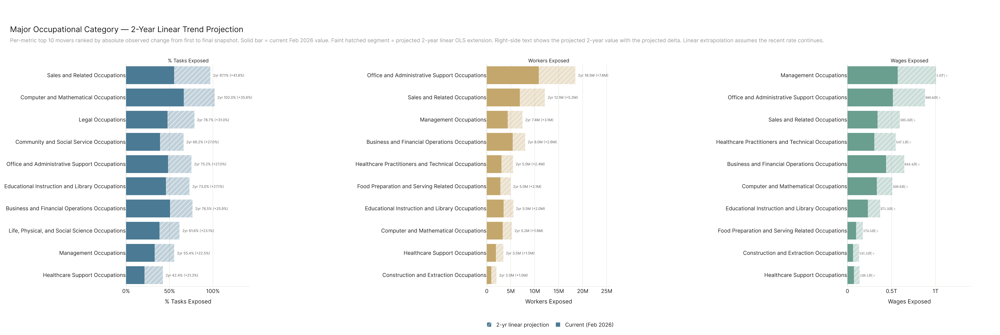

Three panels (% tasks, workers, wages). Each panel shows the top 10 movers by observed absolute change from first snapshot (2025-03-06) to final snapshot (2026-02-12), ranked descending. Each bar has two pieces: a solid section equal to the current value and a faint hatched extension equal to the 2-year linear-OLS projected value. R² values come from the per-major OLS fit (4 data points).

**Panel 1 — % Tasks Affected (top 10):**
1. Sales and Related: 37.10% → 55.30% (Δ +18.20pp); projected 97.14% by 2-year horizon (proj Δ +41.84pp); R²=0.92.
2. Computer and Mathematical: 51.07% → 66.43% (+15.36); proj 102.02% (+35.58); R²=0.88.
3. Legal: 33.40% → 47.69% (+14.29); proj 78.73% (+31.04); R²=0.98.
4. Community and Social Service: 27.25% → 39.18% (+11.92); proj 66.22% (+27.04); R²=0.98.
5. Office and Administrative Support: 36.36% → 48.25% (+11.89); proj 75.21% (+26.96); R²=0.95.
6. Educational Instruction and Library: 34.24% → 45.97% (+11.73); proj 73.03% (+27.06); R²=0.95.
7. Business and Financial Operations: 38.97% → 50.53% (+11.56); proj 76.48% (+25.95); R²=0.96.
8. Life, Physical, and Social Science: 28.47% → 38.47% (+10.00); proj 61.60% (+23.13); R²=0.92.
9. Management: 23.09% → 32.92% (+9.82); proj 55.37% (+22.45); R²=0.96.
10. Healthcare Support: 11.93% → 21.16% (+9.23); proj 42.45% (+21.29); R²=0.94.

**Panel 2 — Workers Affected (top 10):**
1. Office and Admin Support: 7.56M → 10.85M (Δ +3.29M); proj 18.46M (+7.61M); R²=0.88.
2. Sales and Related: 4.67M → 6.89M (+2.22M); proj 12.12M (+5.22M); R²=0.90.
3. Management: 2.99M → 4.35M (+1.35M); proj 7.44M (+3.09M); R²=0.96.
4. Business and Financial Operations: 4.27M → 5.42M (+1.15M); proj 8.00M (+2.58M); R²=0.94.
5. Healthcare Practitioners and Technical: 2.01M → 3.06M (+1.05M); proj 5.46M (+2.40M); R²=0.96.
6. Food Preparation and Serving Related: 1.86M → 2.82M (+959K); proj 4.95M (+2.14M); R²=0.92.
7. Educational Instruction and Library: 2.63M → 3.50M (+867K); proj 5.54M (+2.04M); R²=0.94.
8. Computer and Mathematical: 2.51M → 3.32M (+812K); proj 5.23M (+1.90M); R²=0.89.
9. Healthcare Support: 1.24M → 1.92M (+678K); proj 3.46M (+1.54M); R²=0.98.
10. Construction and Extraction: 480K → 955K (+474K); proj 2.00M (+1.05M); R²=0.99.

**Panel 3 — Wages Affected (top 10):**
1. Management: $380.01B → $570.36B (Δ +$190.35B); proj $1.005T (+$434.69B); R²=0.96.
2. Office and Admin Support: $356.53B → $514.96B (+$158.43B); proj $880.58B (+$365.62B); R²=0.89.
3. Sales and Related: $232.15B → $340.32B (+$108.17B); proj $595.26B (+$254.94B); R²=0.91.
4. Healthcare Practitioners and Technical: $199.28B → $305.07B (+$105.80B); proj $547.08B (+$242.01B); R²=0.96.
5. Business and Financial Operations: $347.99B → $439.15B (+$91.16B); proj $644.43B (+$205.29B); R²=0.93.
6. Computer and Mathematical: $257.63B → $333.21B (+$75.58B); proj $509.95B (+$176.74B); R²=0.89.
7. Educational Instruction and Library: $173.63B → $232.63B (+$59.00B); proj $371.27B (+$138.64B); R²=0.94.
8. Food Preparation and Serving Related: $63.57B → $97.85B (+$34.28B); proj $174.48B (+$76.62B); R²=0.93.
9. Construction and Extraction: $31.87B → $63.11B (+$31.23B); proj $131.48B (+$68.37B); R²=1.00.
10. Healthcare Support: $46.42B → $74.35B (+$27.93B); proj $138.11B (+$63.75B); R²=0.98.

Linear projection is "if recent rate continues," not a forecast.

---

### Job Zone Violins

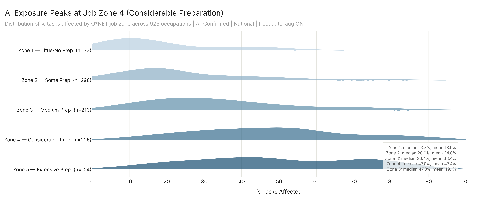

Five violins on the left (one per O*NET job zone, 1–5), each showing the distribution of % tasks affected across the occupations in that zone. A thin stacked bar on the right shows the phys/mixed/non-physical composition of each zone.

| Zone | n_occs | Median pct | Mean pct | Q25 | Q75 | % Physical | % Mixed | % Non-Phys |
|------|--------|-----------|---------|-----|-----|-----------|---------|-----------|
| 1 | 33 | 3.7% | 7.6% | 0.0% | 9.7% | 90.9% | 9.1% | 0.0% |
| 2 | 298 | 11.2% | 17.1% | 4.3% | 22.2% | 61.7% | 27.9% | 10.4% |
| 3 | 213 | 24.0% | 27.2% | 10.5% | 36.9% | 36.6% | 29.1% | 34.3% |
| 4 | 225 | 46.3% | 45.7% | 30.9% | 57.3% | 0.9% | 10.7% | 88.4% |
| 5 | 154 | 44.4% | 47.0% | 27.9% | 70.2% | 3.9% | 27.3% | 68.8% |

Median climbs Zone 1 → Zone 4 (3.7% → 46.3%) then dips slightly to 44.4% at Zone 5. Mean climbs across all five (7.6% → 17.1% → 27.2% → 45.7% → 47.0%). Q75 keeps climbing past Zone 4 (57.3% → 70.2% at Z5), so Z5 has a heavier upper tail than Z4 even with a slightly lower median. Phys mix flips from 90.9% physical in Zone 1 to 88.4% non-physical in Zone 4.

---

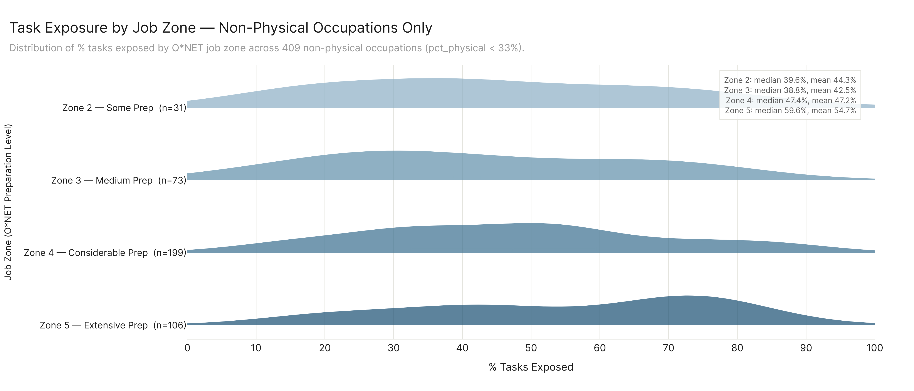

Same violin chart, restricted to occupations with `pct_physical < 33%`. Zone 1 has zero qualifying occupations and is omitted.

| Zone | n_occs | Median | Mean | Q25 | Q75 |
|------|--------|--------|------|-----|-----|
| 2 | 31 | 39.6% | 44.3% | 22.6% | 63.5% |
| 3 | 73 | 38.8% | 42.5% | 25.3% | 62.7% |
| 4 | 199 | 47.4% | 47.2% | 32.6% | 59.4% |
| 5 | 106 | 59.6% | 54.7% | 38.0% | 73.5% |

After stripping the physical/non-physical structural confound, Zone 5 separates cleanly from Zone 4 (median 59.6% vs 47.4%, mean 54.7% vs 47.2%). Zones 2 and 3 collapse to nearly identical distributions (medians within 0.8pp).

---

### SKA Levels — Skills

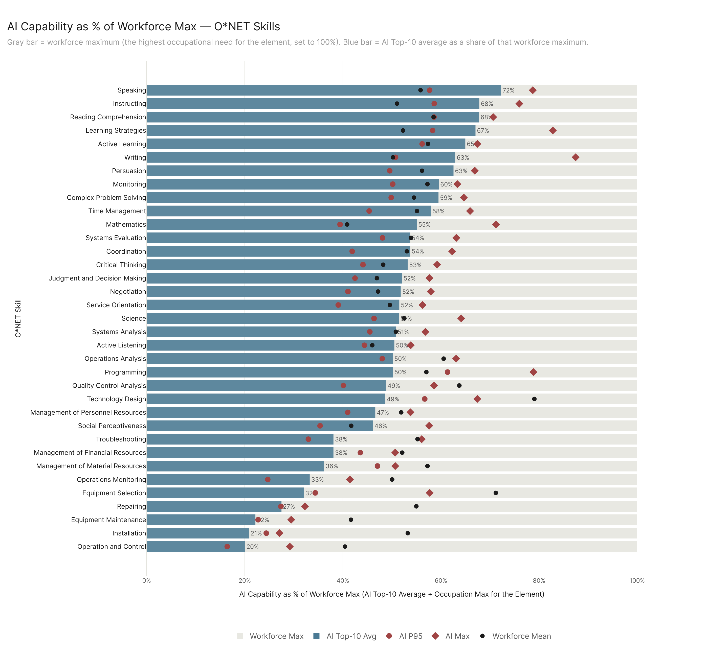

35 horizontal bars, one per O*NET Skill element. The bar shows AI Top-10 average normalized to % of workforce maximum (ai_top10 ÷ eco_max × 100). Bars colored by phys-mix tier (Non-Physical / Mixed / Physical).

Full enumeration, sorted by % of workforce max (descending):
1. Speaking — 72.0%, Mixed (n_occs=801)
2. Instructing — 67.6%, Non-physical (397)
3. Reading Comprehension — 67.5%, Mixed (729)
4. Learning Strategies — 66.8%, Non-physical (356)
5. Active Learning — 64.9%, Non-physical (581)
6. Writing — 62.8%, Non-physical (588)
7. Persuasion — 62.2%, Non-physical (329)
8. Complex Problem Solving — 59.9%, Mixed (644)
9. Monitoring — 59.5%, Mixed (767)
10. Time Management — 57.3%, Mixed (662)
11. Mathematics — 55.7%, Non-physical (237)
12. Systems Evaluation — 53.7%, Non-physical (326)
13. Critical Thinking — 53.6%, Mixed (800)
14. Coordination — 53.1%, Mixed (663)
15. Service Orientation — 51.2%, Non-physical (473)
16. Negotiation — 51.0%, Non-physical (257)
17. Science — 50.9%, Non-physical (150)
18. Systems Analysis — 50.9%, Non-physical (369)
19. Active Listening — 50.6%, Mixed (830)
20. Operations Analysis — 50.3%, Non-physical (90)
21. Programming — 50.1%, Non-physical (26)
22. Technology Design — 48.5%, Non-physical (19)
23. Quality Control Analysis — 48.2%, Mixed (233)
24. Management of Personnel Resources — 45.8%, Non-physical (192)
25. Social Perceptiveness — 44.5%, Non-physical (576)
26. Judgment and Decision Making — 52.0%, Mixed (682)
27. Management of Financial Resources — 37.8%, Non-physical (41)
28. Troubleshooting — 36.4%, Physical (138)
29. Management of Material Resources — 35.3%, Non-physical (29)
30. Operations Monitoring — 32.8%, Mixed (303)
31. Equipment Selection — 25.5%, Physical (42)
32. Repairing — 21.9%, Physical (92)
33. Equipment Maintenance — 18.6%, Physical (101)
34. Operation and Control — 17.7%, Physical (208)
35. Installation — 14.4%, Physical (23)

Range: 14.4% (Installation) to 72.0% (Speaking). All five bottom bars are Physical tier. All five top bars are either Mixed or Non-Physical. The Mixed tier dominates the top quartile of social/communication skills (Speaking, Reading Comprehension, Active Listening, Critical Thinking, etc.).

---

### SKA Levels — Knowledge and Abilities

This chart shows subcategory-level rollups. Top section: 10 Knowledge subcategories spanning 33 elements. Bottom section: 15 Abilities subcategories spanning 52 elements. Each bar is AI Top-10 as % of workforce max, averaged across the elements in the subcategory. Bar tier color reflects the mean phys-score of the subcategory's elements.

**Knowledge subcategories (10), sorted by ai_top10 %, descending:**
1. Education and Training — 69.34% (P95=56.48, max=84.97, eco_mean=49.04, n_elements=1, Mixed)
2. Business and Management — 58.21% (48.83 / 71.84 / 49.13, n=6, Non-physical)
3. Mathematics and Science — 52.23% (43.67 / 69.87 / 48.71, n=7, Non-physical)
4. Engineering and Technology — 51.68% (40.50 / 66.93 / 51.65, n=5, Mixed)
5. Communications — 51.63% (50.46 / 74.02 / 45.30, n=2, Non-physical)
6. Arts and Humanities — 49.20% (59.66 / 74.69 / 52.41, n=5, Non-physical)
7. Law and Public Safety — 46.04% (34.91 / 64.33 / 44.44, n=2, Mixed)
8. Health Services — 40.98% (39.34 / 49.74 / 54.98, n=2, Mixed)
9. Transportation — 38.21% (38.27 / 47.08 / 47.37, n=1, Mixed)
10. Manufacturing and Production — 37.45% (37.09 / 49.43 / 58.47, n=2, Mixed)

Range: 37.45% (Manufacturing/Production) to 69.34% (Education and Training).

**Abilities subcategories (15), sorted by ai_top10 %, descending:**
1. Verbal — 69.99% (P95=58.26, max=74.95, eco_mean=59.31, n=4, Mixed)
2. Idea Generation — 59.26% (47.07 / 66.70 / 53.74, n=7, Mixed)
3. Quantitative — 58.71% (45.88 / 72.36 / 44.36, n=2, Non-physical)
4. Memory — 47.51% (44.72 / 79.12 / 60.72, n=1, Non-physical)
5. Perceptual — 42.48% (35.34 / 50.25 / 52.49, n=3, Mixed)
6. Auditory and Speech — 32.69% (26.07 / 45.50 / 61.96, n=5, Mixed)
7. Spatial — 31.97% (29.80 / 40.09 / 55.29, n=2, Mixed)
8. Attentiveness — 31.82% (26.34 / 39.93 / 42.14, n=2, Mixed)
9. Fine Manipulative — 30.66% (20.98 / 41.51 / 51.30, n=3, Physical)
10. Visual — 24.57% (23.07 / 32.94 / 58.80, n=7, Mixed)
11. Control Movement — 15.61% (12.60 / 23.34 / 49.99, n=4, Physical)
12. Strength — 12.53% (12.03 / 20.86 / 56.58, n=4, Physical)
13. Reaction — 12.04% (28.77 / 33.03 / 69.40, n=3, Physical)
14. Endurance — 11.51% (10.75 / 23.23 / 49.57, n=1, Physical)
15. Flexibility, Balance, Coordination — 11.34% (14.16 / 25.16 / 54.63, n=4, Physical)

Range: 11.34% (Flexibility/Balance/Coordination) to 69.99% (Verbal). The five lowest are all Physical tier and all bunch into 11.3%–15.6%. The top four are all cognitive (Verbal, Idea Generation, Quantitative, Memory) above 47%.

---

### Work Activity Exposure

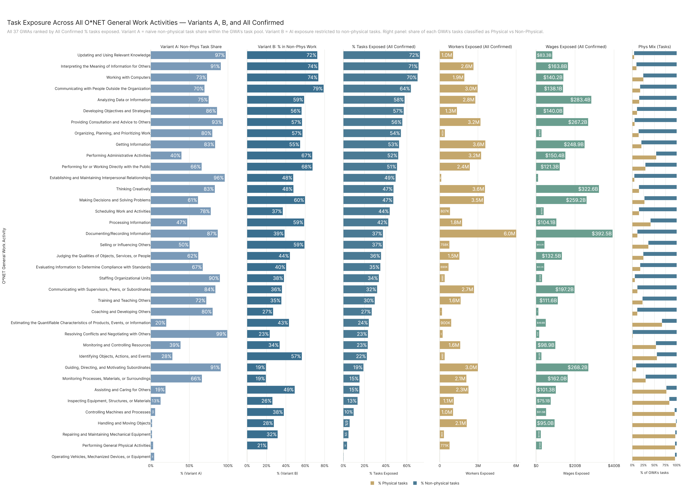

Six-panel chart matching the major-categories layout. Y-axis: all 37 GWAs with non-zero values, shared across panels, sorted by All Confirmed pct descending. Per-GWA values (AC % tasks · Workers · Wages · Variant A · Variant B):

1. **Updating and Using Relevant Knowledge** — 72.36% · 1.04M · $83.33B · A=97.10% · B=72.47%
2. **Interpreting the Meaning of Information for Others** — 71.07% · 2.65M · $163.79B · A=90.71% · B=73.57%
3. **Working with Computers** — 70.12% · 1.93M · $140.18B · A=72.83% · B=73.55%
4. **Communicating with People Outside the Organization** — 63.82% · 2.97M · $138.08B · A=69.55% · B=79.00%
5. **Analyzing Data or Information** — 57.84% · 2.79M · $283.43B · A=74.96% · B=58.87%
6. **Developing Objectives and Strategies** — 57.03% · 1.35M · $139.98B · A=85.80% · B=56.23%
7. **Providing Consultation and Advice to Others** — 55.71% · 3.20M · $267.18B · A=93.42% · B=56.71%
8. **Organizing, Planning, and Prioritizing Work** — 54.38% · 403K · $27.98B · A=79.70% · B=57.17%
9. **Getting Information** — 52.64% · 3.58M · $248.88B · A=83.32% · B=54.74%
10. **Performing Administrative Activities** — 51.85% · 3.25M · $150.39B · A=39.71% · B=67.28%
11. **Performing for or Working Directly with the Public** — 50.72% · 2.36M · $121.30B · A=65.86% · B=67.57%
12. **Establishing and Maintaining Interpersonal Relationships** — 49.35% · 117.77K · $10.35B · A=95.75% · B=47.60%
13. **Thinking Creatively** — 47.37% · 3.55M · $322.55B · A=82.93% · B=47.83%
14. **Making Decisions and Solving Problems** — 47.20% · 3.47M · $259.22B · A=61.15% · B=59.78%
15. **Scheduling Work and Activities** — 43.79% · 807K · $38.98B · A=77.68% · B=36.82%
16. **Processing Information** — 42.46% · 1.76M · $104.08B · A=47.25% · B=58.92%
17. **Documenting/Recording Information** — 37.37% · 6.01M · $392.51B · A=86.77% · B=38.65%
18. **Selling or Influencing Others** — 37.32% · 758K · $43.19B · A=50.24% · B=59.23%
19. **Judging the Qualities of Objects, Services, or People** — 35.58% · 1.54M · $132.51B · A=61.51% · B=44.19%
20. **Evaluating Information to Determine Compliance with Standards** — 34.93% · 689.65K · $42.15B · A=67.32% · B=40.31%
21. **Staffing Organizational Units** — 33.53% · 388K · $30.78B · A=89.50% · B=38.06%
22. **Communicating with Supervisors, Peers, or Subordinates** — 31.88% · 2.69M · $197.19B · A=83.71% · B=35.99%
23. **Training and Teaching Others** — 29.64% · 1.64M · $111.62B · A=71.90% · B=35.36%
24. **Coaching and Developing Others** — 26.76% · 176K · $12.02B · A=80.10% · B=26.83%
25. **Estimating the Quantifiable Characteristics of Products, Events, or Information** — 24.02% · 900K · $49.77B · A=20.03% · B=43.22%
26. **Resolving Conflicts and Negotiating with Others** — 23.18% · 227K · $16.02B · A=99.11% · B=23.37%
27. **Monitoring and Controlling Resources** — 23.00% · 1.61M · $98.88B · A=38.54% · B=33.59%
28. **Identifying Objects, Actions, and Events** — 22.18% · 386K · $27.43B · A=27.99% · B=56.50%
29. **Guiding, Directing, and Motivating Subordinates** — 18.93% · 2.99M · $268.21B · A=90.61% · B=19.42%
30. **Monitoring Processes, Materials, or Surroundings** — 15.21% · 2.09M · $162.00B · A=66.17% · B=19.37%
31. **Assisting and Caring for Others** — 15.08% · 2.26M · $101.27B · A=19.04% · B=49.12%
32. **Inspecting Equipment, Structures, or Materials** — 13.38% · 1.10M · $75.12B · A=12.67% · B=26.13%
33. **Controlling Machines and Processes** — 9.67% · 1.04M · $51.52B · A=5.62% · B=37.91%
34. **Handling and Moving Objects** — 5.88% · 2.12M · $94.99B · A=1.68% · B=27.61%
35. **Repairing and Maintaining Mechanical Equipment** — 4.78% · 329K · $24.25B · A=1.55% · B=31.53%
36. **Performing General Physical Activities** — 3.42% · 770.8K · $29.44B · A=3.04% · B=21.04%
37. **Operating Vehicles, Mechanized Devices, or Equipment** — 0.15% · 2.12K · $68.04M · A=4.41% · B=0.00%

% tasks range: 0.15% (Operating Vehicles) to 72.36% (Updating Knowledge). Largest worker bar: Documenting/Recording Information at 6.01M. Largest wage bar: Documenting/Recording Information at $392.51B. Largest gap A vs AC (where structural cognitive share massively overstates exposure): Resolving Conflicts (99.11% vs 23.18%, 76pp gap). GWAs where AC actually exceeds Variant A: Performing Administrative Activities (51.85% vs 39.71%), Processing Information (42.46% vs 47.25%, close), Estimating Quantifiable Chars (24.02% vs 20.03%), Inspecting Equipment (13.38% vs 12.67%), Assisting and Caring for Others (15.08% vs 19.04% — A slightly above), Controlling Machines (9.67% vs 5.62%), Handling and Moving Objects (5.88% vs 1.68%), Repairing/Maintaining (4.78% vs 1.55%), Performing General Physical (3.42% vs 3.04%).

---

## Part 3 — Action: What to Do About It

### Conv → Confirmed → Ceiling Reach by Major Sector

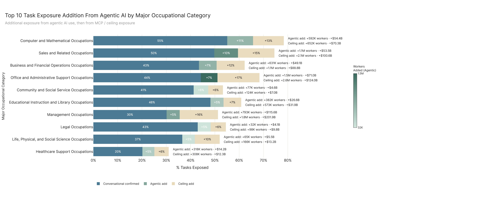

22 majors, each rendered as a horizontal stacked bar with three segments: Conversational Confirmed (base), Conv → Confirmed gap (focal segment, color-encoded by workers added), Confirmed → Ceiling extension. Sorted by Conv → Confirmed % tasks gap descending. Right-side annotations show the per-row pp / workers / wages deltas for both gaps.

Per-major full enumeration (Conv pct % · Confirmed pct % · Ceiling pct % · Conv→Conf gap pp / workers / wages · Conf→Ceil gap pp / workers / wages):

1. **Computer and Mathematical** — 56.07 / 66.43 / 78.65 · +10.37pp / +574K / +$52.5B · +12.22pp / +633K / +$67.98B
2. **Sales and Related** — 46.04 / 55.30 / 72.66 · +9.26pp / +1.02M / +$51.80B · +17.36pp / +2.71M / +$119.53B
3. **Business and Financial Operations** — 43.50 / 50.53 / 62.06 · +7.03pp / +609K / +$47.33B · +11.52pp / +1.09M / +$89.92B
4. **Office and Administrative Support** — 41.27 / 48.25 / 67.84 · +6.98pp / +1.49M / +$71.59B · +19.59pp / +2.90M / +$139.69B
5. **Community and Social Service** — 32.63 / 39.18 / 47.19 · +6.55pp / +86K / +$5.08B · +8.01pp / +159K / +$9.16B
6. **Management** — 27.43 / 32.92 / 50.09 · +5.49pp / +797K / +$115.67B · +17.17pp / +2.17M / +$237.88B
7. **Legal** — 42.23 / 47.69 / 54.11 · +5.46pp / +34K / +$4.41B · +6.42pp / +100K / +$10.05B
8. **Educational Instruction and Library** — 40.79 / 45.97 / 54.65 · +5.18pp / +375K / +$25.99B · +8.68pp / +730K / +$39.38B
9. **Life, Physical, and Social Science** — 33.35 / 38.47 / 49.52 · +5.12pp / +63K / +$5.38B · +11.05pp / +177K / +$14.12B
10. **Healthcare Support** — 16.17 / 21.16 / 27.76 · +4.99pp / +305K / +$13.59B · +6.60pp / +362K / +$14.46B
11. **Healthcare Practitioners and Technical** — 21.90 / 26.37 / 32.63 · +4.48pp / +640K / +$64.60B · +6.26pp / +621K / +$54.08B
12. **Arts, Design, Entertainment, Sports, and Media** — 40.85 / 44.85 / 56.87 · +4.00pp / +118K / +$7.76B · +12.02pp / +192K / +$11.13B
13. **Personal Care and Service** — 17.27 / 20.49 / 34.35 · +3.22pp / +106K / +$3.83B · +13.86pp / +446K / +$16.25B
14. **Protective Service** — 22.77 / 25.54 / 36.83 · +2.78pp / +184K / +$7.94B · +11.29pp / +432K / +$23.66B
15. **Building and Grounds Cleaning and Maintenance** — 10.82 / 13.28 / 19.25 · +2.46pp / +26K / +$1.22B · +5.97pp / +305K / +$11.75B
16. **Food Preparation and Serving Related** — 17.37 / 19.72 / 29.38 · +2.35pp / +284K / +$10.14B · +9.65pp / +1.33M / +$45.77B
17. **Installation, Maintenance, and Repair** — 9.33 / 11.09 / 18.60 · +1.76pp / +56K / +$3.49B · +7.51pp / +481K / +$28.49B
18. **Architecture and Engineering** — 35.72 / 37.37 / 49.09 · +1.66pp / +76K / +$8.40B · +11.72pp / +246K / +$22.61B
19. **Construction and Extraction** — 5.63 / 6.58 / 11.06 · +0.95pp / +225K / +$15.89B · +4.48pp / +277K / +$17.41B
20. **Transportation and Material Moving** — 11.49 / 12.41 / 25.52 · +0.91pp / +116K / +$5.27B · +13.12pp / +2.54M / +$110.78B
21. **Production** — 9.59 / 10.29 / 19.88 · +0.69pp / +72K / +$3.68B · +9.60pp / +758K / +$36.83B
22. **Farming, Fishing, and Forestry** — 6.65 / 6.94 / 13.27 · +0.30pp / +347 / +$17.71M · +6.33pp / +25.7K / +$1.05B

Conv→Confirmed gap range: 0.30pp (Farming) to 10.37pp (Computer & Math). Conf→Ceiling gap range: 4.48pp (Construction) to 19.59pp (Office and Admin Support). Office and Admin Support has the single largest Conf→Ceiling worker addition: +2.90M.

---

### Tech Commodities Where AI Has Reach

Top 25 tech commodities ranked by depth × breadth composite (geometric mean of normalized mean % tasks affected and exposed workers). Color = avg % tasks affected. Annotations: workers, wages, n_entries (software-occupation rows), n_occs (unique occupations using software in that commodity).

Per-commodity numbers (mean % tasks affected · workers (summed across all software-occ rows, so this is a depth-weighted exposure mass, not unique workers) · wages · n_entries · n_occs):

1. **Data base user interface and query software** — 43.97% · 294.43M · $289.84B · 2,518 entries · 632 occs
2. **Enterprise resource planning ERP software** — 45.70% · 229.30M · $185.32B · 1,264 · 381
3. **Customer relationship management CRM software** — 59.35% · 147.04M · $100.88B · 412 · 155
4. **Development environment software** — 57.88% · 139.15M · $77.22B · 1,146 · 200
5. **Operating system software** — 50.06% · 131.41M · $93.86B · 980 · 362
6. **Accounting software** — 41.46% · 129.39M · $95.50B · 462 · 178
7. **Web platform development software** — 63.91% · 126.31M · $71.38B · 851 · 152
8. **Point of sale POS software** — 40.74% · 124.12M · $93.76B · 208 · 59
9. **Medical software** — 32.02% · 123.34M · $242.55B · 1,614 · 190
10. **Analytical or scientific software** — 44.64% · 120.55M · $145.22B · 2,898 · 372
11. **Word processing software** — 38.51% · 118.44M · $157.73B · 1,397 · 804
12. **Financial analysis software** — 50.05% · 107.56M · $81.17B · 600 · 94
13. **Electronic mail software** — 37.25% · 106.13M · $138.73B · 1,141 · 735
14. **Human resources software** — 51.55% · 98.37M · $59.95B · 395 · 89
15. **Document management software** — 49.57% · 96.11M · $91.90B · 612 · 293
16. **Object or component oriented development software** — 56.61% · 89.16M · $53.80B · 906 · 211
17. **Project management software** — 43.73% · 84.05M · $85.16B · 693 · 309
18. **Data base management system software** — 65.03% · 83.40M · $43.58B · 553 · 109
19. **Web page creation and editing software** — 52.94% · 80.18M · $62.16B · 443 · 207
20. **Graphics or photo imaging software** — 46.69% · 79.45M · $63.35B · 850 · 279
21. **Business intelligence and data analysis software** — 60.73% · 72.03M · $52.24B · 347 · 117
22. **Presentation software** — 41.44% · 71.95M · $85.49B · 773 · 635
23. **Spreadsheet software** — 32.86% · 68.47M · $115.32B · 1,058 · 861
24. **Office suite software** — 34.72% · 61.81M · $104.29B · 928 · 818
25. **Internet browser software** — 39.65% · 58.15M · $78.47B · 589 · 487

% tasks affected range: 32.02% (Medical software) to 65.03% (Data base management system software). The top of the breadth list (most occs using the software) is dominated by general-purpose tools: Spreadsheet (861 occs), Office suite (818), Word processing (804), Electronic mail (735), Presentation (635). The top of the depth list (highest % tasks affected) is dominated by specialist/dev tools: DBMS (65.03%), Web platform dev (63.91%), Business intelligence (60.73%), CRM (59.35%), Development environment (57.88%).

---

### Occupations Most At Risk of Displacement

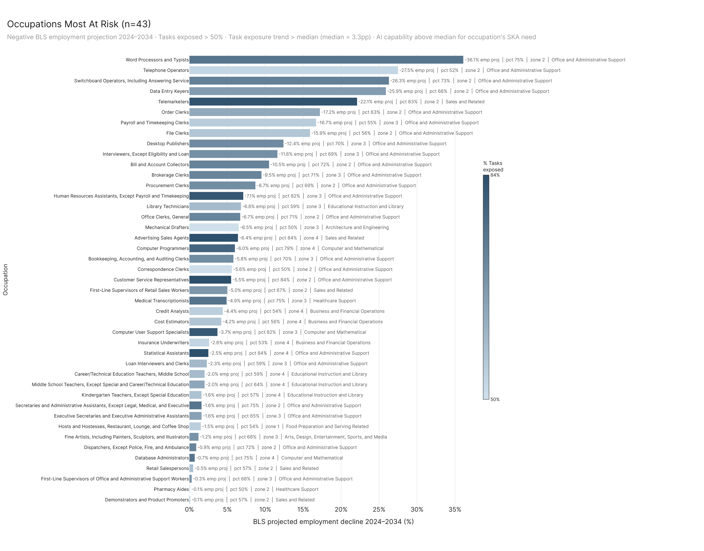

38 occupations passing all four "focused-set" filters: negative BLS employment projection 2024–2034, >50% tasks exposed, exposure trend above median, AI capability above median for the occupation's SKA need. Horizontal bars ordered by absolute BLS projected decline (most negative first), colored by % tasks exposed.

Per occupation (Major · Job Zone · BLS proj % · % tasks exposed · SKA AI-as-% of need · pct_delta vs first snapshot · workers · wages):

1. **Word Processors and Typists** (Office/Admin, Z2) — proj −36.1% · 71.28% exposed · ska 127.12% · Δpct +26.88pp · 25.68K wk · $1.23B
2. **Telephone Operators** (Office, Z2) — −27.5% · 54.38% · 131.83% · +3.48pp · 2.15K · $84.04M
3. **Switchboard Operators, Including Answering Service** (Office, Z2) — −26.3% · 66.37% · 136.36% · +25.70pp · 23.71K · $909.91M
4. **Data Entry Keyers** (Office, Z2) — −25.9% · 62.74% · 121.32% · +14.13pp · 84.88K · $3.38B
5. **Telemarketers** (Sales, Z2) — −22.1% · 83.15% · 131.15% · +44.48pp · 55.23K · $1.90B
6. **Order Clerks** (Office, Z2) — −17.2% · 62.70% · 122.48% · +19.48pp · 52.30K · $2.34B
7. **Payroll and Timekeeping Clerks** (Office, Z3) — −16.7% · 51.08% · 123.10% · +15.31pp · 80.16K · $4.43B
8. **File Clerks** (Office, Z2) — −15.9% · 55.72% · 133.92% · +15.40pp · 44.00K · $1.82B
9. **Desktop Publishers** (Office, Z3) — −12.4% · 67.77% · 112.67% · +10.08pp · 2.71K · $145.36M
10. **Interviewers, Except Eligibility and Loan** (Office, Z3) — −11.6% · 66.47% · 122.25% · +22.88pp · 104.56K · $4.58B
11. **Bill and Account Collectors** (Office, Z2) — −10.5% · 72.36% · 133.99% · +29.19pp · 119.42K · $5.50B
12. **Brokerage Clerks** (Office, Z3) — −9.5% · 71.37% · 130.77% · +25.43pp · 28.61K · $1.80B
13. **Procurement Clerks** (Office, Z2) — −8.7% · 69.31% · 126.43% · +16.31pp · 41.51K · $2.01B
14. **Human Resources Assistants, Except Payroll and Timekeeping** (Office, Z3) — −7.1% · 82.08% · 118.79% · +35.82pp · 75.99K · $3.76B
15. **Library Technicians** (Educational, Z3) — −6.8% · 54.64% · 146.56% · +10.33pp · 40.31K · $1.61B
16. **Office Clerks, General** (Office, Z2) — −6.7% · 65.51% · 140.81% · +23.53pp · 1.64M · $71.75B
17. **Advertising Sales Agents** (Sales, Z4) — −6.4% · 84.02% · 112.13% · +26.31pp · 81.89K · $5.03B
18. **Computer Programmers** (Computer/Math, Z4) — −6.0% · 77.98% · 117.99% · +20.69pp · 85.68K · $8.45B
19. **Bookkeeping, Accounting, and Auditing Clerks** (Office, Z3) — −5.8% · 69.10% · 134.34% · +16.83pp · 1.01M · $49.50B
20. **Correspondence Clerks** (Office, Z2) — −5.6% · 51.38% · 126.39% · +9.13pp · 3.22K · $150.34M
21. **Customer Service Representatives** (Office, Z2) — −5.5% · 86.83% · 131.31% · +30.10pp · 2.37M · $101.38B
22. **First-Line Supervisors of Retail Sales Workers** (Sales, Z2) — −5.0% · 64.24% · 124.03% · +39.31pp · 715.07K · $33.84B
23. **Medical Transcriptionists** (Healthcare Support, Z3) — −4.9% · 75.49% · 117.61% · +25.50pp · 32.51K · $1.22B
24. **Credit Analysts** (Business/Financial, Z4) — −4.4% · 53.89% · 111.71% · +18.17pp · 36.31K · $2.94B
25. **Cost Estimators** (Business/Financial, Z4) — −4.2% · 57.40% · 112.07% · +5.29pp · 126.02K · $9.71B
26. **Computer User Support Specialists** (Computer/Math, Z3) — −3.7% · 81.78% · 112.15% · +35.10pp · 570.14K · $34.40B
27. **Insurance Underwriters** (Business/Financial, Z4) — −2.6% · 55.39% · 124.69% · +11.98pp · 59.73K · $4.77B
28. **Statistical Assistants** (Office, Z4) — −2.5% · 83.80% · 113.31% · +30.48pp · 4.94K · $254.32M
29. **Loan Interviewers and Clerks** (Office, Z3) — −2.3% · 62.66% · 119.21% · +19.93pp · 108.47K · $5.31B
30. **Middle School Teachers, Except Special and Career/Technical Education** (Educational, Z4) — −2.0% · 58.05% · 110.58% · +11.84pp · 360.09K · $22.68B
31. **Elementary School Teachers, Except Special Education** (Educational, Z4) — −2.0% · 56.80% · 107.13% · +16.28pp · 791.46K · $49.34B
32. **Executive Secretaries and Executive Administrative Assistants** (Office, Z3) — −1.6% · 54.70% · 116.42% · +20.99pp · 258.60K · $19.20B
33. **Secretaries and Administrative Assistants, Except Legal, Medical, and Executive** (Office, Z2) — −1.6% · 73.65% · 118.07% · +18.53pp · 1.28M · $59.25B
34. **Fine Artists, Including Painters, Sculptors, and Illustrators** (Arts/Design, Z3) — −1.2% · 65.91% · 118.95% · +23.74pp · 6.59K · $399.16M
35. **Dispatchers, Except Police, Fire, and Ambulance** (Office, Z2) — −0.9% · 71.46% · 117.52% · +40.68pp · 150.79K · $7.37B
36. **Database Administrators** (Computer/Math, Z4) — −0.7% · 76.42% · 111.88% · +13.30pp · 37.80K · $4.64B
37. **Retail Salespersons** (Sales, Z2) — −0.5% · 50.95% · 135.99% · +18.24pp · 1.94M · $66.96B
38. **First-Line Supervisors of Office and Administrative Support Workers** (Office, Z3) — −0.3% · 68.23% · 108.30% · +30.37pp · 1.02M · $67.49B

Distribution: 27 of 38 occupations are in Office and Administrative Support. Job zone distribution: Z2 = 17, Z3 = 13, Z4 = 8, Z5 = 0. Worker headcount range: 2.15K (Telephone Operators) to 2.37M (Customer Service Representatives). Summed workers across the 38: ~16.6M. Summed wages: ~$770B.

---

### State Exposure vs. Most-At-Risk Concentration

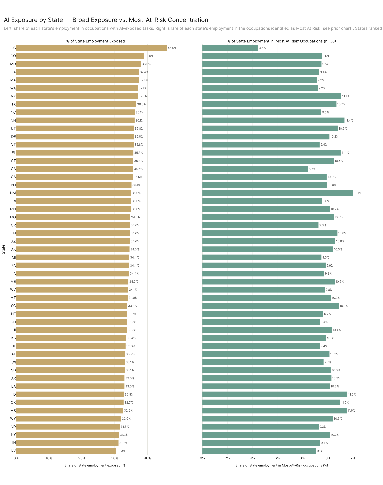

Two panels covering 51 jurisdictions (DC + 50 states). **Left panel:** % of each state's employment in occupations with AI-exposed tasks (broad exposure, employment-weighted). **Right panel:** % of each state's employment in the 38-occ focused set from the prior chart. Sorted by left panel descending; the right panel's ranking is independent.

Full state list (state code · total emp · left % broad exposure · right % focused-set share):

1. **DC** — 1.30M · 45.90% · 4.47%
2. **CO** — 3.83M · 38.87% · 9.57%
3. **MD** — 3.92M · 38.04% · 9.54%
4. **VA** — 5.51M · 37.43% · 9.36%
5. **MA** — 4.85M · 37.36% · 9.17%
6. **WA** — 4.73M · 37.06% · 9.24%
7. **NY** — 11.64M · 37.04% · 11.14%
8. **TX** — 18.10M · 36.59% · 10.74%
9. **NC** — 6.49M · 36.13% · 9.53%
10. **NH** — 891K · 36.06% · 11.39%
11. **UT** — 2.26M · 35.85% · 10.85%
12. **DE** — 647K · 35.83% · 10.18%
13. **VT** — 405K · 35.79% · 9.39%
14. **FL** — 13.18M · 35.70% · 11.11%
15. **CT** — 2.22M · 35.69% · 10.53%
16. **CA** — 24.02M · 35.63% · 8.46%
17. **GA** — 6.85M · 35.52% · 9.96%
18. **NJ** — 5.80M · 35.13% · 10.01%
19. **NM** — 1.11M · 34.99% · 12.08%
20. **RI** — 649K · 34.99% · 9.57%
21. **MN** — 3.74M · 34.98% · 10.22%
22. **MO** — 3.84M · 34.77% · 10.52%
23. **OR** — 2.54M · 34.65% · 9.30%
24. **TN** — 4.27M · 34.64% · 10.82%
25. **AZ** — 4.26M · 34.63% · 10.65%
26. **AK** — 427K · 34.52% · 10.47%
27. **MI** — 5.88M · 34.44% · 9.54%
28. **PA** — 8.08M · 34.43% · 9.88%
29. **IA** — 2.00M · 34.38% · 9.76%
30. **ME** — 836K · 34.18% · 10.61%
31. **WV** — 955K · 34.10% · 9.80%
32. **MT** — 660K · 33.97% · 10.30%
33. **SC** — 3.06M · 33.83% · 10.93%
34. **NE** — 1.36M · 33.70% · 9.69%
35. **OH** — 7.34M · 33.68% · 9.41%
36. **HI** — 845K · 33.65% · 10.36%
37. **KS** — 1.89M · 33.42% · 9.93%
38. **IL** — 8.17M · 33.31% · 9.40%
39. **AL** — 2.73M · 33.15% · 10.18%
40. **WI** — 3.90M · 33.14% · 9.71%
41. **SD** — 597K · 33.14% · 10.31%
42. **AR** — 1.69M · 32.98% · 10.34%
43. **LA** — 2.64M · 32.98% · 10.21%
44. **ID** — 1.09M · 32.82% · 11.62%
45. **OK** — 2.24M · 32.72% · 11.05%
46. **MS** — 1.46M · 32.59% · 11.56%
47. **WY** — 362K · 31.97% · 10.46%
48. **ND** — 579K · 31.59% · 9.31%
49. **KY** — 2.60M · 31.34% · 10.23%
50. **IN** — 4.20M · 31.17% · 9.43%
51. **NV** — 2.11M · 30.33% · 9.11%

Left panel range: 30.33% (NV) to 45.90% (DC) — 15.6pp spread. Right panel range: 4.47% (DC) to 12.08% (NM) — 7.6pp spread. The four highest broad-exposure states (DC, CO, MD, VA) all rank in the bottom 14 on focused-set share — DC is dead last on focused share (4.47%) but top on broad exposure (45.90%). The right panel's top 5 are NM (12.08%), ID (11.62%), MS (11.56%), NH (11.39%), NY (11.14%).

---

### AI Usage Intensity by Sector (Anchor-Indexed Lift)

22 majors ranked by AI intensity ratio (Σ pct ÷ Σ freq×emp over the full eco_2025 universe), renormalized to 100% across the 22 majors, then divided by the anchor major's value so the anchor reads as 1.00×. **Anchor:** Legal (the 12th of 22 when sorted ascending on chart 12's rated-denom ratio). A dashed vertical line marks the lift distribution's statistical median (0.6311×). Bars shaded by `pct_tasks_affected` (darker = higher).

Per major (lift × · ratio_full_pct % · pct_tasks_affected %), sorted by lift descending:

1. **Life, Physical, and Social Science** — 15.87× · 34.25% of all-major share · pct_tasks 38.47%
2. **Arts, Design, Entertainment, Sports, and Media** — 9.29× · 20.05% · 44.85%
3. **Computer and Mathematical** — 7.90× · 17.05% · 66.43%
4. **Business and Financial Operations** — 2.40× · 5.18% · 50.53%
5. **Architecture and Engineering** — 2.32× · 5.01% · 37.37%
6. **Community and Social Service** — 1.89× · 4.07% · 39.18%
7. **Management** — 1.23× · 2.65% · 32.92%
8. **Legal** — 1.00× [anchor] · 2.16% · 47.69%
9. **Personal Care and Service** — 0.96× · 2.08% · 20.49%
10. **Educational Instruction and Library** — 0.75× · 1.63% · 45.97%
11. **Office and Administrative Support** — 0.67× · 1.45% · 48.25%
12. **Protective Service** — 0.59× · 1.27% · 25.54%
13. **Sales and Related** — 0.37× · 0.79% · 55.30%
14. **Healthcare Practitioners and Technical** — 0.35× · 0.75% · 26.37%
15. **Installation, Maintenance, and Repair** — 0.15× · 0.32% · 11.09%
16. **Healthcare Support** — 0.14× · 0.30% · 21.16%
17. **Building and Grounds Cleaning and Maintenance** — 0.11× · 0.24% · 13.28%
18. **Production** — 0.09× · 0.20% · 10.28%
19. **Construction and Extraction** — 0.09× · 0.20% · 6.58%
20. **Transportation and Material Moving** — 0.08× · 0.18% · 12.41%
21. **Farming, Fishing, and Forestry** — 0.04× · 0.09% · 6.94%
22. **Food Preparation and Serving Related** — 0.04× · 0.08% · 19.72%

Lift range: 0.04× (Food Prep, Farming) to 15.87× (Life/Physical/Social Science). Median lift: 0.63× (dashed reference line). Above-median majors (12 of 22): Life/Physical/Social Science, Arts/Design, Computer/Math, Business/Financial, Architecture/Engineering, Community/Social Service, Management, Legal, Personal Care, Educational Instruction, Office/Admin Support. Note that pct_tasks_affected and lift are not the same ranking: Sales has the 2nd highest pct_tasks (55.30%) but ranks 13th on lift (0.37×), while Life/Physical/Social Science has only the 9th highest pct_tasks (38.47%) yet leads lift by a factor of 1.7× over second place.

---

*End of dense-prose results document. All bar/segment values transcribed directly from the figure-script CSVs in `analysis/paper/results/part_{1,2,3}/results/`.*
