# Results — Dense Prose (Number-Only)

This file mirrors `results.md` chart for chart, but replaces every figure with a verbal transcription of the chart's contents. Each section enumerates every bar / cell / segment / data point the chart shows, with the actual underlying values. It exists so an LLM can "read" the charts via prose, without seeing the PNGs. No interpretation; description and numbers only.

All numbers are pulled directly from the CSVs in each part's `results/` directory — the same CSVs the figure scripts use to draw the charts. Where a chart text-labels a bar at lower precision than the CSV stores, the prose carries the CSV's precision (typically 1–4 decimals) so an LLM can recover the chart's exact data.

Conventions used below:
- **pp** = percentage points; **M** = million, **K** = thousand, **B** = billion, **T** = trillion.
- **All Confirmed** = AEI Conv + AEI API + Microsoft, no MCP (`final_all_confirmed_usage_2026-02-12`).
- **All Sources (Ceiling)** = AEI Conv + AEI API + Microsoft + MCP (`final_all_usage_2026-02-18`).
- **Conversational Confirmed** = AEI Conv + Microsoft.
- **Agentic Confirmed** = AEI API only (paper-internal eco_2025-rebased variant for the static charts).
- **Agentic Ceiling** = AEI API + MCP.
- Geo = national; method = `freq` (time-weighted); auto-aug multiplier = on; physical filter = all (unless noted).
- ρ = Spearman rank correlation. Significance asterisks: `***` p < .001, `**` p < .01, `*` p < .05.

---

## Part 1 — Scale, Convergence, Growth

### External Benchmark Comparison — Source-level (Major)


This figure is a **single panel** Spearman correlation heatmap at the **Major occupational category** level (n = 22 categories per cell). The y-axis lists 5 internal AI scoring rows; the x-axis lists those same 5 internal sources (lower-triangle only) followed by a 1-column gap and then 8 external academic benchmarks. The internal block reads as pairwise correlations between our sources; the external block reads as one row per internal source vs each external benchmark. Four Eloundou-contaminated cells (the two Copilot-derived rows — Copilot itself and All Confirmed — crossed with each of the two Eloundou benchmark columns) are grayed out per the figure's contamination legend.

Internal sources (rows / lower-tri columns), in y-axis order: Claude Browser (AEI Conv 2026-02-12), Claude API (AEI API 2025 2026-02-12), Copilot (Microsoft), MCP (MCP Cumul. v4), All Confirmed.

External benchmarks (right-side columns): Eloundou GPT-4 β, Eloundou Human β, AIOE Overall, AIOE Reading Compr., Schaal Overall, Schaal DA, Schaal AG, Tomlinson (Copilot).

**Internal block (10 unique pairs, lower-triangle):**
- Claude API ↔ Claude Browser: ρ = 0.97 (n = 22) ***
- Copilot ↔ Claude Browser: 0.82 ***
- Copilot ↔ Claude API: 0.84 ***
- MCP ↔ Claude Browser: 0.83 ***
- MCP ↔ Claude API: 0.83 ***
- MCP ↔ Copilot: 0.95 ***
- All Confirmed ↔ Claude Browser: 0.95 ***
- All Confirmed ↔ Claude API: 0.97 ***
- All Confirmed ↔ Copilot: 0.93 ***
- All Confirmed ↔ MCP: 0.92 ***

**External block (5 internal rows × 8 external columns = 40 cells; Eloundou columns crossed with Copilot/All Confirmed rows are grayed as contaminated):**

Claude Browser ↔ external: Eloundou GPT-4 β 0.83 ***, Eloundou Human β 0.87 ***, AIOE Overall 0.84 ***, AIOE Reading Compr. 0.86 ***, Schaal Overall 0.72 ***, Schaal DA 0.81 ***, Schaal AG 0.58 ** , Tomlinson (Copilot) 0.84 ***.

Claude API ↔ external: Eloundou GPT-4 β 0.83 ***, Eloundou Human β 0.89 ***, AIOE Overall 0.86 ***, AIOE Reading Compr. 0.86 ***, Schaal Overall 0.69 ***, Schaal DA 0.79 ***, Schaal AG 0.58 ** , Tomlinson (Copilot) 0.81 ***.

Copilot ↔ external: Eloundou GPT-4 β 0.94 *** (contaminated cell), Eloundou Human β 0.94 *** (contaminated cell), AIOE Overall 0.85 ***, AIOE Reading Compr. 0.81 ***, Schaal Overall 0.76 ***, Schaal DA 0.90 ***, Schaal AG 0.82 ***, Tomlinson (Copilot) 0.81 ***.

MCP ↔ external: Eloundou GPT-4 β 0.92 ***, Eloundou Human β 0.93 ***, AIOE Overall 0.82 ***, AIOE Reading Compr. 0.77 ***, Schaal Overall 0.72 ***, Schaal DA 0.89 ***, Schaal AG 0.86 ***, Tomlinson (Copilot) 0.81 ***.

All Confirmed ↔ external: Eloundou GPT-4 β 0.90 *** (contaminated), Eloundou Human β 0.95 *** (contaminated), AIOE Overall 0.88 ***, AIOE Reading Compr. 0.87 ***, Schaal Overall 0.74 ***, Schaal DA 0.87 ***, Schaal AG 0.71 ***, Tomlinson (Copilot) 0.86 ***.

Range across the panel: 0.58 (Claude Browser / API vs Schaal AG) to 0.97 (Claude API ↔ Claude Browser; All Confirmed ↔ Claude API).

---

### External Benchmark Comparison — Source-level (Occupation)


Same heatmap structure and row/column layout as the Major chart, but every cell now uses n = 923 occupations (n = 893 for AIOE comparisons, n = 749 for Tomlinson). All cells significant at p < .001.

**Internal block (5×5 lower triangle):**
- Claude API ↔ Claude Browser: 0.84 ***
- Copilot ↔ Claude Browser: 0.64 ***
- Copilot ↔ Claude API: 0.62 ***
- MCP ↔ Claude Browser: 0.58 ***
- MCP ↔ Claude API: 0.60 ***
- MCP ↔ Copilot: 0.75 ***
- All Confirmed ↔ Claude Browser: 0.89 ***
- All Confirmed ↔ Claude API: 0.86 ***
- All Confirmed ↔ Copilot: 0.86 ***
- All Confirmed ↔ MCP: 0.73 ***

**External block:**

Claude Browser ↔ external: Eloundou GPT-4 β 0.67, Eloundou Human β 0.68, AIOE Overall 0.61 (n = 893), AIOE Reading Compr. 0.70 (n = 893), Schaal Overall 0.62, Schaal DA 0.53, Schaal AG 0.38, Tomlinson (Copilot) 0.66 (n = 749).

Claude API ↔ external: Eloundou GPT-4 β 0.64, Eloundou Human β 0.64, AIOE Overall 0.56 (893), AIOE Reading Compr. 0.64 (893), Schaal Overall 0.54, Schaal DA 0.52, Schaal AG 0.42, Tomlinson (Copilot) 0.63 (749).

Copilot ↔ external: Eloundou GPT-4 β 0.84 (contaminated), Eloundou Human β 0.83 (contaminated), AIOE Overall 0.69 (893), AIOE Reading Compr. 0.72 (893), Schaal Overall 0.62, Schaal DA 0.70, Schaal AG 0.63, Tomlinson (Copilot) 0.83 (749).

MCP ↔ external: Eloundou GPT-4 β 0.77, Eloundou Human β 0.73, AIOE Overall 0.64 (893), AIOE Reading Compr. 0.63 (893), Schaal Overall 0.58, Schaal DA 0.74, Schaal AG 0.78, Tomlinson (Copilot) 0.67 (749).

All Confirmed ↔ external: Eloundou GPT-4 β 0.82 (contaminated), Eloundou Human β 0.82 (contaminated), AIOE Overall 0.70 (893), AIOE Reading Compr. 0.77 (893), Schaal Overall 0.68, Schaal DA 0.67, Schaal AG 0.55, Tomlinson (Copilot) 0.80 (749).

Range across the panel: 0.38 (Claude Browser vs Schaal AG) to 0.89 (All Confirmed ↔ Claude Browser).

---

### AI Economic Exposure Across Data Configurations


Five rows (one per config), each with three grouped horizontal bars (tasks / workers / wages, top-to-bottom within each cluster). X-axis is "% of National Total" from 0% to 65%. Per-bar inline text shows the % plus the raw worker count or wage dollar count for the worker / wage bars.

| Config | % Tasks Exposed | % Workers Exposed | % Wages Exposed | Workers (raw) | Wages (raw) |
|---|---|---|---|---|---|
| All Confirmed | 29.3% | 37.5% | 41.5% | 57.95M | $4.10T |
| Conversational Confirmed | 25.1% | 32.0% | 35.1% | 49.41M | $3.46T |
| Agentic Confirmed | 14.4% | 21.3% | 24.0% | 32.87M | $2.37T |
| Agentic Ceiling | 30.8% | 40.8% | 43.7% | 62.99M | $4.31T |
| All Sources (Ceiling) | 38.7% | 48.5% | 52.1% | 75.00M | $5.14T |

Exact CSV values: All Confirmed 29.30 / 37.50 / 41.50; workers 57,953,282.60; wages $4,095,148,895,332.15. Conversational Confirmed 25.10 / 32.00 / 35.10; workers 49,414,851.83; wages $3,461,915,798,898.42. Agentic Confirmed 14.40 / 21.30 / 24.00; workers 32,873,993.26; wages $2,370,422,778,874.25. Agentic Ceiling 30.80 / 40.80 / 43.70; workers 62,994,975.94; wages $4,308,849,264,827.24. All Sources (Ceiling) 38.70 / 48.50 / 52.10; workers 74,995,060.24; wages $5,143,217,186,619.56.

Spread across configs:
- % tasks: 14.4 → 38.7 (24.3 pp spread; Agentic Confirmed lowest, All Sources (Ceiling) highest).
- % workers: 21.3 → 48.5 (27.2 pp).
- % wages: 24.0 → 52.1 (28.1 pp).
- Raw workers: 32.87M → 75.00M (≈ 2.28× ratio).
- Raw wages: $2.37T → $5.14T (≈ 2.17×).

Within-config wages% − workers%: All Confirmed +4.0 pp; Conversational Confirmed +3.1; Agentic Confirmed +2.7; Agentic Ceiling +2.9; All Sources (Ceiling) +3.6.

---

### All Confirmed vs All Sources (Ceiling) Over Time


Three side-by-side panels: % Tasks Exposed, Workers Exposed, Wages Exposed. Each panel plots two lines — All Confirmed (solid, 4 snapshots) and All Sources (Ceiling) (dashed, 8 snapshots). Each line is extended past its last observation with a dotted linear-OLS projection that marks 6mo / 1yr / 2yr horizons (the 2yr horizon endpoint is the only horizon point labeled per series).

**All Confirmed (`AEI Both + Micro` family) — 4 dates:**

| Date | Dataset | % Tasks | Workers | Wages | % of Emp | n_tasks | avg auto-aug |
|---|---|---|---|---|---|---|---|
| 2025-03-06 | AEI Both + Micro 2025-03-06 | 21.5% | 41.50M | $2.94T | 26.9% | 7,427 | 2.94 |
| 2025-08-11 | AEI Both + Micro 2025-08-11 | 26.5% | 52.89M | $3.73T | 34.2% | 7,631 | 3.40 |
| 2025-11-13 | AEI Both + Micro 2025-11-13 | 28.4% | 56.48M | $3.99T | 36.6% | 7,795 | 3.53 |
| 2026-02-12 | AEI Both + Micro 2026-02-12 | 29.3% | 57.95M | $4.10T | 37.5% | 7,878 | 3.59 |

Observed delta first→last (2025-03-06 → 2026-02-12): +7.8 pp tasks, +16.46M workers, +$1.16T wages, +10.6 pp emp coverage.

**All Sources (Ceiling) (`All` family) — 8 dates:**

| Date | Dataset | % Tasks | Workers | Wages | % of Emp | n_tasks | avg auto-aug |
|---|---|---|---|---|---|---|---|
| 2025-03-06 | All 2025-03-06 | 21.5% | 41.50M | $2.94T | 26.9% | 7,427 | 2.94 |
| 2025-04-24 | All 2025-04-24 | 27.8% | 54.80M | $3.78T | 35.5% | 9,676 | 2.80 |
| 2025-05-24 | All 2025-05-24 | 30.3% | 59.38M | $4.06T | 38.4% | 10,311 | 2.82 |
| 2025-07-23 | All 2025-07-23 | 32.5% | 62.17M | $4.23T | 40.2% | 10,879 | 2.81 |
| 2025-08-11 | All 2025-08-11 | 36.4% | 70.61M | $4.83T | 45.7% | 10,950 | 3.10 |
| 2025-11-13 | All 2025-11-13 | 37.8% | 73.26M | $5.03T | 47.4% | 11,019 | 3.19 |
| 2026-02-12 | All 2026-02-12 | 38.5% | 74.45M | $5.11T | 48.2% | 11,050 | 3.23 |
| 2026-02-18 | All 2026-02-18 | 38.7% | 75.00M | $5.14T | 48.5% | 11,122 | 3.23 |

Observed delta first→last: +17.2 pp tasks, +33.50M workers, +$2.21T wages, +21.6 pp emp coverage.

**Final-snapshot gap (Ceiling minus Confirmed, 2026-02-18 vs 2026-02-12):** +9.4 pp tasks, +17.04M workers, +$1.05T wages.

**Eco baseline (denominator)** constant across all snapshots and configs: 17,507 unique tasks, 154,525,269 total employment, $9,867,397,368,780 total wages (~$9.87T).

The projected 6mo / 1yr / 2yr extrapolations are the chart's dotted line endpoints, driven by per-line OLS fits across the 4-snapshot Confirmed series and the 8-snapshot Ceiling series; only the 2yr endpoint is labeled.

---

### Tasks Rated and AI Capability Over Time — All Confirmed Table

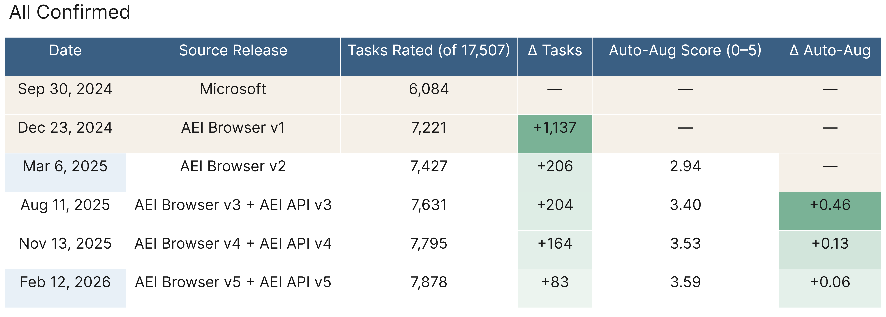

A 6-column table for the All Confirmed series. Two cream-shaded historical rows at the top (Sep 30 2024 and Dec 23 2024) precede 4 series rows (Mar 6 2025 through Feb 12 2026); the first and last series rows are highlighted blue.

Columns: Date | Source Release | Tasks Rated (of 17,507) | Δ Tasks | Auto-Aug Score (0–5) | Δ Auto-Aug.

The chart's Δ Tasks column is the sequential difference between consecutive snapshots' `n_tasks` (unique `task_normalized` per dataset file). Historical row task counts (for Sep 2024 and Dec 2024) are pulled from the same AEI Both + Micro family files at those snapshot dates — the script (`_build_historical_rows`) loads them at render time and they're not in `trend_data.csv`, so the historical-row figures aren't reproducible without re-running the chart script.

| Date | Source Release | Tasks Rated | Δ Tasks | Auto-Aug | Δ Auto-Aug |
|---|---|---|---|---|---|
| Sep 30, 2024 (historical, cream) | Microsoft | (Sep 2024 AEI Both + Micro task count) | — | — | — |
| Dec 23, 2024 (historical, cream) | AEI Browser v1 | (Dec 2024 AEI Both + Micro task count) | (Dec − Sep) | — | — |
| Mar 6, 2025 (series start, highlighted) | AEI Browser v2 | 7,427 | (7,427 − Dec 2024 count) | 2.94 | — |
| Aug 11, 2025 | AEI Browser v3 + AEI API v3 | 7,631 | +204 | 3.40 | +0.46 |
| Nov 13, 2025 | AEI Browser v4 + AEI API v4 | 7,795 | +164 | 3.53 | +0.13 |
| Feb 12, 2026 (series end, highlighted) | AEI Browser v5 + AEI API v5 | 7,878 | +83 | 3.59 | +0.06 |

The series-row task count grew by 7,878 − 7,427 = **+451 unique tasks** across the Mar 2025 → Feb 2026 range (sum of sequential Δ: 204 + 164 + 83 = 451).

Auto-aug delta first→last: 2.94 → 3.59 = +0.65 over 11 months.

---

### Tasks Rated and AI Capability Over Time — All Sources (Ceiling) Table

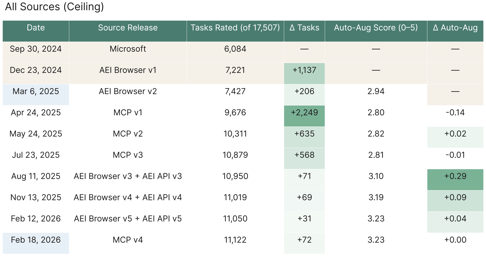

Same 6-column table for the All Sources (Ceiling) series. Two cream historical rows at top, then 8 series rows (Mar 6 2025 → Feb 18 2026); first and last series rows highlighted.

Δ Tasks again is the sequential difference between consecutive snapshots' `n_tasks` (from `trend_data.csv`).

| Date | Source Release | Tasks Rated | Δ Tasks | Auto-Aug | Δ Auto-Aug |
|---|---|---|---|---|---|
| Sep 30, 2024 (historical, cream) | Microsoft | (Sep 2024 All-family count) | — | — | — |
| Dec 23, 2024 (historical, cream) | AEI Browser v1 | (Dec 2024 All-family count) | (Dec − Sep) | — | — |
| Mar 6, 2025 (series start, highlighted) | AEI Browser v2 | 7,427 | (7,427 − Dec 2024 count) | 2.94 | — |
| Apr 24, 2025 | MCP v1 | 9,676 | +2,249 | 2.80 | −0.14 |
| May 24, 2025 | MCP v2 | 10,311 | +635 | 2.82 | +0.02 |
| Jul 23, 2025 | MCP v3 | 10,879 | +568 | 2.81 | −0.01 |
| Aug 11, 2025 | AEI Browser v3 + AEI API v3 | 10,950 | +71 | 3.10 | +0.29 |
| Nov 13, 2025 | AEI Browser v4 + AEI API v4 | 11,019 | +69 | 3.19 | +0.09 |
| Feb 12, 2026 | AEI Browser v5 + AEI API v5 | 11,050 | +31 | 3.23 | +0.04 |
| Feb 18, 2026 (series end, highlighted) | MCP v4 | 11,122 | +72 | 3.23 | +0.00 |

The series-row task count grew by 11,122 − 7,427 = **+3,695 unique tasks** across the Mar 2025 → Feb 2026 range (sum of sequential Δ: 2,249 + 635 + 568 + 71 + 69 + 31 + 72 = 3,695).

Largest single-period jump in tasks rated: **+2,249** at MCP v1 (2025-04-24).

Auto-aug delta first→last for Ceiling: 2.94 → 3.23 = +0.29. The two negative Δ Auto-Aug ticks in the Ceiling table are at MCP v1 (2025-04-24, −0.14) and MCP v3 (2025-07-23, −0.01).

---

## Part 2 — Where AI Exposure Falls

### Major Occupational Categories — % Tasks Exposed (with Variant A / Variant B)

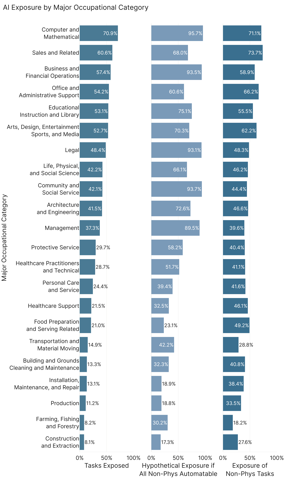

Three side-by-side panels with a shared y-axis (all 22 SOC majors, sorted by All Confirmed % Tasks Exposed descending). Each panel has its x-axis pinned to [0, 100] with ticks at 0 / 50 / 100. Bars wider than 30% put their numeric label inside the bar in white; narrower bars put it outside in dark text.

- **Panel 1 — "Tasks Exposed"**: All Confirmed `pct_tasks_affected` per major.
- **Panel 2 — "Hypothetical Exposure if All Non-Phys Automatable"** (Variant A): naive share of the major's task profile that is non-physical, no AI signal applied.
- **Panel 3 — "Exposure of Non-Phys Tasks"** (Variant B): the pipeline `pct_tasks_affected` restricted to non-physical tasks on both numerator and denominator.

| # | Major (sorted by AC % desc) | All Confirmed % | Variant A % | Variant B % |
|---|---|---|---|---|
| 1 | Computer and Mathematical | 70.87 | 95.73 | 71.11 |
| 2 | Sales and Related | 60.60 | 67.95 | 73.66 |
| 3 | Business and Financial Operations | 57.42 | 93.48 | 58.85 |
| 4 | Office and Administrative Support | 54.21 | 60.55 | 66.19 |
| 5 | Educational Instruction and Library | 53.11 | 75.11 | 55.49 |
| 6 | Arts, Design, Entertainment, Sports, and Media | 52.69 | 70.33 | 62.24 |
| 7 | Legal | 48.37 | 93.11 | 48.25 |
| 8 | Life, Physical, and Social Science | 42.21 | 66.11 | 46.20 |
| 9 | Community and Social Service | 42.11 | 93.71 | 44.43 |
| 10 | Architecture and Engineering | 41.48 | 72.57 | 46.65 |
| 11 | Management | 37.30 | 89.50 | 39.63 |
| 12 | Protective Service | 29.67 | 58.22 | 40.37 |
| 13 | Healthcare Practitioners and Technical | 28.66 | 51.74 | 41.08 |
| 14 | Personal Care and Service | 24.44 | 39.38 | 41.60 |
| 15 | Healthcare Support | 21.52 | 32.46 | 46.09 |
| 16 | Food Preparation and Serving Related | 21.03 | 23.13 | 49.17 |
| 17 | Transportation and Material Moving | 14.87 | 42.22 | 28.83 |
| 18 | Building and Grounds Cleaning and Maintenance | 13.28 | 32.26 | 40.80 |
| 19 | Installation, Maintenance, and Repair | 13.11 | 18.87 | 38.38 |
| 20 | Production | 11.17 | 18.77 | 33.49 |
| 21 | Farming, Fishing, and Forestry | 8.19 | 30.24 | 18.19 |
| 22 | Construction and Extraction | 8.11 | 17.27 | 27.57 |

Range on each panel:
- All Confirmed: 8.11% (Construction) to 70.87% (Computer and Math) — 62.8 pp spread.
- Variant A: 17.27% (Construction) to 95.73% (Computer and Math) — 78.5 pp spread.
- Variant B: 18.19% (Farming) to 73.66% (Sales) — 55.5 pp spread.

Majors where Variant B > Variant A (B − A in pp): Food Preparation +26.04, Installation/Maintenance/Repair +19.51, Production +14.72, Healthcare Support +13.63, Construction/Extraction +10.30, Building/Grounds Cleaning +8.54, Sales and Related +5.71, Office and Admin Support +5.64, Personal Care and Service +2.22. The remaining 13 majors have Variant A ≥ Variant B.

---

### Major Occupational Categories — Workers and Wages

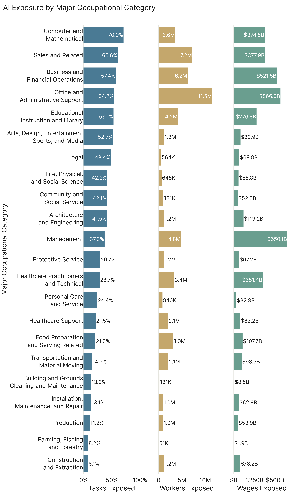

Three side-by-side panels with the same shared y-axis as the previous chart (22 SOC majors sorted by All Confirmed % Tasks Exposed descending; Panel 1 repeats All Confirmed % Tasks as the anchor column). Panel 2 = Workers Exposed; Panel 3 = Wages Exposed.

| # | Major | % Tasks | Workers Exposed | Wages Exposed | rank Workers | rank Wages | rank % Tasks |
|---|---|---|---|---|---|---|---|
| 1 | Computer and Mathematical | 70.87% | 3.59M (3,592,180.56) | $374.46B | 6 | 5 | 1 |
| 2 | Sales and Related | 60.60% | 7.25M (7,246,699.19) | $377.87B | 2 | 4 | 2 |
| 3 | Business and Financial Operations | 57.42% | 6.23M (6,232,699.87) | $521.53B | 3 | 3 | 3 |
| 4 | Office and Administrative Support | 54.21% | 11.54M (11,535,704.39) | $566.01B | 1 | 2 | 4 |
| 5 | Educational Instruction and Library | 53.11% | 4.15M (4,152,317.70) | $276.76B | 5 | 7 | 5 |
| 6 | Arts, Design, Entertainment, Sports, and Media | 52.69% | 1.21M (1,206,084.97) | $82.94B | 11 | 11 | 6 |
| 7 | Legal | 48.37% | 563.71K | $69.77B | 20 | 14 | 7 |
| 8 | Life, Physical, and Social Science | 42.21% | 645.04K | $58.83B | 19 | 17 | 8 |
| 9 | Community and Social Service | 42.11% | 881.26K | $52.34B | 17 | 19 | 9 |
| 10 | Architecture and Engineering | 41.48% | 1.17M (1,170,263.90) | $119.17B | 13 | 8 | 10 |
| 11 | Management | 37.30% | 4.81M (4,808,465.24) | $650.10B | 4 | 1 | 11 |
| 12 | Protective Service | 29.67% | 1.15M (1,152,593.15) | $67.23B | 14 | 15 | 12 |
| 13 | Healthcare Practitioners and Technical | 28.66% | 3.35M (3,351,573.32) | $351.40B | 7 | 6 | 13 |
| 14 | Personal Care and Service | 24.44% | 839.85K | $32.87B | 18 | 20 | 14 |
| 15 | Healthcare Support | 21.52% | 2.06M (2,064,195.32) | $82.23B | 10 | 12 | 15 |
| 16 | Food Preparation and Serving Related | 21.03% | 3.02M (3,016,646.64) | $107.67B | 8 | 9 | 16 |
| 17 | Transportation and Material Moving | 14.87% | 2.07M (2,074,251.85) | $98.50B | 9 | 10 | 17 |
| 18 | Building and Grounds Cleaning and Maintenance | 13.28% | 181.29K | $8.48B | 21 | 21 | 18 |
| 19 | Installation, Maintenance, and Repair | 13.11% | 1.01M (1,005,977.34) | $62.94B | 16 | 16 | 19 |
| 20 | Production | 11.17% | 1.01M (1,007,309.39) | $53.93B | 15 | 18 | 20 |
| 21 | Farming, Fishing, and Forestry | 8.19% | 50.80K | $1.95B | 22 | 22 | 21 |
| 22 | Construction and Extraction | 8.11% | 1.17M (1,174,368.75) | $78.18B | 12 | 13 | 22 |

Workers Exposed range: 50.80K (Farming) to 11.54M (Office and Admin Support); ratio 227.08×.
Wages Exposed range: $1.95B (Farming) to $650.10B (Management); ratio 334.20×.

Summed across all 22 majors at the All Confirmed snapshot: ~57.95M workers exposed, ~$4.10T wages exposed.

---

### Job Zone and Preparation Level — Violin Triptych


Three side-by-side panels with the same vertical job-zone axis (1–5).

- **Left panel — Full economy** (n_all = 923 occupations across the 5 zones): a violin of `pct_tasks_affected` per zone, with median line and per-zone median labeled.
- **Middle panel — Phys mix stacked bar**: a thin horizontal stacked bar per zone showing the share of that zone's occupations that are Physical (≥ 67% of tasks physical), Mixed (33–67%), or Non-physical (< 33%).
- **Right panel — Non-physical only** (n_nonphys per zone): same violin definition but restricted to the 409 non-physical occupations. Zone 1 row blank (0 qualifying occupations).

| Zone | n_all | Median (all) | Mean (all) | n_nonphys | Median (non-phys) | Mean (non-phys) | % Physical | % Mixed | % Non-Phys |
|---|---|---|---|---|---|---|---|---|---|
| 1 | 33 | 3.70% | 8.50% | 0 | — | — | 90.90% | 9.10% | 0.00% |
| 2 | 298 | 12.10% | 18.60% | 31 | 53.10% | 49.20% | 61.70% | 27.90% | 10.40% |
| 3 | 213 | 27.40% | 31.70% | 73 | 51.10% | 48.60% | 36.60% | 29.10% | 34.30% |
| 4 | 225 | 50.10% | 50.30% | 199 | 52.30% | 51.90% | 0.90% | 10.70% | 88.40% |
| 5 | 154 | 47.50% | 50.10% | 106 | 63.40% | 57.60% | 3.90% | 27.30% | 68.80% |

Non-phys-only quartiles (right panel, per `job_zone_nonphys_summary.csv`): Zone 2 q25 = 22.60% / q75 = 63.50%; Zone 3 q25 = 25.30% / q75 = 62.70%; Zone 4 q25 = 32.60% / q75 = 59.40%; Zone 5 q25 = 38.00% / q75 = 73.50%.

Phys-zone crosstab (used to color/aggregate the middle panel) — median / mean pct_tasks_affected per (occ_group × zone):
- Physical Z1: n = 30, median 0.00%, mean 3.40%
- Physical Z2: n = 188, median 2.00%, mean 5.00%
- Physical Z3: n = 82, median 7.00%, mean 9.80%
- Physical Z4: n = 3, median 38.30%, mean 31.50%
- Physical Z5: n = 7, median 13.30%, mean 17.00%
- Mixed Z1: n = 3, median 23.00%, mean 25.60%
- Mixed Z2: n = 85, median 12.50%, mean 18.40%
- Mixed Z3: n = 61, median 14.20%, mean 19.10%
- Mixed Z4: n = 30, median 20.90%, mean 24.00%
- Mixed Z5: n = 41, median 23.70%, mean 23.80%
- Non-physical Z1: n = 0
- Non-physical Z2: n = 25, median 28.80%, mean 31.70%
- Non-physical Z3: n = 70, median 27.70%, mean 30.60%
- Non-physical Z4: n = 192, median 34.70%, mean 34.90%
- Non-physical Z5: n = 106, median 50.70%, mean 47.60%

Full-economy median per zone (left panel): Z1 3.7%, Z2 12.1%, Z3 27.4%, Z4 50.1%, Z5 47.5%. % Physical per zone (middle panel): Z1 90.9%, Z2 61.7%, Z3 36.6%, Z4 0.9%, Z5 3.9%. Non-phys-only median per zone (right panel): Z2 53.1%, Z3 51.1%, Z4 52.3%, Z5 63.4%.

---

### SKA Levels — Skills (Element-Level)


35 horizontal bars, one per O*NET Skill element. Each bar shows AI Top-10 average normalized to % of workforce maximum (`ai_top10 ÷ eco_max × 100`). Bars colored by phys-mix tier (Non-Physical / Mixed / Physical). Each row also has two overlay markers: a diamond at AI Max (% of workforce max) and a circle at Workforce Mean (% of workforce max).

Full enumeration, sorted by `ai_top10_pct` (descending). Format: element — `ai_top10_pct%` (bar value) · phys tier (phys_score, n_occs · ai_max_pct, eco_mean_pct):

1. Speaking — 72.06% · Mixed (phys 39.6, n = 801; ai_max 78.72%, eco_mean 55.84%)
2. Reading Comprehension — 67.59% · Mixed (35.8, 729; 70.90%, 58.50%)
3. Instructing — 67.57% · Non-physical (25.5, 397; 75.48%, 51.03%)
4. Learning Strategies — 67.21% · Non-physical (22.7, 356; 82.07%, 52.27%)
5. Active Learning — 65.13% · Non-physical (29.2, 581; 69.31%, 57.35%)
6. Writing — 64.18% · Non-physical (26.8, 588; 87.77%, 50.21%)
7. Persuasion — 62.18% · Non-physical (20.2, 329; 67.21%, 56.14%)
8. Complex Problem Solving — 60.27% · Mixed (33.5, 644; 65.57%, 54.49%)
9. Monitoring — 60.12% · Mixed (40.0, 767; 62.79%, 57.24%)
10. Time Management — 58.33% · Mixed (36.2, 662; 67.46%, 55.11%)
11. Mathematics — 56.21% · Non-physical (21.0, 237; 74.45%, 40.87%)
12. Coordination — 55.33% · Mixed (36.1, 663; 63.71%, 53.06%)
13. Systems Evaluation — 55.25% · Non-physical (18.5, 326; 61.26%, 53.88%)
14. Critical Thinking — 53.83% · Mixed (40.3, 800; 59.61%, 48.22%)
15. Judgment and Decision Making — 52.64% · Mixed (35.1, 682; 57.89%, 46.93%)
16. Systems Analysis — 52.33% · Non-physical (21.3, 369; 55.15%, 50.81%)
17. Negotiation — 51.50% · Non-physical (16.0, 257; 57.86%, 47.18%)
18. Service Orientation — 51.32% · Non-physical (32.5, 473; 56.35%, 49.58%)
19. Operations Analysis — 51.09% · Non-physical (16.6, 90; 63.41%, 60.54%)
20. Science — 51.09% · Non-physical (29.6, 150; 65.51%, 52.53%)
21. Technology Design — 50.94% · Non-physical (13.5, 19; 65.41%, 79.04%)
22. Active Listening — 50.59% · Mixed (41.2, 830; 53.83%, 45.99%)
23. Programming — 50.42% · Non-physical (8.0, 26; 77.98%, 57.01%)
24. Quality Control Analysis — 49.92% · Mixed (61.0, 233; 57.97%, 63.74%)
25. Management of Personnel Resources — 48.29% · Non-physical (19.9, 192; 55.54%, 51.89%)
26. Social Perceptiveness — 44.62% · Non-physical (30.3, 576; 54.67%, 41.70%)
27. Management of Financial Resources — 40.29% · Non-physical (7.8, 41; 55.54%, 52.10%)
28. Troubleshooting — 37.54% · Physical (71.8, 138; 53.13%, 55.22%)
29. Management of Material Resources — 36.73% · Non-physical (15.5, 29; 55.54%, 57.25%)
30. Operations Monitoring — 33.43% · Mixed (65.3, 303; 39.25%, 50.05%)
31. Equipment Selection — 29.56% · Physical (77.7, 42; 55.69%, 71.19%)
32. Repairing — 25.01% · Physical (78.2, 92; 32.41%, 54.98%)
33. Operation and Control — 20.13% · Physical (74.9, 208; 27.64%, 40.42%)
34. Equipment Maintenance — 20.02% · Physical (77.8, 101; 27.92%, 41.64%)
35. Installation — 17.79% · Physical (76.4, 23; 25.29%, 53.23%)

(Values are computed as `ai_top10 / eco_max × 100`, `ai_max / eco_max × 100`, `eco_mean / eco_max × 100` from the raw `ska_skills.csv`. Bar text on the rendered chart rounds the bar value to integer %.)

Range of bar values: 17.79% (Installation) to 72.06% (Speaking).

---

### SKA Levels — Knowledge and Abilities (Subcategory-Level)


Two stacked sections. Top: 10 Knowledge subcategories (rolled up across 33 elements). Bottom: 15 Abilities subcategories (rolled up across 52 elements). Each bar is the mean across the subcategory's elements of `ai_top10 ÷ eco_max × 100`. Bar color = phys-mix tier of the subcategory's element pool. Each row also has dot markers for the subcategory's AI Max % (diamond) and Workforce Mean % (circle).

**Knowledge subcategories — 10 bars, sorted by ai_top10_pct desc:**

| # | Subcategory | n_elements | ai_top10_pct | ai_p95_pct | ai_max_pct | eco_mean_pct | phys_score | phys_tier |
|---|---|---|---|---|---|---|---|---|
| 1 | Education and Training | 1 | 69.69% | 56.82% | 84.97% | 49.04% | 36.20 | Mixed |
| 2 | Business and Management | 6 | 60.12% | 50.59% | 73.21% | 49.13% | 29.44 | Non-physical |
| 3 | Mathematics and Science | 7 | 53.28% | 45.05% | 70.88% | 48.71% | 32.27 | Non-physical |
| 4 | Communications | 2 | 53.25% | 52.59% | 74.02% | 45.30% | 27.27 | Non-physical |
| 5 | Engineering and Technology | 5 | 52.73% | 42.47% | 67.61% | 51.65% | 46.96 | Mixed |
| 6 | Arts and Humanities | 5 | 50.46% | 60.24% | 74.69% | 52.41% | 24.32 | Non-physical |
| 7 | Law and Public Safety | 2 | 47.53% | 38.13% | 64.62% | 44.44% | 35.26 | Mixed |
| 8 | Health Services | 2 | 41.65% | 40.15% | 49.74% | 54.98% | 36.41 | Mixed |
| 9 | Manufacturing and Production | 2 | 41.20% | 45.15% | 54.70% | 58.47% | 58.01 | Mixed |
| 10 | Transportation | 1 | 39.57% | 39.20% | 51.08% | 47.37% | 51.89 | Mixed |

Range of Knowledge bars: 39.57% (Transportation) to 69.69% (Education and Training).

**Abilities subcategories — 15 bars, sorted by ai_top10_pct desc:**

| # | Subcategory | n_elements | ai_top10_pct | ai_p95_pct | ai_max_pct | eco_mean_pct | phys_score | phys_tier |
|---|---|---|---|---|---|---|---|---|
| 1 | Verbal | 4 | 70.16% | 58.78% | 74.99% | 59.31% | 37.90 | Mixed |
| 2 | Idea Generation | 7 | 59.65% | 48.00% | 66.98% | 53.74% | 35.14 | Mixed |
| 3 | Quantitative | 2 | 59.16% | 46.13% | 74.02% | 44.36% | 21.00 | Non-physical |
| 4 | Memory | 1 | 48.26% | 46.77% | 79.12% | 60.72% | 26.34 | Non-physical |
| 5 | Perceptual | 3 | 43.22% | 37.28% | 50.25% | 52.49% | 41.10 | Mixed |
| 6 | Auditory and Speech | 5 | 35.01% | 28.33% | 49.38% | 61.96% | 58.89 | Mixed |
| 7 | Attentiveness | 2 | 33.28% | 28.41% | 39.93% | 42.14% | 46.74 | Mixed |
| 8 | Spatial | 2 | 33.07% | 31.19% | 40.09% | 55.29% | 63.06 | Mixed |
| 9 | Fine Manipulative | 3 | 31.31% | 23.32% | 41.51% | 51.30% | 73.70 | Physical |
| 10 | Visual | 7 | 26.17% | 24.38% | 33.27% | 58.80% | 60.10 | Mixed |
| 11 | Control Movement | 4 | 17.21% | 13.58% | 23.46% | 49.99% | 77.12 | Physical |
| 12 | Strength | 4 | 15.45% | 16.20% | 24.44% | 56.58% | 74.29 | Physical |
| 13 | Flexibility, Balance, Coordination | 4 | 14.91% | 17.78% | 29.33% | 54.63% | 71.11 | Physical |
| 14 | Endurance | 1 | 14.81% | 13.77% | 27.09% | 49.57% | 81.11 | Physical |
| 15 | Reaction | 3 | 13.49% | 29.59% | 34.07% | 69.40% | 76.01 | Physical |

Range of Abilities bars: 13.49% (Reaction) to 70.16% (Verbal).

---

### Work Activity Exposure — GWAs (% Tasks)

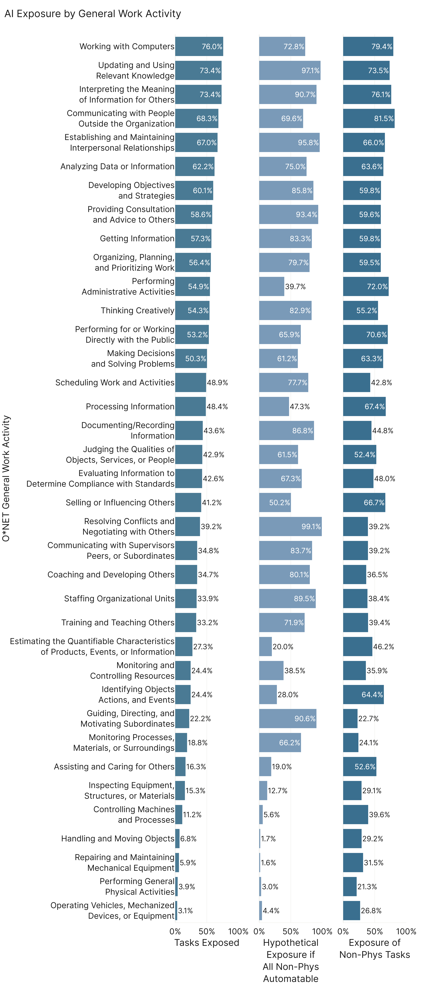

Same panel framing as `major_categories_pct.png`, applied to GWAs. Three side-by-side panels on a shared y-axis listing all 37 O*NET General Work Activities (sorted by All Confirmed `pct_tasks_affected` descending):
- Panel 1: "Tasks Exposed" (All Confirmed pct_tasks_affected)
- Panel 2: "Hypothetical Exposure if All Non-Phys Automatable" (Variant A)
- Panel 3: "Exposure of Non-Phys Tasks" (Variant B)

| # | GWA | All Confirmed % | Variant A % | Variant B % |
|---|---|---|---|---|
| 1 | Working with Computers | 75.97 | 72.83 | 79.37 |
| 2 | Updating and Using Relevant Knowledge | 73.39 | 97.10 | 73.53 |
| 3 | Interpreting the Meaning of Information for Others | 73.36 | 90.71 | 76.08 |
| 4 | Communicating with People Outside the Organization | 68.33 | 69.55 | 81.47 |
| 5 | Establishing and Maintaining Interpersonal Relationships | 67.00 | 95.75 | 66.02 |
| 6 | Analyzing Data or Information | 62.22 | 74.96 | 63.63 |
| 7 | Developing Objectives and Strategies | 60.13 | 85.80 | 59.85 |
| 8 | Providing Consultation and Advice to Others | 58.56 | 93.42 | 59.57 |
| 9 | Getting Information | 57.31 | 83.32 | 59.76 |
| 10 | Organizing, Planning, and Prioritizing Work | 56.43 | 79.70 | 59.55 |
| 11 | Performing Administrative Activities | 54.94 | 39.71 | 72.01 |
| 12 | Thinking Creatively | 54.28 | 82.93 | 55.17 |
| 13 | Performing for or Working Directly with the Public | 53.19 | 65.86 | 70.64 |
| 14 | Making Decisions and Solving Problems | 50.32 | 61.15 | 63.29 |
| 15 | Scheduling Work and Activities | 48.92 | 77.68 | 42.85 |
| 16 | Processing Information | 48.45 | 47.25 | 67.37 |
| 17 | Documenting/Recording Information | 43.59 | 86.77 | 44.80 |
| 18 | Judging the Qualities of Objects, Services, or People | 42.89 | 61.51 | 52.44 |
| 19 | Evaluating Information to Determine Compliance with Standards | 42.57 | 67.32 | 47.97 |
| 20 | Selling or Influencing Others | 41.15 | 50.24 | 66.72 |
| 21 | Resolving Conflicts and Negotiating with Others | 39.21 | 99.11 | 39.16 |
| 22 | Communicating with Supervisors, Peers, or Subordinates | 34.75 | 83.71 | 39.24 |
| 23 | Coaching and Developing Others | 34.70 | 80.10 | 36.47 |
| 24 | Staffing Organizational Units | 33.87 | 89.50 | 38.44 |
| 25 | Training and Teaching Others | 33.21 | 71.90 | 39.41 |
| 26 | Estimating the Quantifiable Characteristics of Products, Events, or Information | 27.26 | 20.03 | 46.20 |
| 27 | Monitoring and Controlling Resources | 24.39 | 38.54 | 35.91 |
| 28 | Identifying Objects, Actions, and Events | 24.39 | 27.99 | 64.40 |
| 29 | Guiding, Directing, and Motivating Subordinates | 22.16 | 90.61 | 22.74 |
| 30 | Monitoring Processes, Materials, or Surroundings | 18.78 | 66.17 | 24.12 |
| 31 | Assisting and Caring for Others | 16.31 | 19.04 | 52.57 |
| 32 | Inspecting Equipment, Structures, or Materials | 15.31 | 12.67 | 29.08 |
| 33 | Controlling Machines and Processes | 11.17 | 5.62 | 39.57 |
| 34 | Handling and Moving Objects | 6.82 | 1.68 | 29.19 |
| 35 | Repairing and Maintaining Mechanical Equipment | 5.91 | 1.55 | 31.53 |
| 36 | Performing General Physical Activities | 3.87 | 3.04 | 21.34 |
| 37 | Operating Vehicles, Mechanized Devices, or Equipment | 3.11 | 4.41 | 26.85 |

Range on All Confirmed: 3.11% (Operating Vehicles) to 75.97% (Working with Computers).
Range on Variant A: 1.55% (Repairing/Maintaining) to 99.11% (Resolving Conflicts).
Range on Variant B: 21.34% (Performing General Physical) to 81.47% (Communicating with People Outside the Organization).

Workers and wages columns for these same 37 GWAs are reported in the appendix `gwa_wkrs_wages` chart (see below).

---

## Part 3 — Action: What To Do About It

### Agentic Confirmed vs. Agentic Ceiling Gap — Top 10 Major Occupational Categories

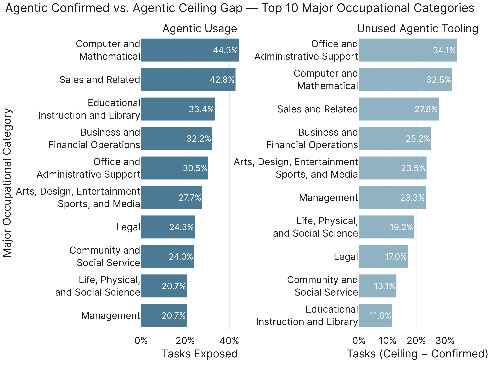

Two-panel horizontal bar chart for the **top 10 major occupational categories** ranked by `agentic_confirmed` % tasks affected. Both panels show the same 10 categories but with different rankings:

- **Panel 1 — "Agentic Usage"**: bar = Agentic Confirmed (AEI API only, eco_2025-rebased) % tasks affected. Sorted by this value descending.
- **Panel 2 — "Unused Agentic Tooling"**: bar = pct_gap = Agentic Ceiling − Agentic Confirmed = the additional % tasks that the MCP-augmented ceiling reaches beyond confirmed agentic usage. Same 10 majors, re-sorted by gap descending.

Per-major numbers (sorted by pct_conf desc, with pct_ceil and gap shown):

| # | Major | Agentic Confirmed % | Agentic Ceiling % | Ceiling Gap (pp) |
|---|---|---|---|---|
| 1 | Computer and Mathematical | 44.281 | 76.754 | 32.473 |
| 2 | Sales and Related | 42.759 | 70.545 | 27.786 |
| 3 | Educational Instruction and Library | 33.389 | 45.027 | 11.638 |
| 4 | Business and Financial Operations | 32.201 | 57.354 | 25.153 |
| 5 | Office and Administrative Support | 30.456 | 64.532 | 34.076 |
| 6 | Arts, Design, Entertainment, Sports, and Media | 27.737 | 51.283 | 23.546 |
| 7 | Legal | 24.316 | 41.332 | 17.016 |
| 8 | Community and Social Service | 24.010 | 37.068 | 13.057 |
| 9 | Life, Physical, and Social Science | 20.719 | 39.933 | 19.214 |
| 10 | Management | 20.667 | 43.937 | 23.270 |

Panel 1 (Agentic Confirmed) range: 20.67% (Management) to 44.28% (Computer and Math).

Panel 2 (Ceiling Gap), sorted by gap descending (this is the order Panel 2 renders):
1. Office and Administrative Support — gap 34.08 pp
2. Computer and Mathematical — gap 32.47 pp
3. Sales and Related — gap 27.79 pp
4. Business and Financial Operations — gap 25.15 pp
5. Arts, Design, Entertainment, Sports, and Media — gap 23.55 pp
6. Management — gap 23.27 pp
7. Life, Physical, and Social Science — gap 19.21 pp
8. Legal — gap 17.02 pp
9. Community and Social Service — gap 13.06 pp
10. Educational Instruction and Library — gap 11.64 pp

Ceiling Gap range across the 10: 11.64 pp (Educational Instruction) to 34.08 pp (Office and Admin Support).

---

### Agentic Confirmed vs. Agentic Ceiling Gap — Top 10 General Work Activities

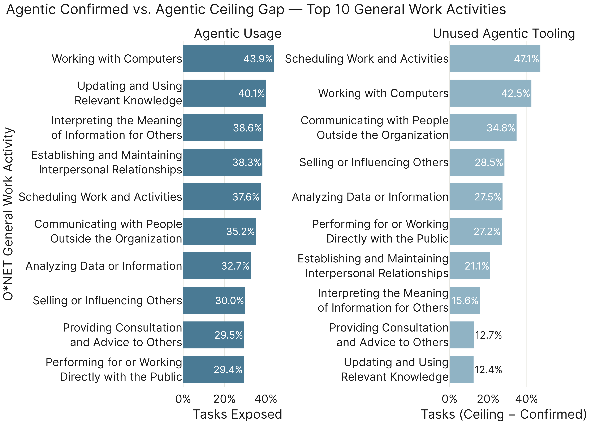

Same 2-panel structure as the major chart, but at the GWA level. Top 10 GWAs by Agentic Confirmed %.

| # | GWA | Agentic Confirmed % | Agentic Ceiling % | Ceiling Gap (pp) |
|---|---|---|---|---|
| 1 | Working with Computers | 43.903 | 86.374 | 42.470 |
| 2 | Updating and Using Relevant Knowledge | 40.126 | 52.545 | 12.420 |
| 3 | Interpreting the Meaning of Information for Others | 38.597 | 54.217 | 15.620 |
| 4 | Establishing and Maintaining Interpersonal Relationships | 38.350 | 59.483 | 21.133 |
| 5 | Scheduling Work and Activities | 37.557 | 84.685 | 47.128 |
| 6 | Communicating with People Outside the Organization | 35.239 | 69.990 | 34.751 |
| 7 | Analyzing Data or Information | 32.722 | 60.192 | 27.471 |
| 8 | Selling or Influencing Others | 30.013 | 58.489 | 28.476 |
| 9 | Providing Consultation and Advice to Others | 29.509 | 42.239 | 12.730 |
| 10 | Performing for or Working Directly with the Public | 29.384 | 56.535 | 27.152 |

Panel 1 (Agentic Confirmed) range: 29.38% (Performing for or Working Directly with the Public) to 43.90% (Working with Computers).

Panel 2 (Ceiling Gap) sorted by gap descending:
1. Scheduling Work and Activities — gap 47.13 pp
2. Working with Computers — gap 42.47 pp
3. Communicating with People Outside the Organization — gap 34.75 pp
4. Selling or Influencing Others — gap 28.48 pp
5. Analyzing Data or Information — gap 27.47 pp
6. Performing for or Working Directly with the Public — gap 27.15 pp
7. Establishing and Maintaining Interpersonal Relationships — gap 21.13 pp
8. Interpreting the Meaning of Information for Others — gap 15.62 pp
9. Providing Consultation and Advice to Others — gap 12.73 pp
10. Updating and Using Relevant Knowledge — gap 12.42 pp

Ceiling Gap range: 12.42 pp (Updating and Using Relevant Knowledge) to 47.13 pp (Scheduling Work and Activities).

---

### Tech Commodities Where AI Has Reach


Top 25 O*NET software commodities (after stripping the trailing " software" word from each label) selected by Σ workers using the commodity (each (occupation, software) pair contributes that occupation's emp once), then ranked by mean % tasks affected for the rendered chart. Bars are horizontal; bar length = mean % tasks affected (All Confirmed `pct_tasks_affected`). Bar color = workers using on a light → dark gold ramp. Right-side annotation per bar: "N occs" (count of distinct occupations using that commodity).

Per commodity (sorted as in the CSV — by mean_pct_affected descending):

| # | Commodity | Mean % Tasks Affected | Workers Using (Σ emp) | n_occs | n_entries |
|---|---|---|---|---|---|
| 1 | Data base management system software | 68.368 | 138,566,501.81 (~138.57M) | 109 | 553 |
| 2 | Web platform development software | 67.534 | 193,413,889.48 (~193.41M) | 152 | 851 |
| 3 | Financial analysis software | 67.331 | 238,130,121.36 (~238.13M) | 94 | 600 |
| 4 | Business intelligence and data analysis software | 66.237 | 127,893,148.91 (~127.89M) | 117 | 347 |
| 5 | Customer relationship management CRM software | 62.282 | 242,454,037.96 (~242.45M) | 155 | 412 |
| 6 | Development environment software | 62.066 | 249,017,126.83 (~249.02M) | 200 | 1,146 |
| 7 | Object or component oriented development software | 60.154 | 158,463,065.96 (~158.46M) | 211 | 906 |
| 8 | Web page creation and editing software | 57.879 | 144,454,451.12 (~144.45M) | 207 | 443 |
| 9 | Document management software | 55.178 | 185,582,635.16 (~185.58M) | 293 | 612 |
| 10 | Human resources software | 53.760 | 165,968,670.74 (~165.97M) | 89 | 395 |
| 11 | Operating system software | 53.263 | 266,042,626.19 (~266.04M) | 362 | 980 |
| 12 | Graphics or photo imaging software | 52.690 | 140,945,882.04 (~140.95M) | 279 | 850 |
| 13 | Enterprise resource planning ERP software | 50.907 | 451,395,416.12 (~451.40M) | 381 | 1,264 |
| 14 | Accounting software | 49.639 | 258,556,225.62 (~258.56M) | 178 | 462 |
| 15 | Data base user interface and query software | 48.336 | 614,400,963.84 (~614.40M) | 632 | 2,518 |
| 16 | Analytical or scientific software | 48.233 | 267,155,688.19 (~267.16M) | 372 | 2,898 |
| 17 | Project management software | 47.490 | 174,332,005.19 (~174.33M) | 309 | 693 |
| 18 | Presentation software | 45.702 | 147,241,471.92 (~147.24M) | 635 | 773 |
| 19 | Internet browser software | 44.159 | 142,545,614.79 (~142.55M) | 487 | 589 |
| 20 | Point of sale POS software | 42.387 | 281,874,823.00 (~281.87M) | 59 | 208 |
| 21 | Word processing software | 42.186 | 282,904,905.79 (~282.90M) | 804 | 1,397 |
| 22 | Electronic mail software | 41.471 | 255,322,899.59 (~255.32M) | 735 | 1,141 |
| 23 | Office suite software | 38.566 | 167,309,709.60 (~167.31M) | 818 | 928 |
| 24 | Medical software | 38.134 | 308,860,294.37 (~308.86M) | 190 | 1,614 |
| 25 | Spreadsheet software | 36.631 | 191,764,942.44 (~191.76M) | 861 | 1,058 |

Color-encoded "workers using" range (the bar color scale on the chart): min ≈ 127.89M (Business intelligence and data analysis), max ≈ 614.40M (Data base user interface and query). Chart text legend at the bottom reads "Workers Using {min} ■■■■■■■ {max}" with the light → dark gold gradient.

Mean % tasks affected range: 36.63% (Spreadsheet software) to 68.37% (Data base management system software); 31.74 pp spread.

Top 5 by n_occs: Spreadsheet (861), Office suite (818), Word processing (804), Electronic mail (735), Presentation (635).

Top 5 by mean % tasks affected: DBMS (68.37%), Web platform dev (67.53%), Financial analysis (67.33%), Business intelligence (66.24%), CRM (62.28%).

n_entries range: 208 (Point of sale POS) to 2,898 (Analytical or scientific). The workers_using column is the sum of emp across all (occupation, software) entries within the commodity.

---

### Occupations with High AI Exposure and Negative Employment Projection


Horizontal bar chart of the 44 occupations in the SKA-gated focused set: BLS projected employment 2024–2034 < 0%, current pct_tasks_exposed > a threshold, exposure trending up, and AI capability ≥ SKA need (`ska_gated == 1`). Bars are ordered by **absolute** BLS projected decline (most negative first). Bar length = `|emp_proj_pct|`. Bar color = pct_tasks_exposed on a light → dark blue ramp. Right-side annotation per bar: "{pct}% tasks". In-bar text: signed `emp_proj_pct` (e.g. "−36.1%"). X-axis from 0% up to ~40%+ with ticks at 0/10/20/30/40.

Per occupation (Major · Job Zone · BLS proj % · pct_tasks_exposed % · SKA AI-as-% of need · pct_delta vs first snapshot · workers_affected · wages_affected). Sorted by descending |emp_proj_pct|:

1. **Word Processors and Typists** — Office/Admin, Z2 · −36.10% · 71.282% tasks · ska 128.086% · Δpct +26.877 pp · 24,955.97 wk · $1.230B
2. **Switchboard Operators, Including Answering Service** — Office/Admin, Z2 · −26.30% · 66.370% · 137.298% · +21.109 pp · 22,751.68 wk · $878.90M
3. **Data Entry Keyers** — Office/Admin, Z2 · −25.90% · 62.741% · 122.349% · +14.129 pp · 79,731.71 wk · $3.296B
4. **Telemarketers** — Sales, Z2 · −22.10% · 83.145% · 132.142% · +38.998 pp · 48,581.79 wk · $1.722B
5. **Order Clerks** — Office/Admin, Z2 · −17.20% · 62.696% · 123.843% · +19.475 pp · 47,147.49 wk · $2.177B
6. **Payroll and Timekeeping Clerks** — Office/Admin, Z3 · −16.70% · 51.076% · 124.412% · +15.314 pp · 78,218.10 wk · $4.557B
7. **File Clerks** — Office/Admin, Z2 · −15.90% · 57.454% · 135.012% · +15.800 pp · 42,194.03 wk · $1.840B
8. **Adult Basic Education, Adult Secondary Education, and English as a Second Language Instructors** — Educational, Z4 · −13.70% · 65.497% · 114.336% · +14.878 pp · 24,437.06 wk · $1.504B
9. **Desktop Publishers** — Office/Admin, Z3 · −12.40% · 67.771% · 113.628% · +10.081 pp · 2,270.34 wk · $125.53M
10. **Interviewers, Except Eligibility and Loan** — Office/Admin, Z3 · −11.60% · 71.011% · 123.295% · +24.653 pp · 105,138.36 wk · $4.828B
11. **Bill and Account Collectors** — Office/Admin, Z2 · −10.50% · 72.364% · 135.377% · +23.767 pp · 114,936.45 wk · $5.405B
12. **Brokerage Clerks** — Office/Admin, Z3 · −9.50% · 77.313% · 131.958% · +28.567 pp · 27,786.24 wk · $1.827B
13. **Procurement Clerks** — Office/Admin, Z2 · −8.70% · 69.305% · 127.826% · +10.470 pp · 38,679.03 wk · $1.956B
14. **Shipping, Receiving, and Inventory Clerks** — Office/Admin, Z2 · −7.70% · 51.916% · 159.145% · +18.160 pp · 424,087.10 wk · $19.194B
15. **Human Resources Assistants, Except Payroll and Timekeeping** — Office/Admin, Z3 · −7.10% · 82.084% · 119.943% · +35.819 pp · 74,055.94 wk · $3.748B
16. **Library Technicians** — Educational, Z3 · −6.80% · 55.429% · 147.641% · +10.586 pp · 38,074.22 wk · $1.697B
17. **Office Clerks, General** — Office/Admin, Z2 · −6.70% · 65.505% · 142.138% · +21.964 pp · 1,614,661.39 wk · $72.676B
18. **Advertising Sales Agents** — Sales, Z4 · −6.40% · 84.016% · 113.281% · +24.573 pp · 77,043.07 wk · $4.994B
19. **Credit Authorizers, Checkers, and Clerks** — Office/Admin, Z2 · −6.20% · 65.442% · 140.728% · +18.329 pp · 7,872.69 wk · $394.26M
20. **Computer Programmers** — Computer/Math, Z4 · −6.00% · 77.981% · 119.050% · +20.445 pp · 71,922.14 wk · $7.220B
21. **Legal Secretaries and Administrative Assistants** — Office/Admin, Z3 · −5.80% · 62.021% · 116.848% · +34.797 pp · 96,926.06 wk · $5.386B
22. **Bookkeeping, Accounting, and Auditing Clerks** — Office/Admin, Z3 · −5.80% · 69.095% · 135.588% · +16.826 pp · 949,144.56 wk · $48.093B
23. **Correspondence Clerks** — Office/Admin, Z2 · −5.60% · 52.342% · 127.531% · +6.777 pp · 2,245.49 wk · $105.09M
24. **Customer Service Representatives** — Office/Admin, Z2 · −5.50% · 86.833% · 132.352% · +21.268 pp · 2,253,977.91 wk · $100.911B
25. **Claims Adjusters, Examiners, and Investigators** — Business/Financial, Z4 · −5.10% · 68.287% · 109.213% · +29.550 pp · 221,406.45 wk · $17.270B
26. **First-Line Supervisors of Retail Sales Workers** — Sales, Z2 · −5.00% · 64.238% · 125.425% · +26.999 pp · 720,621.36 wk · $34.965B
27. **Medical Transcriptionists** — Healthcare Support, Z3 · −4.90% · 75.492% · 118.422% · +25.503 pp · 31,366.82 wk · $1.268B
28. **Credit Analysts** — Business/Financial, Z4 · −4.40% · 68.030% · 112.710% · +22.241 pp · 43,804.26 wk · $3.658B
29. **News Analysts, Reporters, and Journalists** — Arts/Design/Ent, Z4 · −3.90% · 78.531% · 114.392% · +17.008 pp · 30,823.31 wk · $1.917B
30. **Insurance Claims and Policy Processing Clerks** — Office/Admin, Z2 · −3.70% · 69.057% · 138.580% · +11.799 pp · 147,961.47 wk · $7.284B
31. **Computer User Support Specialists** — Computer/Math, Z3 · −3.70% · 81.775% · 113.294% · +34.612 pp · 586,481.12 wk · $36.280B
32. **Insurance Underwriters** — Business/Financial, Z4 · −2.60% · 55.394% · 125.447% · +11.983 pp · 58,396.64 wk · $4.752B
33. **Statistical Assistants** — Office/Admin, Z4 · −2.50% · 83.797% · 114.166% · +28.573 pp · 3,946.84 wk · $198.64M
34. **Loan Interviewers and Clerks** — Office/Admin, Z3 · −2.30% · 62.664% · 120.081% · +19.929 pp · 103,263.98 wk · $5.165B
35. **Career/Technical Education Teachers, Middle School** — Educational, Z4 · −2.00% · 53.058% · 112.726% · +15.279 pp · 8,950.85 wk · $582.07M
36. **Middle School Teachers, Except Special and Career/Technical Education** — Educational, Z4 · −2.00% · 58.850% · 111.791% · +11.935 pp · 364,921.12 wk · $23.490B
37. **Executive Secretaries and Executive Administrative Assistants** — Office/Admin, Z3 · −1.60% · 56.890% · 117.448% · +20.071 pp · 261,644.16 wk · $20.039B
38. **Secretaries and Administrative Assistants, Except Legal, Medical, and Executive** — Office/Admin, Z2 · −1.60% · 73.651% · 119.145% · +18.531 pp · 1,257,070.93 wk · $59.761B
39. **Fine Artists, Including Painters, Sculptors, and Illustrators** — Arts/Design/Ent, Z3 · −1.20% · 65.911% · 120.367% · +15.708 pp · 7,395.24 wk · $410.36M
40. **Dispatchers, Except Police, Fire, and Ambulance** — Office/Admin, Z2 · −0.90% · 71.463% · 118.826% · +40.678 pp · 144,933.48 wk · $7.296B
41. **Database Administrators** — Computer/Math, Z4 · −0.70% · 76.423% · 112.804% · +13.299 pp · 37,306.43 wk · $4.660B
42. **Retail Salespersons** — Sales, Z2 · −0.50% · 52.932% · 137.234% · +17.206 pp · 2,063,203.05 wk · $73.058B
43. **Billing and Posting Clerks** — Office/Admin, Z3 · −0.40% · 71.821% · 141.059% · +27.347 pp · 290,198.43 wk · $14.075B
44. **First-Line Supervisors of Office and Administrative Support Workers** — Office/Admin, Z3 · −0.30% · 68.804% · 109.582% · +26.443 pp · 988,487.05 wk · $68.700B

**Composition of the focused 44 (from `risk_score_5f_counts.csv`):**

By job zone:
- Zone 2: 18 occupations
- Zone 3: 15 occupations
- Zone 4: 11 occupations
- Zone 1 / Zone 5: 0

By major occupational category:
- Office and Administrative Support: 27 occupations
- Sales and Related: 4
- Educational Instruction and Library: 4
- Computer and Mathematical: 3
- Business and Financial Operations: 3
- Arts, Design, Entertainment, Sports, and Media: 2
- Healthcare Support: 1

pct_tasks_exposed range across the 44: 51.08% (Payroll and Timekeeping Clerks) to 86.83% (Customer Service Representatives).

|emp_proj_pct| range: 0.30% (First-Line Supervisors of Office and Admin Support Workers) to 36.10% (Word Processors and Typists).

Summed workers across the 44 occupations: 13.64M (13,639,021.79 from `workers_affected` column).
Summed wages across the 44: $680.59B ($680,592,988,769.33).

Top 8 single-occupation workers_affected values: Customer Service Reps 2.25M, Retail Salespersons 2.06M, Office Clerks General 1.61M, Secretaries and Admin Assistants 1.26M, Office and Admin Supervisors 988.5K, Bookkeeping/Accounting/Auditing Clerks 949.1K, Sales Supervisors 720.6K, Computer User Support Specialists 586.5K.

The chart's color legend at the bottom reads "Tasks Exposed 51% ■■■■■■■ 87%".

---

### U.S. States Clustered on AI Exposure

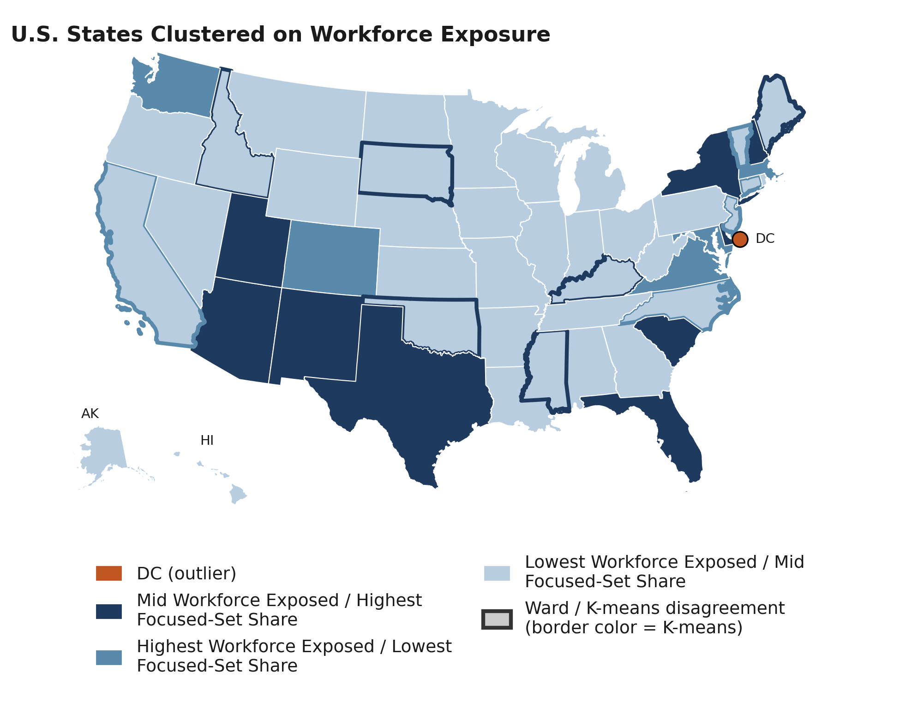

Matplotlib choropleth of the U.S. states colored by Ward hierarchical-cluster assignment (k = 3 + 1 outlier). DC renders as a small labeled marker east of MD. AK and HI render in lower-left inset axes. States where Ward and K-means disagree carry a diagonal-stripe overlay in the K-means cluster's color.

**Cluster definitions (per `state_clusters_map.csv` `cluster_name`):**
- **Cluster −1 (outlier)**: DC — "45.9% workforce exposed, 4.5% emp share in High AI Exp & <0 Emp Proj occs."
- **Cluster 1**: "Mid Workforce Exposed / Highest Emp Share in High AI Exp & <0 Emp Proj Occs." 16 states.
- **Cluster 2**: "Highest Workforce Exposed / Lowest Emp Share in High AI Exp & <0 Emp Proj Occs." 6 states.
- **Cluster 3**: "Lowest Workforce Exposed / Mid Emp Share in High AI Exp & <0 Emp Proj Occs." 28 states.

The map itself encodes only the cluster color; the underlying per-state `pct_emp_wtd` and `focused_share_pct` values are listed below for completeness (these are the two features the cluster algorithm uses).

**Cluster −1 (outlier, 1 state):**
- DC — pct_emp_wtd 45.901%, focused_share_pct 4.471%.

**Cluster 1 (Mid Exposure / Highest Focused Share, 16 states):**
- MS 32.588% / 11.562%
- OK 32.716% / 11.050%
- ID 32.817% / 11.618%
- SC 33.827% / 10.934%
- ME 34.175% / 10.605%
- AK 34.515% / 10.474%
- AZ 34.633% / 10.648%
- TN 34.635% / 10.824%
- MO 34.769% / 10.517%
- NM 34.992% / 12.083%
- CT 35.690% / 10.533%
- FL 35.701% / 11.106%
- UT 35.846% / 10.852%
- NH 36.061% / 11.386%
- TX 36.586% / 10.743%
- NY 37.043% / 11.140%

**Cluster 2 (Highest Workforce Exposed / Lowest Focused Share, 6 states):**
- CA 35.629% / 8.459%
- WA 37.059% / 9.241%
- MA 37.356% / 9.168%
- VA 37.426% / 9.360%
- MD 38.040% / 9.543%
- CO 38.866% / 9.565%

**Cluster 3 (Lowest Workforce Exposed / Mid Focused Share, 28 states):**
- NV 30.334% / 9.114%
- IN 31.170% / 9.433%
- KY 31.337% / 10.225%
- ND 31.593% / 9.310%
- WY 31.966% / 10.459%
- LA 32.975% / 10.215%
- AR 32.980% / 10.344%
- SD 33.138% / 10.310%
- WI 33.144% / 9.709%
- AL 33.153% / 10.183%
- IL 33.310% / 9.399%
- KS 33.420% / 9.934%
- HI 33.652% / 10.363%
- OH 33.683% / 9.413%
- NE 33.703% / 9.691%
- MT 33.969% / 10.303%
- WV 34.103% / 9.804%
- IA 34.377% / 9.755%
- PA 34.434% / 9.877%
- MI 34.442% / 9.541%
- OR 34.647% / 9.303%
- MN 34.979% / 10.221%
- RI 34.988% / 9.573%
- NJ 35.127% / 10.008%
- GA 35.518% / 9.955%
- VT 35.789% / 9.393%
- DE 35.827% / 10.181%
- NC 36.126% / 9.528%

(Cluster 3 contains 28 states; Cluster 1 = 16; Cluster 2 = 6; outlier = DC. Total 51 jurisdictions = 50 states + DC.)

`pct_emp_wtd` range: 30.334% (NV) to 45.901% (DC); spread excluding DC is 30.3% (NV) → 38.9% (CO).
`focused_share_pct` range: 4.471% (DC) to 12.083% (NM); spread excluding DC is 8.459% (CA) → 12.083% (NM).

The legend at the bottom of the map renders the cluster names (each with patch swatch) and one additional entry for "Ward / K-means disagreement (stripe color = K-means)" — the disagreement set is drawn in striped overlay on each disagreement state.

---

### AI Usage Intensity by Sector (Anchor-Indexed Lift)


22 majors ranked by AI intensity ratio (Σ pct ÷ Σ freq × emp over the full eco_2025 universe, debiased by Claude / Copilot / ChatGPT GWA-distribution priors, AEI-only no-Microsoft pool), renormalized to sum to 100% across the 22 majors, then divided by the anchor major's value so the anchor reads as 1.00×. **Anchor**: Office and Administrative Support (renormalized share 1.0316% — sits at 1.00× by construction). A dashed vertical line at x = 1.0 marks the anchor (labeled "median"); the statistical median across the 22 lifts is 0.8799×. Bars are colored by `pct_tasks_affected` (the All Confirmed AEI-only-eco_2025 % tasks affected for that major) on a light → dark blue ramp. Bar text shows lift value (e.g., "28.82x") inside in white for wide bars, outside in dark for narrow bars.

Per major (sorted by lift descending):

| # | Major | Lift (×) | ratio_full_pct (% of all-major share) | pct_tasks_affected (color value) |
|---|---|---|---|---|
| 1 | Life, Physical, and Social Science | 28.8184 | 29.7281 | 30.3567 |
| 2 | Computer and Mathematical | 24.3407 | 25.1091 | 51.1236 |
| 3 | Arts, Design, Entertainment, Sports, and Media | 20.4814 | 21.1279 | 40.1116 |
| 4 | Architecture and Engineering | 4.1051 | 4.2347 | 20.9016 |
| 5 | Community and Social Service | 3.4350 | 3.5435 | 33.1954 |
| 6 | Business and Financial Operations | 3.2808 | 3.3844 | 42.6732 |
| 7 | Management | 2.2662 | 2.3378 | 28.6389 |
| 8 | Educational Instruction and Library | 2.1368 | 2.2043 | 48.8850 |
| 9 | Legal | 1.7854 | 1.8418 | 35.9284 |
| 10 | Farming, Fishing, and Forestry | 1.5053 | 1.5528 | 3.8543 |
| 11 | Office and Administrative Support [anchor] | 1.0000 | 1.0316 | 38.1056 |
| 12 | Sales and Related | 0.7597 | 0.7837 | 48.5881 |
| 13 | Personal Care and Service | 0.6887 | 0.7104 | 16.3099 |
| 14 | Healthcare Practitioners and Technical | 0.5258 | 0.5424 | 20.4777 |
| 15 | Protective Service | 0.4958 | 0.5114 | 17.0041 |
| 16 | Production | 0.2982 | 0.3076 | 5.3786 |
| 17 | Installation, Maintenance, and Repair | 0.2860 | 0.2951 | 9.1197 |
| 18 | Healthcare Support | 0.2622 | 0.2704 | 18.5493 |
| 19 | Building and Grounds Cleaning and Maintenance | 0.1960 | 0.2022 | 9.9741 |
| 20 | Construction and Extraction | 0.1599 | 0.1649 | 6.0669 |
| 21 | Transportation and Material Moving | 0.0799 | 0.0824 | 7.5392 |
| 22 | Food Preparation and Serving Related | 0.0326 | 0.0336 | 15.0711 |

Anchor value (Office and Admin Support): ratio_full_pct = 1.0316%. Median lift across the 22: 0.8799×.

Lift range: 0.0326× (Food Preparation) to 28.8184× (Life, Physical, and Social Science). Above-median majors (lift > 0.8799): the top 10 in the table above plus Office and Admin Support (= 1.0000×).

pct_tasks_affected color range across the bars: 3.8543% (Farming) to 51.1236% (Computer and Math). The color legend at the bottom reads "Tasks Exposed 4% ■■■■■■■ 51%" (rounded to integer percent in the legend).

---

## Appendix

The appendix figures share the same scoring sources and configs as the main body. The four `convergence_full_*` charts extend the source-level convergence figures (Part 1) into a full 17×17 lower-triangle matrix per SOC level (5 internal sources + 4 configs + 8 external benchmarks). Eight Eloundou-contaminated cells per panel (rendered where y=an Eloundou benchmark row {Eloundou GPT-4 β, Eloundou Human β} crosses x=a Copilot-derived column {Copilot, All Confirmed, Conversational Confirmed, All Sources (Ceiling)}; 2 × 4 = 8 cells) are grayed out in the rendered figures. Agentic Confirmed and Agentic Ceiling do not contain Copilot/Microsoft data and are therefore NOT marked contaminated.

Rows (y-axis) and columns (lower-triangle x-axis), in chart order: Claude Browser, Claude API, Copilot, MCP, All Confirmed, Conversational Confirmed, Agentic Confirmed, Agentic Ceiling, All Sources (Ceiling), Eloundou GPT-4 β, Eloundou Human β, AIOE Overall, AIOE Reading Compr., Schaal Overall, Schaal DA, Schaal AG, Tomlinson (Copilot). Lower-triangle = 17 × 16 / 2 = 136 unique pairs per panel. All cells significant at p < .001 unless otherwise noted (the few `**` and `*` are flagged in line).

### Appendix — Full Convergence Matrix (Major)


n = 22 for every internal/internal and internal/external pair. All values from `spearman_combined_full_major.csv`. Listed by row (measure_a in CSV) — values shown are ρ vs each preceding measure_b. `[contam]` flag marks the contaminated cells (Copilot-or-derived row × Eloundou column) that the chart grays out.

- **Claude API** ↔ Claude Browser 0.97 ***
- **Copilot** ↔ Claude Browser 0.82 *** | Claude API 0.84 ***
- **MCP** ↔ Claude Browser 0.83 *** | Claude API 0.83 *** | Copilot 0.95 ***
- **All Confirmed** ↔ Claude Browser 0.95 *** | Claude API 0.97 *** | Copilot 0.93 *** | MCP 0.92 ***
- **Conversational Confirmed** ↔ Claude Browser 0.96 *** | Claude API 0.96 *** | Copilot 0.93 *** | MCP 0.92 *** | All Confirmed 0.99 ***
- **Agentic Confirmed** ↔ Claude Browser 0.97 *** | Claude API 1.00 *** | Copilot 0.84 *** | MCP 0.83 *** | All Confirmed 0.97 *** | Conversational Confirmed 0.96 ***
- **Agentic Ceiling** ↔ Claude Browser 0.93 *** | Claude API 0.94 *** | Copilot 0.94 *** | MCP 0.96 *** | All Confirmed 0.98 *** | Conversational Confirmed 0.97 *** | Agentic Confirmed 0.94 ***
- **All Sources (Ceiling)** ↔ Claude Browser 0.93 *** | Claude API 0.94 *** | Copilot 0.94 *** | MCP 0.95 *** | All Confirmed 0.98 *** | Conversational Confirmed 0.98 *** | Agentic Confirmed 0.94 *** | Agentic Ceiling 0.99 ***
- **Eloundou GPT-4 β** ↔ Claude Browser 0.83 *** | Claude API 0.83 *** | Copilot 0.94 *** [contam] | MCP 0.92 *** | All Confirmed 0.90 *** [contam] | Conversational Confirmed 0.90 *** [contam] | Agentic Confirmed 0.83 *** | Agentic Ceiling 0.92 *** | All Sources (Ceiling) 0.92 *** [contam]
- **Eloundou Human β** ↔ Claude Browser 0.87 *** | Claude API 0.89 *** | Copilot 0.94 *** [contam] | MCP 0.93 *** | All Confirmed 0.95 *** [contam] | Conversational Confirmed 0.94 *** [contam] | Agentic Confirmed 0.89 *** | Agentic Ceiling 0.94 *** | All Sources (Ceiling) 0.94 *** [contam] | Eloundou GPT-4 β 0.93 ***
- **AIOE Overall** ↔ Claude Browser 0.84 *** | Claude API 0.86 *** | Copilot 0.85 *** | MCP 0.82 *** | All Confirmed 0.88 *** | Conversational Confirmed 0.87 *** | Agentic Confirmed 0.86 *** | Agentic Ceiling 0.86 *** | All Sources (Ceiling) 0.87 *** | Eloundou GPT-4 β 0.87 *** | Eloundou Human β 0.90 ***
- **AIOE Reading Compr.** ↔ Claude Browser 0.86 *** | Claude API 0.86 *** | Copilot 0.81 *** | MCP 0.77 *** | All Confirmed 0.87 *** | Conversational Confirmed 0.86 *** | Agentic Confirmed 0.86 *** | Agentic Ceiling 0.84 *** | All Sources (Ceiling) 0.85 *** | Eloundou GPT-4 β 0.84 *** | Eloundou Human β 0.87 *** | AIOE Overall 0.99 ***
- **Schaal Overall** ↔ Claude Browser 0.72 *** | Claude API 0.69 *** | Copilot 0.76 *** | MCP 0.72 *** | All Confirmed 0.74 *** | Conversational Confirmed 0.76 *** | Agentic Confirmed 0.69 *** | Agentic Ceiling 0.73 *** | All Sources (Ceiling) 0.72 *** | Eloundou GPT-4 β 0.84 *** | Eloundou Human β 0.78 *** | AIOE Overall 0.77 *** | AIOE Reading Compr. 0.78 ***
- **Schaal DA** ↔ Claude Browser 0.81 *** | Claude API 0.79 *** | Copilot 0.90 *** | MCP 0.89 *** | All Confirmed 0.87 *** | Conversational Confirmed 0.87 *** | Agentic Confirmed 0.79 *** | Agentic Ceiling 0.88 *** | All Sources (Ceiling) 0.89 *** | Eloundou GPT-4 β 0.94 *** | Eloundou Human β 0.89 *** | AIOE Overall 0.81 *** | AIOE Reading Compr. 0.77 *** | Schaal Overall 0.78 ***
- **Schaal AG** ↔ Claude Browser 0.58 ** | Claude API 0.58 ** | Copilot 0.82 *** | MCP 0.86 *** | All Confirmed 0.71 *** | Conversational Confirmed 0.70 *** | Agentic Confirmed 0.58 ** | Agentic Ceiling 0.78 *** | All Sources (Ceiling) 0.77 *** | Eloundou GPT-4 β 0.82 *** | Eloundou Human β 0.78 *** | AIOE Overall 0.65 ** | AIOE Reading Compr. 0.57 ** | Schaal Overall 0.61 ** | Schaal DA 0.89 ***
- **Tomlinson (Copilot)** ↔ Claude Browser 0.84 *** | Claude API 0.81 *** | Copilot 0.81 *** | MCP 0.81 *** | All Confirmed 0.86 *** | Conversational Confirmed 0.87 *** | Agentic Confirmed 0.81 *** | Agentic Ceiling 0.85 *** | All Sources (Ceiling) 0.86 *** | Eloundou GPT-4 β 0.71 *** | Eloundou Human β 0.81 *** | AIOE Overall 0.72 *** | AIOE Reading Compr. 0.72 *** | Schaal Overall 0.52 * | Schaal DA 0.66 *** | Schaal AG 0.53 *

Cell range across all 136 pairs at major level: 0.52 (Tomlinson vs Schaal Overall, p < .05) to 1.00 (Agentic Confirmed ↔ Claude API).

### Appendix — Full Convergence Matrix (Minor)


n = 95 minor categories for every internal/internal and internal/external pair; n = 93 for Tomlinson comparisons. All cells significant at p < .001.

- **Claude API** ↔ Claude Browser 0.92 ***
- **Copilot** ↔ Claude Browser 0.77 *** | Claude API 0.82 ***
- **MCP** ↔ Claude Browser 0.74 *** | Claude API 0.80 *** | Copilot 0.88 ***
- **All Confirmed** ↔ Claude Browser 0.94 *** | Claude API 0.95 *** | Copilot 0.91 *** | MCP 0.84 ***
- **Conversational Confirmed** ↔ Claude Browser 0.94 *** | Claude API 0.93 *** | Copilot 0.92 *** | MCP 0.85 *** | All Confirmed 0.99 ***
- **Agentic Confirmed** ↔ Claude Browser 0.92 *** | Claude API 1.00 *** | Copilot 0.82 *** | MCP 0.80 *** | All Confirmed 0.95 *** | Conversational Confirmed 0.93 ***
- **Agentic Ceiling** ↔ Claude Browser 0.87 *** | Claude API 0.92 *** | Copilot 0.91 *** | MCP 0.95 *** | All Confirmed 0.95 *** | Conversational Confirmed 0.94 *** | Agentic Confirmed 0.92 ***
- **All Sources (Ceiling)** ↔ Claude Browser 0.91 *** | Claude API 0.94 *** | Copilot 0.92 *** | MCP 0.91 *** | All Confirmed 0.98 *** | Conversational Confirmed 0.98 *** | Agentic Confirmed 0.94 *** | Agentic Ceiling 0.98 ***
- **Eloundou GPT-4 β** ↔ Claude Browser 0.82 *** | Claude API 0.85 *** | Copilot 0.90 *** [contam] | MCP 0.86 *** | All Confirmed 0.90 *** [contam] | Conversational Confirmed 0.90 *** [contam] | Agentic Confirmed 0.85 *** | Agentic Ceiling 0.91 *** | All Sources (Ceiling) 0.92 *** [contam]
- **Eloundou Human β** ↔ Claude Browser 0.82 *** | Claude API 0.84 *** | Copilot 0.89 *** [contam] | MCP 0.85 *** | All Confirmed 0.89 *** [contam] | Conversational Confirmed 0.89 *** [contam] | Agentic Confirmed 0.84 *** | Agentic Ceiling 0.89 *** | All Sources (Ceiling) 0.90 *** [contam] | Eloundou GPT-4 β 0.93 ***
- **AIOE Overall** ↔ Claude Browser 0.75 *** | Claude API 0.78 *** | Copilot 0.80 *** | MCP 0.74 *** | All Confirmed 0.82 *** | Conversational Confirmed 0.82 *** | Agentic Confirmed 0.78 *** | Agentic Ceiling 0.81 *** | All Sources (Ceiling) 0.84 *** | Eloundou GPT-4 β 0.87 *** | Eloundou Human β 0.88 ***
- **AIOE Reading Compr.** ↔ Claude Browser 0.80 *** | Claude API 0.81 *** | Copilot 0.79 *** | MCP 0.72 *** | All Confirmed 0.85 *** | Conversational Confirmed 0.85 *** | Agentic Confirmed 0.81 *** | Agentic Ceiling 0.81 *** | All Sources (Ceiling) 0.85 *** | Eloundou GPT-4 β 0.87 *** | Eloundou Human β 0.89 *** | AIOE Overall 0.96 ***
- **Schaal Overall** ↔ Claude Browser 0.68 *** | Claude API 0.60 *** | Copilot 0.65 *** | MCP 0.63 *** | All Confirmed 0.67 *** | Conversational Confirmed 0.69 *** | Agentic Confirmed 0.60 *** | Agentic Ceiling 0.65 *** | All Sources (Ceiling) 0.68 *** | Eloundou GPT-4 β 0.72 *** | Eloundou Human β 0.72 *** | AIOE Overall 0.69 *** | AIOE Reading Compr. 0.71 ***
- **Schaal DA** ↔ Claude Browser 0.71 *** | Claude API 0.70 *** | Copilot 0.81 *** | MCP 0.86 *** | All Confirmed 0.78 *** | Conversational Confirmed 0.79 *** | Agentic Confirmed 0.70 *** | Agentic Ceiling 0.82 *** | All Sources (Ceiling) 0.81 *** | Eloundou GPT-4 β 0.86 *** | Eloundou Human β 0.82 *** | AIOE Overall 0.77 *** | AIOE Reading Compr. 0.72 *** | Schaal Overall 0.73 ***
- **Schaal AG** ↔ Claude Browser 0.54 *** | Claude API 0.61 *** | Copilot 0.73 *** | MCP 0.84 *** | All Confirmed 0.67 *** | Conversational Confirmed 0.67 *** | Agentic Confirmed 0.61 *** | Agentic Ceiling 0.77 *** | All Sources (Ceiling) 0.73 *** | Eloundou GPT-4 β 0.78 *** | Eloundou Human β 0.69 *** | AIOE Overall 0.66 *** | AIOE Reading Compr. 0.58 *** | Schaal Overall 0.50 *** | Schaal DA 0.86 ***
- **Tomlinson (Copilot)** (n = 93) ↔ Claude Browser 0.73 *** | Claude API 0.74 *** | Copilot 0.83 *** | MCP 0.78 *** | All Confirmed 0.81 *** | Conversational Confirmed 0.82 *** | Agentic Confirmed 0.74 *** | Agentic Ceiling 0.80 *** | All Sources (Ceiling) 0.81 *** | Eloundou GPT-4 β 0.72 *** | Eloundou Human β 0.79 *** | AIOE Overall 0.69 *** | AIOE Reading Compr. 0.70 *** | Schaal Overall 0.51 *** | Schaal DA 0.67 *** | Schaal AG 0.56 ***

Cell range at minor level: 0.50 (Schaal AG vs Schaal Overall) to 1.00 (Agentic Confirmed ↔ Claude API).

### Appendix — Full Convergence Matrix (Broad)


n = 439 broad occupations for every internal/internal and internal/external pair; n = 433 for AIOE comparisons; n = 424 for Tomlinson comparisons. All cells significant at p < .001.

- **Claude API** ↔ Claude Browser 0.87 ***
- **Copilot** ↔ Claude Browser 0.72 *** | Claude API 0.71 ***
- **MCP** ↔ Claude Browser 0.65 *** | Claude API 0.68 *** | Copilot 0.80 ***
- **All Confirmed** ↔ Claude Browser 0.91 *** | Claude API 0.90 *** | Copilot 0.89 *** | MCP 0.78 ***
- **Conversational Confirmed** ↔ Claude Browser 0.91 *** | Claude API 0.86 *** | Copilot 0.90 *** | MCP 0.78 *** | All Confirmed 0.99 ***
- **Agentic Confirmed** ↔ Claude Browser 0.87 *** | Claude API 1.00 *** | Copilot 0.71 *** | MCP 0.68 *** | All Confirmed 0.90 *** | Conversational Confirmed 0.86 ***
- **Agentic Ceiling** ↔ Claude Browser 0.80 *** | Claude API 0.86 *** | Copilot 0.83 *** | MCP 0.94 *** | All Confirmed 0.90 *** | Conversational Confirmed 0.88 *** | Agentic Confirmed 0.86 ***
- **All Sources (Ceiling)** ↔ Claude Browser 0.86 *** | Claude API 0.86 *** | Copilot 0.88 *** | MCP 0.90 *** | All Confirmed 0.96 *** | Conversational Confirmed 0.95 *** | Agentic Confirmed 0.86 *** | Agentic Ceiling 0.97 ***
- **Eloundou GPT-4 β** ↔ Claude Browser 0.73 *** | Claude API 0.72 *** | Copilot 0.88 *** [contam] | MCP 0.83 *** | All Confirmed 0.86 *** [contam] | Conversational Confirmed 0.86 *** [contam] | Agentic Confirmed 0.72 *** | Agentic Ceiling 0.86 *** | All Sources (Ceiling) 0.88 *** [contam]
- **Eloundou Human β** ↔ Claude Browser 0.74 *** | Claude API 0.71 *** | Copilot 0.86 *** [contam] | MCP 0.80 *** | All Confirmed 0.85 *** [contam] | Conversational Confirmed 0.86 *** [contam] | Agentic Confirmed 0.71 *** | Agentic Ceiling 0.83 *** | All Sources (Ceiling) 0.87 *** [contam] | Eloundou GPT-4 β 0.92 ***
- **AIOE Overall** (n = 433) ↔ Claude Browser 0.67 *** | Claude API 0.63 *** | Copilot 0.77 *** | MCP 0.74 *** | All Confirmed 0.76 *** | Conversational Confirmed 0.77 *** | Agentic Confirmed 0.63 *** | Agentic Ceiling 0.76 *** | All Sources (Ceiling) 0.79 *** | Eloundou GPT-4 β 0.83 *** | Eloundou Human β 0.84 ***
- **AIOE Reading Compr.** (n = 433) ↔ Claude Browser 0.76 *** | Claude API 0.71 *** | Copilot 0.78 *** | MCP 0.72 *** | All Confirmed 0.82 *** | Conversational Confirmed 0.83 *** | Agentic Confirmed 0.71 *** | Agentic Ceiling 0.79 *** | All Sources (Ceiling) 0.83 *** | Eloundou GPT-4 β 0.85 *** | Eloundou Human β 0.87 *** | AIOE Overall 0.93 ***
- **Schaal Overall** ↔ Claude Browser 0.66 *** | Claude API 0.59 *** | Copilot 0.66 *** | MCP 0.62 *** | All Confirmed 0.71 *** | Conversational Confirmed 0.71 *** | Agentic Confirmed 0.59 *** | Agentic Ceiling 0.66 *** | All Sources (Ceiling) 0.70 *** | Eloundou GPT-4 β 0.74 *** | Eloundou Human β 0.75 *** | AIOE Overall 0.69 *** (n = 433) | AIOE Reading Compr. 0.74 *** (n = 433)
- **Schaal DA** ↔ Claude Browser 0.61 *** | Claude API 0.62 *** | Copilot 0.74 *** | MCP 0.81 *** | All Confirmed 0.72 *** | Conversational Confirmed 0.71 *** | Agentic Confirmed 0.62 *** | Agentic Ceiling 0.79 *** | All Sources (Ceiling) 0.78 *** | Eloundou GPT-4 β 0.83 *** | Eloundou Human β 0.78 *** | AIOE Overall 0.73 *** (n = 433) | AIOE Reading Compr. 0.69 *** (n = 433) | Schaal Overall 0.73 ***
- **Schaal AG** ↔ Claude Browser 0.48 *** | Claude API 0.53 *** | Copilot 0.67 *** | MCP 0.83 *** | All Confirmed 0.62 *** | Conversational Confirmed 0.61 *** | Agentic Confirmed 0.53 *** | Agentic Ceiling 0.77 *** | All Sources (Ceiling) 0.72 *** | Eloundou GPT-4 β 0.78 *** | Eloundou Human β 0.70 *** | AIOE Overall 0.66 *** (n = 433) | AIOE Reading Compr. 0.60 *** (n = 433) | Schaal Overall 0.56 *** | Schaal DA 0.86 ***
- **Tomlinson (Copilot)** (n = 424; AIOE pairs n = 418) ↔ Claude Browser 0.68 *** | Claude API 0.67 *** | Copilot 0.85 *** | MCP 0.73 *** | All Confirmed 0.81 *** | Conversational Confirmed 0.82 *** | Agentic Confirmed 0.67 *** | Agentic Ceiling 0.77 *** | All Sources (Ceiling) 0.81 *** | Eloundou GPT-4 β 0.76 *** | Eloundou Human β 0.78 *** | AIOE Overall 0.69 *** | AIOE Reading Compr. 0.73 *** | Schaal Overall 0.56 *** | Schaal DA 0.64 *** | Schaal AG 0.58 ***

Cell range at broad level: 0.48 (Schaal AG vs Claude Browser) to 1.00 (Agentic Confirmed ↔ Claude API).

### Appendix — Full Convergence Matrix (Occupation)


n = 923 occupations for every internal/internal and internal/external pair; n = 893 for AIOE comparisons; n = 749 for Tomlinson comparisons (n = 724 when Tomlinson is crossed with AIOE). All cells significant at p < .001.

- **Claude API** ↔ Claude Browser 0.84 ***
- **Copilot** ↔ Claude Browser 0.64 *** | Claude API 0.62 ***
- **MCP** ↔ Claude Browser 0.58 *** | Claude API 0.60 *** | Copilot 0.75 ***
- **All Confirmed** ↔ Claude Browser 0.89 *** | Claude API 0.86 *** | Copilot 0.86 *** | MCP 0.73 ***
- **Conversational Confirmed** ↔ Claude Browser 0.88 *** | Claude API 0.80 *** | Copilot 0.89 *** | MCP 0.73 *** | All Confirmed 0.98 ***
- **Agentic Confirmed** ↔ Claude Browser 0.84 *** | Claude API 1.00 *** | Copilot 0.62 *** | MCP 0.60 *** | All Confirmed 0.86 *** | Conversational Confirmed 0.80 ***
- **Agentic Ceiling** ↔ Claude Browser 0.76 *** | Claude API 0.83 *** | Copilot 0.78 *** | MCP 0.92 *** | All Confirmed 0.88 *** | Conversational Confirmed 0.86 *** | Agentic Confirmed 0.83 ***
- **All Sources (Ceiling)** ↔ Claude Browser 0.83 *** | Claude API 0.82 *** | Copilot 0.84 *** | MCP 0.87 *** | All Confirmed 0.95 *** | Conversational Confirmed 0.94 *** | Agentic Confirmed 0.82 *** | Agentic Ceiling 0.96 ***
- **Eloundou GPT-4 β** ↔ Claude Browser 0.67 *** | Claude API 0.64 *** | Copilot 0.84 *** [contam] | MCP 0.77 *** | All Confirmed 0.82 *** [contam] | Conversational Confirmed 0.83 *** [contam] | Agentic Confirmed 0.64 *** | Agentic Ceiling 0.81 *** | All Sources (Ceiling) 0.84 *** [contam]
- **Eloundou Human β** ↔ Claude Browser 0.68 *** | Claude API 0.64 *** | Copilot 0.83 *** [contam] | MCP 0.73 *** | All Confirmed 0.82 *** [contam] | Conversational Confirmed 0.83 *** [contam] | Agentic Confirmed 0.64 *** | Agentic Ceiling 0.78 *** | All Sources (Ceiling) 0.83 *** [contam] | Eloundou GPT-4 β 0.90 ***
- **AIOE Overall** (n = 893) ↔ Claude Browser 0.61 *** | Claude API 0.56 *** | Copilot 0.69 *** | MCP 0.64 *** | All Confirmed 0.70 *** | Conversational Confirmed 0.71 *** | Agentic Confirmed 0.56 *** | Agentic Ceiling 0.68 *** | All Sources (Ceiling) 0.72 *** | Eloundou GPT-4 β 0.78 *** | Eloundou Human β 0.78 ***
- **AIOE Reading Compr.** (n = 893) ↔ Claude Browser 0.70 *** | Claude API 0.64 *** | Copilot 0.72 *** | MCP 0.63 *** | All Confirmed 0.77 *** | Conversational Confirmed 0.78 *** | Agentic Confirmed 0.64 *** | Agentic Ceiling 0.72 *** | All Sources (Ceiling) 0.77 *** | Eloundou GPT-4 β 0.82 *** | Eloundou Human β 0.84 *** | AIOE Overall 0.92 ***
- **Schaal Overall** ↔ Claude Browser 0.62 *** | Claude API 0.54 *** | Copilot 0.62 *** | MCP 0.58 *** | All Confirmed 0.68 *** | Conversational Confirmed 0.68 *** | Agentic Confirmed 0.54 *** | Agentic Ceiling 0.63 *** | All Sources (Ceiling) 0.68 *** | Eloundou GPT-4 β 0.73 *** | Eloundou Human β 0.70 *** | AIOE Overall 0.66 *** (n = 893) | AIOE Reading Compr. 0.71 *** (n = 893)
- **Schaal DA** ↔ Claude Browser 0.53 *** | Claude API 0.52 *** | Copilot 0.70 *** | MCP 0.74 *** | All Confirmed 0.67 *** | Conversational Confirmed 0.67 *** | Agentic Confirmed 0.52 *** | Agentic Ceiling 0.72 *** | All Sources (Ceiling) 0.72 *** | Eloundou GPT-4 β 0.78 *** | Eloundou Human β 0.71 *** | AIOE Overall 0.65 *** (n = 893) | AIOE Reading Compr. 0.62 *** (n = 893) | Schaal Overall 0.74 ***
- **Schaal AG** ↔ Claude Browser 0.38 *** | Claude API 0.42 *** | Copilot 0.63 *** | MCP 0.78 *** | All Confirmed 0.55 *** | Conversational Confirmed 0.55 *** | Agentic Confirmed 0.42 *** | Agentic Ceiling 0.69 *** | All Sources (Ceiling) 0.65 *** | Eloundou GPT-4 β 0.71 *** | Eloundou Human β 0.62 *** | AIOE Overall 0.55 *** (n = 893) | AIOE Reading Compr. 0.49 *** (n = 893) | Schaal Overall 0.56 *** | Schaal DA 0.82 ***
- **Tomlinson (Copilot)** (n = 749; AIOE pairs n = 724) ↔ Claude Browser 0.66 *** | Claude API 0.63 *** | Copilot 0.83 *** | MCP 0.67 *** | All Confirmed 0.80 *** | Conversational Confirmed 0.81 *** | Agentic Confirmed 0.63 *** | Agentic Ceiling 0.73 *** | All Sources (Ceiling) 0.79 *** | Eloundou GPT-4 β 0.72 *** | Eloundou Human β 0.76 *** | AIOE Overall 0.65 *** | AIOE Reading Compr. 0.70 *** | Schaal Overall 0.54 *** | Schaal DA 0.58 *** | Schaal AG 0.50 ***

Cell range at occupation level: 0.38 (Schaal AG vs Claude Browser) to 1.00 (Agentic Confirmed ↔ Claude API).

---

### Appendix — Overview Without Auto-Aug


Same 5-config grouped bar chart as the main Part 1 overview, but with the auto-aug multiplier **off** (every AI-rated task contributes equally regardless of its 0–5 score). Per-config values:

| Config | % Tasks Exposed | % Workers Exposed | % Wages Exposed | Workers (raw) | Wages (raw) |
|---|---|---|---|---|---|
| All Confirmed | 39.80% | 48.10% | 53.40% | 74.37M | $5.27T |
| Conversational Confirmed | 38.40% | 46.60% | 51.60% | 71.93M | $5.09T |
| Agentic Confirmed | 15.00% | 21.90% | 24.80% | 33.86M | $2.45T |
| Agentic Ceiling | 50.40% | 60.20% | 64.90% | 92.97M | $6.41T |
| All Sources (Ceiling) | 59.00% | 68.00% | 73.30% | 105.03M | $7.23T |

Exact CSV values: All Confirmed workers 74,374,696.00; wages $5,266,306,034,246.22. Conversational Confirmed workers 71,934,805.82; wages $5,094,477,859,664.51. Agentic Confirmed workers 33,862,768.47; wages $2,448,266,183,949.03. Agentic Ceiling workers 92,973,127.52; wages $6,408,416,420,337.29. All Sources (Ceiling) workers 105,027,832.02; wages $7,234,656,237,851.77.

Auto-aug-on → auto-aug-off % Tasks delta per config: All Confirmed 29.30 → 39.80 (+10.5 pp); Conversational Confirmed 25.10 → 38.40 (+13.3 pp); Agentic Confirmed 14.40 → 15.00 (+0.6 pp); Agentic Ceiling 30.80 → 50.40 (+19.6 pp); All Sources (Ceiling) 38.70 → 59.00 (+20.3 pp).

---

### Appendix — Temporal Trend (Non-Physical Only)

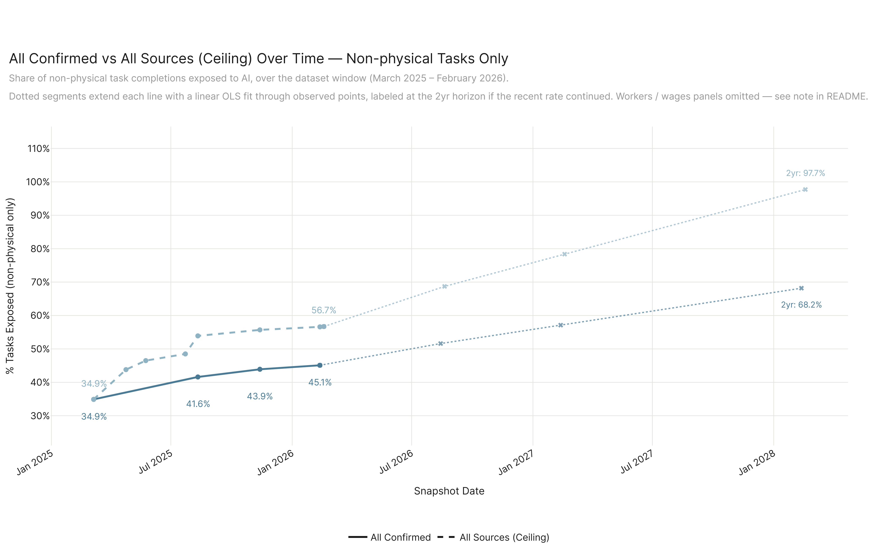

Single-panel % Tasks Exposed time-series with three lines split by physical-task filter:
- **All Confirmed — Non-physical Tasks**: solid line in tasks-color (gold), 4 dates.
- **All Sources (Ceiling) — Non-physical Tasks**: dashed line in light-tasks-color, 8 dates.
- **All Confirmed — Physical Tasks**: solid line in workers-color, 4 dates.

Each line gets a dotted linear-OLS extrapolation to 6mo / 1yr / 2yr horizons; only the 2yr endpoint is labeled.

**All Confirmed — Non-physical Tasks (4 dates):**
- 2025-03-06 (AEI Both + Micro 2025-03-06): 36.40%
- 2025-08-11 (AEI Both + Micro 2025-08-11): 44.00%
- 2025-11-13 (AEI Both + Micro 2025-11-13): 46.90%
- 2026-02-12 (AEI Both + Micro 2026-02-12): 48.20%

Δ first→last: +11.80 pp.

**All Sources (Ceiling) — Non-physical Tasks (8 dates):**
- 2025-03-06 (All 2025-03-06): 36.40%
- 2025-04-24 (All 2025-04-24): 44.90%
- 2025-05-24 (All 2025-05-24): 47.60%
- 2025-07-23 (All 2025-07-23): 49.70%
- 2025-08-11 (All 2025-08-11): 55.70%
- 2025-11-13 (All 2025-11-13): 57.80%
- 2026-02-12 (All 2026-02-12): 58.80%
- 2026-02-18 (All 2026-02-18): 59.00%

Δ first→last: +22.60 pp.

**All Confirmed — Physical Tasks (4 dates):**
- 2025-03-06 (AEI Both + Micro 2025-03-06): 8.50%
- 2025-08-11 (AEI Both + Micro 2025-08-11): 11.10%
- 2025-11-13 (AEI Both + Micro 2025-11-13): 12.20%
- 2026-02-12 (AEI Both + Micro 2026-02-12): 12.70%

Δ first→last: +4.20 pp.

Final-snapshot gap between Non-physical and Physical (All Confirmed): 48.20% − 12.70% = 35.5 pp. Ceiling Non-physical − Confirmed Non-physical at final snapshot: 59.00% − 48.20% = 10.8 pp.

---

### Appendix — Major Occupational Categories: Trend and 2-Year Projection (Tasks)

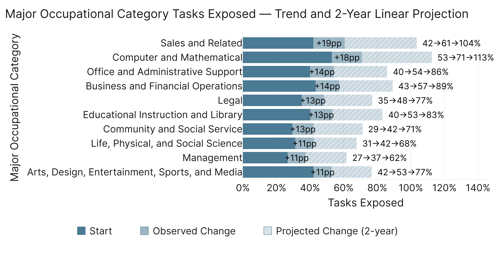

The chart shows **top 10 SOC majors by absolute observed jump (start → current)** ranked descending — the top-mover sits at the top of the y-axis. Each bar is a three-segment horizontal stack: (1) solid start value at 2025-03-06 (first AEI Both + Micro snapshot), (2) mid-opacity observed Δ segment (start → current at 2026-02-12), (3) hatched 2-yr linear-OLS projection segment extending past current. Inline label on the Δ segment shows the per-bar observed Δ in pp. Right-side annotation per bar shows the full triplet "start → current → projected." R² from each major's 4-snapshot OLS fit.

Top 10 by |observed jump|, sorted descending (chart row order — top-mover-at-top):

| # | Major | First (2025-03-06) | Current (2026-02-12) | Observed Jump (pp) | 2yr Projected | Projected Δ (pp) | R² |
|---|---|---|---|---|---|---|---|
| 1 | Sales and Related | 41.97 | 60.60 | +18.63 | 103.51 | +42.91 | 0.90 |
| 2 | Computer and Mathematical | 52.94 | 70.87 | +17.92 | 112.52 | +41.66 | 0.88 |
| 3 | Office and Administrative Support | 39.97 | 54.21 | +14.24 | 85.90 | +31.70 | 0.97 |
| 4 | Business and Financial Operations | 43.30 | 57.42 | +14.12 | 89.13 | +31.71 | 0.96 |
| 5 | Legal | 35.12 | 48.37 | +13.25 | 76.97 | +28.60 | 0.99 |
| 6 | Educational Instruction and Library | 40.12 | 53.11 | +12.98 | 83.10 | +29.99 | 0.95 |
| 7 | Community and Social Service | 29.36 | 42.11 | +12.76 | 71.25 | +29.14 | 0.97 |
| 8 | Life, Physical, and Social Science | 31.14 | 42.21 | +11.07 | 67.70 | +25.49 | 0.93 |
| 9 | Management | 26.63 | 37.30 | +10.68 | 61.71 | +24.40 | 0.96 |
| 10 | Arts, Design, Entertainment, Sports, and Media | 42.06 | 52.69 | +10.63 | 76.71 | +24.02 | 0.98 |

Top-10 observed jump range: +10.63 pp (Arts) to +18.63 pp (Sales). Top-10 2yr projected Δ range: +24.02 pp (Arts) to +42.91 pp (Sales). Top-10 2yr projected end-values: 61.71% (Management) to 112.52% (Computer and Math).

For reference, the full 22-major dataset in `major_trend_projections.csv` includes the 12 majors not on the chart (sorted by |jump| desc, all below the 10.63 pp cutoff): Personal Care +9.33 pp → 44.82 (R²=1.00), Healthcare Practitioners +8.79 → 48.88 (0.94), Healthcare Support +8.72 → 41.60 (0.94), Protective Service +7.32 → 45.15 (0.99), Food Prep +7.23 → 37.73 (0.92), Architecture/Engineering +6.08 → 55.18 (0.94), Installation/Maintenance +4.19 → 22.87 (0.92), Building/Grounds +3.45 → 21.40 (0.91), Construction/Extraction +3.25 → 15.58 (0.97), Transportation +3.15 → 21.77 (0.97), Production +1.78 → 15.19 (0.91), Farming +0.87 → 9.94 (0.94).

---

### Appendix — Major Occupational Categories: Trend and 2-Year Projection (Workers)

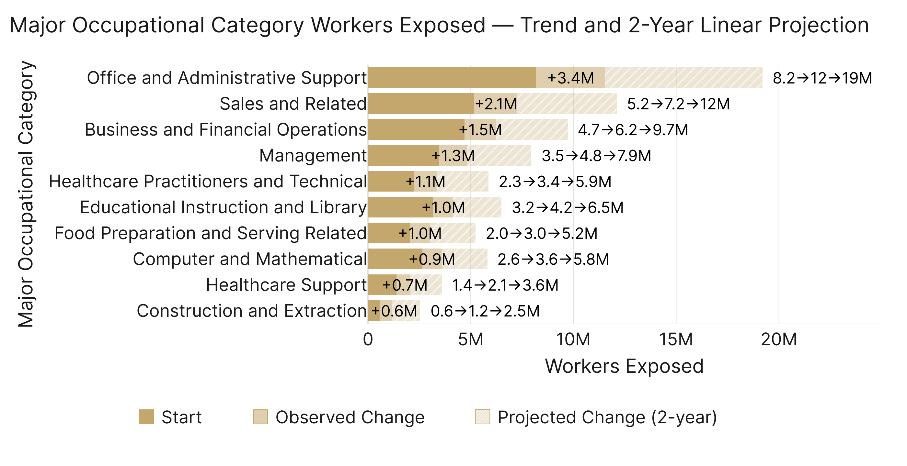

Same chart layout as the tasks trend, but metric = Workers Exposed. Chart shows **top 10 SOC majors by absolute observed Δ workers (start → current)**, ranked descending. The workers chart additionally renders each row's value as a percent of national employment (start / current / projected) on a second annotation line beneath the start → current → projected triplet.

Top 10 by |observed Δ workers|, sorted descending (chart row order — top-mover-at-top):

| # | Major | First Workers (2025-03-06) | Current Workers (2026-02-12) | Observed Δ Workers | 2yr Projected | Projected Δ | R² |
|---|---|---|---|---|---|---|---|
| 1 | Office and Administrative Support | 8,178,719.79 (8.18M) | 11,535,704.39 (11.54M) | +3,356,984.59 (+3.36M) | 19,209,073.85 (19.21M) | +7,673,369.47 (+7.67M) | 0.89 |
| 2 | Sales and Related | 5,175,970.84 (5.18M) | 7,246,699.19 (7.25M) | +2,070,728.35 (+2.07M) | 12,100,688.64 (12.10M) | +4,853,989.46 (+4.85M) | 0.88 |
| 3 | Business and Financial Operations | 4,691,973.58 (4.69M) | 6,232,699.87 (6.23M) | +1,540,726.30 (+1.54M) | 9,721,443.13 (9.72M) | +3,488,743.26 (+3.49M) | 0.91 |
| 4 | Management | 3,459,670.08 (3.46M) | 4,808,465.24 (4.81M) | +1,348,795.16 (+1.35M) | 7,931,234.00 (7.93M) | +3,122,768.75 (+3.12M) | 0.94 |
| 5 | Healthcare Practitioners and Technical | 2,250,594.51 (2.25M) | 3,351,573.32 (3.35M) | +1,100,978.81 (+1.10M) | 5,859,468.52 (5.86M) | +2,507,895.20 (+2.51M) | 0.94 |
| 6 | Educational Instruction and Library | 3,154,423.98 (3.15M) | 4,152,317.70 (4.15M) | +997,893.72 (+997.89K) | 6,499,888.21 (6.50M) | +2,347,570.51 (+2.35M) | 0.94 |
| 7 | Food Preparation and Serving Related | 2,045,703.72 (2.05M) | 3,016,646.64 (3.02M) | +970,942.92 (+970.94K) | 5,239,748.46 (5.24M) | +2,223,101.82 (+2.22M) | 0.89 |
| 8 | Computer and Mathematical | 2,643,699.31 (2.64M) | 3,592,180.56 (3.59M) | +948,481.25 (+948.48K) | 5,816,201.62 (5.82M) | +2,224,021.06 (+2.22M) | 0.88 |
| 9 | Healthcare Support | 1,386,530.13 (1.39M) | 2,064,195.32 (2.06M) | +677,665.18 (+677.67K) | 3,600,711.63 (3.60M) | +1,536,516.31 (+1.54M) | 0.98 |
| 10 | Construction and Extraction | 563,581.27 (563.58K) | 1,174,368.75 (1.17M) | +610,787.48 (+610.79K) | 2,541,876.79 (2.54M) | +1,367,508.04 (+1.37M) | 0.99 |

Top-10 observed Δ workers range: +610.79K (Construction) to +3.36M (Office and Admin). Top-10 projected 2yr Δ range: +1.37M (Construction) to +7.67M (Office and Admin).

For reference, the 12 majors NOT on the chart (full 22 in `major_trend_projections.csv`, sorted by |Δ workers| desc below the 610.79K cutoff): Transportation +592.78K → 3.34M (R²=0.98), Protective Service +408.45K → 2.06M (0.93), Personal Care +347.78K → 1.61M (0.98), Installation/Maintenance +291.74K → 1.68M (0.94), Arts/Design +288.91K → 1.86M (0.99), Community/Social Service +219.60K → 1.39M (0.98), Architecture/Engineering +181.27K → 1.57M (0.97), Production +167.41K → 1.37M (0.93), Legal +145.11K → 898.32K (0.97), Life/Physical/Social Science +144.35K → 971.32K (0.95), Building/Grounds +36.64K → 267.32K (0.91), Farming +7.24K → 67.13K (0.90).

(There is no equivalent wages projection chart in the appendix — only tasks and workers trends were rendered as committed figures.)

---

### Appendix — Where We and Eloundou Disagree by Major Occupational Category

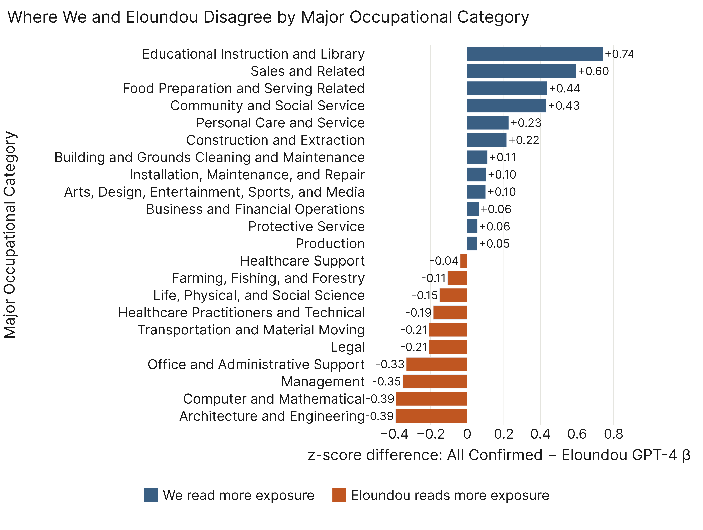

Single-panel horizontal diverging bar chart, 22 majors sorted by `mean_z_diff` (Eloundou-disagreement) ascending. Each bar is the per-major mean of (our `all_confirmed` z-score) − (Eloundou GPT-4 β z-score), averaged across the occupations in that major. Positive (blue) = we read more exposure than Eloundou; negative (orange) = Eloundou reads more.

Per major (sorted by mean_z_diff ascending):

| Major | mean_z_diff |
|---|---|
| Architecture and Engineering | −0.392 |
| Computer and Mathematical | −0.389 |
| Management | −0.353 |
| Office and Administrative Support | −0.333 |
| Legal | −0.208 |
| Transportation and Material Moving | −0.208 |
| Healthcare Practitioners and Technical | −0.185 |
| Life, Physical, and Social Science | −0.151 |
| Farming, Fishing, and Forestry | −0.108 |
| Healthcare Support | −0.037 |
| Production | +0.055 |
| Protective Service | +0.055 |
| Business and Financial Operations | +0.063 |
| Arts, Design, Entertainment, Sports, and Media | +0.100 |
| Installation, Maintenance, and Repair | +0.102 |
| Building and Grounds Cleaning and Maintenance | +0.111 |
| Construction and Extraction | +0.216 |
| Personal Care and Service | +0.226 |
| Community and Social Service | +0.432 |
| Food Preparation and Serving Related | +0.436 |
| Sales and Related | +0.595 |
| Educational Instruction and Library | +0.741 |

Range: −0.392 (Architecture and Engineering) to +0.741 (Educational Instruction and Library). 10 majors negative, 12 majors positive. Zero crossing falls between Healthcare Support (−0.037) and Production (+0.055). Legend at the bottom of the chart reads: blue swatch "We read more exposure", orange swatch "Eloundou reads more exposure".

---

### Appendix — Full Element-Level SKA (Knowledge)

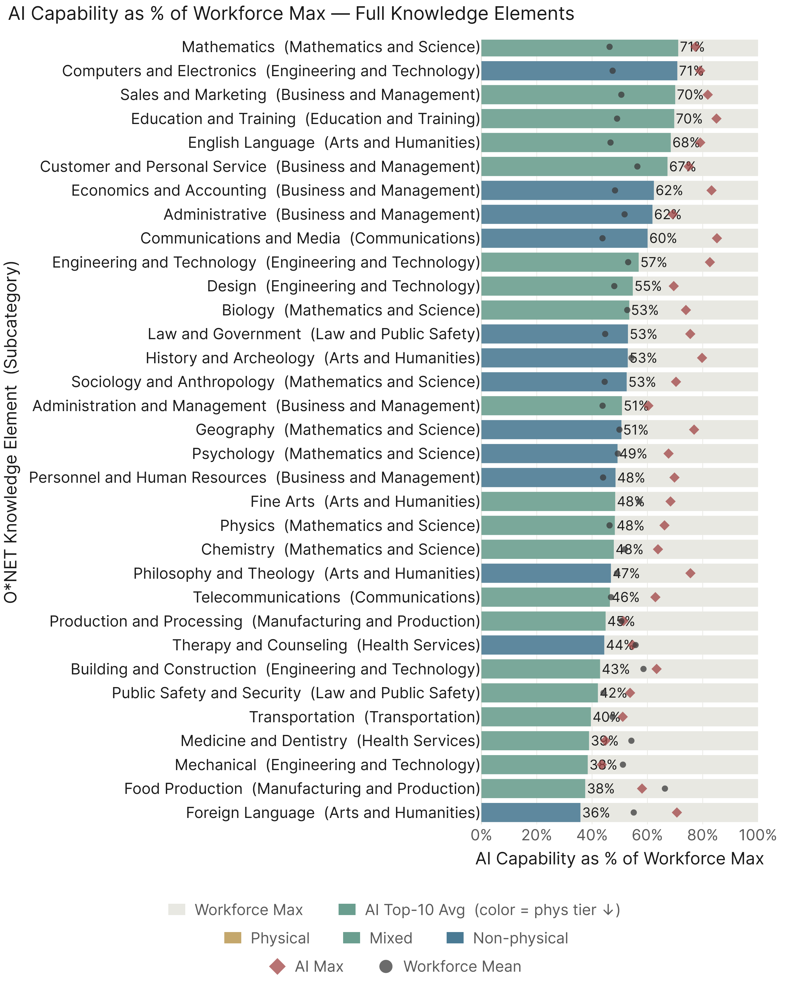

33 horizontal bars, one per O*NET Knowledge element, sorted by `ai_top10_pct` (`ai_top10 / eco_max × 100`) descending. Y-axis labels include the element name and the parenthetical O*NET subcategory. Each row carries:
- Bar = `ai_top10_pct` (color = phys-mix tier)
- Diamond marker = `ai_max_pct` (`ai_max / eco_max × 100`)
- Circle marker = `eco_mean_pct` (`eco_mean / eco_max × 100`)

Computed from raw `ska_full.csv`. Sorted by `ai_top10_pct` descending:

| # | Element | n_occs | ai_top10_pct | ai_max_pct | eco_mean_pct | phys_score | phys_tier |
|---|---|---|---|---|---|---|---|
| 1 | Mathematics | 496 | 71.13 | 77.36 | 46.32 | 38.36 | Mixed |
| 2 | Computers and Electronics | 487 | 70.81 | 79.09 | 47.43 | 29.33 | Non-physical |
| 3 | Sales and Marketing | 117 | 70.05 | 81.82 | 50.58 | 33.83 | Mixed |
| 4 | Education and Training | 433 | 69.69 | 84.97 | 49.04 | 36.20 | Mixed |
| 5 | English Language | 774 | 68.44 | 79.11 | 46.67 | 38.68 | Mixed |
| 6 | Customer and Personal Service | 629 | 67.26 | 74.93 | 56.37 | 40.36 | Mixed |
| 7 | Economics and Accounting | 107 | 62.34 | 83.19 | 48.29 | 18.08 | Non-physical |
| 8 | Administrative | 298 | 61.82 | 69.17 | 51.75 | 27.54 | Non-physical |
| 9 | Communications and Media | 131 | 60.07 | 85.14 | 43.77 | 19.17 | Non-physical |
| 10 | Engineering and Technology | 216 | 56.84 | 82.59 | 53.04 | 40.41 | Mixed |
| 11 | Design | 183 | 54.71 | 69.52 | 48.03 | 43.50 | Mixed |
| 12 | Biology | 134 | 53.44 | 73.92 | 52.72 | 39.06 | Mixed |
| 13 | Law and Government | 195 | 52.96 | 75.50 | 44.74 | 24.07 | Non-physical |
| 14 | History and Archeology | 24 | 52.90 | 79.76 | 54.25 | 16.48 | Non-physical |
| 15 | Sociology and Anthropology | 93 | 52.51 | 70.34 | 44.56 | 17.36 | Non-physical |
| 16 | Administration and Management | 439 | 50.80 | 60.36 | 43.80 | 36.21 | Mixed |
| 17 | Geography | 71 | 50.61 | 76.88 | 49.89 | 23.14 | Non-physical |
| 18 | Psychology | 190 | 49.20 | 67.65 | 49.30 | 29.22 | Non-physical |
| 19 | Personnel and Human Resources | 136 | 48.47 | 69.79 | 43.98 | 20.61 | Non-physical |
| 20 | Fine Arts | 33 | 48.36 | 68.36 | 57.03 | 33.82 | Mixed |
| 21 | Physics | 113 | 48.23 | 66.18 | 46.32 | 37.20 | Mixed |
| 22 | Chemistry | 119 | 47.85 | 63.82 | 51.88 | 41.59 | Mixed |
| 23 | Philosophy and Theology | 28 | 46.80 | 75.56 | 49.02 | 11.92 | Non-physical |
| 24 | Telecommunications | 62 | 46.43 | 62.89 | 46.83 | 35.38 | Mixed |
| 25 | Production and Processing | 247 | 44.89 | 51.33 | 50.60 | 59.85 | Mixed |
| 26 | Therapy and Counseling | 88 | 44.41 | 54.67 | 55.74 | 29.90 | Non-physical |
| 27 | Building and Construction | 113 | 42.88 | 63.33 | 58.58 | 56.60 | Mixed |
| 28 | Public Safety and Security | 304 | 42.10 | 53.74 | 44.14 | 46.45 | Mixed |
| 29 | Transportation | 104 | 39.57 | 51.08 | 47.37 | 51.89 | Mixed |
| 30 | Medicine and Dentistry | 113 | 38.89 | 44.82 | 54.21 | 42.92 | Mixed |
| 31 | Mechanical | 276 | 38.43 | 43.50 | 51.15 | 64.98 | Mixed |
| 32 | Food Production | 35 | 37.51 | 58.06 | 66.33 | 56.18 | Mixed |
| 33 | Foreign Language | 7 | 35.79 | 70.66 | 55.07 | 20.67 | Non-physical |

(The `ai_top10`, `ai_max`, and `eco_mean` values in `ska_full.csv` are raw; the chart-displayed bars divide by `eco_max` and multiply by 100 — values above are derived using that formula. Bar text on the rendered chart rounds to integer %.)

Range of bars: 35.79% (Foreign Language) to 71.13% (Mathematics).

---

### Appendix — Full Element-Level SKA (Abilities)

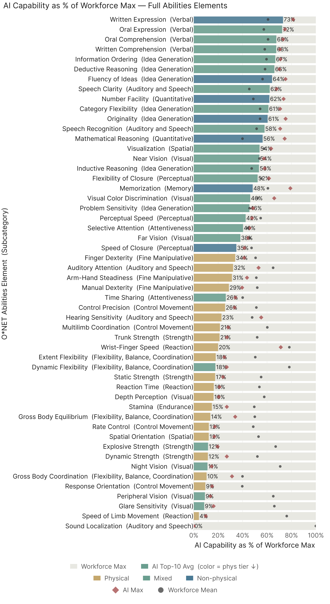

52 horizontal bars, one per O*NET Abilities element, sorted by `ai_top10_pct` descending. Same layout as the Knowledge chart: bar = `ai_top10 / eco_max × 100`, diamond = `ai_max / eco_max × 100`, circle = `eco_mean / eco_max × 100`. Bars colored by element phys-mix tier.

From raw `ska_full.csv`, abilities rows. Sorted by ai_top10_pct desc:

| # | Element | n_occs | ai_top10_pct | ai_max_pct | eco_mean_pct | phys_score | phys_tier |
|---|---|---|---|---|---|---|---|
| 1 | Written Expression | 633 | 73.10 | 81.42 | 60.82 | 29.72 | Non-physical |
| 2 | Oral Expression | 852 | 72.36 | 74.68 | 57.39 | 42.24 | Mixed |
| 3 | Oral Comprehension | 869 | 67.62 | 73.19 | 60.85 | 43.23 | Mixed |
| 4 | Written Comprehension | 745 | 67.54 | 70.66 | 58.16 | 36.43 | Mixed |
| 5 | Information Ordering | 831 | 66.76 | 70.98 | 59.58 | 42.38 | Mixed |
| 6 | Deductive Reasoning | 802 | 66.04 | 70.09 | 58.40 | 40.66 | Mixed |
| 7 | Fluency of Ideas | 463 | 64.15 | 75.15 | 56.36 | 22.65 | Non-physical |
| 8 | Speech Clarity | 786 | 62.21 | 67.84 | 45.49 | 38.65 | Mixed |
| 9 | Number Facility | 225 | 61.92 | 73.58 | 48.79 | 21.20 | Non-physical |
| 10 | Category Flexibility | 704 | 61.16 | 70.74 | 54.36 | 37.72 | Mixed |
| 11 | Originality | 395 | 60.51 | 75.23 | 54.33 | 21.83 | Non-physical |
| 12 | Speech Recognition | 804 | 57.96 | 70.77 | 51.49 | 40.01 | Mixed |
| 13 | Mathematical Reasoning | 261 | 56.40 | 74.45 | 39.92 | 20.81 | Non-physical |
| 14 | Visualization | 378 | 53.88 | 63.33 | 57.53 | 56.11 | Mixed |
| 15 | Near Vision | 886 | 53.71 | 57.49 | 53.77 | 44.36 | Mixed |
| 16 | Inductive Reasoning | 746 | 53.38 | 58.03 | 47.44 | 37.72 | Mixed |
| 17 | Flexibility of Closure | 481 | 52.29 | 61.61 | 55.35 | 40.37 | Mixed |
| 18 | Memorization | 61 | 48.26 | 79.12 | 60.72 | 26.34 | Non-physical |
| 19 | Visual Color Discrimination | 200 | 46.25 | 65.91 | 52.36 | 60.61 | Mixed |
| 20 | Problem Sensitivity | 852 | 45.58 | 48.63 | 45.68 | 43.02 | Mixed |
| 21 | Perceptual Speed | 396 | 42.48 | 47.71 | 54.80 | 50.70 | Mixed |
| 22 | Selective Attention | 669 | 40.36 | 45.74 | 44.23 | 46.02 | Mixed |
| 23 | Far Vision | 397 | 38.16 | 44.64 | 45.80 | 48.00 | Mixed |
| 24 | Speed of Closure | 114 | 34.88 | 41.43 | 47.33 | 32.24 | Non-physical |
| 25 | Finger Dexterity | 357 | 33.93 | 41.32 | 50.63 | 73.27 | Physical |
| 26 | Auditory Attention | 125 | 32.17 | 53.08 | 65.00 | 69.49 | Physical |
| 27 | Arm-Hand Steadiness | 399 | 31.24 | 43.62 | 51.24 | 73.08 | Physical |
| 28 | Manual Dexterity | 368 | 28.75 | 39.59 | 52.02 | 74.75 | Physical |
| 29 | Time Sharing | 133 | 26.21 | 34.13 | 40.04 | 47.46 | Mixed |
| 30 | Control Precision | 319 | 25.64 | 33.43 | 51.28 | 76.08 | Physical |
| 31 | Hearing Sensitivity | 80 | 22.72 | 55.23 | 47.82 | 71.27 | Physical |
| 32 | Multilimb Coordination | 250 | 21.42 | 28.21 | 60.24 | 78.46 | Physical |
| 33 | Trunk Strength | 235 | 21.11 | 27.18 | 51.96 | 77.83 | Physical |
| 34 | Wrist-Finger Speed | 10 | 19.90 | 71.28 | 78.28 | 67.35 | Physical |
| 35 | Extent Flexibility | 153 | 17.95 | 25.06 | 50.38 | 82.00 | Physical |
| 36 | Dynamic Flexibility | 3 | 17.69 | 27.00 | 78.26 | 45.26 | Mixed |
| 37 | Static Strength | 168 | 17.47 | 23.93 | 55.18 | 80.36 | Physical |
| 38 | Reaction Time | 144 | 16.37 | 21.07 | 53.76 | 78.40 | Physical |
| 39 | Depth Perception | 95 | 16.19 | 20.48 | 57.72 | 78.14 | Physical |
| 40 | Stamina | 71 | 14.81 | 27.09 | 49.57 | 81.11 | Physical |
| 41 | Gross Body Equilibrium | 53 | 13.55 | 33.95 | 49.98 | 80.20 | Physical |
| 42 | Rate Control | 95 | 12.32 | 17.23 | 48.72 | 79.49 | Physical |
| 43 | Spatial Orientation | 27 | 12.25 | 16.84 | 53.04 | 70.00 | Physical |
| 44 | Explosive Strength | 11 | 11.67 | 19.56 | 67.07 | 56.62 | Mixed |
| 45 | Dynamic Strength | 40 | 11.54 | 27.09 | 52.13 | 82.38 | Physical |
| 46 | Night Vision | 4 | 11.21 | 14.60 | 70.81 | 59.84 | Mixed |
| 47 | Gross Body Coordination | 31 | 10.47 | 31.31 | 39.90 | 76.98 | Physical |
| 48 | Response Orientation | 57 | 9.48 | 14.97 | 39.73 | 74.45 | Physical |
| 49 | Peripheral Vision | 9 | 9.14 | 13.54 | 65.13 | 64.88 | Mixed |
| 50 | Glare Sensitivity | 11 | 8.55 | 16.23 | 66.01 | 64.89 | Mixed |
| 51 | Speed of Limb Movement | 7 | 4.20 | 9.85 | 76.16 | 82.27 | Physical |
| 52 | Sound Localization | 1 | 0.00 | 0.00 | 100.00 | 75.00 | Physical |

(Values derived from raw `ska_full.csv` using the same `ai_top10 / eco_max × 100` formula.)

Range of bars: 0.00% (Sound Localization, n_occs = 1, ai_top10 = 0) to 73.10% (Written Expression).

---

### Appendix — Generalized Work Activities: Workers and Wages

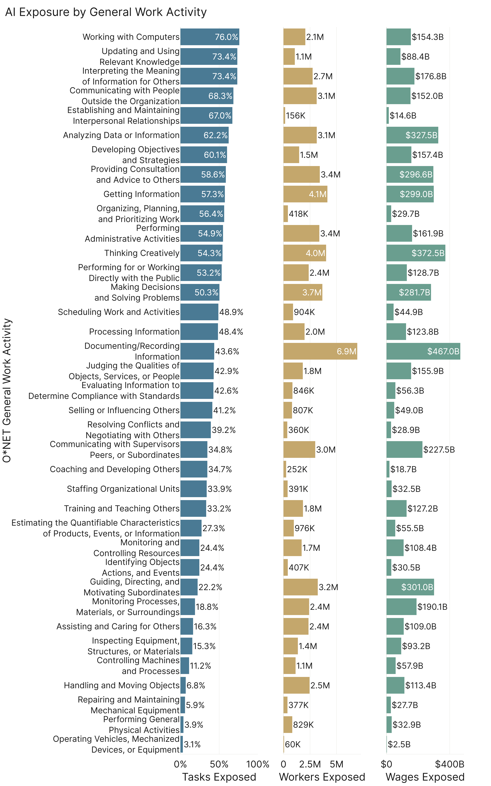

Appendix counterpart to part_2's `gwa_pct`. Three All Confirmed panels on a shared y-axis listing all 37 GWAs (sorted by All Confirmed pct_tasks_affected desc — same y-ordering as `gwa_pct.png`): Panel 1 = % Tasks Exposed (anchor), Panel 2 = Workers Exposed, Panel 3 = Wages Exposed.

Per GWA (sorted by AC pct_tasks_affected desc):

| # | GWA | % Tasks | Workers | Wages |
|---|---|---|---|---|
| 1 | Working with Computers | 75.97% | 2,058,445.84 (2.06M) | $154.34B |
| 2 | Updating and Using Relevant Knowledge | 73.39% | 1,067,946.12 (1.07M) | $88.42B |
| 3 | Interpreting the Meaning of Information for Others | 73.36% | 2,745,384.10 (2.75M) | $176.78B |
| 4 | Communicating with People Outside the Organization | 68.33% | 3,128,061.24 (3.13M) | $152.01B |
| 5 | Establishing and Maintaining Interpersonal Relationships | 67.00% | 156,440.19 (156.44K) | $14.56B |
| 6 | Analyzing Data or Information | 62.22% | 3,134,861.19 (3.13M) | $327.54B |
| 7 | Developing Objectives and Strategies | 60.13% | 1,477,463.87 (1.48M) | $157.44B |
| 8 | Providing Consultation and Advice to Others | 58.56% | 3,419,646.21 (3.42M) | $296.55B |
| 9 | Getting Information | 57.31% | 4,136,418.05 (4.14M) | $298.99B |
| 10 | Organizing, Planning, and Prioritizing Work | 56.43% | 417,725.11 (417.73K) | $29.69B |
| 11 | Performing Administrative Activities | 54.94% | 3,375,371.89 (3.38M) | $161.90B |
| 12 | Thinking Creatively | 54.28% | 4,014,288.85 (4.01M) | $372.50B |
| 13 | Performing for or Working Directly with the Public | 53.19% | 2,375,661.80 (2.38M) | $128.70B |
| 14 | Making Decisions and Solving Problems | 50.32% | 3,661,898.34 (3.66M) | $281.66B |
| 15 | Scheduling Work and Activities | 48.92% | 903,992.55 (903.99K) | $44.92B |
| 16 | Processing Information | 48.45% | 1,985,735.15 (1.99M) | $123.80B |
| 17 | Documenting/Recording Information | 43.59% | 6,948,548.29 (6.95M) | $466.96B |
| 18 | Judging the Qualities of Objects, Services, or People | 42.89% | 1,819,649.12 (1.82M) | $155.87B |
| 19 | Evaluating Information to Determine Compliance with Standards | 42.57% | 846,147.58 (846.15K) | $56.30B |
| 20 | Selling or Influencing Others | 41.15% | 806,714.01 (806.71K) | $49.04B |
| 21 | Resolving Conflicts and Negotiating with Others | 39.21% | 359,609.45 (359.61K) | $28.85B |
| 22 | Communicating with Supervisors, Peers, or Subordinates | 34.75% | 2,990,590.57 (2.99M) | $227.48B |
| 23 | Coaching and Developing Others | 34.70% | 252,388.35 (252.39K) | $18.73B |
| 24 | Staffing Organizational Units | 33.87% | 391,136.22 (391.14K) | $32.49B |
| 25 | Training and Teaching Others | 33.21% | 1,836,703.55 (1.84M) | $127.19B |
| 26 | Estimating the Quantifiable Characteristics of Products, Events, or Information | 27.26% | 976,279.93 (976.28K) | $55.49B |
| 27 | Monitoring and Controlling Resources | 24.39% | 1,710,509.45 (1.71M) | $108.44B |
| 28 | Identifying Objects, Actions, and Events | 24.39% | 407,401.72 (407.40K) | $30.48B |
| 29 | Guiding, Directing, and Motivating Subordinates | 22.16% | 3,228,988.90 (3.23M) | $300.97B |
| 30 | Monitoring Processes, Materials, or Surroundings | 18.78% | 2,415,479.27 (2.42M) | $190.09B |
| 31 | Assisting and Caring for Others | 16.31% | 2,357,136.28 (2.36M) | $109.03B |
| 32 | Inspecting Equipment, Structures, or Materials | 15.31% | 1,356,384.52 (1.36M) | $93.16B |
| 33 | Controlling Machines and Processes | 11.17% | 1,139,561.55 (1.14M) | $57.86B |
| 34 | Handling and Moving Objects | 6.82% | 2,456,389.90 (2.46M) | $113.35B |
| 35 | Repairing and Maintaining Mechanical Equipment | 5.91% | 376,743.89 (376.74K) | $27.73B |
| 36 | Performing General Physical Activities | 3.87% | 829,109.83 (829.11K) | $32.88B |
| 37 | Operating Vehicles, Mechanized Devices, or Equipment | 3.11% | 60,040.84 (60.04K) | $2.48B |

Workers Exposed range: 60.04K (Operating Vehicles) to 6.95M (Documenting/Recording Information).

Wages Exposed range: $2.48B (Operating Vehicles) to $466.96B (Documenting/Recording Information). Top 5 on Wages: Documenting/Recording $466.96B, Thinking Creatively $372.50B, Analyzing Data or Information $327.54B, Guiding/Directing $300.97B, Getting Information $298.99B.

---

### Appendix — State Clusters, Each Panel Ranked Independently

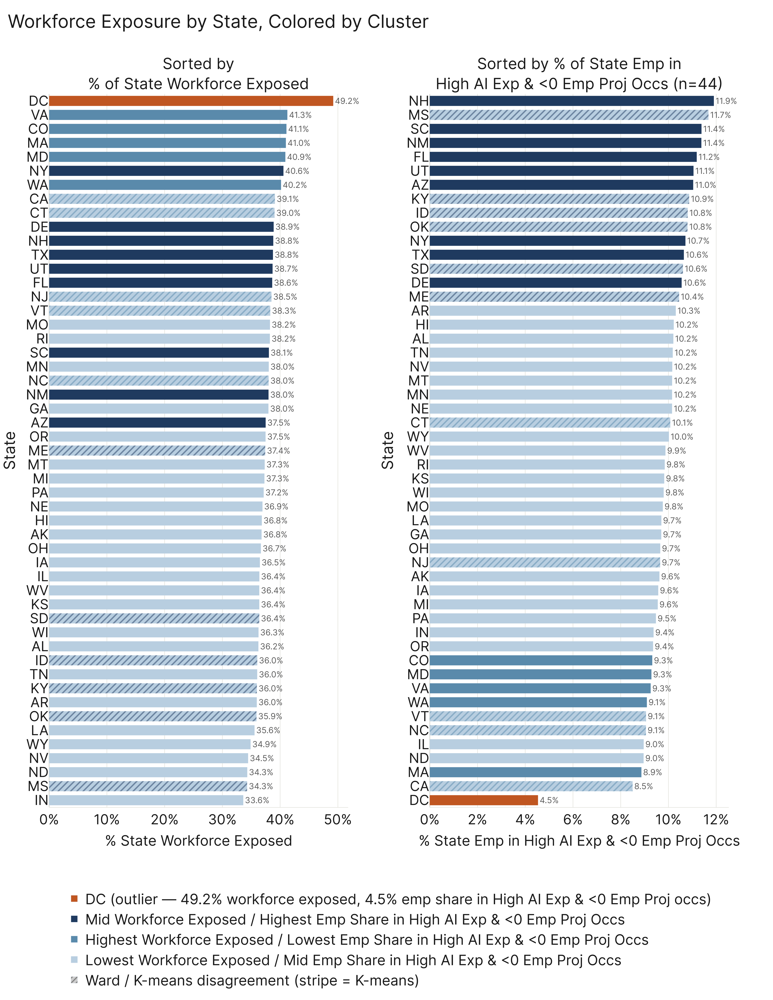

Two-panel horizontal bar chart, both panels showing all 51 jurisdictions colored by Ward cluster (same colors as the main Part 3 map). Each panel sorts independently by its own metric (state descending):
- **Left panel — "Sorted by % of State Workforce Exposed"**: bar = `pct_emp_wtd` per state.
- **Right panel — "Sorted by % of State Emp in High AI Exp & <0 Emp Proj Occs (n = 44)"**: bar = `focused_share_pct` per state.

Both panels show bar-end value labels (rounded to 1 decimal). Disagreement states (Ward vs K-means) get a diagonal-stripe overlay in the K-means cluster's color.

Per state, both metrics (all values from `state_clusters_each_ranked.csv`):

| State | Cluster | pct_emp_wtd | focused_share_pct |
|---|---|---|---|
| DC | −1 (outlier) | 45.901% | 4.471% |
| CO | 2 | 38.866% | 9.565% |
| MD | 2 | 38.040% | 9.543% |
| VA | 2 | 37.426% | 9.360% |
| MA | 2 | 37.356% | 9.168% |
| WA | 2 | 37.059% | 9.241% |
| NY | 1 | 37.043% | 11.140% |
| TX | 1 | 36.586% | 10.743% |
| NC | 3 | 36.126% | 9.528% |
| NH | 1 | 36.061% | 11.386% |
| UT | 1 | 35.846% | 10.852% |
| DE | 3 | 35.827% | 10.181% |
| VT | 3 | 35.789% | 9.393% |
| FL | 1 | 35.701% | 11.106% |
| CT | 1 | 35.690% | 10.533% |
| CA | 2 | 35.629% | 8.459% |
| GA | 3 | 35.518% | 9.955% |
| NJ | 3 | 35.127% | 10.008% |
| NM | 1 | 34.992% | 12.083% |
| RI | 3 | 34.988% | 9.573% |
| MN | 3 | 34.979% | 10.221% |
| MO | 1 | 34.769% | 10.517% |
| OR | 3 | 34.647% | 9.303% |
| TN | 1 | 34.635% | 10.824% |
| AZ | 1 | 34.633% | 10.648% |
| AK | 1 | 34.515% | 10.474% |
| MI | 3 | 34.442% | 9.541% |
| PA | 3 | 34.434% | 9.877% |
| IA | 3 | 34.377% | 9.755% |
| ME | 1 | 34.175% | 10.605% |
| WV | 3 | 34.103% | 9.804% |
| MT | 3 | 33.969% | 10.303% |
| SC | 1 | 33.827% | 10.934% |
| NE | 3 | 33.703% | 9.691% |
| OH | 3 | 33.683% | 9.413% |
| HI | 3 | 33.652% | 10.363% |
| KS | 3 | 33.420% | 9.934% |
| IL | 3 | 33.310% | 9.399% |
| AL | 3 | 33.153% | 10.183% |
| WI | 3 | 33.144% | 9.709% |
| SD | 3 | 33.138% | 10.310% |
| AR | 3 | 32.980% | 10.344% |
| LA | 3 | 32.975% | 10.215% |
| ID | 1 | 32.817% | 11.618% |
| OK | 1 | 32.716% | 11.050% |
| MS | 1 | 32.588% | 11.562% |
| WY | 3 | 31.966% | 10.459% |
| ND | 3 | 31.593% | 9.310% |
| KY | 3 | 31.337% | 10.225% |
| IN | 3 | 31.170% | 9.433% |
| NV | 3 | 30.334% | 9.114% |

Left panel range: 30.334% (NV) → 45.901% (DC). Top 5 by `pct_emp_wtd`: DC (45.901%), CO (38.866%), MD (38.040%), VA (37.426%), MA (37.356%). Bottom 5: NV (30.334%), IN (31.170%), KY (31.337%), ND (31.593%), WY (31.966%).

Right panel range: 4.471% (DC) → 12.083% (NM). Top 5 by `focused_share_pct`: NM (12.083%), ID (11.618%), MS (11.562%), NH (11.386%), NY (11.140%). Bottom 5: DC (4.471%), CA (8.459%), NV (9.114%), MA (9.168%), WA (9.241%).

Cluster legend at the bottom of the chart (per `state_clusters_map.csv` `cluster_name` mapping):
- Cluster 1: Mid Workforce Exposed / Highest Emp Share in High AI Exp & <0 Emp Proj Occs (16 states).
- Cluster 2: Highest Workforce Exposed / Lowest Emp Share in High AI Exp & <0 Emp Proj Occs (6 states).
- Cluster 3: Lowest Workforce Exposed / Mid Emp Share in High AI Exp & <0 Emp Proj Occs (28 states).
- Cluster −1: DC outlier.
- Plus a 6th legend entry: "Ward / K-means disagreement (stripe = K-means)".


---

### Appendix — Underadoption Gap by Major Occupational Category

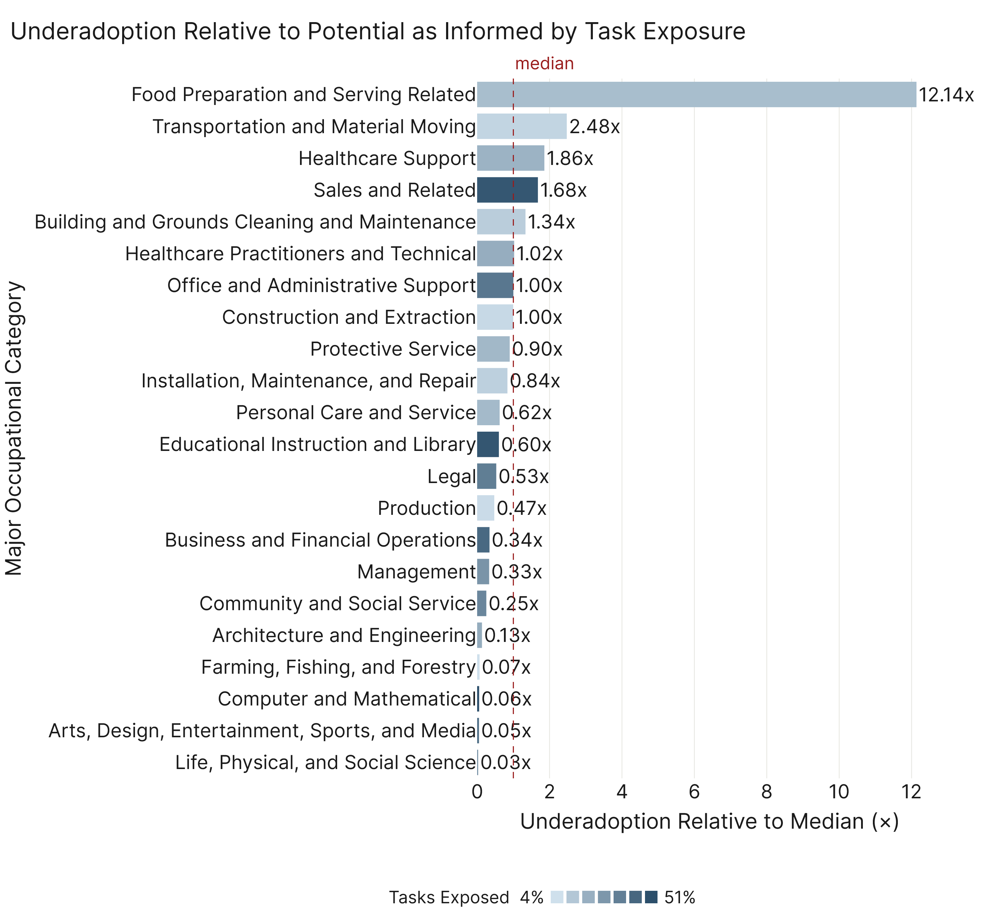

22 majors ranked by `gap_ratio` (descending). The gap ratio is:

```
raw_gap = pct_tasks_affected / ratio_full_pct
gap_ratio = raw_gap / raw_gap[Office and Administrative Support]
```

Office and Admin Support is the anchor (gap_ratio = 1.0000 by construction; raw_gap = 36.9395). A dashed vertical line at x = 1.0 marks the anchor (labeled "median"). Bars colored by `pct_tasks_affected` on a light → dark blue ramp.

Per major (sorted by gap_ratio desc):

| # | Major | pct_tasks_affected | ratio_full_pct | raw_gap | gap_ratio (×) |
|---|---|---|---|---|---|
| 1 | Food Preparation and Serving Related | 15.0711 | 0.0336 | 448.2767 | 12.1354 |
| 2 | Transportation and Material Moving | 7.5392 | 0.0824 | 91.4467 | 2.4756 |
| 3 | Healthcare Support | 18.5493 | 0.2704 | 68.5924 | 1.8569 |
| 4 | Sales and Related | 48.5881 | 0.7837 | 61.9990 | 1.6784 |
| 5 | Building and Grounds Cleaning and Maintenance | 9.9741 | 0.2022 | 49.3296 | 1.3354 |
| 6 | Healthcare Practitioners and Technical | 20.4777 | 0.5424 | 37.7562 | 1.0221 |
| 7 | Office and Administrative Support [anchor] | 38.1056 | 1.0316 | 36.9395 | 1.0000 |
| 8 | Construction and Extraction | 6.0669 | 0.1649 | 36.7818 | 0.9957 |
| 9 | Protective Service | 17.0041 | 0.5114 | 33.2501 | 0.9001 |
| 10 | Installation, Maintenance, and Repair | 9.1197 | 0.2951 | 30.9069 | 0.8367 |
| 11 | Personal Care and Service | 16.3099 | 0.7104 | 22.9590 | 0.6215 |
| 12 | Educational Instruction and Library | 48.8850 | 2.2043 | 22.1773 | 0.6004 |
| 13 | Legal | 35.9284 | 1.8418 | 19.5077 | 0.5281 |
| 14 | Production | 5.3786 | 0.3076 | 17.4860 | 0.4734 |
| 15 | Business and Financial Operations | 42.6732 | 3.3844 | 12.6089 | 0.3413 |
| 16 | Management | 28.6389 | 2.3378 | 12.2505 | 0.3316 |
| 17 | Community and Social Service | 33.1954 | 3.5435 | 9.3681 | 0.2536 |
| 18 | Architecture and Engineering | 20.9016 | 4.2347 | 4.9358 | 0.1336 |
| 19 | Farming, Fishing, and Forestry | 3.8543 | 1.5528 | 2.4821 | 0.0672 |
| 20 | Computer and Mathematical | 51.1236 | 25.1091 | 2.0361 | 0.0551 |
| 21 | Arts, Design, Entertainment, Sports, and Media | 40.1116 | 21.1279 | 1.8985 | 0.0514 |
| 22 | Life, Physical, and Social Science | 30.3567 | 29.7281 | 1.0211 | 0.0276 |

gap_ratio range: 0.0276× (Life, Physical, and Social Science) to 12.1354× (Food Preparation and Serving Related). Bar color range: pct_tasks_affected from 3.85% (Farming) to 51.12% (Computer/Math). The color legend at the bottom reads "Tasks Exposed 4% ■■■■■■■ 51%".

---

### Appendix — Within-Major Intensity Drivers: Life, Physical & Social Science

Each "Within-Major Intensity Drivers" pair (one occ chart + one task chart) decomposes that major's intensity_anchor_fulleco lift into the top-10 occupations and top-10 tasks driving it. Per-occ (or per-task) ratio = Σ debiased adj_pct / Σ (freq × emp), normalized by the within-major median ratio so the dashed reference line sits at x = 1× and lifts read as "× the major's median row." Bars colored by `pct_tasks_affected` for occ charts; uncolored for task charts.

#### Top Occupations — Life, Physical & Social Science

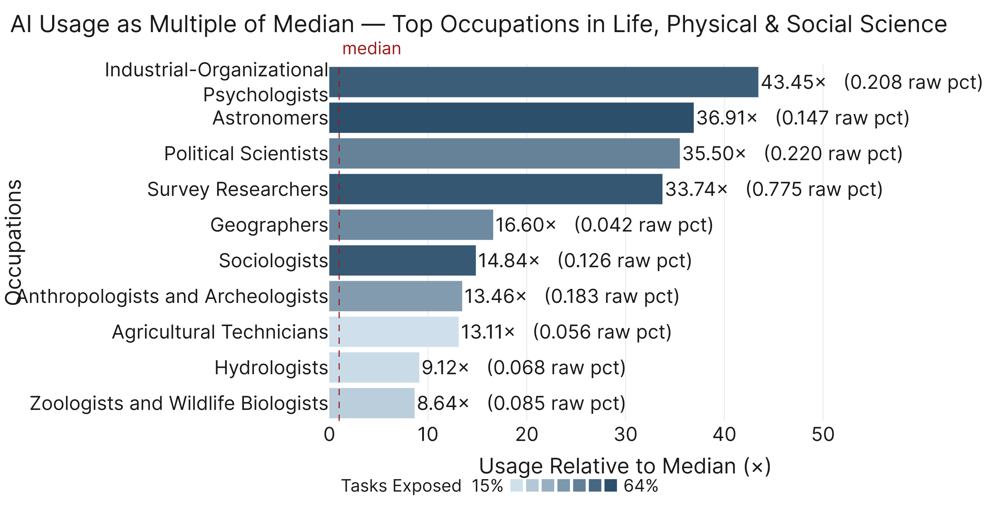

Top 10 occupations within "Life, Physical, and Social Science Occupations" by within-major lift (× the major's median row). From `intensity_drivers_occ_life_phys_soc_sci.csv`, sorted by lift descending:

| # | Occupation | num (Σ debiased adj_pct) | raw_pct | den (Σ freq × emp) | lift (×) | pct_tasks_affected |
|---|---|---|---|---|---|---|
| 1 | Industrial-Organizational Psychologists | 0.2476 | 0.2076 | 5,485.2313 | 43.4489 | 59.2922 |
| 2 | Astronomers | 0.2586 | 0.1470 | 6,744.8020 | 36.9077 | 63.8942 |
| 3 | Political Scientists | 0.4228 | 0.2200 | 11,465.8120 | 35.4973 | 46.3942 |
| 4 | Survey Researchers | 1.6194 | 0.7750 | 46,205.1982 | 33.7379 | 61.1669 |
| 5 | Geographers | 0.1019 | 0.0423 | 5,910.7849 | 16.5967 | 43.7516 |
| 6 | Sociologists | 0.2123 | 0.1263 | 13,771.0753 | 14.8429 | 60.3955 |
| 7 | Anthropologists and Archeologists | 0.2778 | 0.1832 | 19,871.0015 | 13.4569 | 37.8791 |
| 8 | Agricultural Technicians | 0.3357 | 0.0559 | 24,645.5690 | 13.1104 | 14.5182 |
| 9 | Hydrologists | 0.0813 | 0.0683 | 8,584.5577 | 9.1154 | 16.1088 |
| 10 | Zoologists and Wildlife Biologists | 0.2869 | 0.0854 | 31,967.9034 | 8.6407 | 20.5877 |

Lift range: 8.64× (Zoologists/Wildlife Biologists) to 43.45× (Industrial-Organizational Psychologists). pct_tasks_affected color range across the 10 occs: 14.52% (Agricultural Technicians) to 63.89% (Astronomers).

#### Top Tasks — Life, Physical & Social Science

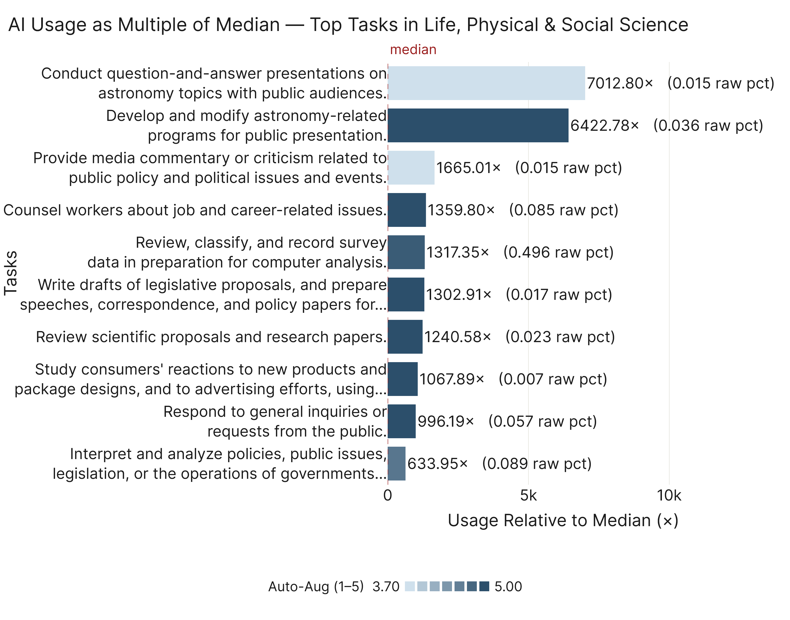

Top 10 tasks within "Life, Physical, and Social Science" by within-major lift. From `intensity_drivers_task_life_phys_soc_sci.csv`:

| # | Task | num | raw_pct | den | auto_aug | lift (×) |
|---|---|---|---|---|---|---|
| 1 | Develop and modify astronomy-related programs for public presentation. | 0.1596 | 0.0242 | 127.7357 | 5.0000 | 2440.2756 |
| 2 | Counsel workers about job and career-related issues. | 0.0971 | 0.0974 | 217.5624 | 5.0000 | 871.5429 |
| 3 | Review, classify, and record survey data in preparation for computer analysis. | 1.0396 | 0.5682 | 2,403.1690 | 4.8861 | 844.8590 |
| 4 | Write drafts of legislative proposals, and prepare speeches, correspondence, and policy papers for governmental use. | 0.0237 | 0.0191 | 55.4000 | 5.0000 | 836.6134 |
| 5 | Review scientific proposals and research papers. | 0.0443 | 0.0241 | 116.6448 | 5.0000 | 742.4755 |
| 6 | Study consumers' reactions to new products and package designs, and to advertising efforts, using surveys and tests. | 0.0292 | 0.0084 | 83.2803 | 5.0000 | 685.7071 |
| 7 | Respond to general inquiries or requests from the public. | 0.3184 | 0.0484 | 1,308.4441 | 5.0000 | 475.2794 |
| 8 | Interpret and analyze policies, public issues, legislation, or the operations of governments, businesses, and organizations. | 0.3366 | 0.0972 | 1,691.9778 | 4.6464 | 388.5936 |
| 9 | Organize public exhibits and displays to promote public awareness of diverse and distinctive cultural traditions. | 0.0217 | 0.0129 | 265.8101 | 5.0000 | 159.3102 |
| 10 | Advise management concerning personnel, managerial, and marketing policies and practices and their potential effects on organizational effectiveness and efficiency. | 0.0442 | 0.0443 | 581.8374 | 5.0000 | 148.3304 |

Task-lift range: 148.33× (Advise management…) to 2,440.28× (Develop astronomy-related programs). Auto-aug column ranges 4.65 to 5.00 across all 10 tasks.

---

### Appendix — Within-Major Intensity Drivers: Arts, Design & Entertainment

#### Top Occupations — Arts, Design & Entertainment

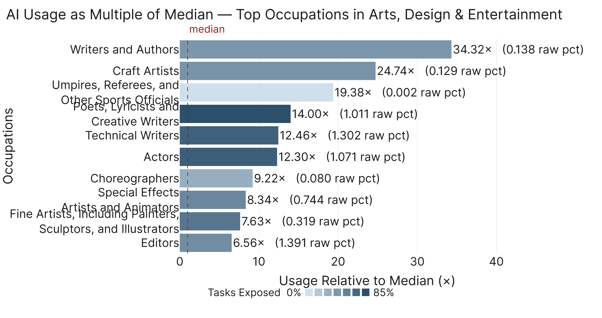

Top 10 occupations within "Arts, Design, Entertainment, Sports, and Media" by within-major lift.

| # | Occupation | num | raw_pct | den | lift (×) | pct_tasks_affected |
|---|---|---|---|---|---|---|
| 1 | Writers and Authors | 0.1736 | 0.1376 | 25,476.6076 | 34.3234 | 43.7827 |
| 2 | Craft Artists | 0.1118 | 0.1292 | 22,766.5776 | 24.7362 | 45.3549 |
| 3 | Umpires, Referees, and Other Sports Officials | 0.0102 | 0.0019 | 2,657.0850 | 19.3815 | 0.3384 |
| 4 | Poets, Lyricists and Creative Writers | 1.2634 | 1.0105 | 454,449.6385 | 14.0046 | 85.1171 |
| 5 | Technical Writers | 2.0858 | 1.3018 | 843,478.7025 | 12.4577 | 74.7004 |
| 6 | Actors | 2.2404 | 1.0708 | 917,528.9750 | 12.3011 | 76.3540 |
| 7 | Choreographers | 0.0419 | 0.0805 | 22,893.3232 | 9.2155 | 29.3516 |
| 8 | Special Effects Artists and Animators | 0.3783 | 0.7440 | 228,528.4309 | 8.3398 | 52.0875 |
| 9 | Fine Artists, Including Painters, Sculptors, and Illustrators | 0.2989 | 0.3194 | 197,334.7621 | 7.6298 | 62.0367 |
| 10 | Editors | 2.7119 | 1.3909 | 2,082,092.8171 | 6.5616 | 48.7927 |

Lift range: 6.56× (Editors) to 34.32× (Writers and Authors). pct_tasks_affected color range across the 10: 0.34% (Umpires, Referees, and Other Sports Officials) to 85.12% (Poets, Lyricists and Creative Writers).

#### Top Tasks — Arts, Design & Entertainment

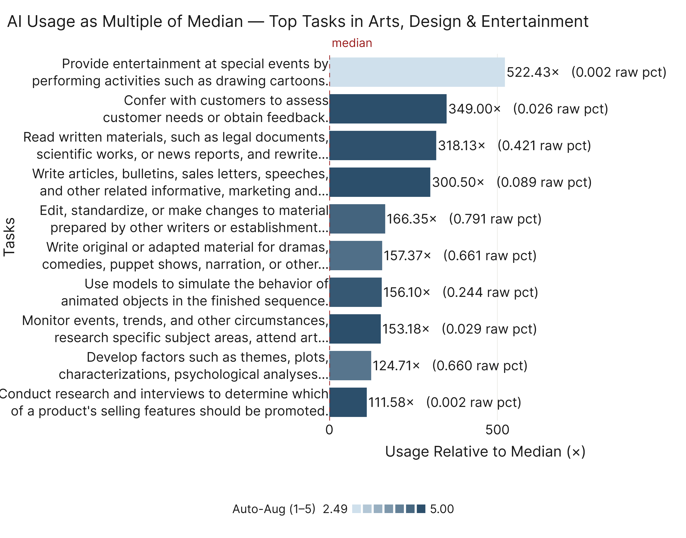

| # | Task | num | raw_pct | den | auto_aug | lift (×) |
|---|---|---|---|---|---|---|
| 1 | Provide entertainment at special events by performing activities such as drawing cartoons. | 0.0083 | 0.0024 | 138.3901 | 2.4943 | 522.4253 |
| 2 | Confer with customers to assess customer needs or obtain feedback. | 0.0333 | 0.0263 | 836.2516 | 5.0000 | 349.0024 |
| 3 | Read written materials, such as legal documents, scientific works, or news reports, and rewrite material into specified languages. | 1.2234 | 0.4208 | 33,699.6194 | 4.9597 | 318.1308 |
| 4 | Write articles, bulletins, sales letters, speeches, and other related informative, marketing and promotional material. | 0.1112 | 0.0895 | 3,244.0190 | 5.0000 | 300.5029 |
| 5 | Edit, standardize, or make changes to material prepared by other writers or establishment personnel. | 1.5680 | 0.7914 | 82,599.9825 | 4.6340 | 166.3475 |
| 6 | Write original or adapted material for dramas, comedies, puppet shows, narration, or other performances. | 0.8220 | 0.6613 | 45,772.3115 | 4.4430 | 157.3695 |
| 7 | Use models to simulate the behavior of animated objects in the finished sequence. | 0.1236 | 0.2437 | 6,938.9836 | 4.8463 | 156.0959 |
| 8 | Monitor events, trends, and other circumstances, research specific subject areas, attend art exhibitions, and read art publications to develop ideas and keep current on art world activities. | 0.0287 | 0.0292 | 1,641.3997 | 5.0000 | 153.1815 |
| 9 | Develop factors such as themes, plots, characterizations, psychological analyses, historical environments, action, and dialogue to create material. | 0.8209 | 0.6604 | 57,686.2522 | 4.3421 | 124.7071 |
| 10 | Conduct research and interviews to determine which of a product's selling features should be promoted. | 0.0080 | 0.0023 | 629.9856 | 5.0000 | 111.5812 |

Task-lift range: 111.58× (Conduct research and interviews…) to 522.43× (Provide entertainment at special events…). Auto-aug column ranges from 2.49 (Provide entertainment…) to 5.00 across the 10 tasks.

---

### Appendix — Within-Major Intensity Drivers: Computer & Mathematical

#### Top Occupations — Computer & Mathematical

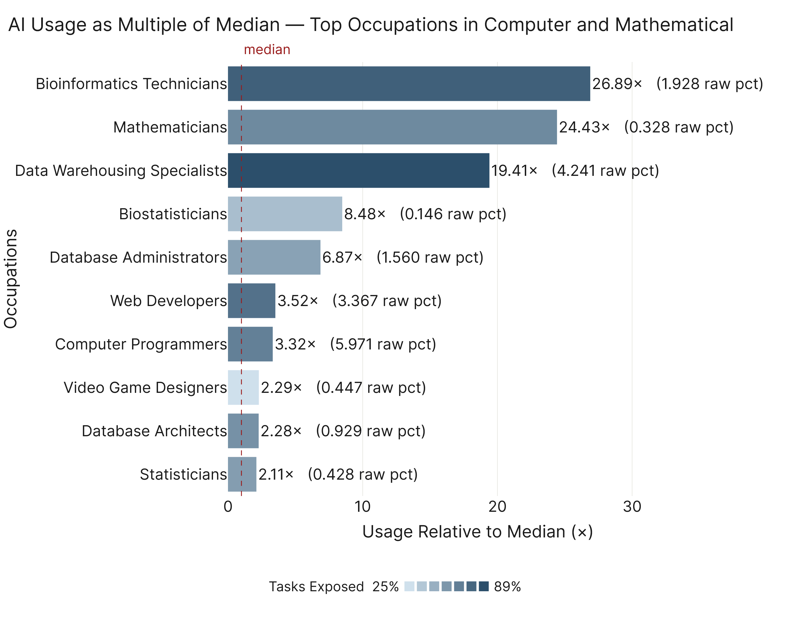

Top 10 occupations within "Computer and Mathematical" by within-major lift.

| # | Occupation | num | raw_pct | den | lift (×) | pct_tasks_affected |
|---|---|---|---|---|---|---|
| 1 | Bioinformatics Technicians | 0.8918 | 1.9280 | 48,204.5584 | 26.8932 | 81.3673 |
| 2 | Mathematicians | 0.2802 | 0.3281 | 16,679.1062 | 24.4255 | 63.1862 |
| 3 | Data Warehousing Specialists | 2.5505 | 4.2412 | 191,033.3000 | 19.4086 | 89.0198 |
| 4 | Biostatisticians | 0.1686 | 0.1456 | 28,902.8260 | 8.4822 | 40.3420 |
| 5 | Database Administrators | 0.9558 | 1.5601 | 202,362.8523 | 6.8662 | 52.6200 |
| 6 | Web Developers | 2.1982 | 3.3669 | 908,250.0449 | 3.5183 | 73.9477 |
| 7 | Computer Programmers | 3.9535 | 5.9711 | 1,729,107.8913 | 3.3238 | 67.5236 |
| 8 | Video Game Designers | 0.4012 | 0.4469 | 254,414.9529 | 2.2923 | 25.3070 |
| 9 | Database Architects | 0.6635 | 0.9290 | 423,283.2107 | 2.2788 | 59.9198 |
| 10 | Statisticians | 0.3104 | 0.4278 | 213,882.5663 | 2.1098 | 54.6957 |

Lift range: 2.11× (Statisticians) to 26.89× (Bioinformatics Technicians). pct_tasks_affected color range: 25.31% (Video Game Designers) to 89.02% (Data Warehousing Specialists).

#### Top Tasks — Computer & Mathematical

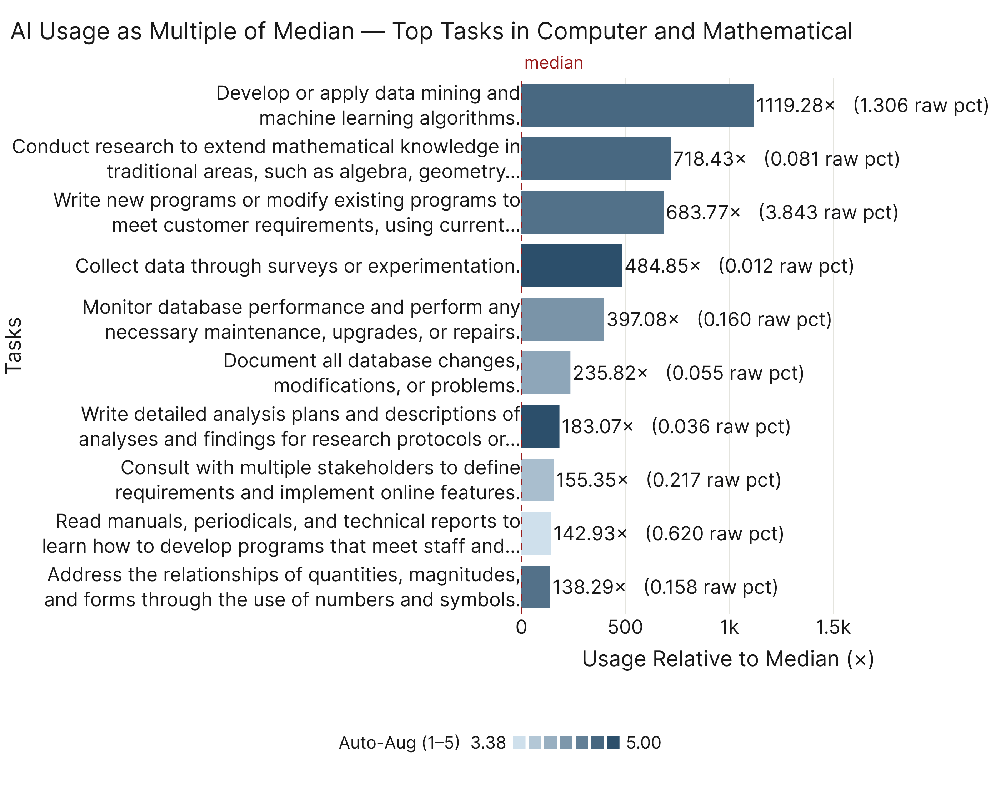

| # | Task | num | raw_pct | den | auto_aug | lift (×) |
|---|---|---|---|---|---|---|
| 1 | Develop or apply data mining and machine learning algorithms. | 0.5272 | 1.3064 | 2,937.6253 | 4.7248 | 1119.2821 |
| 2 | Conduct research to extend mathematical knowledge in traditional areas, such as algebra, geometry, probability, and logic. | 0.1498 | 0.0814 | 1,300.3087 | 4.7207 | 718.4257 |
| 3 | Write new programs or modify existing programs to meet customer requirements, using current programming languages and technologies. | 2.3074 | 3.8429 | 21,047.9123 | 4.6256 | 683.7712 |
| 4 | Collect data through surveys or experimentation. | 0.0432 | 0.0125 | 555.2045 | 5.0000 | 484.8523 |
| 5 | Monitor database performance and perform any necessary maintenance, upgrades, or repairs. | 0.0862 | 0.1600 | 1,353.6665 | 4.2284 | 397.0850 |
| 6 | Document all database changes, modifications, or problems. | 0.0679 | 0.0547 | 1,797.0690 | 4.0241 | 235.8217 |
| 7 | Write detailed analysis plans and descriptions of analyses and findings for research protocols or reports. | 0.0443 | 0.0357 | 1,510.6735 | 5.0000 | 183.0745 |
| 8 | Consult with multiple stakeholders to define requirements and implement online features. | 0.2749 | 0.2170 | 11,038.7779 | 3.7571 | 155.3463 |
| 9 | Read manuals, periodicals, and technical reports to learn how to develop programs that meet staff and user requirements. | 2.1466 | 0.6197 | 93,675.0463 | 3.3806 | 142.9279 |
| 10 | Address the relationships of quantities, magnitudes, and forms through the use of numbers and symbols. | 0.0805 | 0.1580 | 3,630.6956 | 4.6171 | 138.2935 |

Task-lift range: 138.29× (Address relationships of quantities, magnitudes, and forms…) to 1,119.28× (Develop or apply data mining and machine learning algorithms). Auto-aug column ranges from 3.38 (Read manuals/periodicals/technical reports…) to 5.00 (Collect data through surveys or experimentation).

---

### Appendix — Capability vs Adoption Properties Across All Occupations

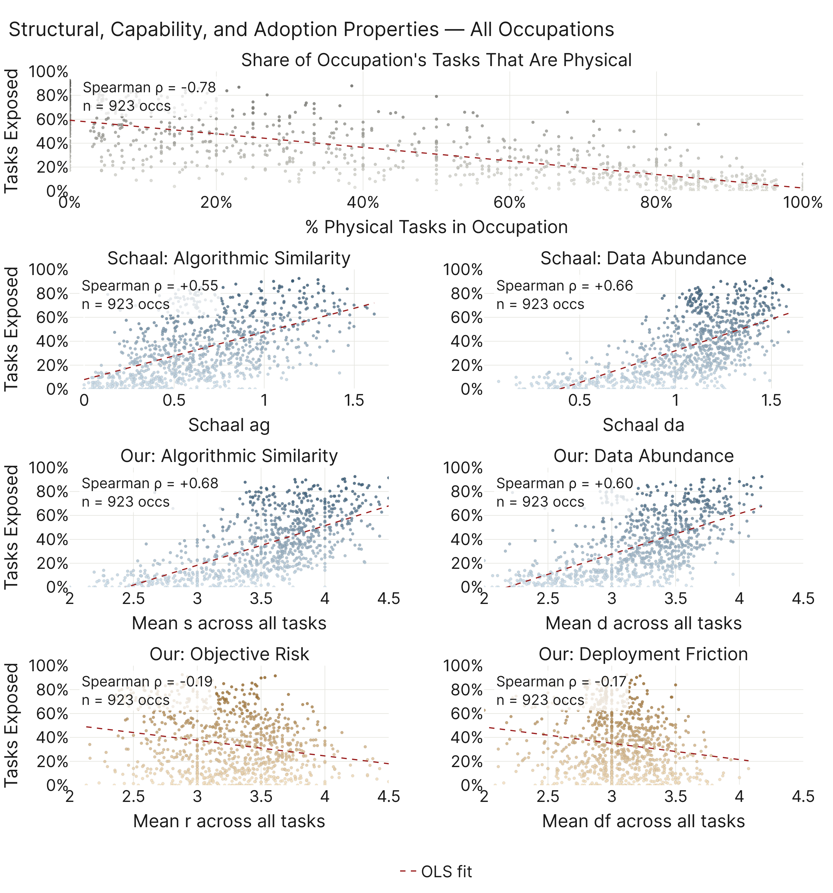

7-panel scatter chart contrasting structural / capability / adoption discrimination across all 923 occupations. Each panel shows one property on x-axis vs `pct_tasks_affected` (All Confirmed) on y-axis. Dot color = pct_tasks_affected on a light → dark ramp (gray for the structural row, blue for capability, gold for adoption).

- **Row 1 (1 wide panel, gray ramp): pct_physical** — the raw structural variable. x-axis range 0–100%, dtick 20.
- **Rows 2–3 (4 panels, blue ramp): capability properties** — Schaal ag, Schaal da, our s, our d.
- **Row 4 (2 panels, gold ramp): adoption properties** — our r, our df.

For the 4 properties on the [2.0, 4.5] dtick=0.5 x-scale (s, d, r, df), and the 3 on data-driven scales (pct_physical 0–100, schaal_ag and schaal_da data-driven).

Per-panel Spearman ρ + OLS fit (from `capability_vs_adoption_all_occs_stats.csv`):

| Panel (x-axis) | Spearman ρ | p-value | OLS slope | OLS intercept | n |
|---|---|---|---|---|---|
| **pct_physical** (row 1) | −0.7783 | 0.0000 | −0.5675 | 59.1997 | 923 |
| **schaal_ag** (row 2 col 1, capability) | +0.5474 | 0.0000 | 39.7929 | 7.9323 | 923 |
| **schaal_da** (row 2 col 2, capability) | +0.6646 | 0.0000 | 53.0603 | −20.9715 | 923 |
| **s** (row 3 col 1, capability) | +0.6777 | 0.0000 | 33.1058 | −80.9761 | 923 |
| **d** (row 3 col 2, capability) | +0.6039 | 0.0000 | 33.8346 | −73.8389 | 923 |
| **r** (row 4 col 1, adoption) | −0.1876 | 0.0000 | −13.0247 | 76.6311 | 923 |
| **df** (row 4 col 2, adoption) | −0.1669 | 0.0000 | −13.6335 | 75.9852 | 923 |

Each panel carries an in-chart annotation in the top-left: "Spearman ρ = {value}, n = {n} occs".

Y-axis (pct_tasks_affected) on every panel: 0–100% with dtick 20%. Underlying data (from `capability_vs_adoption_all_occs.csv`, 923 occupations): pct_tasks_affected max = 92.5073% (Business Intelligence Analysts).

X-axis ranges:
- Panel 1 (pct_physical): 0–100%
- Panel 2 (schaal_ag, schaal_da): data-driven (~0 to ~2)
- Panels 3–4 (s, d, r, df): 2.0 to 4.5

Top 5 occupations by pct_tasks_affected (from `capability_vs_adoption_all_occs.csv` sorted descending): Business Intelligence Analysts (92.5073%), Data Warehousing Specialists (91.4739%), Market Research Analysts and Marketing Specialists (90.6164%), Search Marketing Strategists (90.2021%), Real Estate Brokers (90.0824%).

---

### Appendix — Adoption Frictions vs Exposure Within Non-Physical Occupations

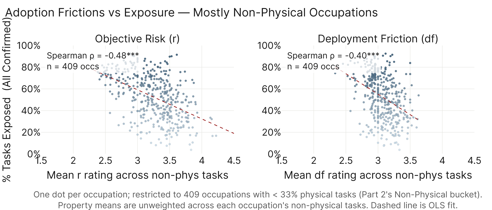

2-panel scatter chart restricted to mostly-non-physical occupations (pct_physical < 33%, n = 409). Both panels plot per-occupation property mean (averaged across all tasks the occupation contains) vs `pct_tasks_affected`. Dot color = pct_tasks_affected on a light → dark blue ramp.

- **Panel 1 — "Our: Objective Risk"** (x = `r`)
- **Panel 2 — "Our: Deployment Friction"** (x = `df`)

X-axis range on both panels: 2.0 to 4.5 (dtick 0.5). Y-axis range on both panels: 0–100% (dtick 20%).

Per-panel Spearman ρ + OLS fit (from `adoption_friction_scatter_stats.csv`):

| Panel | Spearman ρ | p-value | OLS slope | OLS intercept | n |
|---|---|---|---|---|---|
| **r** (Panel 1, Objective Risk) | −0.5009 | 0.0000 | −26.3309 | 138.0525 | 409 |
| **df** (Panel 2, Deployment Friction) | −0.4182 | 0.0000 | −36.3924 | 164.3676 | 409 |

Both ρ are significant at p < .001. For comparison, the same r/df properties in the prior all-occupation chart had ρ = −0.1876 and −0.1669.

Each panel has an in-chart annotation: "Spearman ρ = {value}*** , n = 409 occs". Legend: dashed orange "OLS fit" line shown on each panel.

Sample top-of-distribution occupations from `adoption_friction_scatter.csv` (sorted by pct_tasks_affected desc, mean r / mean df across all tasks in the occupation, n_tasks = count of distinct tasks):

| Occupation | r | df | n_tasks | pct_tasks_affected |
|---|---|---|---|---|
| Business Intelligence Analysts | 2.8824 | 3.1176 | 17 | 92.5073 |
| Data Warehousing Specialists | 3.6111 | 3.2222 | 18 | 91.4739 |
| Market Research Analysts and Marketing Specialists | 2.9231 | 3.0769 | 13 | 90.6164 |
| Search Marketing Strategists | 2.9444 | 3.1944 | 36 | 90.2021 |
| Real Estate Brokers | 3.5294 | 2.9412 | 17 | 90.0824 |
| Investment Fund Managers | 3.5000 | 2.9500 | 20 | 89.7167 |
| Bioinformatics Technicians | 3.0000 | 2.9474 | 19 | 88.3071 |
| Interpreters and Translators | 3.1176 | 2.8235 | 17 | 87.7945 |
| Poets, Lyricists and Creative Writers | 2.3125 | 3.0000 | 16 | 87.7673 |
| Customer Service Representatives | 3.0000 | 2.9231 | 13 | 86.8334 |

Bottom-of-distribution samples (low pct_tasks_affected end):

| Occupation | r | df | n_tasks | pct_tasks_affected |
|---|---|---|---|---|
| Biofuels Production Managers | 3.8571 | 3.3571 | 14 | 3.8338 |
| Forest Fire Inspectors and Prevention Specialists | 3.5625 | 3.1875 | 16 | 7.5941 |
| First-Line Supervisors of Farming, Fishing, and Forestry Workers | 3.2333 | 3.1000 | 30 | 8.1236 |
| Hydroelectric Production Managers | 3.8889 | 3.3333 | 18 | 8.7646 |
| Facilities Managers | 3.4545 | 3.1818 | 11 | 9.0842 |
| Foresters | 3.4000 | 3.4000 | 25 | 10.2500 |
| Umpires, Referees, and Other Sports Officials | 3.4375 | 2.9375 | 16 | 10.3206 |
| Geothermal Production Managers | 3.8824 | 3.4118 | 17 | 10.5892 |
| Fundraising Managers | 3.2500 | 3.1875 | 16 | 13.5501 |
| Range Managers | 3.4375 | 3.5625 | 16 | 13.9704 |

Across the 409 non-physical occupations: pct_tasks_affected min = 3.83% (Biofuels Production Managers), max = 92.51% (Business Intelligence Analysts).

---

*End of dense-prose results document. All bar / cell / segment / point values transcribed directly from the figure-script CSVs in `analysis/paper/results/part_{1,2,3}/results/` and `analysis/paper/results/appendix/results/`. Numbers may be rounded for display but reflect what the underlying figure renders.*
