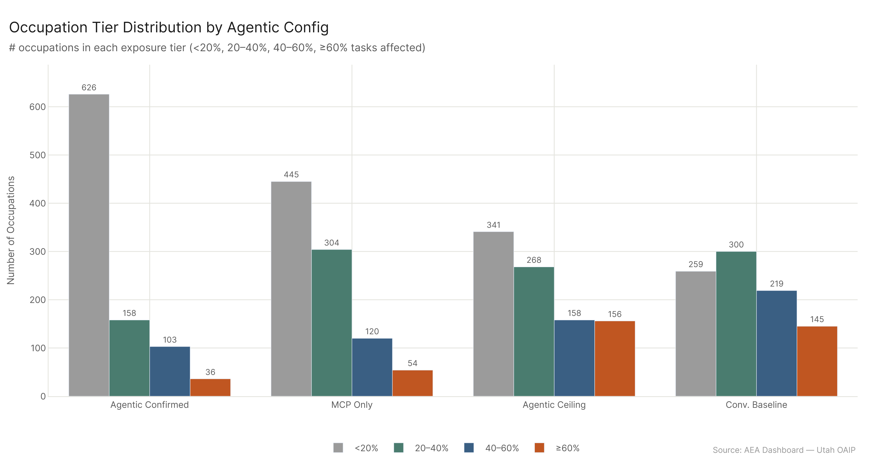

*Primary config: AEI API 2026-02-12 (Agentic Confirmed) | MCP Cumul. v4 (MCP Only) | MCP + API 2026-02-18 (Agentic Ceiling) | AEI Both + Micro 2026-02-12 (Conv. Baseline) | Method: freq | Auto-aug ON | National*

Right now, depending on how you measure it, between 31M and 60M workers are in occupations meaningfully touched by agentic AI. The AEI API "confirmed" number (31.1M, 20.3% of employment) represents the floor — occupations where agentic tool-use has actually been documented. The ceiling (60.4M, 39.4% of employment) represents the upper bound where current AI tools are capable of affecting the work. The gap between floor and ceiling isn't measurement error — it's the space where deployment is possible but hasn't yet arrived. Wages in affected occupations range from $2.2T (confirmed) to $4.0T (ceiling), representing a substantial fraction of the U.S. wage bill.

## The Four Scenarios

The exposure picture depends entirely on which benchmark you use. There are four natural configurations:

| Scenario | Workers | Wages | % Employment |
|---|---|---|---|
| Agentic Confirmed (AEI API) | 31.1M | $2,161.9B | 20.3% |
| MCP Only | 46.5M | $2,968.8B | 30.4% |
| Agentic Ceiling (MCP+API) | 60.4M | $3,971.9B | 39.4% |
| Conv. Baseline (all_confirmed) | 61.3M | $3,993.2B | 40.0% |

The Conv. Baseline (all_confirmed) and the Agentic Ceiling are nearly identical in absolute scale — within 1M workers and $21B in wages. But they represent different things. The Conv. Baseline counts occupations with confirmed conversational AI usage (including Microsoft data); the Agentic Ceiling counts occupations where agentic tool-calling capabilities are plausible. The near-convergence at the aggregate level is somewhat coincidental — the sectors they emphasize differ substantially.

## Reading the Gap

The 29.3M worker gap between Agentic Confirmed and the Agentic Ceiling (31.1M vs. 60.4M) has a specific meaning. These are workers in occupations where agentic AI is capable of affecting their work — MCP benchmark testing shows it — but where confirmed deployment data doesn't yet exist. Some of this will deploy soon; some may take years; some may not deploy at commercial scale for structural reasons. This is the policy-relevant frontier: not "has it happened" but "can it happen, and under what conditions?"

The MCP-only figure (46.5M) is also instructive. MCP Without AEI API captures what happens when you only count tool-calling capabilities and ignore the conversational AI deployment layer. The additional 13.9M workers in the full Agentic Ceiling (60.4M - 46.5M) come from the AEI API component — occupations where agentic deployment data confirms exposure beyond what MCP benchmarks alone show.

## Wage Concentration

The wage figures tell a story about who bears this exposure. $2.16T in wages for the Agentic Confirmed group — these workers are already in occupations where agentic AI has been documented. The ceiling is $4.0T. The $1.8T difference represents wages in occupations where AI capability exists but confirmed deployment does not. These workers' wages are structurally exposed but not yet under active disruption pressure.

## Tier Distribution

The tier breakdown by scenario shows how exposure concentrates:

**Agentic Confirmed (AEI API):**
- Low (<20%): 626 occupations, 5.1M workers
- Restructuring (20-40%): 158 occupations, 9.6M workers  
- Moderate (40-60%): 103 occupations, 12.4M workers
- High (>=60%): 36 occupations, 4.1M workers

**Agentic Ceiling (MCP+API):**
- Low (<20%): 341 occupations, 4.5M workers
- Restructuring (20-40%): 268 occupations, 12.8M workers
- Moderate (40-60%): 158 occupations, 13.1M workers
- High (>=60%): 156 occupations, 30.0M workers

The shift from 36 High-tier occupations under Agentic Confirmed to 156 under the Agentic Ceiling is the headline number. 30M workers are in occupations that score >=60% under the agentic ceiling — a figure that will change how policymakers think about workforce planning if even a fraction of that exposure translates to role changes.

## Key Figures

## Key Takeaways

1. **The confirmed floor is 20.3% of employment (31.1M)** — this is where agentic AI is already documented. Not projected, not modeled — documented.
2. **The ceiling is 39.4% (60.4M)** — nearly double the confirmed figure, representing the outer boundary of plausible near-term exposure.
3. **$4T in wages sit at the ceiling** — roughly a quarter of the total U.S. wage bill is in occupations that current AI tools can materially affect.
4. **The 30M High-tier workers under the ceiling are the policy focal point** — these are workers in occupations where >=60% of tasks are AI-capable. Planning around that cohort is more urgent than planning around the aggregate.
5. **MCP-only vs. full ceiling gap is 13.9M workers** — the AEI API component is adding confirmed deployment evidence for occupations MCP reaches on capability alone.
