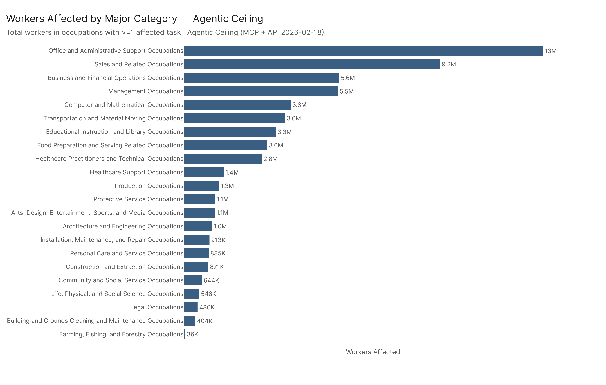
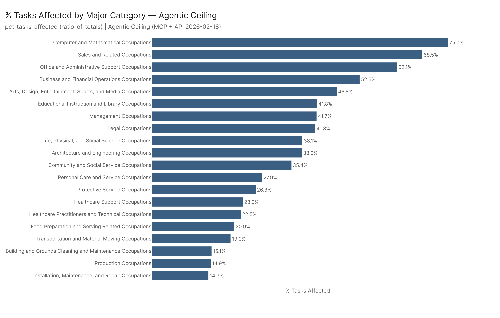
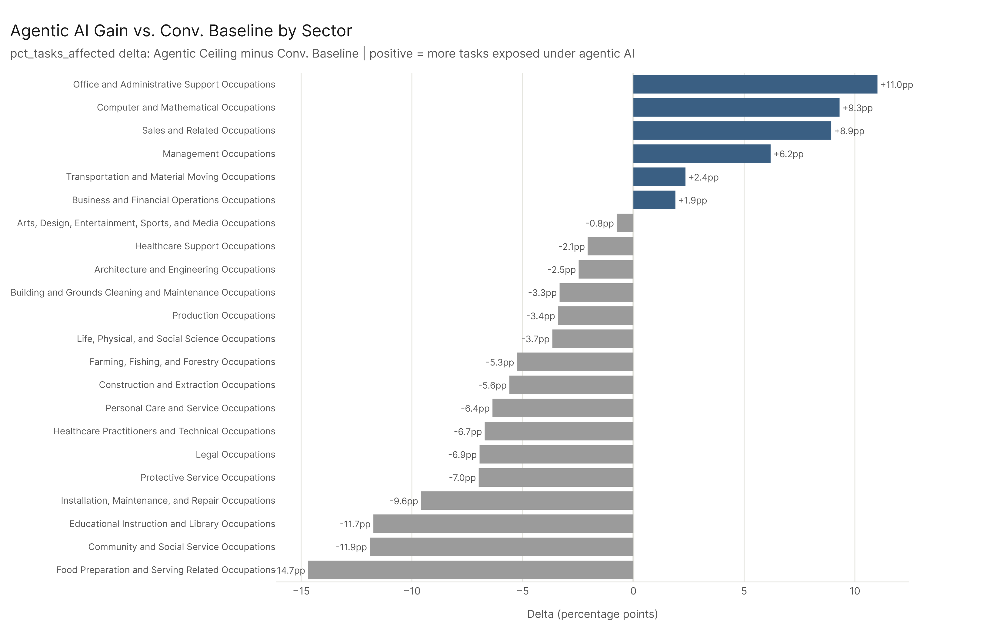
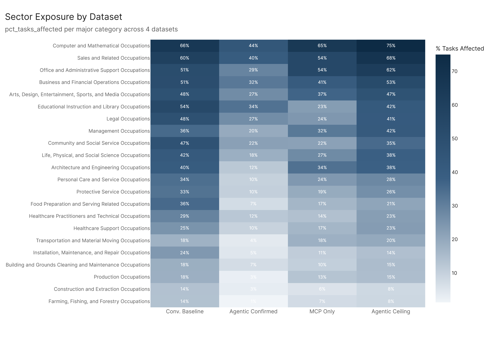

*Primary config: AEI API 2026-02-12 | MCP Cumul. v4 | MCP + API 2026-02-18 (Agentic Ceiling) | AEI Both + Micro 2026-02-12 (Conv. Baseline) | Method: freq | Auto-aug ON | National*

Agentic AI concentrates its footprint in white-collar, information-processing sectors — but the ceiling vs. baseline comparison reveals a key asymmetry: some sectors gain substantially under agentic AI while others actually lose relative standing. Office/Admin, Computer/Math, and Sales are the sectors where agentic AI adds the most exposure on top of the conversational baseline. Food Prep, Community Services, and Education are sectors where the agentic lens reveals less — not because they lose exposure, but because the agentic dataset adds fewer tasks to those sectors. The largest agentic boost goes to sectors with high data-manipulation and system-coordination content.

## Aggregate Sector Footprint

Under the Agentic Ceiling (MCP + API 2026-02-18), the top sectors by workers affected are:

| Sector | Workers Affected | % Tasks Affected |
|---|---|---|
| Office and Administrative Support | 12.9M | 62.1% |
| Sales and Related Occupations | 9.2M | 68.5% |
| Business and Financial Operations | 5.6M | 52.6% |
| Management Occupations | 5.5M | 41.7% |
| Computer and Mathematical | 3.8M | 75.0% |

Computer/Math has the highest pct_tasks_affected (75%) but lower absolute worker counts than Office/Admin or Sales. The combined Office/Admin + Sales footprint (22.1M workers) represents a huge concentration of agentic AI exposure in the clerical and commercial backbone of the economy.

## The Agentic Delta: Sectors That Gain Most from Agentic AI

The delta analysis (Agentic Ceiling pct minus Conv. Baseline pct) reveals which sectors agentic AI specifically unlocks, beyond what conversational AI already covers:

**Biggest gainers:**
- Office and Administrative Support: +11.0pp
- Computer and Mathematical: +9.3pp
- Sales and Related Occupations: +8.9pp
- Management Occupations: +6.2pp
- Transportation and Material Moving: +2.4pp

**Sectors where agentic adds little or goes negative:**
- Protective Service: -7.0pp
- Installation, Maintenance, and Repair: -9.6pp
- Educational Instruction and Library: -11.7pp
- Community and Social Service: -11.9pp
- Food Preparation and Serving: -14.7pp

The negative deltas are notable. They don't mean these sectors lose AI exposure — they mean the agentic dataset (MCP + API) adds fewer tasks to these sectors than the conversational baseline covers. Food Prep and Community Services have tasks better captured by conversational AI benchmarks than by tool-calling MCP benchmarks. Education is the starkest case: conversational AI tools have substantially reshaped educational work (tutoring, curriculum design, grading assistance), but MCP's tool-calling capabilities don't add as much in classroom or community-service contexts.

## Cross-Config Heatmap Pattern

Across all four datasets, the rank ordering of sectors is broadly stable — Computer/Math is consistently near the top, Construction and Personal Care near the bottom — but the magnitudes vary substantially. AEI API shows much lower scores everywhere (reflecting its conservative measurement approach). MCP Only and Agentic Ceiling show similar patterns but MCP Only has higher scores in some sectors where MCP's tool-calling is particularly relevant.

## Key Figures

## Key Takeaways

1. **Office/Admin and Sales are the two largest worker-count footprints** — 22M+ workers combined under the agentic ceiling, both above 60% task exposure.
2. **Computer/Math has the highest pct_tasks_affected (75%)** — nearly every task in these occupations has some agentic AI angle.
3. **The agentic delta is positive for white-collar coordination roles** — agentic AI adds most where tool-calling and system integration are relevant (scheduling, data management, sales operations).
4. **Education and Community Services show negative agentic delta** — conversational AI has already touched these sectors; MCP doesn't add much on top.
5. **Transportation gains slightly (+2.4pp)** — a surprising but real finding: MCP's scheduling and routing capabilities create some agentic exposure in transportation coordination roles.
