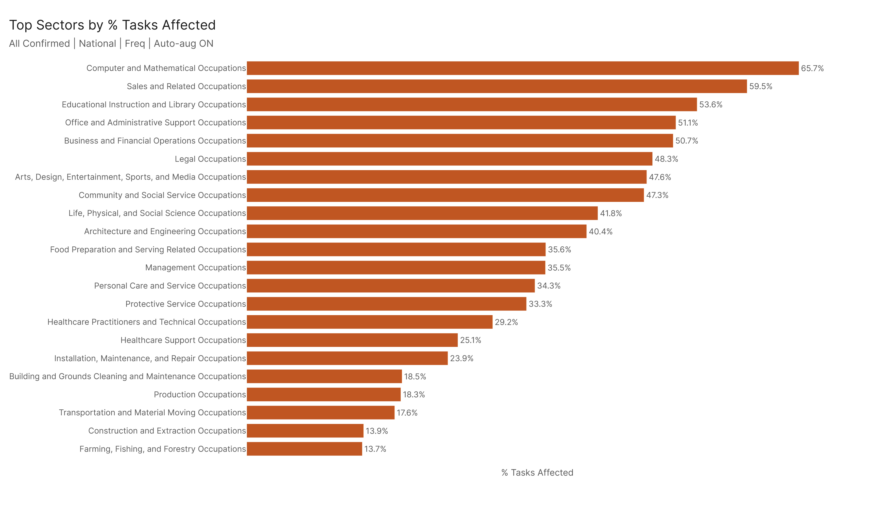
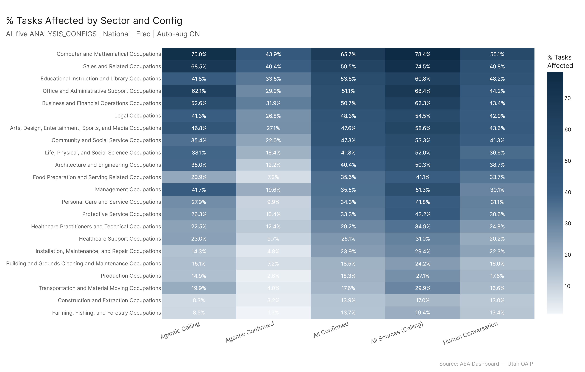

# Economic Footprint: Sector Breakdown

**TLDR:** Under our primary configuration (All Confirmed), approximately 61.3 million workers — 40% of total U.S. employment — work in occupations where a meaningful share of tasks are AI-affected. That translates to roughly $4 trillion in wages in scope. The ceiling estimate puts the number at 77 million workers and $5 trillion in wages. Office/Admin and Sales together account for nearly a third of the affected workforce, though by percentage of tasks affected, Computer & Math and Sales are the most deeply exposed sectors.

---

## The Headline Numbers

61.3 million workers. $3.99 trillion in wages. 40% of total employment.

That's the All Confirmed number — our primary configuration, which requires AI capability claims to be confirmed across multiple sources. If you relax that to include all sources regardless of confirmation (the ceiling), you get 77.1 million workers and $4.97 trillion in wages, representing 50.3% of employment.

So the honest answer to "how many workers are AI-affected?" is somewhere in the 61–77 million range, depending on how credulous you are about AI capability claims. A gap of about 15.8 million workers sits in that ambiguity zone — tasks where some sources say AI can do it and others don't agree. That's not noise. That's a real methodological question about what counts as demonstrated capability versus claimed capability.

The average percentage of tasks affected per worker (employment-weighted across all occupations) is 36.1% under All Confirmed, rising to 45.1% at the ceiling. So we're not talking about jobs where AI touches one or two tasks at the margin — the average affected worker has more than a third of their tasks in scope.

---

## Where the Workers Are

The largest sectors by raw workers affected are mostly where you'd expect if you think about employment concentration:

- **Office and Administrative Support**: 11.2 million workers, 51.1% tasks affected. This is the largest affected sector by a wide margin — a combination of high employment base and genuinely high AI exposure. These are the jobs that have been talked about most in the automation discourse for decades, and the data supports the concern.
- **Sales and Related**: 7.6 million workers, 59.5% tasks affected. High worker count, but also one of the highest task penetration rates in the economy. Sales jobs have a lot of information-gathering, communication, and documentation components that AI handles well.
- **Business and Financial Operations**: 5.5 million workers, 50.7% tasks affected. These are analysts, accountants, consultants — the knowledge workers who've dominated the "AI will transform white-collar work" narrative. The numbers back that framing.
- **Food Preparation and Serving**: 4.9 million workers, 35.6% tasks affected. Large employment base drives this number. The task exposure is lower than the knowledge sectors, but there's enough administrative, communication, and information-processing work embedded in food service roles to put 4.9 million workers in scope.
- **Management Occupations**: 4.8 million workers, 35.5% tasks affected. Managers do more varied work than most, which dilutes the percentage — but the worker count is high and the wages are enormous ($613.8 billion in wages affected).

---

## Which Sectors Are Most Deeply Exposed

If you look at percentage of tasks affected rather than raw headcount, a different picture emerges:

- **Computer and Mathematical**: 65.7%. This is both the most task-penetrated major sector and home to people who will likely use AI as a productivity amplifier more than a replacement vector — but the exposure is real and significant.
- **Sales and Related**: 59.5%.
- **Educational Instruction and Library**: 53.6%. This surprised me slightly. Education sits at the intersection of communication, content generation, and administrative work — three areas where AI capability is high.
- **Office and Administrative Support**: 51.1%.
- **Business and Financial Operations**: 50.7%.

At the other end: **Farming, Fishing, and Forestry** (13.7%), **Construction and Extraction** (13.9%), and **Transportation and Material Moving** (17.6%) have the lowest task penetration. These are physically-grounded jobs where AI's current capabilities hit their limits.

Healthcare is interesting — **Healthcare Practitioners** at 29.3% and **Healthcare Support** at 25.1% have substantial exposure but are moderated by the physical and perceptual demands of clinical work. The affected tasks are the information-processing, documentation, and communication components, not the hands-on care.

---

## Floor vs. Ceiling: What's in Dispute

The confirmed-vs-ceiling gap varies a lot by sector. For sectors with a lot of knowledge-intensive, creative, or communication-heavy work, the ceiling can be meaningfully higher than confirmed — there are tasks where some AI systems demonstrate capability but others don't yet. For physically-grounded work, the gap is narrower because there are fewer contested claims.

This variation in the floor/ceiling spread is itself a meaningful signal. A sector with a wide spread is one where AI capability is actively contested — where the next generation of models could shift the numbers substantially. A sector with a narrow spread is one where the current capability assessment is relatively stable.

---

## What This Means

The scale here is genuinely large. 61 million workers is not a marginal story. To put it in context: that's more workers than the entire manufacturing sector had at its peak in the 1970s. The difference is that manufacturing job losses played out over 40 years; the conditions for AI-driven change in office, sales, and knowledge work exist right now.

That said, worker count doesn't equal displacement. These workers are exposed — meaning a meaningful share of their tasks are AI-capable — but exposure is not the same as obsolescence. The more interesting question is whether firms will use AI to do the same work with fewer people, or do more work with the same people. The data here can't answer that. What it can say is that the scale of potential impact is large enough that the answer matters a great deal.

The $4 trillion in wages affected is probably the number that matters most to policymakers. That's roughly a third of total U.S. wage income potentially subject to significant productivity change. If AI captures even a fraction of that in value, the distribution of that value — between workers, firms, and capital — is a first-order economic question.
