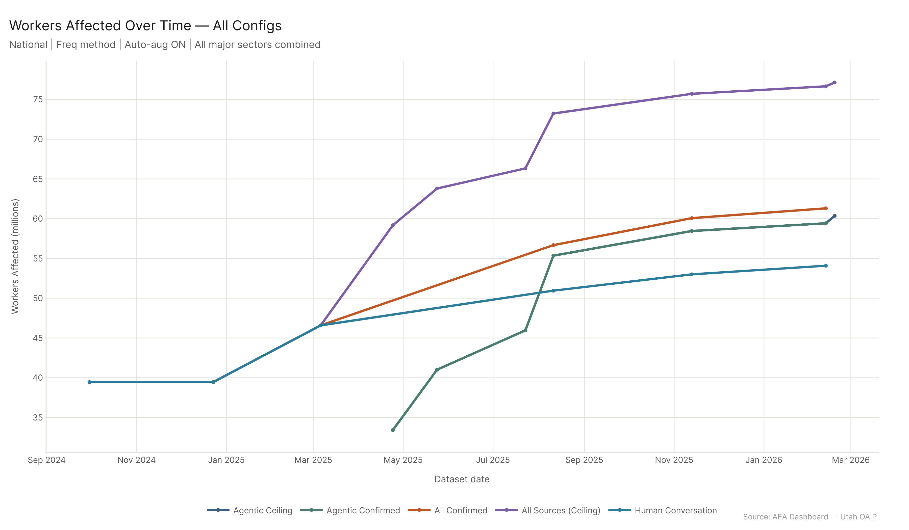
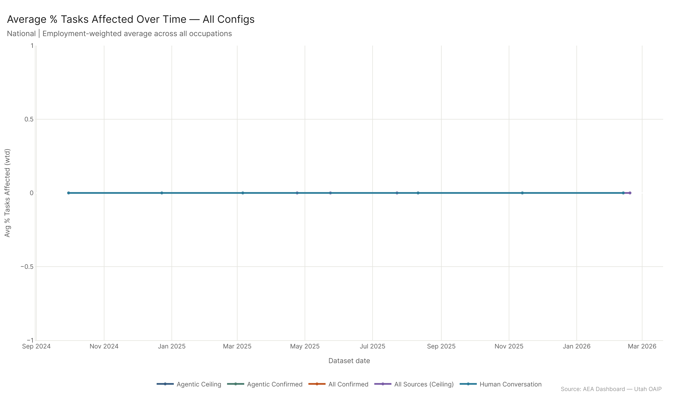
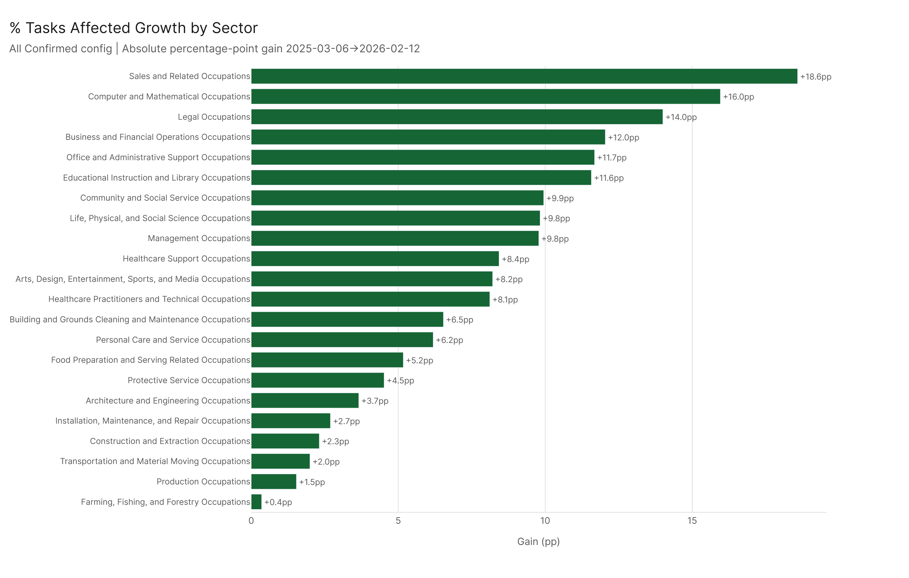
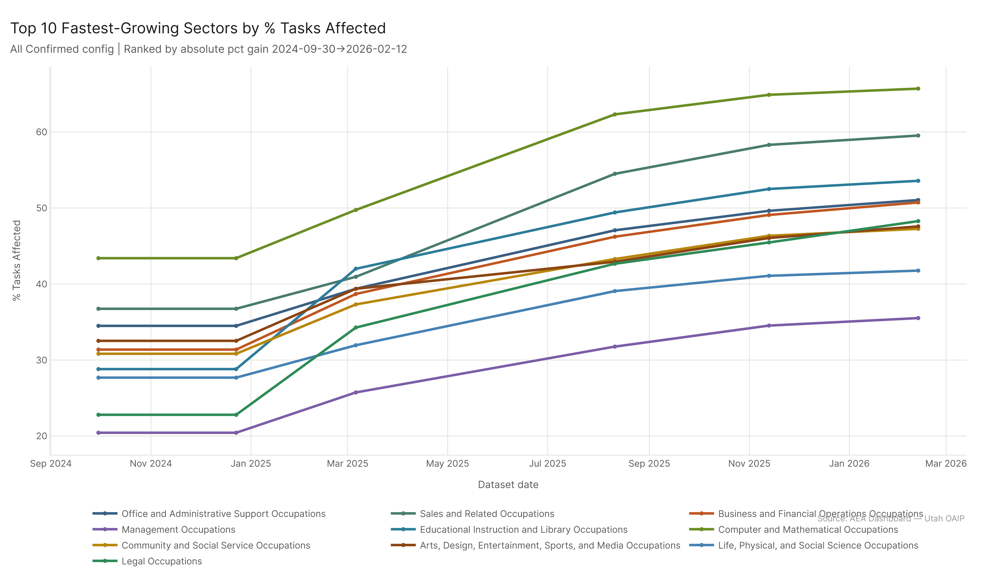

# Economic Footprint: Time Trends

**TLDR:** The All Confirmed worker count has roughly doubled since the first available dataset date, with most of the growth coming from a sustained expansion of confirmed AI capability claims rather than changes in the labor market. At the sector level, Legal, Educational, and Sales occupations have seen the largest absolute gains in task exposure — Legal nearly doubled from 22.8% to 48.3%. The ceiling estimates have grown in parallel, meaning the confirmed/ceiling gap hasn't meaningfully narrowed — new capabilities keep expanding both bounds simultaneously.

---

## How the Aggregate Has Moved

The All Confirmed series shows sustained growth over the full dataset window. The pattern across configurations:

- The ceiling configuration (All Sources) started at 39.5M workers in September 2024 and reached 77.1M by February 2026. That's nearly a doubling in less than 18 months.
- Human Conversation (confirmed) started at 39.5M and reached 54.1M — a 37% increase over the same period.
- Agentic Confirmed (AEI API only) began tracking from August 2025 at 23.4M workers and reached 31.1M by February 2026 — a 33% increase over six months.

The ceiling and confirmed trajectories have moved together rather than converging. A narrowing ceiling/confirmed gap would suggest AI capability claims are becoming more reliable as evidence accumulates. The fact that both are expanding means the frontier is still advancing faster than the validation process can consolidate it. New capabilities keep getting proposed before old proposals fully harden into confirmed status.

The worker count growth is almost entirely driven by new capability claims being added — the labor market itself isn't changing quickly. What's changing is the assessed reach of AI into existing occupational tasks. The same jobs are there; AI keeps finding new footholds in them.

---

## Sector-Level Growth

The major category trends over the full All Confirmed series reveal which sectors have seen the fastest growth in AI task exposure. Ranked by absolute percentage-point gain from first to last available date:

1. **Legal Occupations**: +25.5 pp (22.8% -> 48.3%)
2. **Educational Instruction and Library**: +24.8 pp (28.8% -> 53.6%)
3. **Sales and Related**: +22.8 pp (36.8% -> 59.5%)
4. **Computer and Mathematical**: +22.3 pp (43.4% -> 65.7%)
5. **Business and Financial Operations**: +19.4 pp (31.4% -> 50.7%)
6. **Office and Administrative Support**: +16.6 pp (34.5% -> 51.1%)
7. **Community and Social Service**: +16.4 pp (30.8% -> 47.3%)
8. **Management Occupations**: +15.1 pp (20.4% -> 35.5%)

Legal jumping from 22.8% to 48.3% is one of the more striking findings in the full dataset. This isn't steady incremental growth — it reflects episodic jumps as AI systems demonstrated new legal reasoning, document analysis, and research capabilities. Legal work has a lot of structured text analysis embedded in it, and as language models improved at that, the confirmed capability count climbed.

Education shows a similar pattern. The tasks embedded in educational work — content preparation, explanation, feedback, administrative documentation — are the exact tasks that AI has gotten demonstrably better at over this period.

At the bottom of the growth table: Farming/Forestry (+1.9 pp), Transportation (+2.3 pp), Production (+2.6 pp). Physical, equipment-dependent work where the task frontier hasn't moved much.

---

## The Rate of Change Question

Looking at the pace across the series, growth hasn't been uniform. There are step-function jumps rather than smooth curves, corresponding to specific model releases or capability demonstrations that got confirmed across enough tasks to move the aggregate.

The implication: the trend line isn't a reliable basis for mechanical extrapolation. Future growth in assessed exposure will depend on which capabilities next-generation models demonstrate and how quickly those demonstrations propagate into confirmed task assessments. A model that cracks multimodal reasoning or real-world action-taking at scale would produce a jump much larger than anything in the current series.

But the baseline trajectory — roughly doubling in 18 months at the ceiling — is the kind of growth rate that typically means a technology is past the early-adopter stage and into broad diffusion. The question now is whether the economic impact grows proportionally, or whether deployment friction, organizational inertia, and regulatory constraint slow the realized impact well below the measured capability frontier.

---

## What's Not in the Trends

The trends here are all capability-side — how much of existing work AI can do. What's missing from this picture:

**Actual deployment.** The trend data says AI can do these tasks. It doesn't say firms are actually using AI for them at scale. Capability and deployment are on very different timelines in enterprise settings.

**Wage and employment effects.** Even if AI exposure has doubled, wages in Legal or Education haven't halved. Either firms are using AI to expand output rather than cut headcount, or the deployment curve is lagging the capability curve significantly, or the productivity gains are being captured elsewhere. Probably some of all three.

**Displacement vs. augmentation.** A rising exposure share could mean more workers are being displaced by AI, or it could mean more workers are being augmented by AI tools in their existing roles. The trend data alone can't distinguish these.

The trends analysis sets up the right questions for deeper investigation. The direction is clear: assessed AI capability in the labor market has grown substantially and shows no sign of plateauing. Whether that translates into proportional economic disruption depends on factors that aren't captured in task-level capability data.
