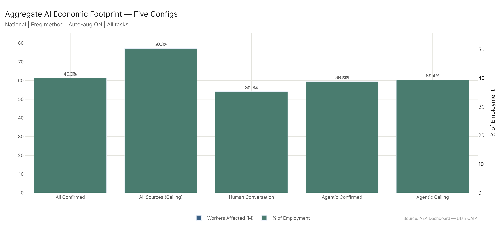
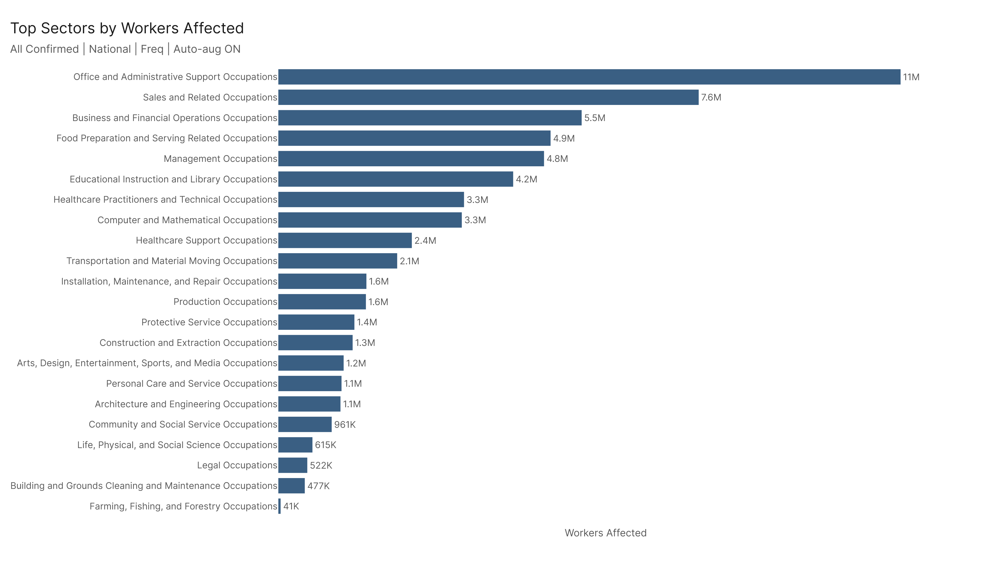
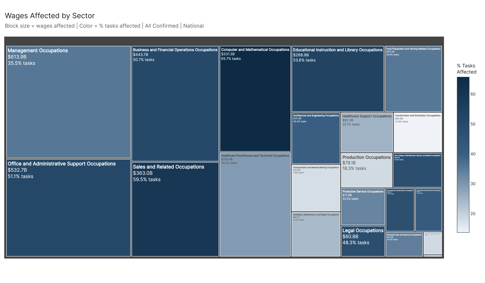
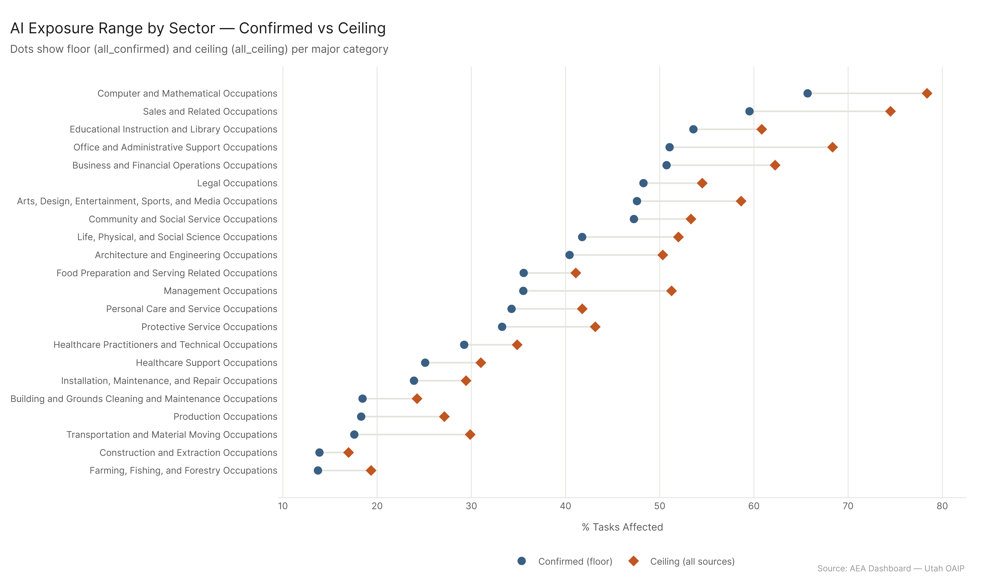
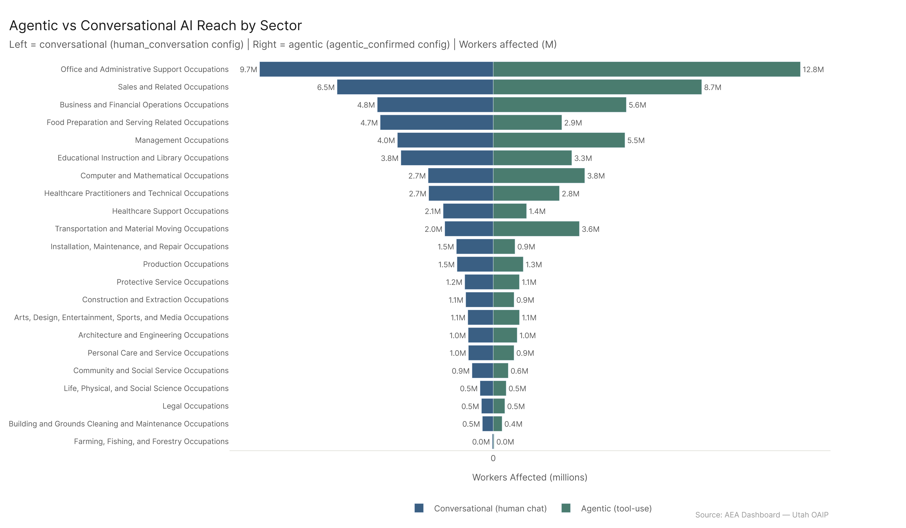
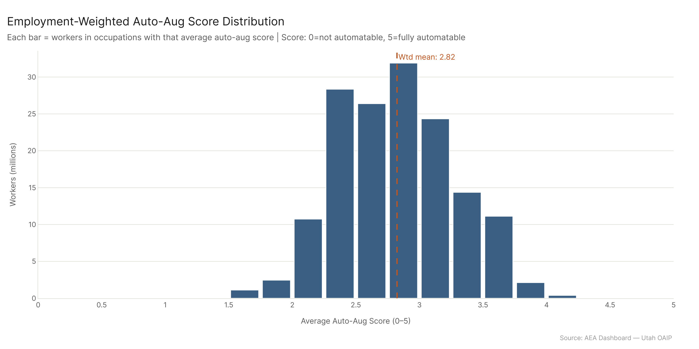
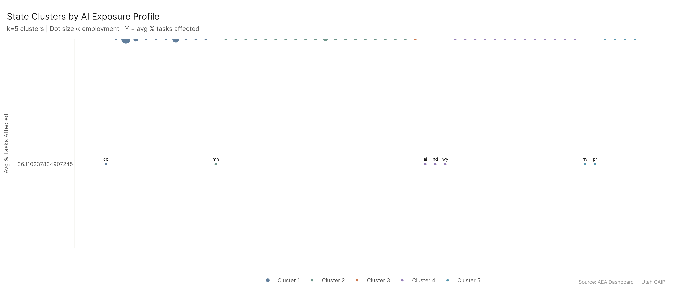
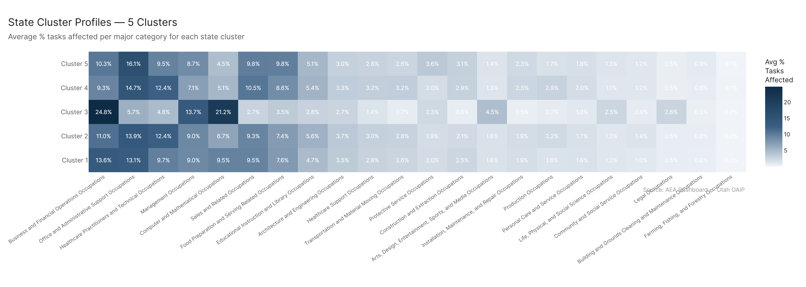

# Economic Footprint: AI's Total Scale Across the US Economy

*Primary config: All Confirmed | 923 occupations | National | Method: freq | Auto-aug ON*

---

Confirmed AI usage already reaches 61.3 million workers — 40% of total US employment — representing $3.99 trillion in annual wages. The ceiling estimate puts it at 77.1 million workers and $4.97 trillion, 50.3% of all employment. The confirmed footprint grew 31% in the 11-month window from March 2025 to February 2026 — from 46.6M to 61.3M workers. It is concentrated in knowledge work, heaviest in Zone 4 (credentialed professional jobs), driven by information-processing and communication activities. Conversational AI currently has broader confirmed reach than agentic deployment, but the agentic ceiling already exceeds conversational confirmed — the potential is there once agentic infrastructure matures. Every state has essentially the same task exposure rate (~36.1%); what varies is sector composition.

---

## 1. The Scale

*Full detail: [sector_footprint/sector_footprint_report.md](sector_footprint/sector_footprint_report.md)*

61.3 million workers. $3.99 trillion in wages. 40% of total US employment. That's the All Confirmed number — requiring AI capability claims to be validated across multiple sources before a task counts as affected. The ceiling, which includes all AI capability claims regardless of cross-source confirmation, puts the count at 77.1 million workers and $4.97 trillion in wages, representing 50.3% of employment.

The five-config picture:

| Config | Workers | Wages | % Employment |
|--------|---------|-------|-------------|
| All Confirmed (primary) | 61.3M | $3.99T | 40.0% |
| All Sources (ceiling) | 77.1M | $4.97T | 50.3% |
| Human Conversation | 54.1M | $3.47T | 35.3% |
| Agentic Confirmed (AEI API only) | 31.1M | $2.16T | 20.3% |
| Agentic Ceiling (MCP + AEI API) | 60.4M | $3.97T | 39.4% |

The gap between confirmed and ceiling — 15.8 million workers, roughly $980 billion in wages — is not noise. That's a real methodological divide: tasks where some AI systems have demonstrated capability but the evidence hasn't consolidated. It's also a forward indicator. As capabilities continue to be confirmed across additional sources, some portion of those 15.8 million workers will shift from "ceiling only" to "confirmed."

The largest sectors by raw workers affected under All Confirmed are Office and Administrative Support (11.2M, 51.1% tasks affected), Sales and Related (7.6M, 59.5%), and Business and Financial Operations (5.5M, 50.7%). But the highest-penetration sectors by task percentage tell a different story — Computer and Mathematical at 65.7%, Sales at 59.5%, and Educational Instruction at 53.6% are where AI is most deeply embedded relative to the work itself.

Management Occupations carry $613.9 billion in wages affected despite only moderate task penetration (35.5%) — a function of the sector's massive payroll per worker. This is worth keeping in mind for policy discussions: the workers most exposed by percentage and the sector with the most wages at stake are not the same thing.

At the other end: Farming/Forestry (13.7%), Construction and Extraction (13.9%), and Transportation (17.6%) have the lowest task penetration. Physical, equipment-dependent work where AI's current reach is limited.

---

## 2. Job Structure: The Preparation Paradox

*Full detail: [job_structure/job_structure_report.md](job_structure/job_structure_report.md)*

The relationship between job preparation level and AI exposure runs counter to the standard automation narrative. Average task exposure by O*NET job zone:

| Zone | Description | Avg % Tasks Affected |
|------|-------------|---------------------|
| Zone 1 | Little prep | ~26.9% |
| Zone 2 | Some prep | ~30.6% |
| Zone 3 | Medium prep | ~35.0% |
| **Zone 4** | **Considerable prep (bachelor's + experience)** | **~50.9%** |
| Zone 5 | Extensive prep (advanced degree) | ~45.9% |

Zone 4 — managers, accountants, engineers, analysts, healthcare practitioners — carries the highest average exposure. This isn't a claim that Zone 4 workers will be replaced wholesale. It's a claim that a larger share of what they do on a given day is AI-capable than for someone in Zone 1.

Zone 5 dips back slightly because the most elite professional work — original research, clinical judgment, legal strategy — still has meaningful AI-resistant components. The Zone 4 peak is where the combination of structured knowledge work and high task volume creates the greatest overlap with current AI capability.

Almost all Zone 4 workers (roughly 35 million total) sit in the moderate-to-high exposure range. The low-exposure pocket (0.9M) is tiny compared to the high-exposure mass (12.4M). Zone 2 shows the opposite — 18.8 million Zone 2 workers are in the Low tier, concentrated in physically-grounded service and trade jobs. But Zone 2 also has 10.4 million in High exposure — the administrative, sales, and data-entry roles within Zone 2 that are heavily AI-reachable.

The Utah DWS job outlook data adds another layer. Jobs with poorer labor market outlooks (Rating 3, below-average/declining) have higher average AI exposure (~39.2%) than bright-outlook jobs (Rating 1: ~29.8%). The labor market is already pricing in some of this. Whether AI exposure is *causing* the poor outlook or just correlated with it varies by occupation — some are declining because of automation; others are AI-exposed and the market hasn't fully repriced them yet.

---

## 3. What Kind of Work Is Exposed: The Skills and Technology Landscape

*Full detail: [skills_landscape/skills_landscape_report.md](skills_landscape/skills_landscape_report.md)*

Of 120 O*NET skills, knowledge, and abilities elements, AI currently exceeds the typical occupation's requirement (>100%) on 23 — all in knowledge or skills domains, none in physical abilities. The top AI-leading elements: Sales and Marketing (131% of occ need), History and Archeology (125%), Philosophy and Theology (121%), Foreign Language (118%). The pattern is clear: knowledge that can be encoded, retrieved, and synthesized from text, especially domains with structured accumulated content.

Human advantages are concentrated in physical and perceptual abilities. AI sits at just 9% of typical need for Sound Localization, 21% for Night Vision, 24% for Peripheral Vision — these are hard limits, not gaps that will close through better prompting. AI scores near zero because these are embodied capabilities software simply doesn't have.

What's absent from the top human-advantage list is telling. Most cognitive skills — written comprehension, reading comprehension, mathematical reasoning — show near-parity or slight AI advantage. The cognitive frontier has moved further than most people realize.

The technology data gives a different angle — not what AI can do, but what technology infrastructure the affected workforce is built around. Three views: by mean percentage of usage that is automatable (how much of the software's use is AI-affected), by exposed workers (how many workers using the software are in AI-affected roles), and by exposed wages (with per-commodity wage allocation to prevent double-counting). Database user interface software, ERP software, and CRM software dominate across all three views. These are the technology layers of the knowledge economy.

The combined picture: AI is strong where work is information-intensive, communication-heavy, and tool-mediated. The skills it leads on are precisely the skills needed to operate the technology infrastructure with the highest exposure footprint. The workers most at risk of displacement aren't workers who lack skills — many have substantial knowledge and communication skills that AI can now match. The workers with the most durable competitive advantage are those whose value comes from embodied, physical, or relational work that can't be replicated from text.

---

## 4. Agentic vs. Conversational AI

*Full detail: [ai_modes/ai_modes_report.md](ai_modes/ai_modes_report.md)*

Three configs capture the mode split:

- **Human Conversation (confirmed)**: 54.1M workers, $3.47T wages
- **Agentic Confirmed (AEI API only)**: 31.1M workers, $2.16T wages
- **Agentic Ceiling (MCP + AEI API)**: 60.4M workers, $3.97T wages

The 23M worker gap between conversational and confirmed agentic reflects the structure of current deployment. Agentic tool-use via API is concentrated in higher-skill, higher-complexity occupations. Conversational AI is already embedded broadly across the information economy. This isn't a capability story — it's a deployment story.

The agentic ceiling (60.4M workers) already exceeds conversational confirmed (54.1M). The potential of agentic AI already exceeds the current conversational baseline — the gap between ceiling and confirmed (29.3M workers) is organizational deployment lag, not technical limitation.

At the GWA level, the modes diverge in revealing ways. Administrative tasks are higher under conversational AI (55.0% vs. 25.1% agentic) — drafting, composing, and responding are communicative activities conversational AI covers broadly. But scheduling ticks up under agentic (27.7% conversational vs. 37.9% agentic), as does documentation. The agentic ceiling data shows that if MCP-based tooling were as widely deployed as conversational AI, administrative activities would jump dramatically.

Auto-augmentability reinforces the picture: 97.7% of workers in AI-affected occupations are in roles with meaningful AI augmentation potential (score ≥ 2 on a 5-point scale), with a weighted mean of 2.82. Almost every worker in an AI-affected occupation can be meaningfully assisted by AI — not just marginally.

The confirmed agentic number (31.1M) captures deployments where agentic tooling is actually in use in production environments. As agentic infrastructure becomes standard enterprise practice rather than specialized deployment, that number will grow toward the 60.4M ceiling. That's a path from 31M to 60M workers — roughly doubling — without any new AI capability being required.

---

## 5. How We Got Here: The Trend

*Full detail: [trends/trends_report.md](trends/trends_report.md)*

The All Confirmed estimate grew from 46.6M to 61.3M workers over the 11-month window (March 2025 → February 2026) — a 31% increase. The ceiling configuration went from 46.6M to 77.1M over the same window, driven by MCP data incorporated in August 2025. That kind of growth in assessed exposure isn't primarily a labor market story — the occupational mix hasn't changed much. What changed is how much of existing work AI can demonstrably do.

Sector-level gains over the All Confirmed series (March 2025 → February 2026), ranked by absolute percentage-point change:

1. **Sales and Related**: +18.6 pp (41.0% → 59.5%)
2. **Computer and Mathematical**: +16.0 pp (49.8% → 65.7%)
3. **Legal Occupations**: +14.0 pp (34.3% → 48.3%)
4. **Business and Financial Operations**: +12.0 pp (38.7% → 50.7%)
5. **Educational Instruction and Library**: +11.6 pp (42.0% → 53.6%)

Sales jumping from 41.0% to 59.5% is the largest absolute gain in this window. Legal and Education had seen even larger gains before March 2025; what appears here is a continuation of trends that began earlier. At the bottom: Farming (+0.4 pp), Production (+1.5 pp), Transportation (+2.0 pp). The physical frontier hasn't moved.

The ceiling and confirmed trajectories diverged in August 2025 when MCP was incorporated — the ceiling jumped while confirmed grew more modestly. Since then, confirmed has been growing slightly faster than ceiling, narrowing the ratio modestly. Growth happens in step-function jumps rather than smooth curves, corresponding to specific capability demonstrations. August 2025 was the dominant inflection point of the 11-month window.

---

## 6. Geography: Clusters, Not Gradients

*Full detail: [state_profiles/state_profiles_report.md](state_profiles/state_profiles_report.md)*

Every state has essentially the same average AI task exposure: approximately 36.1%. This isn't a data error — it's how the measure works. Task exposure is computed at the occupation level using national datasets. A software developer in Utah has the same exposure as a software developer in Massachusetts. What varies across states is sector composition, and that variation clusters into five recognizable economic types.

**Cluster 1 — Tech and Sun Belt metros** (AZ, CA, CO, FL, GA, MD, NC, TX, UT, VA, WA): highest Computer/Math and Sales shares in their affected workforce.

**Cluster 2 — Diversified industrial and northeastern states** (NY, IL, OH, PA, MI, MA, and others): highest healthcare shares, most balanced sector mix.

**Cluster 3 — DC alone**: Business/Finance at 24.8%, Computer/Math at 21.2% — the federal contractor economy is its own category.

**Cluster 4 — Rural and inland states** (IA, KS, AL, MS, ID, ND, and others): highest Office/Admin, Food Prep, and Production shares.

**Cluster 5 — Tourism and service economies** (NV, HI, NM, GU, PR, VI): built on hospitality, tourism, and services; highest administrative share across all clusters.

The state-uniform exposure finding has direct policy implications. There are no "high-exposure states" versus "low-exposure states" — the challenge is distributed. State-level responses should be calibrated to sector composition. In Cluster 1 states, the exposed work is concentrated in high-wage, high-productivity roles. Displacement or augmentation there has large wage implications per worker, but those workers have more resources and labor market options. In Cluster 4 states, the exposed work is more concentrated in lower-wage administrative and service roles — smaller wage implications per worker, but less buffered workers.

---

## 7. Work Activities: The Mechanism Layer

*Full detail: [work_activities/work_activities_report.md](work_activities/work_activities_report.md)*

The activity level is where you see *why* sectors are exposed. The sector findings tell you the scale; the GWA findings tell you the mechanism.

The highest-penetration GWAs under All Confirmed:
- **Updating and Using Relevant Knowledge**: 72.0%
- **Interpreting the Meaning of Information for Others**: 70.0%
- **Communicating with People Outside the Organization**: 69.6%
- **Working with Computers**: 69.3%

These are the activities that constitute the core of information work. The robust end of the spectrum is entirely physical: Operating Vehicles (1.4%), Performing General Physical Activities (12.2%), Controlling Machines (12.7%).

At the IWA level, the clearest signals: "Respond to customer problems or inquiries" (2.2M workers, 75.2% tasks affected) and "Explain technical details of products or services" (1.3M workers, 81.9%) — customer-facing information work is among the most deeply affected activity categories in the economy.

The agentic/conversational split at the GWA level is revealing. Administrative tasks are higher under conversational (55.0% vs. 25.1% agentic), because drafting and responding are communicative. Getting Information is substantially higher under conversational (48.8% vs. 29.7% agentic). But scheduling ticks up under agentic (27.7% vs. 37.9%) — multi-step calendar management is more naturally agentic. The agentic ceiling (MCP + API) shows that scheduling, administrative, and documenting activities would all jump dramatically if MCP tooling were widely deployed.

The GWA trend over the All Confirmed series is consistent with the sector trends: activities embedded in Legal, Educational, and Sales work have grown most. Information processing and communication GWAs were already high-exposure at the start and grew further.

---

## 8. Cross-Cutting Findings

**The preparation paradox is real.** The highest task exposure is concentrated in Zone 4 — credentialed professional workers, not low-skill workers. This complicates any policy frame that focuses exclusively on supporting low-education workers. The people with the highest aggregate exposure are also the people with the most economic cushion, but also the most wages at stake.

**The mode gap is a deployment lag, not a capability gap.** The agentic ceiling (60.4M workers) already exceeds conversational confirmed (54.1M). Agentic AI has demonstrated capability to reach more workers than conversational AI has confirmed reach — the gap is organizational and infrastructural. As enterprise agentic deployment matures, the confirmed numbers will grow toward the ceiling without any new AI capability being required.

**The sector composition typology matters more than state-level geography.** Because every state has roughly the same average exposure (~36.1%), aggregate state-level risk rankings are not meaningful. What's meaningful is which sectors dominate each state's exposed workforce and how those sectors are likely to evolve.

**The physical/cognitive split is the defining boundary.** AI exceeds the typical occupation's requirement (>100%) on 23 of 120 SKA elements, all of them knowledge or skills domains. Humans lead on 97, concentrated almost entirely in physical and perceptual abilities where AI sits at 9–34% of need. The cognitive frontier has moved further than most people realize — near-parity on written comprehension, reading comprehension, and mathematical reasoning. The reliable human moat is embodied.

**Everything is trending in the same direction.** The All Confirmed series grew 31% over 11 months. August 2025 was the dominant inflection point — MCP drove a ceiling jump while confirmed advanced sharply. The sector gainers in this window (Sales, Computer/Math, Legal, Business/Finance) overlap with the highest-penetration sectors. The physical sectors at the bottom of the trend table are the same ones at the bottom of the penetration ranking.

---

## 9. Key Takeaways

1. **61.3 million workers** are in occupations where confirmed AI usage affects a meaningful share of their tasks. At the ceiling, that rises to 77.1 million.

2. **Zone 4 (bachelor's + experience)** carries the highest average AI exposure at ~50.9%. The professional workforce — managers, accountants, engineers, analysts — is more deeply exposed by task percentage than low-skill workers.

3. **The cognitive frontier has moved.** AI leads on knowledge and skills elements; humans retain a clear advantage only in physical and sensorimotor abilities. Most cognitive skills are at parity or slight AI advantage.

4. **Agentic AI's confirmed footprint (31.1M workers) is half the ceiling (60.4M).** The gap is organizational deployment, not capability limitation. Doubling the confirmed agentic reach requires no new AI — only broader enterprise deployment.

5. **Sales (+18.6 pp) and Computer/Math (+16.0 pp)** saw the largest gains in task penetration over the 11-month window (March 2025 → February 2026). Legal and Education had even larger gains earlier; what appears in this window is continuation of an already-advanced trend.

6. **There are no high-exposure states or low-exposure states** — the average is ~36.1% everywhere. State-level policy should be calibrated to sector composition, not aggregate exposure.

7. **97.7% of affected workers** are in occupations with meaningful AI augmentation potential (score ≥ 2). The data supports an augmentation frame — AI can meaningfully assist almost every affected worker — even as the disruption from productivity change plays out.

---

## Sub-Report Index

| Sub-Analysis | Report | What It Answers |
|---|---|---|
| Sector Footprint | [sector_footprint_report.md](sector_footprint/sector_footprint_report.md) | Which sectors carry the most workers and wages in scope? |
| Skills Landscape | [skills_landscape_report.md](skills_landscape/skills_landscape_report.md) | What skills does AI lead vs. humans? Which tech categories are most exposed? |
| Job Structure | [job_structure_report.md](job_structure/job_structure_report.md) | How does exposure distribute across job zones and outlook ratings? |
| AI Modes | [ai_modes_report.md](ai_modes/ai_modes_report.md) | How much more does agentic AI expose vs. conversational? |
| Trends | [trends_report.md](trends/trends_report.md) | How have workers affected, wages, and task penetration changed over time? |
| State Profiles | [state_profiles_report.md](state_profiles/state_profiles_report.md) | What types of state economies have the most exposed workforces? |
| Work Activities | [work_activities_report.md](work_activities/work_activities_report.md) | What is the GWA/IWA-level footprint? How do modes differ at the activity level? |

## Config Reference

| Config Key | Dataset | Role |
|---|---|---|
| `all_confirmed` | AEI Both + Micro 2026-02-12 | **Primary** — all confirmed usage |
| `all_ceiling` | All 2026-02-18 | Comparison — includes MCP ceiling |
| `human_conversation` | AEI Conv + Micro 2026-02-12 | Confirmed human conversation only |
| `agentic_confirmed` | AEI API 2026-02-12 | Confirmed agentic tool-use (AEI API only) |
| `agentic_ceiling` | MCP + API 2026-02-18 | Agentic ceiling |
