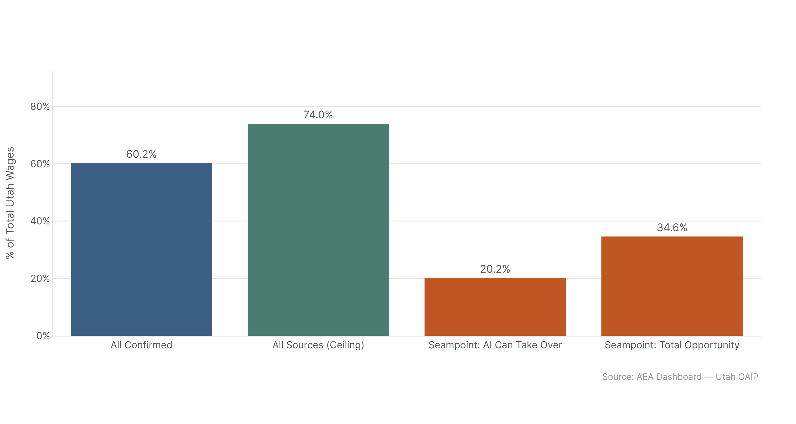

*Config: All Confirmed (primary) + All Ceiling | Method: Freq | Auto-aug ON | Utah (geo="ut") and National*

The dollar comparison is the most concrete way to anchor our numbers to Seampoint's Utah analysis. Seampoint estimates $21B of Utah wages belong to tasks AI can take over and $36B total AI-relevant wages. Our confirmed usage puts $62.6B of Utah wages in scope — higher, because we're measuring all tasks that AI is currently touching rather than only the hours an organization could completely hand off to AI under current governance conditions. The ceiling puts Utah at $77.0B. These numbers are calibrated to the same $104B total Utah wage base Seampoint uses, so the comparison is apples-to-apples on the denominator even if the numerators answer different questions.

*Full detail: [wage_impact_report.md](wage_impact_report.md)*

## Utah Wage Comparison

Our confirmed figure ($62.6B) is roughly 3x Seampoint's takeover estimate ($21B) and about 1.7x the total opportunity estimate ($36B). The gap isn't surprising: Seampoint's $21B represents tasks an organization can reliably automate now without supervision overhead, while our $62.6B includes everything AI is observably touching — augmentation, collaboration, partial task coverage — not just full handoffs. Our ceiling ($77.0B) approaches Seampoint's theoretical ceiling if you include all augmentation pathways.

## Utah as % of Wage Base

As percentages of the $104B Utah wage base: our confirmed = 60.2%, ceiling = 74.0%, Seampoint takeover = 20.2%, Seampoint total = 34.6%. The confirmed rate is notably higher than Seampoint's total, reinforcing that the two frameworks are measuring different things — we see more breadth, they're estimating governance-bounded depth.

## National Totals

Nationally: all_confirmed = $3.99T, all_ceiling = $4.97T. Human_conversation alone = $3.47T. The spread between configs is tighter than you'd expect because the ceiling and confirmed differ mainly at the task boundary, not at the worker level — most workers who are confirmed users also fall in the ceiling.

## Key numbers

| Config | Utah Wages Affected | % of $104B | National |
|--------|--------------------|-----------|---------  |
| All Confirmed | $62.6B | 60.2% | $3.99T |
| All Ceiling | $77.0B | 74.0% | $4.97T |
| Human Conversation | ~$53.7B | ~51.6% | $3.47T |
| Seampoint: Take Over | $21.0B | 20.2% | — |
| Seampoint: Total Opp. | $36.0B | 34.6% | — |

## Config

| Setting | Value |
|---------|-------|
| Primary dataset | `AEI Both + Micro 2026-02-12` (confirmed), `All 2026-02-18` (ceiling) |
| Method | freq (time-weighted) |
| use_auto_aug | True |
| Utah denominator | Seampoint's $104B total Utah annual wages |

## Files

| File | Description |
|------|-------------|
| `figures/utah_wage_comparison.png` | Our confirmed/ceiling vs Seampoint $21B/$36B |
| `figures/utah_pct_comparison.png` | All values as % of $104B Utah wage base |
| `figures/national_wage_totals.png` | National wages_affected, all 5 configs |
| `results/national_wages.csv` | National wages by config |
| `results/utah_wages.csv` | Utah wages by config |
| `results/seampoint_benchmarks.csv` | Seampoint dollar figures |
