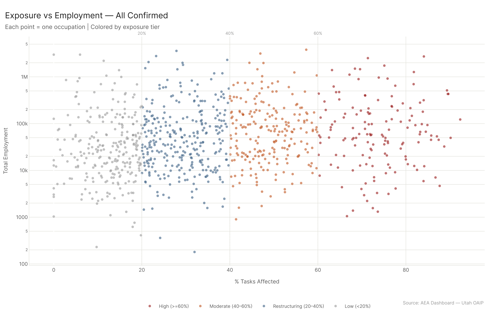
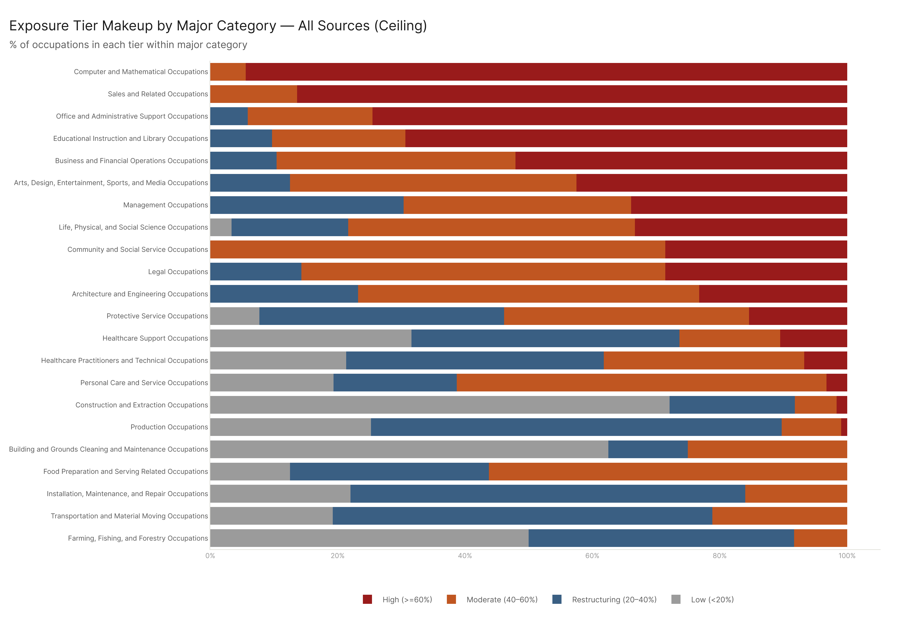
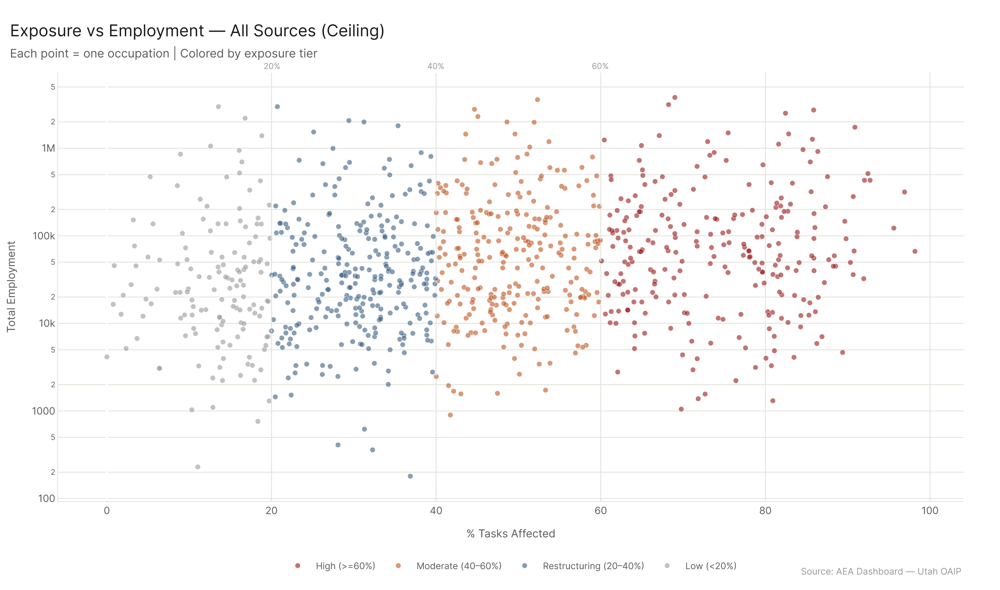
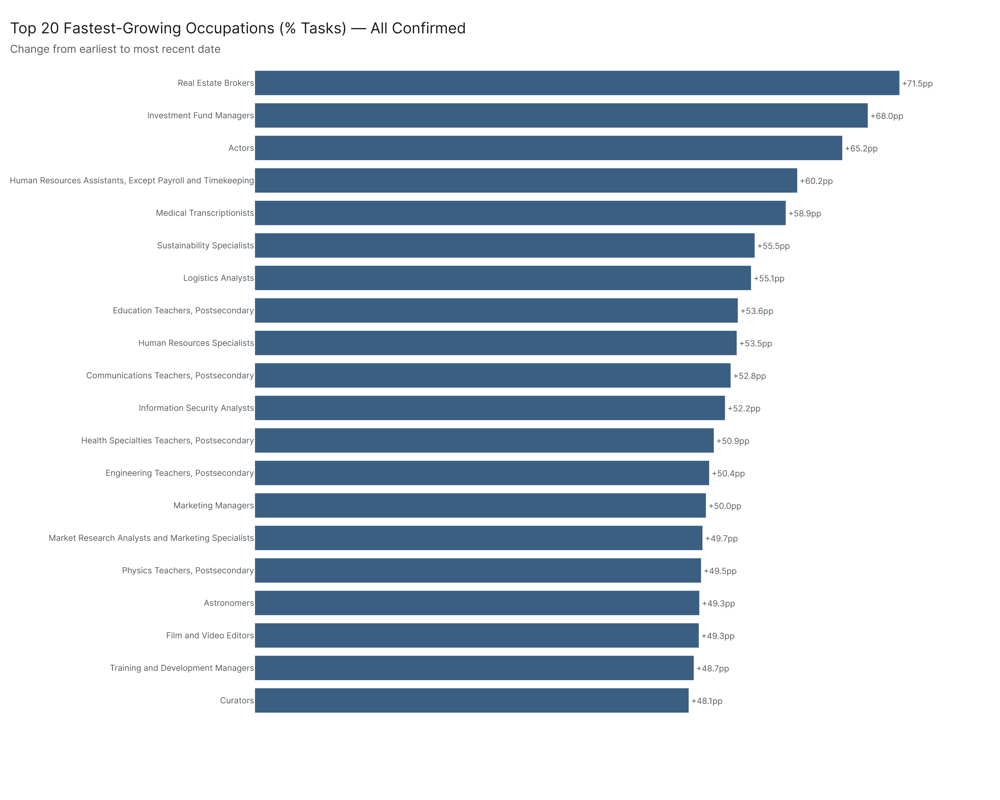
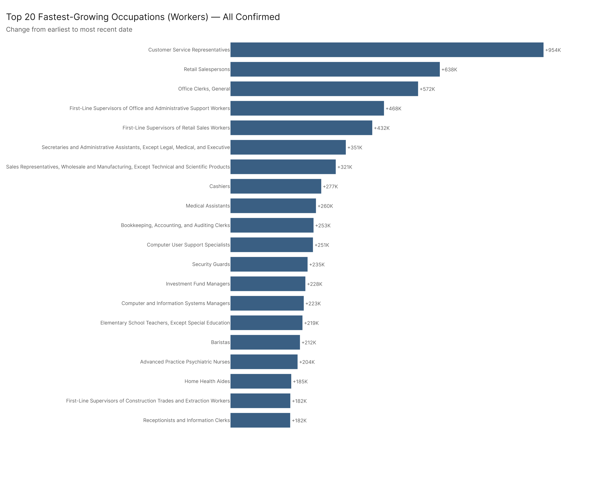
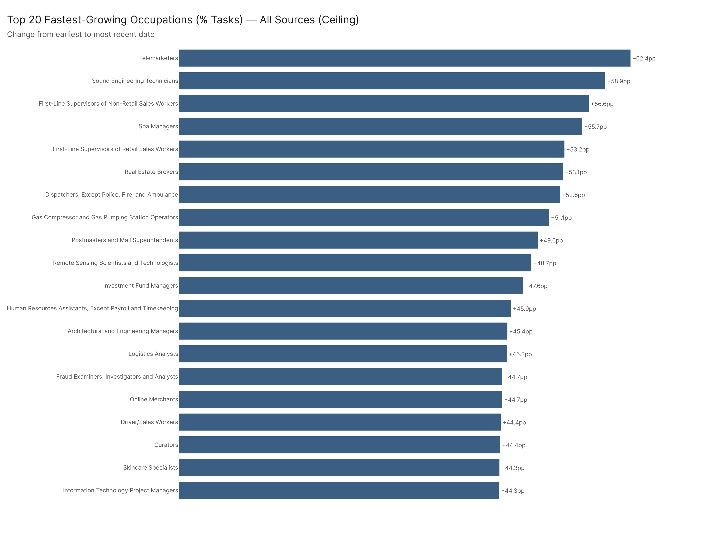
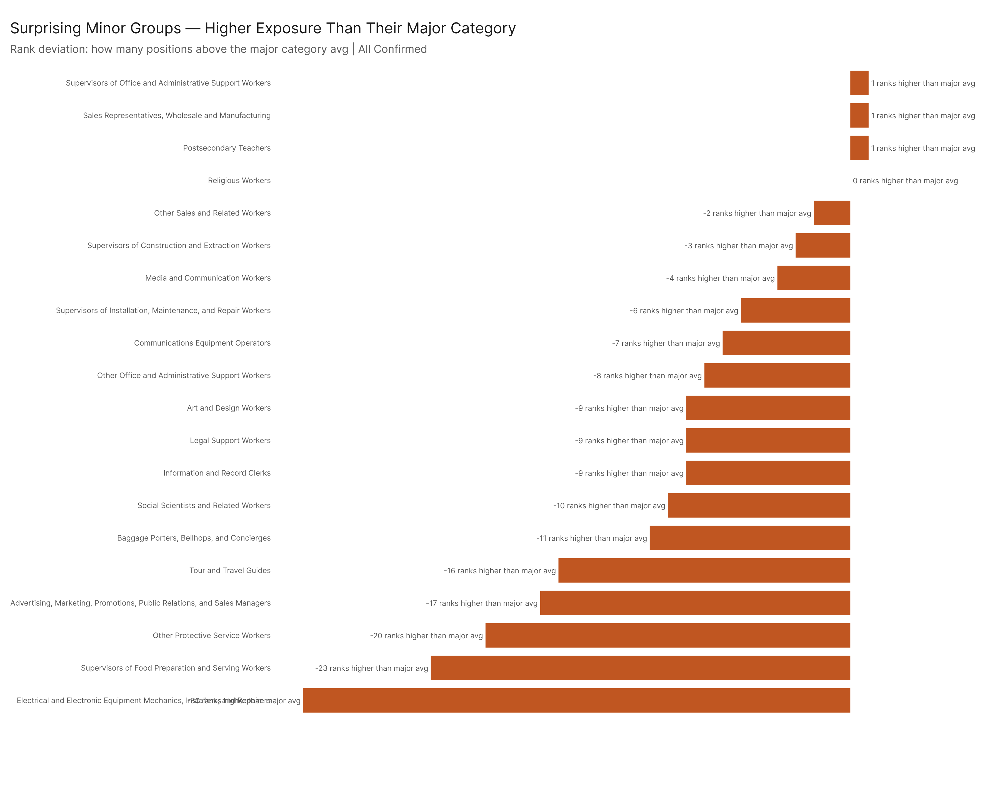
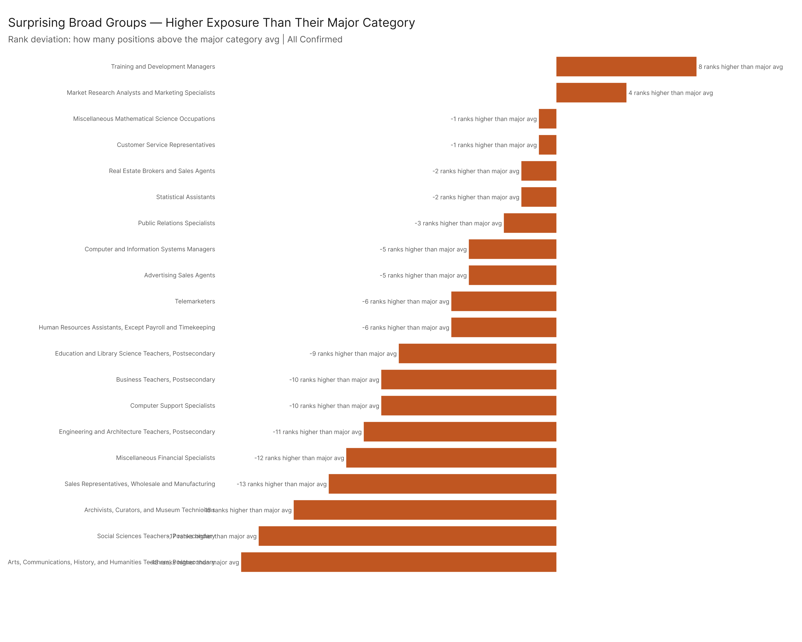
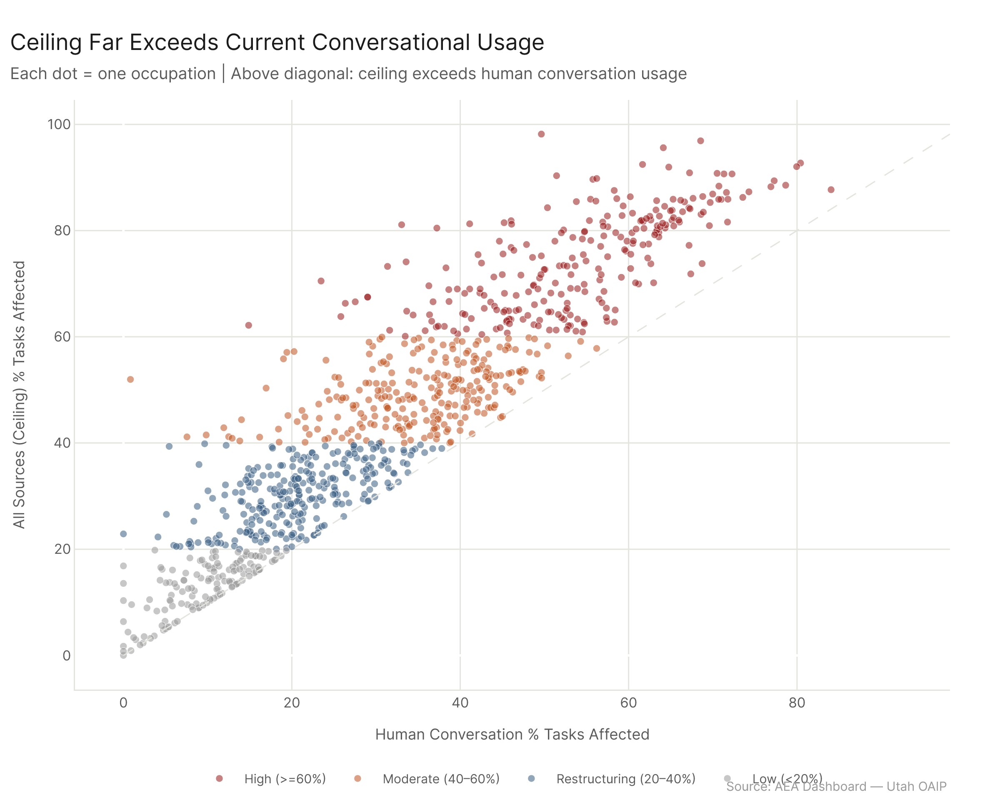

# Exposure State: What AI Is Actually Doing to Work Right Now

*Config: all_confirmed (primary) | Ceiling: all_ceiling (comparison) | Method: freq (time-weighted) | Auto-aug ON | National*

---

Across 923 U.S. occupations, confirmed AI usage already touches a meaningful share of tasks for most of the workforce: 145 occupations (31.4M workers) have 60% or more of their tasks affected by tools people are actually using today. But the ceiling -- what current AI systems can demonstrably do -- puts that number at 249 occupations and 54.2M workers. The gap between those two figures is where the next wave of adoption lives. Exposure is growing almost everywhere: two-thirds of occupations saw positive growth in confirmed task coverage, and the median gain was 5.7 percentage points. The occupations climbing fastest are not the ones that dominate headlines.

---

## The Landscape

Start with confirmed usage. The "all_confirmed" configuration counts only tasks where AI capability has been verified through actual deployment -- conversational tools, API integrations, and Microsoft Copilot-style products. No theoretical capability. No "an AI could probably do this." Just what's happening.

| Tier | Threshold | Occupations | Workers |
|------|-----------|-------------|---------|
| High | >= 60% of tasks | 145 | 31.4M |
| Moderate | 40 -- 59% | 219 | 41.8M |
| Restructuring | 20 -- 39% | 300 | 48.8M |
| Low | < 20% | 259 | 31.3M |

The high tier is smaller than you might expect from media coverage. 145 occupations, 31.4 million workers -- that's roughly 20% of the measured workforce at the point where a supermajority of their tasks are already being done with AI assistance. But the moderate and restructuring tiers together account for 519 occupations and 90.6 million workers. These are jobs where AI isn't optional anymore but also isn't dominant. It's a tool in the workflow, not a replacement for the workflow. That middle band is where most American workers actually sit right now.

The low tier still holds 259 occupations and 31.3 million workers. These are overwhelmingly physical, site-specific, or manual-dexterity jobs -- construction, extraction, material moving, farming. The task structures that define them don't map onto what current AI systems do well.

The scatter plot tells an important story about concentration. High-exposure occupations aren't clustered in small, specialized roles. Office and Administrative Support alone puts 12.4 million workers into the high tier -- nearly 70% of that entire major category's employment. Computer and Mathematical occupations are 62% high-tier by employment. Sales has 32% of its workers in the high tier, but another 55% sit in moderate. These are enormous labor pools.

But there's a floor effect worth noting at the other end. Construction and Extraction has 77% of its occupations in the low tier. Production is 61% low. Transportation and Material Moving is 62% low. The physical economy and the information economy are living in different AI exposure worlds right now, and the gap between them is stark.

---

## Where the Ceiling Diverges

Here's where it gets more interesting. The "all_ceiling" configuration asks a different question: not "what are people using AI for?" but "what could they be using it for, based on demonstrated capability?" This includes every task where any evaluated AI system has shown it can perform at a functional level, whether or not anyone has actually deployed it that way.

| Tier | Confirmed | Ceiling | Gap |
|------|-----------|---------|-----|
| High (>= 60%) | 145 occs / 31.4M workers | 249 occs / 54.2M workers | +104 occs / +22.8M workers |
| Moderate (40-60%) | 219 / 41.8M | 259 / 47.3M | +40 / +5.5M |
| Low (< 20%) | 259 / 31.3M | 140 / 17.9M | -119 / -13.4M |

The high-tier gap is the headline: 104 additional occupations covering 22.8 million more workers could be at 60%+ task exposure if organizations adopted every AI capability that's already been demonstrated to work. That's not a prediction about future AI development -- it's a statement about tools that exist today and aren't being used.

At the other end, the low tier shrinks from 259 occupations to 140 under the ceiling. Nearly half the jobs that look minimally affected under confirmed usage have more AI-applicable tasks than current adoption reveals. The ceiling doesn't eliminate the low tier -- 140 occupations and 17.9 million workers remain below 20% even at full demonstrated capability -- but it compresses it substantially.

The three-layer framing matters here. Layer one: confirmed usage (what AI is doing). Layer two: the ceiling (what AI could do with existing technology). Layer three: actual adoption in specific workplaces -- which we don't have data on, and which almost certainly varies enormously within occupations. A Market Research Analyst at a Fortune 500 firm with an enterprise AI stack is living in a different world than one at a 15-person agency that hasn't updated its tools since 2022. The gap between confirmed and ceiling is the space where organizational decisions, not technological limitations, determine impact.

---

## Trends Over Time

Confirmed task exposure isn't static. Comparing each occupation's earliest and most recent pct_tasks_affected values shows broad upward movement: 612 of 923 occupations have positive growth under the confirmed config, with a median gain of 5.7 percentage points. Total workers affected grew by 21.8 million.

That 612/923 split is less dramatic than the ceiling config's near-universal growth (the previous version of this analysis found 887/923 positive under ceiling). The gap makes sense -- confirmed usage requires actual deployment, and deployment is lumpy. Some occupations got new tool access and jumped; others are still waiting. But two-thirds of occupations showing confirmed growth means the adoption curve is broad, not narrow.

The occupations climbing fastest in percentage terms under confirmed usage span a wide range: finance, healthcare administration, creative industries, logistics. There's no single sector driving the trend. This is consistent with what we'd expect from general-purpose AI tools -- they don't respect industry boundaries.

The workers-affected view tells a different story than the percentage view. Some occupations with modest percentage gains translate to enormous worker impacts because of their employment size. The top climbers by raw worker count tend to be large, mid-skill occupations where AI tools are being adopted across broad workforce populations rather than in specialized niches.

Under the ceiling, the top climbers are even more dramatic -- but the gap between confirmed and ceiling climbers reveals which occupations have the most unrealized adoption potential. If an occupation is climbing fast under confirmed and even faster under ceiling, the deployment gap for that role is widening even as actual usage grows. The technology is outrunning the adoption.

---

## Surprises in the Hierarchy

Occupation taxonomies have a nested structure: detailed occupations roll up to broad groups, broad groups to minor groups, minor groups to major categories. Most of the time, a detailed occupation's exposure score stays close to its parent group's average. The interesting cases are where it doesn't.

### Minor Group Outliers

Two minor groups stand out for dramatically exceeding their major category averages:

**Supervisors of Construction and Extraction Workers** come in at 47.2% average exposure -- in a major category (Construction and Extraction) that averages 14.4%. That's a 33-point deviation. The explanation is structural: construction supervisors spend most of their time on planning, scheduling, documentation, compliance tracking, and coordination. The actual building happens below them in the hierarchy. Their task profile looks more like a mid-level office manager's than a construction worker's, and AI tools map onto it accordingly. This is a case where the occupational category misleads about the actual work.

**Supervisors of Installation, Maintenance, and Repair Workers** show a similar pattern: 48.7% against a major average of 24.6%. Same logic -- the supervisory layer of physical-work occupations has an information-intensive task structure that the category name obscures.

**Religious Workers** at 66.2% in a Community and Social Service category averaging 46.0% are genuinely surprising. The 20-point deviation reflects the high share of sermon preparation, counseling documentation, educational content creation, administrative coordination, and communication tasks in religious work. The spiritual and interpersonal core of the job remains untouched by AI, but the operational infrastructure around it is heavily affected. Religious workers are, in task-structure terms, closer to educators and content creators than to the social workers and counselors that populate the rest of their major category.

### Broad Group Outliers

At the broad occupation level, where you can identify specific jobs rather than groups, the deviations get sharper:

**Training and Development Managers** hit 85.7% in a Management major that averages 36.3%. That's a 49-point gap -- the largest deviation I found. The reason is that training and development work is almost entirely information-based: designing curricula, writing materials, tracking program effectiveness, communicating with stakeholders. "Manager" in this context means "person who creates and organizes knowledge products," not "person who supervises physical operations." AI tools for content generation, assessment design, and data analysis cover the vast majority of the task inventory.

**Computer and Information Systems Managers** at 77.6% (vs. 36.3% major average) are less surprising but still notable. They sit at the intersection of technical knowledge and organizational coordination -- both heavily AI-applicable domains.

**Market Research Analysts** at 89.6% against a Business/Financial major average of 51.7% represent the purest case of AI task overlap in the dataset. Data collection, survey design, trend analysis, report generation, competitive intelligence -- every core function of the role maps onto demonstrated AI capability. The 38-point deviation from their major category reflects the fact that most Business/Financial occupations involve relational, judgmental, or regulatory tasks that AI handles less well. Market Research Analysts are the exception: their work is almost entirely analytical and communicative.

**Pharmacists** at 64.9% in a Healthcare Practitioners major averaging 29.7% are the healthcare surprise. Most healthcare practitioner occupations are anchored in physical examination, hands-on treatment, or clinical judgment that requires embodied presence. Pharmacists are different. Drug interaction checking, dosing calculations, patient education documentation, insurance processing, inventory management -- these are information tasks wearing a healthcare costume. The 35-point deviation from their category average captures this structural difference.

**Public Relations Specialists** at 83.2% (vs. 48.0% for Arts/Design/Entertainment/Sports/Media) round out the set. PR work -- writing press releases, drafting talking points, monitoring media coverage, managing social channels, creating campaign materials -- is essentially professional communication, and professional communication is exactly where current AI tools are strongest.

The common thread across all these outliers: they're occupations whose actual task content diverges sharply from what their category label implies. The taxonomy groups them by industry or domain; the AI exposure analysis reveals them by what people actually do all day. When those two framings disagree, the outliers emerge.

---

## Config Comparison

Five analysis configurations provide different lenses on the same occupation data. They're ordered here from most conservative to most inclusive:

| Configuration | High-Tier Occs | High-Tier Workers | What It Counts |
|---------------|---------------|-------------------|----------------|
| Human Conversation | 81 | 17.5M | Tasks confirmed through direct human use of conversational AI |
| All Confirmed | 145 | 31.4M | Conv + API + Microsoft confirmed usage |
| Agentic Confirmed | 36 | 6.0M | Confirmed agentic tool-use (AEI API only) |
| Agentic Ceiling | 156 | 40.3M | Demonstrated agentic capability (MCP + AEI API) |
| All Ceiling | 249 | 54.2M | Full demonstrated capability across all source types |

Three patterns stand out.

**The conversation-to-confirmed jump is large.** Going from human_conversation (81 high-tier occupations, 17.5M workers) to all_confirmed (145 occupations, 31.4M) nearly doubles the high tier. This means that API integrations and Microsoft Copilot-style tools are reaching a substantial number of occupations that pure conversational AI doesn't. The additional 64 occupations and 13.9 million workers represent the deployment footprint of enterprise AI tools beyond chatbots.

**Confirmed agentic (AEI API only) is narrower than all_confirmed.** With only 36 high-tier occupations covering 6.0M workers, confirmed agentic tool-use is currently more specialized than the full all_confirmed picture. AEI API data captures production deployments of agentic systems — code execution, API orchestration, complex automation pipelines — which are concentrated in higher-complexity technical occupations rather than broadly distributed across the information economy. This isn't a capability ceiling; it's a deployment pattern.

**The agentic ceiling (156 high-tier occupations, 40.3M workers) tells a different story.** Adding MCP server capability data pushes the agentic high-tier well above all_confirmed. The 120-occupation gap between agentic ceiling and agentic confirmed is the largest confirmed/ceiling gap in the table — meaning agentic AI has demonstrated capability across a much wider set of occupations than current confirmed API usage reflects. That gap is organizational adoption lag, not technical limitation.

**The overall ceiling gap is concentrated, not uniform.** The jump from all_confirmed (145 high) to all_ceiling (249 high) adds 104 occupations and 22.8 million workers. But those 104 occupations aren't evenly distributed across the economy. They're concentrated in mid-skill information work -- roles where AI capability has been demonstrated but organizational adoption hasn't caught up. This is the adoption frontier: not a technology problem, but a deployment problem. The tools exist. The question is when, and how fast, organizations will use them.

---

## Config

Primary: `all_confirmed` (All Confirmed -- conv + API + Microsoft, no MCP). Ceiling comparison: `all_ceiling`. All five configs shown in config comparison section. Method: freq (time-weighted), auto-aug ON, national.

## Files

| File | Description |
|------|-------------|
| `results/all_occupations_exposure.csv` | All 923 occs with pct across all five configs |
| `results/tier_by_config.csv` | Tier counts and employment per config |
| `results/major_tier_rollup.csv` | Tier distribution within each major category |
| `results/pct_trend_by_config.csv` | First-to-last pct growth per occ per config |
| `results/minor_deviations.csv` | Minor group deviations from major averages |
| `results/broad_deviations.csv` | Broad group deviations from major averages |
