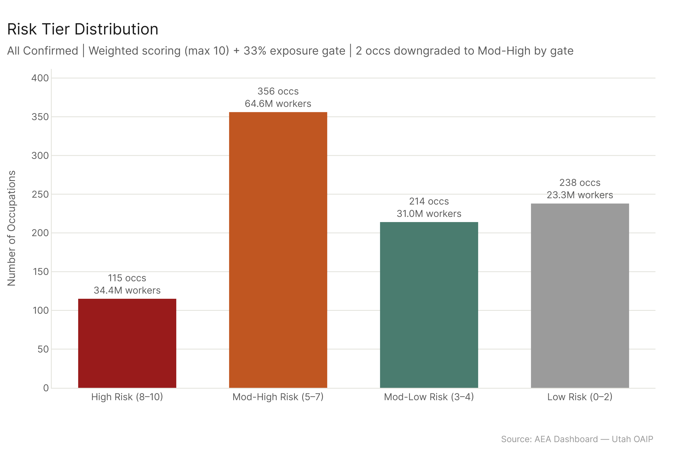
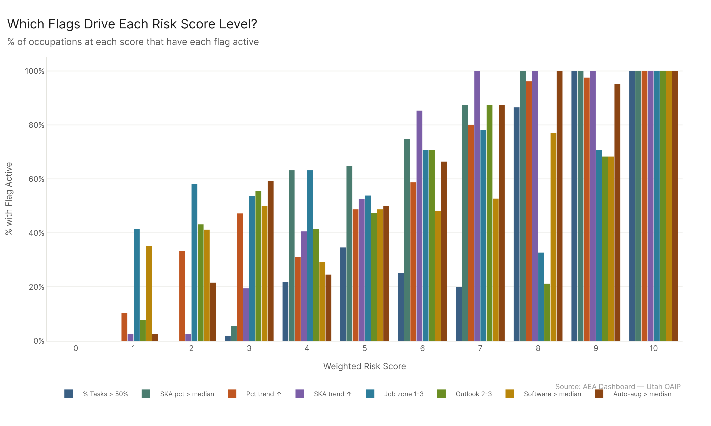
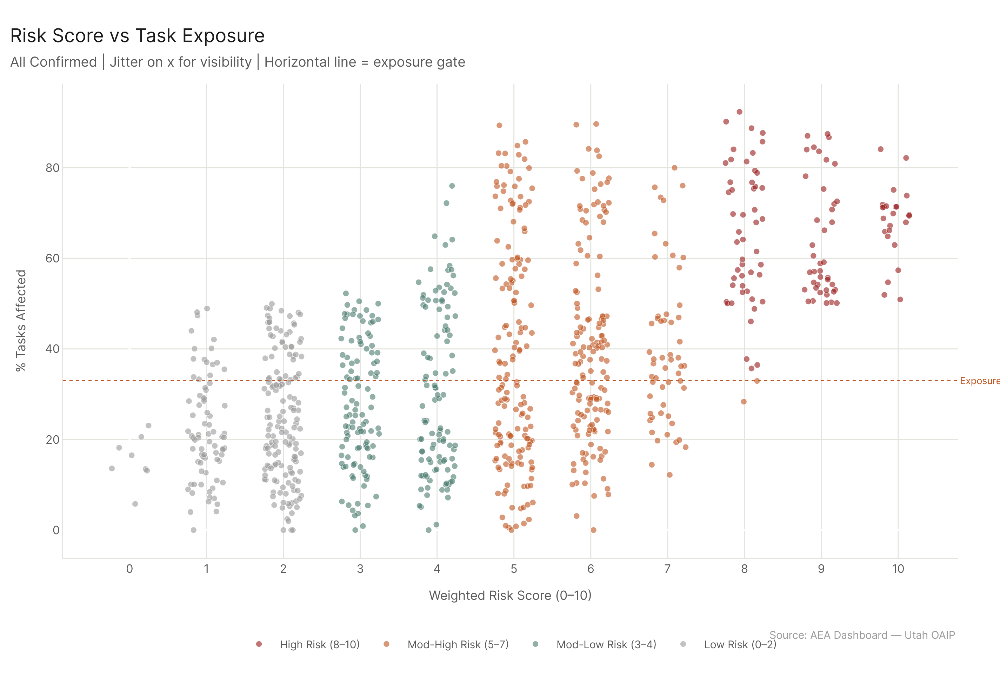
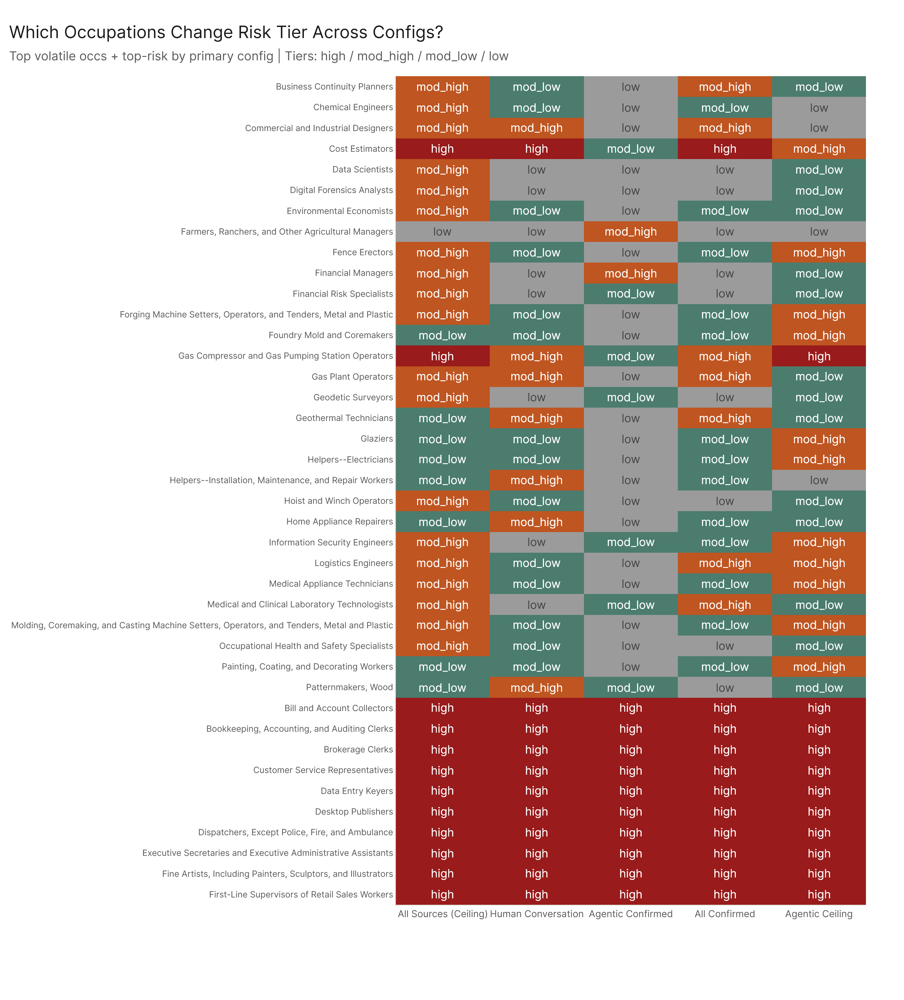

# Job Risk Scoring: Which Jobs Are Most at Risk?

*Config: all_confirmed (primary) | all_ceiling (comparison) | 8-flag weighted scoring, max 10 | 4 tiers | Exposure gate at 33%*

---

An eight-flag weighted scoring system separates 923 occupations into four risk tiers. 115 occupations employing 34.4 million workers land in the high tier (scores 8--10), where both deep AI exposure and structural vulnerability converge. The two moderate tiers split what was previously a single catch-all category: mod-high (356 occupations, 64.6M workers) captures jobs where exposure or structural signals are substantial but not yet overwhelming, while mod-low (214 occupations, 31.0M workers) captures jobs with early signals that haven't compounded. This four-tier structure resolves the biggest interpretive problem from the old three-tier model -- a score-3 occupation and a score-7 occupation are now properly separated instead of wearing the same "moderate" label.

---

## How the Scoring Works

Eight binary flags across three categories. Flags 1--2 measure exposure depth: is AI covering more than half the job's tasks, and does AI's demonstrated capability exceed what the job requires on skills/abilities/knowledge? These carry double weight (2x each) because they represent the core "AI is actually reaching this job" signal. Flags 3--4 measure exposure velocity: are task coverage and capability both trending upward? These carry standard weight (1x each) -- still signal, but noisier over the current 15-month measurement window. Flag 8 measures auto-augmentability depth: are the job's exposed tasks rated as highly automatable? Flags 5--7 measure structural vulnerability: low preparation barrier, below-average labor market outlook, and commoditized software tooling (all 1x).

| Flag | What it measures | Weight |
|------|------------------|--------|
| 1. pct_tasks_affected > 50% | More than half the job's tasks are AI-affected (absolute threshold) | 2x |
| 2. SKA overall_pct > median | AI capability exceeds the job's skill requirements (ratio-of-sums) | 2x |
| 3. pct trend positive + above-median growth | Task exposure is accelerating | 1x |
| 4. SKA pct trend positive + above-median growth | Skill coverage is accelerating | 1x |
| 5. job_zone in {1, 2, 3} | Low-to-moderate preparation barrier | 1x |
| 6. outlook in {2, 3} | Below-average labor market outlook | 1x |
| 7. n_software > median | Commoditized tooling | 1x |
| 8. auto_avg_with_vals > median | Tasks are highly automatable | 1x |

The depth flags carry double weight because they measure whether AI has actually reached this job -- not whether it might, or whether the trend suggests it could. Maximum possible score: 10 (two depth flags at 2x = 4, plus six flags at 1x = 6).

Key change from the previous version: flag 1 now uses an absolute 50% threshold rather than the population median. The old median (~33%) was nearly identical to the exposure gate, making flag 1 redundant with the gate itself. The 50% threshold means flag 1 now captures a genuinely different signal: "more than half the job is exposed," not just "above average."

Flag 2 uses `overall_pct` from the updated SKA formula: sum(AI capability scores) / sum(occupation requirement scores) x 100, across all skills, abilities, and knowledge elements with importance >= 3. Values above 100% mean AI's demonstrated frontier exceeds what the job needs. The median overall_pct sits around 88%, so roughly half of occupations have AI covering less than 88% of their skill requirement.

One guard rail: the **exposure gate**. Any occupation scoring 8+ but with less than 33% of tasks affected gets downgraded from high to mod-high. 2 occupations triggered this gate (Sound Engineering Technicians and Food Service Managers).

**Tiers:** 8--10 = High, 5--7 = Mod-High, 3--4 = Mod-Low, 0--2 = Low.

---

## The Distribution

| Tier | Occupations | Total Employment | Avg % Tasks Affected | Avg Risk Score | Workers Affected | Wages Affected |
|------|-------------|------------------|----------------------|----------------|------------------|----------------|
| **High (8--10)** | 115 | 34.4M | 65.4% | 8.77 | 22.9M | $1.23T |
| **Mod-High (5--7)** | 356 | 64.6M | 39.4% | 5.73 | 24.5M | $1.57T |
| **Mod-Low (3--4)** | 214 | 31.0M | 29.0% | 3.50 | 8.3M | $719B |
| **Low (0--2)** | 238 | 23.3M | 23.5% | 1.61 | 5.5M | $475B |

The high-risk tier is more concentrated and more conservative than the old version: 115 occupations (down from 195 in the three-tier model) with an average task exposure of 65.4%. These are jobs where AI has crossed the 50% task threshold, the skill profile AI can cover exceeds what the job needs, and multiple other signals converge. The tighter criteria mean "high risk" now requires the core exposure signal to be present, not just structural vulnerability.

The mod-high tier is the largest at 356 occupations and 64.6M workers. These are jobs with genuine exposure or structural signals -- but not the full convergence of the high tier. The mod-high tier's workers-affected count (24.5M) is comparable to the high tier's (22.9M) because this tier contains many large-employment occupations with moderate-but-real AI overlap.

The mod-low tier (214 occupations, 31.0M workers) is the early-signal zone. Score 3 occupations typically trigger one structural flag plus one trend or auto-aug flag. Score 4 occupations often have moderate SKA coverage or one depth flag with a structural flag. These jobs have some signals but nothing compounding yet.

The low tier (238 occupations, 23.3M workers) has minimal overlap with AI on any measured dimension.

---

## What Drives Each Score Level

The flag breakdown chart shows, for each score from 0 to 10, what percentage of occupations at that score have each flag active.

**Score 0 (8 occupations, avg pct 15.5%):** No flags triggered. Anesthesiologists, Emergency Medicine Physicians, Pediatric Surgeons -- high job zone, strong outlook, minimal AI task overlap, skill requirements AI doesn't meet.

**Scores 1--2 (Low tier):** Flags appear sparsely. Score 1 (77 occupations) might mean a single structural flag or one trend flag. Score 2 (153 occupations) typically shows two non-exposure flags -- often job zone + outlook, or job zone + n_software. The depth flags (1 and 2) are almost never triggered.

**Score 3 (108 occupations, avg pct 27.5%):** The entry point of mod-low. Structural flags dominate -- 54% trigger job zone, 56% trigger outlook. But flag 8 (auto-aug) starts appearing at 59%, and trend flags at 47%. Depth flags remain rare (2% for flag 1, 6% for flag 2). These are jobs where the trend and auto-aug signals are showing up before the depth signal arrives.

**Score 4 (106 occupations, avg pct 30.4%):** The top of mod-low. Flag 2 (SKA pct > median) jumps to 63% -- occupations are starting to show AI capability alignment. Flag 1 (pct > 50%) is at 22%, still uncommon. The mix of structural + early exposure signals is what separates mod-low from low: these jobs have some AI relevance, but it hasn't crossed the depth threshold.

**Score 5 (156 occupations, avg pct 38.5%):** Entry into mod-high. Exposure and structural flags are roughly balanced. Flag 1 at 35%, flag 2 at 65%, trend flags around 50%. Investment Fund Managers sit here at 89.3% task exposure -- extremely high coverage, but job zone 5 and strong outlook zero out the structural flags. The mod-high tier catches this: highly exposed but structurally protected.

**Score 6 (143 occupations, avg pct 40.2%):** SKA flag at 75%, trend flags at 59--85%, structural flags at 71%. Auto-aug at 66%. The signals are converging.

**Score 7 (55 occupations, avg pct 40.0%):** The top of mod-high. Flag 2 at 87%, flag 4 (SKA trend) at 100%, structural flags at 78--87%. Flag 1 at 20% -- task exposure hasn't crossed 50% for most, keeping them out of high. These occupations have deep trend and capability signals but haven't hit the task coverage threshold.

**Score 8 (52 occupations, avg pct 64.2%):** Entry into high. Flag 1 at 87%, flag 2 at 100%, both trend flags near-universal, auto-aug at 100%. Flag 5 (job zone) at 33% and flag 6 (outlook) at 21% -- many score-8 occupations are in higher job zones with decent outlooks, but the depth and velocity signals are so strong they cross into high anyway. Business Intelligence Analysts (92.3% pct), Real Estate Brokers (90.2%), Technical Writers (85.8%).

**Score 9 (41 occupations, avg pct 63.7%):** All exposure flags universally active. Structural flags at 68--71%. Nearly full convergence.

**Score 10 (24 occupations, avg pct 68.0%):** Every flag active. Customer Service Representatives (84.1% pct, 2.7M workers). Secretaries and Administrative Assistants (75.1% pct, 1.7M workers). Receptionists and Information Clerks (73.8%, 1.0M workers). Bill and Account Collectors (71.8%). These occupations combine deep AI task coverage, a skill profile AI already exceeds, accelerating trends, high auto-augmentability, low preparation barriers, poor labor market outlook, and heavy commoditized tooling.

**The structural insight from four tiers:** the old "moderate" tier lumped score-3 and score-7 occupations together. Now they're properly separated. A mod-low score-3 occupation has early structural signals but no depth -- it needs monitoring. A mod-high score-7 occupation has deep capability alignment and accelerating trends -- it needs active workforce transition planning. The four-tier structure makes this distinction visible.

---

## Cross-Config Robustness

The scoring framework runs identically across all five analysis configurations. 306 occupations change tier in at least one config. With four tiers, this is expected -- the boundaries are more numerous, so tier transitions near thresholds are more common.

149 occupations make jumps of 3+ tiers (e.g., low to high or mod-low to high across different configs). These are occupations where the AI measurement source matters enormously:

- **Writers and Authors:** mod-low under Human Conversation and All Confirmed, high under Agentic Confirmed and Agentic Ceiling. The agentic AI sources see substantial task overlap that conversational data doesn't capture.

- **Technical Writers:** high under Human Conversation and Agentic Confirmed, mod-high under All Ceiling and Agentic Ceiling. Different AI modalities produce different assessments.

- **Telemarketers:** high under most configs, mod-high under Human Conversation. Consistently high-exposure with minor config sensitivity.

Occupations that stay in the same tier across all five configs are the most robust findings. Those that swing 3+ tiers are telling you about measurement limits, not job fundamentals.

---

## What "High Risk" Actually Means

Score 8--10 says: AI can do more than half this job's tasks, AI's demonstrated skill coverage exceeds the occupation's requirement, both trends are accelerating, and the auto-augmentability of the exposed tasks is high. Most high-risk occupations also have structural vulnerabilities (low job zone, poor outlook, commoditized tools), but the tier assignment is driven primarily by the depth and velocity of AI exposure.

The tighter criteria (115 occupations vs. the old 195) mean the high-risk label now carries more weight. Every occupation in this tier has cleared the 50% task threshold and the SKA capability threshold. The mod-high tier absorbs the occupations that the old system would have called "high risk" based on structural signals alone -- jobs where AI is relevant but hasn't crossed the depth floor.

The exposure gate remains essential. Without it, Sound Engineering Technicians (28.4% pct) and Food Service Managers (32.9% pct) would be labeled high risk despite AI touching less than a third of their tasks. The gate ensures face validity.

---

## Config

**Primary:** All Confirmed (all_confirmed). Confirmed AI capabilities across all source types.

**Comparison:** All Sources Ceiling (all_ceiling) as the upper bound.

**Two-layer framing:** Exposure depth (flags 1--2, weighted 2x) vs. exposure velocity (flags 3--4, 1x) vs. auto-aug depth (flag 8, 1x) vs. structural vulnerability (flags 5--7, 1x). The composite score integrates all three dimensions.

**Scoring:** Flags 1--2 weighted 2x each (max 4), flags 3--8 weighted 1x each (max 6), total max 10. Exposure gate at 33% pct_tasks_affected prevents structural-only high-risk assignments. Tiers: 8--10 High, 5--7 Mod-High, 3--4 Mod-Low, 0--2 Low.

**Trend:** Computed as last minus first date across the full time series for each config. Cross-config comparison uses all five configs.

**Method:** freq, auto-aug ON, national scope.

## Files

| File | Description |
|------|-------------|
| `results/risk_scores_primary.csv` | All 923 occs: 8 flags, risk_score, risk_tier (all_confirmed) |
| `results/risk_scores_all_configs.csv` | Risk scores for all five configs |
| `results/risk_tier_summary.csv` | Tier counts, employment, wages |
| `results/flags_breakdown.csv` | How often each flag is triggered |
| `results/cross_config_tier_shifts.csv` | Occupations that change tier across configs |
| `results/pivot_distance_inputs.csv` | Top/bottom 10 occs per zone (input for pivot_distance) |
