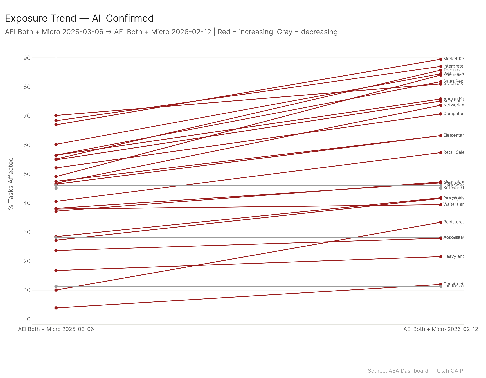
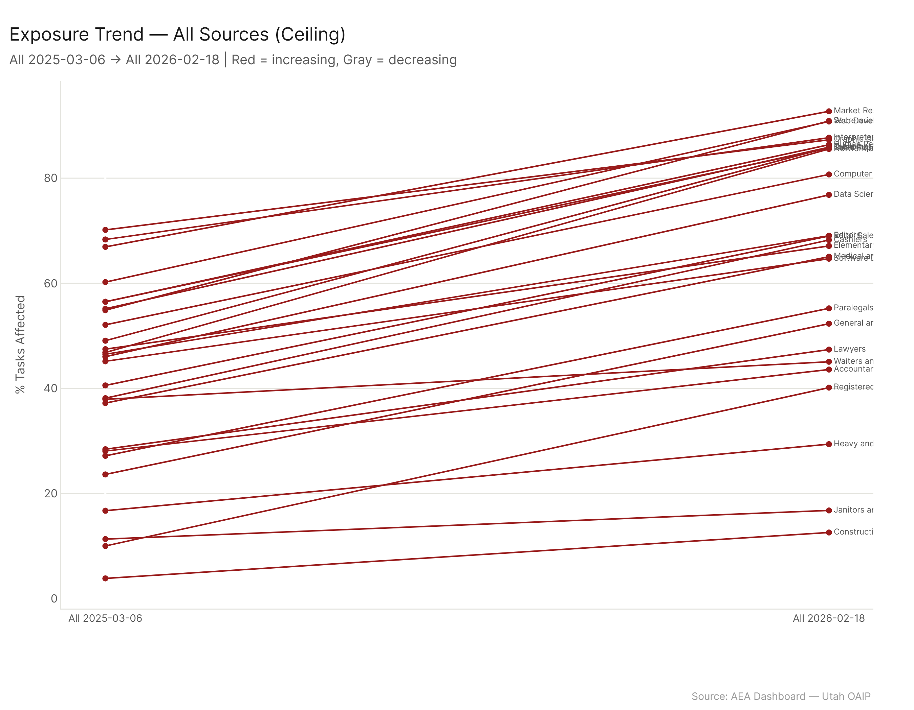

# Occupations of Interest: 27 Jobs That Tell the AI Exposure Story

Market Research Analysts top the exposure list at 89.5% confirmed, but the new weighted risk scoring drops them to mod-high risk (score 7) -- properly separating "this job is changing" from "this job is at risk." The real high-risk population is everyday jobs: Secretaries (score 10, 1.7M workers), Customer Service Reps (score 10, 2.7M workers), Retail Salespersons (score 10), Cashiers (score 10). Software Developers sit at 45.2% confirmed with a mod-high score of 5, and their ceiling gap (+19.5pp) is one of the largest in the list. The biggest single ceiling gap belongs to General/Ops Managers at +24.4pp -- a signal that their exposure floor has a lot of room to rise. Construction Laborers at 12.0% remain the physical-work safe harbor.

---

## The Ranking

27 of 29 named occupations matched the dataset. Data Scientists and Accountants were added to the match list (29 originally excluded Physicians All Other and Financial Analysts). The exposure spectrum spans 77.5 percentage points between the most and least exposed occupations -- nearly the full range of what's possible.

Primary config is `all_confirmed`. Ceiling is `all_ceiling` for comparison. The gap between the two tells you how much room each occupation's exposure has to grow.

| Rank | Occupation | Confirmed | Ceiling | Delta |
|------|-----------|-----------|---------|-------|
| 1 | Market Research Analysts | 89.5% | 92.7% | +3.2pp |
| 2 | Interpreters/Translators | 87.1% | 87.7% | +0.6pp |
| 3 | Technical Writers | 85.8% | 85.9% | +0.1pp |
| 4 | Web Developers | 84.5% | 90.8% | +6.3pp |
| 5 | Customer Service Reps | 84.1% | 85.9% | +1.8pp |
| 6 | Sales Reps (Wholesale) | 81.8% | 85.7% | +3.9pp |
| 7 | Graphic Designers | 81.0% | 87.3% | +6.3pp |
| 8 | HR Specialists | 75.8% | 86.4% | +10.6pp |
| 9 | Secretaries/Admin Assistants | 75.1% | 90.9% | +15.8pp |
| 10 | Network/Computer Admins | 73.7% | 85.5% | +11.8pp |
| 11 | Computer Systems Analysts | 70.7% | 80.7% | +10.0pp |
| 12 | Elementary Teachers | 63.2% | 67.1% | +3.9pp |
| 13 | Editors | 63.2% | 69.0% | +5.8pp |
| 14 | Retail Salespersons | 57.4% | 69.0% | +11.6pp |
| 15 | Medical/Health Managers | 47.3% | 65.1% | +17.8pp |
| 16 | Cashiers | 46.9% | 68.2% | +21.3pp |
| 17 | Data Scientists | 46.0% | -- | -- |
| 18 | Software Developers | 45.2% | 64.7% | +19.5pp |
| 19 | Paralegals | 41.6% | 55.2% | +13.6pp |
| 20 | Lawyers | 41.8% | 47.4% | +5.6pp |
| 21 | Waiters/Waitresses | 39.4% | 45.1% | +5.7pp |
| 22 | Registered Nurses | 33.4% | 40.2% | +6.8pp |
| 23 | General/Ops Managers | 27.9% | 52.3% | +24.4pp |
| 24 | Truck Drivers | 21.5% | 29.4% | +7.9pp |
| 25 | Construction Laborers | 12.0% | 12.6% | +0.6pp |
| 26 | Janitors | 11.3% | 16.8% | +5.5pp |

The ceiling delta column is the most underappreciated number in this table. Technical Writers have a 0.1pp gap -- their confirmed exposure has basically caught up to the ceiling. AI is already doing everything it plausibly could in that role. Cashiers have a 21.3pp gap, meaning confirmed adoption has only captured about two-thirds of what's technically possible. General/Ops Managers have the largest gap at 24.4pp: their current 27.9% looks moderate, but the ceiling says the floor could nearly double.

Software Developers at +19.5pp are in a similar position. The confirmed 45.2% understates what AI could reach in software development tasks. The gap represents capabilities that exist but haven't been widely adopted yet -- probably the code review, architecture documentation, and testing tasks where AI tools are improving rapidly but organizational adoption lags.

## Risk Assessment

The new weighted risk scoring replaces the binary flag system. Scores range from 0-10 based on 8 flags with weighted factors: AI capability exceeding skill requirements (as percentage of occupation need), adoption trend direction, job zone (lower = more vulnerable), labor market outlook, exposure level, and hidden-at-risk status. The weighting means these factors aren't treated as equal -- job zone and outlook carry more weight than raw exposure.

**High Risk (score 8-10):**

| Occupation | Score | Key Drivers |
|-----------|-------|-------------|
| Secretaries | 10 | Zone 3, high exposure, poor outlook |
| Customer Service Reps | 10 | Zone 2, high exposure, poor outlook |
| Retail Salespersons | 10 | Zone 2, moderate exposure, poor outlook |
| Cashiers | 10 | Zone 2, rising trend, massive ceiling gap |
| Web Developers | 10 | High exposure, rising trend |
| Interpreters | 10 | High exposure, rising trend |
| Graphic Designers | 9 | High exposure, rising trend |
| Paralegals | 9 | Rising trend, moderate zone |
| Editors | 8 | Moderate exposure, rising trend |
| Waiters/Waitresses | 8 | Zone 2, poor outlook |

**Mod-High (score 5-7):**

Market Research Analysts (7), Technical Writers (7), HR Specialists (7), Elementary Teachers (7), Sales Reps (7), Medical/Health Managers (7), Lawyers (7), Computer Systems Analysts (6), Network Admins (5), Software Developers (5), General/Ops Managers (5)

**Mod-Low (score 3-4):**

Accountants (3), Data Scientists (3)

**Low Risk (score 0-2):**

Truck Drivers (2)

**Hidden at-risk flagged:** General/Ops Managers and Accountants. Both have low confirmed exposure but profile characteristics that align with AI's capability direction. General/Ops Managers are the more concerning case -- their 24.4pp ceiling gap says the capabilities are there, adoption just hasn't hit yet.

## Three Groups, Three Stories

### The Workforce Volume Story

Secretaries and Customer Service Reps both score 10 -- the highest risk scores in the set. Between them, they employ about 4.4 million workers. These are not the occupations that dominate AI media coverage. Nobody writes breathless articles about administrative assistants being disrupted. But the numbers are unambiguous: Secretaries at 75.1% confirmed exposure with a 15.8pp ceiling gap, Customer Service Reps at 84.1% confirmed. Both in low-to-mid job zones. Both with poor labor market outlook.

Registered Nurses are the "next wave" signal. At 33.4% confirmed, they look safe. The risk score is mod-high. But the hidden-at-risk flag should make healthcare workforce planners uncomfortable. The confirmed-to-ceiling gap is 6.8pp, which is modest, but the occupation's skill profile projects heavily onto AI's capability direction. Documentation, care coordination, patient education, treatment protocol management -- these are tasks where AI deployment is accelerating. Nursing is not at risk today. The question is how long "today" lasts.

Cashiers at 46.9% confirmed but 68.2% ceiling (a 21.3pp gap!) are the sleeper. Their confirmed exposure looks middling, but the ceiling says AI can already handle significantly more of the job than current adoption reflects. Self-checkout, AI-powered point-of-sale systems, automated inventory queries -- the technology exists, deployment is the constraint, and deployment constraints erode.

### The AI-Controversial Group

Market Research Analysts at 89.5% confirmed exposure but score 7 (mod-high risk). This is the new scoring system working exactly as designed. Nearly every task in the role -- data collection, survey design, trend analysis, report writing -- falls within AI's demonstrated capability. But Zone 4 classification (typically requiring a bachelor's degree and analytical training) and reasonable labor market outlook provide structural protection. The job will transform. The workers will adapt within their roles rather than being displaced from them. "High exposure, mod-high risk" is the right call, and it's a distinction the old binary system couldn't make.

Software Developers at 45.2% confirmed, score 5, with that 19.5pp ceiling gap. The gap is the story here. AI code generation, testing, review, and documentation tools exist and are improving fast. Confirmed adoption at 45.2% represents the state of play circa the analysis date. The ceiling at 64.7% represents what's already technically possible. The trajectory is clear, but job zone 4 and strong demand keep the risk mod-high. Software developers aren't being displaced -- they're being augmented, and the ones who lean into AI tooling will be more productive than those who don't.

Data Scientists at 46.0% confirmed, score 3 (mod-low). Similar logic to Market Research but with even stronger structural protection -- high job zone, strong demand, and the core of the role (framing the right question, designing the analysis, interpreting results for stakeholders) remains firmly human.

### The Utah Story

Construction Laborers at 12.0% are the physical-work safe harbor. The ceiling is 12.6% -- a 0.6pp gap, meaning AI has essentially zero unrealized capability in this task space. Physical dexterity, environmental adaptation, and site-specific judgment are the moat, and it is wide.

Sales Reps (Wholesale/Manufacturing) at 81.8% confirmed are the surprise for anyone who thinks of sales as a relationship-driven, AI-resistant profession. The task inventory tells a different story: product research, customer profiling, proposal generation, pricing analysis, CRM management -- these are all tasks AI tools handle well. The score of 7 (mod-high) reflects that the relationship and judgment layers provide protection, but the exposure is real.

Medical/Health Services Managers at 47.3% confirmed but 65.1% ceiling (+17.8pp gap). For Utah's growing healthcare sector, this is the administrative-side AI story. Scheduling optimization, compliance documentation, resource allocation modeling, reporting -- all high-AI-capability tasks. The role won't disappear, but the ratio of managers to managed systems will shift.

## Trends

The confirmed trends show the steepest climbers are the occupations whose task inventories map onto recently expanded AI capabilities: content generation (Editors, Technical Writers), code production (Web Developers, Software Developers), and data synthesis (Market Research Analysts). The flattest trajectories belong to Construction Laborers, Janitors, and Truck Drivers.

Truck Drivers deserve a note. The public narrative is autonomous vehicles. The data says the actual AI exposure growth in trucking is incremental -- route optimization, logistics management, compliance documentation. The autonomous driving scenario may or may not materialize on a meaningful timeline, but the tasks AI is actually penetrating in trucking right now are mundane operational ones, not the driving itself.

The ceiling trends show the same pattern but steeper, as expected. The gap between confirmed and ceiling trend slopes tells you where adoption is accelerating (gap narrowing) versus where it's stalling (gap widening). Technical Writers and Interpreters have nearly converged -- confirmed has caught the ceiling. Cashiers and General/Ops Managers show the widest gap between confirmed and ceiling trends, meaning there's substantial unrealized AI capability waiting for deployment conditions to change.

## Config

Primary: `all_confirmed`. Comparison: `all_ceiling`. 27 of 29 named occupations matched. Risk scoring (0-10): weighted composite of 8 flags (job zone weight, outlook weight, exposure level, AI capability gap, trend direction, hidden-at-risk flag). Tiers: 8-10 = high, 5-7 = mod-high, 3-4 = mod-low, 0-2 = low. Trend: first and last date per config series. SKA gaps: AI capability as a percentage of occupation requirement per element (e.g., AI at 80% of occ need).

## Files

| File | Description |
|------|-------------|
| `results/occs_of_interest_full.csv` | All metrics for all 27 matched occupations |
| `results/exposure_by_config.csv` | pct x config for each occ |
| `results/trend_summary.csv` | First/last pct and delta per config |
| `results/ska_element_detail.csv` | Top 5 human + AI advantage elements per occ |
