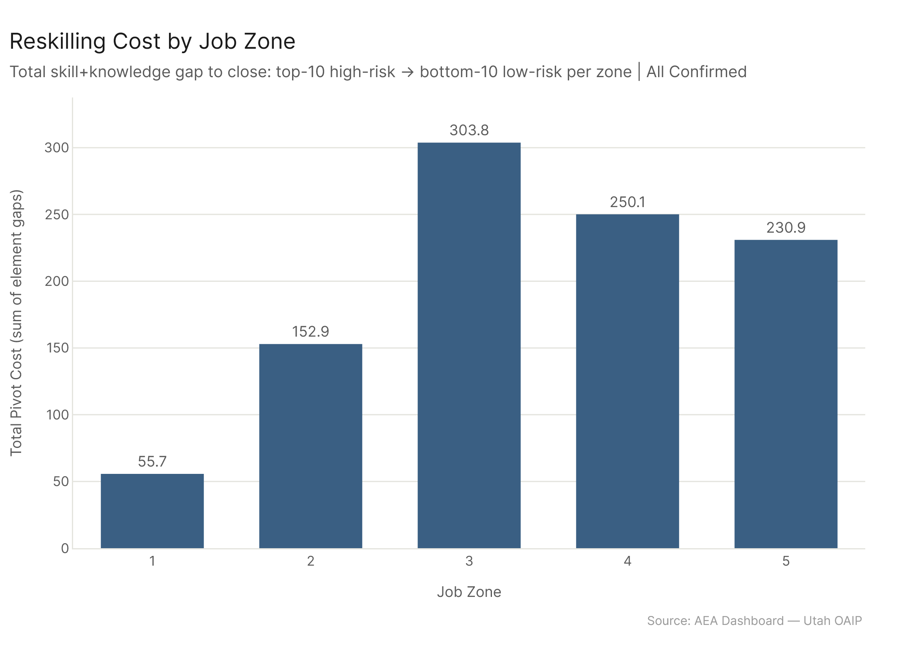
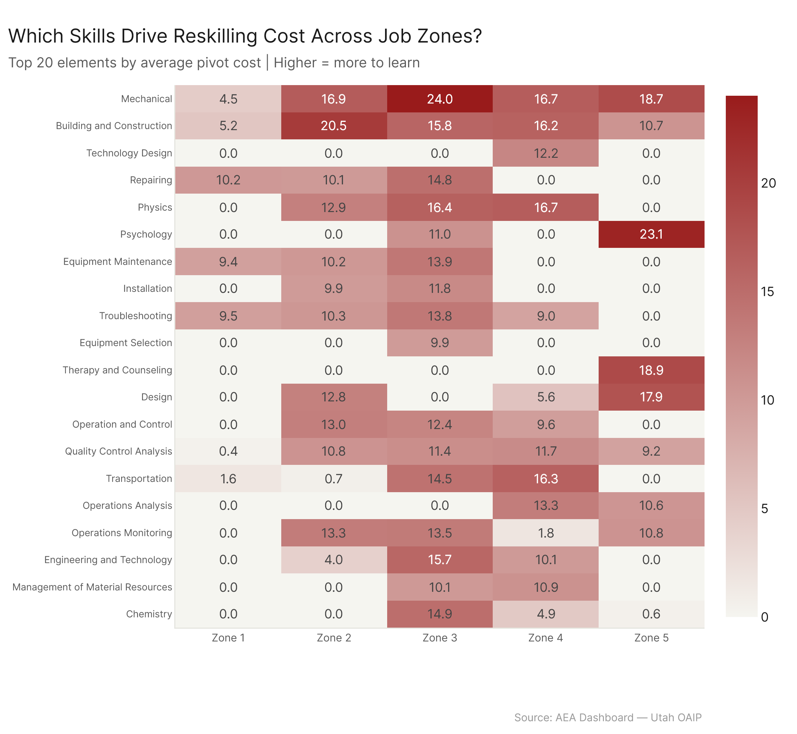
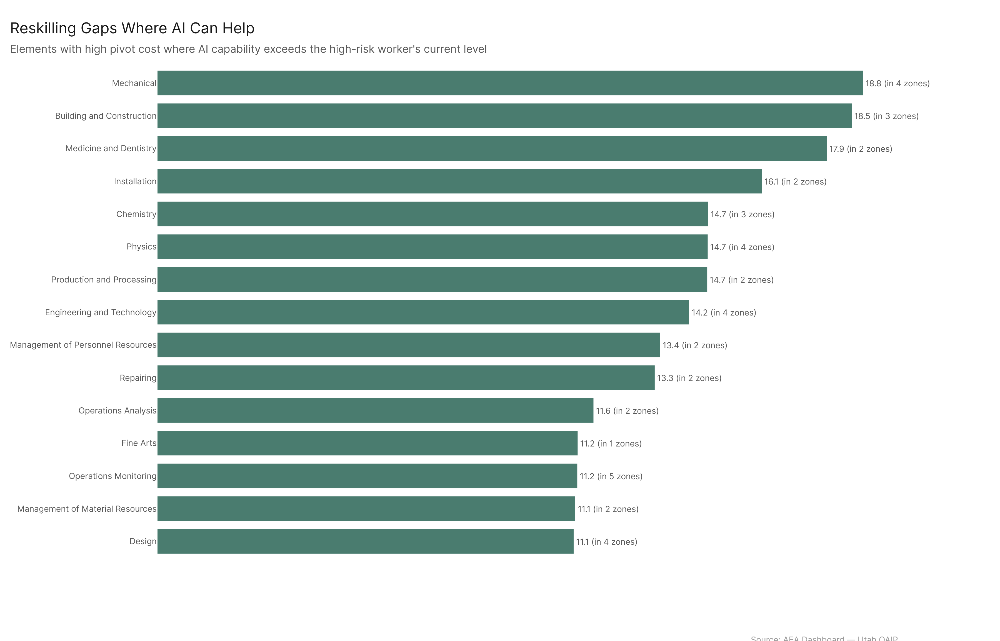

# Pivot Distance: The Cost of Crossing the AI Risk Line

Zone 3 workers -- office clerks, bookkeepers, billing specialists -- face the most expensive reskilling path in the entire labor market (303.79 total cost across 36 skill/knowledge elements). The gaps are mechanical, physical, and construction-related, not the soft-skill deficits that workforce programs typically target. But here's the new wrinkle: AI itself can help close many of these gaps. In Zone 2, AI tools can assist with 99.5% of the gap elements. Even in Zone 3, the number is 98.4%. The reskilling problem is real, but the reskilling toolkit just got a lot more powerful.

---

## The Zone 3 Crisis

Workers in high-risk Zone 3 occupations are the labor market's most stranded population.

The total pivot cost -- the sum of all skill and knowledge gaps a high-risk worker must close to reach the profile of a typical low-risk occupation in the same job zone -- peaks sharply at 303.79 for Zone 3. That's nearly double Zone 2 (152.91) and meaningfully higher than Zone 4 (250.13) or Zone 5 (230.94).

| Zone | Total Cost | Elements with Gap | AI Assists (%) |
|------|-----------|-------------------|----------------|
| 1 | 55.67 | 19 | 78.4% |
| 2 | 152.91 | 17 | 99.5% |
| 3 | 303.79 | 36 | 98.4% |
| 4 | 250.13 | 42 | 89.6% |
| 5 | 230.94 | 29 | 80.1% |

Zone 1 is cheap because both sides of the risk spectrum have shallow profiles. A barista pivoting to logging equipment operation doesn't need deep technical expertise -- the knowledge floor on both ends is low, and only 19 elements register a gap at all.

Zone 3 is a different story. Billing clerks, bookkeepers, and brokerage clerks face a 36-element deficit to reach occupations like bus mechanics, elevator installers, and skilled tradespeople. This is not a narrow certification gap. It is a broad-spectrum knowledge restructuring that no single program covers. Zone 4 actually has more gap elements (42), but they're spread across a wider range of professional domains and each individual gap is smaller. Zone 3 concentrates its cost in a handful of brutal technical deficits.

Zone 5 is surprisingly moderate at 230.94. High-risk academics (anthropology teachers, archivists, atmospheric sciences faculty) and low-risk clinicians (anesthesiologists, emergency physicians, oral surgeons) share enough common intellectual infrastructure -- research methods, analytical reasoning, statistical literacy -- that the pivot is less about building new foundations and more about redirecting existing ones.

## What Drives the Cost

The top cost drivers by zone tell a consistent story: the binding constraint on reskilling is technical and physical knowledge, not interpersonal or cognitive skills.

**Zone 1:** Repairing (10.2), Management of Personnel (10.1), Troubleshooting (9.5). Even at the lowest tier, the gap is hands-on maintenance and operational judgment.

**Zone 2:** Building/Construction (20.5), Mechanical (16.9), Operations Monitoring (13.3). Service-sector workers pivoting to trades hit a wall of applied technical knowledge they've never been asked to develop.

**Zone 3:** Mechanical (24.0), Physics (16.4), Building/Construction (15.8), Engineering (15.7). Four heavy technical domains, 36 total gap elements. This is why Zone 3 is the crisis point -- it's not one big gap, it's a dozen medium-sized ones stacked together.

**Zone 4:** Physics (16.7), Mechanical (16.7), Transportation (16.3). Professional-level pivots still run through technical knowledge, though the specific domains shift toward applied science and logistics.

**Zone 5:** Psychology (23.1), Therapy/Counseling (18.9), Mechanical (18.7). At the highest education tier, the gap pivots from pure technical knowledge toward clinical and behavioral domains -- reflecting the distance between academic and clinical professions.

The pattern across all zones: retraining programs built around general workforce readiness -- communication, teamwork, digital literacy -- will not close these gaps. The bottleneck is mechanical knowledge, construction expertise, engineering fundamentals, and applied physics. These require hands-on training, apprenticeships, and industry certification.

## AI as Reskilling Partner

Here's where the analysis takes a turn that the previous version of this report couldn't make.

For many of the gap elements, AI capability already exceeds the high-risk worker's current level. That means AI tools could function not just as the thing displacing these workers, but as the thing helping them close the gap. An AI tutoring system that understands mechanical principles better than a billing clerk currently does can teach those principles. An AI assistant that exceeds a bookkeeper's physics knowledge can scaffold learning in that domain.

The numbers are striking. In Zone 2, AI can assist with 99.5% of gap elements -- nearly every single one. Zone 3, the most expensive pivot, still shows 98.4% AI-assisted coverage. Zone 4 drops to 89.6%, and Zone 5 to 80.1%, reflecting the increasing depth and specialization of upper-tier professional knowledge.

This doesn't make the reskilling problem disappear. You still need hands-on practice, supervised apprenticeship, and real-world application for domains like mechanical repair and building construction. AI can teach the theory and provide practice environments, but it can't replace the physical skill development. The point is narrower than that: the knowledge acquisition phase of reskilling -- traditionally the most expensive and time-consuming part -- just got dramatically cheaper for the majority of gap elements.

The policy implication shifts from "these workers need comprehensive multi-year programs" to "these workers need structured AI-assisted learning pathways paired with shorter hands-on practicums." That's a meaningfully different program design, and a meaningfully lower cost.

Zone 1 is the exception that tests the rule. At 78.4% AI assistance, it has the lowest coverage -- not because the gaps are harder, but because the gap elements (repairing, personnel management, troubleshooting) are more judgment-and-practice-heavy than knowledge-heavy. AI can explain how to troubleshoot a diesel engine; it can't give you the feel for it.

## Config

Primary: `all_confirmed`. Comparison: `all_ceiling`. Risk scores from `job_risk_scoring`. Skills + Knowledge only (importance >= 3). Top 10 high-risk and 10 low-risk occupations per zone (or all available if fewer than 10). Abilities excluded (less trainable). Ceiling costs are identical to confirmed because the same high/low risk occupations are selected -- risk scoring uses the same config for both.

## Files

| File | Description |
|------|-------------|
| `results/pivot_cost_by_zone.csv` | Per-zone: total cost, n occs, AI assistance %, example high/low risk occs |
| `results/element_costs_by_zone.csv` | Per-element cost breakdown per zone |
| `results/high_risk_profiles.csv` | Avg skill+knowledge profile of high-risk occs per zone |
| `results/low_risk_profiles.csv` | Same for low-risk |
