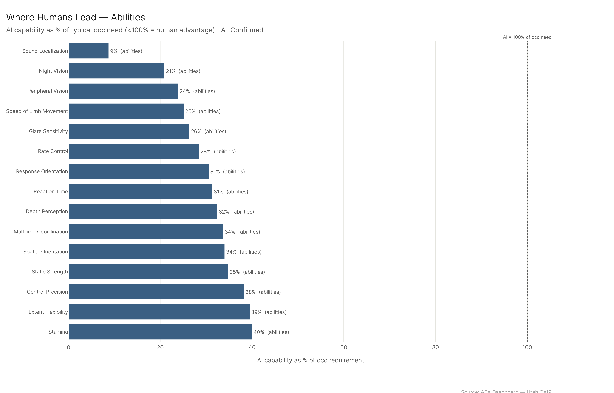
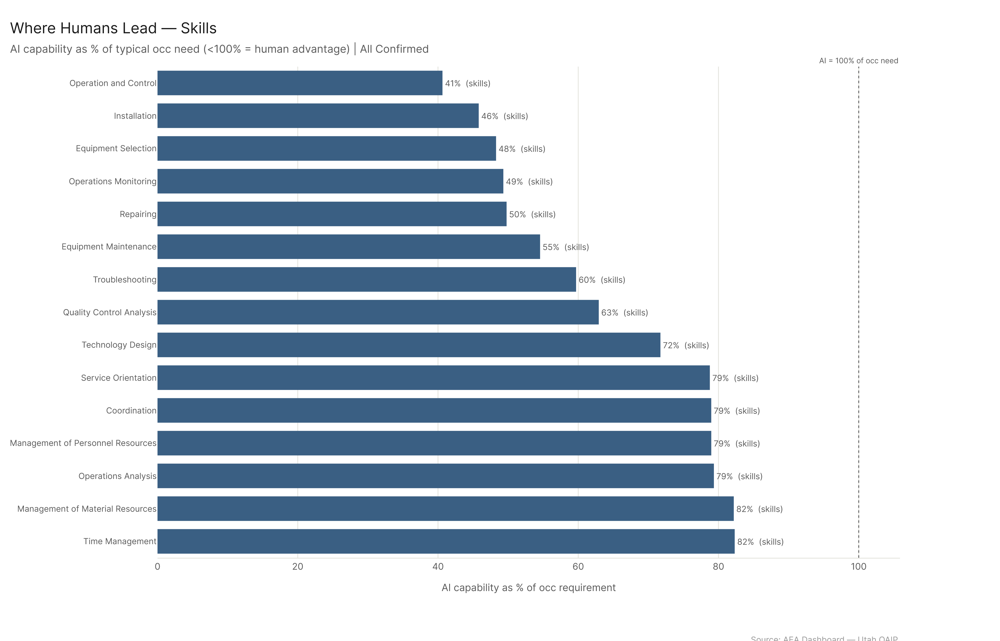
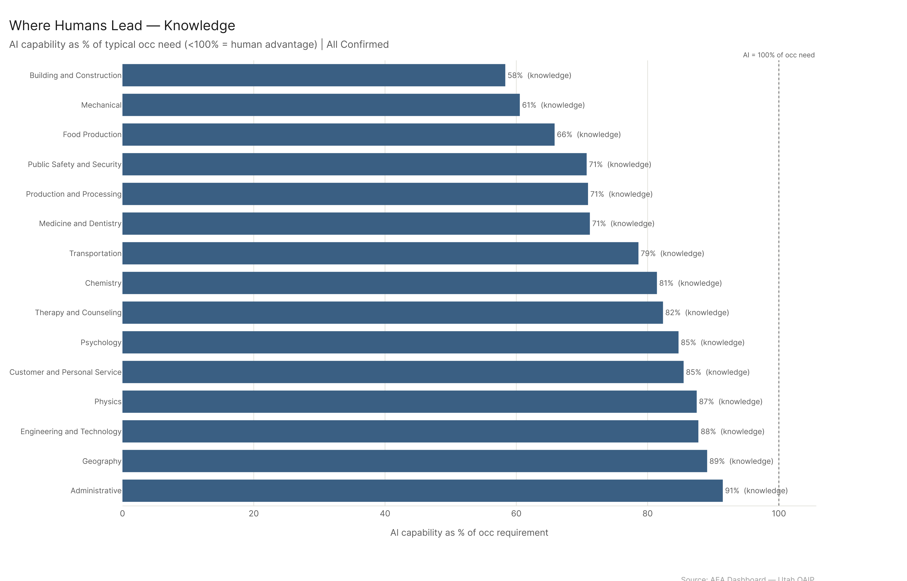
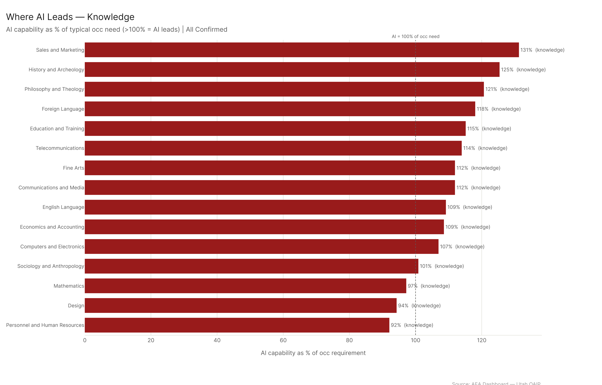
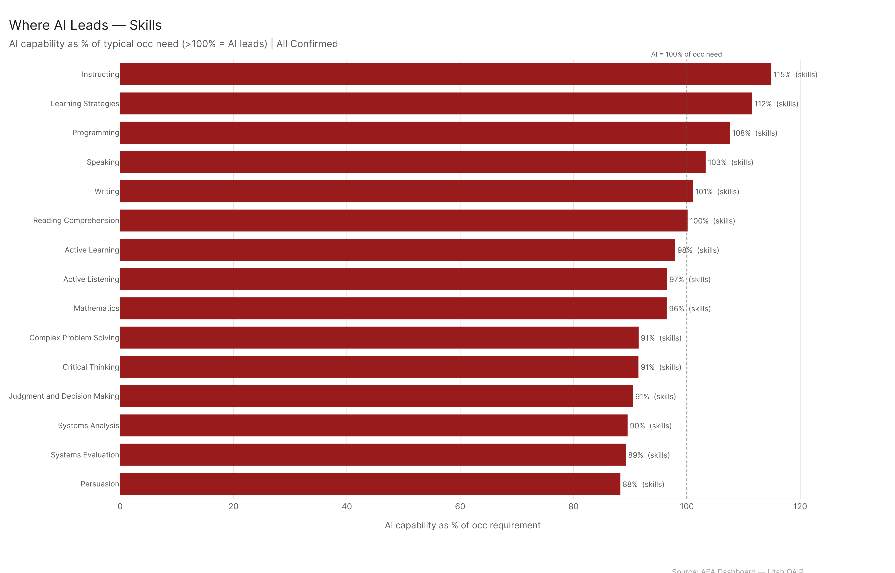
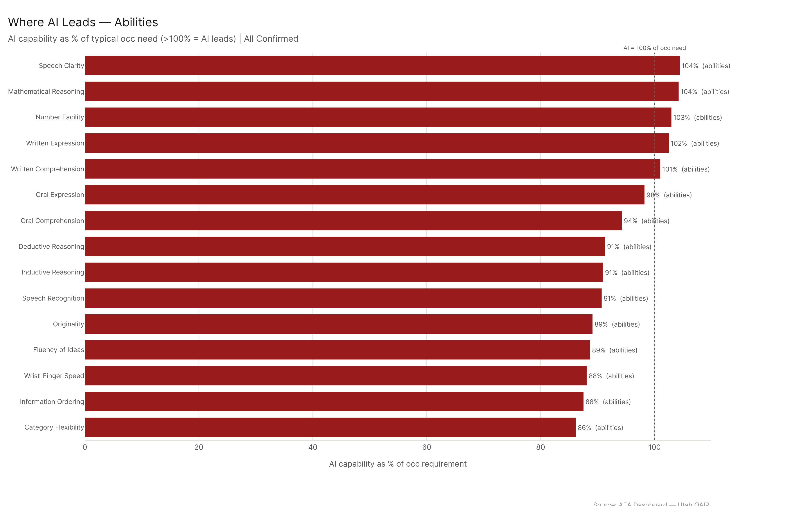
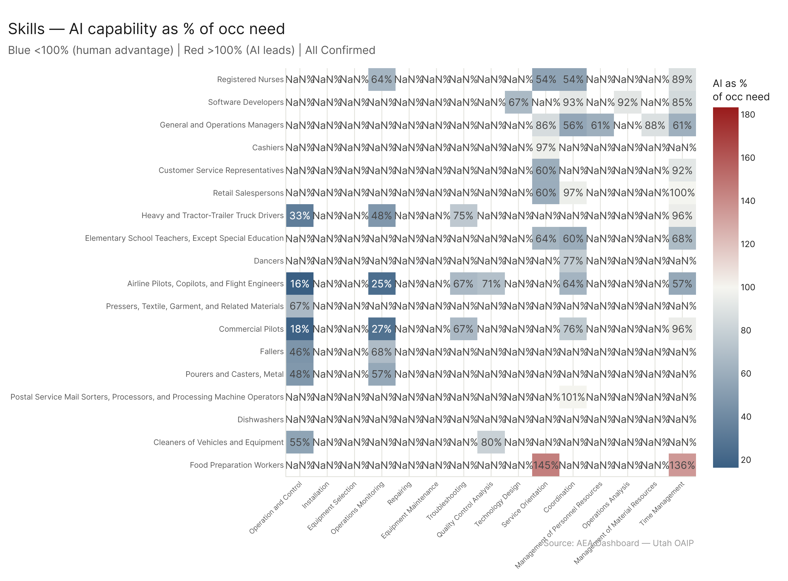
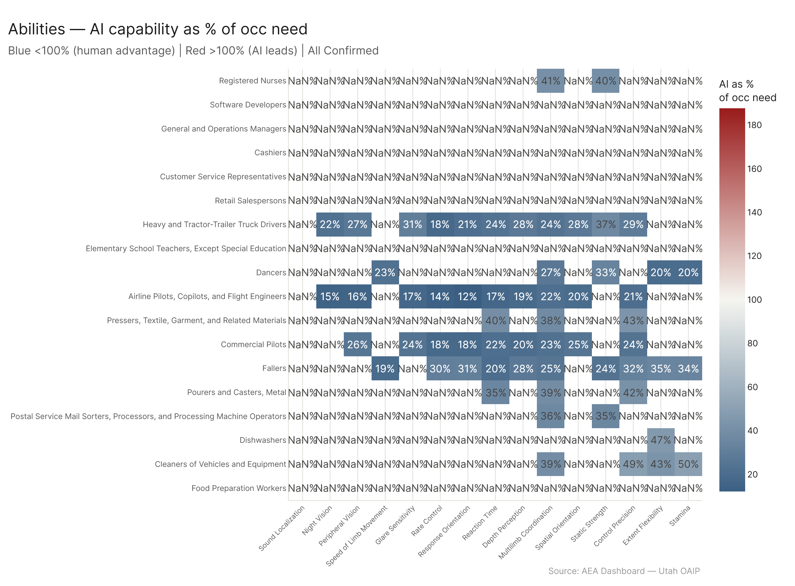
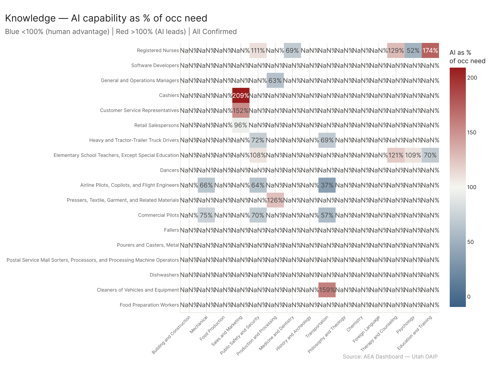
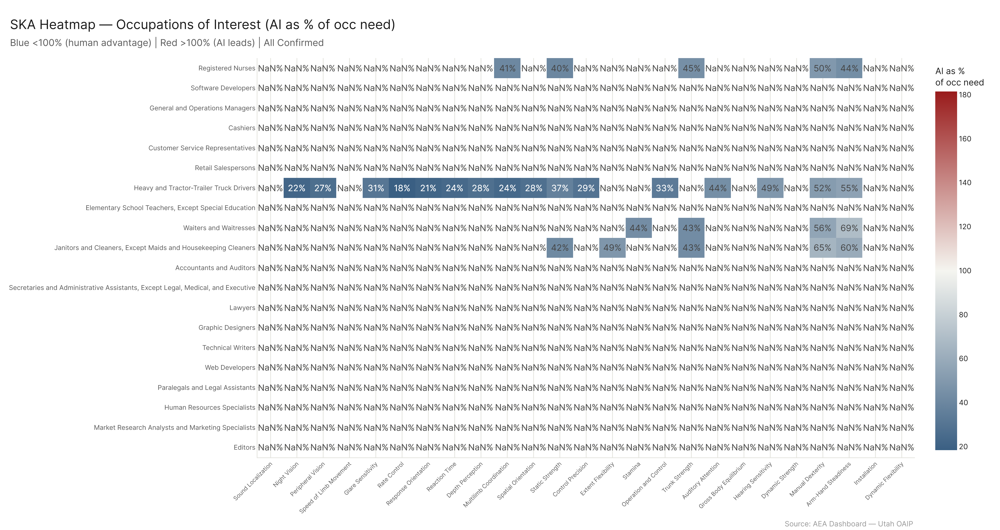

# Worker Resilience: Where You Still Lead, and Where AI Already Does

*Where AI's demonstrated capability sits relative to what each occupation needs — element by element, occupation by occupation. All numbers are AI capability as a percentage of the typical occupation's requirement. Below 100% = human advantage; above 100% = AI leads.*

*Config: all_confirmed | Comparison: ceiling | Method: freq | Auto-aug ON | National | S + A + K, importance >= 3*

---

Your body is your moat. Every one of the top 10 human-advantage elements is a physical or perceptual ability — sound localization (AI at just 9% of what jobs need), night vision (21%), peripheral vision (24%), limb speed (25%). On the other side, AI's advantages are almost entirely knowledge domains: sales and marketing (131%), history (125%), philosophy (121%), foreign language (118%). Skills sit in the middle, roughly balanced. The structural message is clear: AI commoditized the information layer. What it cannot touch is the physical one. But the percentage is climbing — confirmed-usage AI capabilities are growing across all configs, with median percentage-point gains ranging from +13.7 to +46.5. Workers who understand where they lead and where AI leads can make sharper decisions about what to invest in and what to delegate.

---

## 1. The Big Picture: Three Domains, Three Stories

The gap between what jobs require and what AI can deliver is not uniform. It splits cleanly along domain lines, and the split tells a story about what AI actually is.

**Abilities** are overwhelmingly human territory. Roughly 285 occupation-element pairs show a negative gap (human advantage) versus about 65 positive. These are the physical and perceptual capacities that jobs demand: reaction time, manual dexterity, depth perception, strength, coordination. AI systems — even the best ones — do not have bodies. They do not localize sound. They do not maintain balance on a beam. This is not a temporary limitation waiting for a software update. It reflects the fundamental architecture of what current AI systems are.

**Knowledge** is overwhelmingly AI territory. About 285 occupation-element pairs show a positive gap (AI advantage) versus roughly 15 negative. Knowledge domains — sales and marketing, history, philosophy, biology, economics — are the things language models were built to encode. They have read more textbooks than any human could in a lifetime. The few knowledge domains where humans still lead (Building and Construction, Mechanical) are the ones most tightly coupled to physical, site-specific experience.

**Skills** are the contested ground. Roughly 212 negative versus 185 positive — a slight lean toward humans, but close enough that it depends on the specific skill. Operation and Control, Repairing, Operations Monitoring: human advantage. Instructing, Learning Strategies, Programming: AI advantage. Skills are where the line between "knowing" and "doing" matters most, and the split reflects that. Skills that require physical execution or real-time situational judgment favor humans. Skills that are more about structured communication or information processing favor AI.

---

## 2. Where Humans Lead

### Abilities

The top of the human-advantage list reads like a catalog of embodiment.

| Rank | Element | AI as % of Occ Need |
|------|---------|---------------------|
| 1 | Sound Localization | 9% |
| 2 | Night Vision | 21% |
| 3 | Peripheral Vision | 24% |
| 4 | Speed of Limb Movement | 25% |
| 5 | Glare Sensitivity | 26% |
| 6 | Rate Control | 28% |
| 7 | Response Orientation | 31% |
| 8 | Reaction Time | 31% |
| 9 | Depth Perception | 32% |
| 10 | Multilimb Coordination | 34% |

These are not niche abilities. Multilimb Coordination appears in 250 occupations. Control Precision in 319. Manual Dexterity in 368. Arm-Hand Steadiness in 399. The physical demands of work are far more widespread than people tend to think when they picture "manual labor." A dental hygienist needs arm-hand steadiness. A firefighter needs spatial orientation. A surgeon needs control precision and reaction time. These are the abilities where AI has the furthest to go, and many of them are structurally inaccessible to software-only systems.

### Skills

The human-advantage skills are less dramatic in magnitude but cover a huge surface area of occupations:

| Rank | Element | AI as % of Occ Need |
|------|---------|---------------------|
| 1 | Operation and Control | 41% |
| 2 | Installation | 46% |
| 3 | Equipment Selection | 48% |
| 4 | Operations Monitoring | 49% |
| 5 | Repairing | 50% |

These are hands-on skills — operating equipment, repairing things, monitoring physical systems. But further down the list you also find Coordination, Service Orientation, Social Perceptiveness, and Active Listening. The pattern: skills that require either physical interaction with the world or real-time interpersonal responsiveness stay in human territory.

### Knowledge

Only a handful of knowledge domains favor humans, and they share a common thread: they are knowledge that lives in places, not in texts.

| Rank | Element | AI as % of Occ Need |
|------|---------|---------------------|
| 1 | Building and Construction | 58% |
| 2 | Mechanical | 61% |

Building and Construction shows AI at just 58% of what the typical job requires, across 113 occupations. Mechanical knowledge, 61% across 276. These are the knowledge domains where "knowing" is inseparable from "having been there and done it." You can read about load-bearing walls. You cannot learn to assess one from a textbook alone.

---

## 3. Where AI Leads

### Knowledge

AI's strongest suit, and it is not close.

| Rank | Element | AI as % of Occ Need |
|------|---------|---------------------|
| 1 | Sales and Marketing | 131% |
| 2 | History and Archeology | 125% |
| 3 | Philosophy and Theology | 121% |
| 4 | Foreign Language | 118% |
| 5 | Education and Training | 115% |
| 6 | Telecommunications | 114% |
| 7 | Communications and Media | 112% |
| 8 | Fine Arts | 112% |
| 9 | English Language | 109% |
| 10 | Economics and Accounting | 109% |

These are domains where AI's demonstrated capability exceeds what the typical job requires. A marketing coordinator needs to know sales and marketing concepts — but AI already covers 131% of what the role demands. A historian's job requires historical knowledge — but AI's recall and synthesis capacity covers 125% of that threshold.

This does not mean AI can do the historian's job. It means the *knowledge retrieval* part of the job is covered. The judgment, interpretation, and argument parts — those live in skills and abilities, not in knowledge scores.

### Skills

| Rank | Element | AI as % of Occ Need |
|------|---------|---------------------|
| 1 | Instructing | 115% |
| 2 | Learning Strategies | 112% |
| 3 | Programming | 108% |

The AI-advantage skills are smaller in magnitude and fewer in number. Instructing (115% of occ need) reflects AI's capacity to deliver structured explanations — not its ability to read a room, motivate a struggling student, or adapt on the fly to an emotional response. Learning Strategies and Programming round out the list. The skills gap is narrow enough that many of these are effectively contested territory.

### Abilities

Only a few abilities appear with a meaningful AI advantage: Speech Clarity (104%), Mathematical Reasoning (104%), Number Facility (103%). Even these barely exceed the 100% threshold. AI systems can produce clear speech output, but the ability domain as a whole is overwhelmingly human. This is the domain where AI's structural limitations are most visible.

---

## 4. Variation Across Occupations

The aggregate story — abilities human, knowledge AI, skills contested — holds at the domain level. But it plays out very differently depending on which occupation you are in.

### By Domain

The skills heatmap shows a patchwork. Some occupations (construction trades, healthcare) retain deep skill advantages. Others (administrative, education-adjacent) show more AI-side warmth. The variation is real — two occupations with similar aggregate exposure scores can have completely different skill-level profiles.

The abilities heatmap is almost uniformly cool (human advantage). A few occupations show narrow positive gaps in Speech Clarity or similar, but the dominant color is blue. If your job is ability-intensive, the heatmap confirms what the averages suggest: you are well-insulated.

The knowledge heatmap flips the other way — mostly warm (AI advantage), with isolated pockets of blue in Building and Construction and Mechanical. Knowledge-intensive occupations that lack a strong physical component are the most exposed.

### By Occupation

The occupation-level heatmap shows the full picture for occupations of interest. The critical thing to notice: even occupations with high overall AI exposure have blue columns (human advantages), and even well-insulated occupations have red columns (AI advantages). No occupation is all-human or all-AI. The strategic question for every worker is which elements in their specific role are blue and which are red.

---

## 5. Tips and Tricks: Three Occupations

This is the section that matters most for individual workers. The aggregate findings tell you the shape of the landscape. What follows tells you what to actually do about it.

For each occupation, we show the key SKA elements where humans lead and where AI leads, then the specific tasks ranked by AI automation capability. The framework:

- **Invest in yourself** where the gap is negative — your human capabilities exceed what AI can do here
- **Learn to leverage AI** where the gap is positive — AI already exceeds what the job requires
- **Let AI handle** tasks with high automation scores
- **Do it yourself** tasks with low automation scores where the work is inherently human

---

### Secretaries and Administrative Assistants

**Overall AI exposure: 75.1% of tasks affected**

Three-quarters of the task portfolio. That is a big number. But it hides something important: the tasks AI can do and the ones it cannot are sharply different in character, and the ones it cannot do are exactly the ones that make the difference between an adequate admin and an indispensable one.

#### Where You Lead

| Element | Type | Gap | Interpretation |
|---------|------|-----|----------------|
| Administrative | Knowledge | -12.76 | Your institutional knowledge — who handles what, how things actually work in this specific office, which vendor to call on Tuesdays. Not "administration" in the generic sense. The accumulated, context-specific understanding of how your particular organization runs. |
| Near Vision | Abilities | -4.20 | Catching the misprint on the physical form. Reading the fine print on the contract that just arrived. Proofreading under fluorescent lights. |
| Speech Recognition | Abilities | -3.38 | Understanding the mumbled voicemail, the request shouted across an open office, the caller with a thick accent on a bad connection. |
| Service Orientation | Skills | -2.21 | Reading what someone actually needs versus what they said they need. Anticipating the follow-up question before it is asked. |
| Active Listening | Skills | -1.95 | Full-attention, context-aware listening — the kind that catches the important thing someone almost did not say. |
| Time Management | Skills | -1.88 | Juggling competing demands from multiple people in real time. Not scheduling — triaging. |
| Selective Attention | Abilities | -1.66 | Staying focused on a task while the phone rings, someone walks up, and an email pings simultaneously. |

The Administrative knowledge gap of -12.76 is enormous — the largest single element gap for this occupation by a wide margin. This is the "you can't replace the person who knows where everything is" effect. AI can draft a memo. It cannot know that the VP prefers Thursday meetings at 2pm, that the third-floor printer jams on heavy stock, or that the new hire in accounting needs extra reminders about expense reports. This knowledge is not in any document. It is in you.

#### Where AI Leads

| Element | Type | Gap | Interpretation |
|---------|------|-----|----------------|
| Deductive Reasoning | Abilities | +3.68 | Working through logical implications of policies, rules, procedures. |
| Inductive Reasoning | Abilities | +3.41 | Pattern recognition — spotting trends in data, drawing general conclusions from specific cases. |
| Judgment and Decision Making | Skills | +2.99 | Evaluating options against defined criteria for routine, well-specified decisions. |
| Administration and Management | Knowledge | +1.67 | General management concepts and best practices. Not your office — offices in general. |
| Critical Thinking | Skills | +1.51 | Analyzing structured, text-based information for validity and consistency. |

A subtle point: AI leads in Deductive and Inductive Reasoning for this role not because AI is smarter than you, but because the occupation's formal requirement for these abilities is modest relative to AI's general capability. An admin does not need deep logical analysis most days. But when they do — comparing policy options, analyzing a vendor proposal, assessing whether a new system meets requirements — AI can handle the analytical heavy lifting.

#### Task Recommendations

**Let AI handle these** (automation score >= 4.0):
- Mail newsletters, promotional material, or other information (5.0)
- Maintain scheduling and event calendars (5.0)
- Schedule and confirm appointments (4.65)
- Provide standard customer service information and order placement (4.47)
- Answer phones, take messages, transfer calls (4.42)
- Manage projects or contribute to committee work (4.33)
- Collect, deposit, and disburse funds; maintain financial records (4.33)
- Create, maintain, and enter information into databases (4.24)
- Arrange travel reservations (4.09)
- Conduct internet research (4.04)
- Coordinate conferences, meetings, special events (4.03)

**AI can assist with** (automation score 2.5-4.0):
- Compose, type, and distribute meeting notes and reports (3.94)
- Develop or maintain company websites (3.86)
- Process payroll (3.83)
- Operate electronic mail systems and coordinate information flow (3.78)
- Establish work procedures and track daily clerical work (3.67)
- Greet visitors and handle inquiries (3.54)
- Prepare conference materials like flyers and invitations (3.48)
- Manage filing systems (3.43)
- Review others' work for spelling, grammar, and format compliance (3.35)

**Focus on doing yourself** (automation score < 2.5):
- Ordering and dispensing supplies (physical, contextual)
- Training and assisting staff with computer usage (interpersonal)
- Learning to operate new office technologies (adaptive judgment)

#### The Play

An admin at 75.1% exposure should not be alarmed. They should be aggressive about adoption. The exposed tasks are the routine, information-processing ones — scheduling, correspondence, data entry, research, event coordination. Let AI eat those. The protected core is the service-oriented, context-specific, interpersonal work: knowing the office, reading people, anticipating needs, managing the human flow of an organization. An admin who offloads the first category to AI and doubles down on the second becomes harder to replace, not easier. The 75.1% number is a measure of how much time you can free up, not how replaceable you are.

---

### Registered Nurses

**Overall AI exposure: 33.4% of tasks affected**

Nursing is far less exposed than administrative work. The reason is structural: the core of nursing is interpersonal, physical, and diagnostic in ways that software cannot replicate. But a third of the task portfolio still touches AI capability, and the specific tasks in that third are worth knowing about.

#### Where You Lead

| Element | Type | Gap | Interpretation |
|---------|------|-----|----------------|
| Psychology | Knowledge | -13.31 | Understanding human behavior, motivation, emotional states, fear responses, coping mechanisms. The single deepest human advantage — by far. |
| Problem Sensitivity | Abilities | -9.81 | Recognizing that something is wrong before it becomes clinically obvious. The "something feels off about this patient" instinct that experienced nurses develop and that no checklist fully captures. |
| Customer and Personal Service | Knowledge | -9.23 | The entire patient-centered care framework: reading needs, managing expectations, providing comfort in frightening situations. |
| Social Perceptiveness | Skills | -7.88 | Picking up on nonverbal cues, emotional states, family dynamics, the things a patient will not put into words. |
| Inductive Reasoning | Abilities | -7.47 | Drawing clinical conclusions from observations. Not textbook reasoning — the pattern recognition grounded in physical presence and accumulated experience. |
| Coordination | Skills | -7.31 | Coordinating care across teams, shifts, departments, and specialists in real time. |
| Service Orientation | Skills | -7.29 | The deep orientation toward helping that defines the profession. |
| Arm-Hand Steadiness | Abilities | -6.35 | IV insertions, wound care, injections. The physical precision of clinical work. |
| Medicine and Dentistry | Knowledge | -6.07 | Applied medical knowledge — not the textbook part, but the clinical-judgment part that comes from seeing thousands of patients. |

The Psychology gap of -13.31 is the largest element gap across all three occupations profiled here. Nursing demands a depth of understanding of human psychology — how people respond to pain, fear, bad news, uncertainty, loss of autonomy — that AI is nowhere close to matching. This is not about being nice. It is about being able to read a patient who insists they are fine but is not, or knowing when a family member's question is really about something else entirely. Problem Sensitivity at -9.81 is the clinical instinct that separates good from adequate. These gaps are not closing anytime soon.

#### Where AI Leads

| Element | Type | Gap | Interpretation |
|---------|------|-----|----------------|
| Biology | Knowledge | +8.48 | AI's biological knowledge far exceeds what the nursing role demands day-to-day. A powerful reference tool, not a replacement for clinical practice. |
| Education and Training | Knowledge | +8.01 | Designing patient education materials, training content, discharge instructions. AI can generate these faster and more comprehensively than any individual nurse. |
| Therapy and Counseling | Knowledge | +3.56 | The theoretical knowledge base of therapeutic approaches — evidence summaries, intervention frameworks. Not the delivery. |
| Mathematical Reasoning | Abilities | +3.48 | Drug dosage calculations, statistical interpretation of lab results, risk scoring. |
| Administration and Management | Knowledge | +2.97 | Scheduling optimization, resource allocation, management frameworks. |
| Mathematics | Knowledge | +2.86 | Quantitative analysis for clinical and administrative tasks. |

The Biology gap (+8.48) deserves unpacking. Nursing requires biological knowledge, but the daily requirement sits well below AI's capacity. What this means in practice: AI is an excellent reference tool for drug interactions, pathophysiology refreshers, evidence summaries, and protocol lookups. Nurses who learn to use AI for quick reference — "what are the contraindications for X in a patient with Y" — reclaim minutes that compound across a shift.

The Education and Training gap (+8.01) is similarly actionable. Patient education is time-consuming and often templated. AI can draft discharge instructions, generate condition-specific educational materials, and create training documents, freeing nurses for direct patient care.

#### Task Recommendations

**Let AI handle these** (automation score >= 4.0):
- Prescribe or recommend drugs, medical devices, or treatment protocols (5.0) — AI generates recommendations; clinician applies judgment and signs off
- Monitor, record, and report symptoms or changes in patient conditions (4.01) — AI processes continuous vitals data, flags anomalies, drafts shift reports
- Record patients' medical information and vital signs (4.0) — documentation is AI's natural strength

**AI can assist with** (automation score 2.0-4.0):
- Conduct specified laboratory tests (3.0)
- Administrative and managerial functions — staff, budget, planning (2.99)
- Maintain accurate, detailed reports and records (2.60)
- Direct or coordinate infection control programs (2.47)
- Consult with institutions about nursing practice issues (2.47)
- Refer patients to specialized health resources (2.36)
- Prepare rooms, instruments, equipment, and supplies (2.33)
- Assess needs of individuals, families, or communities (2.25)
- Provide or arrange for training of auxiliary personnel (2.13)
- Instruct individuals and families on health education topics (2.11)

**Focus on doing yourself** (automation score < 2.0):
- Engage in research activities related to nursing (1.87) — the design and judgment parts
- Modify patient treatment plans based on patient responses and conditions (1.81)
- Order, interpret, and evaluate diagnostic tests to assess patient condition (1.75)
- Monitor all aspects of patient care, including diet and physical activity (1.00)
- Perform physical examinations, make tentative diagnoses, and treat patients at triage (1.00)

#### The Play

A nurse at 33.4% exposure should think of AI as a documentation engine and reference library. The highest-automation tasks are recording, monitoring, and prescribing — information-processing work that currently eats into time that could go to patients. Let AI draft the shift report. Let it flag the vital sign anomaly at 3am. Let it generate the patient education handout about post-surgical care.

But keep your hands on the patient. The entire diagnostic and interpersonal core of nursing — reading a patient's face, noticing the subtle change that the monitoring system missed, coordinating with a team through a crisis, providing comfort when a family gets bad news — that is where the human advantage is deepest and most durable. A nurse who uses AI for the information-processing layer of the job and reinvests that time into the bedside layer is not being replaced. They are becoming more effective at the thing only they can do.

---

### Construction Laborers

**Overall AI exposure: 12.0% of tasks affected**

The least exposed of the three. And it is easy to see why. Construction labor is overwhelmingly physical, performed in variable environments, and dependent on real-time coordination of the body. AI exposure here is narrow and specific.

#### Where You Lead

| Element | Type | Gap | Interpretation |
|---------|------|-----|----------------|
| Static Strength | Abilities | -11.26 | Lifting, carrying, holding heavy materials in position. Brute physical capacity. |
| Manual Dexterity | Abilities | -9.91 | Precise hand movements with tools, fasteners, and materials in unpredictable conditions. |
| Building and Construction | Knowledge | -8.92 | Hands-on, site-specific knowledge of how structures go together. The kind of knowledge that cannot be learned from a screen. |
| Multilimb Coordination | Abilities | -8.56 | Coordinating arms, legs, and torso while working on scaffolding, uneven surfaces, or in confined spaces. |
| Trunk Strength | Abilities | -8.02 | Core stability for lifting, bending, reaching in positions that would be awkward if you had not done them a thousand times before. |
| Control Precision | Abilities | -6.58 | Fine control of tools and equipment — cutting, fastening, aligning to specification. |
| Arm-Hand Steadiness | Abilities | -5.97 | Steady hands for work that requires precision under physical strain. |
| Stamina | Abilities | -5.84 | Sustained physical effort across a full shift, in heat, cold, wind, dust. |
| Depth Perception | Abilities | -5.63 | Judging distances in three-dimensional space. Essential for alignment, placement, and not falling off things. |
| Extent Flexibility | Abilities | -5.37 | Reaching into tight spaces, working at unusual angles, contorting to get the tool where it needs to go. |

Ten out of ten are physical abilities (with Building and Construction knowledge as the lone knowledge domain). The gaps are large and structurally permanent for software-only AI systems. Static Strength at -11.26 and Manual Dexterity at -9.91 require a body — and specifically a body with years of conditioned physical capability. These are not gaps that a software update closes.

#### Where AI Leads

| Element | Type | Gap | Interpretation |
|---------|------|-----|----------------|
| Oral Expression | Abilities | +4.66 | Clear verbal communication. |
| Deductive Reasoning | Abilities | +4.46 | Logical analysis and inference. |
| Speaking | Skills | +4.38 | Verbal communication skill. |
| Speech Clarity | Abilities | +4.11 | Producing clear, understandable speech. |
| Active Listening | Skills | +3.69 | Processing and understanding verbal information. |
| Oral Comprehension | Abilities | +3.36 | Understanding spoken language. |

Every AI-advantage element for construction laborers is communication-related. This is not a commentary on construction workers' communication abilities. It reflects the fact that the job's formal requirements for verbal and analytical skills are modest relative to AI's baseline capability. The job is physical. The AI advantages are cognitive. These two do not compete with each other — they complement.

#### Task Recommendations

**Let AI handle these** (automation score >= 3.5):
- Read plans, instructions, or specifications to determine work activities (4.09) — AI can interpret blueprints and translate them into plain-language step-by-step instructions
- Measure, mark, or record openings or distances to lay out construction areas (3.96) — AI-assisted measurement and layout tools

**AI can assist with** (automation score 2.0-3.5):
- Mix ingredients to create compounds for covering or cleaning surfaces (2.75)
- Mix, pour, or spread concrete using portable cement mixers (2.75)
- Provide assistance to craft workers such as carpenters, plasterers, or masons (2.23) — AI helps with reference, coordination, and specs

**Focus on doing yourself** (automation score < 2.0):
- Operate or maintain air monitoring or sampling devices in confined or hazardous environments (1.80)
- All physical construction work: lifting, carrying, demolition, installation, scaffolding, excavation

#### The Play

Construction laborers have the smallest AI exposure footprint of the three. The strategic move is narrow but real: use AI for plan interpretation, measurement calculations, and material specifications. If AI can read the blueprint and tell you in plain English what goes where, with what dimensions, using which materials — that saves setup time and reduces errors. A laborer who walks onto the site with AI-prepared task summaries and pre-calculated measurements starts the physical work faster and more accurately.

The physical work itself is yours. All of it. The body is the moat, and in construction, the moat is a canyon.

---

## 6. Trends: AI Capability Is Growing

The ratio of AI capability to occupational requirement is not static. It is climbing — and it is climbing in one direction.

Across all configurations tested, the median percentage-point change in overall_pct (AI as % of occ requirement) from first to last date is positive. AI capabilities are growing relative to prior assessments.

| Config | Median pct delta |
|--------|-----------------|
| all_ceiling | +46.5 pp |
| all_confirmed | +37.8 pp |
| agentic_ceiling | +33.8 pp |
| human_conversation | +23.9 pp |
| agentic_confirmed | +13.7 pp |

The all_ceiling config — which measures the theoretical upper bound of what AI systems could do — shows the largest shift at +46.5 pp. But the all_confirmed config, which tracks only what AI has been demonstrably shown to do, still shows +37.8 pp. Even agentic_confirmed, the narrowest scope (only confirmed tool-use AI), registers +13.7 pp.

What does a positive percentage delta mean concretely? AI's coverage of occupational requirements is climbing toward and past the 100% line. Elements where AI already led are seeing AI pull further ahead. And some elements that were human advantages are eroding. The knowledge domains are seeing the fastest gains. Physical abilities, by contrast, show minimal movement — AI is not gaining ground on your body.

The implication is not that workers should panic. It is that the strategic picture has a time component. The tasks AI can assist with today, it will be able to handle outright tomorrow. Workers who learn to leverage AI now — rather than waiting until coverage climbs so high that adoption becomes mandatory — position themselves as the ones who know how to use the tools, not the ones scrambling to learn.

---

## 7. Config

**Primary:** `all_confirmed` — measures demonstrated AI capability across all interface types (what AI systems have been confirmed to do, not theoretical ceiling).

**Comparison:** `ceiling` — the all_ceiling config serves as reference for what the upper bound looks like and for computing gap deltas.

**Method:** freq, auto-aug ON, national scope.

**Domains:** Skills + Abilities + Knowledge, filtered to importance >= 3.

**SKA formula:** AI capability = 95th percentile of (pct/100 × importance × level) across occupations per element. Percentage framing = AI capability / occupation's own requirement score × 100. Above 100% = AI leads. Per-occ overall = ratio-of-sums across all qualifying elements with importance >= 3.

**Trend configs (median pct delta):** all_ceiling (+46.5pp), all_confirmed (+37.8pp), agentic_ceiling (+33.8pp), human_conversation (+23.9pp), agentic_confirmed (+13.7pp).

## Files

| File | Description |
|------|-------------|
| `results/element_gaps_summary.csv` | Mean gap per element across all occupations |
| `results/human_advantage_elements.csv` | Top elements by human advantage (gap < 0) |
| `results/ai_advantage_elements.csv` | Top elements AI already covers (gap > 0) |
| `results/occ_element_gaps.csv` | Per-occupation x element detail |
| `results/occs_of_interest_gaps.csv` | Top 5 human + top 5 AI elements for named occupations |
| `results/occ_gaps_all_configs.csv` | Per-occupation gap summary across all configs |
| `results/ska_gap_trends.csv` | Gap trends over time by occupation and config |
| `results/tips_*.csv` | Per-occupation SKA and task breakdowns for tips section |
