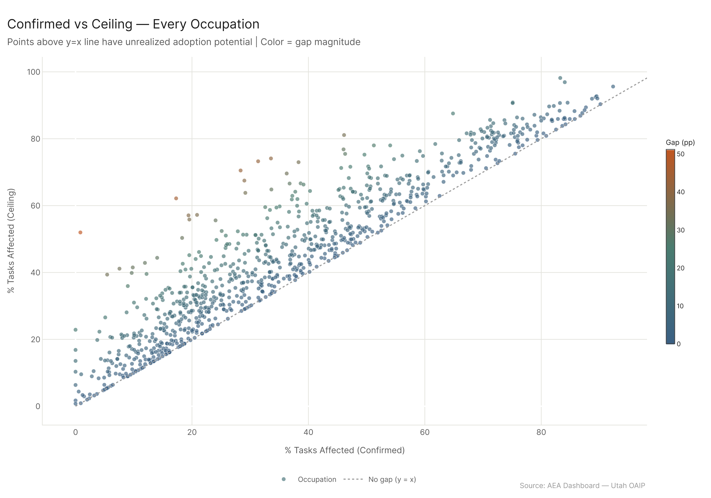
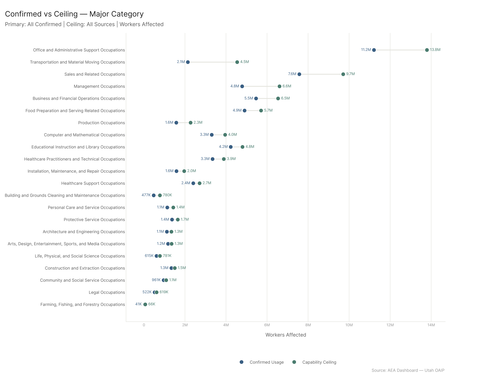
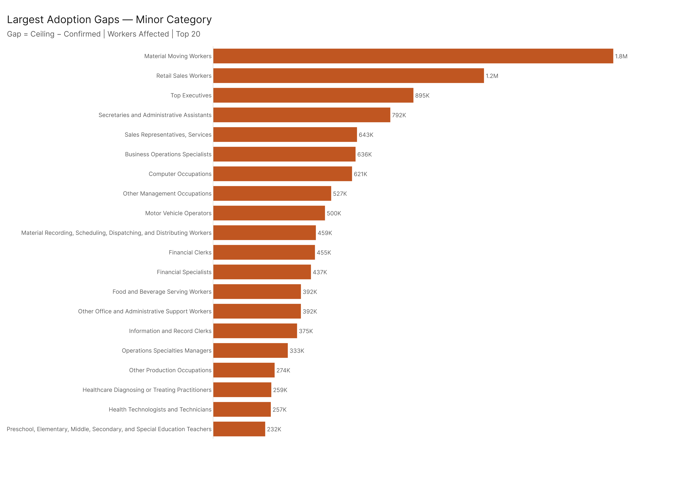
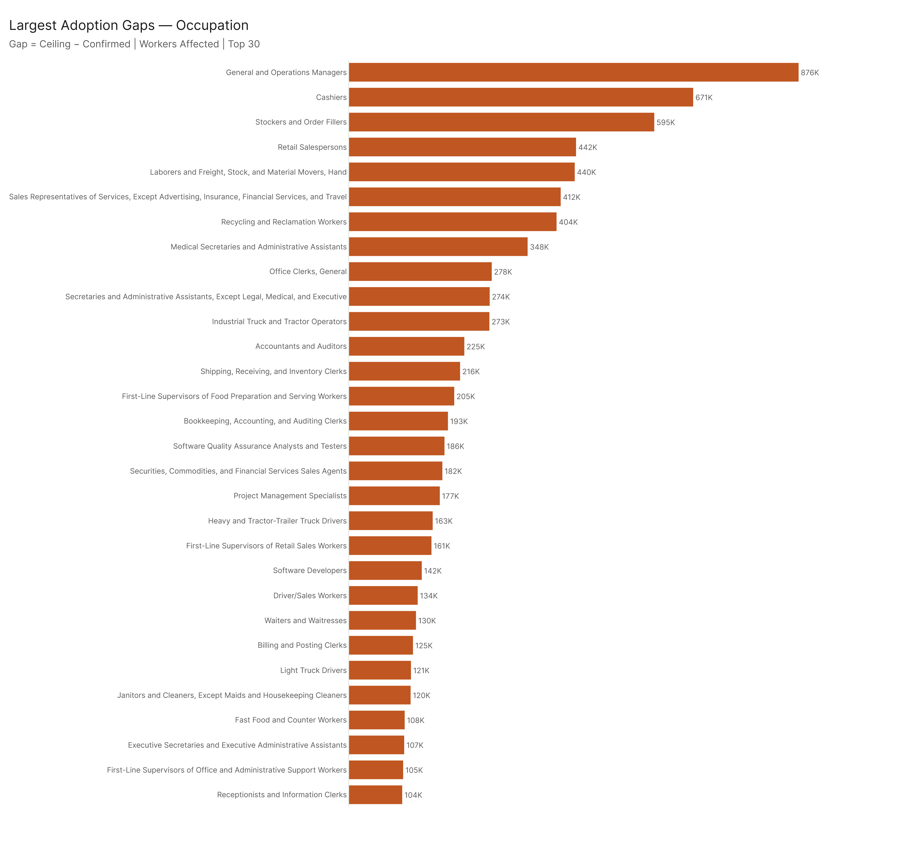
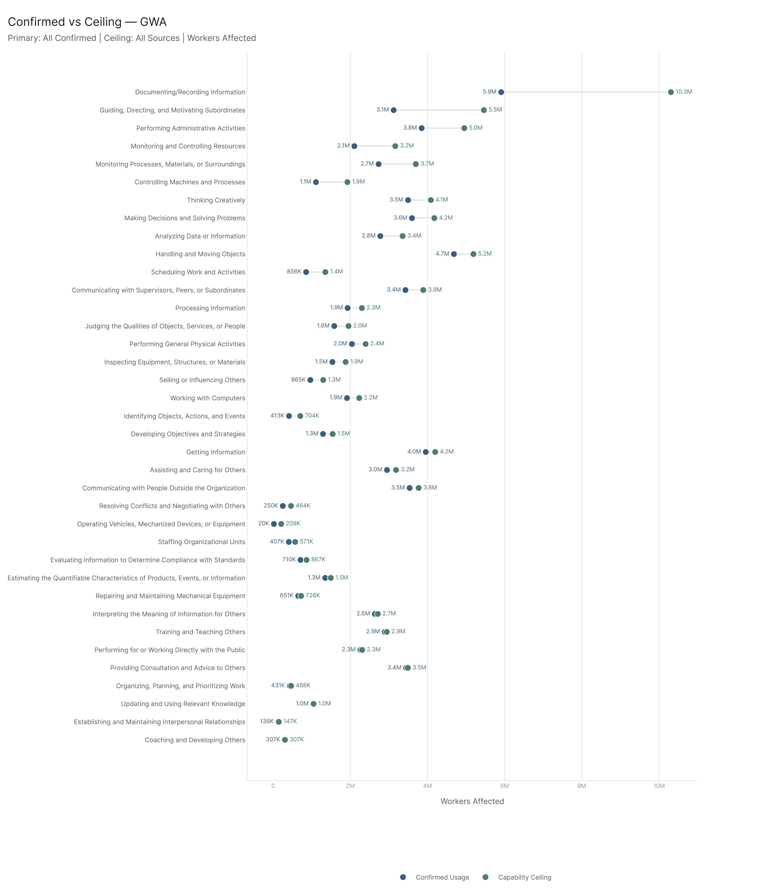
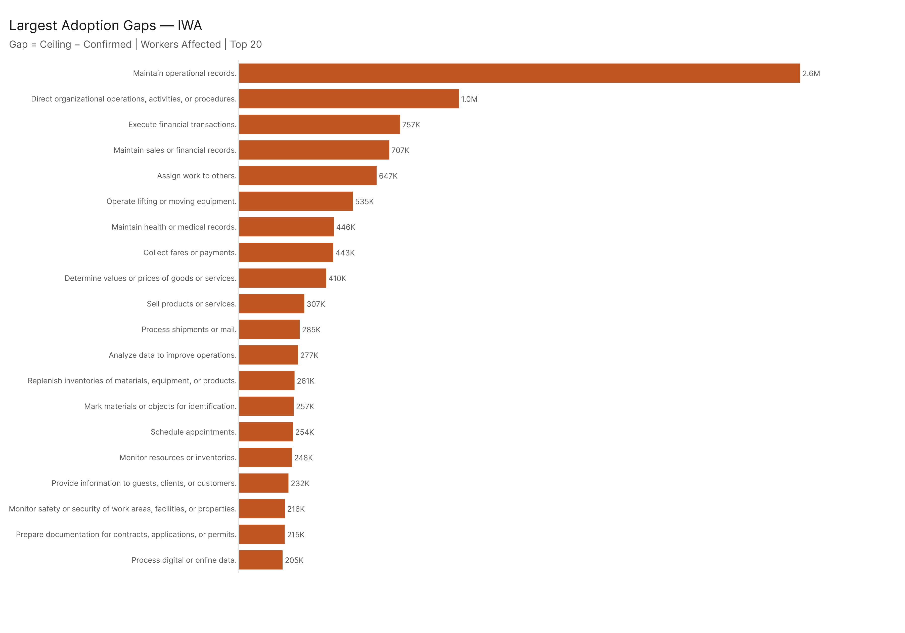
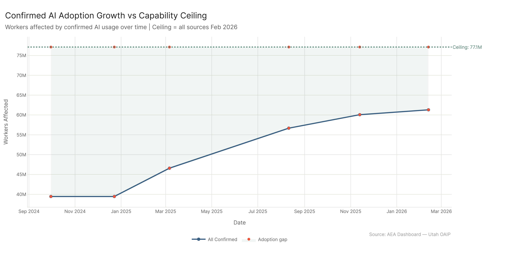
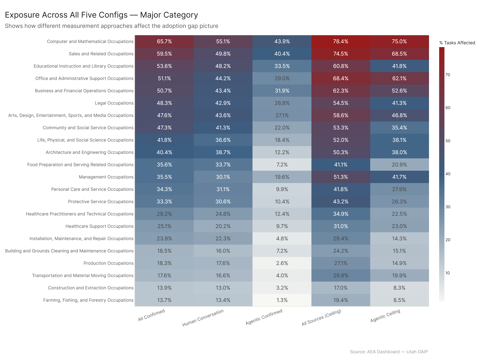

# Adoption Gap: Where the Ceiling Diverges from Confirmed Usage

*Config: all_confirmed (confirmed usage baseline) | Ceiling: all_ceiling (all sources) | Method: freq | Auto-aug ON | National*

---

## TLDR

Confirmed AI usage (61.3M workers affected) sits roughly 15.8M workers below the demonstrated capability ceiling (77.1M). That gap isn't uniformly distributed. Office and Administrative Support carries the largest absolute shortfall — 2.6M workers — but Transportation and Material Moving has the steepest percentage climb from where it is to where AI can demonstrably reach. The activity-level picture tells a particularly clean story: "Documenting/Recording Information" alone has a 4.4M worker gap, and adoption on that GWA has barely moved relative to what the ceiling says is possible. The trend is moving in the right direction — confirmed grew by 21.8M workers over 16 months — but it's not catching the ceiling.

---

## The Gap at a Glance

The ceiling isn't theoretical. It's the maximum demonstrated capability across every data source we have — conversational AI, API tool use, Microsoft Copilot, and MCP servers. The question is not "what could AI do in principle" but "what has AI already done, somewhere, for someone, in tasks that exist in these occupations." Every point in the gap is a task category where that demonstration exists but mass deployment hasn't followed.

The aggregate math: confirmed usage covers 61.3M workers today. The ceiling puts 77.1M workers in scope. That's a 15.8M-worker adoption gap — roughly equal to the entire workforce of the Healthcare Practitioners sector. In dollar terms (wages_affected): confirmed is $3.99T, ceiling is $4.97T, gap is $0.98T.

The scatter makes the shape of the gap visible. Most occupations sit below the y=x line — ceiling is above confirmed for nearly everyone. The occupations furthest above the line aren't clustered by sector in any obvious way; they're spread across the chart. What they share is that something about their task structure has been demonstrated as AI-accessible that hasn't translated into confirmed adoption yet.

---

## By Sector

The sector breakdown surfaces some non-obvious patterns.

**Transportation and Material Moving** has the most striking gap in percentage-point terms: confirmed is 17.6% tasks affected, ceiling is 29.9% — a 12.3pp gap on a sector that employs 16M people. That translates to 2.4M additional workers in scope. Most of that is recording, scheduling, and logistics coordination tasks that are already AI-capable but aren't being deployed in transport contexts at scale.

**Office and Administrative Support** has the largest absolute worker gap (2.6M) despite already having the second-highest confirmed exposure (51%). The ceiling pushes that to 68.4%. The remaining gap is mostly documentation, record maintenance, and scheduling functions — tasks where the tools clearly work, adoption is just incomplete.

**Management** shows a 15.7pp gap (35.5% → 51.3%), adding 1.8M workers to scope. This is largely decision-support and strategy-adjacent tasks — things AI can demonstrably do but that organizations haven't integrated into management workflows.

**Sales** gap is 15pp (59.5% → 74.5%), adding 2.1M workers. Sales is already among the highest-exposure sectors in confirmed usage; the gap is still substantial.

Minor and broad levels surface cleaner targets within these major categories:

**Material Moving Workers** (minor): +1.8M gap. **Secretaries and Administrative Assistants** (minor): +792K gap but a stunning 31pp gap (49.8% → 80.8%), which is the largest percentage-point jump in any sizable minor category. **Top Executives**: +895K workers, 12.2pp.

At broad level, **Laborers and Material Movers** (+1.5M), **General and Operations Managers** (+876K), **Secretaries and Administrative Assistants** (+792K), and **Cashiers** (+675K) are the standouts.

At the individual occupation level, **General and Operations Managers** leads by raw worker gap (876K), driven by the jump from 27.9% to 52.3% confirmed-to-ceiling. **Cashiers** (47% → 68%, +671K) and **Stockers and Order Fillers** (23% → 45%, +595K) are next. The **Medical Secretaries** gap is particularly notable: 31% confirmed to 73% ceiling, a 42pp gap — meaning two-thirds of what AI can demonstrably do for medical admin work isn't being used.

---

## By Work Activity

The activity-level gap is arguably more actionable than the occupation-level view — it tells you not just *where* the gap is but *what kind of work* is under-adopted.

**Documenting/Recording Information** is the single largest GWA gap by workers: 37.3% confirmed to 67.1% ceiling, 4.4M workers in scope of the gap. This is the activity where AI clearly works — writing things down, logging, recording — but where mass adoption in lower-skill and operational roles hasn't happened yet.

**Guiding, Directing, and Motivating Subordinates**: 20.7% → 32.6%, +2.3M workers gap. The ceiling here is mostly from task-support and feedback tools; the deployment gap is real but narrower in percentage terms.

**Scheduling Work and Activities** has the most extreme percentage-point gap of any GWA: 44.9% → 85.3%, a 40pp jump. Scheduling is already heavily AI-capable and is being done everywhere — the ceiling just says it could be even more pervasive.

At the IWA level, the most telling entries:

- **Maintain operational records** (+2.6M workers, +51.7pp): the clearest case for "AI can do this, it's just not deployed everywhere"
- **Assign work to others** (+647K, +47.5pp): scheduling and task-dispatch functions
- **Maintain sales or financial records** (+707K, +47.1pp)
- **Collect fares or payments** (+443K, +40pp): a high gap in a sector (Transportation) where AI adoption has lagged

DWA standouts: **Record operational or production data** (+883K, +52pp), **Maintain student records** (+272K, +84pp — almost no confirmed adoption despite high ceiling), **Prepare staff schedules** (+326K, +70pp).

---

## Is the Gap Closing?

The trend shows confirmed usage growing substantially: from 39.5M workers in September 2024 to 61.3M in February 2026 — an 21.8M worker increase over 16 months.

The ceiling is a moving target too, but the data suggests the gap isn't closing as fast as confirmed is growing. The ceiling in February 2026 is 77.1M; confirmed has grown from 39.5M to 61.3M, covering a meaningful share of the initial gap. But the growth in confirmed (21.8M) outpaced the starting gap; the ceiling likely grew too as MCP and API capabilities expanded. The shaded area in the chart represents the range between where we are and where we could be.

---

## Config Robustness

How much does the measurement approach matter for which sectors look under-adopted?

The ordering of sectors is relatively stable across configs. Office/Admin and Sales are high under every config. Construction and Farming are low under every config. The biggest variance is in sectors like Education (which is high on human conversational AI and lower on agentic), Transportation (which gains more from ceiling/MCP), and Management (which varies based on whether you include API/agentic data). The adoption gap story is robust to measurement approach at the sector level — the broad rankings don't flip when you change the config.

---

## Config

| Setting | Value |
|---------|-------|
| Confirmed baseline | `all_confirmed` — `AEI Both + Micro 2026-02-12` |
| Ceiling | `all_ceiling` — `All 2026-02-18` |
| Method | `freq` (time-weighted) |
| Auto-aug | ON |
| Geography | National |
| Physical filter | All tasks |

## Files

| File | Contents |
|------|----------|
| `results/occ_gap_major.csv` | Gap at major category level |
| `results/occ_gap_minor.csv` | Gap at minor category level |
| `results/occ_gap_broad.csv` | Gap at broad occupation level |
| `results/occ_gap_occupation.csv` | Top 50 occupations by workers gap |
| `results/wa_gap_gwa.csv` | GWA level gap |
| `results/wa_gap_iwa.csv` | Top 50 IWAs by workers gap |
| `results/wa_gap_dwa.csv` | Top 50 DWAs by workers gap |
| `results/config_robustness.csv` | Major-level exposure across all 5 configs |
| `results/gap_trend.csv` | Confirmed workers growth over time |
