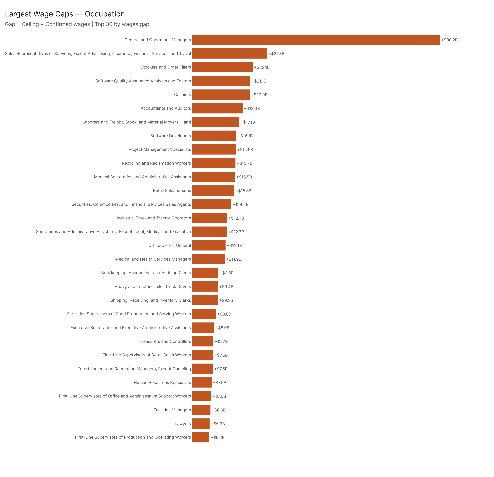

# Wage Potential: The Dollar Value of the Adoption Gap

*Config: all_confirmed (baseline) vs all_ceiling | Method: freq | Auto-aug ON | National*

---

## TLDR

The adoption gap isn't just a count of workers. It's $980 billion in wages associated with AI capabilities that exist and demonstrably work but aren't being deployed. That figure is the difference between the $3.99T in wages currently reached by confirmed AI tools and the $4.97T the ceiling suggests is AI-accessible. The distribution is concentrated: Management occupations and Office/Admin carry the biggest absolute wage gaps, but the hotspot picture — occupations that are both high-wage and have large adoption gaps — tells a different story, pointing at specific, high-value roles where the economic leverage of closing the gap is largest.

---

## The Macro Picture

The ceiling is $4.97T in wages affected. Confirmed is $3.99T. The gap is $980B per year — not a projected future number, not a theoretical maximum, but the difference between what confirmed AI systems currently reach and what demonstrated capability says is reachable with existing tools.

For context: the human-conversation-only baseline has a much larger gap ($1.51T) because it excludes API and tool-use data from confirmed. The agentic confirmed baseline is even further back ($2.81T gap), showing how much of today's confirmed exposure comes from non-agentic conversational tools. The full all_confirmed and agentic_ceiling estimates are close to each other ($980B vs $1.00T gap), which is an interesting signal — confirmed usage has already incorporated most of what agentic tools add, at least at the macro level.

---

## Which Sectors Carry the Biggest Wage Gap

**Management** has the largest absolute wage gap of any major sector. Management occupations are high-wage (median around $90–130K for most roles) and have a 15.7pp adoption gap — which translates to enormous dollar figures. The ceiling says management's AI-accessible wage base is ~$520B larger than what confirmed usage reaches.

**Office and Administrative Support**: 17.3pp gap across a large workforce, large total wage gap. These are lower-wage roles (median $40–55K) but there are so many of them that the aggregate dollars are substantial.

**Sales and Related**: 15pp gap, $450B+ in wages in the gap.

**Computer and Mathematical**: This is the interesting reversal. Confirmed exposure in tech occupations is already high — but the ceiling pushes it higher still, and median wages in this sector are $90K+. The gap here represents relatively high-value work that existing AI tools can reach but aren't reaching.

Minor level standouts by wage gap:
- **Secretaries and Administrative Assistants** minor: 31pp gap with concentrated wages
- **Top Executives**: 12.2pp gap, high wages, large total
- **Computer Occupations**: 13.4pp gap at median wages above $90K

---

## Wage Hotspots: High Wage, Big Gap

59 occupations sit in the top quartile on both median wage (≥ $90,845) and adoption gap (≥ 12.6pp). These are the occupations where closing the gap produces the most per-worker economic value.

The scatter puts each occupation in wage × gap space. Points in the upper-right are high-value targets — high wages, large gaps. The upper-right quadrant is annotated for clarity.

Top wage hotspots by absolute wages in the gap:

| Rank | Occupation | Median Wage | Gap (pp) | Wages in Gap |
|------|-----------|-------------|----------|--------------|
| 1 | General and Operations Managers | $103K | +24.4pp | $90.2B |
| 2 | Software Quality Assurance Analysts | $114K | +25.6pp | $21.1B |
| 3 | Software Developers | $114K | +19.5pp | $16.1B |
| 4 | Medical and Health Services Managers | $118K | +17.8pp | $11.9B |
| 5 | Treasurers and Controllers | $162K | +16.6pp | $7.7B |
| 6 | Facilities Managers | $107K | +33.6pp | $6.6B |
| 7 | Financial Risk Specialists | $104K | +31.2pp | $6.1B |
| 8 | Airline Pilots, Copilots, and Flight Engineers | $227K | +18.9pp | $4.2B |
| 9 | Loss Prevention Managers | $137K | +19.0pp | $4.3B |
| 10 | Supply Chain Managers | $102K | +25.7pp | $3.9B |

The Airline Pilots entry is unusual. These are some of the highest-wage workers in the dataset, and a 19pp adoption gap means something specific: there are AI-accessible tasks in that occupational profile — documentation, route planning, communication with dispatch — that aren't being deployed, not flight operations themselves. The wage gap is real but comes from a narrow slice of task exposure.

General and Operations Managers alone accounts for $90B in the gap. That's one occupation category, 3.3M workers, where confirmed adoption at 27.9% vs ceiling at 52.3% means the economic value of the unrealized deployment is larger than many entire industry sectors.

---

## Top Occupations by Absolute Wage Gap

Beyond the hotspots (which require both high wages AND large gap), the largest absolute wage gaps by occupation:

1. **General and Operations Managers** — $90.2B
2. **Sales Representatives of Services** — $27.3B (large workforce, 35pp gap)
3. **Stockers and Order Fillers** — $22.1B (low wages but enormous workforce)
4. **Software Quality Assurance Analysts** — $21.1B
5. **Cashiers** — $20.9B (21pp gap, 3.1M workers)

The contrast between #3 and #4 makes the point clearly: Stockers and Order Fillers carry a $22B wage gap because of sheer volume (2.8M workers) despite low median wages. Software QA has a comparable gap from high wages and a 25pp gap on a much smaller workforce. The lever is different but the outcome is similar.

---

## Work Activity Wage Gaps

The IWA-level view tells a more actionable story for organizations trying to figure out where to deploy.

**Maintain operational records** carries $144B in the wage gap. This IWA spans occupations ranging from warehouse workers to financial clerks to hospital administrators. The tools to do it exist and work — the gap is in deployment.

**Direct organizational operations, activities, or procedures**: $91B. This is decision-support and coordination work at the management level — exactly the kind of work where AI augmentation tools have been demonstrated but not broadly adopted.

**Assign work to others**: $55B. Scheduling and task dispatch — an area where algorithmic and AI tools are mature but not uniformly deployed.

---

## What $980B Actually Means

A couple of ways to frame the $980B wage gap:

The gap is about 25% of the confirmed wages-affected base ($3.99T). So for every $4 that AI tools currently reach in wages, there's another dollar sitting in demonstrated-but-not-deployed capability.

It's also roughly equal to the total annual wages in the entire Computer and Mathematical sector. All the software developers, data scientists, and IT workers in the country — that's about what's sitting in the adoption gap for other sectors.

This isn't money that's being lost. Workers in the gap are getting paid regardless. The economic interpretation is about opportunity cost: if AI tools were deployed to the ceiling of demonstrated capability, $980B in additional wages would be associated with workers whose tasks are AI-augmented. That changes productivity, potentially changes job design, and concentrates economic gains in particular sectors and roles.

---

## Config

| Setting | Value |
|---------|-------|
| Baseline | `all_confirmed` — `AEI Both + Micro 2026-02-12` |
| Ceiling | `all_ceiling` — `All 2026-02-18` |
| Method | `freq` (time-weighted) |
| Auto-aug | ON |
| Geography | National |

## Files

| File | Contents |
|------|----------|
| `results/macro_summary.csv` | Confirmed vs ceiling wages across all 5 configs |
| `results/wage_gap_major.csv` | Major category wage gaps |
| `results/wage_gap_minor.csv` | Minor category wage gaps |
| `results/wage_gap_broad.csv` | Broad occupation wage gaps |
| `results/wage_gap_occupation.csv` | Top 50 occupations by wages gap |
| `results/wage_hotspots.csv` | 59 hotspot occupations (top quartile on both wage and gap) |
| `results/wa_wage_gap_iwa.csv` | Top 30 IWAs by wages gap |
| `results/wa_wage_gap_gwa.csv` | GWA-level wages gap |
