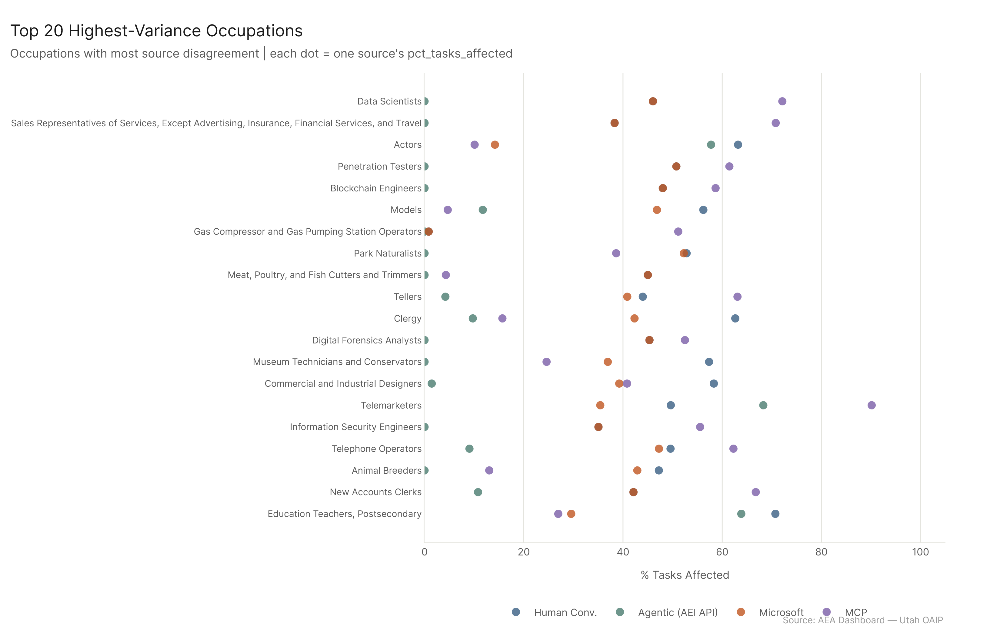
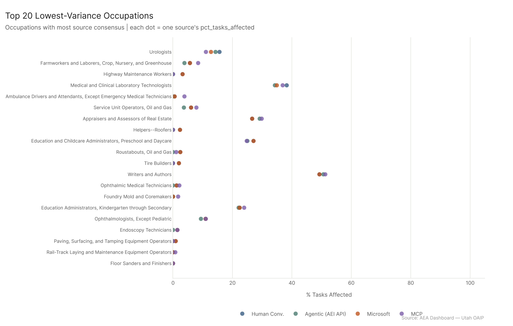
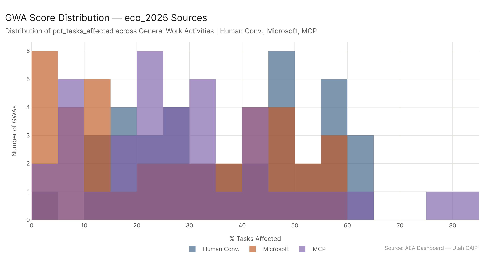

*Primary config: Four sources — AEI Conv + Micro 2026-02-12 | AEI API 2026-02-12 | Microsoft | MCP Cumul. v4 | Method: freq | Auto-aug ON | National*

**TLDR:** The four sources produce dramatically different score distributions across 923 occupations. Human Conv. is the most aggressive rater, with a mean of 32% and 81 occupations in the high tier. AEI API is the most conservative — median of just 8.6%, with 626 of 923 occupations scoring below 20%. Microsoft bunches in the middle. MCP spreads more widely than either but still leaves 445 occupations below 20%. The sources most disagree on knowledge-intensive white-collar roles like Data Scientists and Penetration Testers; they most agree on physical, low-cognitive roles like floor sanders and rail workers.

## Distribution Overview

Human Conv. is the only source that looks like a rough bell curve centered above 20%. Its mean is 32.1% and 81 occupations score 60%+. AEI API is the outlier: 67.8% of occupations score below 20%, and the distribution is heavily right-skewed — most occupations land near zero, with a long tail of highly exposed outliers. Microsoft is unusually compressed, with a tight range (mean 24.1%, std 12.3%) and zero occupations in the high tier — its cap appears to sit around 57-58%. MCP sits between Human Conv. and Microsoft, with mean 24.8% and a standard deviation close to Human Conv.'s (18.4%), but fewer high-tier hits (54 vs. 81).

The tier breakdown makes this concrete:

| Source | <20% | 20-40% | 40-60% | >=60% |
|---|---|---|---|---|
| Human Conv. | 280 | 342 | 220 | 81 |
| Agentic (AEI API) | 626 | 158 | 103 | 36 |
| Microsoft | 369 | 433 | 121 | 0 |
| MCP | 445 | 304 | 120 | 54 |

Human Conv. and AEI API are the two extremes. Microsoft is the most conservative of the confirmed-usage sources. MCP shows broader spread than Microsoft but a larger low-tier cohort.

## Source Agreement and Disagreement at Occupation Level

The mean cross-source standard deviation across all 923 occupations is substantial — occupations like Data Scientists (std=30.0) and Penetration Testers (std=27.6) show wild variation. Human Conv. rates Data Scientists well above 60% while AEI API gives them near zero; MCP fills in the gap at 72%. For occupations like these, the source you pick changes your conclusion by 50+ percentage points.

But about a fifth of occupations show genuine consensus. Floor Sanders, Rail-Track Laying Operators, and Endoscopy Technicians all have near-zero standard deviations — every source agrees these roles are barely AI-exposed. The variance structure is essentially monotone with occupation AI-intensity: the more genuinely information-dense the role, the more sources disagree about exactly how much is affected.

## GWA-Level Distribution (eco_2025 Sources)

The GWA analysis is restricted to the three sources using the eco_2025 O*NET baseline (Human Conv., Microsoft, MCP). Across 37 GWAs, Human Conv. again shows the widest spread. Microsoft is compressed but shows similar rank ordering to Human Conv. at the GWA level. MCP shows clear spikes at specific GWAs — particularly those involving information technology, scheduling, and data management — where it scores substantially higher than either comparator.

## Key Figures

## Key Takeaways

1. **AEI API is a fundamentally different kind of signal** — it measures confirmed agentic tool-use, so most occupations score low. The other three sources rely on expert assessments or conversation usage, which inflate scores by design.
2. **Microsoft's hard ceiling near 58%** suggests a methodological cap or saturation point in that dataset. It never reaches the high tier.
3. **High-variance occupations tend to be knowledge-intensive but ambiguous** — roles where AI could plausibly automate a lot or a little depending on assumptions.
4. **Low-variance occupations cluster at the extremes** — most are physical/manual and score consistently near zero across all sources.
5. **923 occupations; 81 score >=60% under Human Conv., but only 36 under AEI API** — that 45-occupation gap represents a real policy-relevant question about what "exposed" means.
