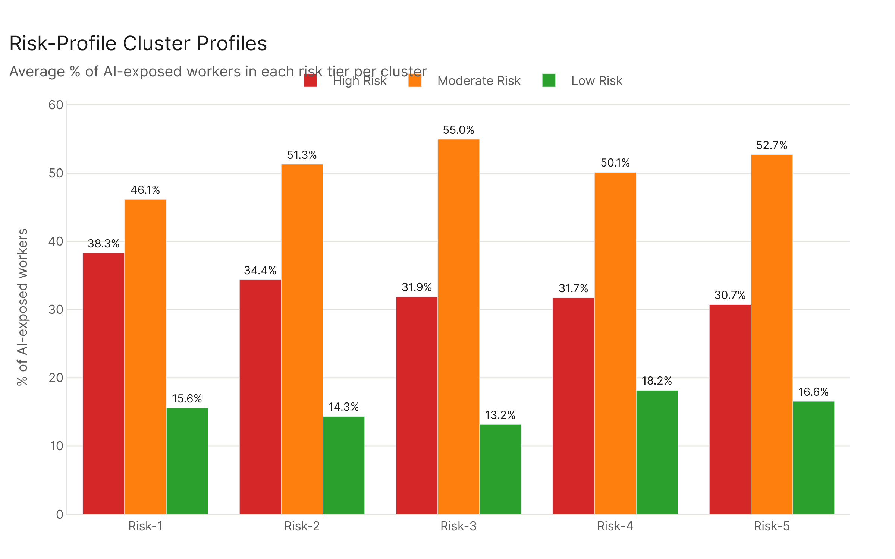
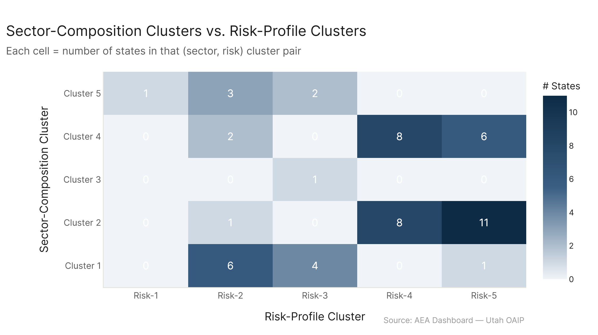

# State Clusters: Risk Profile

*Primary config: All Confirmed (AEI Both + Micro 2026-02-12) | Risk tiers from job_risk_scoring | freq method | auto-aug on*

When you cluster states by the risk-tier composition of their AI-exposed workforce, the resulting groups have only modest overlap with the sector-composition clusters from state_profiles (ARI = 0.24). The biggest surprise: the territories (Puerto Rico, U.S. Virgin Islands) have the highest concentrations of high-risk workers — not the tech-heavy states — and the large northeastern industrial states have the lowest. DC falls in the middle tier despite being the most knowledge-economy-intensive place in the country.

---

## What This Analysis Does

Each U.S. occupation has a pre-computed 7-factor risk score from the `job_exposure/job_risk_scoring` analysis. This analysis asks: when you weight each occupation's risk tier by how many workers a state has in that occupation, what share of each state's AI-exposed workforce is high/moderate/low risk? Then it clusters states by that distribution.

The feature matrix is three-dimensional: [% high-risk workers, % moderate-risk workers, % low-risk workers] per state, where "workers" means workers-affected (pct_tasks_affected × employment). K-means with k=5 is run on those three features.

---

## Five Risk Clusters

**Risk-1 — Highest Risk** (PR, VI): Average ~48% of AI-exposed workers in the high-risk tier. Both are Cluster 5 tourism/service economies. Their workforce is heavily concentrated in lower-zone, lower-wage occupations in sectors with high task exposure — food prep, sales, administrative support, personal care — which score high on the structural-vulnerability flags (job zone ≤ 3, below-average outlook). Average pct_high across these two geographies: 48.0%.

**Risk-2 — Elevated Risk** (AZ, FL, GA, GU, HI, ID, NM, NV, SC, SD, TX, + 2 more): Average ~44.7% high-risk workers. This group includes much of the Sun Belt (Cluster 1) and some rural states. The Sun Belt's elevated risk comes from its large share of sales, food service, and lower-tier service jobs that coexist alongside its tech sectors. High growth and population inflow hasn't yet translated into lower-risk occupational mixes.

**Risk-3 — Moderate Risk** (CA, CO, CT, DC, DE, MD, NC, NH, OR, RI, VA, VT, WA, + 1 more): Average ~41.4% high-risk workers. This cluster includes the tech-heavy Cluster 1 states (CA, CO, MD, VA, WA) and several small northeastern states. Their concentration of higher-zone professional roles pulls down the high-risk share. DC lands here — it has an unusually high-exposure workforce (government, IT, analysis) but those workers are mostly high-zone with good outlook, so they don't trigger many structural vulnerability flags.

**Risk-4 — Moderate-Low Risk** (AK, AL, AR, IA, IN, KS, KY, LA, MO, MS, MT, ND, NE, OK, WV, WY): Average ~41.4% high-risk workers. The bulk of the rural/agricultural Cluster 4 states. Their risk concentrations are similar to Risk-3 even though their economic profiles are very different, because two opposing forces roughly cancel out: lower wages and lower job zones push risk up, but lower tech saturation (n_software) and more stable but declining industries reduce some flags.

**Risk-5 — Lowest Risk** (CT, IL, MA, MI, MN, NJ, NY, OH, PA, WI + 6 more): Average ~38.5% high-risk workers. The large diversified northeastern and industrial Midwest states. Massachusetts has the single lowest pct_high of any state (35.9%). New York, Illinois, Pennsylvania, and Minnesota also cluster here. These states have relatively high concentrations of healthcare, education, and professional services workers with strong outlooks — occupations that score high on exposure but don't necessarily trigger the structural vulnerability flags.

---

## Risk Cluster Profiles

The difference between Risk-1 and Risk-5 is about 10 percentage points on pct_high (48% vs. 38%). That's a real difference but it's not enormous — the low-risk share (around 7-8%) is remarkably uniform across all clusters. What mainly varies is the split between high and moderate risk, not whether workers are in the risk system at all.

---

## Relationship to Sector Composition

The ARI between risk-profile clusters and sector-composition clusters is 0.24 — low. The two clusterings are measuring different things and largely disagree on which states belong together.

A few notable mismatches:
- **DC** (Cluster 3 in sector) lands in Risk-3 alongside states like CA and WA. Its uniquely knowledge-economy sector mix doesn't translate to uniquely low risk — because risk is about structural vulnerability, not just exposure level.
- **Territories** (Cluster 5 in sector) split: PR and VI go to Risk-1 (highest risk), GU goes to Risk-2. The service-economy profile maps directly to elevated structural risk.
- **Cluster 4 rural states** spread across Risk-3, Risk-4 — the homogeneous sector profile doesn't produce homogeneous risk tier distribution.
- **Cluster 1 tech/Sun Belt states** spread across Risk-2, Risk-3 — California and Washington end up in lower risk than Florida and Texas despite similar "tech economy" sector labels, because the actual occupation-level risk scores differ.

The weak ARI is itself informative: knowing what sector a state's economy is in doesn't strongly predict what fraction of its AI-exposed workers are in dangerous positions. Risk tier is shaped by finer-grained occupation-level features (job zone, outlook, n_software) that don't aggregate cleanly to the sector level.

---

## Config

| Setting | Value |
|---|---|
| Dataset | AEI Both + Micro 2026-02-12 (all_confirmed) |
| Risk tiers | From job_exposure/job_risk_scoring/results/risk_scores_primary.csv |
| Employment | eco_2025 emp_tot_{geo}_2024 per occupation |
| Feature | [pct_high, pct_moderate, pct_low] workers-affected by tier |
| Clustering | k-means k=5, StandardScaler, n_init=20 |

## Files

| File | Description |
|---|---|
| `results/state_risk_features.csv` | Per-state risk tier distribution |
| `results/cluster_assignments.csv` | State → risk cluster |
| `results/cluster_profiles.csv` | Avg pct_high/moderate/low per cluster |
| `results/vs_sector_composition.csv` | Both cluster assignments side-by-side |
| `figures/risk_tier_bars.png` | States sorted by pct_high, stacked bars |
| `figures/cluster_profiles.png` | Grouped bar: avg tier distribution per cluster |
| `figures/vs_sector_comp.png` | Sector vs. risk cluster tile count |
