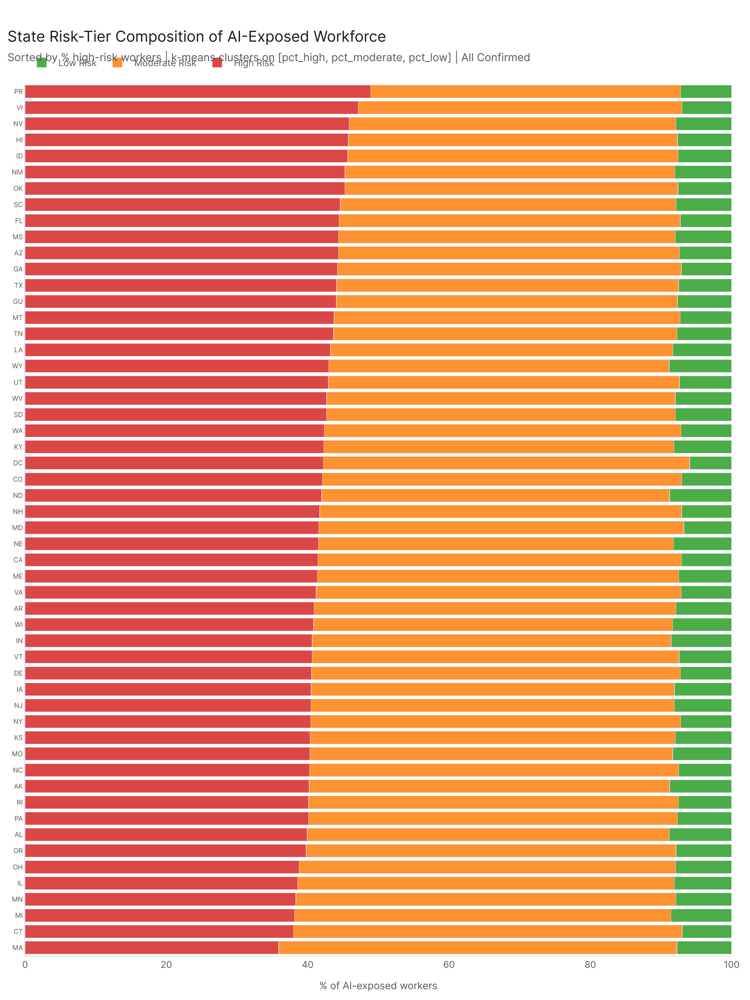
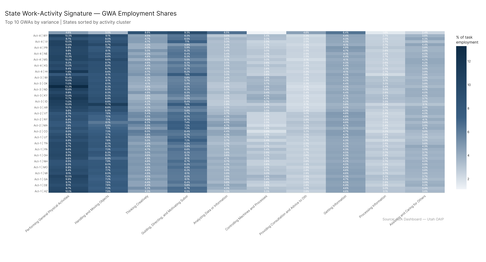
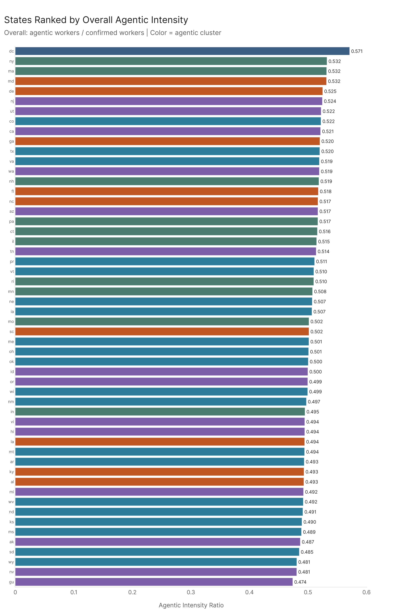
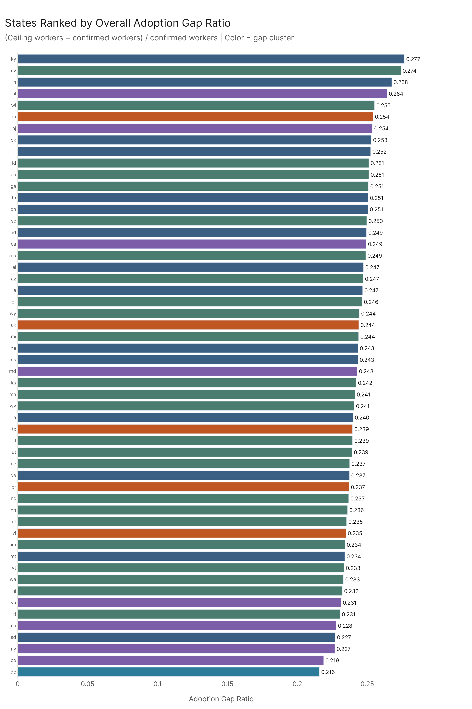

# State Clusters

*Primary config: All Confirmed (AEI Both + Micro 2026-02-12) | All Ceiling (All 2026-02-18) | Agentic Confirmed (AEI API 2026-02-12) | freq method | auto-aug on*

The economic_footprint/state_profiles analysis established that average pct_tasks_affected is essentially uniform (~36%) across all U.S. states, and that the meaningful variation is in the *sector composition* of each state's AI-exposed workforce — what industries the workers are in. This bucket pushes that further: instead of one fixed clustering, it runs independent clusterings on four additional analytical dimensions and asks whether the same state groupings emerge. The answer is no — the five schemes largely disagree with each other, with pairwise Adjusted Rand Index values all below 0.27. Each lens is measuring something genuinely different, and state policy that focuses on only one of them is probably missing most of the picture.

---

## 1. Risk Profile Clusters — Do some states have worse risk mixes?

*Full detail: [risk_profile_report.md](risk_profile/risk_profile_report.md)*

Clustering states by the employment-weighted share of AI-exposed workers in each risk tier (high/moderate/low, per job_risk_scoring's 7-factor model) produces five groups that only weakly overlap with sector composition (ARI = 0.24). The biggest surprise: Puerto Rico and U.S. Virgin Islands form their own high-risk cluster at ~48% high-risk workers — the tourism/service economy's combination of lower job zones and below-average outlooks concentrates structural vulnerability. Massachusetts has the single lowest pct_high of any state (35.9%), along with other large northeastern industrial states (NY, IL, PA) — their healthcare, education, and professional-services workforces have high exposure but not the structural vulnerability flags.

DC (Cluster 3 in sector composition) is risk-middle-of-the-road: its government and contractor workforce is highly exposed but high-zone, well-compensated, and mostly in stable positions, so it doesn't trigger the structural vulnerability flags. The risk clustering correctly treats DC as ordinary, even though sector composition correctly treats it as unique.

The weak ARI means sector composition doesn't predict risk tier distribution. Knowing what industries a state has doesn't tell you whether the workers are in safe or precarious positions. Those are separate axes.

---

## 2. Activity Signature Clusters — What types of work is AI touching in each state?

*Full detail: [activity_signature_report.md](activity_signature/activity_signature_report.md)*

Clustering by GWA (General Work Activity) shares of AI-exposed employment produces five groups: analytical/administrative (20 states), creative/executive (7 states), physical/industrial (12 states), manual/service (14 states), and DC alone. ARI vs. sector composition = 0.26 — the highest agreement of any cross-scheme comparison, but still low. Both capture "what type of work" states do, just from different angles.

The notable finding is how small the differences actually are. The gap between any two non-DC clusters on any GWA is less than 1 percentage point. AI exposure is already pre-selected for cognitive and administrative tasks, so the activity fingerprint converges across very different state economies. DC is the massive outlier: its AI-exposed workforce has +3.89pp more "Thinking Creatively" and +2.83pp more "Analyzing Data" than the national average — nothing else comes close.

---

## 3. Agentic Profile Clusters — How agentic vs. conversational is each state?

*Full detail: [agentic_profile_report.md](agentic_profile/agentic_profile_report.md)*

Clustering states by the ratio of agentic (AEI API) workers to confirmed (all confirmed) workers within each sector reveals the narrowest variation of all four analyses. The national average agentic intensity is 0.507; the state range is 0.474 (Guam) to 0.571 (DC). All pairwise ARI values involving agentic clusters are low (max 0.13), and agentic vs. adoption gap is essentially random (ARI = 0.03).

The practical implication: the agentic wave will reach states with roughly similar intensity (about half of confirmed exposure is already agentic). The geographic distribution of agentic AI exposure is not meaningfully clustered — except for DC, where the concentration of IT contracting and analytical government work pushes agentic intensity to 57%. Policy focused on "which states are most exposed to agentic AI" is roughly the same answer as "all of them."

---

## 4. Adoption Gap Clusters — Where is there the most room to grow?

*Full detail: [adoption_gap_report.md](adoption_gap/adoption_gap_report.md)*

The adoption gap (ceiling − confirmed) / confirmed averages 0.243 nationally, with a standard deviation of less than 0.01 across states. Kentucky has the highest state-level gap (0.277), DC the lowest (0.216). The five gap clusters have nearly identical overall gap ratios (0.216–0.248) — the clustering is finding small differences in the *sector profile* of the gap, not large differences in the total gap.

Gap-1 states (KY, IN, TN, SC, OK) have above-average gaps in Transportation and Production sectors — MCP capability extends further beyond confirmed usage in those occupations. DC has the lowest gap because its confirmed usage is already high relative to the ceiling; the knowledge-worker workforce has already adopted conversational AI heavily, leaving less room for ceiling expansion. ARI vs. risk = 0.08, vs. agentic = 0.03 — the adoption gap dimension is nearly orthogonal to everything else.

---

## 5. Cluster Convergence — Do the schemes agree?

*Full detail: [cluster_convergence_report.md](cluster_convergence/cluster_convergence_report.md)*

The maximum pairwise ARI across all scheme pairs is 0.26 (sector × activity). Every other pair is lower. Agentic × adoption gap is 0.03 — random. This means the five analytical lenses are genuinely measuring different aspects of state economies, not restating the same underlying structure.

DC is the most unstable state (stability score 0.07): it is consistently anomalous under every lens, but in different ways each time — a singleton by sector composition and activity signature, a moderate-risk state by risk profile, the highest-agentic-intensity state, and the lowest-adoption-gap state. It's not a coherent single outlier — it's five different kinds of outlier simultaneously.

The most stable states are WV, ME, WI, MO, KS — mid-sized industrial and rural states that consistently co-cluster with each other across multiple schemes. They're "typical" by multiple dimensions at once.

---

## Cross-Cutting Findings

**The five analytical lenses are largely independent.** ARI values between any two schemes top out at 0.26. This means that state-level AI policy that uses only sector composition as a planning input is working with at most a quarter of the predictive signal. Risk distribution, activity type, agentic intensity, and adoption gap require separate attention.

**Uniform pct_tasks_affected ≠ uniform impact.** The earlier finding that average task exposure is ~36% everywhere still stands. But the *shape* of that exposure (what kinds of workers are at risk, what activities are affected, how much room to grow) is not uniform. States that look identical on headline metrics can differ substantially on secondary dimensions.

**DC and the territories are outliers by very different mechanisms.** DC is a singleton in sector composition and activity signature because its occupation mix is genuinely unique. But it's not the highest-risk state — its workers are too well-positioned for structural vulnerability. The territories (PR, VI) are ordinary in sector composition (they land in Cluster 5 alongside HI and NV) but are the highest-risk cluster because their service-economy occupations score very poorly on the structural vulnerability flags. These are different kinds of "unusual."

**Rural/industrial Midwest is the most "typical" economy by multiple dimensions.** West Virginia, Maine, Wisconsin, Missouri, Kansas consistently cluster with each other across multiple schemes. This is the stable center of the analysis — mid-tier risk, ordinary activity mix, average agentic intensity, average adoption gap. Nothing unusual about them from any angle — which could mean their challenges are less likely to be recognized as distinctive.

**Agentic intensity and adoption gap are orthogonal to everything.** The near-zero ARI between these two dimensions and all others suggests that neither "how agentic vs. conversational is a state" nor "how much room does AI have to spread further" follows predictably from anything else about the state. They require direct measurement, not inference from other observable state characteristics.

---

## Key Takeaways

1. **ARI max = 0.26.** No two clustering schemes strongly agree. The different analytical lenses are genuinely measuring different things about state economies.

2. **Risk varies significantly (35.9% to 48.9% pct_high workers).** Puerto Rico and the U.S. Virgin Islands have the highest concentrations of high-risk workers. Massachusetts has the lowest. Sector composition doesn't predict this (ARI 0.24).

3. **Activity signature variation is real but narrow.** DC is 3–4pp above the national average on analytical and creative GWAs. Other state differences are sub-1pp. AI exposure is cognitively concentrated regardless of industrial structure.

4. **Agentic intensity barely varies (±7pp, mostly DC).** The agentic wave will hit all states with roughly equal intensity. This is not a dimension that calls for geographically differentiated policy.

5. **Adoption gap is nearly uniform (avg 0.243, range 0.216–0.277).** Kentucky has the most room for AI to spread further; DC has the least. The gap is more about sector mix within states than state-level economic character.

6. **DC is the most unstable outlier.** Stability score 0.07 — it's consistently anomalous but in different ways across lenses. No other geography is simultaneously an outlier on so many dimensions.

7. **Each lens needs separate policy attention.** Knowing a state's sector type predicts less than 30% of the variance in any other dimension. Comprehensive AI-readiness planning requires independent assessment of risk tier distribution, work activity profile, agentic intensity, and adoption gap.

---

## Sub-Report Index

| Sub-Analysis | Report | What It Answers |
|---|---|---|
| Risk Profile | [risk_profile_report.md](risk_profile/risk_profile_report.md) | Which states have the most high-risk workers by employment weight? |
| Activity Signature | [activity_signature_report.md](activity_signature/activity_signature_report.md) | What types of work is AI touching in each state's exposed workforce? |
| Agentic Profile | [agentic_profile_report.md](agentic_profile/agentic_profile_report.md) | How agentic vs. conversational is each state's AI exposure? |
| Adoption Gap | [adoption_gap_report.md](adoption_gap/adoption_gap_report.md) | How much further could AI spread in each state beyond current confirmed usage? |
| Cluster Convergence | [cluster_convergence_report.md](cluster_convergence/cluster_convergence_report.md) | Do all five clustering schemes agree on state groupings? |

## Config Reference

| Config Key | Dataset | Role |
|---|---|---|
| `all_confirmed` | AEI Both + Micro 2026-02-12 | Primary baseline for all sub-questions |
| `all_ceiling` | All 2026-02-18 | Ceiling for adoption gap analysis |
| `agentic_confirmed` | AEI API 2026-02-12 | Agentic intensity numerator |
| `agentic_ceiling` | MCP + API 2026-02-18 | Not used directly (adoption gap uses all_ceiling) |
| `human_conversation` | AEI Conv + Micro 2026-02-12 | Not used in this bucket |
