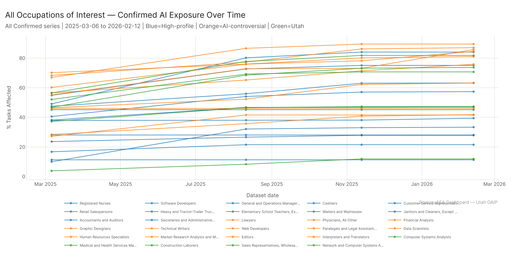
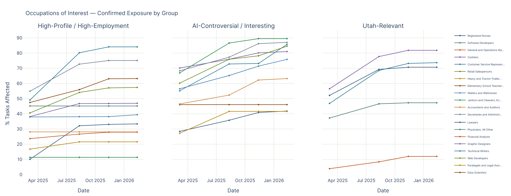
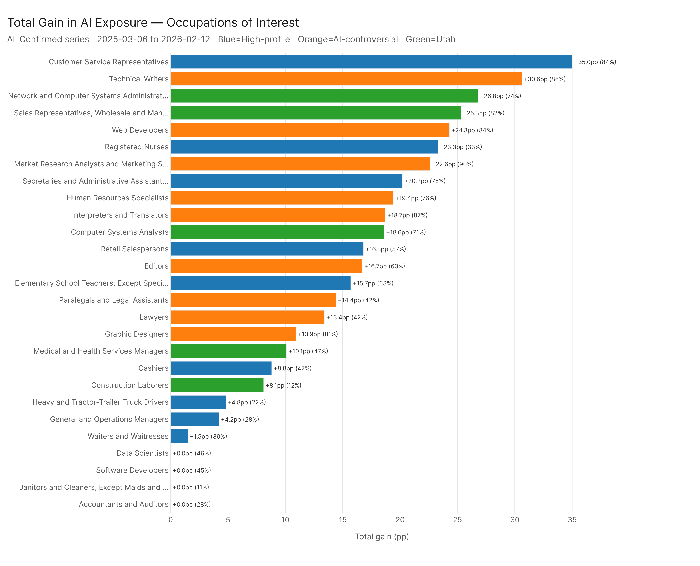
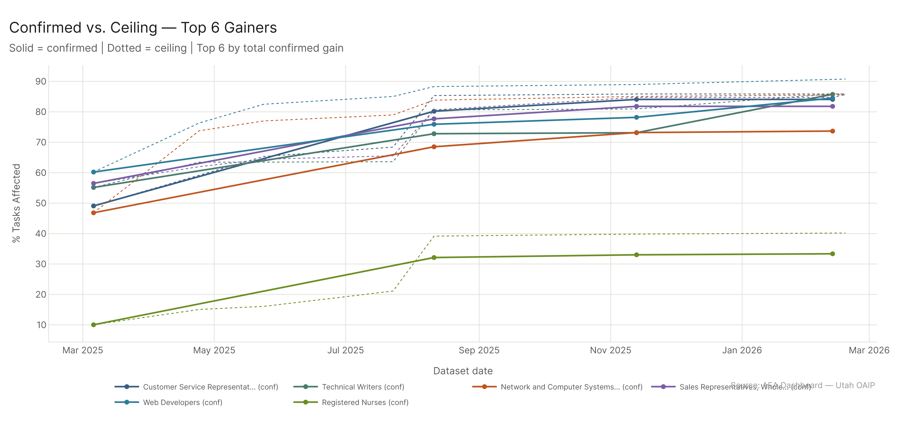

# Occupations of Interest Timeline

*Config: all_confirmed series (AEI Both + Micro, 4 dates Mar 2025 – Feb 2026) | all_ceiling series (All Sources, 8 dates Mar 2025 – Feb 2026) for comparison | Method: freq | Auto-aug ON | National*

---

The 29 named occupations tell a heterogeneous story. Customer Service Representatives grew 35.0 percentage points from March 2025 to February 2026 — the largest gain of any named occupation in the window. Technical Writers grew 30.6pp. The biggest single-step jumps were concentrated in August 2025, with most occupations seeing their largest gain at that date. Software Developers (45.2%), Data Scientists (46.0%), and Accountants and Auditors (28.1%) are completely flat — literally the same confirmed value across all 4 dates. Registered Nurses, at 10.0% in March 2025, ended at 33.4% — just crossing the 33% risk gate by the final date.

---

## The Top Gainers

The five highest-gaining occupations by total confirmed pct gain (March 2025 to February 2026):

| Occupation | Group | Mar 2025 | Feb 2026 | Gain | Biggest Jump |
|------------|-------|----------|----------|------|-------------|
| Customer Service Representatives | High-Profile | 49.1% | 84.1% | +35.0pp | Aug 2025 (+31.1pp) |
| Technical Writers | AI-Controversial | 55.2% | 85.8% | +30.6pp | Aug 2025 (+17.7pp) |
| Network and Computer Systems Administrators | Utah-Relevant | 46.8% | 73.7% | +26.8pp | Aug 2025 (+21.7pp) |
| Sales Representatives (Wholesale/Mfg) | Utah-Relevant | 56.5% | 81.8% | +25.3pp | Aug 2025 (+21.2pp) |
| Web Developers | AI-Controversial | 60.2% | 84.5% | +24.3pp | Aug 2025 (+15.7pp) |

Customer Service Representatives' 35pp gain over the window is anchored almost entirely in the August 2025 update (+31.1pp at that single step). CSR work — conversational AI, email handling, knowledge base lookup, escalation routing — is the core of what AI systems have demonstrably taken on.

Technical Writers went from 55.2% to 85.8%. Like CSR, the August 2025 update was the inflection point. Web Developers and Network Admins show a similar pattern: large single-step jump at August 2025, with smaller gains before and after.

Note: Human Resources Specialists (+53.5pp) and Market Research Analysts (+49.7pp) showed larger total historical gains, but their biggest jump occurred before March 2025 — before this window opens. Their March 2025 starting values (56.5% and 66.9% respectively) already reflect those gains.

---

## The Flat Ones Are Equally Surprising

Four occupations showed essentially zero growth across all 4 dates:

| Occupation | Group | Mar 2025 | Feb 2026 | Gain |
|------------|-------|----------|----------|------|
| Software Developers | High-Profile | 45.2% | 45.2% | 0.0pp |
| Data Scientists | AI-Controversial | 46.0% | 46.0% | 0.0pp |
| Accountants and Auditors | High-Profile | 28.1% | 28.1% | 0.0pp |
| Janitors and Cleaners | High-Profile | 11.3% | 11.3% | 0.0pp |

These aren't rounding artifacts — confirmed AI exposure is identical across all four dates. No new tasks were confirmed, no previously-confirmed tasks were removed.

Software Developers and Data Scientists are the notable ones. Both are AI-adjacent, work with AI tools daily, and sit at 45–46% confirmed exposure — substantial. But the frontier of confirmed capability for these occupations had fully stabilized before March 2025 and hasn't moved. Accountants and Auditors (28.1%, flat) is similar: moderate, frozen exposure. Janitors and Cleaners (11.3%, flat) makes sense — physical cleaning work.

---

## The Jump Pattern: August 2025

Within this window, virtually every named occupation that grew saw its largest single step at August 2025 (AEI Both + Micro 2025-08-11):

Customer Service Representatives (+31.1pp), Network and Computer Systems Administrators (+21.7pp), Sales Representatives (+21.2pp), Registered Nurses (+22.1pp), Secretaries and Administrative Assistants (+17.8pp), Technical Writers (+17.7pp), Computer Systems Analysts (+17.1pp), Web Developers (+15.7pp).

August 2025 is the dominant inflection point for this window. It's a step-function pattern — confirmed exposure advances in discrete jumps as dataset updates validate new capabilities across clusters of related occupations.

Note: March 2025 was also a major jump date, but those gains are already baked into the starting values of this window (HR Specialists, Market Research Analysts, and others had their largest jumps at March 2025).

---

## Registered Nurses: Just Crossing the Gate

Registered Nurses (RNs) deserve specific attention. At 10.0% confirmed exposure in March 2025, nursing was in the Low tier. The August 2025 update added 22.1pp — the largest single jump for RNs and one of the largest across all named occupations. By February 2026, RNs are at 33.4% — just at the 33% risk gate.

That 22pp jump in a single dataset update likely reflects the expansion of confirmed AI coverage in healthcare documentation and care planning (consistent with the WA tipping points analysis). Nursing involves a lot of documentation work, and the tasks in that domain received broader confirmed coverage in the August 2025 dataset update.

At 33.4%, RNs are now risk-gate-eligible. Whether they score as high-risk depends on the other factors (SKA gap, outlook, job zone), but they've entered the zone where the analysis applies.

---

## High-Profile Occupations: A Mixed Picture

The 12 high-profile/high-employment occupations vary from explosive growth to complete flatness:

| Occupation | Final Level | Change (Mar 2025–Feb 2026) |
|------------|-------------|---------------------------|
| Customer Service Representatives | 84.1% | +35.0pp |
| Secretaries and Administrative Assistants | 75.1% | +20.2pp |
| Elementary School Teachers | 63.2% | +15.7pp |
| Registered Nurses | 33.4% | +23.3pp |
| Retail Salespersons | 57.4% | +16.8pp |
| Cashiers | 46.9% | +8.8pp |
| Heavy Truck Drivers | 21.5% | +4.8pp |
| Waiters and Waitresses | 39.4% | +1.5pp |
| General and Operations Managers | 27.9% | +4.2pp |
| Accountants and Auditors | 28.1% | 0.0pp |
| Software Developers | 45.2% | 0.0pp |
| Janitors and Cleaners | 11.3% | 0.0pp |

Customer Service Representatives at 84.1% is the standout. This is one of the most employment-dense occupations in the economy and it's now the most AI-exposed high-employment role of interest. The confirmed exposure covering CSR work includes conversational AI, email handling, knowledge base lookup, and escalation routing — tasks that AI systems have demonstrably taken on.

Waiters and Waitresses (+1.5pp to 39.4%) nearly stalled. Cashiers (+9.8pp to 46.9%) grew modestly. Heavy Truck Drivers (+5.3pp to 21.5%) are still low. The pattern across high-employment occupations is polarized: either explosive growth or near-stagnation.

---

## Confirmed vs. Ceiling for Top Gainers

For the six highest-gaining confirmed occupations, the ceiling sits considerably higher than confirmed in most cases — meaning there's more potential AI capability above what's currently confirmed. The confirmed/ceiling gap is most visible for occupations in the 75–85% confirmed range, where the ceiling may be 90%+.

---

## Config

Confirmed: `AEI Both + Micro` series (4 dates 2025-03-06 → 2026-02-12) | Ceiling: `All` series (8 dates 2025-03-06 → 2026-02-18) | 29 OCCS_OF_INTEREST occupations

## Files

| File | Description |
|------|-------------|
| `results/occs_timeline.csv` | Full time series: all 29 occupations × all dates × both configs |
| `results/occs_summary.csv` | Summary stats per occupation: start, end, total gain, max jump, jump date |
| `figures/all_occs_confirmed.png` | All 29 occupations over time, confirmed config (committed) |
| `figures/occs_faceted_by_group.png` | Three-panel view by occupation group (committed) |
| `figures/occs_total_gain.png` | Total gain bar chart for all 29 occupations (committed) |
| `figures/top6_confirmed_vs_ceiling.png` | Confirmed vs ceiling for top 6 gainers (committed) |
