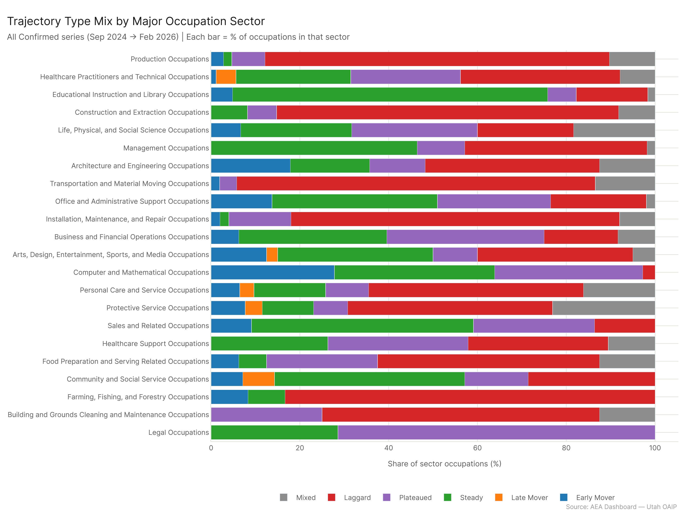
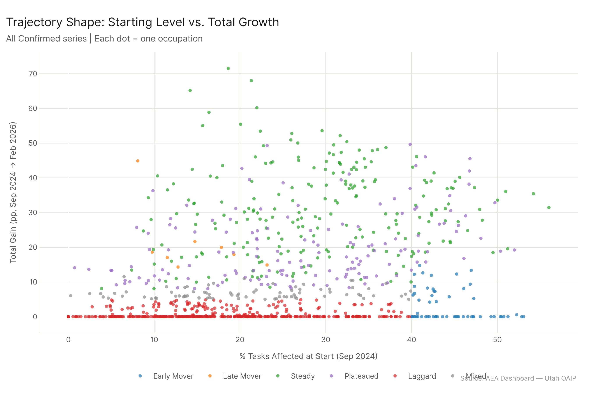
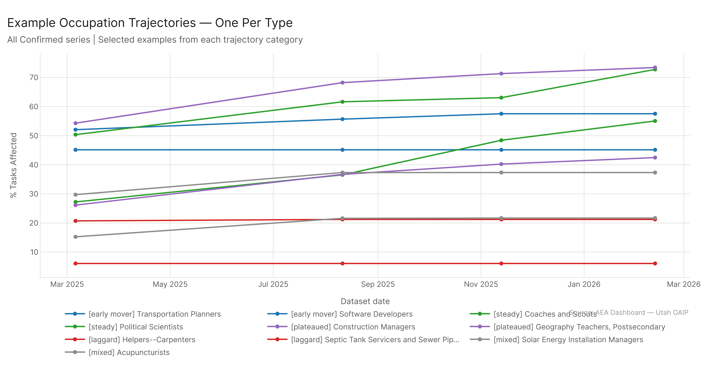

# Trajectory Shapes: How Occupations Grew

*Config: all_confirmed series (AEI Both + Micro, 6 dates Sep 2024 – Feb 2026) | Method: freq | Auto-aug ON | National*

---

Nearly half of all occupations — 406 of 923 — went basically nowhere over 16 months: their confirmed AI exposure moved less than 5 percentage points. The action was concentrated in a 222-occupation "steady grower" group that moved from an average of 29% to 60% confirmed exposure over the period, and a 153-occupation "plateaued" group that grew strongly in the first half and then stalled. The occupations you'd most expect to see growing — Computer and Mathematical, Architecture and Engineering — largely didn't. They were early movers that were already high and stayed high. The sectors that grew most consistently were Educational Instruction and Library (44 steady growers), Management (26), and Healthcare (23).

---

## The Six Trajectory Types

Each occupation was classified based on how its confirmed exposure changed across 6 dataset snapshots (Sep 2024 to Feb 2026), not just the first-to-last delta. The full classification logic distinguishes starting level, total gain, early-period gain vs. late-period gain, and growth monotonicity.

| Type | Count | Avg Start | Avg End | Avg Gain |
|------|-------|-----------|---------|----------|
| **Laggard** | 406 | 18.3% | 19.1% | +0.8pp |
| **Steady** | 222 | 29.0% | 59.7% | +30.7pp |
| **Plateaued** | 153 | 27.2% | 47.1% | +19.9pp |
| **Mixed** | 77 | 20.9% | 27.7% | +6.8pp |
| **Early Mover** | 57 | 44.4% | 47.6% | +3.1pp |
| **Late Mover** | 8 | 14.7% | 35.8% | +21.2pp |

The laggard category is the most important for understanding what didn't happen. 406 occupations — 44% of the total — are not occupations where AI made meaningful additional inroads during the measurement window. They're almost entirely in physical, operational, or equipment-dependent work: Transportation and Material Moving, Construction, Production, Installation and Repair. These sectors don't appear because AI systems couldn't score their tasks; they appear because confirmed capability didn't grow there.

---

## The Steady Growers

The 222 steady-grower occupations are the core of the AI expansion story. Starting around 29% confirmed exposure, they grew consistently across both the first half (Sep 2024 to Aug 2025) and the second half (Aug 2025 to Feb 2026), landing near 60% average confirmed exposure by the end.

Which sectors dominate the steady-grower category? Educational Instruction and Library leads with 44 occupations — more than any other sector and nearly 70% of that sector's total occupations. This is consistent with the finding in other analyses that education is one of the fastest-expanding AI application areas. Management occupations (26 steady growers, 46% of the sector) and Healthcare (23 steady growers) round out the top three.

The "steady" classification isn't the same as "fast." A steady grower that went from 25% to 52% gained 27pp, but spread that gain across both time periods rather than front-loading it. The practical implication: these are occupations where AI capability was being incrementally validated over time, not ones that got a big bang from a single dataset update.

---

## Plateaued: Early Gains That Stalled

The 153 plateaued occupations tell a different story. They showed real growth — starting at 27% and reaching 47% on average — but most of that gain came in the first half of the window. By mid-2025, growth slowed substantially. By Feb 2026, many of these occupations looked similar to where they were in Aug 2025.

Why might an occupation plateau? A few possibilities: the tasks that AI demonstrably covers in that occupation were all scored early, and there simply weren't new capability demonstrations to add. Or the occupation's remaining tasks involve a harder domain where AI hasn't made confirmed progress. Alternatively, this could reflect measurement limitations — once a task is scored, it stays scored at the same level until the dataset is updated with new evidence.

The practical question for this category: is the plateau temporary or permanent? Occupations in the 40–50% range have a lot of room to grow toward the 60%+ threshold. Whether they get there depends on whether AI systems get confirmed on additional tasks in their domain.

---

## Early Movers: Already There

The 57 early movers — starting at 44% and ending at 48%, a gain of only 3pp — were already high-exposure in September 2024 and didn't add much during the measurement period. Computer and Mathematical (10 occupations) and Architecture and Engineering (10 occupations) lead this group.

This has an interesting implication. The occupations most obviously associated with AI in public discourse — computer-related, technical, quantitative work — were already exposed in the first confirmed dataset. They're not the growth story. The growth story is in the sectors that started lower and climbed: Education, Management, Healthcare. The "AI is coming for tech workers first" narrative doesn't match this pattern; AI was already there by the time the first dataset was captured.

---

## Late Movers: The Exception

Only 8 occupations fit the late-mover profile: starting below 28% at the midpoint (Aug 2025) and then gaining 10+ percentage points in the second half. These are the rare cases where confirmed AI capability expanded significantly in the 2025–2026 period for work that had been relatively untouched before. The small count suggests that truly new AI footholds — rather than continued growth in already-exposed work — were uncommon in this period.

---

## What Trajectory Tells You

The sector-by-sector trajectory mix reveals where the AI transition is in different parts of the economy.

Sectors with mostly laggards (Transportation, Construction, Production, Installation/Repair) are in a genuine pause or plateau. Confirmed AI capability hasn't been expanding there.

Sectors with mostly steady growers (Education, Management, Healthcare) are in active expansion — confirmed exposure is growing consistently and hasn't peaked.

Sectors with mixed early-mover and steady patterns (Computer/Math, Architecture/Engineering, Business/Finance) represent occupations that were early and either held steady or continued growing.

The sector breakdown also highlights the gap between what the media narrative emphasizes and what the data shows. Education — not tech — is the sector with the most occupations in consistent, active AI exposure growth.

---

## Config

Dataset: `AEI Both + Micro` series (6 dates: 2024-09-30, 2024-12-23, 2025-03-06, 2025-08-11, 2025-11-13, 2026-02-12) | Method: freq | Auto-aug ON | National | Occupation level

## Files

| File | Description |
|------|-------------|
| `results/trajectory_classifications.csv` | All 923 occupations with trajectory type, start/end/gain values, major sector |
| `results/trajectory_summary.csv` | Count, avg start, avg end, avg gain per trajectory type |
| `results/sector_trajectory_matrix.csv` | Count of each trajectory type per major sector |
| `figures/trajectory_type_by_sector.png` | Stacked bar: trajectory mix per sector (committed) |
| `figures/trajectory_scatter.png` | Scatter: total gain vs starting level, colored by type (committed) |
| `figures/trajectory_example_lines.png` | Line chart: example occupations per trajectory type (committed) |
