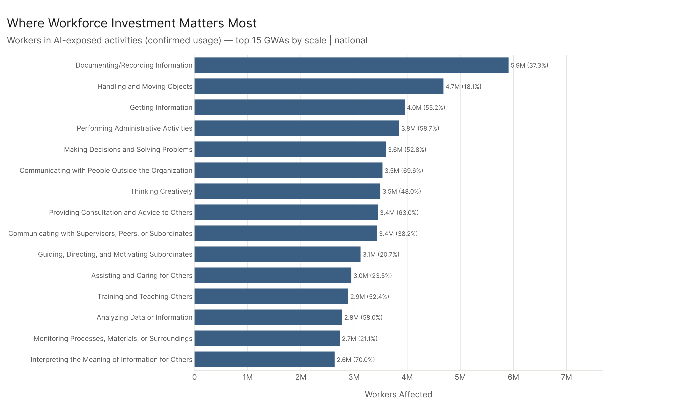
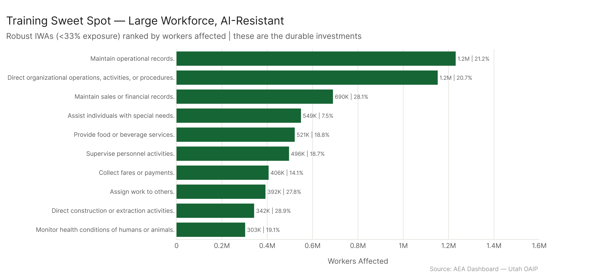
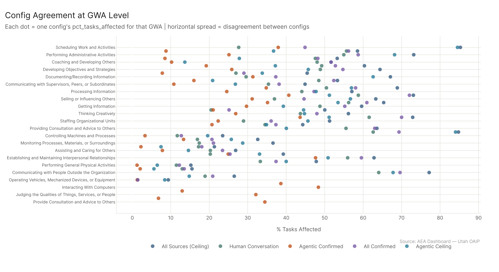
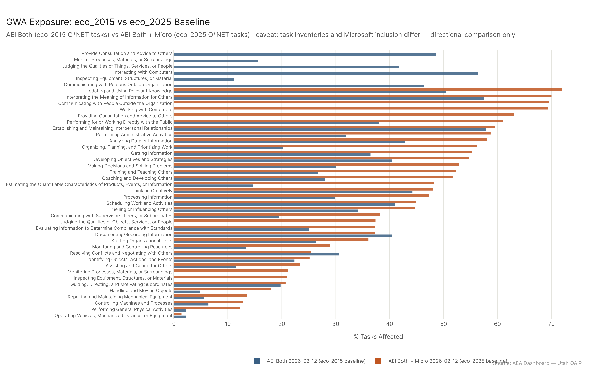
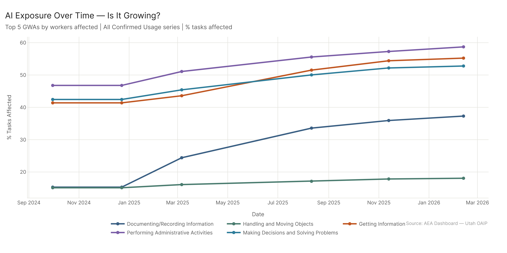

# Work Activity Exposure: Audience Framing

Four audiences need four different framings. The core framework running through all of them: AI exposure isn't a single signal, it's three different situations — activities where training directly builds durable value, activities where the AI × human pair is where investment belongs, and activities where the human role is shifting to oversight and direction of AI. Where any given activity falls depends on the tier and trend. 82% of affected workers are in moderate-or-fragile activities. The physical/cognitive boundary is the defining line.

---

## For Policymakers

The investment question is: where does workforce development funding have the highest return given AI's trajectory?

The key number: **82% of workers affected are doing activities with ≥33% AI exposure.** That's 64.5M out of 78.6M workers in activities with meaningful AI overlap. The at-risk population is not a niche — it's most of the working population.

The three-category framework maps directly onto three types of policy investments:

**Fund toward durable activities** — the 68 educationally-relevant IWAs that are robust across all configs and associated with occupations requiring real training: healthcare work, supervisory and compliance activities, financial examination, safety monitoring. These are where training dollars will hold their value. 5.2M workers, mean job zone 3+. The large-workforce cases: direct organizational operations (1.15M workers), assisting individuals with special needs (549K), personnel supervision (496K).

**Support AI × human pair transitions** — the 116 moderate-tier IWAs covering 40.9M workers, split between 84 stable-moderate activities and 32 rising-moderate activities. The rising-moderate group (8.2M workers, fast trend) is where transition support is most urgent: "analyze data to improve operations" (+31pp), "maintain health or medical records" (+27pp), "develop educational programs" (+29pp). These workers are in activities heading toward the delegation category and need AI collaboration skills now, not when the transition is complete.

**Prepare for delegation-zone disruption** — the 52 fragile IWAs (23.6M workers) plus 42 next-wave activities (7.0M workers). Programs built around fragile activities (customer service, legal documentation, marketing, technical explanation) should not be treated as long-term investments. Programs built around administrative efficiency (scheduling, operational records, task assignment — the next-wave group) should include transition pathways from the start.

The most important policy signal: **the education system's own core activities are growing fastest.** Evaluating student work (+77pp), assessing student capabilities (+54pp), developing lesson materials (+50pp). Policy intervention in how schools are adapting to AI shouldn't wait for educators to self-report.

The ceiling data is the forward indicator: "Scheduling Work and Activities" is 45% confirmed but 85% ceiling; "Documenting/Recording Information" is 37% confirmed but 67% ceiling. The next wave is agentic deployment in operational and administrative work. Programs built around these activities should be time-limited with clear transition pathways.

---

## For Workforce Development and Educators

The three-category framework is the practical planning tool:

**Category 1 — Build training around durable activities.** The activities that are AI-resistant AND associated with education-requiring occupations: healthcare work (monitoring health conditions, conferring with other practitioners, assisting during procedures), supervisory and management activities (directing operations, supervising personnel), compliance and inspection work (financial examination, regulatory monitoring, safety inspection). These activities require situational judgment, physical presence, or relational knowledge that AI doesn't replicate well — and they're associated with occupations that require real preparation to enter.

**Category 2 — Teach AI collaboration for moderate-tier activities.** The largest category (40.9M workers). The question isn't whether to include AI tools in the curriculum — they're already being used in these activities. It's what the human needs to know to work effectively alongside AI: how to evaluate AI-generated outputs, how to direct AI toward the right goals, how to maintain the contextual judgment that AI lacks. For rising-moderate activities (fast trend), add explicit preparation for oversight roles — the shift from doing to reviewing and directing is coming faster.

**Category 3 — Teach oversight and direction for delegation activities.** For fragile activities (customer service, legal documentation, marketing, data analysis, software design), the curriculum question is what the human role looks like after AI handles the baseline execution. That role is: setting context, validating outputs, handling exceptions that don't fit the pattern, maintaining accountability. This is a real skill set — it just looks different from the traditional version of the same work.

**What this means for prompting:** AI prompting sits inside the fragile zone ("Working with Computers" at 69%, "Operate computer systems or computerized equipment" at 77%). Prompting is a useful skill today, but it falls in the delegation category — it's increasingly something AI systems assist with, and the underlying AI capability is itself AI-reached. The more durable investment is in the judgment layer above prompting: knowing what you're trying to accomplish well enough to evaluate whether the AI got it right, and knowing enough about the domain to catch when it didn't. That judgment layer is what sits in the AI × human pair category, not the execution layer.

The uncertainty: for rising-moderate and next-wave activities, we can say the direction of travel but not the timeline. Build AI collaboration skills now, and revisit which activities have crossed into the delegation zone as datasets update.

---

## For Researchers

The methodological framing: what does this data actually support, and where are the key uncertainties?

**What's novel:** mapping AI exposure at the IWA level rather than occupation level reveals within-occupation variation that occupation-level analysis misses. A registered nurse's task set spans activities from "monitor health conditions" (19% — robust) to "respond to customer inquiries" (75% — fragile). Occupation-level analysis averages over that variation. Activity-level analysis surfaces it.

**What the data supports:** activity-level ranking of AI exposure across five independent data sources. The config comparison at the GWA level shows where sources agree (legal/writing/analysis: tight clustering) and where they diverge (scheduling, documentation, coaching: wide spread). The widest cross-config disagreements:

| GWA | Confirmed % | Ceiling % | Range |
|-----|------------|-----------|-------|
| Scheduling Work and Activities | 44.9% | 85.3% | 40.4pp |
| Coaching and Developing Others | 51.7% | 13.7% | ~38pp |
| Documenting/Recording Information | 37.3% | 67.1% | 29.8pp |
| Training and Teaching Others | 52.4% | 53.3% | 32.5pp |

These disagreements are architecturally specific — they reflect which AI interface is being deployed for each activity type, not measurement uncertainty about whether AI can do the work.

**Variation across all five configs** is shown in detail in the activity_robustness cross-config stability chart, which filters to IWAs where configs disagree by more than 3pp. For a full GWA-level view, the researcher config comparison chart (below) shows all five configs' pct values for each GWA. These charts are the right place to look for config spread — see also `activity_robustness/figures/cross_config_stability.png`.

**The eco_2015 vs eco_2025 baseline comparison:** This analysis uses pre-combined datasets (is_aei=False), which means all five configs use the eco_2025 O*NET baseline. To provide the second perspective: the chart below compares GWA exposure using "AEI Both 2026-02-12" (raw AEI data → eco_2015 baseline) vs. "AEI Both + Micro 2026-02-12" (pre-combined → eco_2025 baseline).

Important caveats before interpreting this comparison:
1. **Task inventories differ**: eco_2015 and eco_2025 use different O*NET task sets. The GWA/IWA category names are the same, but the underlying tasks differ. Absolute value differences reflect both the baseline change and the task inventory change.
2. **Microsoft inclusion**: the eco_2025 dataset adds Microsoft Copilot scores. Much of the upward shift in eco_2025 reflects Microsoft's broader coverage of organizational workflow activities.
3. **This is directional, not calibrated**: the comparison shows which GWAs shift when you change the baseline, not a precise measurement of the baseline effect.

Key findings from the comparison:
- Largest eco_2025 > eco_2015 gaps: "Organizing, Planning, and Prioritizing Work" (+35.9pp, from 20% to 56%), "Estimating Quantifiable Characteristics" (+33.6pp, from 15% to 48%), "Performing Administrative Activities" (+26.8pp, from 32% to 59%), "Training and Teaching Others" (+25.6pp, from 27% to 52%)
- GWAs where eco_2015 ≥ eco_2025: "Resolving Conflicts and Negotiating" (30.6% eco_2015 vs 25.4% eco_2025, -5.2pp), "Documenting/Recording Information" (40.4% vs 37.3%, -3.1pp)
- The large upward shift in organizational/administrative GWAs is primarily the Microsoft contribution — Copilot usage reflects those organizational workflows heavily

At the IWA level, both baselines have 332 matching activities (the IWA taxonomy is consistent between eco_2015 and eco_2025). The full comparison is in `results/researcher_eco_baseline_comparison_iwa.csv`.

**What the data doesn't support:** causal claims about whether AI exposure leads to employment changes. This is usage correlation and capability assessment data, not labor market outcome data.

---

## For Laypeople

The plain-language version of what this data says.

**Is AI a fad?**

No. 284 out of 332 work activity categories got more AI-exposed between September 2024 and February 2026. That's 86% of the activity spectrum moving in the same direction. 72 activity types went from essentially zero AI impact to meaningfully impacted in 15 months.

**What should I think about my own job?**

The useful frame is the three categories: Is your job primarily in activities that AI doesn't reach well yet (physical presence, real-time situational judgment, direct care)? Then the durable training investments are in the activity itself. Is your job primarily in activities where AI is reaching but human judgment still matters (moderate exposure, slow trend)? Then the investment is in understanding how to work effectively with AI. Is your job primarily in activities where AI is already doing a lot of the work (high exposure, strong trend)? Then the investment is in what the human does after AI handles the baseline — reviewing, directing, catching errors.

**Will my kids need to be programmers?**

Probably not in the traditional sense. Software design is 74% AI-exposed — the programming tasks themselves are highly AI-reachable. The question isn't whether to learn technical skills, it's whether to train toward the execution layer (AI-reachable) or the judgment layer (less AI-reachable). Someone who deeply understands what they're trying to build will use AI coding tools more effectively than someone who just knows how to write code.

**What's actually durable?**

The activities that remain below 33% exposure across all five data sources, in occupations requiring real preparation: healthcare work, supervisory activities, compliance and safety inspection, financial examination, patient care support. These require physical presence, professional judgment in real environments, and the ability to catch things that don't fit the expected pattern. That's what the data says is hard to replace.

**The honest answer about the middle:**

40.8M workers are in moderate-tier activities — neither safe nor already restructured. For most of them, the trajectory is toward more AI in the workflow, with the human role shifting over time. The question "what do I do about this?" doesn't have a fixed answer yet, because the activities themselves are still moving. Building AI literacy — knowing what AI can and can't do, how to evaluate its outputs, how to direct it effectively — is the hedge that works across multiple future scenarios.

**So what should I tell my kid to study?**

The data points toward: physical competency and situational judgment, caregiving and direct service, supervisory and management work, clinical and healthcare skills, and the evaluation layer above AI output rather than the generation layer. The exposed activities aren't worthless — someone who deeply understands legal research, marketing strategy, or data analysis will use AI tools more effectively than someone who doesn't. The exposed activities are restructuring, not disappearing.

---

## Config

- **Primary**: AEI Both + Micro 2026-02-12 | freq | auto-aug on | national
- **Ceiling**: All 2026-02-18 | freq | auto-aug on | national
- **Trend**: AEI Both + Micro series (2024-09-30 → 2026-02-12)
- **eco_2015 comparison**: AEI Both 2026-02-12 (is_aei=True) vs AEI Both + Micro 2026-02-12 (is_aei=False)

## Files

| File | Description |
|------|-------------|
| `results/policy_key_stats.csv` | High-level policy statistics |
| `results/workforce_training_sweet_spot.csv` | Top 10 durable IWAs from training framework |
| `results/researcher_config_spread.csv` | GWA config spread and CV |
| `results/researcher_eco_baseline_comparison_gwa.csv` | GWA: eco_2015 vs eco_2025 comparison |
| `results/researcher_eco_baseline_comparison_iwa.csv` | IWA: eco_2015 vs eco_2025 comparison |
| `results/layperson_gwa_summary.csv` | GWA summary for lay audience |
