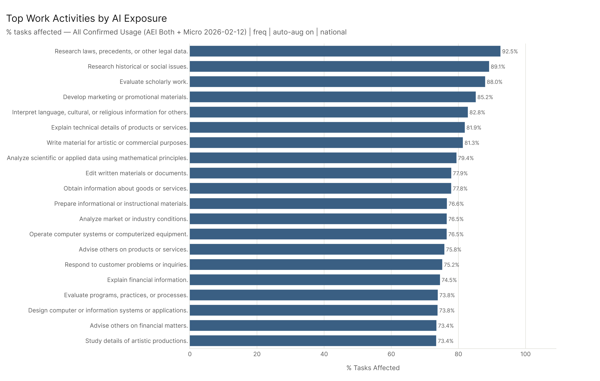
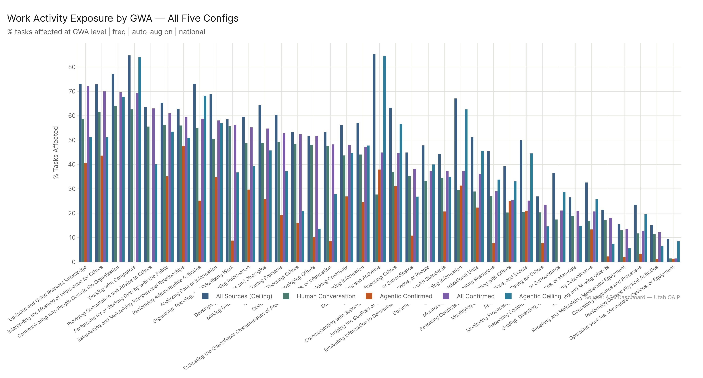
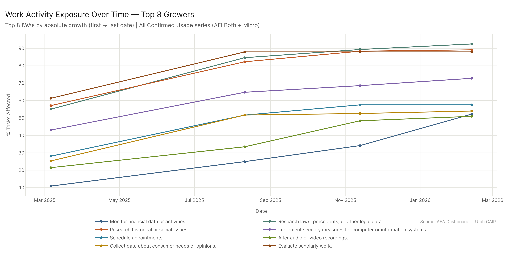
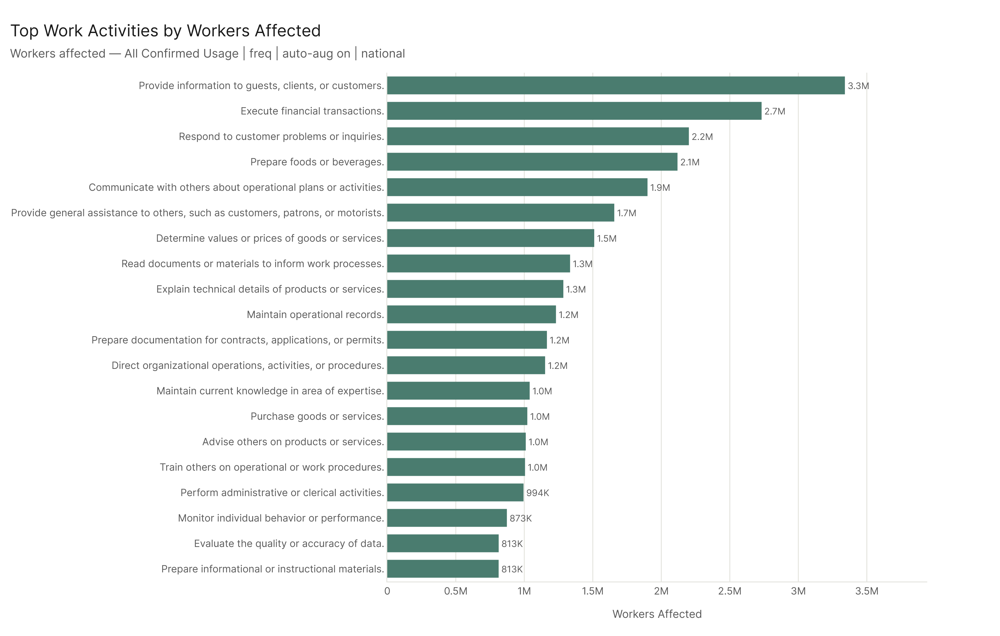
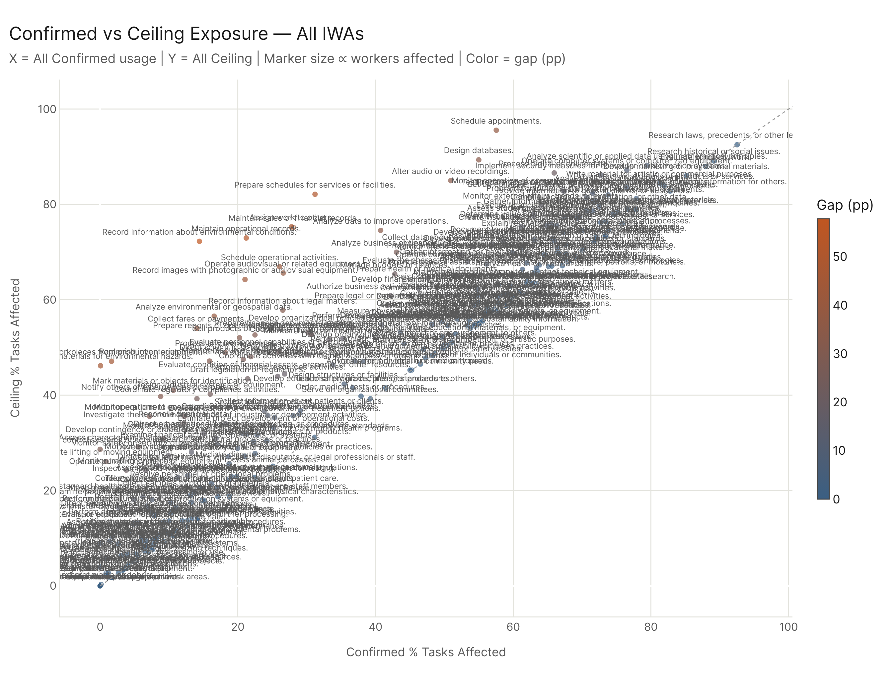

# Work Activity Exposure: Current State

The highest-exposed work activities are information-dense, cognitive tasks — legal research, marketing, scholarly evaluation, data analysis, software design. These sit at 70–93% confirmed exposure. At the GWA level, four categories are already fragile: Working with Computers, Communicating with People Outside the Organization, Interpreting Information for Others, and Updating and Using Relevant Knowledge. The bottom of the exposure ranking is almost entirely physical: vehicle operation, general physical activities, machine control. The distance between those two poles is what tells you where AI's capabilities actually are.

---

## The IWA Picture

332 Intermediate Work Activities. The confirmed exposure range is 0.07% ("Test sites for environmental hazards") to 92.5% ("Research laws, precedents, or other legal data"). That's not a tight distribution — it's almost the full range of possible values. AI is genuinely transforming some types of work while barely touching others, and this isn't about which industries are lucky or unlucky. It's about what the work requires.

### Top 20 IWAs by % Tasks Affected (All Confirmed Usage)

| Rank | IWA | Confirmed % | Ceiling % |
|------|-----|------------|-----------|
| 1 | Research laws, precedents, or other legal data | 92.5% | 92.5% |
| 2 | Research historical or social issues | 89.1% | 89.1% |
| 3 | Evaluate scholarly work | 88.0% | 88.0% |
| 4 | Develop marketing or promotional materials | 85.2% | 86.0% |
| 5 | Interpret language, cultural, or religious information | 82.8% | 82.8% |
| 6 | Explain technical details of products or services | 81.9% | 83.9% |
| 7 | Write material for artistic or commercial purposes | 81.3% | 84.4% |
| 8 | Analyze scientific or applied data using math | 79.4% | 88.2% |
| 9 | Edit written materials or documents | 77.9% | 81.2% |
| 10 | Obtain information about goods or services | 77.8% | 79.0% |
| 11 | Prepare informational or instructional materials | 76.6% | 79.0% |
| 12 | Analyze market or industry conditions | 76.5% | 83.5% |
| 13 | Operate computer systems or computerized equipment | 76.5% | 87.2% |
| 14 | Advise others on products or services | 75.8% | 75.9% |
| 15 | Respond to customer problems or inquiries | 75.2% | 78.4% |

These aren't random occupations. They're a coherent cluster: activities that involve information retrieval, synthesis, communication, and judgment based on structured knowledge. Research, writing, analysis, explanation, customer interaction — these are the activities where large language models are demonstrably capable and demonstrably being used.

The near-zero gap between confirmed and ceiling for many of these (legal research: 92.5% vs 92.5%; language interpretation: 82.8% vs 82.8%) tells you this isn't emergent capability that hasn't been deployed yet. It's deployed. People are already using AI for these things.

---

## The GWA Picture

At the Generalized Work Activity level (the broadest tier of the O*NET activity hierarchy), four categories have crossed into fragile territory — ≥66% confirmed exposure:

| GWA | Confirmed % | Ceiling % | Workers |
|-----|------------|-----------|---------|
| Working with Computers | 69.3% | 84.8% | 1.9M |
| Communicating with People Outside the Organization | 69.6% | 77.2% | 3.5M |
| Interpreting the Meaning of Information for Others | 70.0% | 72.9% | 2.6M |
| Updating and Using Relevant Knowledge | 72.0% | 73.1% | 1.0M |

"Working with Computers" at 69% confirmed is a useful headline, but the more revealing number is the ceiling: 84.8%. Computer-based work is where agentic AI capability is highest. The gap between 69% confirmed and 85% ceiling is the deployment gap — the technology is already there.

The other fragile GWAs are less expected. "Interpreting information for others" and "updating and using relevant knowledge" aren't tech categories — they're general professional activities. Explaining, synthesizing, making sense of complexity for an audience. These are where AI is actually being used most heavily.

The robust end of the GWA spectrum is entirely physical:

| GWA | Confirmed % |
|-----|------------|
| Operating Vehicles, Mechanized Devices, or Equipment | 1.4% |
| Performing General Physical Activities | 12.2% |
| Controlling Machines and Processes | 12.7% |
| Repairing and Maintaining Mechanical Equipment | 13.5% |
| Handling and Moving Objects | 18.1% |

This split — cognitive/informational fragile, physical/operational robust — runs consistently across all five configs.

---

## Config Comparison

The five configs tell a consistent story at the GWA level, with some important divergences. The biggest disagreement is on "Scheduling Work and Activities": 44.9% confirmed, 85.3% ceiling. The agentic ceiling (MCP + API) at 84.5% shows that agentic AI can handle most scheduling work when MCP tooling is fully deployed. Confirmed agentic (AEI API only) sits at 37.9% — above conversational (27.7%) but well below the ceiling. This is the signature of a category where the capability exists but broad deployment hasn't followed.

"Coaching and Developing Others" shows the opposite pattern: 51.7% confirmed (human conversation), 10.2% confirmed agentic, 13.7% agentic ceiling. This is work that happens through conversation and relationship, not through automated pipelines. The high conversational exposure reflects the reality that people are having AI-mediated coaching conversations — but there's no meaningful agentic deployment pathway for it.

"Documenting/Recording Information" has a striking spread: 37.3% confirmed, 67.1% ceiling, with agentic ceiling at 62.6% and confirmed agentic at 31.3% (similar to conversational at 29.6%). Documentation at the confirmed agentic level hasn't outpaced conversational usage, but the agentic ceiling shows where tool-based deployment (coding assistants, medical documentation systems, automated record-keeping) is heading.

---

## Trend: Is This Growing?

The chart below shows the top 8 IWAs by absolute growth since March 2025 — not the activities with the highest current exposure, but the ones that grew the most to get there.

| IWA | Mar 2025 | Feb 2026 | Growth |
|-----|----------|----------|--------|
| Monitor financial data or activities | 10.9% | 52.2% | +41.3pp |
| Research laws, precedents, or other legal data | 55.1% | 92.5% | +37.5pp |
| Research historical or social issues | 57.1% | 89.1% | +32.0pp |
| Implement security measures for computer systems | 43.1% | 72.8% | +29.7pp |
| Schedule appointments | 28.1% | 57.5% | +29.5pp |
| Alter audio or video recordings | 21.5% | 50.9% | +29.5pp |
| Collect data about consumer needs or opinions | 25.3% | 54.0% | +28.7pp |
| Evaluate scholarly work | 61.3% | 88.0% | +26.6pp |

Financial monitoring (+41.3pp) leads this window's growth table — it started at 10.9% in March 2025 and more than quintupled by February 2026. Legal research and historical research are close behind. The educational IWAs that dominated the growth table in earlier windows were already at high exposure by March 2025 and grew more modestly from that base.

---

## Workers Affected

The exposure percentage tells you the intensity of AI overlap with an activity type; workers affected tells you the scale.

The top IWA by workers affected is "Respond to customer problems or inquiries" at 2.2M workers affected. This reflects the enormous clerical/service workforce whose jobs include significant customer-facing work. Behind it: "Communicating with People Outside the Organization" at 3.5M (at the GWA level) covers a huge slice of the professional workforce.

These are not small occupations with interesting AI exposure stories. They're the backbone of the service economy.

---

## Confirmed vs Ceiling

The scatter below maps every IWA's confirmed exposure against its ceiling exposure. Points above the diagonal have higher capability than current usage suggests. Almost every IWA is above the line — the ceiling consistently exceeds the confirmed average.

The activities closest to the diagonal (small gap) are the ones where current usage has nearly caught up to capability. Legal research and scholarly evaluation sit essentially on the line — AI is being used for these at near-maximal capability. Highlighted points (orange) show the activities with the largest gaps and highest ceiling — these are where the next wave of deployment will hit.

---

## Config

- **Primary**: AEI Both + Micro 2026-02-12 | freq | auto-aug on | national | IWA level
- **Ceiling**: All 2026-02-18 | freq | auto-aug on | national
- **Trend**: AEI Both + Micro series (2025-03-06 → 2026-02-12), top 8 by absolute growth
- **All five configs**: compared at GWA level

## Files

| File | Description |
|------|-------------|
| `results/iwa_all_configs.csv` | All IWAs × 5 configs |
| `results/gwa_all_configs.csv` | All GWAs × 5 configs |
| `results/dwa_confirmed.csv` | All DWAs for primary config |
| `results/iwa_trends_confirmed.csv` | IWA trends over time |
| `results/iwa_confirmed_vs_ceiling.csv` | Confirmed vs ceiling per IWA |
