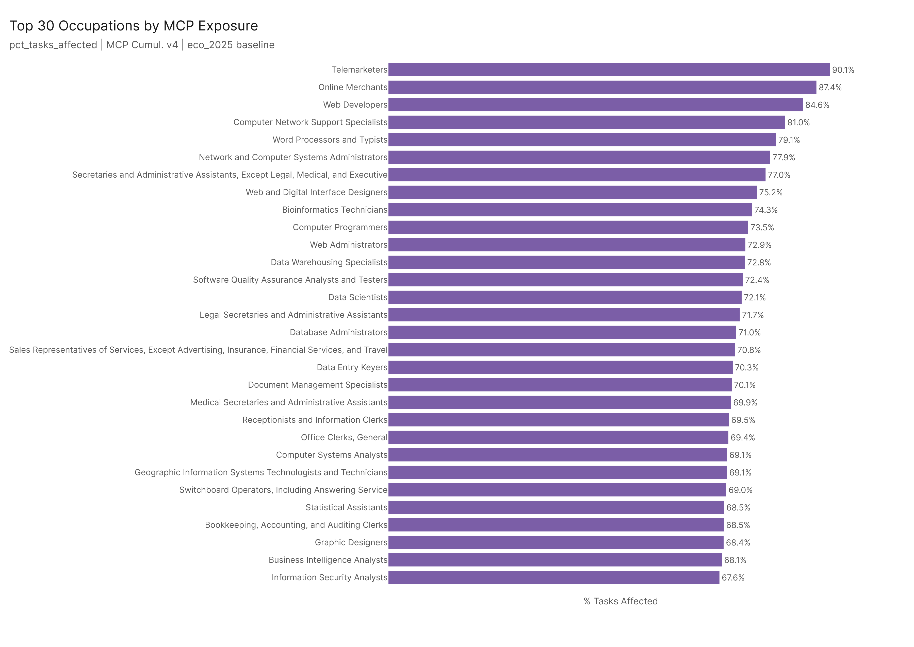
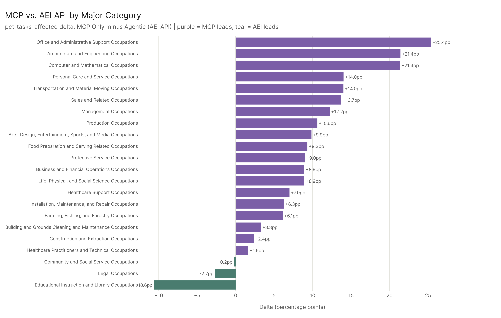
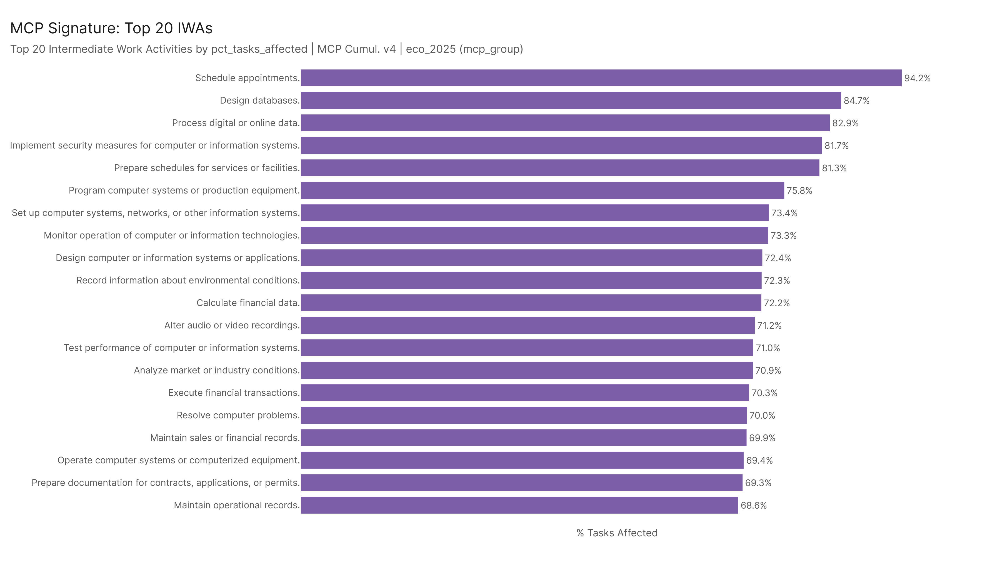
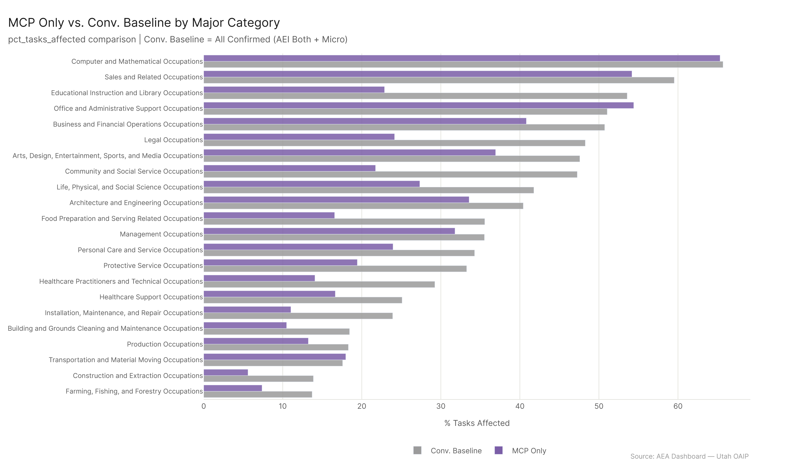

*Primary config: MCP Cumul. v4 (MCP Only) | AEI API 2026-02-12 | AEI Both + Micro 2026-02-12 (Conv. Baseline) | Method: freq | Auto-aug ON | National*

MCP's footprint is distinct and in some cases surprising. The top MCP occupations — Telemarketers, Online Merchants, Web Developers, Computer Network Support Specialists — cluster around digital communication and system management. Where MCP leads most over AEI API, the gap is huge: Data Scientists (+72pp), certain Sales reps (+71pp), Penetration Testers (+61pp). Where AEI API leads, the occupations are more people-intensive: Patient Representatives, Actors, Industrial-Organizational Psychologists. MCP is fundamentally measuring AI that can interact with systems; AEI API is measuring AI that has been used in human-intensive workflows. The two signals are complementary, not redundant.

## MCP's Top Occupations

The 30 highest-scoring occupations under MCP span a range wider than you might expect. The top five:

| Occupation | MCP pct | AEI API pct | Delta |
|---|---|---|---|
| Telemarketers | 90.1% | 68.3% | +21.8pp |
| Online Merchants | 87.4% | 68.4% | +19.0pp |
| Web Developers | 84.6% | 34.1% | +50.6pp |
| Computer Network Support Specialists | 81.0% | 62.0% | +19.0pp |
| Word Processors and Typists | 79.1% | 45.9% | +33.2pp |

Telemarketers and Online Merchants score high partly because their work involves scripted communication, database queries, and transaction management — all tasks where MCP's tool-calling benchmarks are directly relevant. Web Developers show one of the largest gaps (+50.6pp) because MCP tests code generation, API calls, and system integration — exactly what web development involves.

## Where MCP Uniquely Leads

The largest MCP-vs-AEI deltas are concentrated in roles where AI agents with tool access are transformative:

- **Data Scientists** (+72pp): MCP captures data pipeline automation, notebook execution, database querying.
- **Sales Representatives of Services** (+71pp): automated CRM workflows, email sequences, lead qualification.
- **Penetration Testers** (+61pp): scripted security testing, automated vulnerability scanning.
- **Tellers** (+59pp): transaction processing automation, form completion.
- **Blockchain Engineers** (+59pp): smart contract tools, automated audit trails.

The pattern is consistent: MCP leads in roles where AI can run scripts, call APIs, query databases, or manage files autonomously. These aren't just "AI can help" scenarios — these are roles where AI can complete entire workflows without human handoffs.

## Where AEI API Leads

The reverse — where AEI API scores higher than MCP — reveals a different AI capability profile:

- **Patient Representatives** (-53pp gap): AEI API 75.1% vs. MCP 22.4%
- **Actors** (-48pp): AEI API 57.8% vs. MCP 10.1%
- **Industrial-Organizational Psychologists** (-44pp): AEI API 57.6% vs. MCP 14.0%
- **Obstetricians and Gynecologists** (-37pp): AEI API 45.5% vs. MCP 8.3%

These occupations are where AI has been deployed in human-to-human contexts: patient communication, creative work, psychological assessment, clinical documentation. They involve conversation, empathy simulation, and unstructured text — things conversational AI has been actively used for, but MCP tool-calling doesn't specifically test.

## Major-Category Comparison

At the major-category level, MCP leads AEI API across most sectors because of the absolute scale difference. But the structural pattern is informative: MCP's biggest advantages are in Computer/Math, Office/Admin, and Sales — all sectors with high system-interaction content. AEI API's relative strengths are in Healthcare and Education — sectors where the deployed use has been conversational.

## MCP Work Activity Signature (eco_2025)

MCP's top IWAs are telling:
- Schedule appointments (94.2%)
- Design databases (84.7%)
- Process digital or online data (82.9%)
- Implement security measures (81.7%)
- Prepare schedules for services or facilities (81.3%)

The common thread: MCP uniquely captures AI agents that manage schedules, process data, design and interact with databases, and handle security monitoring. These are the work activities that sit behind most enterprise software — the plumbing of organizational operations.

## Key Figures

## Key Takeaways

1. **MCP's signature is system-interaction work** — scheduling, database management, API calls, security monitoring. Not creative work, not patient care.
2. **Web Developers show the largest MCP vs. AEI gap (+50.6pp)** — a clear signal that code-generation and system-integration AI tools are what MCP benchmarks test, and what web development involves.
3. **AEI API uniquely captures human-facing AI deployment** — Patient Representatives, Actors, and Psychology roles score higher under AEI API than MCP.
4. **The two signals are complementary** — neither source subsumes the other. AEI API = deployed in human workflows; MCP = capable with system tools.
5. **Data Scientists are the starkest case of MCP-unique exposure** — 72pp gap vs. AEI API, suggesting that MCP benchmarks directly capture the data pipeline and automation work that defines this occupation.
