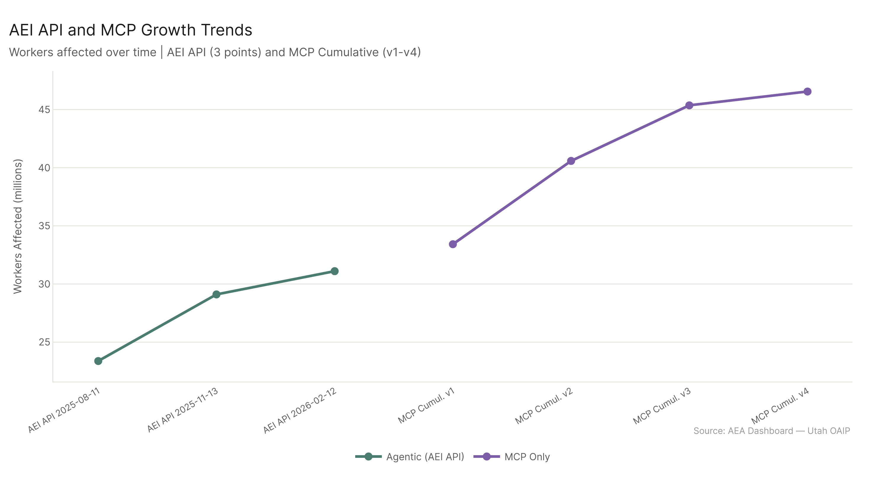
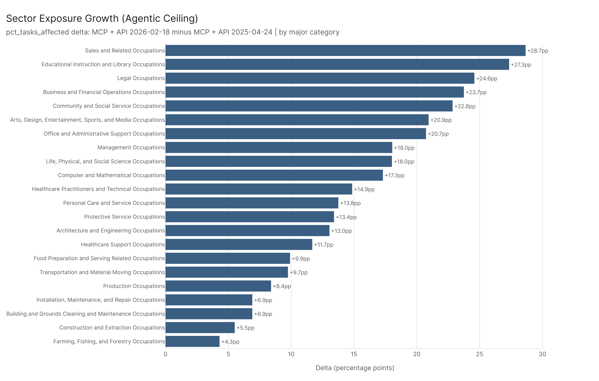

*Primary config: Agentic Ceiling (MCP + API series) | Conv. Baseline (AEI Both + Micro series) | AEI API series | MCP Cumul. series | Method: freq | Auto-aug ON | National*

**TLDR:** The agentic ceiling has grown from 33.4M exposed workers in April 2025 to 60.4M in February 2026 — an 81% increase in under a year. The growth is not linear: there was a sharp jump from July to August 2025 (+9.4M workers in one version update) and a much slower pace in late 2025 and early 2026. AEI API has grown more steadily (+33% from Aug 2025 to Feb 2026). MCP growth plateaued after v3 — v3 to v4 added less than 1M workers. The sectors that grew fastest over the agentic ceiling's history are Sales (+28.7pp), Education (+27.3pp), and Legal (+24.6pp) — a mix of commercial, knowledge, and professional service sectors.

## Agentic Ceiling Growth Trajectory

| Dataset | Workers Affected |
|---|---|
| MCP + API 2025-04-24 | 33.4M |
| MCP + API 2025-05-24 | 41.0M |
| MCP + API 2025-07-23 | 46.0M |
| MCP + API 2025-08-11 | 55.4M |
| MCP + API 2025-11-13 | 58.5M |
| MCP + API 2026-02-12 | 59.4M |
| MCP + API 2026-02-18 | 60.4M |

Three phases are visible. First, rapid expansion through July 2025: +12.6M workers from April to July, driven by MCP benchmarks reaching more occupational tasks. Second, a sharp jump in August 2025: +9.4M workers in a single update, the largest single-version increase. Third, deceleration through early 2026: +1M workers combined across the last two updates. The ceiling appears to be asymptoting toward a structural limit — there's only so much of the economy where current AI tools are plausibly task-relevant.

## AEI API Growth

The AEI API series shows steadier growth: 23.4M (Aug 2025) -> 29.1M (Nov 2025) -> 31.1M (Feb 2026). The +5.7M gain from August to November was the largest step. The Feb 2026 update added only +2.0M workers. This is a different growth pattern than MCP — AEI API tracks confirmed agentic AI deployments, which grow as enterprises actually implement these tools, while MCP tracks capability benchmarks that can jump rapidly with model improvements.

## MCP Cumulative Series

MCP's growth pattern: 33.4M (v1) -> 40.6M (v2) -> 45.4M (v3) -> 46.5M (v4). The largest gain was v1 to v2 (+7.2M). By v4, MCP is adding less than 1.1M workers per version — suggesting the benchmark has reached near-saturation in its coverage of AI-capable work activities. The v1 count matching the Apr 2025 ceiling dataset suggests MCP was the primary driver of that first iteration.

## Sector Growth (Agentic Ceiling: First vs. Last)

The fastest-growing sectors from April 2025 to February 2026 under the agentic ceiling:

| Sector | pct growth |
|---|---|
| Sales and Related Occupations | +28.7pp |
| Educational Instruction and Library | +27.3pp |
| Legal Occupations | +24.6pp |
| Business and Financial Operations | +23.7pp |
| Community and Social Service | +22.8pp |

The Education and Community/Social Service growth is interesting because these sectors didn't show large positive agentic deltas in the snapshot analysis. The trend data suggests these sectors grew substantially over the measurement period — earlier versions of the agentic ceiling measured them at lower exposure, and subsequent benchmark additions raised their scores. Legal Occupations growing +24.6pp reflects the rapid expansion of legal AI tools documented in AEI API data.

The sectors that grew least include those already at or near ceiling levels in v1 (Computer/Math was already high), and physical sectors that the benchmarks don't reach (Construction, Food Prep).

## What the Plateau Means

The deceleration in late 2025 and early 2026 is worth naming: it's not that AI stopped advancing. It's that the measurement framework — the set of tasks in O*NET matched to benchmark capabilities — has largely been filled in. New AI capabilities may not register until new task taxonomies are developed (eco_2026?) or entirely new benchmark categories emerge. The 60.4M ceiling figure should be understood as the upper bound given current measurement, not a hard physical limit on AI's labor market footprint.

## Key Figures

## Key Takeaways

1. **The agentic ceiling more than doubled from April 2025 to February 2026** — 33.4M to 60.4M workers, but most of that growth happened in the first half of the period.
2. **August 2025 was the biggest single jump (+9.4M)** — likely reflects a major benchmark expansion or model capability improvement registered in that update.
3. **MCP growth plateaued at v4** — the benchmark framework is approaching saturation in current task taxonomy; major new exposure will require new measurement frameworks.
4. **AEI API grew steadily at +7.7M total** — this reflects real-world agentic deployment growth, which follows a slower, enterprise-driven curve.
5. **Sales, Education, and Legal grew fastest over the full period** — these sectors caught up to their structural AI potential as benchmarks expanded and AI tools deployed there.
