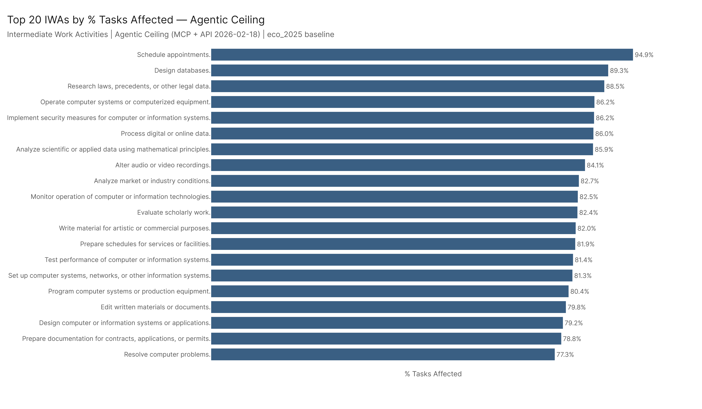
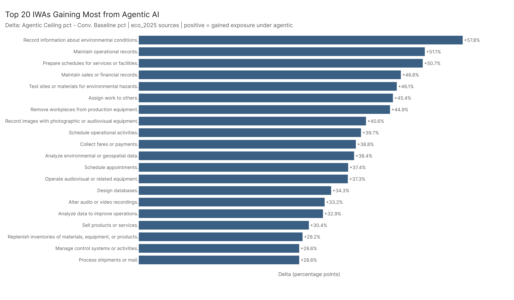
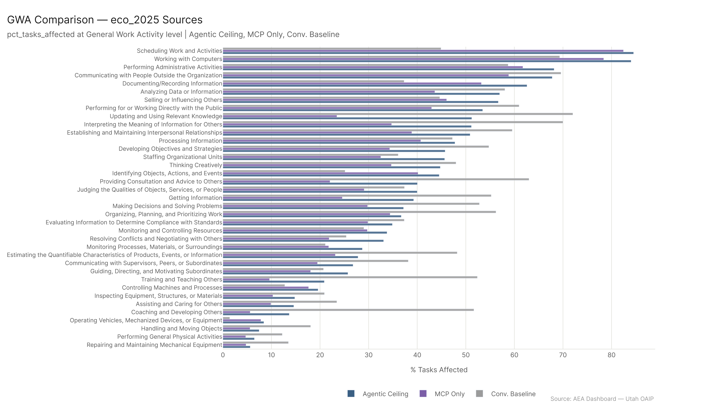
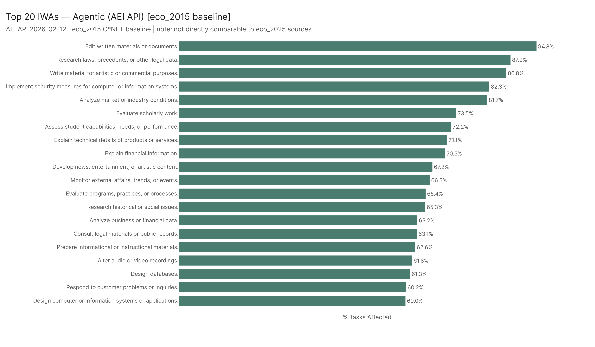

*Primary config: Agentic Ceiling (MCP + API 2026-02-18) | MCP Only (MCP Cumul. v4) | Conv. Baseline (AEI Both + Micro 2026-02-12) — eco_2025 | AEI API 2026-02-12 — eco_2015 (separate) | Method: freq | Auto-aug ON | National*

At the work-activity level, agentic AI's signature is unmistakable: scheduling, database design, legal research, system security, and computer operation all score above 85% under the agentic ceiling. The delta analysis shows that operational record-keeping, scheduling preparation, and environmental monitoring see the largest gains when you add agentic AI on top of the conversational baseline — these are tasks where autonomous tool-calling is particularly powerful. The eco_2015 AEI API shows a different flavor: it uniquely captures writing, legal research, and market analysis as top targets, reflecting the text-heavy capabilities of early conversational AI agents. These two WA baselines are not directly comparable, but together they bracket the range of AI-affected work types.

## Part A: eco_2025 Sources (Agentic Ceiling, MCP Only, Conv. Baseline)

### Top IWAs Under the Agentic Ceiling

The highest-scoring IWAs under the Agentic Ceiling all involve structured information processing and system interaction:

| IWA | pct_tasks_affected |
|---|---|
| Schedule appointments. | 94.9% |
| Design databases. | 89.3% |
| Research laws, precedents, or other legal data. | 88.5% |
| Operate computer systems or computerized equipment. | 86.2% |
| Implement security measures for computer or information systems. | 86.2% |

These aren't surprising in the context of agentic AI — scheduling and calendar management is one of the most-deployed agentic use cases, and database design/security/legal research all map cleanly onto what LLM-powered agents can do with tool access.

### The Agentic Delta: Where Agentic AI Adds Most

The biggest IWA gainers when switching from Conv. Baseline to Agentic Ceiling:

| IWA | Delta |
|---|---|
| Record information about environmental conditions. | +57.8pp |
| Maintain operational records. | +51.1pp |
| Prepare schedules for services or facilities. | +50.7pp |
| Maintain sales or financial records. | +46.8pp |
| Test sites or materials for environmental hazards. | +46.1pp |

These are operational and records-keeping tasks — not the creative or analytical tasks that dominate the conversational AI narrative. The delta reveals that agentic AI's marginal contribution is in automation of operational documentation, monitoring, and scheduling — the unglamorous backbone of many organizations. An AI agent that can read a sensor, log the value, and flag anomalies does exactly what these IWAs describe.

### GWA-Level Comparison

Across 37 GWAs, the three eco_2025 sources show similar rank ordering. The Agentic Ceiling consistently outscores both MCP Only and Conv. Baseline. GWAs involving computer use, information retrieval, and scheduling show the largest gaps between the Agentic Ceiling and the Conv. Baseline — these are the GWAs where combining MCP with API data reveals additional exposure.

## Part B: eco_2015 (AEI API — Separate Baseline)

The AEI API uses the eco_2015 O*NET baseline, which has 332 IWAs (same count as eco_2025 in this dataset), but the task definitions and classifications differ enough to make direct numerical comparison unreliable. The top IWAs here reflect a writing and knowledge synthesis focus:

| IWA | pct_tasks_affected |
|---|---|
| Edit written materials or documents. | 94.8% |
| Research laws, precedents, or other legal data. | 87.9% |
| Write material for artistic or commercial purposes. | 86.8% |
| Implement security measures for computer or information systems. | 82.3% |
| Analyze market or industry conditions. | 81.7% |

The AEI API data reflects where confirmed agentic AI usage is occurring in the economy — and the answer is: writing, legal research, security analysis, and market intelligence. These are the tasks where enterprises have actually deployed LLM-powered agents. The eco_2025 agentic ceiling captures more breadth (operational records, scheduling) but the AEI API captures the depth of current deployment.

## Key Figures

## Key Takeaways

1. **Scheduling and database work score near 95%** — the most-affected IWAs under the agentic ceiling are operational and structured, not creative.
2. **The agentic delta is dominated by operational record-keeping** — +51pp for "Maintain operational records" suggests AI agents are primarily being used (and will be used) to automate monitoring and logging tasks.
3. **AEI API's top IWAs are more text-heavy** — editing, writing, and legal research, reflecting where conversational agentic AI has been deployed in practice.
4. **The eco_2015 vs. eco_2025 gap matters** — these are not directly comparable, but together they show the range of AI-affected work: from text generation (eco_2015) to operational automation (eco_2025 ceiling).
5. **Legal research appears in both baselines** — one of the few IWAs that scores highly under both the AEI API (eco_2015) and the Agentic Ceiling (eco_2025), suggesting robust cross-source agreement on legal work as a prime AI target.
