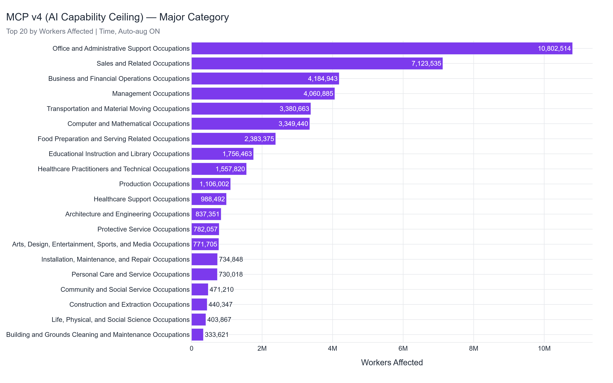
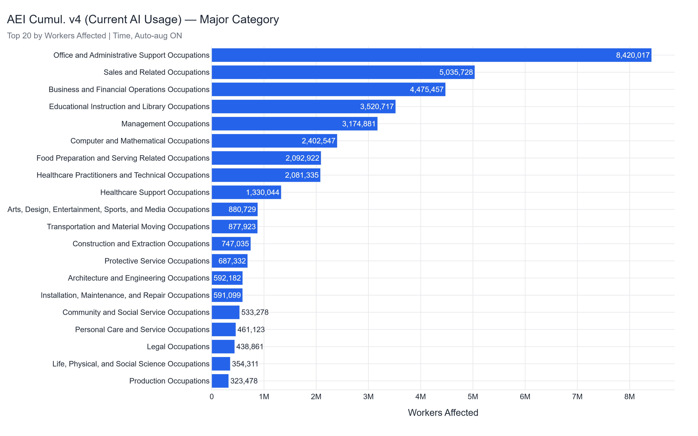
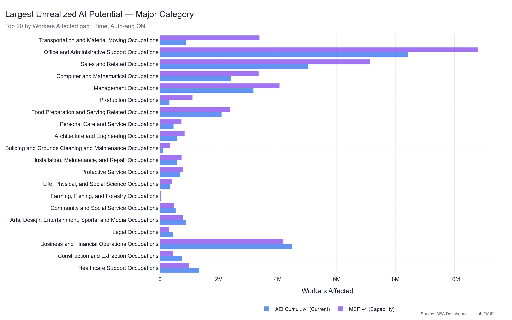
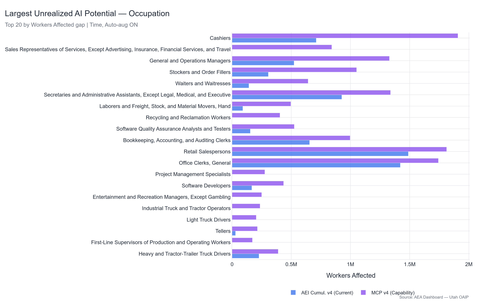
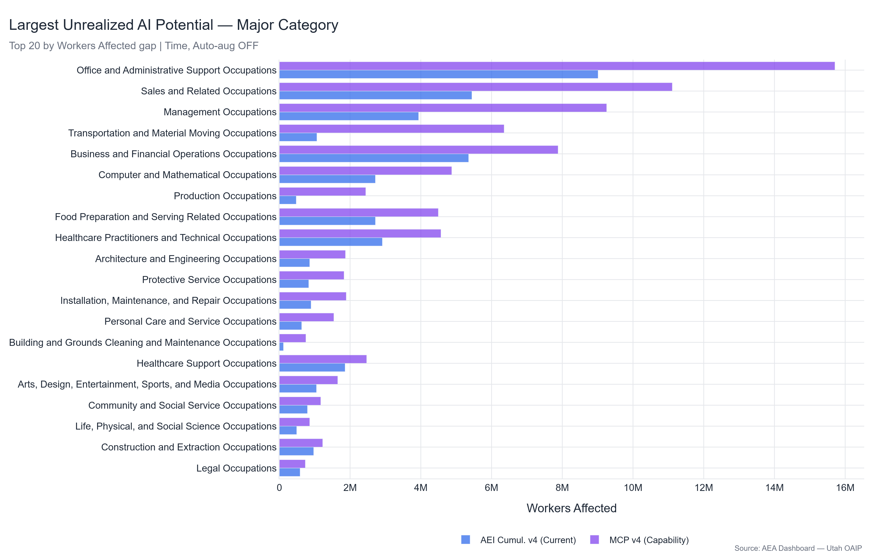
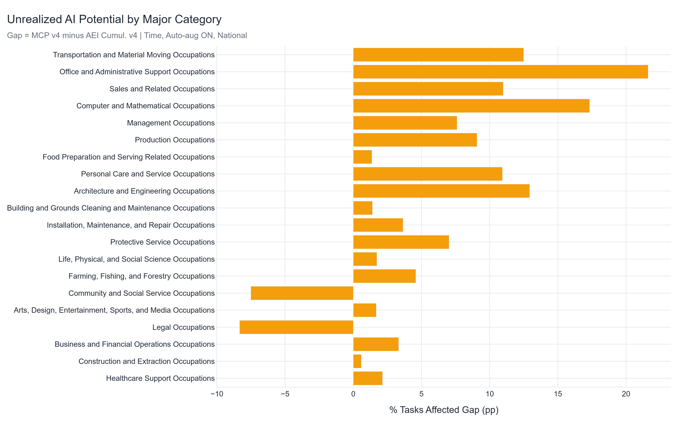

# Question: Where are the jobs and sectors with the greatest potential for AI to be transformative?

We compare AEI Cumul. v4 (where AI **is** being used, based on real Claude conversations) against MCP v4 (where AI **can** be used, based on tool/API capability) to find occupations and sectors where the gap between potential and current adoption is largest.

The gap = MCP v4 score minus AEI Cumul. v4 score. A large positive gap means AI tools are capable of affecting that work, but real-world usage hasn't caught up yet. That's unrealized transformative potential.

---

## 1. Where Is AI Capability Highest? (MCP v4 alone)

**Primary config: Time, Auto-aug ON, National**

### Major Categories (by workers affected)

| Rank | Major Category | % Tasks | Workers Affected |
|------|---------------|---------|-----------------|
| 1 | Office and Administrative Support | 54.4% | 10.8M |
| 2 | Sales and Related | 54.2% | 7.1M |
| 3 | Business and Financial Operations | 40.8% | 4.2M |
| 4 | Management | 31.8% | 4.1M |
| 5 | Transportation and Material Moving | 18.0% | 3.4M |
| 6 | Computer and Mathematical | 65.3% | 3.3M |

Computer and Mathematical has the highest % tasks affected (65.3%) but ranks 6th in workers because the sector is smaller. The top 3 by worker impact are large, broad categories — office work, sales, and business/financial ops.

### Top Occupations (by workers affected)

| Rank | Occupation | % Tasks | Workers |
|------|-----------|---------|---------|
| 1 | Cashiers | 60.6% | 1.9M |
| 2 | Retail Salespersons | 47.7% | 1.8M |
| 3 | Customer Service Representatives | 64.0% | 1.7M |
| 4 | Office Clerks, General | 69.4% | 1.7M |
| 5 | Secretaries and Admin Assistants | 77.0% | 1.3M |
| 6 | General and Operations Managers | 37.1% | 1.3M |

---

## 2. Where Is AI Already Being Used Most? (AEI Cumul. v4 alone)

### Major Categories (by workers affected)

| Rank | Major Category | % Tasks | Workers Affected |
|------|---------------|---------|-----------------|
| 1 | Office and Administrative Support | 32.8% | 8.4M |
| 2 | Sales and Related | 43.2% | 5.0M |
| 3 | Business and Financial Operations | 37.5% | 4.5M |
| 4 | Educational Instruction and Library | 45.2% | 3.5M |
| 5 | Management | 24.2% | 3.2M |
| 6 | Computer and Mathematical | 48.0% | 2.4M |

Notable: **Education ranks #4 in current usage** (3.5M workers, 45.2% of tasks) but drops to #8 in MCP capability. AI is already being heavily used in education — in fact, more than MCP tools can currently reach. This is one of the few sectors where adoption exceeds measured tool capability.

### Top Occupations (by workers affected)

| Rank | Occupation | % Tasks | Workers |
|------|-----------|---------|---------|
| 1 | Customer Service Representatives | 59.4% | 1.6M |
| 2 | Retail Salespersons | 39.2% | 1.5M |
| 3 | Office Clerks, General | 56.6% | 1.4M |
| 4 | Secretaries and Admin Assistants | 53.3% | 926K |
| 5 | Cashiers | 22.6% | 711K |
| 6 | Bookkeeping, Accounting, Auditing | 45.0% | 655K |

---

## 3. Where Is the Unrealized Potential Largest? (Gap = MCP minus AEI)

This is the core finding. A large positive gap means AI tools can do this work but people aren't using AI for it yet.

### Major Categories (by workers gap)

| Rank | Major Category | MCP % Tasks | AEI % Tasks | Gap (pp) | Workers Gap |
|------|---------------|-------------|-------------|----------|-------------|
| 1 | **Transportation and Material Moving** | 18.0% | 5.5% | +12.5 | +2.5M |
| 2 | **Office and Administrative Support** | 54.4% | 32.8% | +21.6 | +2.4M |
| 3 | **Sales and Related** | 54.2% | 43.2% | +11.0 | +2.1M |
| 4 | **Computer and Mathematical** | 65.3% | 48.0% | +17.3 | +947K |
| 5 | **Management** | 31.8% | 24.2% | +7.6 | +886K |
| 6 | **Production** | 13.2% | 4.2% | +9.1 | +783K |

**Transportation is #1 by workers gap** despite a modest overall AI exposure rate (18% MCP). The huge workforce (18.8M) means even a small percentage gap translates into 2.5M workers worth of untapped potential. This sector has the most room for AI adoption to grow.

**Office and Admin is #2** — already the most AI-affected sector by raw workers, and there's still a 21.6 percentage-point gap. MCP tools can reach 54% of tasks but Claude conversations only cover 33%.

### Major Categories Where AEI > MCP (Negative Gap)

| Major Category | MCP % Tasks | AEI % Tasks | Gap (pp) | Workers Gap |
|---------------|-------------|-------------|----------|-------------|
| **Educational Instruction and Library** | 22.9% | 45.2% | -22.3 | -1.76M |
| Healthcare Practitioners and Technical | 14.1% | 18.0% | -3.9 | -524K |
| Business and Financial Operations | 40.8% | 37.5% | +3.3 | -291K |

**Education is the standout inverse case**: AI is being used for 45% of educational tasks in real Claude conversations, but MCP tool capability only covers 23%. This means education's AI usage is happening through conversational interaction (tutoring, writing assistance, explanation) rather than through structured tool use. The current adoption already exceeds what tools can automate.

Healthcare Practitioners also show a small negative gap — AI is slightly more used than tools enable, likely through clinical decision support conversations rather than tool-based automation.

### Minor Categories (Top 10 by workers gap)

| Rank | Minor Category | MCP % | AEI % | Gap (pp) | Workers Gap |
|------|---------------|-------|-------|----------|-------------|
| 1 | Material Moving Workers | 19.4% | 2.5% | +16.9 | +1.9M |
| 2 | Retail Sales Workers | 54.1% | 27.0% | +27.2 | +1.7M |
| 3 | Computer Occupations | 66.5% | 46.2% | +20.3 | +951K |
| 4 | Sales Representatives, Services | 58.4% | 48.2% | +10.3 | +830K |
| 5 | Top Executives | 26.2% | 21.8% | +4.4 | +785K |
| 6 | Secretaries and Admin Assistants | 71.6% | 47.5% | +24.2 | +718K |
| 7 | Financial Clerks | 55.0% | 31.0% | +24.0 | +593K |
| 8 | Motor Vehicle Operators | 19.5% | 9.6% | +9.9 | +487K |
| 9 | Information and Record Clerks | 55.5% | 37.5% | +18.0 | +459K |
| 10 | Other Office and Admin Support | 57.2% | 38.0% | +19.2 | +435K |

**Material Moving Workers** at #1 is striking — nearly 1.9M workers worth of gap. These are warehouse, shipping, and logistics roles where AI tools (scheduling, routing, inventory management) have clear capability but real-world adoption is minimal (only 2.5% of tasks covered by AEI).

### Top Occupations (by workers gap)

| Rank | Occupation | MCP % | AEI % | Gap (pp) | Workers Gap |
|------|-----------|-------|-------|----------|-------------|
| 1 | **Cashiers** | 60.6% | 22.6% | +38.0 | +1.20M |
| 2 | **Sales Reps of Services** | 70.8% | 0.0% | +70.8 | +842K |
| 3 | **General and Operations Managers** | 37.1% | 14.6% | +22.5 | +805K |
| 4 | **Stockers and Order Fillers** | 37.8% | 11.0% | +26.8 | +745K |
| 5 | **Waiters and Waitresses** | 27.9% | 6.2% | +21.7 | +500K |
| 6 | **Secretaries and Admin Assistants** | 77.0% | 53.3% | +23.7 | +412K |
| 7 | **Laborers and Freight Movers** | 16.6% | 3.0% | +13.6 | +406K |
| 8 | **Recycling and Reclamation Workers** | 13.6% | 0.0% | +13.6 | +404K |
| 9 | **Software QA Testers** | 72.4% | 21.2% | +51.2 | +371K |
| 10 | **Bookkeeping/Accounting Clerks** | 68.5% | 45.0% | +23.5 | +342K |

Several occupations have **0% AEI** (no real Claude conversation usage detected) but significant MCP capability: Sales Reps of Services (70.8% MCP), Recycling Workers, Project Management Specialists (49.3%), Industrial Truck Operators (29.3%), Light Truck Drivers (20.5%), Substitute Teachers (29.7%). These represent totally untapped AI potential.

**Software QA Testers** stand out in tech: MCP tools can reach 72.4% of their tasks, but only 21.2% shows up in real conversations. That's a 51 percentage-point gap. This is an area where AI tool capability is far ahead of adoption.

---

## 4. Does the Method Toggle Matter? (Time vs Value)

**Short answer: not much.** The rankings are very stable between Time and Value methods.

At the major level, the gap rankings by workers are nearly identical. The biggest shift in wages gap is Sales (-$21B going from Time to Value) — meaning Sales tasks with the biggest AI gap tend to be frequent but lower-importance. Computer and Math goes slightly up (+$5B under Value), confirming that its gap is in the core, important tasks.

At the occupation level, the top-10 by workers gap is largely the same. Value weights slightly favor occupations with important/relevant tasks (managers, knowledge workers) over high-frequency but routine ones (cashiers, stockers).

**What this means:** The unrealized potential story is robust regardless of whether you weight tasks by frequency alone or by their economic importance. The same sectors and occupations show up.

---

## 5. Does the Auto-Aug Toggle Matter? (ON vs OFF)

**Yes, dramatically. This is a key finding.**

When auto-aug is OFF, every AI-flagged task counts equally (as if all had maximum automation scores). When ON, tasks are scaled by their actual automation score (0-5).

### What changes:

**The gaps get massively larger with auto-aug OFF.** At the major level:

| Major Category | Gap (Workers, ON) | Gap (Workers, OFF) | Increase |
|---------------|-------------------|-------------------|----------|
| Office and Admin | +2.4M | +6.7M | +4.3M |
| Sales | +2.1M | +5.7M | +3.6M |
| Management | +886K | +5.3M | +4.4M |
| Transportation | +2.5M | +5.3M | +2.8M |
| Computer and Math | +947K | +2.2M | +1.3M |

**Management** has the most dramatic shift: from +886K workers gap (auto-aug ON) to +5.3M (OFF). This means most Management tasks flagged by MCP have relatively low automation scores currently. If those scores increase over time — as AI tools get better — Management could see the largest increase in realized AI impact.

**Education flips from -1.76M to -533K gap.** Still negative (AEI > MCP), but much less so. With auto-aug OFF, the MCP capability for education tasks looks closer to the current usage levels.

**Categories that stay negative even with auto-aug OFF** are truly adoption-heavy: Education is the only one.

### What this means:

The auto-aug OFF results represent the **theoretical maximum** if every AI-flagged task were fully automatable. The difference between ON and OFF shows **how much additional potential exists** if automation quality improves. The fact that Management and Office Admin see the biggest increases means their tasks are flagged as AI-capable but with currently moderate automation scores — there's a second layer of unrealized potential beyond just adoption.

---

## 6. Stability Across All 4 Configs

| Level | Stable in Top-10 (all 4 configs) | Stable Categories |
|-------|----------------------------------|-------------------|
| Major | 8 of 10 | Architecture/Engineering, Computer/Math, Food Prep, Management, Office/Admin, Production, Sales, Transportation |
| Minor | 7 of 10 | Computer Occs, Info/Record Clerks, Material Moving, Retail Sales, Sales Reps Services, Secretaries/Admin, Top Executives |
| Occupation | 7 of 10 | Bookkeeping/Accounting, Cashiers, General/Ops Managers, Laborers/Freight, Sales Reps of Services, Stockers/Order Fillers, Waiters/Waitresses |

The story is highly robust. 7-8 of the top 10 appear regardless of method or auto-aug setting.

---

## Config

- **Primary**: MCP v4 vs AEI Cumul. v4 | Time | Auto-aug ON | National | All tasks
- **Sensitivity**: 4 variants (Time/Value x Auto-aug ON/OFF)
- **Aggregation**: Major, Minor, Occupation

## Files

### Core Results (Primary config: Time, Auto-aug ON)
| File | Description |
|------|-------------|
| `results/gap_major_time_autoaug_on.csv` | Gap rankings at major category level |
| `results/gap_minor_time_autoaug_on.csv` | Gap rankings at minor category level |
| `results/gap_occupation_time_autoaug_on.csv` | Gap rankings at occupation level |
| `results/mcp_v4_major_time_autoaug_on.csv` | MCP v4 alone rankings (major) |
| `results/aei_cumul_v4_major_time_autoaug_on.csv` | AEI Cumul. v4 alone rankings (major) |

### Sensitivity Variants
| File | Description |
|------|-------------|
| `results/gap_*_time_autoaug_off.csv` | Auto-aug OFF variant |
| `results/gap_*_value_autoaug_on.csv` | Value method variant |
| `results/gap_*_value_autoaug_off.csv` | Value + auto-aug OFF variant |

### Toggle Analysis
| File | Description |
|------|-------------|
| `results/stability_summary.csv` | How many top-10 entries are stable across all 4 configs |
| `results/toggle_comparison.csv` | Full gap values under ON vs OFF for each toggle |
| `results/toggle_movers_autoaug_*.csv` | Biggest movers when auto-aug toggles, per level |
| `results/toggle_movers_method_*.csv` | Biggest movers when method toggles, per level |

### Figures (Primary config)
| File | Description |
|------|-------------|
| `results/figures/gap_workers_affected_major.png` | MCP vs AEI grouped bars, major, workers |
| `results/figures/gap_pct_tasks_affected_major.png` | MCP vs AEI grouped bars, major, % tasks |
| `results/figures/gap_wages_affected_major.png` | MCP vs AEI grouped bars, major, wages |
| `results/figures/mcp_workers_affected_major.png` | MCP alone ranking, major |
| `results/figures/aei_workers_affected_major.png` | AEI alone ranking, major |
| `results/figures/summary_gap_major.png` | % Tasks gap overview by major category |
| (same pattern for minor and occupation levels) | |
