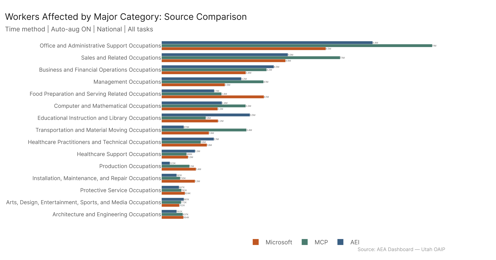
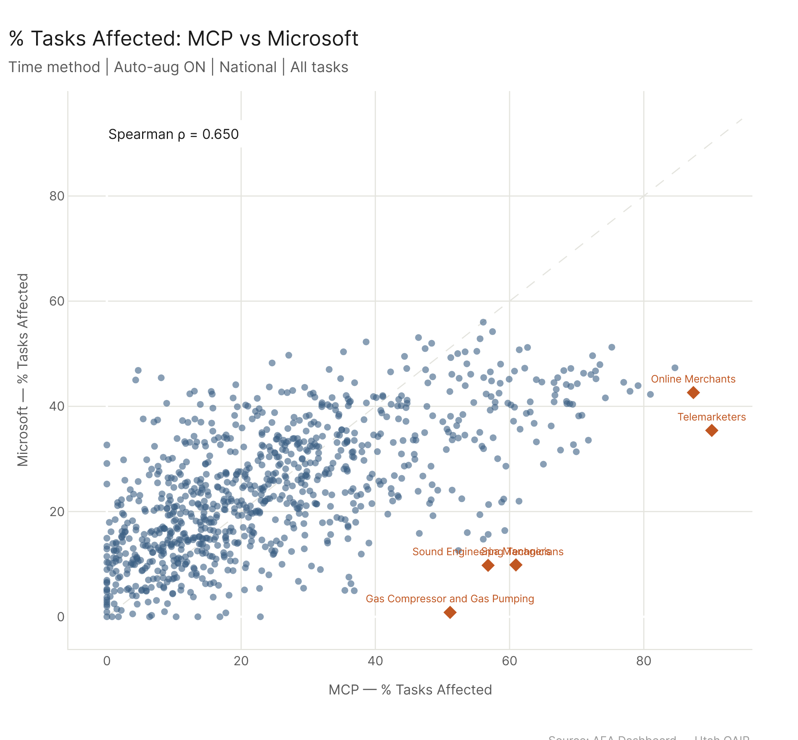
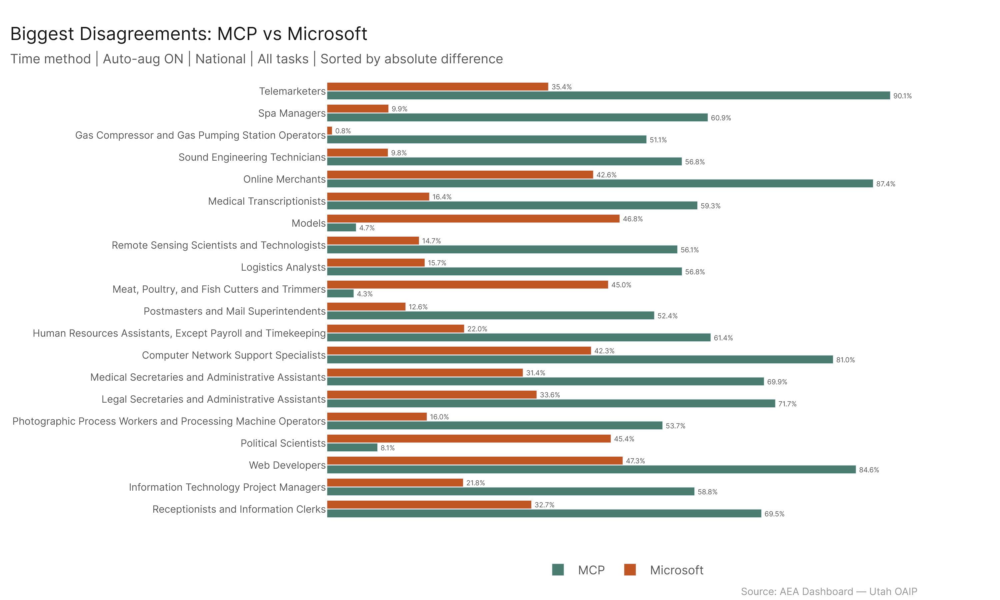
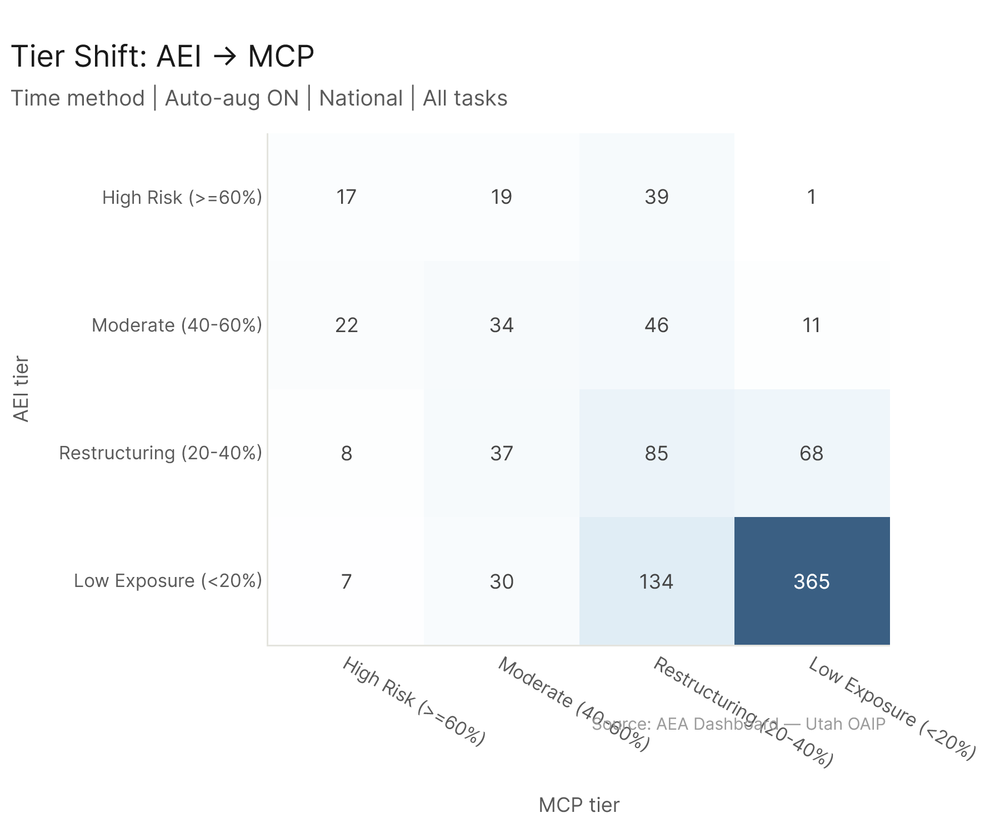

# Question: How Do the Three AI Data Sources Differ in What They See?

The dashboard draws on three independent AI scoring sources: AEI (Anthropic Economic Index, cumulative conversation + API data), MCP (Model Context Protocol server logs capturing tool-use capability), and Microsoft (Copilot usage analysis). Each measures AI exposure differently. This analysis runs each source solo through the same pipeline and asks: **where do they agree, where do they diverge, and what does that tell us about how AI interacts with the economy?**

Understanding source disagreement matters because policy conclusions change depending on which signal you trust. If all three sources converge on the same occupations, the finding is robust. Where they diverge, the divergence itself is informative --- it reveals which kinds of AI capability (conversational, tool-use, copilot) affect which kinds of work.

**Primary config:** Time method, Auto-aug ON, National, All tasks.

---

## 1. Economic Footprint: Similar Totals, Different Distributions

At the aggregate level, AEI and Microsoft produce nearly identical total workforce exposure --- 25.5% and 25.7% of US workers, respectively. MCP stands apart at **30.4%** (46.5M workers), roughly 5 percentage points higher.

| Source | Workers Affected | % of Workforce | Wages Affected | % of Wages |
|--------|----------------:|---------------:|---------------:|-----------:|
| AEI | 39.1M | 25.5% | $2,676B | 28.4% |
| MCP | 46.5M | 30.4% | $2,969B | 31.5% |
| Microsoft | 39.5M | 25.7% | $2,464B | 26.1% |

The similar AEI/Microsoft totals are deceptive --- as we'll see, the two sources arrive at ~25% through very different paths. MCP's higher footprint reflects its measurement of what AI systems *can* do with tools, rather than what users *are* doing in conversations.

---

## 2. Major Category Rankings: Same Top, Different Middle

All three sources agree that **Computer and Mathematical Occupations** have the highest % tasks affected, and that **Office and Administrative Support** is the largest by workers affected. But the agreement breaks down quickly after the top few.

Key divergences at the major category level:

| Major Category | AEI | MCP | Microsoft | Notable |
|---------------|----:|----:|----------:|---------|
| Computer & Mathematical | 48.0% | 65.3% | 43.4% | MCP sees 20pp more than others |
| Education | 45.2% | 22.9% | 28.8% | AEI sees 2x more than MCP --- conversational AI dominates teaching tasks |
| Office & Admin | 32.8% | 54.4% | 34.5% | MCP sees admin work as highly tool-automatable |
| Sales | 43.2% | 54.2% | 36.8% | MCP highest again; MS lowest |
| Transportation | 5.5% | 18.0% | 15.2% | AEI barely sees it; MCP/MS see 3x more |
| Food Preparation | 15.2% | 16.6% | 29.3% | Microsoft sees nearly 2x more than AEI/MCP |
| Production | 4.2% | 13.2% | 15.8% | AEI sees almost nothing; MS sees 4x more |

**The pattern:** AEI over-indexes on knowledge-intensive conversational work (education, science, legal). MCP over-indexes on technical/tool-amenable work (computing, admin, sales). Microsoft has a more uniform distribution, seeing moderate exposure across categories that AEI and MCP both overlook (food service, production, installation/maintenance).

---

## 3. Occupation-Level Ranking: Moderate Correlation, Minimal Top-20 Overlap

At the occupation level (923 occupations), the three sources show moderate rank correlation but strikingly low agreement on which occupations are *most* affected.

| Pair | Spearman rho | Top-20 Overlap |
|------|:-----------:|:--------------:|
| AEI vs MCP | 0.584 | 2 / 20 |
| AEI vs Microsoft | 0.557 | 2 / 20 |
| MCP vs Microsoft | 0.650 | 2 / 20 |

The Spearman correlations of 0.55--0.65 mean the sources roughly agree on the overall shape (high-exposure occupations tend to be higher in all sources), but the specifics diverge sharply. Only 2 out of 20 top occupations overlap for *any* pair.

The AEI vs MCP scatter plot reveals the characteristic pattern: a cloud of occupations where MCP sees substantial exposure (y-axis > 40%) but AEI sees near-zero (x-axis near 0%), and a separate cluster where AEI sees high exposure but MCP sees much less. The former are tool-use occupations (data scientists, penetration testers, blockchain engineers). The latter are education/teaching roles.

---

## 4. Biggest Disagreements: What Each Source Uniquely Captures

The divergence analysis reveals which occupations each source sees that the others miss. These are the 20 occupations with the largest absolute disagreement in % tasks affected.

### AEI vs MCP: Conversation vs Tool-Use

**MCP sees, AEI doesn't (MCP >> AEI):**
- Data Scientists: 72% MCP vs 0% AEI
- Sales Representatives of Services: 71% MCP vs 0% AEI
- Penetration Testers: 61% MCP vs 0% AEI
- Blockchain Engineers: 59% MCP vs 0% AEI
- Software QA Testers: 72% MCP vs 21% AEI

These are occupations that heavily use AI *tools* (APIs, testing frameworks, data pipelines) rather than AI *conversations*. The AEI conversational data simply doesn't capture this kind of work.

**AEI sees, MCP doesn't (AEI >> MCP):**
- Patient Representatives: 78% AEI vs 22% MCP
- Physics Teachers (Postsecondary): 79% AEI vs 27% MCP
- Education Teachers (Postsecondary): 76% AEI vs 27% MCP
- Political Science Teachers: 76% AEI vs 25% MCP
- Industrial-Organizational Psychologists: 65% AEI vs 14% MCP

These are conversational/knowledge roles where people are using Claude for drafting, research, and explanation --- work that doesn't require external tools.

### MCP vs Microsoft: Capability vs Observed Use

**MCP sees far more than Microsoft:**
- Telemarketers: 90% MCP vs 35% Microsoft
- Spa Managers: 61% MCP vs 10% Microsoft
- Medical Transcriptionists: 59% MCP vs 16% Microsoft

**Microsoft sees more than MCP:**
- Models: 47% Microsoft vs 5% MCP
- Meat/Poultry Cutters: 45% Microsoft vs 4% MCP
- Political Scientists: 45% Microsoft vs 8% MCP

The Microsoft-higher cases tend to involve occupations where Copilot-style assistance (document editing, scheduling, email) contributes broadly even if the work isn't deeply automatable. The MCP-higher cases involve occupations where tool orchestration creates substantial capability that isn't yet reflected in Copilot usage.

---

## 5. Risk Tier Analysis: Microsoft Never Reaches "High Risk"

Using the same tier thresholds as the job elimination risk analysis (High >= 60%, Moderate 40--60%, Restructuring 20--40%, Low < 20%), the three sources produce dramatically different risk profiles.

| Tier | AEI | MCP | Microsoft |
|------|----:|----:|----------:|
| High Risk (>=60%) | 76 | 54 | **0** |
| Moderate (40--60%) | 113 | 120 | 121 |
| Restructuring (20--40%) | 198 | 304 | 433 |
| Low Exposure (<20%) | 536 | 445 | 369 |

**Microsoft produces zero high-risk occupations.** Its maximum % tasks affected for any occupation caps out below 60%. This is the most striking single finding --- Microsoft's Copilot-based measurement sees broad, moderate exposure across many occupations but never sees any single occupation as overwhelmingly AI-exposed.

AEI is the most "concentrated" --- it sees 76 occupations as high-risk but also has the most occupations (536) in low exposure. MCP falls in between, with fewer high-risk occupations than AEI but far fewer low-exposure ones (445 vs 536), suggesting it sees more widespread moderate-level exposure.

### Tier Shift: How Occupations Move Between Sources

The AEI-to-MCP tier shift heatmap shows substantial movement. Of AEI's 76 high-risk occupations, only 17 remain high-risk under MCP --- **39 drop two tiers to "restructuring."** Conversely, of AEI's 536 low-exposure occupations, MCP promotes 134 to restructuring and 30 to moderate risk. The sources are reshuffling the entire risk landscape.

The AEI-to-Microsoft shift is even more extreme: *every* AEI high-risk occupation moves down, since Microsoft has zero high-risk occupations. 48 of AEI's 76 high-risk occupations fall to restructuring under Microsoft's scoring.

---

## 6. Sensitivity: Auto-Aug Toggle Reveals a Fundamental Measurement Difference

The auto-aug multiplier toggle exposes the most important methodological difference between the sources.

| Config | AEI | MCP | Microsoft |
|--------|----:|----:|----------:|
| Time + Aug ON (primary) | 25.5% | 30.4% | 25.7% |
| Time + Aug OFF | 30.7% | **56.5%** | **49.4%** |
| Value + Aug ON | 26.6% | 30.8% | 26.2% |
| Value + Aug OFF | 31.8% | **56.8%** | **50.2%** |

**Turning off auto-aug nearly doubles MCP and Microsoft's footprint** (30% to 57%, 26% to 49%) **but barely changes AEI** (26% to 31%).

This means:
- **MCP and Microsoft flag many tasks as AI-relevant but rate them with low automatability scores.** When auto-aug is ON, these low-scored tasks contribute little. When OFF, they all count equally and the footprint explodes.
- **AEI's tasks tend to have higher auto-aug scores.** The tasks that appear in AEI conversational data are ones where AI is actually being used effectively, so their automatability ratings are naturally higher. Turning off auto-aug doesn't change much because the scores were already pulling their weight.

This is a meaningful structural insight: AEI captures "what AI is good at" (biased toward high-automatability tasks people actively use), while MCP and Microsoft capture "what AI touches" (including many tasks where AI involvement is minimal or low-quality).

---

## 7. Physical Task Filter: AEI Underrepresents Physical Work

| Filter | AEI | MCP | Microsoft |
|--------|----:|----:|----------:|
| All Tasks | 25.5% | 30.4% | 25.7% |
| Non-Physical Only | 31.6% | 37.9% | 30.0% |
| Physical Only | **15.1%** | 22.1% | 21.7% |

AEI's physical-task exposure (15.1%) is notably lower than MCP (22.1%) and Microsoft (21.7%). This makes sense: people don't typically have *conversations* with AI about physical tasks (lifting, operating machinery), but AI tools (MCP) and copilot features (Microsoft) can still assist with the informational components of physical jobs (scheduling, documentation, safety protocols).

The non-physical split is where MCP pulls furthest ahead (37.9% vs 31.6% AEI, 30.0% Microsoft), confirming that MCP's advantage comes from tool-use capability on knowledge work.

---

## 8. Rank Stability Across Method Toggles

Despite all the source-level differences, one finding is consistent: **top-10 major categories are perfectly stable** across Time and Value methods for all three sources (10/10 overlap). The method toggle changes the magnitudes but not the ordering at the major category level. This is reassuring --- it means the major-level story is robust regardless of whether you weight by frequency or importance.

---

## 9. Key Takeaways

1. **MCP sees ~5pp more of the economy as AI-exposed** (30.4% vs ~25.5%), driven by tool-use capability that conversational data misses.

2. **The three sources agree on the top 1--2 major categories** (Computer/Math and Office/Admin) but diverge sharply after that. Education is 2x higher under AEI than MCP. Transportation is 3x higher under MCP than AEI.

3. **Occupation-level agreement is low** --- Spearman correlations of 0.55--0.65 and only 2/20 top occupations shared between any pair. The sources are measuring fundamentally different things.

4. **Microsoft never rates any occupation above 60% tasks affected.** AEI finds 76 high-risk occupations, MCP finds 54, Microsoft finds zero. This makes Microsoft the most conservative source for risk assessment.

5. **The auto-aug toggle is the biggest sensitivity lever**, and it affects sources asymmetrically: MCP and Microsoft nearly double when auto-aug is turned off (they flag many low-automatability tasks), while AEI barely changes (its tasks are already high-automatability).

6. **AEI underrepresents physical task exposure** (15% vs 22% for MCP/Microsoft) because conversational AI isn't applied to physical work the way tools and copilots are.

7. **Each source has a distinctive "blind spot":** AEI misses tool-use occupations (data science, security, QA testing). MCP underweights teaching and psychology. Microsoft sees moderate exposure everywhere but identifies no truly high-risk occupations.

8. **These are complementary signals, not competing ones.** The combined average used as the dashboard default is the right approach --- it triangulates across fundamentally different measurement methodologies.

---

## Config

- **Primary:** Time method | Auto-aug ON | National | All tasks
- **Sources (solo):** AEI Cumul. (Both) v4, MCP Cumul. v4, Microsoft
- **Aggregation levels:** Major Category (primary), Occupation (for rank analysis)
- **Sensitivity:** Time vs Value method, Auto-aug ON vs OFF, Physical toggle (all/exclude/only)

## Files

| File | Description |
|------|-------------|
| `economy_totals.csv` | Total workers/wages/% by source |
| `major_aei.csv`, `major_mcp.csv`, `major_microsoft.csv` | Major category rankings per source |
| `rank_correlations.csv` | Spearman rho for each source pair |
| `divergence_aei_vs_mcp.csv` | Top 20 biggest pct disagreements: AEI vs MCP |
| `divergence_aei_vs_microsoft.csv` | Top 20 biggest pct disagreements: AEI vs Microsoft |
| `divergence_mcp_vs_microsoft.csv` | Top 20 biggest pct disagreements: MCP vs Microsoft |
| `tier_counts.csv` | Risk tier distribution per source |
| `tier_shift_*.csv` | Tier shift matrices for each pair |
| `occupations_tiered_*.csv` | Full occupation lists with tier assignments per source |
| `sensitivity_toggles.csv` | % workers across 4 method/auto-aug variants |
| `physical_comparison.csv` | Physical filter comparison across sources |
