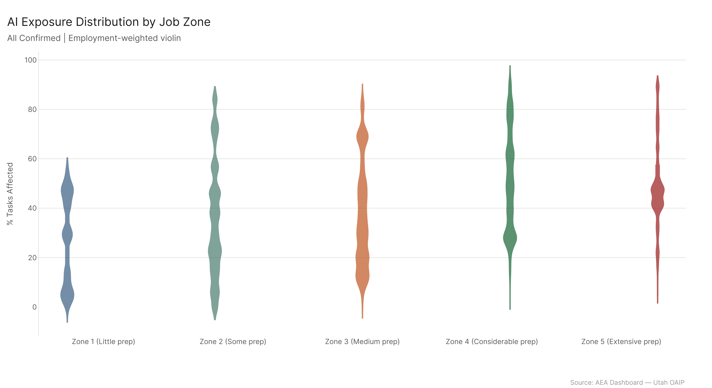
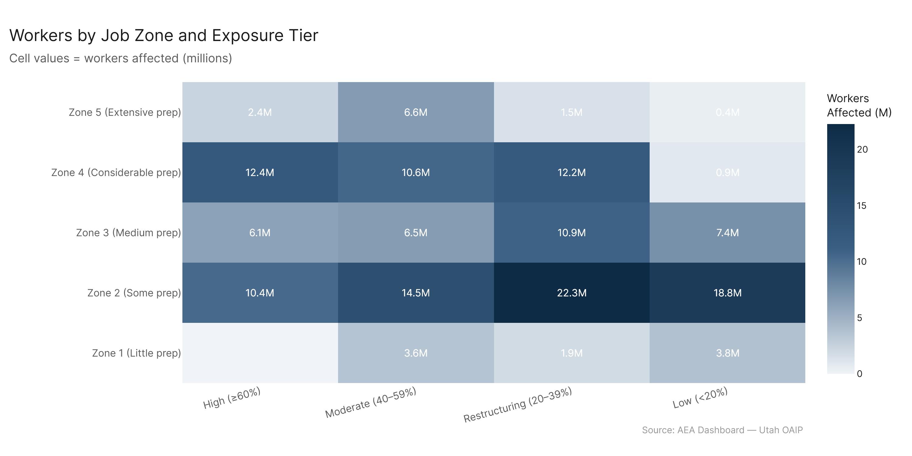
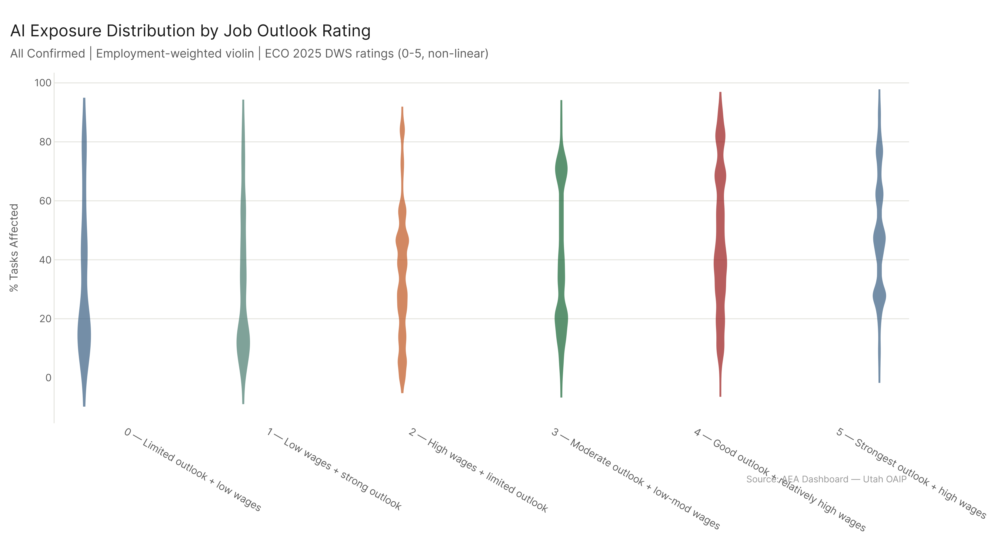
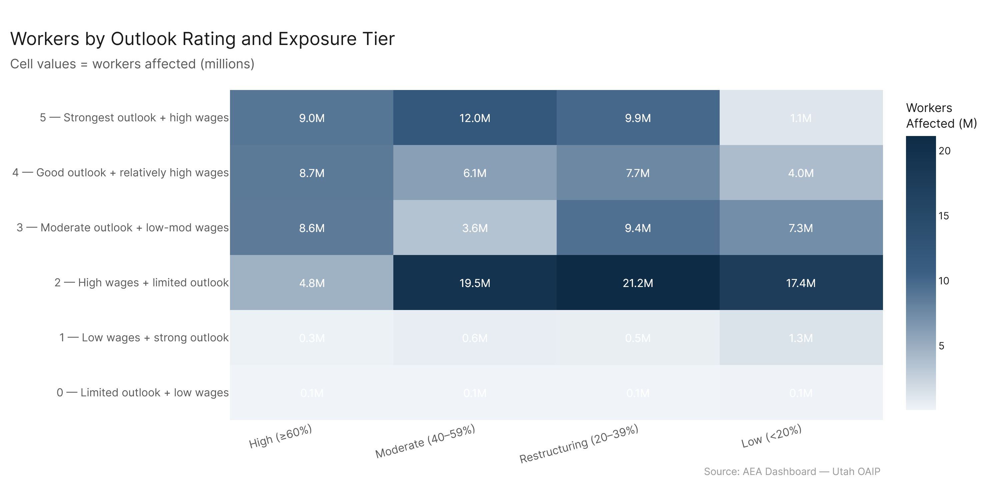
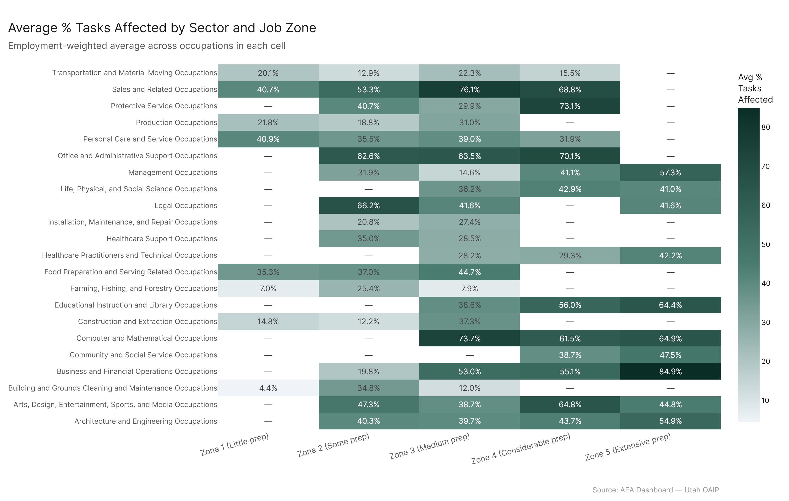

# Economic Footprint: Job Structure

**TLDR:** AI exposure increases with job preparation level up through Zone 4, then plateaus or slightly dips for Zone 5. The most highly-credentialed jobs (Zone 4 — bachelor's plus significant work experience) carry the highest average task exposure, which cuts against the simple story that AI replaces low-skill work. The Utah DWS job outlook data adds another wrinkle: jobs classified as declining or below-average (Rating 3) have higher average AI exposure than bright-outlook jobs, suggesting some correlation between precarity and exposure — but the relationship isn't clean.

---

## Job Zones and Exposure

O*NET's job zone classification runs from Zone 1 (little or no preparation) to Zone 5 (extensive preparation, typically a professional or doctoral degree). The question is whether AI exposure increases, decreases, or is uncorrelated with preparation level.

The answer from the data: exposure generally rises with zone, peaking at Zone 4. Average pct_tasks_affected by zone:

- **Zone 1** (little prep): ~26.9%
- **Zone 2** (some prep, typically high school): ~30.6%
- **Zone 3** (medium prep, some post-secondary): ~35.0%
- **Zone 4** (considerable prep, bachelor's + experience): ~50.9%
- **Zone 5** (extensive prep, advanced degree): ~45.9%

The Zone 4 peak is striking. These are managers, accountants, engineers, analysts, healthcare practitioners — jobs that require real education and experience. The fact that they carry the highest average exposure is not a claim that AI will replace them wholesale. It is a claim that a larger share of what they do on a given day is AI-capable than for someone in Zone 1.

Zone 5 actually shows slightly lower average exposure than Zone 4. These are researchers, physicians, attorneys, professors — jobs where a significant fraction of work involves judgment, originality, and domain expertise that AI hasn't fully cracked. The tasks in Zone 5 roles that AI *can* do are a smaller share of the total workload.

---

## The Worker Counts

The distribution of workers across tiers tells the fuller story. Looking at Zone 4:

- 12.4 million workers in the **High** exposure tier (>= 60% tasks affected)
- 10.6 million in **Moderate** (40-59%)
- 12.2 million in **Restructuring** (20-39%)
- Only 0.9 million in **Low** (<20%)

Almost all Zone 4 workers — about 35 million total — are in the moderate-to-high exposure range. That's the professional workforce of the United States: lawyers, managers, accountants, engineers, healthcare practitioners. The low-exposure pocket (0.9M) is tiny compared to the high-exposure mass (12.4M).

Zone 2 shows a very different distribution. 18.8 million Zone 2 workers are in the Low exposure tier — these are the physically-grounded service and trade jobs where AI capability drops off. But Zone 2 also has 10.4 million in High exposure. Those are likely the administrative, sales, and data-entry roles within Zone 2 — jobs that require some training but are heavily task-automated.

Zone 5 has 2.4 million in High exposure and 6.6 million in Moderate — significant numbers, but a larger fraction in the Restructuring tier (1.5M) and Low tier (0.4M) than Zone 4. Consistent with the pattern that Zone 5 work is more defended against full task penetration.

---

## Job Outlook and Exposure

The Utah DWS star ratings classify occupations into three tiers: Rating 1 (bright outlook / high-wage), Rating 2 (average), Rating 3 (below average / declining). These are forward-looking assessments based on labor market conditions.

Average AI task exposure by rating:

- **Rating 1** (bright/high-wage): ~29.8%
- **Rating 2** (average): ~36.1%  
- **Rating 3** (below average): ~39.2%

So jobs with poorer labor market outlooks have higher average AI exposure. That's a signal worth taking seriously — it suggests the occupational categories showing both secular decline in the labor market and high AI exposure are the same ones. The correlation is imperfect and partly mechanical (low-wage service jobs that were already losing ground to automation tend to score higher on AI exposure), but it's a real pattern.

The Rating 1 occupations — the ones with high wages and strong demand — actually have the lowest average AI exposure. These tend to be healthcare practitioners, specialized engineers, trades workers in demand, and management roles. Their outlook is bright partly because their work is harder to automate.

What this doesn't tell us is whether AI exposure is *causing* the poor outlook or just correlated with it. Probably both — some occupations are declining because automation is already happening; others are AI-exposed and the market hasn't repriced them yet. The dataset can't distinguish these cases.

---

## Sector × Zone Interactions

Looking at average pct_tasks_affected broken out by major sector and job zone gives a more granular picture. A few patterns stand out:

The Computer and Mathematical sector is high-exposure across all zones, but particularly in Zone 3-4 where most of those jobs sit. Sales is similarly high across zones. Education shows interesting variation — Zone 3 and 4 educational roles (community college instructors, high school teachers) have moderate exposure, but Zone 5 (university professors, researchers) show more mixed results.

Healthcare shows the largest within-sector zone variation: healthcare support roles (Zone 2-3) have substantially lower exposure than healthcare practitioners (Zone 4), which is partly counterintuitive — the higher-paid clinical roles are more task-penetrated by AI than the support roles, because the AI capability assessment captures the information-processing components of clinical work (documentation, diagnostics, knowledge retrieval) better than the physical patient care components.

---

## What This Means for Policy

The standard policy frame on automation is to focus on low-skill workers — the ones most at risk from routine displacement. This data complicates that. The highest absolute exposure is concentrated in Zone 4 — the credentialed, educated professional workforce. These workers have more resources to adapt, but they also represent a much larger share of aggregate wages. A 10% productivity shock to Zone 4 workers across all sectors has enormous wage implications.

Zone 1 and 2 workers carry lower average exposure but are far less buffered. Their jobs are exposed primarily through specific high-penetration pockets within otherwise lower-exposure sectors — the administrative layer embedded in physically-grounded work. When that layer gets automated, those workers have fewer alternatives.

The outlook data adds a final layer: the labor market is already pricing in some of this. Bright-outlook jobs — the ones the market believes have a future — are carrying lower AI exposure. That's either reassuring (the market is correctly identifying durable roles) or concerning (the market is pricing exposure *because* it sees displacement risk, and the workers in Rating 3 jobs are already doubly vulnerable).
