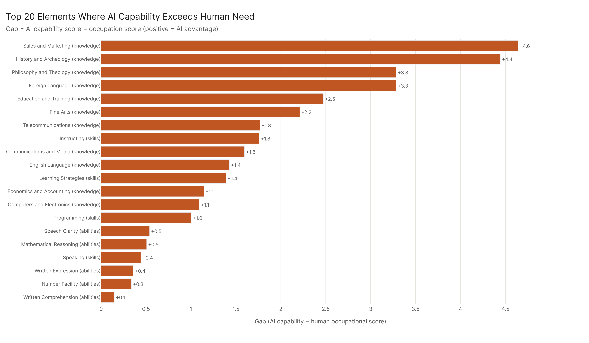
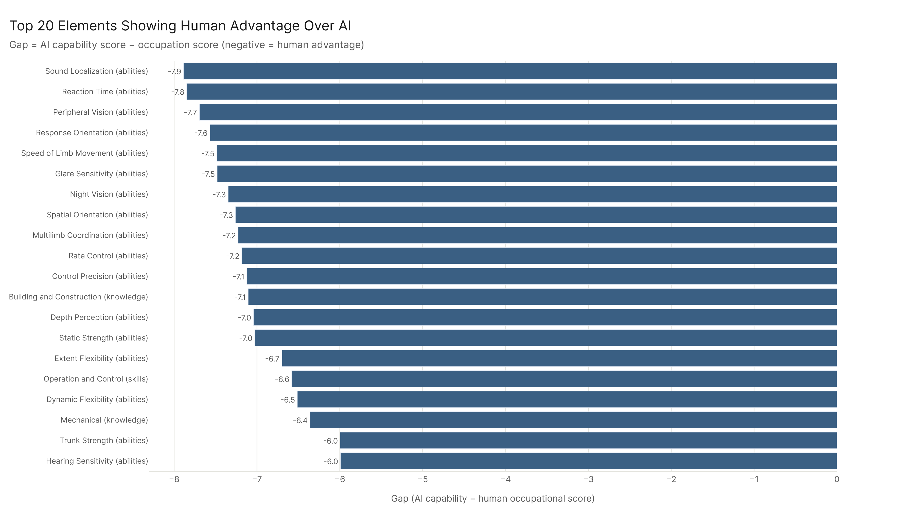
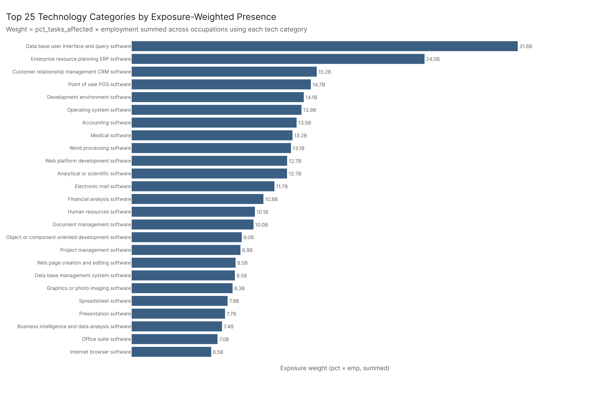
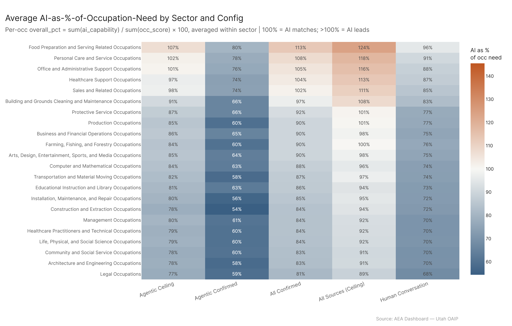

# Economic Footprint: Skills Landscape

**TLDR:** Of 120 O*NET skills, knowledge, and abilities elements, 23 show higher AI capability scores than economy-wide averages — meaning AI currently leads humans in those domains across the affected workforce. Ninety-seven elements show human advantage, concentrated almost entirely in physical, perceptual, and sensorimotor abilities. The technology landscape tells a complementary story: database management, ERP, and CRM software categories carry the highest AI-exposure-weighted footprint in the economy, meaning those tools sit at the intersection of high AI capability and high employment concentration.

---

## The AI vs. Human Capability Map

The question here isn't whether AI is better than any individual expert at any given skill — it's whether AI capability, on average across affected occupations, exceeds what the average worker in those jobs actually brings. That's a different and more economically meaningful question.

Across 120 SKA elements, AI leads on 23. All of them are knowledge or skills domains — none of the physical or sensorimotor abilities show AI advantage. The top AI-leading elements:

- **Sales and Marketing** (gap: +4.6): AI systems score meaningfully higher than economy-average humans on sales and marketing knowledge. This is consistent with the broad finding that Sales occupations are among the most task-penetrated sectors — the knowledge base for selling is something AI can absorb and replicate.
- **History and Archeology** (+4.4): Less economically central, but notable — this is a knowledge domain where AI excels at retrieval and synthesis.
- **Philosophy and Theology** (+3.3): Same story — structured reasoning over accumulated text.
- **Foreign Language** (+3.3): Multilingual capability is a genuine AI strength.
- **Education and Training** (+2.5): AI leads on the knowledge *of* pedagogy, even if it can't replicate the relational craft of teaching.

The pattern across the AI-leading domains is clear: knowledge that can be encoded, retrieved, and synthesized from text — especially domains with structured bodies of accumulated content. AI does well where the task is "know things and communicate them." It does less well where the task requires physical presence, real-time environmental perception, or fine motor control.

---

## Where Humans Still Have a Strong Advantage

The 97 human-leading elements cluster almost entirely in physical and perceptual abilities. The largest gaps:

- **Sound Localization** (human lead: -7.9): The ability to identify where a sound is coming from. AI has no physical presence.
- **Reaction Time** (-7.8), **Peripheral Vision** (-7.7), **Response Orientation** (-7.6): These are all reflexive sensorimotor abilities — the gap is large because AI currently scores very low on all of them, not because humans score especially high.
- **Building and Construction** knowledge (-7.1): A physical domain where AI's abstract knowledge doesn't translate to real-world competence.
- **Operation and Control** (-6.6), **Repairing** (-5.9): Hands-on technical skill.

The human advantage domains divide into two rough categories. First, physical/perceptual abilities that AI simply doesn't have in any meaningful embodied sense — reaction time, peripheral vision, multilimb coordination. These are hard limits, not just gaps. Second, applied physical knowledge — construction, mechanics, repairing — where human embodied expertise still clearly outstrips AI's textbook-level knowledge.

What's not in the top human-advantage list: most cognitive skills. Written comprehension, reading comprehension, mathematical reasoning — AI is essentially at parity or slight AI advantage on those. The cognitive frontier has moved further than most people realize.

---

## The Technology Footprint

The 137 O*NET technology commodity categories give a different angle on the skills story — not what AI can do, but what technology infrastructure the affected workforce is built around.

Weighted by `pct_tasks_affected × employment`, the top technology categories by AI-exposure footprint:

1. **Database user interface and query software** — by far the largest footprint. This is the bread-and-butter of information work across virtually every sector: querying databases, pulling reports, interacting with structured data. The fact that this tops the list is significant — it's exactly the kind of tool use where AI copilots and agents are being deployed right now.

2. **ERP software** — the operational backbone of mid-to-large enterprises. Finance, HR, supply chain — all running through platforms where AI integration is accelerating.

3. **CRM software** — sales and customer relationship management. Consistent with Sales being one of the most task-penetrated major sectors.

4. **Point of Sale software** (14.7T weighted) — retail, food service, hospitality. Surprisingly high given the physical-service nature of those sectors, but the transaction and information management layer is large.

5. **Development environment software** (14.1T) — developers and technical workers. AI coding tools are already transforming this space.

The top 10 categories are all enterprise software categories — ERP, CRM, accounting, medical records, word processing, web development. This is the technology layer of the knowledge economy. The occupations that use this software heavily are the same ones showing the highest task penetration rates.

Further down the list: geographic information systems, industrial control software, CAD/CAM — these appear but with a fraction of the exposure weight, because the occupations using them tend to have lower overall task penetration.

---

## What the Combined Picture Says

Put these two datasets together and a coherent story emerges. AI is strong where the work is information-intensive, communication-heavy, and tool-mediated. The skills it leads on (marketing knowledge, language, structured reasoning) are precisely the skills needed to operate the technology infrastructure with the highest exposure footprint (databases, ERP, CRM). The skills it lags on (physical perception, motor control) are concentrated in sectors and tools with lower exposure.

This isn't a coincidence — it reflects the structure of AI's current capability profile. Systems trained on text and structured data are good at the cognitive-linguistic layer of work. They're weak at the physical-perceptual layer. The economy's AI-exposed occupations happen to be heavily concentrated in the former.

The implication: the workers most at risk of displacement aren't workers who lack skills — many of them have substantial knowledge and communication skills that AI can now match. The workers with the most durable competitive advantage are those whose value comes from embodied, physical, or relational work that can't be replicated from text.

That said, "relational work" — coaching, motivating subordinates, interpersonal relationships — doesn't show a large AI gap in either direction. The AI capability scores for social skills sit near the economy average. That's worth watching. The last moat may be narrower than people assume.
