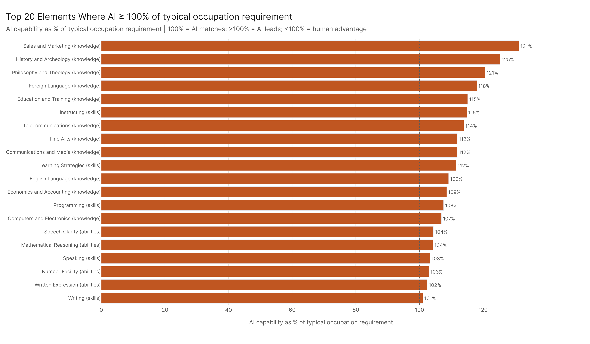
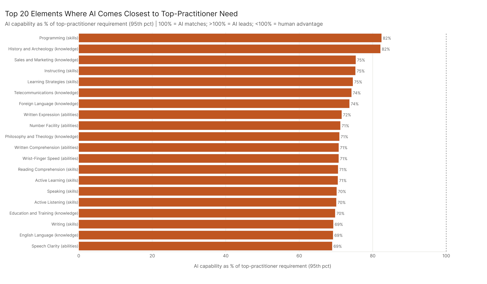
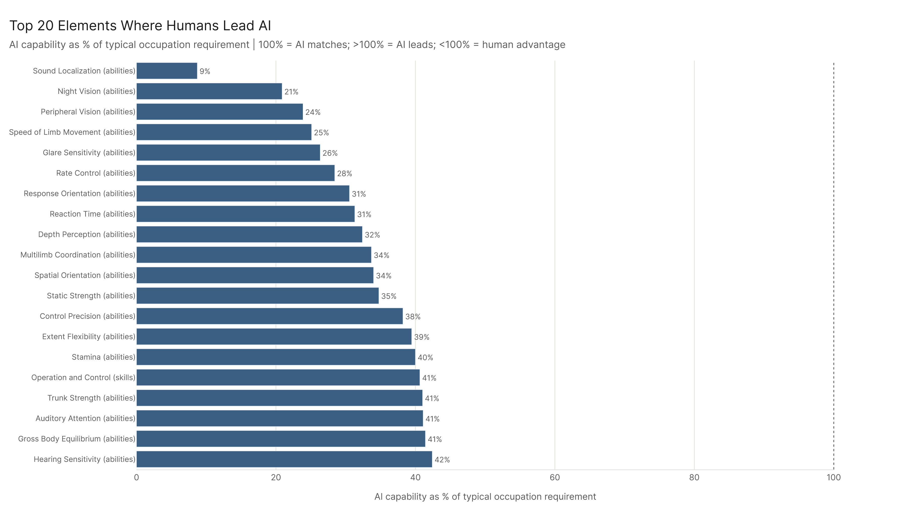
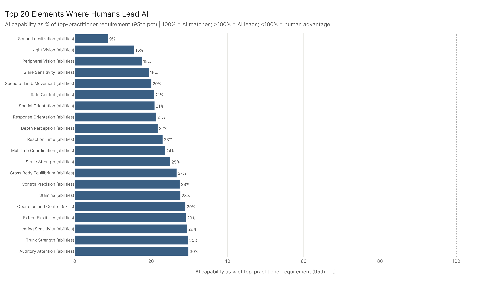
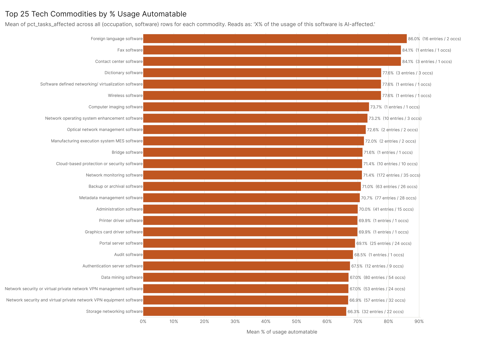
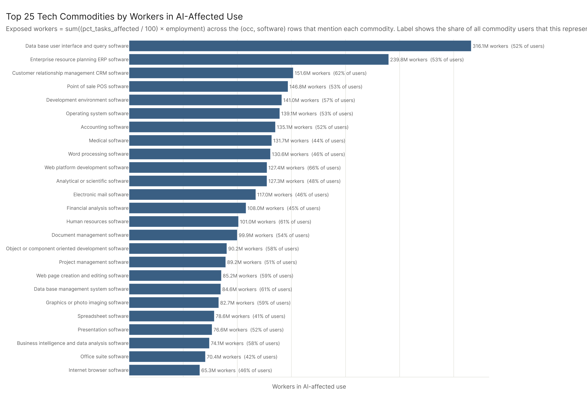
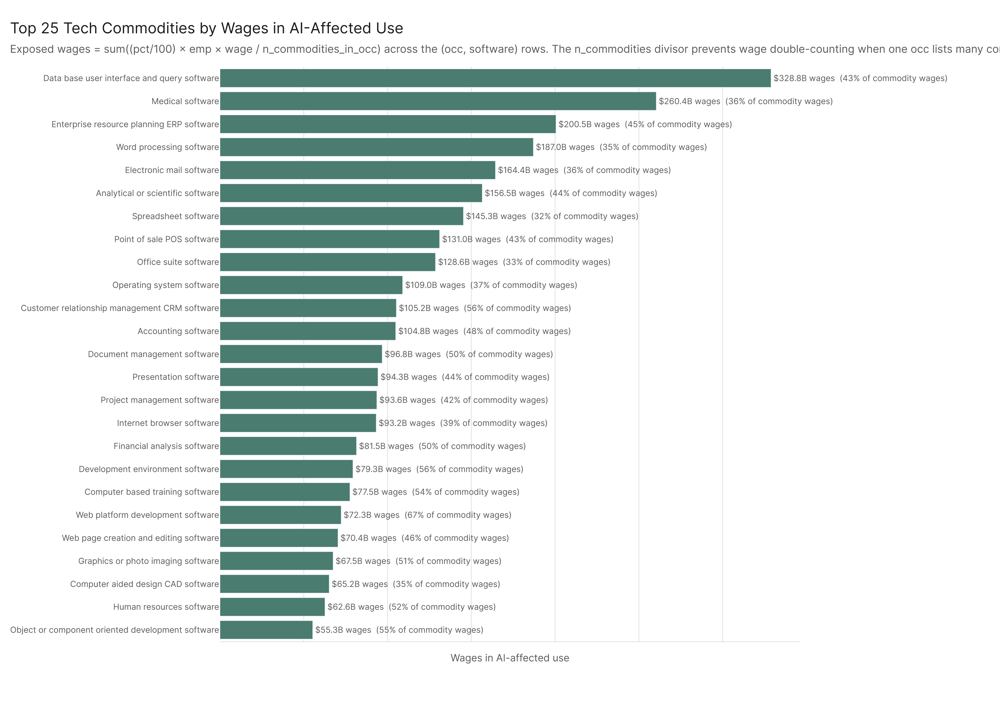

# Economic Footprint: Skills Landscape

Of 121 O*NET skills, knowledge, and abilities elements, 23 show AI capability above 100% of the economy-wide average occupational need — meaning AI currently leads humans in those domains across the affected workforce. Ninety-eight elements show human advantage (AI below 100%), concentrated almost entirely in physical, perceptual, and sensorimotor abilities. The technology landscape tells a complementary story: database management, ERP, and CRM software categories carry the highest AI-exposure-weighted footprint in the economy, meaning those tools sit at the intersection of high AI capability and high employment concentration.

---

## The AI vs. Human Capability Map

The question here isn't whether AI is better than any individual expert at any given skill — it's whether AI capability, as a percentage of what the average worker in those jobs actually needs, exceeds 100%. That's a different and more economically meaningful question.

Across 121 SKA elements, AI leads on 23 (pct > 100%). All of them are knowledge or skills domains — none of the physical or sensorimotor abilities show AI advantage. The top AI-leading elements:

- **Sales and Marketing** (AI at 131% of typical occ need): AI systems score meaningfully higher than economy-average humans on sales and marketing knowledge. This is consistent with the broad finding that Sales occupations are among the most task-penetrated sectors — the knowledge base for selling is something AI can absorb and replicate.
- **History and Archeology** (125%): Less economically central, but notable — this is a knowledge domain where AI excels at retrieval and synthesis.
- **Philosophy and Theology** (121%): Same story — structured reasoning over accumulated text.
- **Foreign Language** (118%): Multilingual capability is a genuine AI strength.
- **Education and Training** (115%): AI leads on the knowledge *of* pedagogy, even if it can't replicate the relational craft of teaching.

The pattern across the AI-leading domains is clear: knowledge that can be encoded, retrieved, and synthesized from text — especially domains with structured bodies of accumulated content. AI does well where the task is "know things and communicate them." It does less well where the task requires physical presence, real-time environmental perception, or fine motor control.

The first chart below shows AI capability vs. the economy-average occupational need. The second uses a harder benchmark: the 95th-percentile occupational score per element — roughly what a top-practitioner human needs. Against the average worker, AI leads on 23 elements; against elite practitioners, the set is smaller. Both views are informative: the first shows where AI has surpassed typical job requirements, the second shows how far AI capability extends toward the upper bound of human expertise.

The sector heatmap below shows how AI capability as a percentage of occupation need distributes across major sectors and the five analysis configs. Sectors near or above 100% are those where AI's demonstrated ability approaches or exceeds what the typical worker in that sector is actually required to know and do.

---

## Where Humans Still Have a Strong Advantage

The 98 human-leading elements cluster almost entirely in physical and perceptual abilities. The largest deficits:

- **Sound Localization** (AI at 9% of occ need): The ability to identify where a sound is coming from. AI has no physical presence.
- **Peripheral Vision** (24%), **Night Vision** (21%), **Speed of Limb Movement** (25%): These are all reflexive sensorimotor abilities — AI scores far below 100% because it currently has near-zero capability on all of them, not because humans score especially high.
- **Building and Construction** knowledge (58%): A physical domain where AI's abstract knowledge doesn't translate to real-world competence.
- **Operation and Control** (41%), **Repairing** (50%): Hands-on technical skill.

The human advantage domains divide into two rough categories. First, physical/perceptual abilities that AI simply doesn't have in any meaningful embodied sense — reaction time, peripheral vision, multilimb coordination. These are hard limits, not just capability gaps. Second, applied physical knowledge — construction, mechanics, repairing — where human embodied expertise still clearly outstrips AI's textbook-level knowledge.

What's not in the top human-advantage list: most cognitive skills. Written comprehension (101%), reading comprehension (100%), mathematical reasoning (104%) — AI is essentially at parity or slight AI advantage on those. The cognitive frontier has moved further than most people realize.

Against the economy-average baseline, humans lead on 98 elements. The second chart uses the 95th-percentile human baseline: at the top-practitioner level, human advantage is even more pronounced, especially in applied technical and clinical domains where elite expertise runs well ahead of AI's current demonstrated capability.

---

## The Technology Footprint

The 138 O*NET technology commodity categories give a different angle on the skills story — not what AI can do, but what technology infrastructure the affected workforce is built around. Three separate views break this apart: mean % tasks affected per commodity, exposed workers, and exposed wages (with an n_commodities divisor for wages to avoid double-counting workers who use multiple tools).

**By mean % tasks affected**, the top commodities are niche but telling:

1. **Foreign language software** (86.0% mean tasks affected) — a narrow category, but the occupations using it are heavily AI-penetrated.
2. **Contact center software** (84.1%) — call-center automation is among the most mature AI deployment stories.
3. **Fax software** (84.1%), **Dictionary software** (77.6%) — legacy tool categories attached to heavily-exposed clerical roles.
4. **Network operating system enhancement software** (73.2%) — IT administration tools in high-exposure technical roles.

These are small-n categories. The signal here is about the *intensity* of AI exposure for the occupations that use these tools, not the breadth of their economic footprint.

**By exposed workers**, the ranking shifts to the enterprise software backbone:

1. **Database user interface and query software** — 316M exposed workers, by far the largest footprint. This is the bread-and-butter of information work across virtually every sector: querying databases, pulling reports, interacting with structured data. It's exactly the kind of tool use where AI copilots and agents are being deployed right now.
2. **ERP software** (240M) — the operational backbone of mid-to-large enterprises. Finance, HR, supply chain — all running through platforms where AI integration is accelerating.
3. **CRM software** (152M) — sales and customer relationship management. Consistent with Sales being one of the most task-penetrated major sectors.
4. **Point of sale POS software** (147M) — retail, food service, hospitality. Surprisingly high given the physical-service nature of those sectors, but the transaction and information management layer is large.
5. **Development environment software** (141M) — developers and technical workers. AI coding tools are already transforming this space.

**By exposed wages**, the ranking diverges slightly because wage levels vary across occupations:

1. **Database user interface and query software** ($329B) — still dominant.
2. **Medical software** ($260B) — jumps to #2 because healthcare practitioner wages are high even though worker counts are lower.
3. **ERP software** ($201B), **Word processing software** ($187B), **Electronic mail software** ($164B) — the broad enterprise layer.

The workers ranking and the wages ranking tell different stories about where displacement costs hit: the workers view identifies the largest populations at risk, while the wages view identifies where the economic value at stake is greatest.

---

## What the Combined Picture Says

Put these two datasets together and a coherent story emerges. AI is strong where the work is information-intensive, communication-heavy, and tool-mediated. The skills it leads on (marketing knowledge, language, structured reasoning) are precisely the skills needed to operate the technology infrastructure with the highest exposure footprint (databases, ERP, CRM). The skills it lags on (physical perception, motor control) are concentrated in sectors and tools with lower exposure.

This isn't a coincidence — it reflects the structure of AI's current capability profile. Systems trained on text and structured data are good at the cognitive-linguistic layer of work. They're weak at the physical-perceptual layer. The economy's AI-exposed occupations happen to be heavily concentrated in the former.

The implication: the workers most at risk of displacement aren't workers who lack skills — many of them have substantial knowledge and communication skills that AI can now match. The workers with the most durable competitive advantage are those whose value comes from embodied, physical, or relational work that can't be replicated from text.

That said, "relational work" — coaching, motivating subordinates, interpersonal relationships — doesn't show AI far from 100% in either direction. The AI capability scores for social skills sit near the economy average. That's worth watching. The last moat may be narrower than people assume.
