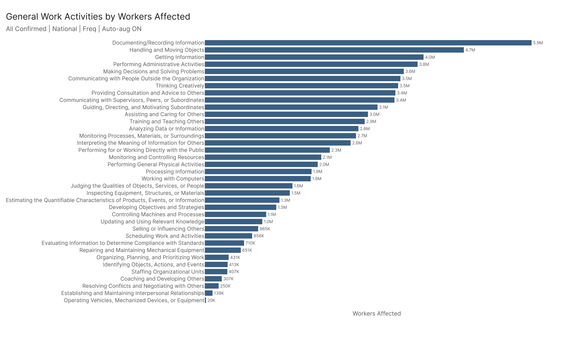
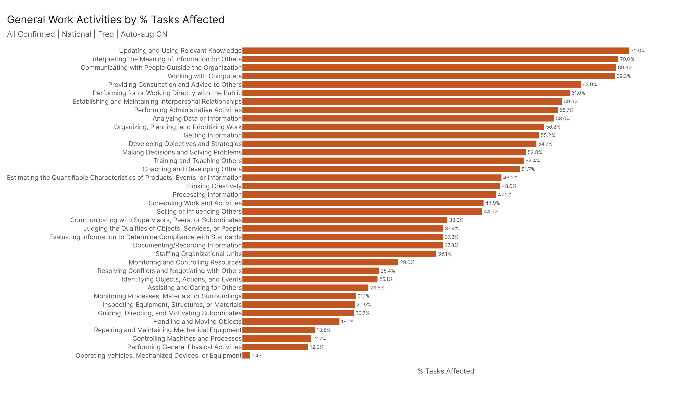
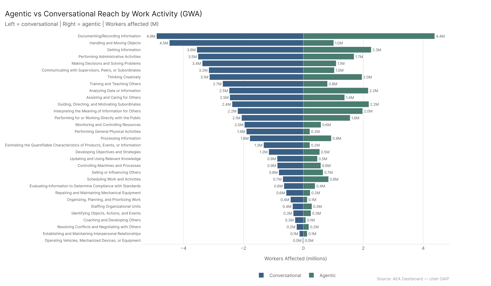
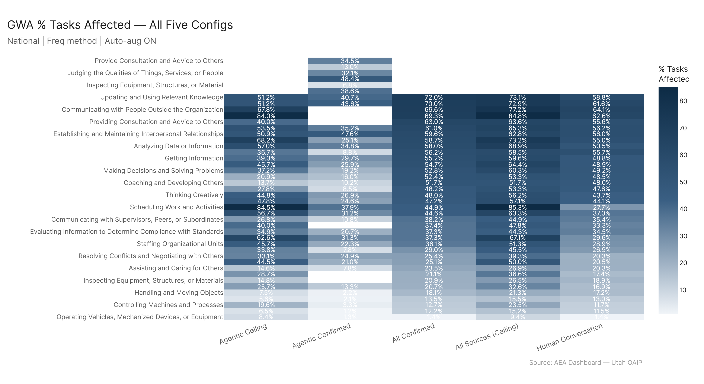
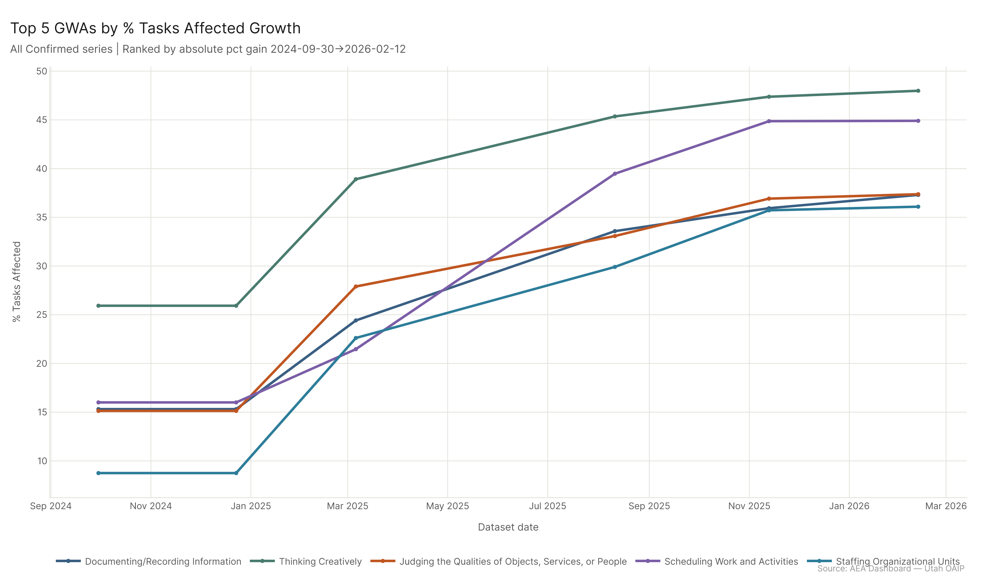

# Economic Footprint: Work Activities

Looking through the work activity lens, the most broadly-affected GWAs by worker count are Documenting/Recording Information (5.9M workers), Handling and Moving Objects (4.7M), and Getting Information (4.0M). But those raw counts include a lot of incidental exposure. The highest percentage-penetration GWAs — Working with Computers (69.3%), Interpreting the Meaning of Information (70.0%), Communicating with People Outside the Organization (69.6%) — point more precisely at where AI is most deeply embedded in work. The agentic/conversational split reveals that action-taking activities (Scheduling, Administrative, Documenting) jump dramatically under agentic AI.

---

## The GWA Landscape

There are 39 General Work Activities in O*NET, and every one of them shows up in at least some exposed occupations. The distribution of worker exposure across these activities under All Confirmed:

The largest by raw worker count is **Documenting/Recording Information** at 5.9M workers. This makes sense — documentation is embedded across every sector, from clinical notes to financial records to incident reports. But 37.3% task penetration is mid-range; it's the sheer number of workers who do this as part of their job that drives the count.

**Handling and Moving Objects** comes in at 4.7M workers, but only 18.1% task penetration. This is a large-worker-count, low-pct-tasks activity — the workers are there because it's a common activity across many occupations, not because AI is deeply penetrating it.

**Getting Information** at 4.0M workers and 55.2% pct_tasks — this is more meaningful. Information gathering is something AI does well, and the high penetration rate reflects that.

The highest-penetration GWAs (pct_tasks_affected) under All Confirmed:
- **Communicating with People Outside the Organization**: 69.6%
- **Interpreting the Meaning of Information for Others**: 70.0%
- **Working with Computers**: 69.3%
- **Updating and Using Relevant Knowledge**: 72.0%
- **Performing Administrative Activities**: 58.7%

These are the activities where AI is most deeply capable relative to what the typical worker in those roles does. Communication, interpretation, knowledge management, administrative execution — the core of information work.

**Operating Vehicles, Mechanized Devices, or Equipment** is at the bottom by penetration: 1.4%. Physical operation of vehicles and machinery is still largely beyond AI's current reach in any embodied sense.

---

## The Agentic Shift in GWAs

The mode comparison reveals how confirmed agentic tool-use (AEI API only) differs from conversational AI at the activity level. The picture here is more nuanced than a simple "agentic beats conversational" story — confirmed agentic deployment is narrower and more specialized.

**Performing Administrative Activities**: 55.0% (conversational) vs. 25.1% (agentic). Administrative tasks are substantially higher under conversational AI. Drafting, composing, and organizing are primarily communicative activities that conversational AI covers broadly. Confirmed API-based agentic usage captures more specialized workflow automation but doesn't broadly dominate the drafting and responding layer.

**Getting Information**: 48.8% (conversational) vs. 29.7% (agentic). Information retrieval through natural-language conversation is where AI is most confirmed and most deployed. Agentic API usage for "getting information" is more specialized — querying structured databases and APIs — and hasn't reached the broad deployment of conversational information access.

**Analyzing Data or Information**: 50.5% (conversational) vs. 34.8% (agentic). Similar pattern — analytical work in current confirmed data is more often conversational than agentic.

**Scheduling Work and Activities**: 27.7% (conversational) vs. 37.9% (agentic). Scheduling ticks up under agentic, consistent with multi-step calendar management being naturally suited to tool-using systems. This is one of the few GWAs where confirmed agentic usage modestly leads conversational.

**Documenting/Recording Information**: 29.6% (conversational) vs. 31.3% (agentic). Nearly identical between modes. Documentation work appears at similar rates in both conversational and API-based agentic deployment.

The agentic ceiling (MCP + AEI API) tells a different story from agentic confirmed: scheduling, administrative, and documenting activities all show much higher ceiling penetration, which is where the "agentic dramatically boosts action-taking activities" observation holds. But the *confirmed* agentic footprint is currently more concentrated in analytical and data-intensive tasks than in broad administrative workflow automation.

---

## IWA-Level View

At the Intermediate Work Activity level (one step below GWA), the highest-worker-count activities under All Confirmed:

1. **Provide information to guests, clients, or customers** — 3.3M workers, 71.7% pct. This is customer-facing information work at scale — retail, hospitality, healthcare, services. 71.7% is a high penetration rate, and 3.3M workers means a substantial portion of the customer service labor force is in scope.

2. **Execute financial transactions** — 2.7M workers, 63.0%. Cash handling, processing payments, managing accounts. The transactional layer of financial work.

3. **Respond to customer problems or inquiries** — 2.2M workers, 75.2%. Call center and customer service work. 75% penetration is extremely high — this is an activity where AI can currently replicate most of what human agents do.

4. **Prepare foods or beverages** — 2.1M workers, 59.5%. High penetration for a physical activity — food preparation embeds substantial information work (recipes, orders, inventory, compliance) that AI can engage with.

5. **Communicate with others about operational plans or activities** — 1.9M workers, 57.8%.

The IWA view confirms what the GWA view suggests: customer-facing information work and transaction processing are the highest-penetration activities at the intermediate level. These are exactly the activities where enterprise AI deployments in customer service and financial services are most advanced.

**Explain technical details of products or services** hits 81.9% task penetration with 1.3M workers — one of the highest-penetration IWAs. Technical explanation is a natural-language task that AI models handle extremely well.

---

## GWA Trends

Across the All Confirmed time series, the GWAs showing the largest gains in pct_tasks_affected are generally consistent with the overall sector growth story — the activities embedded in Legal, Educational, and Sales work have grown most. Working with Computers and activities related to information processing and communication have been among the more stable high-exposure GWAs throughout the full window.

---

## What This Adds to the Sector Picture

The work activity analysis doesn't contradict the sector-level findings — it explains them. Office/Admin is highly exposed because a large share of office and admin work involves documenting, performing administrative activities, and getting information. Sales is highly exposed because the core of sales work is communicating with customers, providing information, and explaining technical details — all high-penetration GWAs. Legal's dramatic growth in exposure corresponds to GWAs like interpreting information, getting information, and processing information gaining AI capability.

The activity layer is where you see *why* sectors are exposed. The sector findings tell you the scale; the GWA findings tell you the mechanism.
