*Primary config: All Confirmed (`AEI Both + Micro 2026-02-12`) | Method: Freq | Auto-aug ON | National (Utah for wage_impact and utah_benchmarks)*

The AEA Dashboard's 40% confirmed task exposure rate isn't an outlier — it sits squarely within the range of what every other major AI-and-work research effort has found, once you understand what each source is actually measuring. Project Iceberg's 11.7% and our 40% don't contradict each other: Iceberg measures skill-wage substitutability, we measure task-level usage breadth. Seampoint's 20% takeover estimate and our agentic_confirmed at 20.3% align precisely — because both are capturing the same underlying phenomenon (AI fully handling tasks without human collaboration) from different angles. What this analysis establishes is that when you map each source's methodology to a position in the measurement spectrum, the numbers stop being confusing and start reinforcing each other. Confirmed usage is broad. Technical capability estimates are conservative by construction. Deployment-constrained estimates sit in between. Our data fits this framework cleanly.

---

## 1. Automation Share

*Full detail: [automation_share/automation_share_report.md](automation_share/automation_share_report.md)*

The core rate comparison: our employment-weighted mean `pct_tasks_affected` across all five configs against Project Iceberg's skill-substitutability index and Seampoint's governance-constrained estimates. The spread from 2.2% (Iceberg surface, tech sector only) to 51% (Seampoint augment) isn't confusion — each number is answering a different question about what AI is doing, can do, or could be deployed to do.

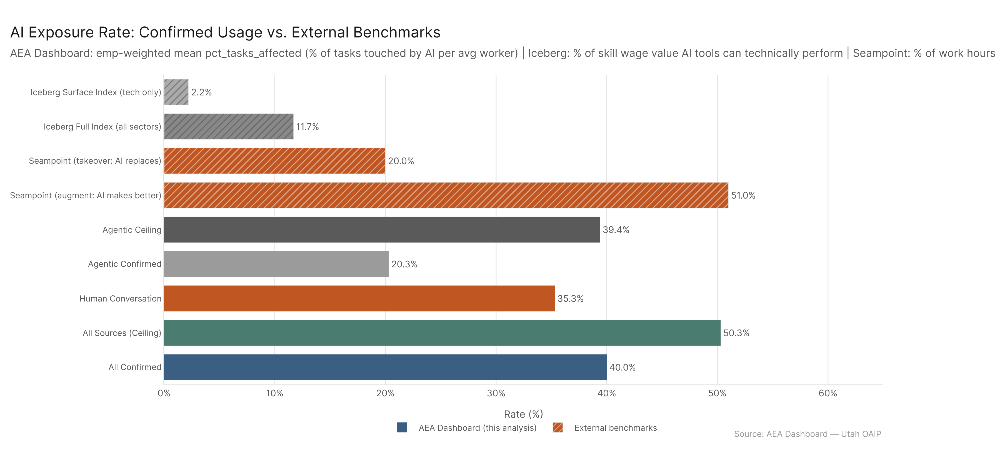

Our agentic_confirmed (20.3%) matches Seampoint's takeover rate (20%) — the alignment between "confirmed full-task tool-use AI" and "governance-constrained deployable AI" is meaningful, not coincidental. Our ceiling (50.3%) nearly matches Seampoint's augment estimate (51%), suggesting that at full AI deployment scope, we're measuring the same ceiling as Seampoint's governance-ceiling.

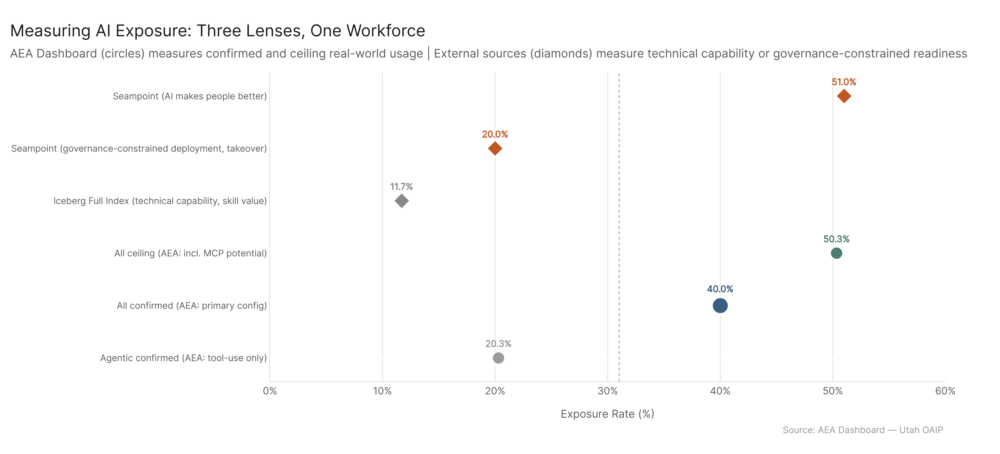

The dot plot maps all six data points on one axis, making the measurement spectrum visible: agentic_confirmed (20%) → all_confirmed (40%) → all_ceiling (50%) → Seampoint takeover (20%) → Seampoint augment (51%) → Iceberg Full (11.7%). Reading it as a spectrum rather than a ranking is the key interpretive move.

---

## 2. Wage Impact

*Full detail: [wage_impact/wage_impact_report.md](wage_impact/wage_impact_report.md)*

Dollar-magnitude comparison between our wages_affected figures and Seampoint's Utah wage estimates — the only external source with public state-level wage-dollar estimates we can calibrate against. Seampoint pegs $21B of Utah wages to tasks AI can fully take over and $36B total. Our confirmed figure is $62.6B.

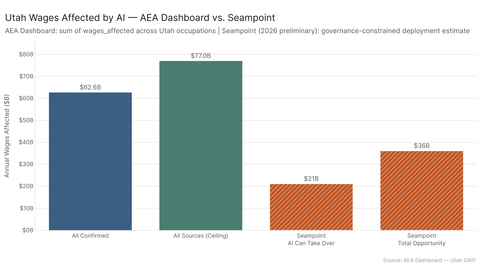

The gap ($62.6B vs $36B) reflects the same framework difference as the rate comparison: we're measuring all tasks AI is observably touching, not just the governance-ready full-handoff tasks. When normalized to the same $104B Utah wage base, our confirmed = 60.2%, ceiling = 74%, Seampoint total = 34.6%.

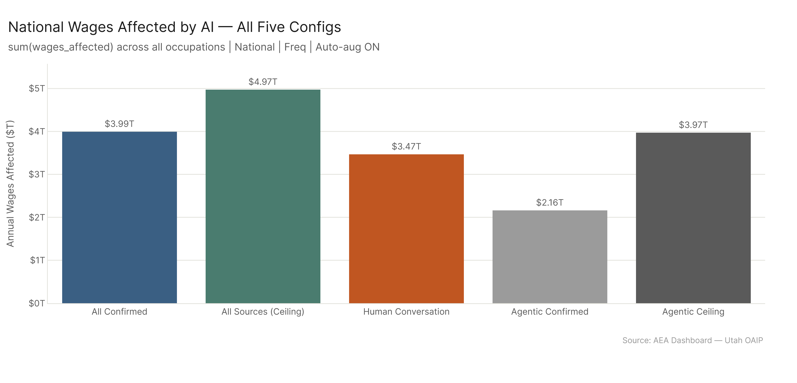

Nationally, all_confirmed = $3.99T, ceiling = $4.97T. The spread across the five configs is tighter than the sector or occupation breakdown would suggest because most workers who are confirmed users also appear in the ceiling dataset.

---

## 3. Utah Benchmarks

*Full detail: [utah_benchmarks/utah_benchmarks_report.md](utah_benchmarks/utah_benchmarks_report.md)*

Utah-specific task exposure analysis. Our all_confirmed rate for Utah workers is 41.9% — slightly above the 40.0% national rate, reflecting Utah's professional-services-heavy workforce composition.

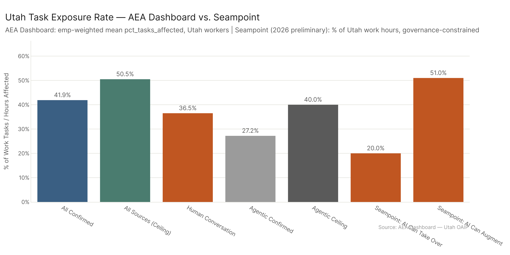

The 41.9% confirmed figure is more than double Seampoint's 20% takeover estimate, which is expected: Seampoint is asking what can be deployed right now under governance constraints; we're asking what AI is currently touching across all usage modes. The alignment of our ceiling (50.5%) with Seampoint's augment estimate (51%) is the cross-validation signal — both analyses converge on what full current-capability AI deployment looks like for Utah's workforce.

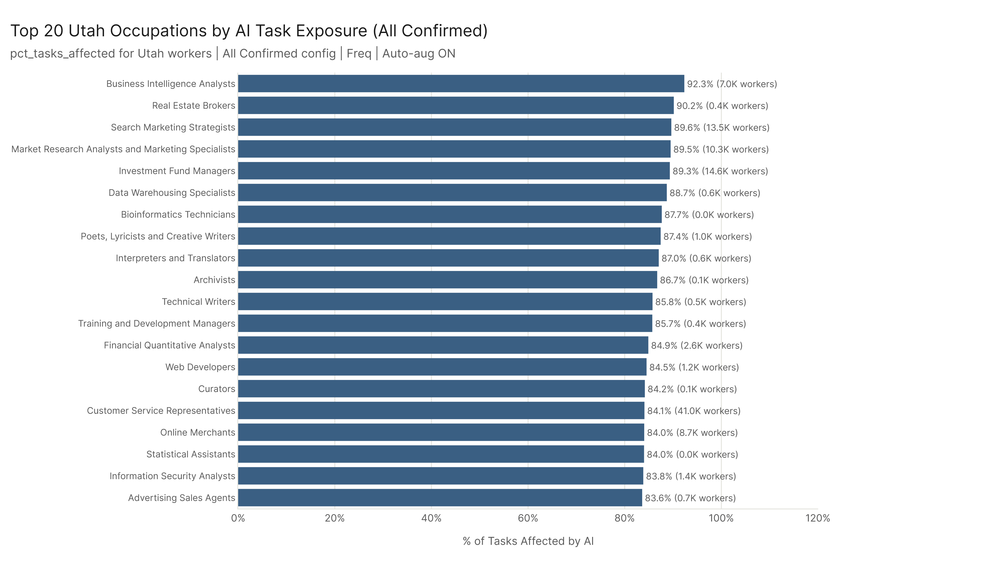

Utah's most-exposed occupations are the same professional-services and administrative categories that dominate nationally — the state workforce composition produces slightly elevated rates but no qualitative difference in which occupations lead.

---

## 4. Theoretical vs. Confirmed

*Full detail: [theoretical_vs_confirmed/theoretical_vs_confirmed_report.md](theoretical_vs_confirmed/theoretical_vs_confirmed_report.md)*

The methodological framing analysis. Three measurement layers: (1) confirmed real-world usage, (2) deployment-constrained readiness, (3) technical capability ceiling. This sub-analysis makes the case for reading all sources as complementary rather than competitive.

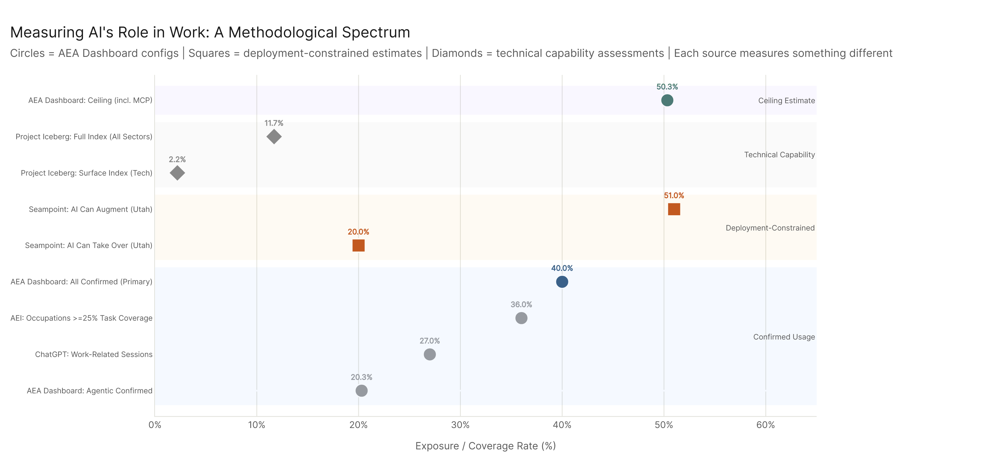

The dot plot puts every source in its measurement layer, color-coded by type. The key visual insight: confirmed usage (our data, AEI, ChatGPT) clusters at 20–40%, deployment-constrained (Seampoint) spans 20–51%, and technical capability (Iceberg) anchors at 2–12%. These aren't disagreements — they're different experiments.

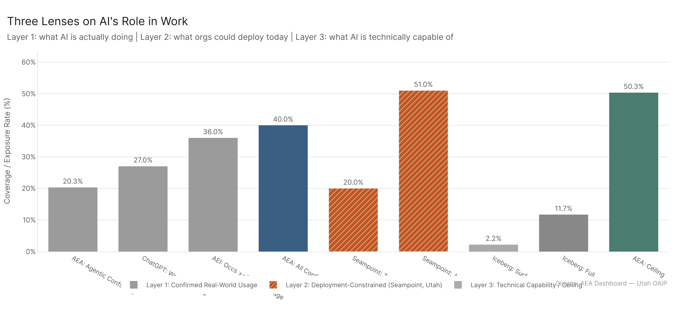

The grouped bar format makes the within-layer spread visible. Confirmed usage sources range from 20% (agentic only) to 40% (all confirmed). ChatGPT (27%) and AEI (~36%) fall in between, consistent with their methodology being somewhat narrower than ours (platform-specific usage logs vs. our multi-source confirmed usage).

---

## 5. Sector Breakdown

*Full detail: [sector_breakdown/sector_breakdown_report.md](sector_breakdown/sector_breakdown_report.md)*

Cross-source comparison of which sectors show highest AI exposure. Five independent sources — our dashboard, Copilot enterprise data, AEI task-attempt analysis, ChatGPT work sessions — all identify the same cluster: Computer/Math, Office/Admin, Sales, Business/Finance.

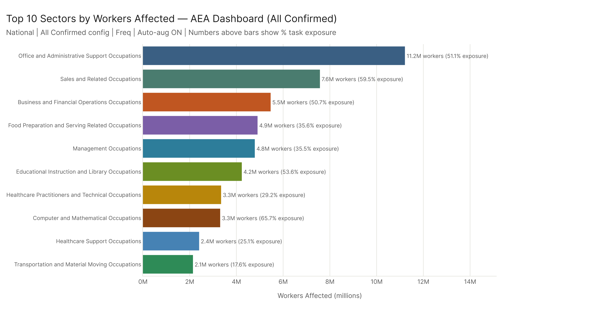

Our primary config puts Office/Admin at 11.2M workers (51.1% exposure), Sales at 7.6M (59.5%), and Business/Finance at 5.5M (50.7%). Sales has the highest per-worker rate among the large-employment sectors.

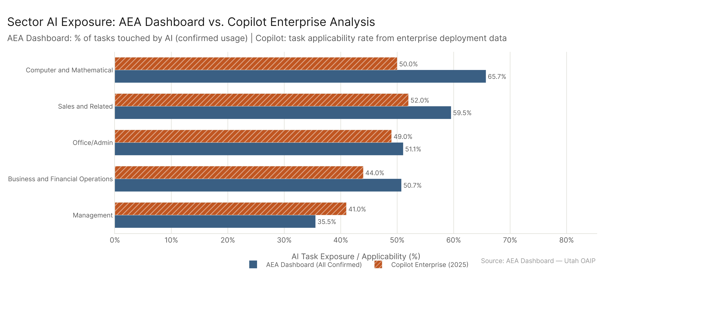

Our rate and Copilot's applicability rate track closely for the five sectors that appear in both analyses (Sales, Computer/Math, Office/Admin, Business/Finance, Management). Our rates are 8–17 percentage points higher on average, consistent with confirmed usage being broader than single-platform applicability.

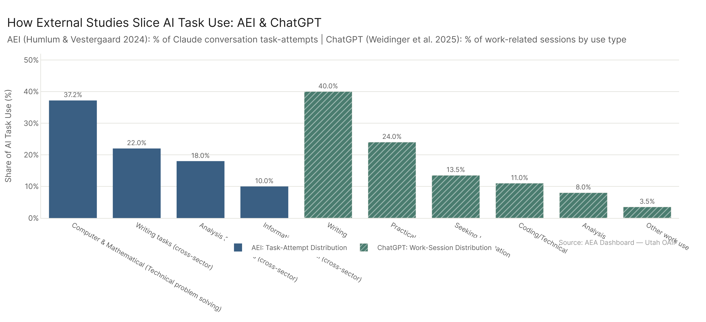

AEI's task-attempt distribution (Computer/Math at 37% of attempts, Writing at 22%) and ChatGPT's work-use types (Writing 40%, Practical Guidance 24%) both point to the same underlying sector clusters.

---

## 6. Work Activity Comparison

*Full detail: [work_activity_comparison/work_activity_comparison_report.md](work_activity_comparison/work_activity_comparison_report.md)*

GWA-level comparison across confirmed-usage platforms. Our top GWAs align with ChatGPT and Copilot's dominant session types: Documenting/Recording Information, Getting Information, and Processing Information appear at the top of every platform's activity distribution.

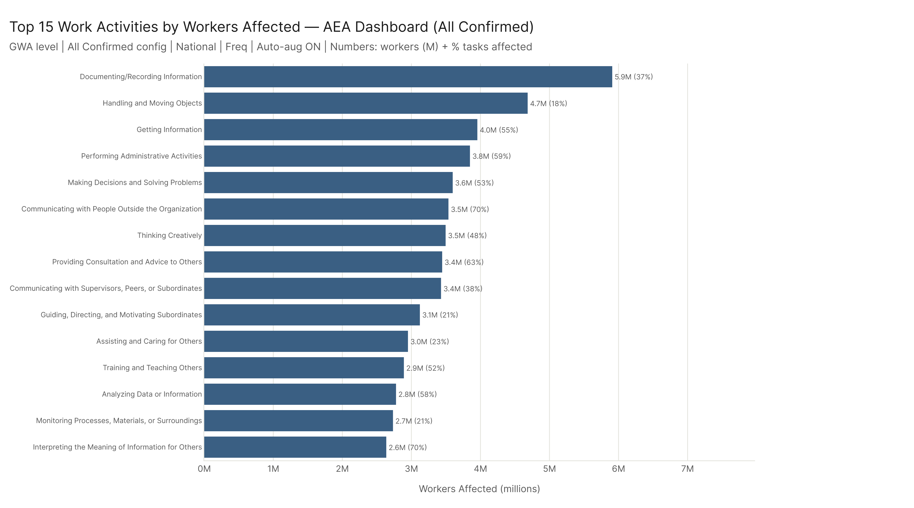

Our top GWAs by worker count: Documenting/Recording (5.9M, 37.3%), Getting Information (4.0M, 55.2%), Administrative Activities (3.8M, 58.7%). High exposure rates on Getting Information and Administrative Activities reflect where AI has near-full task coverage.

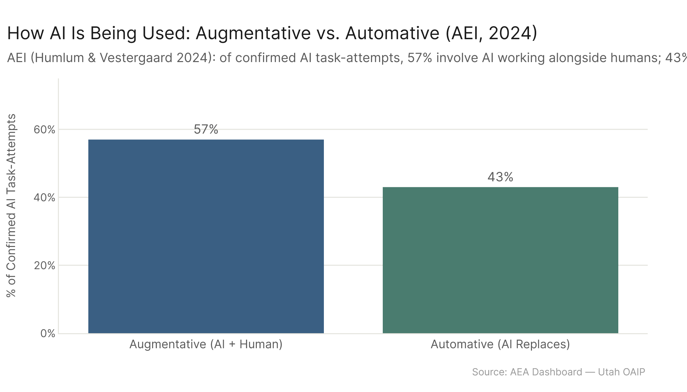

AEI's 57% augmentative / 43% automative split is consistent with our framework's treatment of auto-augmentation: the plurality of AI usage involves AI extending human capability rather than replacing it.

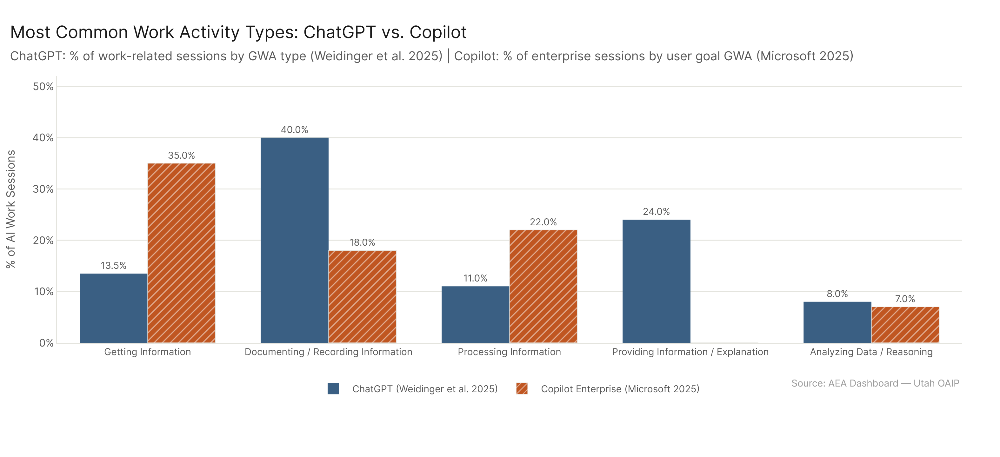

ChatGPT and Copilot agree on the dominant GWA types despite measuring different platforms and contexts. The Copilot-specific finding that ~40% of conversations have disjoint user-goal vs. AI-action IWAs suggests that GWA alignment isn't perfect even within a platform session.

---

## 7. Platform Landscape

*Full detail: [platform_landscape/platform_landscape_report.md](platform_landscape/platform_landscape_report.md)*

The synthesis view: all sources mapped to their methodological position, headline numbers compared, and a rendered source-comparison table.

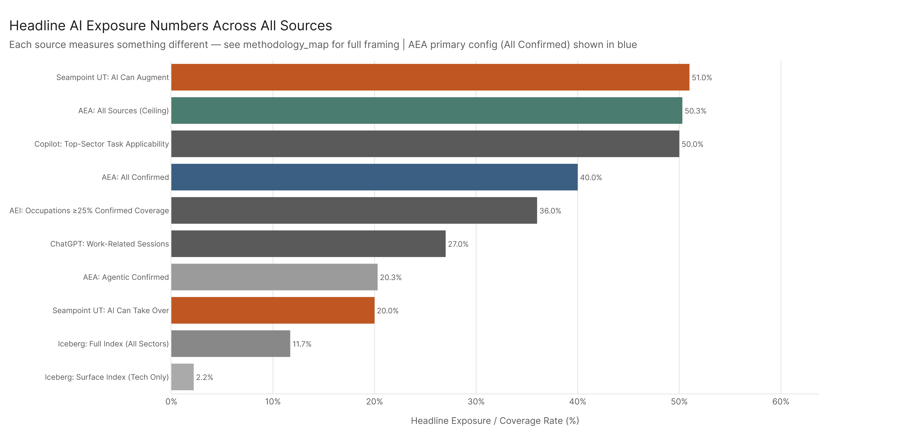

Reading the sorted chart: the AEA Dashboard's all_confirmed (40%) and ceiling (50.3%) anchor the upper end of confirmed usage sources, with Seampoint's augment estimate (51%) nearly matching our ceiling. Iceberg's Full Index (11.7%) and Surface Index (2.2%) sit at the lower end — not because the work is less exposed, but because skill-wage substitutability is a narrower measure than task-level usage.

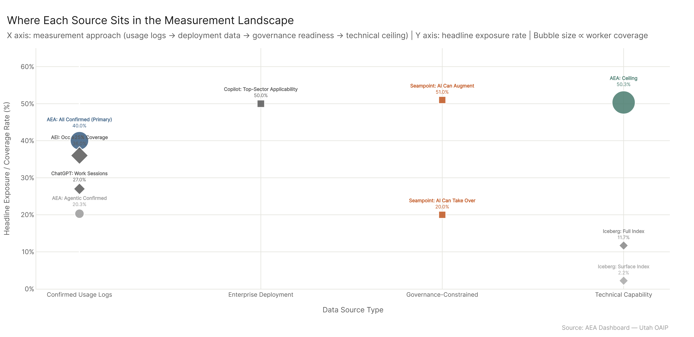

The scatter by measurement type shows that rate variation within a category (confirmed usage sources span 20–40%) is nearly as large as variation across categories. The specific question being asked matters more than whether a source is a usage log or a capability assessment.

---

## Cross-Cutting Findings

**The 20%/20.3% alignment is a genuine cross-validation.** Seampoint's governance-constrained "AI can take over" estimate (20% of Utah work hours) and our agentic_confirmed rate (20.3% of national employment-weighted tasks) are measuring different things from different angles and arrive at the same number. This is meaningful: it says the set of tasks AI can fully perform without human collaboration is reliably measurable at roughly 20% regardless of whether you approach it from deployment readiness or confirmed agentic usage logs.

**The ceiling / augment convergence is similarly informative.** Our all_ceiling (50.3%) and Seampoint's augment estimate (51%) also converge. This suggests there's a natural upper bound for near-term AI task coverage — around 50% of work hours — that shows up consistently whether you're measuring from observed usage (ours) or governance-constrained deployment readiness (Seampoint).

**Confirmed usage is consistently higher than technical capability estimates.** Project Iceberg's 11.7% Full Index is below our confirmed 40%, which is counterintuitive until you understand the unit difference. Iceberg is measuring fraction of skill-wage value; we're measuring breadth of task involvement. An LLM touching 40% of a worker's tasks doesn't mean it's substituting 40% of their skill value — most of those task interactions are augmentative and don't threaten the underlying skill competency that defines the role.

**Cross-platform sector and GWA consensus is strong.** Computer/Math, Office/Admin, Sales, and Business/Finance are the top sectors in every analysis that measures at the sector level. Documenting, Getting Information, and Processing Information dominate GWA-level rankings across every platform. This convergence across five independent methodologies is one of the strongest cross-validation signals in the field.

**The AEA Dashboard fills a unique niche.** No other source simultaneously measures confirmed task-level AI usage, cross-walks it to BLS occupational data, and tracks changes over time. AEI is the closest comparator (also confirmed, also occupational), but is platform-specific and doesn't produce labor-market metrics. This means our data is complementary to every other source in this analysis — not redundant with any of them.

---

## Key Takeaways

1. **40% confirmed, 50% ceiling.** Our primary config places 61.3M workers and $3.99T wages in confirmed AI task scope nationally; the ceiling reaches 77.1M workers and $4.97T wages.
2. **20.3% = 20%.** Our agentic_confirmed rate matches Seampoint's governance-constrained takeover estimate — the best external cross-validation for our framework.
3. **Iceberg's 11.7% is not a contradiction.** Project Iceberg measures skill-wage substitutability (a narrower, more conservative concept than task-level usage). Our higher confirmed rate reflects breadth of AI involvement, not exaggeration.
4. **$62.6B of Utah wages are in confirmed AI task scope.** Against Seampoint's $21B takeover benchmark and $104B total wage base, this places our confirmed figure at 60.2% of Utah wages — consistent with measuring all AI-touched tasks rather than full-handoff governance-ready ones.
5. **All five confirmed-usage sources agree on which sectors lead.** Computer/Math, Office/Admin, Sales, Business/Finance rank highest across our data, Copilot enterprise analysis, AEI task-attempts, and ChatGPT work sessions.
6. **AI is predominantly augmentative.** AEI finds 57% of AI task-attempts involve AI working alongside humans — consistent with our auto-augmentation framework finding that most AI task involvement extends human judgment rather than replacing it.
7. **The field has converged on a ceiling of ~50%.** Both our ceiling and Seampoint's augment estimate land at ~50% — suggesting this is a meaningful near-term upper bound for AI task coverage under current technology.

---

## Sub-Report Index

| Sub-Analysis | Report | What It Answers |
|-------------|--------|-----------------|
| Automation Share | [automation_share_report.md](automation_share/automation_share_report.md) | Task exposure rate vs. Iceberg and Seampoint |
| Wage Impact | [wage_impact_report.md](wage_impact/wage_impact_report.md) | Dollar wages vs. Seampoint Utah $21B/$36B |
| Utah Benchmarks | [utah_benchmarks_report.md](utah_benchmarks/utah_benchmarks_report.md) | Utah pct_tasks_affected vs. Seampoint 20%/51% |
| Theoretical vs. Confirmed | [theoretical_vs_confirmed_report.md](theoretical_vs_confirmed/theoretical_vs_confirmed_report.md) | Where confirmed usage sits in the measurement spectrum |
| Sector Breakdown | [sector_breakdown_report.md](sector_breakdown/sector_breakdown_report.md) | Which sectors rank highest across all platforms |
| Work Activity Comparison | [work_activity_comparison_report.md](work_activity_comparison/work_activity_comparison_report.md) | GWA-level alignment across platforms |
| Platform Landscape | [platform_landscape_report.md](platform_landscape/platform_landscape_report.md) | Full methodology comparison, all sources |

---

## Config Reference

| Config Key | Dataset | Role |
|-----------|---------|------|
| `all_confirmed` | `AEI Both + Micro 2026-02-12` | **PRIMARY** — all confirmed usage |
| `all_ceiling` | `All 2026-02-18` | Upper bound — AEI + MCP + Microsoft |
| `human_conversation` | `AEI Conv + Micro 2026-02-12` | Confirmed human conversational use only |
| `agentic_confirmed` | `AEI API 2026-02-12` | Confirmed agentic tool-use |
| `agentic_ceiling` | `MCP + API 2026-02-18` | Agentic ceiling — MCP + AEI API |
