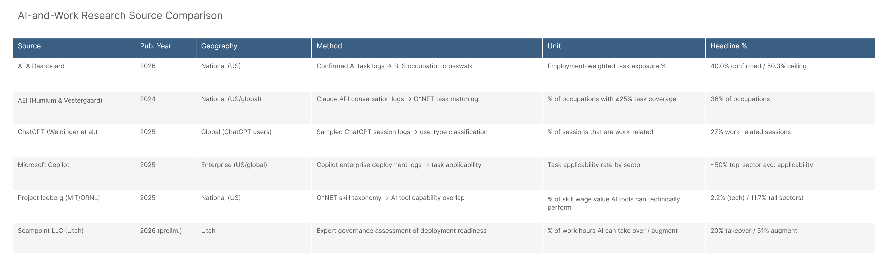

*Config: All five configs | Method: Freq | Auto-aug ON | National | Synthesis view*

The platform landscape view is the answer to "how does your work relate to X?" — where X is any of the five other major AI-and-work analyses we can compare against. What this analysis shows is that the field is not converging on a single number, and that's not a problem. Each source is built to answer a different question: ours asks what AI is actually doing in observed usage, AEI asks which occupational tasks have confirmed AI coverage, ChatGPT studies ask how people are using the tool, Copilot asks which enterprise workflows have task-level applicability, Iceberg asks what AI can technically substitute in skill-wage terms, and Seampoint asks what organizations could actually deploy today. These are six defensible research questions, and the diversity of headline numbers (2% to 51%) reflects the diversity of questions, not methodological error.

*Full detail: [platform_landscape_report.md](platform_landscape_report.md)*

## All Headline Numbers

Sorted by value: Iceberg Surface (2.2%) → ChatGPT work sessions (27%) → Seampoint takeover (20%) → Iceberg Full (11.7%) → AEI coverage (36%) → Copilot top-sector (~50%) → AEA all_confirmed (40%) → Seampoint augment (51%) → AEA ceiling (50.3%). The AEA primary config (40%, shown in blue) sits in the upper cluster — higher than any theoretical-capability or governance-constrained estimate except Seampoint's augment ceiling, which it nearly matches.

## Methodology Map

The scatter puts source type on the x-axis: confirmed usage logs → enterprise deployment → governance-constrained → technical capability ceiling. The vertical spread shows how much the headline rate varies even within a category. The key insight: confirmed usage (x=0) produces rates ranging from 20% (agentic only) to 40% (all confirmed), while technical capability ceiling (x=3) produces everything from 2.2% (Iceberg skill-wage) to 50% (our own ceiling). The y-axis spread within each x-position is almost as wide as the spread across positions — which means the particular question being asked matters more than the type of source.

## Source Comparison Table

The table renders the key methodology attributes for each source side by side. The most important column is "Method" — reading those six rows shows how differently each analysis was constructed and why direct number comparisons require this kind of framing.

## Where the Field Agrees

Despite methodological diversity, several things are consistent across sources:
1. **Computer/Math and Office/Admin are always top-exposed sectors.** Every source that measures sector-level exposure identifies these as the highest-applicability domains.
2. **Information-processing GWAs dominate.** Getting Information, Documenting, and Processing Information are the top activity categories in every platform dataset.
3. **AI usage is predominantly augmentative.** AEI (57% augmentative) and our auto-augmentation flags both suggest AI is more often extending human judgment than replacing it outright.
4. **The confirmed/ceiling gap is real.** Whether measured as worker counts, wages, or task rates, there's consistent evidence that current AI deployment is well below what the technology is capable of reaching.

## Positioning the AEA Dashboard

The AEA Dashboard occupies a specific niche in this landscape: it's the only source measuring confirmed real-world AI task usage at the occupational level nationally, cross-walked to BLS labor market data. AEI comes closest (also confirmed usage, also occupational), but focuses on specific AI API logs rather than aggregated multi-source confirmed usage. ChatGPT and Copilot data are platform-specific and don't produce occupational labor market metrics. Iceberg and Seampoint are capability and readiness assessments, not usage measurements. This makes our data complementary to all of them, not redundant with any.

## Key numbers

| Source | Headline | Type |
|--------|----------|------|
| AEA: All Confirmed | 40.0% / $3.99T | Confirmed usage |
| AEA: Ceiling | 50.3% / $4.97T | Upper bound |
| AEI | ~36% of occs >=25% coverage | Confirmed usage |
| ChatGPT | ~27% work-related sessions | Confirmed usage |
| Copilot | ~50% top-sector applicability | Enterprise deployment |
| Seampoint Utah | 20% takeover / 51% augment | Governance-constrained |
| Project Iceberg | 2.2% surface / 11.7% full | Technical capability |

## Files

| File | Description |
|------|-------------|
| `figures/headline_comparison.png` | All sources' headline rates |
| `figures/methodology_map.png` | Scatter: type vs. rate |
| `figures/source_summary_table.png` | Methodology comparison table |
| `results/platform_comparison_table.csv` | Full comparison data |
