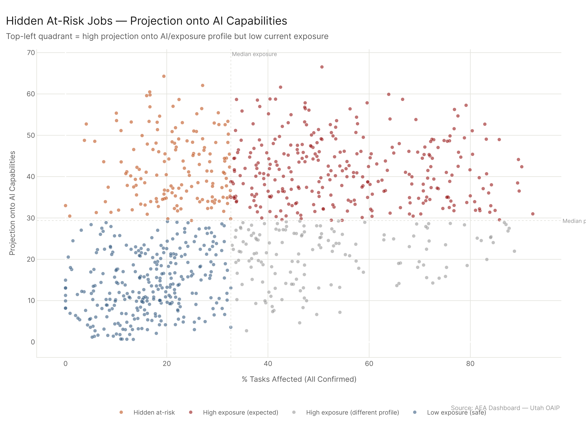
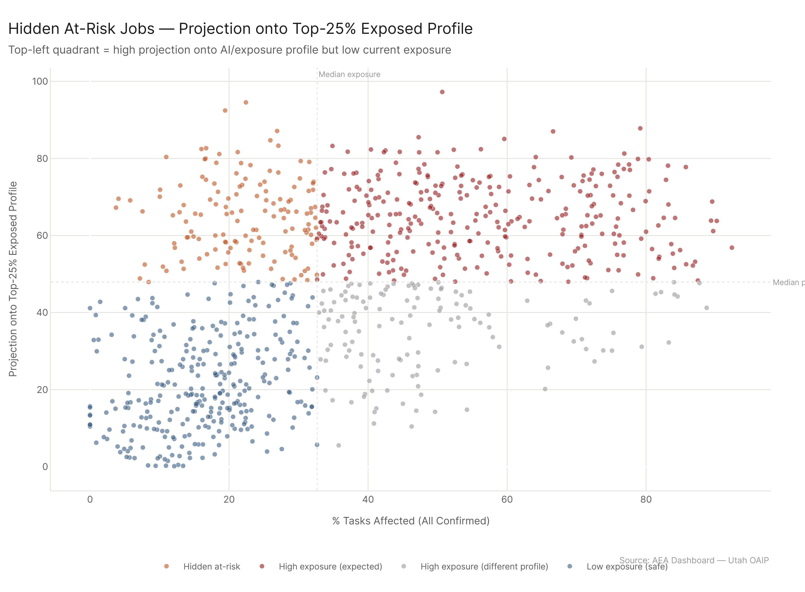
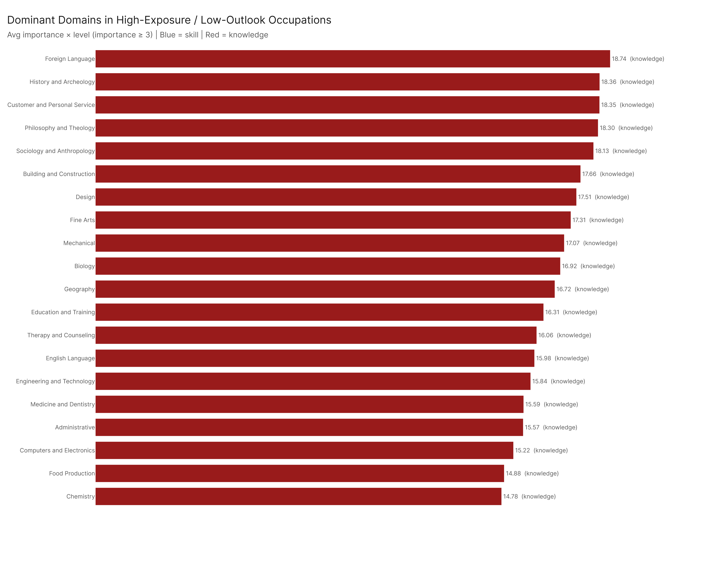

# Audience Framing: Finding the Jobs That Don't Know They're Next

**TLDR:** We replaced cosine similarity with projection-based methods for identifying hidden at-risk occupations -- jobs with low current AI exposure but high alignment with AI's capability vector. The result: 150 occupations flagged by AI projection, 140 by exposure projection, with heavy representation from healthcare specialties. Preventive Medicine Physicians, Urologists, Nurse Anesthetists, and Nuclear Engineers all show up. Over half of these occupations have *rising* exposure trajectories, meaning the "hidden" part of hidden at-risk is temporary. The dominant skill domains in high-exposure/low-outlook jobs are uniformly knowledge-based -- skills don't crack the top 15 even though they're now included in the analysis.

---

## Why Projection

The previous version of this analysis used cosine similarity: take each occupation's skill/knowledge vector, compare it to the average profile of high-exposure occupations, and flag the ones that look similar but aren't yet exposed. That method works, but it treats all elements equally. An occupation that scores high on the same elements as high-exposure jobs gets flagged, regardless of whether those elements are the ones AI actually reaches.

Projection fixes this. Instead of asking "does this occupation look like exposed occupations?" it asks "how much of this occupation's profile falls along the direction AI is actually moving?" Two projection variants:

**AI projection** takes each occupation's SKA vector and projects it onto the AI capability vector -- the direction defined by what AI systems can actually do. Higher projection means more of the occupation's requirements sit in AI's path. Range: 0.62 to 66.53, median 29.38.

**Exposure projection** projects onto the exposure vector -- the direction defined by which occupations are currently most exposed. This captures adoption patterns in addition to raw capability.

The two methods substantially overlap but aren't identical. 150 occupations flag as hidden at-risk by AI projection, 140 by exposure projection. The differences are informative: they reveal occupations where AI has the capability to penetrate but adoption hasn't followed the expected pattern yet.

## Hidden At-Risk: Two Lenses

The top hidden at-risk occupations by projection method, with both confirmed and ceiling exposure:

| Rank | Occupation | Confirmed Pct | Ceiling Pct | Gap |
|------|-----------|---------------|-------------|-----|
| 1 | Preventive Medicine Physicians | 19.4% | 28.1% | +8.7pp |
| 2 | Urologists | 27.1% | 31.3% | +4.2pp |
| 3 | Nurse Anesthetists | 16.6% | 18.5% | +1.9pp |
| 4 | Education Administrators, K-12 | 22.4% | 38.2% | +15.8pp |
| 5 | Nuclear Engineers | 16.7% | 26.8% | +10.1pp |
| 6 | Geothermal Production Managers | 10.0% | 31.0% | +21.0pp |

Geothermal Production Managers deserve a double-take. At 10.0% confirmed exposure, they look completely safe. But their ceiling exposure is 31.0% -- a 21-percentage-point gap that represents the distance between what AI can demonstrably do in their task space right now and what it could plausibly do. That's the largest confirmed-to-ceiling gap in the top group.

## The Healthcare Cluster

The hidden at-risk list is dominated by medical specialties. Preventive Medicine Physicians, Urologists, Nurse Anesthetists -- these are occupations where current AI deployment is low but the skill/knowledge profile projects heavily onto AI's capability direction. The reasons are structural: medical specialties require deep analytical reasoning, pattern recognition across complex data, protocol-based decision-making, and extensive documentation. Those are exactly the capability dimensions where AI systems have made the most progress.

This doesn't mean AI will replace urologists. It means the task composition of these roles has significant overlap with what AI tools are increasingly good at -- diagnostic reasoning, literature synthesis, treatment protocol optimization, clinical documentation. The exposure will come through tool adoption, not role elimination. But 53% of the 150 hidden at-risk occupations (80 of them) already show *rising* exposure trajectories in the confirmed config. The wave is arriving.

## Trend: Rising Exposure

The "hidden" in hidden at-risk is time-limited for most of these occupations. A majority already show rising exposure trends, and some of the increases are dramatic:

- **Geothermal Production Managers:** +22.2 percentage points in ceiling exposure
- **Education Administrators, K-12:** +15.8pp in ceiling
- **Nuclear Engineers:** +10.1pp in ceiling

These aren't occupations where AI exposure is a static theoretical possibility. The trend data shows it materializing in real time. The window between "hidden at-risk" and "visibly at-risk" is closing, and for some of these occupations it may be 2-3 years rather than a decade.

## Dominant Skill Domains

For occupations in the worst-case quadrant -- high exposure *and* poor labor market outlook (DWS rating 2 or 3) -- we asked which skill and knowledge elements are most concentrated. The answer is overwhelmingly knowledge, not skills.

| Rank | Element | Type | Avg Score |
|------|---------|------|-----------|
| 1 | Foreign Language | Knowledge | 18.74 |
| 2 | History and Archeology | Knowledge | 18.36 |
| 3 | Customer and Personal Service | Knowledge | 18.35 |
| 4 | Philosophy and Theology | Knowledge | 18.30 |
| 5 | Design | Knowledge | 17.73 |
| 6 | Sociology and Anthropology | Knowledge | 17.28 |
| 7 | Biology | Knowledge | 17.22 |
| 8 | Geography | Knowledge | 17.14 |
| 9 | Fine Arts | Knowledge | 17.07 |
| 10 | Education and Training | Knowledge | 16.73 |

Skills data IS now included in the analysis -- this version incorporates skills alongside knowledge elements. But skills don't crack the top 15. The dominant profile of high-exposure/low-outlook workers is built on broad liberal-arts knowledge foundations: foreign language, history, philosophy, sociology, fine arts. These are not dead-end specializations. They're transferable intellectual assets.

The implication: workers in the worst-case group are not starting from zero. The reskilling challenge is redirection, not reconstruction. Career navigation and targeted technical upskilling will go further than foundational education for this population.

## Config

Primary: `all_confirmed`. Comparison: `all_ceiling`. Projection methods: AI projection (onto AI capability vector) and exposure projection (onto exposure vector). Skills + Knowledge, importance >= 3. Hidden at-risk threshold: below-median exposure, above-median projection. Trend: rising = positive slope in confirmed exposure over analysis period. High-exposure/low-outlook: pct > median AND DWS rating in {2, 3}.

## Files

| File | Description |
|------|-------------|
| `results/projection_similarity.csv` | All occs: exposure, AI projection score, exposure projection score |
| `results/hidden_at_risk_occs.csv` | Hidden at-risk occs by AI projection method |
| `results/hidden_at_risk_exp_projection.csv` | Hidden at-risk occs by exposure projection method |
| `results/hidden_at_risk_trends.csv` | Trend slopes for hidden at-risk occupations |
| `results/dominant_elements_high_exp_low_outlook.csv` | Top elements in high-exp / low-outlook jobs |
| `results/skill_profile_similarity.csv` | Legacy cosine similarity data (retained for comparison) |
