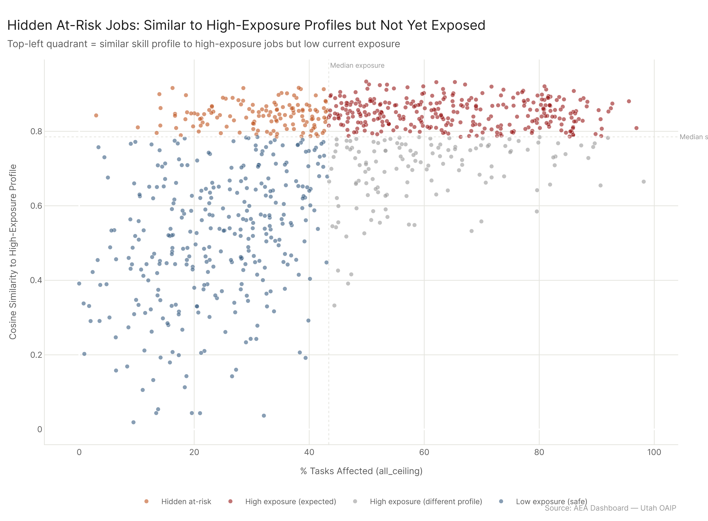

# Audience Framing: How Do Findings Translate for Different Audiences?

*Config: all_ceiling | Method: freq | Skills + Knowledge, importance ≥ 3*

---

## 1. Hidden At-Risk Jobs

### Framework

Some occupations share a skill and knowledge profile nearly identical to high-exposure jobs but haven't yet been hit by confirmed AI usage. These are the "next wave" -- AI's capabilities already map onto their skill requirements, but adoption hasn't penetrated their task load yet. For policymakers, these are the jobs to watch and prepare for. For workers in these roles, the window to reskill is still open.

We identify them using cosine similarity between each occupation's skill+knowledge vector (893 occupations by 53 elements) and the average profile of all above-median-exposure occupations. Occupations in the upper-left quadrant -- high similarity to the high-exposure profile but below-median exposure themselves -- are classified as hidden at-risk.

### Results

From a matrix of 893 occupations across 53 skill and knowledge elements, the high-exposure reference profile was computed from 445 occupations (those above the median exposure level). Cosine similarity to this profile ranges from 0.019 to 0.933, with a median of 0.785. **134 occupations are classified as hidden at-risk** -- their skill profiles closely match those of heavily exposed jobs, but their own task-level AI exposure has not yet materialized.

The top ten hidden at-risk occupations, ranked by similarity to the high-exposure profile:

| Rank | Occupation | Similarity |
|------|-----------|-----------|
| 1 | Education Administrators, K-12 | 0.920 |
| 2 | Range Managers | 0.920 |
| 3 | Special Education Teachers, Elementary | 0.920 |
| 4 | Special Education Teachers, Preschool | 0.910 |
| 5 | Education/Childcare Administrators, Preschool/Daycare | 0.910 |
| 6 | Loss Prevention Managers | 0.900 |
| 7 | Gambling Managers | 0.900 |
| 8 | Foresters | 0.900 |
| 9 | Media Programming Directors | 0.900 |
| 10 | Ophthalmologists | 0.900 |

Education and management roles dominate the hidden at-risk list. These occupations require analytical reasoning, written communication, coordination, and judgment -- the same skill profile that characterizes heavily exposed information-work roles. The difference is that AI adoption has not yet penetrated the specific task structures of K-12 administration, special education instruction, or specialized management. That gap is a matter of deployment timing, not capability mismatch.

Notable among the 29 named occupations of interest: **Registered Nurses** are flagged as hidden at-risk. At 40.2% task exposure, they fall below the median, but their skill profile -- combining active listening, critical thinking, service orientation, and broad knowledge domains -- is highly similar to occupations already experiencing heavy AI integration. This finding should inform workforce planning in healthcare, one of the economy's largest employment sectors.

---

## 2. Dominant Skill Domains in High-Exposure / Low-Outlook Jobs

### Framework

High exposure combined with poor labor-market outlook (DWS rating 2 or 3) is the worst combination a worker can face: AI is already reaching into these jobs, and the labor market is not absorbing displaced workers effectively. Understanding which skill and knowledge domains are most concentrated in this group tells policymakers and educators where retraining investment is most urgent -- and whether the affected workers have transferable foundations or face a cold start.

### Results

189 occupations meet the dual criteria of above-median AI exposure and a DWS outlook rating of 2 or 3. The dominant elements in this group, ranked by average importance-times-level score:

| Rank | Element | Type | Avg Score |
|------|---------|------|-----------|
| 1 | Philosophy and Theology | Knowledge | 18.83 |
| 2 | Customer and Personal Service | Knowledge | 18.39 |
| 3 | Foreign Language | Knowledge | 18.11 |
| 4 | History and Archeology | Knowledge | 17.96 |
| 5 | Design | Knowledge | 17.73 |
| 6 | Sociology and Anthropology | Knowledge | 17.28 |
| 7 | Biology | Knowledge | 17.22 |
| 8 | Geography | Knowledge | 17.14 |
| 9 | Fine Arts | Knowledge | 17.07 |
| 10 | Education and Training | Knowledge | 16.73 |

The dominant elements are uniformly broad, general knowledge domains -- not specialized technical skills. Philosophy and Theology, History and Archeology, Sociology and Anthropology, and Foreign Language are liberal-arts foundations with wide applicability. Customer and Personal Service, Education and Training, and Design are practical domains that transfer across sectors. Even Biology and Geography represent general scientific literacy rather than narrow technical specialization.

This pattern carries a direct policy implication: workers in the worst-case group are not starting from zero. They possess broadly transferable knowledge foundations. The reskilling challenge is not about building new competencies from scratch; it is about redirecting existing knowledge toward occupations with better labor-market outlook and lower AI exposure. Retraining programs for this population should emphasize career navigation and targeted technical upskilling, not foundational education.

---

## 3. Key Takeaways

1. **134 occupations are one deployment wave away from high exposure.** Their skill profiles are nearly indistinguishable from today's most-exposed jobs. Education and management roles are disproportionately represented, meaning the next wave of AI impact will likely hit public-sector and supervisory occupations that current policy discussions largely overlook.

2. **Workers in the worst-case group have transferable foundations.** The dominant skill domains among high-exposure, low-outlook occupations are broad knowledge areas -- not dead-end specializations. Retraining investment should focus on career pathway design and targeted technical supplements, not remedial education.

3. **Registered Nurses -- one of the largest employment categories in the economy -- are hidden at-risk.** At 40.2% current exposure, they appear moderate, but their skill profile closely mirrors heavily exposed occupations. Healthcare workforce planning should account for the probability that nursing task exposure will rise as AI deployment in clinical and administrative settings accelerates.

## Config

Primary: `All 2026-02-18`. High-exposure: pct > median. Low-outlook: DWS rating in {2, 3}. Skills + Knowledge only, importance >= 3. Similarity: cosine, 893 occs x 53 elements.

## Files

| File | Description |
|------|-------------|
| `results/skill_profile_similarity.csv` | All occs: exposure, cosine similarity to high-exposure profile |
| `results/hidden_at_risk_occs.csv` | Low-exposure occs with high skill-profile similarity |
| `results/dominant_elements_high_exp_low_outlook.csv` | Top elements in high-exp / low-outlook jobs |
