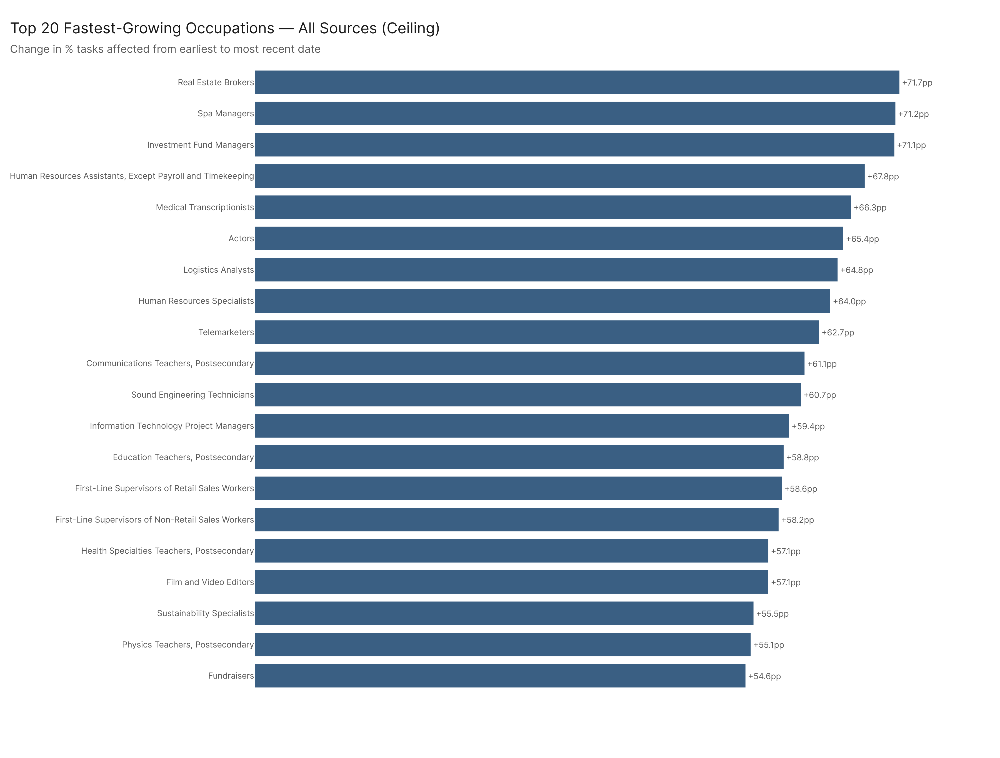

# Exposure State: What Is the Current State of AI Task Exposure?

*Config: All five analysis configs | Primary: all_ceiling | Method: freq (time-weighted) | Auto-aug ON | National*

---

## 1. The Breadth of AI Task Exposure

Across 923 detailed U.S. occupations covering approximately 153.2 million workers, AI systems can now address a substantial share of occupational tasks. Under the primary configuration (all_ceiling, which reflects the maximum demonstrated capability of current AI systems across all evaluated sources), the tier distribution is:

| Tier | Threshold | Occupations | Workers |
|------|-----------|-------------|---------|
| High | >= 60% of tasks affected | 249 | 54.2M |
| Moderate | 40 -- 59% | 259 | 47.3M |
| Restructuring | 20 -- 39% | 275 | 33.8M |
| Low | < 20% | 140 | 17.9M |

More than one in four occupations falls into the high-exposure tier, and those occupations employ 54.2 million workers -- roughly 35% of the measured workforce. Adding the moderate tier brings the total to 508 occupations and 101.5 million workers with at least 40% of their tasks affected. Only 140 occupations, employing 17.9 million workers, remain below the 20% threshold.

The scatter plot above illustrates the relationship between an occupation's task exposure level and its employment size. High-exposure occupations are not concentrated in small, niche roles -- they span some of the economy's largest employment categories.

## 2. Config Comparison: Capability Ceiling vs. Confirmed Deployment

The gap between what AI can do and what organizations have actually deployed is one of the most policy-relevant dimensions of this analysis. Comparing the five analysis configurations for the high-exposure tier alone reveals the scale of that gap:

| Configuration | High-Tier Occs | High-Tier Workers |
|---------------|---------------|-------------------|
| all_ceiling | 249 | 54.2M |
| agentic_ceiling | 156 | 40.3M |
| agentic_confirmed | 154 | 39.0M |
| all_confirmed | 145 | 31.4M |
| human_conversation | 81 | 17.5M |

The all_ceiling configuration identifies 249 occupations at high exposure; the most conservative configuration, human_conversation (which counts only tasks where AI capability has been confirmed through direct human use), identifies 81. That three-to-one ratio represents a deployment opportunity gap of roughly 36.7 million workers. In practical terms, current AI systems have demonstrated the capability to affect a high share of tasks in 168 more occupations than organizations have yet adopted them for.

The agentic configurations (agentic_ceiling and agentic_confirmed) cluster closely at 154--156 occupations, suggesting that once agentic AI capabilities are relevant to a role, adoption tends to follow. The broader all_confirmed figure (145 occupations) is slightly lower than the agentic pair, reflecting the fact that some non-agentic ceiling capabilities have not yet been confirmed through deployment.

## 3. Which Sectors Are Most Exposed

Breaking exposure down by major occupation category shows that AI task exposure is not evenly distributed across the economy. The share of each category's employment that falls into the high-exposure tier under all_ceiling:

| Major Category | % Employment in High Tier |
|----------------|--------------------------|
| Sales and Related | 99.8% |
| Computer and Mathematical | 99.1% |
| Office and Administrative Support | 89.8% |
| Arts, Design, Entertainment, Sports, and Media | 61.4% |
| Educational Instruction and Library | 58.5% |
| Business and Financial Operations | 55.1% |
| Protective Service | 37.5% |
| Management | 34.0% |

Sales and Computer/Mathematical occupations are nearly universally in the high tier, reflecting the information-intensive, rules-driven nature of their task structures. Office and Administrative Support follows closely at 89.8%, consistent with the well-documented susceptibility of clerical and data-handling work to automation. The Arts and Education categories, at 61% and 59% respectively, may surprise some readers -- these figures reflect AI's growing capacity for content generation, curriculum design, and assessment tasks, even though core creative and interpersonal elements remain less affected.

Management occupations are notable for their relatively low share (34%) in the high tier despite containing many information-heavy roles. This likely reflects the weight of supervisory, judgment, and relationship-management tasks that current AI systems handle less effectively.

## 4. Trend Analysis: The Trajectory Is Broad and Steep

Exposure levels are not static. Comparing each occupation's earliest and most recent pct_tasks_affected values shows near-universal growth: 887 of 923 occupations saw positive increases, with zero occupations declining. The median gain was 16.7 percentage points; the mean was 20.9 percentage points.

The fastest-rising occupations under all_ceiling include:

| Occupation | From | To | Change |
|------------|------|----|--------|
| Real Estate Brokers | 18.6% | 90.3% | +71.7 pp |
| Spa Managers | 9.9% | 81.1% | +71.2 pp |
| Investment Fund Managers | 21.3% | 92.5% | +71.1 pp |
| HR Assistants | 22.0% | 89.8% | +67.8 pp |
| Medical Transcriptionists | 16.4% | 82.7% | +66.3 pp |
| Actors | 14.2% | 79.6% | +65.4 pp |
| Logistics Analysts | 15.7% | 80.5% | +64.8 pp |
| Telemarketers | 35.4% | 98.2% | +62.7 pp |

These occupations span real estate, finance, healthcare administration, creative industries, and logistics -- there is no single-sector pattern. The top climbers under the more conservative human_conversation config tell a similar story: Actors (+49.0 pp), Medical Transcriptionists (+46.1 pp), and Communications Teachers (+45.6 pp) all show large confirmed-usage gains, indicating that these are not merely theoretical capability expansions but reflect real deployment trajectories.

The 36 occupations with zero change are concentrated in roles where the task inventory has remained stable and no new AI capabilities have been mapped -- typically highly physical or site-specific occupations.

## 5. Key Takeaways

1. **AI task exposure is already majority-scale.** Under the primary ceiling configuration, occupations employing 101.5 million workers -- two-thirds of the measured workforce -- have at least 40% of their tasks affected. This is not a future scenario; it reflects current system capabilities.

2. **The deployment gap is large but narrowing.** The difference between ceiling and confirmed-usage configurations shows that roughly 36.7 million additional workers are in occupations where AI could affect a high share of tasks but has not yet been widely deployed. Workforce development strategies should account for this latent exposure.

3. **Exposure is broad-based, not sector-specific.** While Sales, Computer/Mathematical, and Office/Administrative occupations lead, the trend data shows rapid growth across real estate, finance, healthcare administration, creative industries, and education. No major sector is untouched.

4. **Growth is near-universal and accelerating.** With 96% of occupations showing positive exposure growth and a median increase of 16.7 percentage points, the trajectory suggests that today's moderate-exposure occupations are tomorrow's high-exposure occupations. Policy responses that focus only on currently high-exposed roles will be insufficient.

5. **Confirmed agentic deployment tracks capability closely.** The tight clustering of agentic_ceiling (156 occs) and agentic_confirmed (154 occs) in the high tier suggests that where agentic AI systems are capable, organizations are adopting them rapidly -- a pattern that may accelerate broader deployment.

## Config

All five analysis configs (see `analysis/config.py::ANALYSIS_CONFIGS`). Primary: `All 2026-02-18`. Method: freq, auto-aug ON, national.

## Files

| File | Description |
|------|-------------|
| `results/all_occupations_exposure.csv` | All 923 occs with pct across all five configs |
| `results/tier_by_config.csv` | Tier counts and employment per config |
| `results/major_tier_rollup.csv` | Tier distribution within each major category |
| `results/pct_trend_by_config.csv` | First-to-last pct growth per occ per config |
