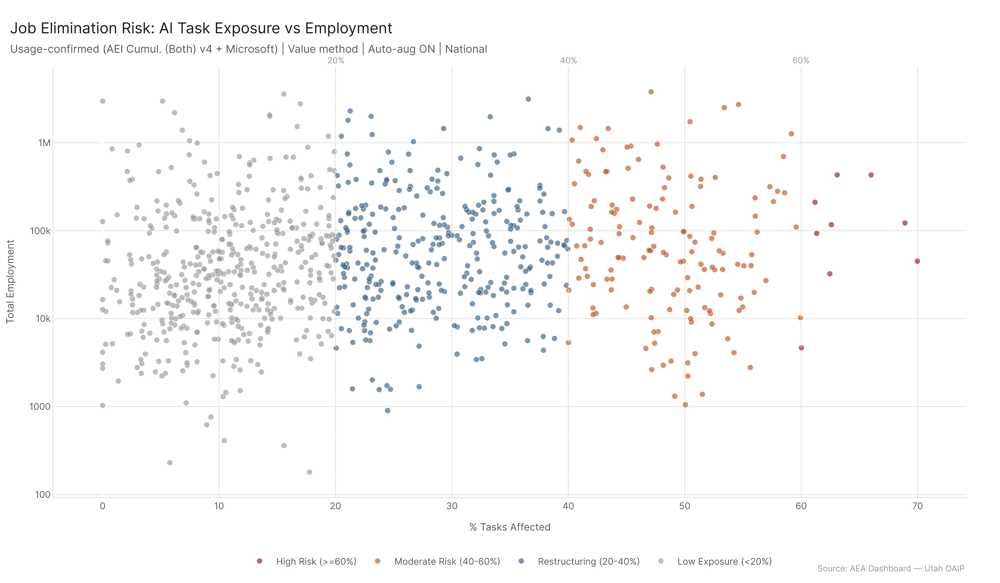
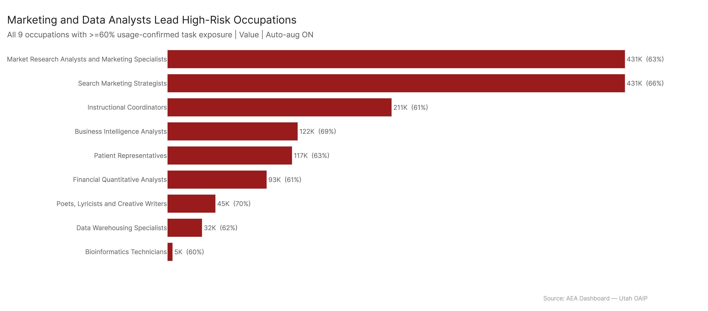
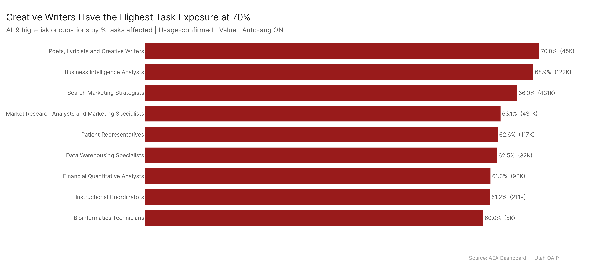
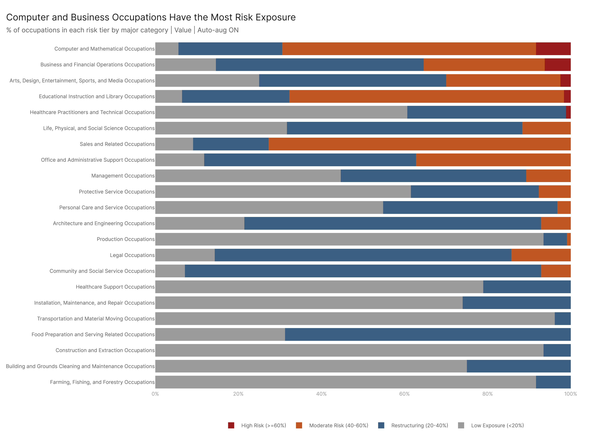
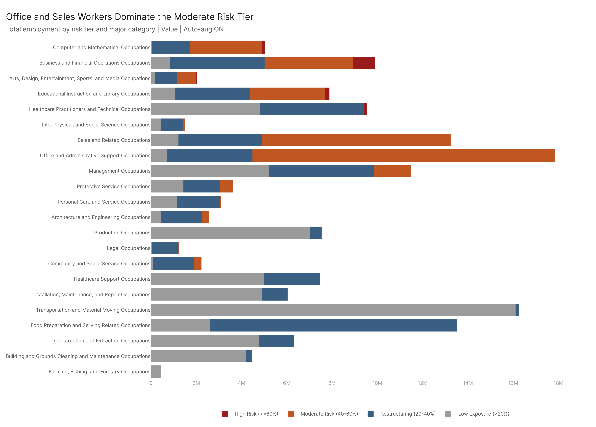

# Question: Which occupations are most exposed to AI?

The previous analysis ("AI Transformative Potential") identified where AI *could* change things — the gap between capability and adoption. This question asks a harder, more policy-relevant question: **where are jobs most exposed to AI-driven change?**

Job exposure requires a specific combination: the AI has to be able to do *most* of the job (high task coverage), it has to do it *well* (high auto-aug scores), and there has to be evidence that people are *already using* AI for it (not just that it's theoretically capable). A job with 30% task exposure gets restructured — the remaining 70% still needs a human. A job with 65%+ task exposure is where you start asking whether the job needs to exist in its current form.

We use **AEI Cumul. (Both) v4 + Microsoft** as the data sources because these capture actual AI usage: real Claude conversations (including API tool-use) and real Copilot sessions. The **ceiling on capability** comparison uses all three sources — AEI Cumul. (Both) v4, MCP Cumul. v4, and Microsoft — combined with the **Max** method, representing the upper bound of AI exposure from any single source. This ceiling identifies emerging exposure: jobs where the technology exists to automate most of the work, regardless of which source detects it.

The **Value method** (importance-weighted) is the primary method because it captures whether the *valuable* parts of the job are AI-exposed, not just the frequent tasks. A sensitivity check with the Time (frequency) method confirms stability.

---

## 1. The Exposure Tier Framework

We tier all 923 occupations in the O*NET/BLS universe by their **% tasks affected** — the share of the occupation's total weighted task value that is AI-exposed, confirmed by actual usage data:

| Tier | Threshold | Interpretation |
|------|-----------|---------------|
| **High Exposure** | >= 60% | Majority of task value is already being done by AI. Job's existence as currently defined is in question. |
| **Moderate Exposure** | 40–60% | Significant AI overlap. Job likely restructures — core changes but doesn't disappear. |
| **Restructuring** | 20–40% | Noticeable AI exposure. Job changes at the margins; some tasks shift to AI. |
| **Low Exposure** | < 20% | Minimal AI overlap with current usage patterns. |

**Important framing**: High task exposure does **not** equal job loss. It means the occupation's task bundle heavily overlaps with what AI is demonstrably being used for. Whether this leads to elimination, restructuring, fewer new hires, or productivity gains depends on deployment economics, regulation, organizational inertia, and factors this data doesn't capture. What the data *does* tell us is where the pressure exists.

### Tier Distribution

| Tier | Occupations | Workers | Share of Economy |
|------|-------------|---------|-----------------|
| High Exposure (>=60%) | 9 | 1.5M | 1.0% |
| Moderate Exposure (40–60%) | 146 | 35.9M | 23.4% |
| Restructuring (20–40%) | 311 | 53.1M | 34.6% |
| Low Exposure (<20%) | 457 | 62.7M | 40.9% |

Almost half of occupations (457 of 923) have less than 20% task exposure from current AI usage. But the moderate exposure tier alone covers 35.9 million workers — nearly a quarter of the national workforce — in occupations where 40–60% of the task value is AI-overlapping.

The scatter plot above maps every occupation by its % tasks affected (X-axis) against total employment (Y-axis, log scale). The color coding shows exposure tiers. The upper-right quadrant — high exposure AND large workforce — is where the policy concern concentrates. Note that the 9 high-exposure occupations (red dots) are mostly mid-size by employment (30K–430K), while the truly massive occupations (1M+ workers) cluster in the moderate and restructuring tiers.

---

## 2. The High-Exposure Tier: 9 Occupations at 60%+ Task Exposure

These are the occupations where usage-confirmed data shows that the majority of the job's task value is already being done by AI:

| Rank | Occupation | % Tasks | Employment | Median Wage | Major Category |
|------|-----------|---------|------------|-------------|---------------|
| 1 | Market Research Analysts and Marketing Specialists | 63.1% | 430,570 | $74,680 | Business and Financial |
| 2 | Search Marketing Strategists | 66.0% | 430,570 | $74,680 | Business and Financial |
| 3 | Instructional Coordinators | 61.2% | 210,850 | $66,490 | Educational Instruction |
| 4 | Business Intelligence Analysts | 68.9% | 122,459 | $100,910 | Computer and Mathematical |
| 5 | Patient Representatives | 62.6% | 117,145 | $40,780 | Healthcare Practitioners |
| 6 | Financial Quantitative Analysts | 61.3% | 93,246 | $108,020 | Business and Financial |
| 7 | Poets, Lyricists and Creative Writers | 70.0% | 45,017 | $73,150 | Arts and Entertainment |
| 8 | Data Warehousing Specialists | 62.5% | 32,385 | $100,910 | Computer and Mathematical |
| 9 | Bioinformatics Technicians | 60.0% | 4,660 | $50,250 | Life/Physical/Social Science |

### What these occupations have in common

They are **information-processing jobs** where AI's core strengths — data analysis, content generation, pattern recognition, research synthesis — directly overlap with the most valuable parts of the work. They're not manual labor jobs, not interpersonal care jobs, not jobs that require physical presence. They are the jobs where a human sits at a desk and works primarily with text, data, and analysis.

**Market Research Analysts and Search Marketing Strategists** are the largest by employment (both ~431K workers). These are roles centered on analyzing data, identifying patterns, generating reports, and creating content strategies — tasks where both Claude (via AEI) and Copilot (via Microsoft) are demonstrably being used.

**Business Intelligence Analysts** (69% exposed, 122K workers) and **Financial Quantitative Analysts** (61%, 93K) represent the analytical end of business and finance — building models, running queries, interpreting datasets. These are also among the highest-paid occupations in the high-exposure tier ($100K+ median wage), meaning the wage impact per worker is substantial.

**Poets, Lyricists and Creative Writers** have the single highest exposure (70%) but a small workforce (45K). This is the occupation most often cited in public discourse about AI and creative work, and the data supports the concern — at least in terms of task overlap with demonstrated AI usage.

**Patient Representatives** (63%, 117K) is a notable outlier — a healthcare-adjacent role focused on communication, documentation, and information relay rather than clinical care. It's the kind of healthcare role that is heavily informational, which is exactly where AI usage shows up.

---

## 3. The Moderate Exposure Tier: 146 Occupations, 35.9 Million Workers

The moderate exposure tier (40–60% tasks affected) is where the bulk of the policy-relevant workforce sits. These occupations have significant AI task overlap — enough that the job is likely to change substantially — but not so much that elimination is the primary concern. Restructuring is the more likely outcome: the composition of the job shifts, some tasks are automated, new tasks emerge, and fewer people may be needed for the same output.

### The largest moderate-exposure occupations

| Occupation | % Tasks | Employment |
|-----------|---------|------------|
| Customer Service Representatives | 54.6% | 2,725,930 |
| General Office Clerks | 53.4% | 2,510,550 |
| Secretaries and Admin Assistants (excl. legal/medical/exec) | 50.5% | 1,737,820 |
| Bookkeeping, Accounting, and Auditing Clerks | 43.4% | 1,455,770 |
| Accountants and Auditors | 47.1% | 1,410,540 |
| Sales Reps, Wholesale and Manufacturing | 59.2% | 1,266,860 |
| Registered Nurses | 40.3% | 1,259,940 |
| Software Developers | 46.7% | 1,244,810 |

This is where the **scale** of AI's impact becomes apparent. Customer Service Reps alone represent 2.7 million workers at 55% task exposure. General Office Clerks — 2.5 million workers at 53%. Secretaries — 1.7 million at 51%. These are enormous occupations in the heart of the U.S. economy.

Software Developers at 47% is notable: nearly half of the task value in software development is overlapping with demonstrated AI usage, but the job is far from being eliminated — the remaining 53% includes the judgment, architecture, and human communication aspects that AI assists with but doesn't replace.

Registered Nurses at 40% might surprise people — but this reflects the substantial documentation, care coordination, and informational tasks in nursing, not the clinical/physical care components.

---

## 4. Exposure Distribution by Major Category

Not all sectors are equally exposed. The chart below shows what share of each major category's occupations fall in each exposure tier:

### Highest concentration of high-exposure occupations

**Computer and Mathematical Occupations** have the most exposure: roughly 60% of occupations in this category are in the moderate or high-exposure tiers. This isn't surprising — these are the occupations most directly overlapping with AI's analytical and code-generation capabilities.

**Business and Financial Operations** follows closely, with the majority of occupations in the restructuring-or-higher tiers. Three of the 9 high-exposure occupations (Market Research Analysts, Financial Quant Analysts, Search Marketing Strategists) come from this category.

**Arts, Design, Entertainment, Sports, and Media** has a notable high-exposure presence from creative writing occupations, plus a substantial moderate-exposure tier from design and media roles.

**Educational Instruction and Library Occupations** is interesting — one high-exposure occupation (Instructional Coordinators) and a substantial moderate tier, reflecting the heavy AI usage in educational contexts documented in the transformative potential analysis.

### Lowest exposure

**Farming, Fishing, and Forestry**, **Construction and Extraction**, and **Building and Grounds Cleaning** are almost entirely in the low-exposure tier. These are physically intensive occupations where AI's text/data capabilities have minimal overlap with the actual task structure.

The employment view tells a different story than the occupation count. **Office and Administrative Support** has the most workers in moderate and restructuring tiers combined — reflecting the enormous size of the clerical workforce. Sales has the second-largest exposure by employment.

---

## 5. Usage-Confirmed vs Ceiling on Capability: Emerging Exposure

The analysis above uses usage-confirmed data (AEI Both v4 + Microsoft, averaged) — what AI is *actually being used for*. But what if we look at the **ceiling** — the maximum exposure from any single source across all three datasets (AEI Both v4, MCP Cumul. v4, Microsoft)? The ceiling uses the **Max** combine method: for each task, take whichever source gives the highest score. This represents the upper bound of what AI can demonstrably do, regardless of whether it's conversation-based, tool-based, or copilot-based capability.

The difference is dramatic:

| Metric | Usage-Confirmed (Avg) | Ceiling (All Sources, Max) |
|--------|----------------|-------------------|
| High-exposure occupations | 9 | 124 |
| Moderate-exposure occupations | 146 | 198 |
| Restructuring | 311 | 350 |
| Low exposure | 457 | 251 |

The ceiling puts **124 occupations** at >=60% task exposure, compared to just 9 with usage-averaged data. That gap of **115 "emerging exposure" occupations** represents the next wave — jobs where at least one AI source demonstrates it can handle the majority of the work, but the average across sources is still below the threshold.

The scatter plot above maps each occupation's usage-confirmed exposure (X-axis) against ceiling exposure (Y-axis). Points above the diagonal line have higher ceiling than current usage average — meaning the peak AI capability exceeds the consensus. Almost every occupation falls above the line, confirming that the ceiling broadly exceeds the average.

### The largest emerging-exposure occupations

These are high-exposure under the ceiling but NOT yet high-exposure under usage-confirmed data — the occupations where at least one AI source shows 60%+ task exposure but the average doesn't:

| Occupation | Ceiling % Tasks | Usage % Tasks | Gap | Employment |
|-----------|-------------|--------------|-----|------------|
| Cashiers | 63.8% | 36.6% | 27.3pp | 3,148,030 |
| Customer Service Reps | 65.7% | 54.6% | 11.1pp | 2,725,930 |
| Office Clerks, General | 72.5% | 53.4% | 19.1pp | 2,510,550 |
| Secretaries/Admin Assistants | 78.3% | 50.5% | 27.9pp | 1,737,820 |
| Bookkeeping/Auditing Clerks | 67.9% | 43.4% | 24.4pp | 1,455,770 |
| Sales Reps, Wholesale/Mfg | 72.2% | 59.2% | 13.0pp | 1,266,860 |
| Sales Reps of Services | 70.8% | 19.4% | 51.4pp | 1,189,330 |
| First-Line Supervisors of Retail Sales | 60.4% | 42.4% | 18.0pp | 1,113,160 |
| Receptionists and Information Clerks | 69.1% | 47.6% | 21.5pp | 964,530 |
| Human Resources Specialists | 68.9% | 45.4% | 23.6pp | 917,460 |
| Medical Secretaries/Admin Assistants | 70.7% | 43.0% | 27.8pp | 830,760 |
| Software QA Analysts and Testers | 72.9% | 33.6% | 39.3pp | 725,946 |
| Software Developers | 60.9% | 35.0% | 25.9pp | 725,946 |
| Computer User Support Specialists | 71.7% | 58.5% | 13.2pp | 697,210 |

These are some of the largest occupations in the U.S. economy. **Cashiers** (3.1M workers) have a 64% ceiling but only 37% usage average. **Secretaries** (1.7M) have a 78% ceiling — the highest of any large occupation — but only 51% usage. **Sales Reps of Services** (1.2M) has the largest absolute gap: 71% ceiling vs only 19% usage, a 51 percentage-point gulf. **Software QA Analysts** (726K) show a striking 39pp gap, suggesting tool-based capability far outpaces average adoption.

The policy implication: the ceiling represents what's technically possible today. With 124 occupations above 60% task exposure at the ceiling — vs just 9 at the usage average — the scope of potential exposure is an order of magnitude larger than what current adoption patterns show. The technology already exists; the question is how fast deployment follows.

---

## 6. Method Sensitivity: Value vs Time

The primary analysis uses the Value method (importance-weighted), which gives more weight to tasks that are frequent AND important AND relevant. The Time method (frequency only) treats all tasks equally by how often they're performed.

**The results are highly stable.** Only 34 of 923 occupations (3.7%) change tiers when switching methods. The high-exposure tier is nearly identical:

| Method | High-Exposure Occupations |
|--------|---------------------|
| Value (primary) | 9 |
| Time (frequency) | 7 |

**7 occupations are high-exposure under both methods** — these are the most robust findings:

| Occupation | Value % | Time % | Employment |
|-----------|---------|--------|------------|
| Search Marketing Strategists | 66.0% | 65.2% | 430,570 |
| Market Research Analysts | 63.1% | 62.3% | 430,570 |
| Business Intelligence Analysts | 68.9% | 68.3% | 122,459 |
| Patient Representatives | 62.6% | 60.0% | 117,145 |
| Poets/Creative Writers | 70.0% | 70.4% | 45,017 |
| Data Warehousing Specialists | 62.5% | 61.8% | 32,385 |
| Bioinformatics Technicians | 60.0% | 60.4% | 4,660 |

The two that drop out under Time are **Instructional Coordinators** (61.2% Value → 58.6% Time) and **Financial Quantitative Analysts** (61.3% → 57.9%). Both are close to the threshold under either method — they're borderline cases, not genuinely stable. The other 7 are comfortably above 60% regardless of methodology.

**What this means for the findings**: The Value method is the right choice as the primary because it captures whether the *important* parts of the job are AI-exposed. But the near-identical results under Time confirm this isn't an artifact of the weighting. The same occupations show up either way.

---

## 7. Key Takeaways

1. **Nine occupations have usage-confirmed evidence that 60%+ of their task value is AI-exposed.** These are information-processing jobs — marketing analytics, business intelligence, creative writing, instructional coordination — where AI's core capabilities directly overlap with the work.

2. **The real scale is in the moderate tier: 146 occupations, 35.9M workers at 40–60% exposure.** These include Customer Service Reps (2.7M), Office Clerks (2.5M), Secretaries (1.7M), and Bookkeeping Clerks (1.5M). This is where restructuring, not elimination, is the likely outcome.

3. **The ceiling on capability shows 124 occupations at high exposure vs only 9 with usage-confirmed averages.** The 115 "emerging exposure" occupations — including Cashiers (3.1M), Customer Service Reps (2.7M), Office Clerks (2.5M), Secretaries (1.7M), and Sales Reps (1.3M) — are where peak AI capability from at least one source exceeds 60% but the average doesn't. These are the next wave.

4. **Computer/Math, Business/Financial, and Arts/Entertainment have the highest concentration of high-exposure occupations.** Farming, Construction, and Building Maintenance are almost entirely unexposed.

5. **Method sensitivity is low: 96.3% of occupations stay in the same tier regardless of weighting methodology.** Seven of 9 high-exposure occupations are stable across both Value and Time methods.

6. **High task exposure is not a prediction of job loss.** It identifies where AI usage demonstrably overlaps with the work. What happens next — elimination, restructuring, productivity gains, slower hiring — depends on economic, regulatory, and organizational factors this data does not capture.

---

## Config

- **Primary**: AEI Cumul. (Both) v4 + Microsoft | Average | Value | Auto-aug ON | National | Occupation level
- **Sensitivity**: Time (freq) method comparison
- **Ceiling on capability**: AEI Cumul. (Both) v4 + MCP Cumul. v4 + Microsoft | Max | Value | Auto-aug ON | National | Occupation level

## Files

### Core Results
| File | Description |
|------|-------------|
| `results/all_occupations_tiered.csv` | All 923 occupations with exposure tier assignments |
| `results/high_risk_by_employment.csv` | 9 high-exposure occupations ranked by employment |
| `results/major_category_tier_rollup.csv` | Exposure tier distribution by major SOC category |

### Ceiling on Capability
| File | Description |
|------|-------------|
| `results/usage_vs_capability_comparison.csv` | All occupations: usage avg vs ceiling (all sources, Max) tiers |
| `results/tier_shift_matrix.csv` | Cross-tabulation of usage vs ceiling tiers |
| `results/emerging_risk_capability_only.csv` | 115 occupations high-exposure at ceiling but not usage-confirmed |

### Method Sensitivity
| File | Description |
|------|-------------|
| `results/method_sensitivity_value_vs_freq.csv` | Full Value vs Time method comparison |
| `results/method_sensitivity_tier_movers.csv` | 30 occupations that change tiers between methods |
| `results/stable_high_risk_both_methods.csv` | 7 occupations high-exposure under both methods |

### Figures
| File | Description |
|------|-------------|
| `figures/scatter_risk_vs_employment.png` | Scatter: % tasks affected vs employment, colored by tier |
| `figures/high_risk_by_employment.png` | Bar: high-exposure occupations by employment |
| `figures/high_risk_by_pct.png` | Bar: high-exposure occupations by % tasks affected |
| `figures/tier_distribution_by_major.png` | Stacked bar: % of occupations per tier by major category |
| `figures/employment_by_tier_major.png` | Stacked bar: employment per tier by major category |
| `figures/usage_vs_capability_scatter.png` | Scatter: usage pct vs capability pct per occupation |
