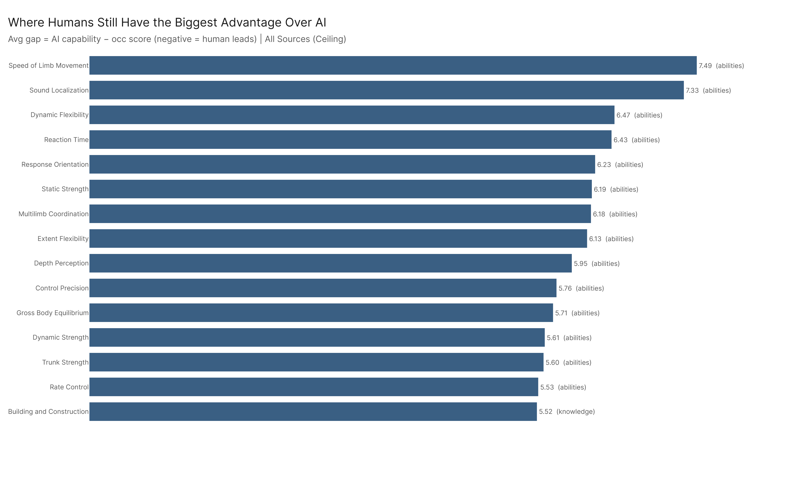

# Job Exposure: AI's Impact on the Labor Market

*Primary config: All Confirmed | 923 occupations | National | Method: freq | Auto-aug ON*

---

The short version: confirmed AI usage already reaches a meaningful share of the task load in 364 occupations covering 73.2 million workers. The ceiling — what AI *could* do if fully deployed — pushes that to 508 occupations and 101.5 million workers. Risk isn't just about exposure: a seven-factor weighted model that gates on actual task penetration identifies 195 occupations (50.7M workers) as genuinely high-risk. Workers' durable advantage is physical, not cognitive. And the next wave of disruption — 150 occupations with high AI-capability overlap but low current exposure — is already showing rising trends.

---

## 1. Current State of Exposure

*Full detail: [exposure_state/exposure_state_report.md](exposure_state/exposure_state_report.md)*

Under confirmed usage (all_confirmed — conversation + API + Microsoft, no MCP ceiling data), 145 occupations employing 31.4 million workers have 60% or more of their tasks exposed to AI. Another 219 occupations (41.8M workers) sit in the moderate band (40–60%). That's 364 occupations and 73.2 million workers where AI is already demonstrably performing a substantial share of the task load — not theoretically, but based on confirmed usage patterns extrapolated to the full occupational structure.

The gap to ceiling is real but uneven. Adding MCP capability data pushes the high tier from 145 to 249 occupations, picking up an additional 22.8 million workers. Some occupations barely move — Market Research Analysts go from 89.5% to 92.7%, Technical Writers from 85.8% to 85.9%. Others jump dramatically: Cashiers from 46.9% to 68.2%, General and Operations Managers from 27.9% to 52.3%, Software Developers from 45.2% to 64.7%. These are the occupations where agentic AI tooling has capability that confirmed human conversation usage hasn't yet reflected.

Trends are pointing one direction. 612 of 923 occupations saw positive exposure growth in the confirmed config over the tracking period, with a median gain of 5.7 percentage points and total workers affected growing by 21.8 million. Under ceiling, 887 of 923 grew.

Some surprises in the hierarchy. Training and Development Managers sit at 85.7% exposure within a Management major category that averages 36.3%. Pharmacists hit 64.9% in a Healthcare category averaging 29.7%. Supervisors of Construction and Extraction Workers show 47.2% in a major category averaging just 14.4%. The category average masks significant within-group variation.

---

## 2. Which Jobs Are Most at Risk?

*Full detail: [job_risk_scoring/job_risk_scoring_report.md](job_risk_scoring/job_risk_scoring_report.md)*

High exposure alone doesn't tell you whether a job is at risk of being fundamentally restructured. A 90% task exposure score for Market Research Analysts means something different than 90% for a low-zone clerical job with poor labor market outlook. The seven-factor composite risk score addresses this by weighting direct exposure signals (task percentage, SKA gap, and their trends) at 2x and structural vulnerability factors (job zone, outlook, software density) at 1x. An exposure gate at 33% prevents structurally vulnerable but low-exposure jobs from being labeled high-risk.

The result: 195 occupations (50.7M workers) score 8–11 as high risk, with an average task exposure of 56.4%. These are occupations where both the exposure signal and the structural context converge. 504 occupations (82.5M workers) sit at moderate risk (score 4–7), and 224 occupations (20.1M workers) are low risk. The gate downgraded 13 occupations that would have otherwise scored high — occupations that are structurally vulnerable but haven't yet been significantly reached by AI.

The flag composition tells the real story. Score 4 occupations (141 of them, avg pct just 17.2%) are almost entirely structural: 89% have the job zone flag, 87% have poor outlook, but only 6% have the pct flag. These are vulnerable but not yet hit. Score 7 occupations (160, avg pct 55.0%) flip the pattern: 91% have the pct flag, 88-89% have trend flags. Score 11 — the 28 "perfect storm" occupations averaging 64.7% exposure — have every single flag active.

272 occupations change risk tier depending on which AI capability source you use. Four make big jumps. Geothermal Technicians land in low risk under ceiling but high risk under human conversation. The instability is useful information — it tells you which jobs' risk profile depends on which AI modality actually gets deployed.

---

## 3. What Can Workers Do?

*Full detail: [worker_resilience/worker_resilience_report.md](worker_resilience/worker_resilience_report.md)*

The SKA gap analysis reveals a clean three-way split. Abilities — almost entirely physical and perceptual — are overwhelmingly human-advantaged. Something like 285 ability elements favor humans versus 65 that favor AI. The top 15 human-advantage elements across all domains are all abilities: Sound Localization (-7.89), Reaction Time (-7.85), Peripheral Vision (-7.69), down through Extent Flexibility (-6.70). The only non-ability in the top 15 is Building and Construction knowledge (-7.11).

Knowledge domains tell the opposite story. Roughly 285 knowledge elements favor AI versus just 15 where humans lead. AI's top advantages: Sales and Marketing (+4.64), History and Archeology (+4.44), Philosophy and Theology (+3.28), Foreign Language (+3.28). The practical translation: if your job's value comes primarily from knowing things, AI already exceeds the typical occupational need.

Skills sit in the middle. About 212 favor humans, 185 favor AI — a genuine contest. This is where the actionable guidance lives: skills are trainable, and the human-advantage skills (service orientation, active listening, coordination) can be deliberately developed.

AI capability gaps are growing across all configs. The median SKA gap delta was +5.33 for confirmed usage and +6.52 for ceiling. AI isn't standing still.

The tips-and-tricks analysis for three occupations makes this concrete. Secretaries should invest in administrative judgment and service orientation (human advantages at -12.76 and -2.21) while letting AI handle calendars, scheduling, and information lookup (auto_aug 4.5–5.0). Registered Nurses' deepest moat is Psychology (-13.31) and Problem Sensitivity (-9.81) — the clinical judgment that AI can't replicate — while documentation and protocol tasks are prime AI candidates. Construction Laborers are the physical-work safe harbor: their top advantages are all physical (Static Strength -11.26, Manual Dexterity -9.91), and AI's modest advantages in their role are cognitive tasks like reading plans.

---

## 4. Where Is Reskilling Cheapest?

*Full detail: [pivot_distance/pivot_distance_report.md](pivot_distance/pivot_distance_report.md)*

Pivot cost — the total skill and knowledge gap between high-risk and low-risk occupations within the same job zone — varies from 55.7 in Zone 1 to 303.8 in Zone 3. Zone 3 is the crisis point: mid-level office and clerical workers face the longest pivot distance because low-risk occupations in their zone require technical knowledge they don't have (Mechanical at 24.0 gap, Physics at 16.4, Building and Construction at 15.8). Zone 5 at 230.9 has a different profile — Psychology (23.1) and Therapy/Counseling (18.9) drive the cost, reflecting the specialized knowledge needed to move from high-risk professional roles to protected ones.

The actionable finding: across all zones, AI can help close the reskilling gap for the majority of cost-driving elements. Zone 2 shows 99.5% of pivot cost in elements where AI capability exceeds the high-risk worker's current level, and even Zone 1 shows 78.4%. This means AI isn't just the cause of displacement — it's potentially the best tool for the reskilling response.

---

## 5. Where Is Policy Intervention Most Urgent?

*Full detail: [audience_framing/audience_framing_report.md](audience_framing/audience_framing_report.md)*

Using a projection method (which captures both direction and magnitude of skill-profile overlap with AI capabilities, unlike cosine similarity which only captures direction), 150 occupations emerge as hidden at-risk. These have low current confirmed exposure but high projection onto the AI capabilities vector — meaning AI already has the technical ability to reach their skill demands, even though confirmed usage hasn't gotten there yet.

Healthcare dominates this list. Preventive Medicine Physicians, Urologists, Nurse Anesthetists, General Internal Medicine Physicians, and Physical Medicine/Rehabilitation Physicians all appear in the top 10. Education Administrators K–12 (22.4% current, 38.2% ceiling) and Nuclear Engineers (16.7% current, 26.8% ceiling) show significant ceiling gaps, suggesting the deployment pathway is already opening.

53% of these hidden at-risk occupations are seeing rising exposure in the confirmed config. The window for proactive intervention is not just open — it's actively closing.

Among the worst-case occupations (high exposure AND poor outlook), the dominant skill domains are knowledge-heavy: Foreign Language (18.74), History and Archeology (18.36), Customer and Personal Service (18.35). Skills don't crack the top 15 even though we now include them. This is consistent with the worker resilience finding that knowledge domains are AI's strongest suit. But it's also encouraging: these knowledge foundations are broad and transferable. Workers in worst-case occupations aren't trapped in narrow specializations.

---

## 6. How Do Findings Land for Specific Jobs?

*Full detail: [occs_of_interest/occs_of_interest_report.md](occs_of_interest/occs_of_interest_report.md)*

Across 27 matched occupations, confirmed exposure ranges from 12.0% (Construction Laborers) to 89.5% (Market Research Analysts). The new weighted risk scoring properly separates exposure from risk: Market Research Analysts at 89.5% score only 7 (moderate risk) because they're zone 4 with good outlook, while Customer Service Representatives at 84.1% and Secretaries at 75.1% both score 11 (high risk) because every flag converges.

The ceiling delta shows where MCP/agentic AI would hit hardest if deployed. Cashiers would jump from 46.9% to 68.2% (+21.3pp). General and Operations Managers from 27.9% to 52.3% (+24.4pp). Software Developers from 45.2% to 64.7% (+19.5pp). But some occupations barely change: Technical Writers go from 85.8% to 85.9% — conversational AI already covers almost their entire task load.

Registered Nurses (33.4% confirmed, moderate risk) are worth watching. They're not in crisis today, but their skill profile projects strongly onto the AI capabilities vector, and the ceiling pushes them to 40.2%. General and Operations Managers and Accountants both carry hidden-at-risk flags.

---

## 7. Cross-Cutting Findings

**Exposure does not equal risk, and the scoring now reflects that.** The weighted model with an exposure gate ensures that "high risk" means both significant task penetration AND structural vulnerability. Market Research Analysts are the poster child: 89.5% exposure, moderate risk. The new scoring matches the intuition better — when someone reads "high risk," the data supports the reading that this job is genuinely under threat, not just that AI can do some of its tasks.

**The three-layer framing matters.** Confirmed usage (all_confirmed) is what AI is doing today. The ceiling (all_ceiling) is where it could reach. The gap between them — 104 additional high-tier occupations and 22.8M more workers — is the deployment opportunity. For some occupations (Technical Writers, Market Research Analysts), the gap is nearly closed. For others (Cashiers, General Managers, Software Developers), the agentic frontier would significantly change the picture.

**The reskilling bottleneck is technical knowledge, not soft skills.** The pivot distance analysis shows that the costliest elements to close are Mechanical, Building and Construction, Physics, and Engineering. Meanwhile, the worker resilience analysis shows that human advantages are concentrated in physical abilities. Effective workforce development should combine physical-task career pathways with technical certification — not generic professional development courses.

**AI is both the cause of and the best tool for reskilling.** Across all job zones, the majority of pivot-cost-driving elements are ones where AI capability exceeds the at-risk worker's current level. AI can be deployed as a learning accelerator for the very skills workers need to acquire to move out of at-risk occupations.

**Everything is trending in the same direction.** 612 of 923 occupations grew in confirmed exposure. AI capability gaps (SKA delta) are positive across all configs, with medians between +3.4 and +6.5. This is an economy-wide trajectory, not an isolated disruption.

---

## 8. Key Takeaways

1. **73.2 million workers** are in occupations where confirmed AI usage affects 40%+ of their tasks. Under ceiling, that rises to 101.5 million.

2. **195 occupations (50.7M workers)** score high risk under the weighted model with exposure gate. "High risk" now reliably means both high exposure AND structural vulnerability.

3. **Workers' durable advantage is physical, not cognitive.** The top 15 human-advantage elements are all physical abilities. Knowledge recall is AI's strongest domain. Workers should leverage AI for knowledge tasks and invest in the judgment, coordination, and physical skills that remain human.

4. **150 occupations are hidden at-risk** — their skill profiles project strongly onto AI capabilities but confirmed usage hasn't reached them. Healthcare specialties dominate. 53% already show rising exposure.

5. **AI is the best reskilling tool available** for the displacement it causes. In Zone 2, 99.5% of pivot cost is in elements where AI capability exceeds the at-risk worker's current level.

6. **Zone 3 workers face the highest reskilling cost** (303.8 total gap). Mid-level office/clerical workers pivoting to low-risk occupations need technical knowledge — Mechanical, Physics, Building and Construction — that generic training programs don't address.

---

## Sub-Report Index

| Sub-Analysis | Report | What It Answers |
|---|---|---|
| Exposure State | [exposure_state_report.md](exposure_state/exposure_state_report.md) | How exposed is the economy, and how is that changing? |
| Job Risk Scoring | [job_risk_scoring_report.md](job_risk_scoring/job_risk_scoring_report.md) | Which occupations face genuine replacement risk? |
| Worker Resilience | [worker_resilience_report.md](worker_resilience/worker_resilience_report.md) | Where do humans lead, and what should workers train? |
| Pivot Distance | [pivot_distance_report.md](pivot_distance/pivot_distance_report.md) | How expensive is reskilling, and can AI help? |
| Audience Framing | [audience_framing_report.md](audience_framing/audience_framing_report.md) | Which jobs are next, and where is intervention most urgent? |
| Occupations of Interest | [occs_of_interest_report.md](occs_of_interest/occs_of_interest_report.md) | How do findings land for 29 named occupations? |

## Config Reference

| Config Key | Dataset | Role |
|---|---|---|
| `all_confirmed` | AEI Both + Micro 2026-02-12 | **Primary** — all confirmed usage |
| `all_ceiling` | All 2026-02-18 | Comparison — includes MCP ceiling |
| `human_conversation` | AEI Conv + Micro 2026-02-12 | Confirmed human conversation only |
| `agentic_confirmed` | AEI API 2026-02-12 | Confirmed agentic tool-use (AEI API only) |
| `agentic_ceiling` | MCP + API 2026-02-18 | Agentic ceiling |
