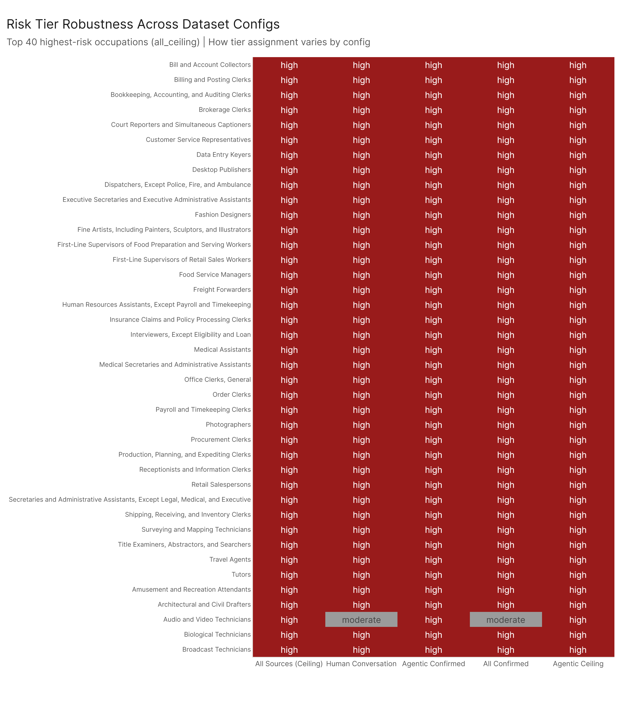

# Job Risk Scoring: Which Jobs Are Most at Risk of Replacement?

*Config: All five analysis configs | Primary: all_ceiling | Method: freq | Auto-aug ON | National*

---

## 1. Framework

High AI task exposure alone does not make a job replaceable. Replacement risk emerges when multiple converging signals align: AI can handle most of the tasks, it already meets the skill requirements, adoption is accelerating, the job requires only moderate preparation, the labor market outlook is poor, and the tools used are already commoditized. We capture this convergence with seven binary flags, scored 0--7.

| Flag | Condition | What it measures |
|------|-----------|------------------|
| 1 | pct_tasks_affected > median | Task coverage breadth |
| 2 | SKA gap > median | AI capability exceeds job need |
| 3 | pct trend positive + above median growth | Accelerating task exposure |
| 4 | SKA gap trend positive + above median growth | Accelerating skill coverage |
| 5 | job_zone in {1, 2, 3} | Low-to-moderate preparation barrier |
| 6 | outlook in {2, 3} | Below-average labor market outlook |
| 7 | n_software > median | Commoditized tooling |

Note on outlook coding: outlook = 1 corresponds to a favorable outcome (good demand or low wages attracting workers), not a risk signal. Only values 2 and 3 indicate below-average conditions.

**Tiers:** 5--7 = High Risk, 3--4 = Moderate, 0--2 = Low

## 2. Tier Distribution

Under the primary configuration (all_ceiling), the 923 scored occupations distribute as follows:

| Tier | Occupations | Total Employment | Avg pct_tasks_affected | Avg Risk Score |
|------|-------------|------------------|------------------------|----------------|
| **High (5--7)** | 233 | 59.9M workers | 63.3% | 5.57 |
| **Moderate (3--4)** | 461 | 77.8M workers | 45.1% | 3.45 |
| **Low (0--2)** | 229 | 15.5M workers | 26.4% | 1.64 |

The high-risk tier accounts for 25% of scored occupations but represents 39% of total employment in the analysis -- roughly 59.9 million workers in occupations where multiple replacement signals converge. The moderate tier is the largest, covering 461 occupations and 77.8 million workers who face meaningful but not acute risk. The low-risk tier contains 229 occupations employing 15.5 million workers, predominantly in roles that require advanced preparation, enjoy strong labor market demand, or both.

Average task exposure in the high tier (63.3%) is roughly 2.4 times that of the low tier (26.4%), but as discussed below, the relationship between exposure and risk is far from linear.

## 3. Risk Score vs. Task Exposure

The scatter of risk score against pct_tasks_affected reveals that high task exposure is necessary but not sufficient for high replacement risk. The occupations that score 7/7 -- every flag triggered -- include Insurance Claims and Policy Processing Clerks (69.6% exposure, 229K workers), Interviewers (76.1%, 157K), and Title Examiners (73.3%, 48K). These occupations combine broad AI task coverage with low job-zone barriers, poor outlook, rapid growth in both task penetration and skill coverage, and heavy software tooling.

However, some of the most exposed occupations in the dataset do not land in the high-risk tier. Market Research Analysts face 92.7% task exposure under all_ceiling, yet fall into the moderate tier because they sit in job zone 4 (bachelor's degree typically required), which does not trigger flag 5. Registered Nurses, at roughly 40% exposure, land in the low-risk tier -- protected by their job zone, strong labor market outlook, and a skill profile that AI does not yet match. Software Developers similarly stay moderate: despite substantial task exposure, job zone 4 and a favorable employment outlook keep their composite score below the high-risk threshold.

Conversely, several occupations with moderate task exposure score high on risk because the structural flags pile up. Cashiers (69.0%, 3.8M workers), Waiters and Waitresses, and Food Service Managers all clear the high-risk threshold not because their exposure is extreme, but because low preparation requirements, below-average outlook, and commoditized tooling compound whatever task exposure exists.

## 4. Cross-Config Robustness

Not all tier assignments are equally stable. When the same scoring framework is applied across all five analysis configurations -- ranging from confirmed human conversational usage (floor) to the full capability ceiling -- some occupations remain in the same tier regardless of source. These robust assignments represent the strongest signal for policy attention: occupations that are high-risk no matter how conservatively one measures AI capability.

Occupations that shift tiers between configs are predominantly those near the 3/5 boundary (moderate-to-high) where one or two trend-based flags flip depending on whether ceiling or confirmed-usage data is used. Flags 1--4 (task coverage and trend) are the most source-sensitive; flags 5--7 (job zone, outlook, software count) are structural and do not change between configs. This means cross-config instability is concentrated in the dynamic signals, while the structural underpinning of risk remains constant.

## 5. Most Triggered Flags

Flag frequency across the 923 occupations is notably uniform, with each flag triggering for roughly 48--55% of occupations:

| Flag | % of Occupations | Category |
|------|------------------|----------|
| flag5_job_zone | 58.9% | Structural |
| flag6_outlook | 50.1% | Structural |
| flag1_pct | 50.0% | Dynamic |
| flag3_pct_trend | 50.0% | Dynamic |
| flag2_ska | 48.3% | Dynamic |
| flag4_ska_trend | 48.3% | Dynamic |
| flag7_n_software | 47.8% | Structural |

Job zone (flag 5) is the most commonly triggered flag, reflecting the fact that nearly 59% of all O*NET occupations fall into zones 1, 2, or 3. This is a structural feature of the labor market, not a measurement artifact -- it means the majority of occupations have a preparation level that does not provide a substantial barrier to AI substitution.

Flags 1 and 3 trigger at identical rates (50.0%), as do flags 2 and 4 (48.3%). This is expected: flag 3 is derived from the trend of the same metric used in flag 1, and the median split produces near-symmetric halves. The practical implication is that no single flag dominates the scoring; risk emerges from the accumulation of multiple signals rather than from any one factor.

## 6. Key Takeaways

1. **Replacement risk is broad but not universal.** 233 occupations employing 59.9 million workers meet the high-risk threshold, but this is driven by the convergence of multiple factors -- not task exposure alone. Policymakers should resist equating "high AI exposure" with "at risk of replacement."

2. **Education and labor market demand are powerful protective factors.** Job zone and outlook flags explain why occupations like Market Research Analysts (92.7% exposure) and Software Developers remain outside the high-risk tier. Workforce development strategies that move workers into higher job zones provide durable protection even as AI capability grows.

3. **The largest employment concentrations in the high tier are in retail, food service, and office administration.** Secretaries (1.7M workers), Retail Salespersons (3.8M), First-Line Supervisors of Food Preparation (1.2M), and Bookkeeping Clerks (1.5M) all score 7/7. These occupations represent immediate, large-scale workforce planning challenges.

4. **Structural risk factors are stable across measurement approaches.** Job zone and outlook do not change between analysis configs, meaning approximately half of a high-risk occupation's score is locked in regardless of how AI capability is measured. Cross-config instability only affects the dynamic flags, reinforcing that the structural dimension of risk is the most actionable target for policy.

5. **The mean risk score is 3.5 with a median of 3.0**, placing the typical occupation at the lower boundary of the moderate tier. Risk is right-skewed: most occupations face meaningful but manageable exposure, while a smaller group faces acute convergence of all seven factors.

## Config

Primary: `All 2026-02-18`. Trend computed over full `All` series (10 dates). Cross-config uses all five configs. Method: freq, auto-aug ON, national.

## Files

| File | Description |
|------|-------------|
| `results/risk_scores_primary.csv` | All 923 occs: 7 flags, risk_score, risk_tier (all_ceiling) |
| `results/risk_scores_all_configs.csv` | Risk scores for all five configs |
| `results/risk_tier_summary.csv` | Tier counts, employment, wages |
| `results/flags_breakdown.csv` | How often each flag is triggered |
| `results/pivot_distance_inputs.csv` | Top/bottom 10 occs per zone (input for pivot_distance) |
