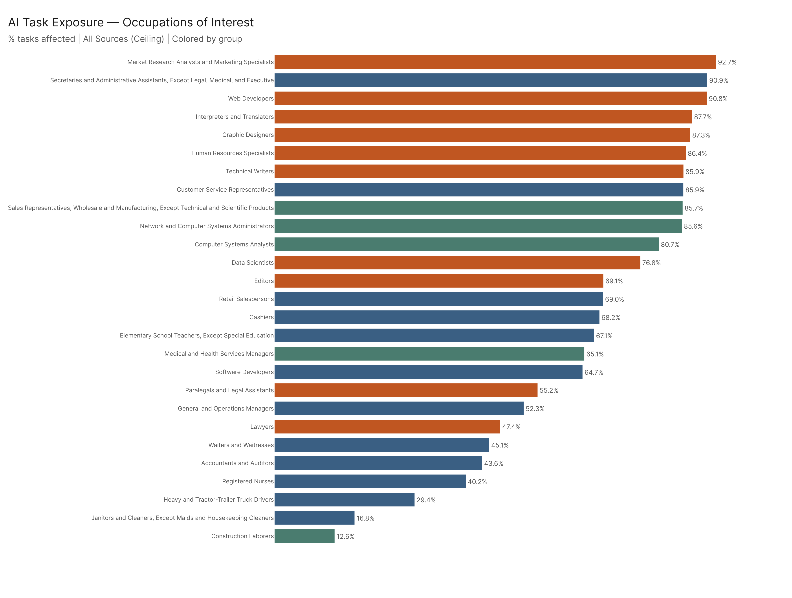
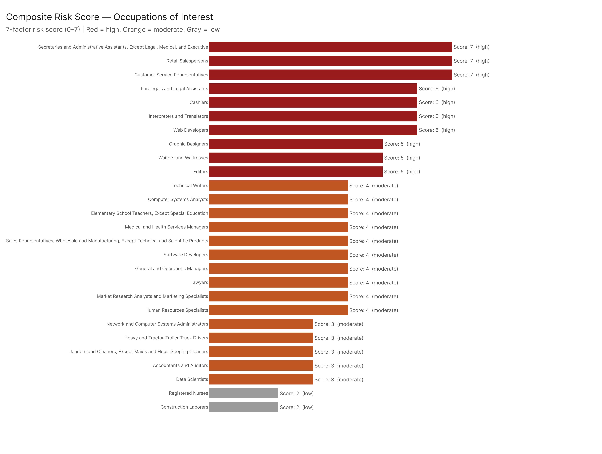
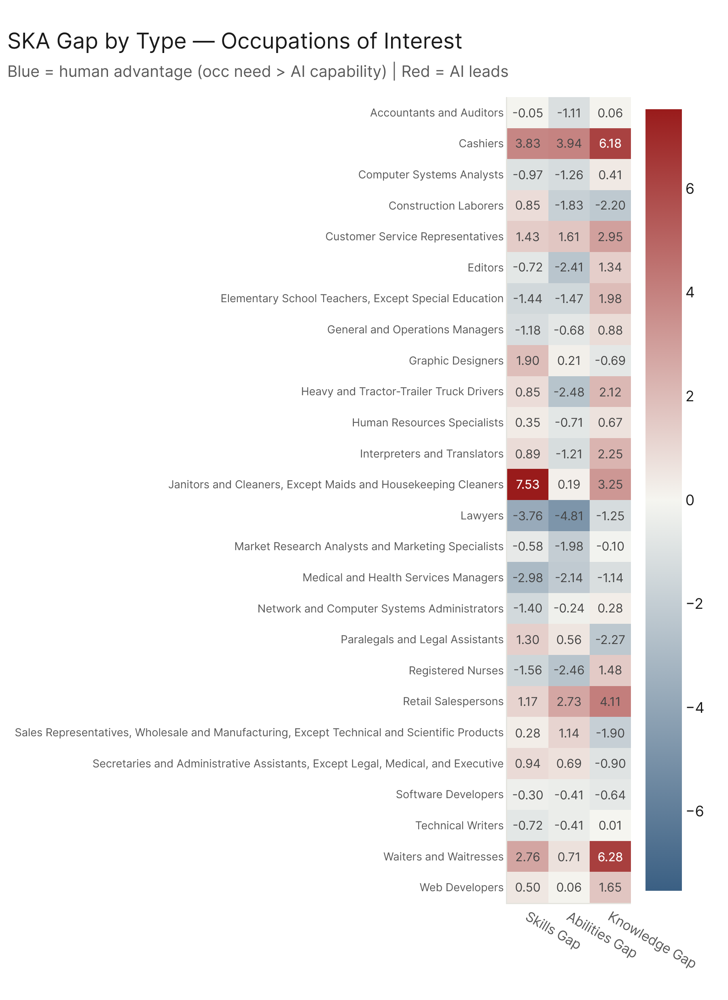
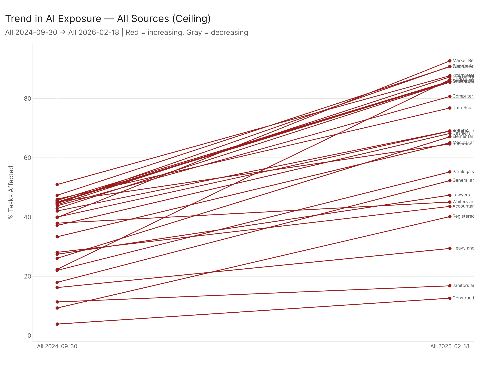

# Occupations of Interest: AI Exposure for 29 Jobs People Know by Name

*27 of 29 named occupations matched | Config: all_ceiling (primary) | Method: freq | Auto-aug ON | National*

---

## 1. The List

We selected 29 occupations across three groups -- jobs that dominate public conversations about AI, jobs that employ millions, and jobs that matter to Utah's economy. Two occupations (Physicians All Other and Financial Analysts) did not match the dataset and are excluded, leaving 27 occupations for analysis.

| Group | Occupations |
|-------|------------|
| **High-profile / High-employment** | Registered Nurses, Software Developers, General and Operations Managers, Cashiers, Customer Service Representatives, Retail Salespersons, Heavy and Tractor-Trailer Truck Drivers, Elementary School Teachers, Waiters and Waitresses, Janitors and Cleaners, Accountants and Auditors, Secretaries and Administrative Assistants |
| **AI-controversial / Interesting** | Lawyers, Graphic Designers, Technical Writers, Web Developers, Paralegals and Legal Assistants, Human Resources Specialists, Market Research Analysts, Editors, Interpreters and Translators |
| **Utah-relevant** | Computer Systems Analysts, Medical and Health Services Managers, Construction Laborers, Sales Representatives (Wholesale/Mfg), Network and Computer Systems Administrators |

*Not matched (excluded):* Physicians (All Other), Financial Analysts, Data Scientists.

## 2. Exposure Summary

The 27 occupations span nearly the entire exposure spectrum -- from 12.6% (Construction Laborers) to 92.7% (Market Research Analysts). That 80-point spread illustrates, within a single short list, just how differently AI touches the American workforce.

Ranked from highest to lowest task exposure under all_ceiling:

| Rank | Occupation | Exposure | Risk Tier |
|------|-----------|----------|-----------|
| 1 | Market Research Analysts | 92.7% | Moderate |
| 2 | Secretaries/Admin Assistants | 90.9% | HIGH |
| 3 | Web Developers | 90.8% | HIGH |
| 4 | Interpreters/Translators | 87.7% | HIGH |
| 5 | Graphic Designers | 87.3% | HIGH |
| 6 | HR Specialists | 86.4% | Moderate |
| 7 | Technical Writers | 85.9% | Moderate |
| 8 | Customer Service Reps | 85.9% | HIGH |
| 9 | Sales Reps (Wholesale) | 85.7% | Moderate |
| 10 | Network/Computer Admins | 85.5% | Moderate |
| 11 | Computer Systems Analysts | 80.7% | Moderate |
| 12 | Editors | 69.0% | HIGH |
| 13 | Retail Salespersons | 69.0% | HIGH |
| 14 | Cashiers | 68.2% | HIGH |
| 15 | Elementary Teachers | 67.1% | Moderate |
| 16 | Medical/Health Services Managers | 65.1% | Moderate |
| 17 | Software Developers | 64.7% | Moderate |
| 18 | Paralegals | 55.2% | HIGH |
| 19 | General/Ops Managers | 52.3% | Moderate |
| 20 | Lawyers | 47.4% | Moderate |
| 21 | Waiters/Waitresses | 45.1% | HIGH |
| 22 | Accountants | 43.6% | Moderate |
| 23 | Registered Nurses | 40.2% | LOW |
| 24 | Truck Drivers | 29.4% | Moderate |
| 25 | Janitors | 16.8% | Moderate |
| 26 | Construction Laborers | 12.6% | LOW |

The top half of the list is dominated by information-handling and communication-intensive roles. The bottom half skews toward occupations anchored in physical presence, interpersonal care, or hands-on labor. The dividing line sits around 55% -- above that threshold, AI systems can address a majority of the job's task inventory.

## 3. Risk Tiers

Exposure alone does not determine risk. Our seven-flag risk framework considers whether AI exceeds the occupation's skill requirements, whether adoption is trending upward, whether the job has a low barrier to entry (job zone), and whether labor market outlook is weak. Occupations that trip five or more flags land in the high-risk tier.

**HIGH risk (10 occupations):** Secretaries, Web Developers, Interpreters/Translators, Graphic Designers, Customer Service Reps, Editors, Retail Salespersons, Cashiers, Paralegals, Waiters/Waitresses.

**Moderate (14 occupations):** Market Research Analysts, HR Specialists, Technical Writers, Sales Reps, Network/Computer Admins, Computer Systems Analysts, Elementary Teachers, Medical/Health Services Managers, Software Developers, General/Ops Managers, Lawyers, Accountants, Truck Drivers, Janitors.

**LOW risk (2 occupations):** Registered Nurses, Construction Laborers.

The pattern is striking: high exposure does not automatically translate to high risk. Market Research Analysts have the highest exposure of all 27 occupations (92.7%) but land in the moderate tier because their job zone 4 classification and reasonable outlook protect them. Conversely, Waiters/Waitresses have only 45.1% exposure but land in the high-risk tier because every structural vulnerability aligns -- low job zone, poor outlook, and an AI-susceptible skill profile.

## 4. SKA Gap Patterns

The skill, knowledge, and ability gap analysis reveals which occupations have human advantages that AI cannot yet replicate versus which have skill profiles that AI already covers comprehensively.

The knowledge-economy occupations at the top of the exposure list -- Market Research Analysts, Web Developers, Technical Writers -- tend to show positive gaps (AI exceeds need) across content-production and analytical elements while retaining narrow human advantages in interpersonal judgment and stakeholder management. Registered Nurses, by contrast, show strong human advantages in direct patient interaction and clinical judgment, which explains their low-risk classification despite 40% task exposure.

Construction Laborers show the most consistently negative gaps (human exceeds AI) across the board, driven by physical dexterity, spatial reasoning, and site-specific adaptation requirements that current AI systems do not address.

## 5. Trends

Exposure levels for these 27 occupations have grown substantially over the analysis period, consistent with the economy-wide pattern.

The steepest climbers among the named occupations are the ones whose task inventories map onto recently expanded AI capabilities: content generation (Editors, Technical Writers), code production (Web Developers, Software Developers), and data synthesis (Market Research Analysts). The flattest trajectories belong to Construction Laborers and Janitors, whose physical task requirements have not been meaningfully addressed by new AI systems. Truck Drivers show modest growth, reflecting incremental advances in route optimization and logistics tasks rather than the autonomous driving scenario that dominates public discussion.

## 6. Notable Cases

**Secretaries and Administrative Assistants (90.9%, HIGH risk).** This is the largest at-risk occupation by employment in the named list. Over 90% of their tasks are affected, they sit in job zone 3, and their labor market outlook is poor. The combination of scheduling, correspondence, document management, and data entry that defines the role maps almost perfectly onto current AI tool capabilities. This is not a future risk; it is a present transformation already underway in offices across the country.

**Software Developers (64.7%, Moderate).** The most visible AI-adjacent occupation on the list lands squarely in the moderate tier, not the high tier. Why? Job zone 4 (requiring a bachelor's degree and significant training) and strong labor market outlook both serve as protective factors. AI handles a substantial share of coding tasks, but the architectural judgment, system design, and stakeholder communication that define senior software work remain firmly in human territory. This occupation illustrates why exposure is not destiny.

**Registered Nurses (40.2%, LOW risk -- but hidden at-risk).** Nurses are the only occupation in all 27 flagged as hidden at-risk. Their current task exposure is moderate (40.2%), and their risk tier is low. But their skill and knowledge profile -- the vector of competencies the job actually requires -- closely resembles the profiles of occupations that are already heavily exposed. Documentation, care coordination, patient education, and treatment protocol management are all tasks where AI capabilities are advancing rapidly. Nurses are not at risk today. They may be at risk tomorrow. This is the "next wave" signal for healthcare, and it deserves proactive attention from health systems and nursing education programs.

**Market Research Analysts (92.7%, Moderate).** The highest exposure on the entire list, yet only moderate risk. Nearly every task in the role -- data collection, survey design, trend analysis, report writing -- falls within AI's demonstrated capability. The protective factors are structural: job zone 4 (typically requiring a bachelor's degree and analytical training) insulates the occupation from the kind of rapid displacement that hits lower-barrier roles. The message for these workers is clear: AI will transform how you work, but the analytical judgment that sits atop the data pipeline keeps you in the loop.

**Waiters and Waitresses (45.1%, HIGH risk).** At first glance, 45% task exposure seems modest. But every risk flag converges: job zone 2 (minimal training required), poor labor market outlook, AI-susceptible skill profile, and rising adoption trends. The tasks AI affects -- order management, menu recommendation, payment processing, customer interaction scripting -- are the ones that define the role. When you combine moderate exposure with no structural protections, the result is high risk. This occupation is a cautionary example of how the risk framework captures vulnerabilities that raw exposure numbers miss.

**Construction Laborers (12.6%, LOW risk).** The safest occupation on the list, and it is not close. Physical dexterity, environmental adaptation, and site-specific judgment requirements keep AI exposure to a minimum. The tasks that are affected -- safety documentation, material calculations -- are peripheral to the core work. For workers in physically demanding occupations, this is the reassuring data point: the skills that are hardest for AI to replicate are the ones your job depends on.

## 7. Key Takeaways

1. **High exposure and high risk are different things.** Of the 27 named occupations, 10 land in the high-risk tier -- but the most-exposed occupation (Market Research Analysts, 92.7%) is not one of them. Job zone and labor market outlook act as structural buffers that separate transformation from displacement. Policy responses must account for both dimensions, not exposure alone.

2. **The largest at-risk populations are in everyday jobs, not headline-grabbing ones.** Secretaries, Customer Service Reps, Cashiers, and Retail Salespersons collectively employ millions and all sit in the high-risk tier. These are not the occupations that dominate AI media coverage, but they are the ones where displacement risk is most immediate and most concentrated.

3. **The hidden at-risk signal matters.** Registered Nurses -- one of the largest and most trusted occupations in the economy -- are the only occupation in the named list flagged as hidden at-risk. Their skill profile matches high-exposure jobs even though their task exposure is still moderate. Health systems, nursing programs, and workforce planners should treat this as an early warning, not a false alarm.

## Config

All five configs for exposure. Primary (`All 2026-02-18`) for risk scores and SKA gaps. Trend: first and last date per config series.

## Files

| File | Description |
|------|-------------|
| `results/occs_of_interest_full.csv` | All metrics for all 27 matched occupations |
| `results/exposure_by_config.csv` | pct x config for each occ |
| `results/trend_summary.csv` | First/last pct and delta per config |
| `results/ska_element_detail.csv` | Top 5 human + AI elements per occ |
