# SKA Deep Dive: Skills, Abilities, and Knowledge Trends

*Config: all_confirmed (primary) | Ceiling comparison | Five-config cross-check | Method: freq | Auto-aug ON | National | S + A + K, importance ≥ 3*

---

The central finding of this analysis is a displacement story, not a replacement story. From September 2024 to February 2026, 23 distinct skills, abilities, and knowledge elements crossed the 100% line — meaning AI's demonstrated capability moved from "below what jobs require" to "exceeding what jobs require." Every one of them is from the cognitive and communicative layer of work: sales knowledge, philosophy, foreign language, instructing, learning strategies, programming. Not a single physical ability crossed. Sound Localization gained 0 percentage points over the entire window. The structural divide that the static snapshot shows is now confirmed as persistent and widening — the physical layer stays human, the cognitive layer is being taken over element by element.

---

## 1. Elements Trending Up Most: What AI Is Gaining On

The trend analysis computes AI capability as % of occupation requirement for each of the 120 scored elements, across the six `all_confirmed` dataset dates (September 2024 through February 2026). The September 2024 dataset is anchored primarily by Microsoft's Copilot data — the AEI conversation and API data begins accumulating from December 2024. By February 2026, all confirmed conversational + API usage feeds the signal.

### Knowledge: The Fastest-Moving Domain

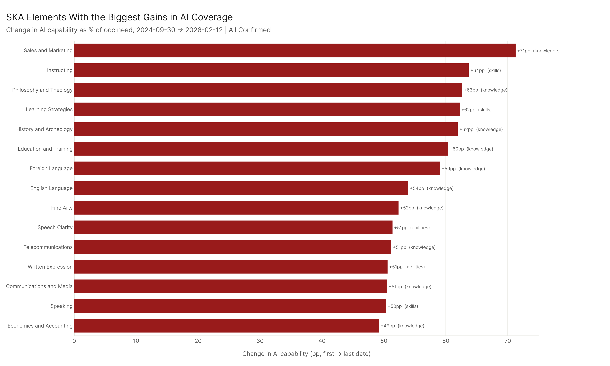

Knowledge leads every top-gain list. The pattern: AI's broadest-based language model training means it has accumulated demonstrated capability in virtually every knowledge domain simultaneously, and those domains continue to expand as the corpus of human interactions grows. The top 15 overall gainers include 10 knowledge elements, 4 skills, and 1 ability.

| Rank | Element | Domain | Gain (pp) | First → Last |
|------|---------|--------|-----------|--------------|
| 1 | Sales and Marketing | Knowledge | +71.3 pp | 60% → 131% |
| 2 | Instructing | Skills | +63.7 pp | 51% → 115% |
| 3 | Philosophy and Theology | Knowledge | +62.7 pp | 58% → 121% |
| 4 | Learning Strategies | Skills | +62.2 pp | 49% → 112% |
| 5 | History and Archeology | Knowledge | +61.9 pp | 63% → 125% |
| 6 | Education and Training | Knowledge | +60.4 pp | 55% → 115% |
| 7 | Foreign Language | Knowledge | +59.1 pp | 59% → 118% |
| 8 | English Language | Knowledge | +53.9 pp | 55% → 109% |
| 9 | Fine Arts | Knowledge | +52.4 pp | 60% → 112% |
| 10 | Speech Clarity | Abilities | +51.4 pp | 53% → 104% |
| 11 | Telecommunications | Knowledge | +51.2 pp | 63% → 114% |
| 12 | Written Expression | Abilities | +50.6 pp | 52% → 102% |
| 13 | Communications and Media | Knowledge | +50.5 pp | 61% → 112% |
| 14 | Speaking | Skills | +50.4 pp | 53% → 103% |
| 15 | Economics and Accounting | Knowledge | +49.2 pp | 59% → 109% |

Sales and Marketing at +71.3 pp is the largest single-element gain in the dataset. It went from 60% of occupation need to 131% — below the threshold to above it — in 16 months. This is not a niche domain: Sales and Marketing knowledge appears in occupations across virtually every sector. The same pattern holds for Education and Training (+60.4 pp) and English Language (+53.9 pp). AI is not edging up on the knowledge layer. It's covering it.

### Skills: The Contested Middle

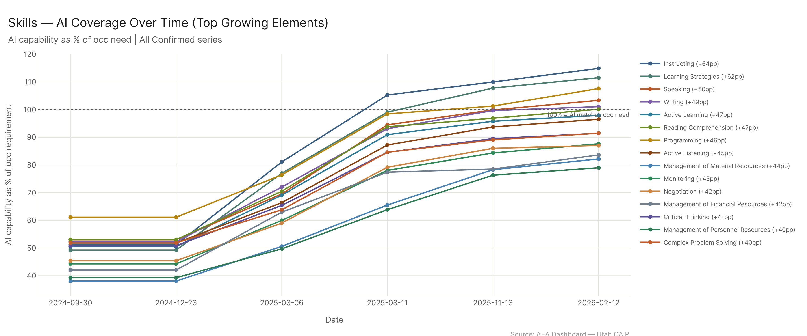

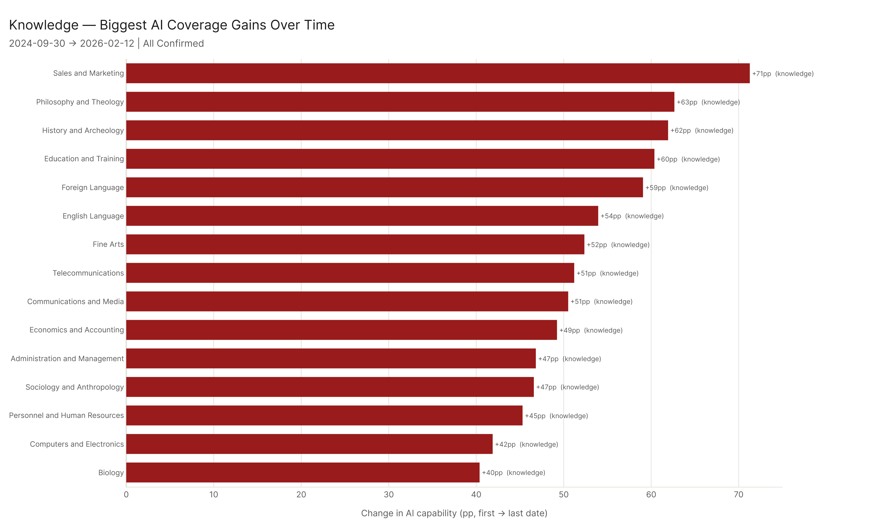

The skills picture is more mixed, but the direction is consistent. Instructing (+63.7 pp) and Learning Strategies (+62.2 pp) are the fastest-gaining skills, reflecting AI's expanding capacity to deliver structured explanations and adapt teaching approaches to context. Speaking (+50.4 pp) and Writing (+48.8 pp) crossed the 100% line. Reading Comprehension (+47.1 pp) nearly did (finishing at 100.1%).

Human-advantage skills — Operation and Control (41% → 41%), Installation (35% → 46%), Equipment Maintenance (41% → 55%) — barely moved. The hands-on execution layer of skills is resistant not because AI is failing to improve, but because the nature of the task is physical. Software improvement doesn't close that gap.

### Abilities: Two Worlds

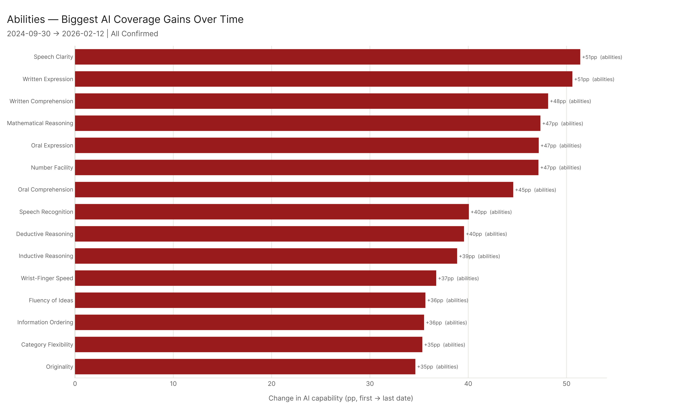

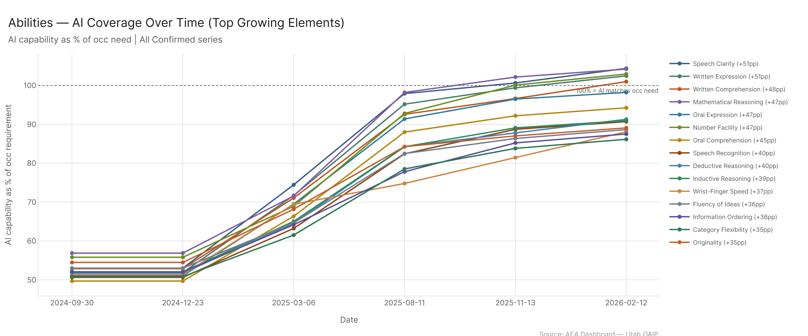

The abilities domain tells the clearest story. Physical abilities gained almost nothing over 16 months: Sound Localization gained 0 pp (stayed at 8.7%), Night Vision gained 0.6 pp, Speed of Limb Movement gained 0.3 pp. Meanwhile, cognitive and communicative abilities gained substantially: Speech Clarity (+51.4 pp, crossed 100%), Written Expression (+50.6 pp, crossed), Mathematical Reasoning (+47.4 pp, crossed), Oral Expression (+47.2 pp, approaching 100%), Oral Comprehension (+44.6 pp, approaching 100%). The divide is structural. Physical abilities require embodiment. Cognitive abilities require capability — and AI is building capability fast.

The 23 elements that crossed the 100% line from first to last date:

| Element | Domain | First | Last | Gain |
|---------|--------|-------|------|------|
| Sales and Marketing | Knowledge | 60% | 131% | +71 pp |
| Instructing | Skills | 51% | 115% | +64 pp |
| Philosophy and Theology | Knowledge | 58% | 121% | +63 pp |
| Learning Strategies | Skills | 49% | 112% | +62 pp |
| History and Archeology | Knowledge | 63% | 125% | +62 pp |
| Education and Training | Knowledge | 55% | 115% | +60 pp |
| Foreign Language | Knowledge | 59% | 118% | +59 pp |
| English Language | Knowledge | 55% | 109% | +54 pp |
| Fine Arts | Knowledge | 60% | 112% | +52 pp |
| Speech Clarity | Abilities | 53% | 104% | +51 pp |
| Telecommunications | Knowledge | 63% | 114% | +51 pp |
| Written Expression | Abilities | 52% | 102% | +51 pp |
| Communications and Media | Knowledge | 61% | 112% | +51 pp |
| Speaking | Skills | 53% | 103% | +50 pp |
| Economics and Accounting | Knowledge | 59% | 109% | +49 pp |
| Written Comprehension | Abilities | 53% | 101% | +48 pp |
| Mathematical Reasoning | Abilities | 57% | 104% | +47 pp |
| Number Facility | Abilities | 56% | 103% | +47 pp |
| Writing | Skills | 52% | 101% | +49 pp |
| Programming | Skills | 61% | 108% | +46 pp |
| Sociology and Anthropology | Knowledge | 54% | 101% | +47 pp |
| Computers and Electronics | Knowledge | 65% | 107% | +42 pp |
| Reading Comprehension | Skills | 53% | 100% | +47 pp |

Every one of these elements is cognitive, communicative, or knowledge-based. The physical layer did not produce a single threshold crossing.

---

## 2. Cross-Config Comparison: Does the Story Depend on Which Data You Use?

The short answer: the ranking is stable, the level varies. All five configs agree on which elements are human territory and which are AI territory. What differs is how far AI has advanced in each.

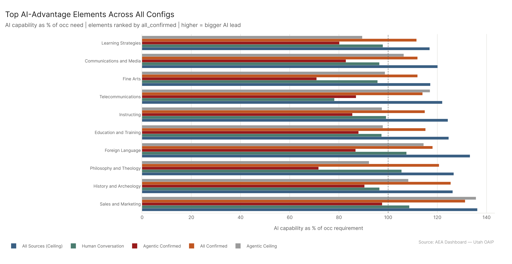

**Config-level medians for overall_pct (AI as % of total occ SKA need):**

| Config | Median overall_pct |
|--------|-------------------|
| All Sources (Ceiling) | 97.2% |
| All Confirmed | 87.8% |
| Agentic Ceiling | 83.3% |
| Human Conversation | 74.2% |
| Agentic Confirmed | 61.7% |

The ceiling estimate (97.2%) is near parity — AI capability is approaching the typical occupation's SKA requirement when you include MCP's capability signal. The confirmed usage figure (87.8%) reflects what's actually been demonstrated. Human conversation alone (74.2%) is more conservative. Agentic confirmed (61.7%) — only confirmed tool-use patterns — shows the narrowest slice of capability but still represents a substantial share of occupational needs.

**Cross-config agreement on physical abilities:**

The top physical-ability human advantages are remarkably consistent. Sound Localization sits at 9% under all_confirmed, 9% under human_conversation, and 0% under agentic_confirmed (no relevant tool-use patterns). Even the ceiling only gets it to 15%. Night Vision: 21% confirmed, 21% human_conversation, 45% ceiling. The configs push and pull the levels, but the structural ranking holds across all five. If Sound Localization is last under confirmed usage, it's last under every config.

**Where configs diverge:**

The divergence is in the cognitive and knowledge domains. Agentic_confirmed shows much lower values across the board (median 61.7%) because confirmed API tool-use patterns are a narrower sample — they capture programmatic, structured interactions more than the full range of conversational knowledge use. Human conversation (74.2%) picks up more of the language knowledge domains but misses some of the technical capability signals from API usage. The ceiling (97.2%) aggregates all sources and reaches the highest levels.

For the domain-specific comparison by config:

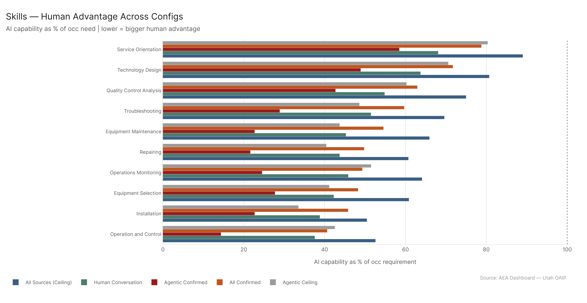

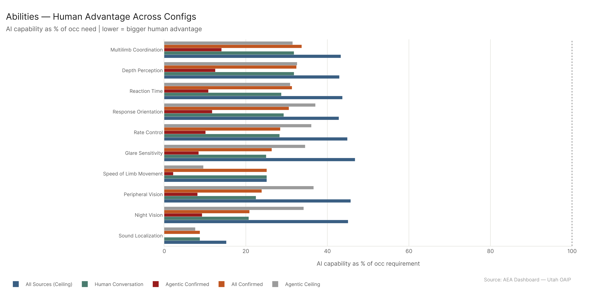

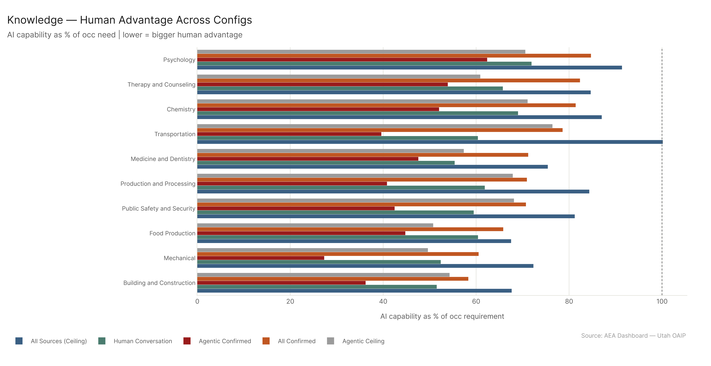

---

## 3. SKA Profile by Occupation Category

### Which Sectors Are Most AI-Subsumed?

The average AI coverage of SKA requirements differs substantially across the 22 major occupational categories.

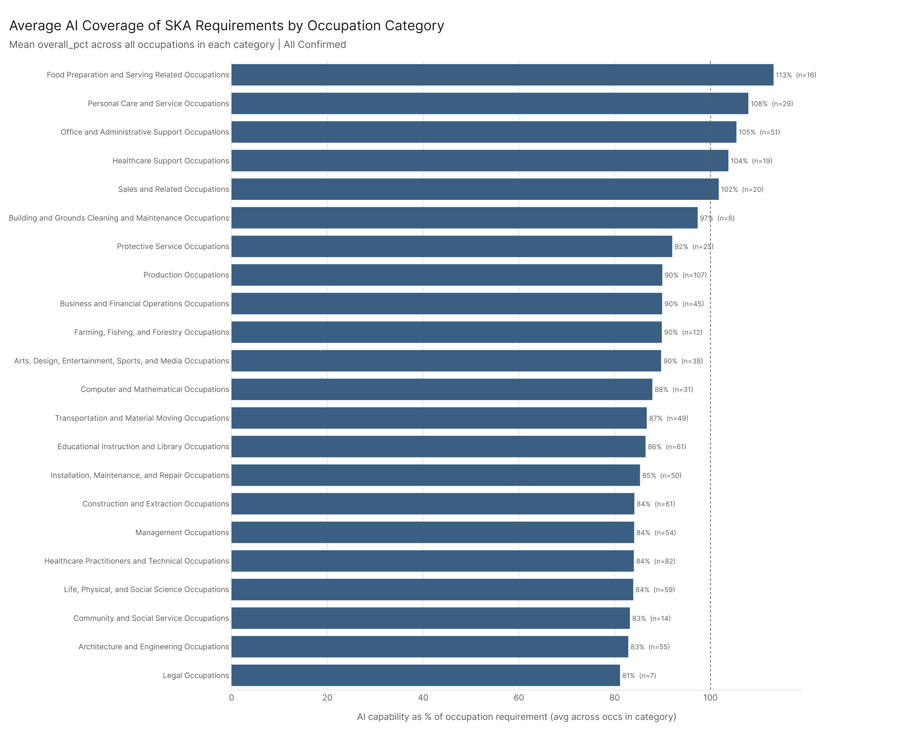

| Category | Avg AI Coverage | Skills | Abilities | Knowledge |
|----------|----------------|--------|-----------|-----------|
| Food Prep & Serving | 113% | 130% | 103% | 134% |
| Personal Care & Service | 108% | 116% | 102% | 115% |
| Office & Admin Support | 105% | 114% | 103% | 106% |
| Healthcare Support | 104% | 113% | 96% | 111% |
| Sales & Related | 102% | 100% | 102% | 106% |
| Building/Grounds Cleaning | 97% | 113% | 88% | 122% |
| Protective Service | 92% | 104% | 84% | 96% |
| Production | 90% | 103% | 82% | 107% |
| Business & Financial Ops | 90% | 92% | 87% | 93% |
| Farming, Fishing, Forestry | 90% | 109% | 81% | 121% |
| Arts, Design, Ent., Sports, Media | 90% | 100% | 82% | 101% |
| Computer & Mathematical | 88% | 90% | 85% | 91% |
| Transportation & Material Moving | 87% | 101% | 77% | 107% |
| Educational Instruction & Library | 86% | 85% | 83% | 94% |
| Installation, Maintenance, Repair | 85% | 89% | 78% | 100% |
| Construction & Extraction | 84% | 108% | 74% | 99% |
| Management | 84% | 82% | 83% | 90% |
| Healthcare Practitioners | 84% | 88% | 77% | 92% |
| Life, Physical, Social Science | 84% | 87% | 78% | 91% |
| Community & Social Service | 83% | 81% | 82% | 90% |
| Architecture & Engineering | 83% | 88% | 80% | 82% |
| Legal | 81% | 82% | 80% | 84% |

The result at the top is counterintuitive to some: Food Preparation (113%), Personal Care (108%), and Office/Admin (105%) are more AI-subsumed than Computer/Math (88%) or Healthcare Practitioners (84%). This doesn't mean food-service workers are more replaceable by current AI. It means the knowledge, skills, and abilities that their jobs formally require are relatively modest — and AI's general capability has already exceeded them. A counter worker's job demands basic communication, customer service, and food production knowledge, all of which AI covers comfortably. A software engineer's job demands deep computer science, complex problem solving, and troubleshooting precision — the formal requirements are higher, and AI is still below them in several dimensions.

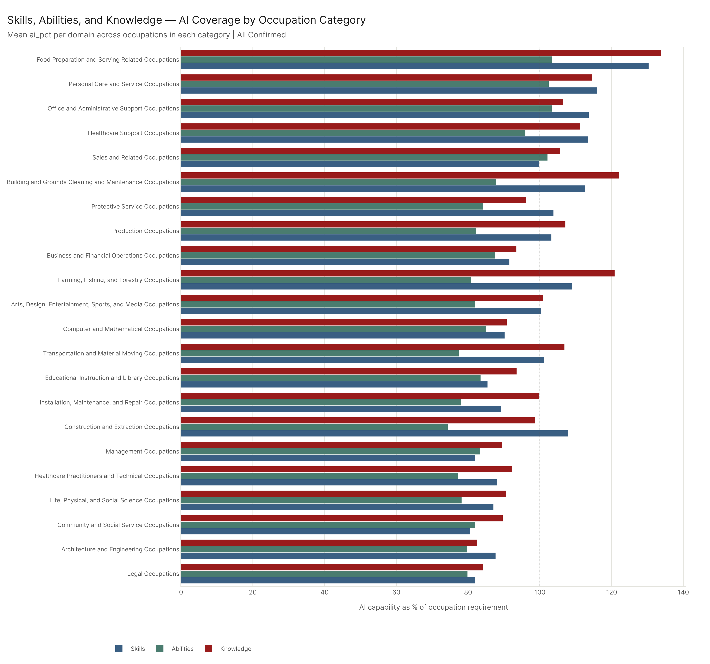

The S/A/K breakdown reveals the within-category story. Abilities are the category that keeps every sector below 100% — only Food Prep (103%) and Personal Care (102%) and Office/Admin (103%) have average abilities coverage at or above parity. Physical labor sectors — Construction (74%), Transportation (77%), Healthcare Practitioners (77%) — have the lowest abilities coverage because the physical ability requirements are high and AI can't touch them. Knowledge coverage is generally the highest domain across all categories, reflecting AI's core advantage in information recall. Skills sit in the middle everywhere.

---

## 4. Top SKA Elements Within Each Category: Where Sectors Diverge

The overall rankings — physical abilities as human territory, knowledge as AI territory — hold at the sector level too. But the specific elements that define each sector's edge differ.

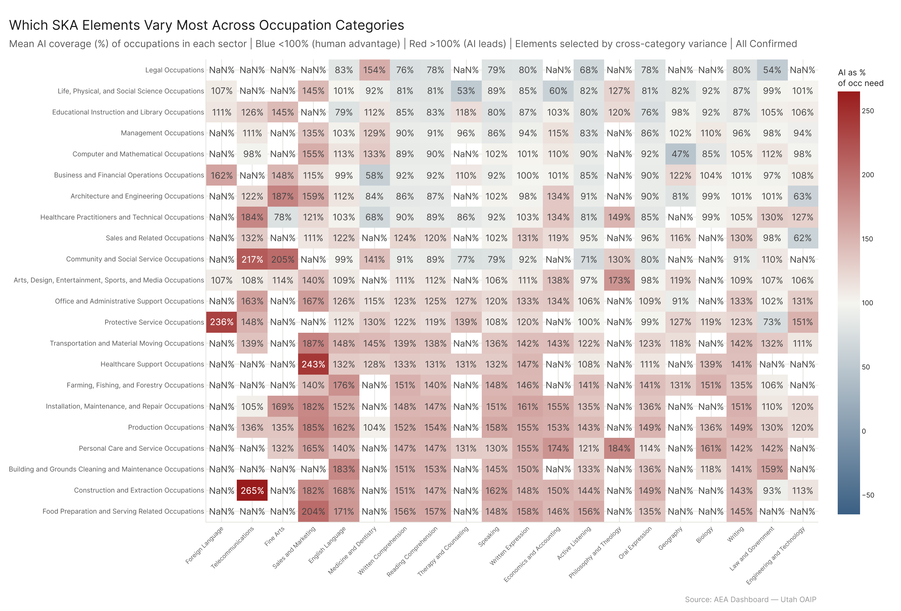

### Computer and Mathematical Occupations

The Computer/Math sector's biggest human advantages are **Operation and Control** (41%), **Geography** (47%), and **Equipment Maintenance** (57%). These are the elements where the job requires either physical control of systems or geospatial reasoning tied to physical locations. On the AI side: **Sales and Marketing** knowledge (155%) is the most-covered element — perhaps counterintuitively, but tech workers operate in commercial environments where AI's general business knowledge far exceeds their formal job requirements. **Sociology and Anthropology** (136%) and **Learning Strategies** (134%) round out the top AI-covered elements. The pattern: a software engineer's formal SKA requirements in psychology and pedagogy are modest, so AI's general capability looks very high relative to the bar.

### Healthcare Practitioners and Technical Occupations

Healthcare practitioners have physical ability gaps as their largest human advantages — **Reaction Time** (35%), **Depth Perception** (37%), **Hearing Sensitivity** (39%), **Response Orientation** (39%). These are the physical and perceptual capacities of clinical work: the steadiness for a procedure, the perception to notice something wrong, the reaction to an unexpected change in a patient's status. On the AI side, **Telecommunications** knowledge (184%) and **Communications and Media** (152%) are massive. Healthcare organizations use sophisticated communications infrastructure; the formal knowledge requirement for how it works is modest relative to AI's general depth. **Philosophy and Theology** (149%) similarly — end-of-life care and medical ethics sit in this knowledge domain, and AI's philosophical knowledge exceeds what any individual clinician's formal job description requires.

### Food Preparation and Serving

Food prep's human advantages are exclusively physical: **Static Strength** (42%), **Stamina** (43%), **Auditory Attention** (46%), **Trunk Strength** (46%). On the AI side, **Sales and Marketing** knowledge (204%), **English Language** (171%), **Written Expression** (158%), **Reading Comprehension** (157%). The formal requirements for a counter worker in language-based knowledge are modest, and AI's breadth far exceeds them. This explains why the sector has 113% overall coverage despite being physically demanding: the cognitive requirements are easily exceeded by AI, while the physical requirements are all human territory.

### Office and Administrative Support

Office/Admin's biggest human advantages are physical too — **Static Strength** (36%), **Response Orientation** (36%), **Multilimb Coordination** (38%) — reflecting that even administrative jobs include physical tasks (filing, operating equipment). AI leads most strongly in **Sales and Marketing** (167%), **Telecommunications** (163%), **Education and Training** (157%), and **Programming** (135%). The knowledge requirements for administrative work are generalist; AI's generalist training covers them comprehensively.

---

## 5. Most AI-Subsumed Occupations: Where Coverage Is Highest

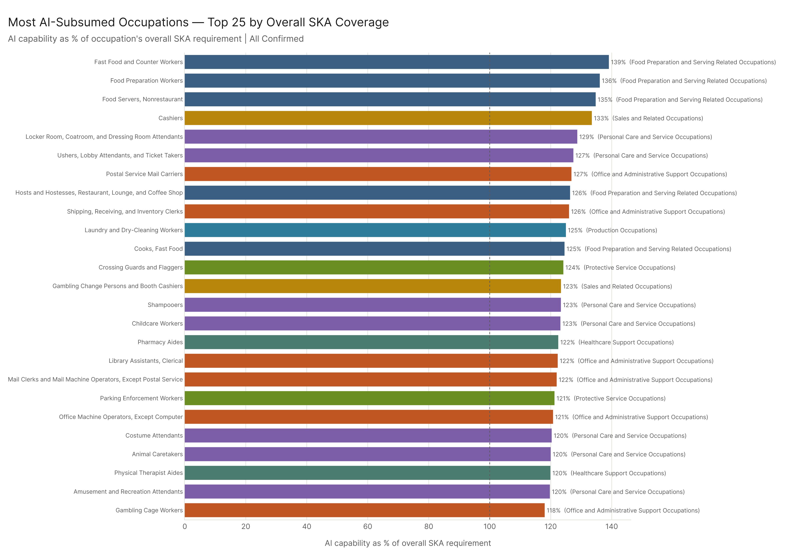

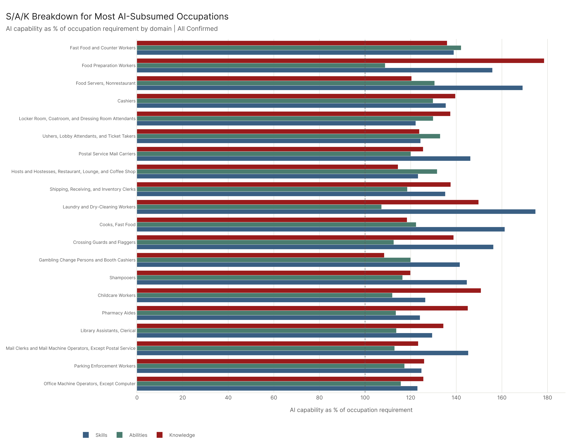

The 25 most AI-subsumed occupations (by ratio of AI capability to occupation's overall SKA requirement):

| Rank | Occupation | Category | Overall | Skills | Abilities | Knowledge |
|------|-----------|---------|---------|--------|-----------|-----------|
| 1 | Fast Food and Counter Workers | Food Prep | 139% | 139% | 142% | 136% |
| 2 | Food Preparation Workers | Food Prep | 136% | 156% | 109% | 178% |
| 3 | Food Servers, Nonrestaurant | Food Prep | 135% | 169% | 130% | 120% |
| 4 | Cashiers | Sales | 133% | 135% | 130% | 140% |
| 5 | Locker Room Attendants | Personal Care | 129% | 122% | 130% | 137% |
| 6 | Ushers, Lobby Attendants | Personal Care | 127% | 124% | 133% | 124% |
| 7 | Postal Service Mail Carriers | Office/Admin | 127% | 146% | 120% | 125% |
| 8 | Hosts and Hostesses | Food Prep | 126% | 123% | 132% | 114% |
| 9 | Shipping and Receiving Clerks | Office/Admin | 126% | 135% | 118% | 138% |
| 10 | Laundry and Dry-Cleaning Workers | Production | 125% | 175% | 107% | 150% |
| 11 | Cooks, Fast Food | Food Prep | 125% | 161% | 122% | 118% |
| 12 | Crossing Guards and Flaggers | Protective Svc | 124% | 156% | 113% | 139% |
| 13 | Gambling Change Persons | Sales | 123% | 142% | 120% | 108% |
| 14 | Shampooers | Personal Care | 123% | 145% | 116% | 120% |
| 15 | Childcare Workers | Personal Care | 123% | 126% | 112% | 151% |
| 16 | Pharmacy Aides | Healthcare Support | 122% | 124% | 113% | 145% |
| 17 | Library Assistants, Clerical | Office/Admin | 122% | 129% | 114% | 134% |
| 18 | Mail Clerks (non-Postal) | Office/Admin | 122% | 145% | 113% | 123% |
| 19 | Parking Enforcement Workers | Protective Svc | 121% | 125% | 117% | 126% |
| 20 | Office Machine Operators | Office/Admin | 121% | 123% | 116% | 126% |
| 21 | Costume Attendants | Personal Care | 120% | 119% | 113% | 138% |
| 22 | Animal Caretakers | Personal Care | 120% | 135% | 114% | 117% |
| 23 | Physical Therapist Aides | Healthcare Support | 120% | 125% | 119% | 111% |
| 24 | Amusement & Recreation Attendants | Personal Care | 120% | 142% | 112% | 114% |
| 25 | Gambling Cage Workers | Office/Admin | 118% | 126% | 112% | 121% |

The occupations at the top of this list are entry-level service roles with modest formal SKA requirements. Fast Food and Counter Workers: AI's general capability exceeds what the job formally requires across all three domains, including abilities (142%). This is partly a ceiling effect — these jobs have lower formal requirements, so AI's general capability looks large relative to the bar. But it also reflects a real pattern: the knowledge and skills these jobs require are the same generalist language, communication, and service skills that AI has acquired at very high levels.

What's notable by absence: no Computer/Math occupation appears in the top 25. Software Developers, Data Scientists, Computer Systems Analysts — these are absent because their formal SKA requirements in the technical domains are high enough that AI still falls short. A software engineer needs deep problem-solving, systems analysis, and programming precision at a level where the occupation's formal requirement still exceeds AI's demonstrated 95th-percentile capability. Counter workers do not.

This also explains the policy-relevant finding: high AI-subsumed occupations are not the same as high-AI-capability occupations. The gap between what a job requires and what AI can do depends on both the numerator (AI capability) and the denominator (the job's formal requirements). Occupations with modest formal requirements are "subsumed" at lower absolute AI capability levels.

---

## 6. Config

**Primary:** `all_confirmed` (AEI Both + Micro 2026-02-12) — all confirmed usage (conversational + API + Microsoft). September 2024 dataset anchored by Microsoft Copilot data; AEI conversation and API data accumulates from December 2024.

**Trend series:** 6 dates across `all_confirmed` series (2024-09-30 → 2026-02-12).

**Cross-config:** All five canonical configs computed for element-level and occ-level comparison.

**Method:** freq, auto-aug ON, national scope. SKA importance ≥ 3.

**SKA formula:** AI capability = 95th percentile of (pct/100 × importance × level) per element. ai_pct_occ = ai_score / occ_score × 100 per (occ, element). Category values = mean of ai_pct_occ across occupations in category.

## Files

| File | Description |
|------|-------------|
| `results/element_trends.csv` | ai_pct_eco_mean per element per date across all_confirmed series |
| `results/element_trend_gains.csv` | Total gain per element (first → last date) |
| `results/cross_config_elements.csv` | Element-level ai_pct_eco_mean across all 5 configs |
| `results/cross_config_occ_gaps.csv` | Occupation-level gaps across all 5 configs |
| `results/occ_gaps_with_category.csv` | Occ-level gaps with major category label |
| `results/element_summary_primary.csv` | Full element summary under all_confirmed |
| `results/category_summary.csv` | Average SKA metrics by major occupation category |
| `results/category_element_means.csv` | Mean ai_pct_occ per (category, element) |
| `results/category_top_elements.csv` | Top 5 human/AI advantage elements per category |
| `results/element_cross_category_variance.csv` | Elements by variance across categories |
| `results/most_subsumed_occupations.csv` | Top 25 occupations by overall_pct |
